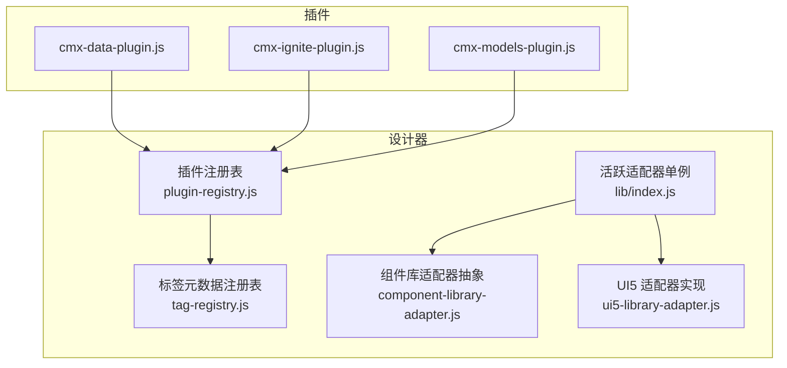
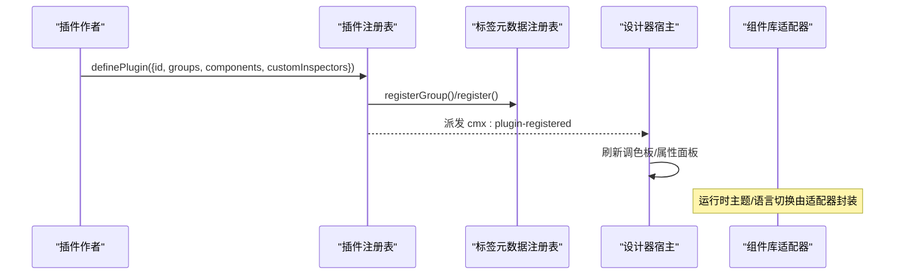
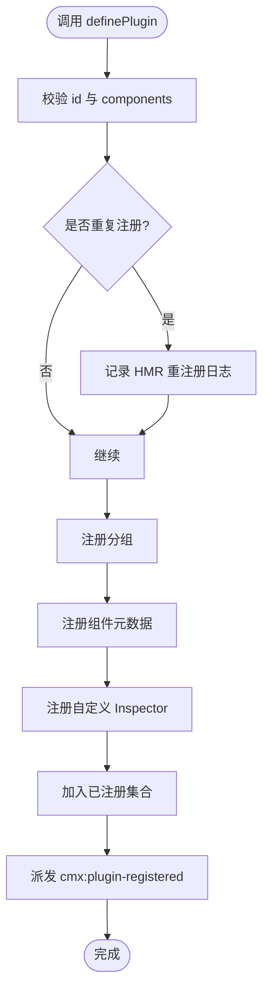
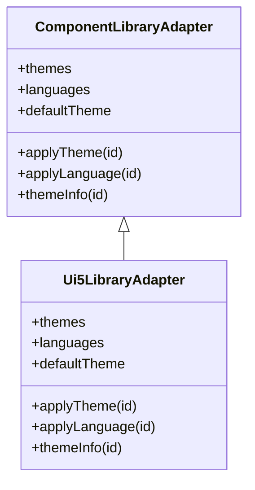
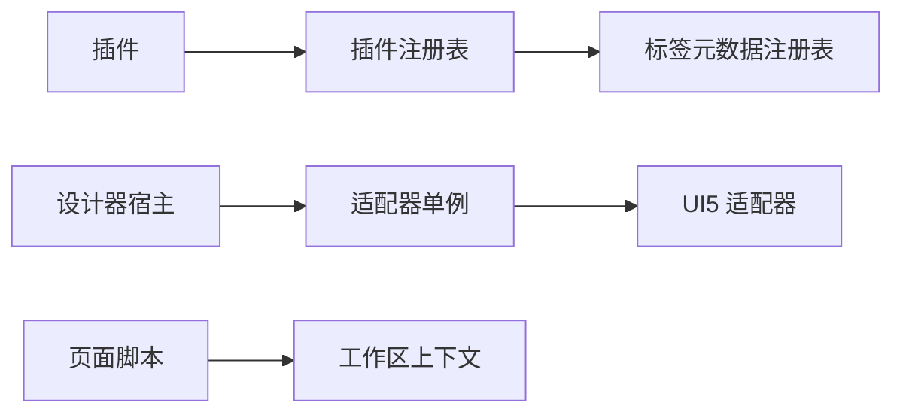

# 插件扩展系统

<cite>
**本文引用的文件**
- [plugin-registry.js](file://CMXHTMLDesigner/src/lib/plugin-registry.js)
- [tag-registry.js](file://CMXHTMLDesigner/src/metadata/tag-registry.js)
- [component-library-adapter.js](file://CMXHTMLDesigner/src/lib/component-library-adapter.js)
- [ui5-library-adapter.js](file://CMXHTMLDesigner/src/lib/ui5-library-adapter.js)
- [index.js](file://CMXHTMLDesigner/src/lib/index.js)
- [cmx-data-plugin.js](file://CMXHTMLDesigner/src/plugins/cmx-data-plugin.js)
- [cmx-ignite-plugin.js](file://CMXHTMLDesigner/src/plugins/cmx-ignite-plugin.js)
- [cmx-models-plugin.js](file://CMXHTMLDesigner/src/plugins/cmx-models-plugin.js)
- [designer-page-data-script-api-hint-html.js](file://CMXHTMLDesigner/src/components/designer-page-data/page-data-script-api-hint-html.js)
- [vite-app.js](file://packages/cmx-ui5-runtime/vite-app.js)
- [mainapp-workspace-api.md](file://CMXPortalManager/docs/mainapp-workspace-api.md)
- [js-module-page.md](file://.agents/skills/native-page-generator/references/js-module-page.md)
</cite>

## 目录
1. [简介](#简介)
2. [项目结构](#项目结构)
3. [核心组件](#核心组件)
4. [架构总览](#架构总览)
5. [详细组件分析](#详细组件分析)
6. [依赖关系分析](#依赖关系分析)
7. [性能考虑](#性能考虑)
8. [故障排查指南](#故障排查指南)
9. [结论](#结论)
10. [附录](#附录)

## 简介
本文件为 CMX 平台“插件扩展系统”的完整开发文档，面向希望扩展设计器与运行时能力的开发者。内容覆盖：
- 插件注册机制、生命周期管理与依赖注入
- 适配器模式（组件库适配器与运行时适配器）
- 插件开发规范、API 接口与扩展点定义
- 第三方组件集成、样式隔离与事件桥接
- 从简单 UI 增强到复杂业务逻辑扩展的完整示例
- 版本管理、热重载与调试支持
- 插件市场设计与发布流程建议

## 项目结构
CMX 插件体系主要位于 HTML 设计器工程内，围绕“插件注册表 + 标签元数据注册表 + 组件库适配器”构建，并通过多个内置插件完成能力装配。

图表来源
- [plugin-registry.js:1-95](file://CMXHTMLDesigner/src/lib/plugin-registry.js#L1-L95)
- [tag-registry.js:1-149](file://CMXHTMLDesigner/src/metadata/tag-registry.js#L1-L149)
- [index.js:1-7](file://CMXHTMLDesigner/src/lib/index.js#L1-L7)
- [component-library-adapter.js:1-40](file://CMXHTMLDesigner/src/lib/component-library-adapter.js#L1-L40)
- [ui5-library-adapter.js:1-40](file://CMXHTMLDesigner/src/lib/ui5-library-adapter.js#L1-L40)
- [cmx-data-plugin.js:1-747](file://CMXHTMLDesigner/src/plugins/cmx-data-plugin.js#L1-L747)
- [cmx-ignite-plugin.js:1-125](file://CMXHTMLDesigner/src/plugins/cmx-ignite-plugin.js#L1-L125)
- [cmx-models-plugin.js:1-118](file://CMXHTMLDesigner/src/plugins/cmx-models-plugin.js#L1-L118)

章节来源
- [plugin-registry.js:1-95](file://CMXHTMLDesigner/src/lib/plugin-registry.js#L1-L95)
- [tag-registry.js:1-149](file://CMXHTMLDesigner/src/metadata/tag-registry.js#L1-L149)
- [index.js:1-7](file://CMXHTMLDesigner/src/lib/index.js#L1-L7)
- [component-library-adapter.js:1-40](file://CMXHTMLDesigner/src/lib/component-library-adapter.js#L1-L40)
- [ui5-library-adapter.js:1-40](file://CMXHTMLDesigner/src/lib/ui5-library-adapter.js#L1-L40)
- [cmx-data-plugin.js:1-747](file://CMXHTMLDesigner/src/plugins/cmx-data-plugin.js#L1-L747)
- [cmx-ignite-plugin.js:1-125](file://CMXHTMLDesigner/src/plugins/cmx-ignite-plugin.js#L1-L125)
- [cmx-models-plugin.js:1-118](file://CMXHTMLDesigner/src/plugins/cmx-models-plugin.js#L1-L118)

## 核心组件
- 插件注册表（definePlugin/getCustomInspector）
  - 负责接收插件对象，校验必填字段，注册自定义组、组件元数据与自定义 Inspector，并在 window 派发 cmx:plugin-registered 事件以刷新调色板。
  - 支持 HMR 重注册：按 tag 覆盖元数据与 customInspectors，保证开发期即时生效。
- 标签元数据注册表（TagRegistry）
  - 维护标签元数据、样式组、事件预设、默认初始化行为；提供 ensureTagRegistryLoaded() 异步加载 JSON 元数据并批量注册。
- 组件库适配器（ComponentLibraryAdapter + Ui5LibraryAdapter）
  - 将主题/语言切换等运行时能力收敛至统一接口；Ui5LibraryAdapter 通过 cmx-ui5-runtime/client 调用 setTheme/setLanguage。
- 活跃适配器单例（lib/index.js）
  - 对外暴露 library 实例，替换实现只需在此处更换具体适配器类。

章节来源
- [plugin-registry.js:1-95](file://CMXHTMLDesigner/src/lib/plugin-registry.js#L1-L95)
- [tag-registry.js:1-149](file://CMXHTMLDesigner/src/metadata/tag-registry.js#L1-L149)
- [component-library-adapter.js:1-40](file://CMXHTMLDesigner/src/lib/component-library-adapter.js#L1-L40)
- [ui5-library-adapter.js:1-40](file://CMXHTMLDesigner/src/lib/ui5-library-adapter.js#L1-L40)
- [index.js:1-7](file://CMXHTMLDesigner/src/lib/index.js#L1-L7)

## 架构总览
插件系统采用“声明式元数据 + 运行时适配”的分层架构：
- 插件层：以 definePlugin 声明新增组件、分组、自定义属性面板渲染函数。
- 注册层：TagRegistry 聚合所有标签元数据，并提供懒加载与合并策略。
- 适配层：ComponentLibraryAdapter 抽象 UI5 等运行时差异，Ui5LibraryAdapter 提供具体实现。
- 宿主层：设计器监听 cmx:plugin-registered 事件刷新调色板；运行时通过 cmx-ui5-runtime 应用主题/语言。

图表来源
- [plugin-registry.js:60-89](file://CMXHTMLDesigner/src/lib/plugin-registry.js#L60-L89)
- [tag-registry.js:24-55](file://CMXHTMLDesigner/src/metadata/tag-registry.js#L24-L55)
- [ui5-library-adapter.js:25-39](file://CMXHTMLDesigner/src/lib/ui5-library-adapter.js#L25-L39)

## 详细组件分析

### 插件注册机制与生命周期
- 插件对象约定
  - id：唯一标识
  - groups：可选，新增调色板分组
  - components：必填，组件元数据数组（与 tags/*.json 格式一致）
  - customInspectors：可选，{[tag]: render(ctx)} 自定义属性面板渲染
- 生命周期要点
  - 注册阶段：校验参数 → 注册分组/元数据/自定义 Inspector → 记录已注册集合 → 派发事件
  - 重注册（HMR）：按 tag 覆盖元数据与 customInspectors，保留已有 group
  - 宿主消费：designer-left-panel 监听 cmx:plugin-registered 刷新调色板
- 自定义 Inspector 上下文
  - ctx = { node, meta, mount, pageData, onChange }
  - 用于在属性面板中挂载自定义控件，并通过 onChange 触发脏标记

图表来源
- [plugin-registry.js:60-89](file://CMXHTMLDesigner/src/lib/plugin-registry.js#L60-L89)

章节来源
- [plugin-registry.js:1-95](file://CMXHTMLDesigner/src/lib/plugin-registry.js#L1-L95)

### 标签元数据注册表
- 功能职责
  - 维护标签元数据 Map、公共属性、样式组、事件预设、内置分组
  - 提供 register/registerAll/get/getByGroups/getAll 等方法
  - 默认事件集与 extraEvents 合并策略
  - 默认初始化 defaultSetup（attributes/text/html/style）
- 懒加载
  - ensureTagRegistryLoaded() 并发 fetch common-attrs.json、style-groups.json、event-presets.json、tag-index.json，再逐个加载 tags/* 并批量注册
- 插件扩展
  - registerGroup 对同 id 自动跳过，避免重复
  - register 时合并公共属性与样式组

章节来源
- [tag-registry.js:1-149](file://CMXHTMLDesigner/src/metadata/tag-registry.js#L1-L149)

### 组件库适配器（适配器模式）
- 抽象接口 ComponentLibraryAdapter
  - themes/languages/defaultTheme：描述可用主题/语言及默认值
  - applyTheme(id)/applyLanguage(id)：通知运行时切换
  - themeInfo(id)：查询主题元信息
- 具体实现 Ui5LibraryAdapter
  - 通过 cmx-ui5-runtime/client 的 getCmxUi5RuntimeSync() 调用 setTheme/setLanguage
  - 预置 Horizon/Quartz 主题与 zh_CN/en_US 语言
- 使用方式
  - lib/index.js 导出 library 单例，替换实现仅需修改此处导入

图表来源
- [component-library-adapter.js:1-40](file://CMXHTMLDesigner/src/lib/component-library-adapter.js#L1-L40)
- [ui5-library-adapter.js:1-40](file://CMXHTMLDesigner/src/lib/ui5-library-adapter.js#L1-L40)
- [index.js:1-7](file://CMXHTMLDesigner/src/lib/index.js#L1-L7)

章节来源
- [component-library-adapter.js:1-40](file://CMXHTMLDesigner/src/lib/component-library-adapter.js#L1-L40)
- [ui5-library-adapter.js:1-40](file://CMXHTMLDesigner/src/lib/ui5-library-adapter.js#L1-L40)
- [index.js:1-7](file://CMXHTMLDesigner/src/lib/index.js#L1-L7)

### 内置插件示例
- cmx-data-plugin
  - 注册大量数据展示与编辑组件（表格、表单、树、分页、面板、工具条、状态标签、空状态、筛选条、KPI 卡等）
  - 通过 data-cmx-* 属性进行配置，运行时由组件 connectedCallback 读取
  - 提供 customInspectors 为复杂组件（如 revo-grid、ui5-form、treeview、pager）定制属性面板
- cmx-ignite-plugin
  - 注册 Ignite 系列组件（combo/list/spreadsheet/spreadjs-sheet），用于报表与选择场景
- cmx-models-plugin
  - 注册不可视数据模型（CmxDataSet/CmxMasterSlave/CmxColumnModel 等），仅出现在 Models 面板，供页面建模与脚本引用

章节来源
- [cmx-data-plugin.js:1-747](file://CMXHTMLDesigner/src/plugins/cmx-data-plugin.js#L1-L747)
- [cmx-ignite-plugin.js:1-125](file://CMXHTMLDesigner/src/plugins/cmx-ignite-plugin.js#L1-L125)
- [cmx-models-plugin.js:1-118](file://CMXHTMLDesigner/src/plugins/cmx-models-plugin.js#L1-L118)

### 运行时适配器与构建集成
- cmx-ui5-runtime Vite 插件
  - dev 模式下 external UI5，注入 runtime entry URL，dev 托管 /shared/，消除双实例问题
  - 生产模式可指定 manifestPath/runtimeDist/runtimeBase
- 主题/语言切换
  - 通过 Ui5LibraryAdapter.applyTheme/applyLanguage 调用 cmx-ui5-runtime/client 的 API 完成

章节来源
- [vite-app.js:122-149](file://packages/cmx-ui5-runtime/vite-app.js#L122-L149)
- [ui5-library-adapter.js:25-39](file://CMXHTMLDesigner/src/lib/ui5-library-adapter.js#L25-L39)

### 事件桥接与工作区上下文
- 工作区上下文（workspace.context）
  - get/set/delete/snapshot/on/off 方法，set/delete 触发 change 事件，载荷包含 key/value/oldValue
  - 适合跨视图同步选中行、状态等
- 页面脚本接口提示
  - 提供 onMount/initPage/onActivate/onDeactivate/onDispose 等生命周期钩子
  - 支持 undo/redo/save/refresh/export/import/print 等持久化与动作
  - 对话框与工作流相关 API 可通过宿主事件桥接

章节来源
- [mainapp-workspace-api.md:141-184](file://CMXPortalManager/docs/mainapp-workspace-api.md#L141-L184)
- [designer-page-data-script-api-hint-html.js:49-56](file://CMXHTMLDesigner/src/components/designer-page-data/page-data-script-api-hint-html.js#L49-L56)

### 样式隔离与第三方组件集成
- 样式隔离
  - 组件通过 shadow DOM 或 scoped CSS 隔离样式；设计器预览通过 ensureTagRegistryLoaded 加载元数据，避免样式污染
  - 主题切换通过适配器统一控制，避免硬编码主题名
- 第三方组件集成
  - 在插件中 import 第三方组件模块，再通过 definePlugin 注册其标签与属性
  - 通过 data-cmx-* 属性传递配置，运行时由组件自身解析
  - 对于复杂组件，提供 customInspectors 定制属性面板，提升设计体验

章节来源
- [cmx-data-plugin.js:1-747](file://CMXHTMLDesigner/src/plugins/cmx-data-plugin.js#L1-L747)
- [cmx-ignite-plugin.js:1-125](file://CMXHTMLDesigner/src/plugins/cmx-ignite-plugin.js#L1-L125)

### 插件开发规范与扩展点
- 插件对象结构
  - id：唯一标识
  - groups：新增分组（id/label/icon/order/collapsed）
  - components：组件元数据（tag/group/label/description/canNest/isVoid/attrs/styleGroups/eventPreset/extraEvents/defaults）
  - customInspectors：{[tag]: render(ctx)}
- 扩展点
  - 自定义属性面板渲染（customInspectors）
  - 自定义分组与排序（groups.order）
  - 事件预设与额外事件（eventPreset/extraEvents）
  - 默认初始化（defaults.attributes/text/html/style）

章节来源
- [plugin-registry.js:1-95](file://CMXHTMLDesigner/src/lib/plugin-registry.js#L1-L95)
- [tag-registry.js:1-149](file://CMXHTMLDesigner/src/metadata/tag-registry.js#L1-L149)

### 完整开发示例
- 简单 UI 增强
  - 新增一个按钮组件：import 自定义元素，definePlugin 注册 tag、group、attrs、defaults 与 styleGroups
  - 在 customInspectors 中提供属性面板渲染函数，绑定 onChange 触发脏标记
- 复杂业务逻辑扩展
  - 注册数据网格组件：声明 data-cmx-master-slave-id/data-cmx-dataset-id/data-cmx-model-id 等属性，配合 CmxMasterSlave/CmxDataSet
  - 通过 workspace.context 跨视图同步状态，结合页面脚本生命周期钩子进行异步数据加载与初始化

章节来源
- [cmx-data-plugin.js:1-747](file://CMXHTMLDesigner/src/plugins/cmx-data-plugin.js#L1-L747)
- [js-module-page.md:398-474](file://.agents/skills/native-page-generator/references/js-module-page.md#L398-L474)

### 版本管理、热重载与调试支持
- 热重载（HMR）
  - 插件重注册时按 tag 覆盖元数据与 customInspectors，无需刷新页面即可生效
- 版本管理
  - 设计器侧通过 ensureTagRegistryLoaded 懒加载元数据，可按需更新 tag-index.json 与 tags/* 实现版本演进
  - 运行时主题/语言切换由适配器统一管理，便于多版本主题兼容
- 调试支持
  - 页面脚本接口启用独立 sourceURL，调试模式自动插入 debugger;
  - 工作区上下文变更事件便于追踪状态变化

章节来源
- [plugin-registry.js:60-89](file://CMXHTMLDesigner/src/lib/plugin-registry.js#L60-L89)
- [designer-page-data-script-api-hint-html.js:49-56](file://CMXHTMLDesigner/src/components/designer-page-data/page-data-script-api-hint-html.js#L49-L56)

### 插件市场设计与发布流程（建议）
- 设计目标
  - 插件包：包含 definePlugin 调用、组件模块、自定义 Inspector、元数据 JSON（可选）
  - 清单：id、version、dependencies（如 cmx-data-comp 版本）、入口脚本
- 发布流程
  - 开发：本地通过 Vite 服务调试，利用 HMR 快速迭代
  - 打包：构建产物上传至内部仓库或 CDN
  - 安装：宿主应用引入插件脚本，调用 definePlugin 完成注册
  - 升级：通过 tag-index.json 或插件清单版本号驱动增量更新
- 治理
  - 命名空间：id 全局唯一，避免冲突
  - 兼容性：声明依赖版本范围，确保与宿主运行时兼容
  - 安全：限制自定义 Inspector 访问范围，避免直接操作宿主敏感 API

[本节为概念性说明，不直接分析具体文件]

## 依赖关系分析
- 插件对注册表的依赖
  - 所有插件均依赖 plugin-registry.js 的 definePlugin
  - 注册表依赖 tag-registry.js 的 TagRegistry 与 ensureTagRegistryLoaded
- 运行时对适配器的依赖
  - 设计器通过 lib/index.js 获取 library 单例，调用 applyTheme/applyLanguage
  - Ui5LibraryAdapter 依赖 cmx-ui5-runtime/client 的运行时 API
- 工作区上下文
  - 页面脚本通过 workspace.context 进行状态共享与事件订阅

图表来源
- [plugin-registry.js:1-95](file://CMXHTMLDesigner/src/lib/plugin-registry.js#L1-L95)
- [tag-registry.js:1-149](file://CMXHTMLDesigner/src/metadata/tag-registry.js#L1-L149)
- [index.js:1-7](file://CMXHTMLDesigner/src/lib/index.js#L1-L7)
- [ui5-library-adapter.js:1-40](file://CMXHTMLDesigner/src/lib/ui5-library-adapter.js#L1-L40)
- [mainapp-workspace-api.md:141-184](file://CMXPortalManager/docs/mainapp-workspace-api.md#L141-L184)

章节来源
- [plugin-registry.js:1-95](file://CMXHTMLDesigner/src/lib/plugin-registry.js#L1-L95)
- [tag-registry.js:1-149](file://CMXHTMLDesigner/src/metadata/tag-registry.js#L1-L149)
- [index.js:1-7](file://CMXHTMLDesigner/src/lib/index.js#L1-L7)
- [ui5-library-adapter.js:1-40](file://CMXHTMLDesigner/src/lib/ui5-library-adapter.js#L1-L40)
- [mainapp-workspace-api.md:141-184](file://CMXPortalManager/docs/mainapp-workspace-api.md#L141-L184)

## 性能考虑
- 元数据懒加载
  - ensureTagRegistryLoaded 并发 fetch 元数据，避免首屏阻塞
- 插件重注册
  - HMR 下按 tag 覆盖，减少全量重建成本
- 主题/语言切换
  - 通过适配器集中处理，避免多处重复调用
- 工作区上下文
  - 仅 set/delete 触发 change 事件，减少不必要重渲染

[本节提供通用指导，不直接分析具体文件]

## 故障排查指南
- 插件未生效
  - 检查 definePlugin 是否被调用，id 是否唯一，components 是否为空
  - 确认 ensureTagRegistryLoaded 已执行，tag-index.json 可访问
- 自定义 Inspector 不显示
  - 检查 customInspectors 中 tag 是否与组件 tag 一致
  - 确认 mount 节点存在且 onChange 正确触发
- 主题/语言切换无效
  - 检查 Ui5LibraryAdapter.applyTheme/applyLanguage 是否正确调用 cmx-ui5-runtime/client
  - 确认运行时已加载并暴露 __cmxUi5
- 工作区上下文无响应
  - 确认使用 set/delete 而非裸赋值，订阅 change 事件并过滤 key

章节来源
- [plugin-registry.js:60-89](file://CMXHTMLDesigner/src/lib/plugin-registry.js#L60-L89)
- [ui5-library-adapter.js:25-39](file://CMXHTMLDesigner/src/lib/ui5-library-adapter.js#L25-L39)
- [mainapp-workspace-api.md:141-184](file://CMXPortalManager/docs/mainapp-workspace-api.md#L141-L184)

## 结论
CMX 插件扩展系统通过声明式元数据与适配器模式，实现了设计器与运行时的解耦与可扩展性。插件以 definePlugin 为核心，结合 TagRegistry 与 ComponentLibraryAdapter，提供了丰富的扩展点与良好的开发体验。借助 HMR、调试支持与版本管理，开发者可以高效地扩展 UI 与业务逻辑，满足企业级应用的多样化需求。

[本节为总结性内容，不直接分析具体文件]

## 附录
- 常用 API 速查
  - definePlugin(plugin)：注册插件
  - getCustomInspector(tag)：获取自定义 Inspector 渲染函数
  - ensureTagRegistryLoaded()：加载并注册标签元数据
  - library.applyTheme(id)/applyLanguage(id)：切换主题/语言
  - workspace.context.get/set/delete/on/off：工作区上下文
- 参考示例
  - 数据组件插件：cmx-data-plugin.js
  - Ignite 组件插件：cmx-ignite-plugin.js
  - 模型插件：cmx-models-plugin.js

[本节为补充信息，不直接分析具体文件]