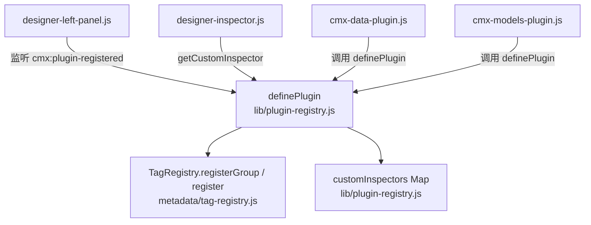
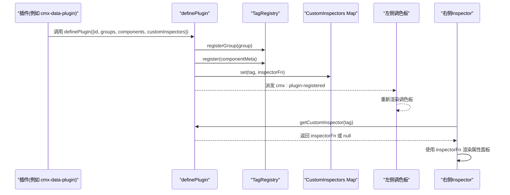
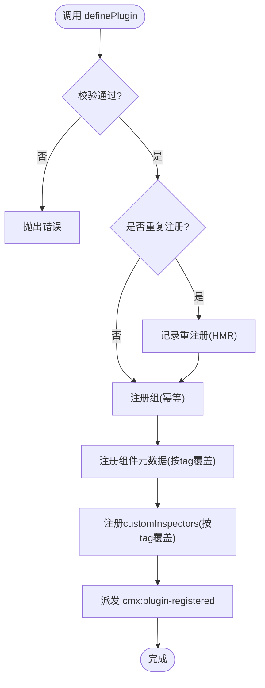
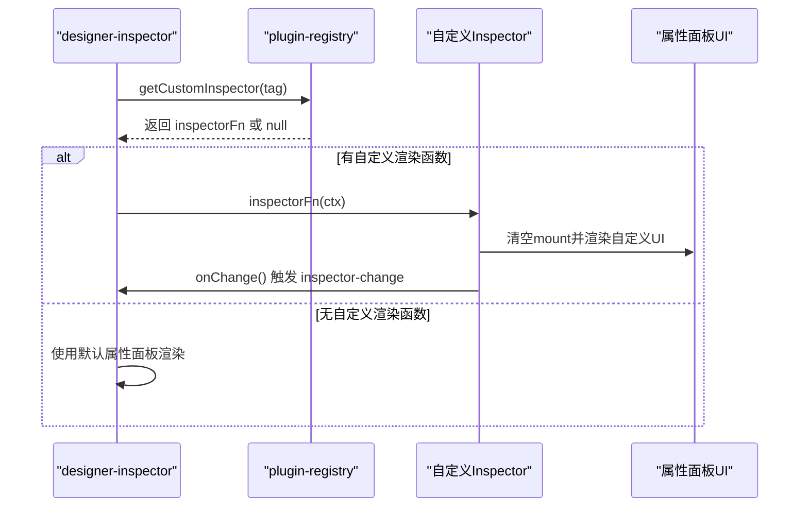
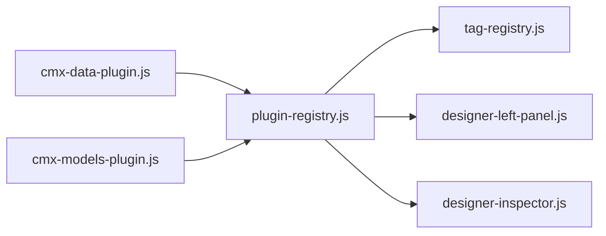

# 插件注册中心

<cite>
**本文引用的文件**
- [plugin-registry.js](file://CMXHTMLDesigner/src/lib/plugin-registry.js)
- [tag-registry.js](file://CMXHTMLDesigner/src/metadata/tag-registry.js)
- [designer-inspector.js](file://CMXHTMLDesigner/src/components/designer-inspector.js)
- [designer-left-panel.js](file://CMXHTMLDesigner/src/components/designer-left-panel.js)
- [cmx-data-plugin.js](file://CMXHTMLDesigner/src/plugins/cmx-data-plugin.js)
- [cmx-models-plugin.js](file://CMXHTMLDesigner/src/plugins/cmx-models-plugin.js)
- [build-cmx-revo-grid-inspector.js](file://CMXHTMLDesigner/src/plugins/cmx-inspector/build-cmx-revo-grid-inspector.js)
- [build-cmx-pager-inspector.js](file://CMXHTMLDesigner/src/plugins/cmx-inspector/build-cmx-pager-inspector.js)
</cite>

## 目录
1. [简介](#简介)
2. [项目结构](#项目结构)
3. [核心组件](#核心组件)
4. [架构总览](#架构总览)
5. [详细组件分析](#详细组件分析)
6. [依赖关系分析](#依赖关系分析)
7. [性能与可扩展性](#性能与可扩展性)
8. [故障排查指南](#故障排查指南)
9. [结论](#结论)
10. [附录：插件开发示例](#附录插件开发示例)

## 简介
本技术文档围绕 CMX HTML Designer 的“插件注册中心”展开，系统性说明 definePlugin API 的工作原理、插件对象结构与组管理机制、插件生命周期（从注册到热重载覆盖）、自定义 Inspector 渲染机制（含上下文参数 ctx 与事件触发）、去重策略、以及完整的插件开发与调试实践。目标是帮助开发者快速理解并扩展设计器的调色板与属性面板能力。

## 项目结构
与插件注册中心直接相关的代码主要分布在以下位置：
- 插件注册中心核心：lib/plugin-registry.js
- 标签元数据注册表：metadata/tag-registry.js
- 右侧属性面板（Inspector）：components/designer-inspector.js
- 左侧调色板（Palette）：components/designer-left-panel.js
- 内置插件示例：plugins/cmx-data-plugin.js、plugins/cmx-models-plugin.js
- 自定义 Inspector 实现：plugins/cmx-inspector/*.js

图表来源
- [plugin-registry.js:60-89](file://CMXHTMLDesigner/src/lib/plugin-registry.js#L60-L89)
- [tag-registry.js:15-55](file://CMXHTMLDesigner/src/metadata/tag-registry.js#L15-L55)
- [designer-left-panel.js:230-241](file://CMXHTMLDesigner/src/components/designer-left-panel.js#L230-L241)
- [designer-inspector.js:15-17](file://CMXHTMLDesigner/src/components/designer-inspector.js#L15-L17)
- [cmx-data-plugin.js:46-746](file://CMXHTMLDesigner/src/plugins/cmx-data-plugin.js#L46-L746)
- [cmx-models-plugin.js:39-117](file://CMXHTMLDesigner/src/plugins/cmx-models-plugin.js#L39-L117)

章节来源
- [plugin-registry.js:1-95](file://CMXHTMLDesigner/src/lib/plugin-registry.js#L1-L95)
- [tag-registry.js:1-149](file://CMXHTMLDesigner/src/metadata/tag-registry.js#L1-L149)
- [designer-left-panel.js:230-326](file://CMXHTMLDesigner/src/components/designer-left-panel.js#L230-L326)
- [designer-inspector.js:1-120](file://CMXHTMLDesigner/src/components/designer-inspector.js#L1-L120)
- [cmx-data-plugin.js:1-747](file://CMXHTMLDesigner/src/plugins/cmx-data-plugin.js#L1-L747)
- [cmx-models-plugin.js:1-118](file://CMXHTMLDesigner/src/plugins/cmx-models-plugin.js#L1-L118)

## 核心组件
- definePlugin：插件入口，负责校验、注册组、注册组件元数据、注册自定义 Inspector，并派发注册完成事件。
- TagRegistry：维护标签元数据、样式组、事件预设、分组等；提供 register/registerGroup/getByGroups 等能力。
- DesignerInspector：右侧属性/样式/事件面板，支持通过 getCustomInspector 注入自定义渲染函数。
- DesignerLeftPanel：左侧调色板，订阅 cmx:plugin-registered 事件以刷新显示。
- 插件实现：如 cmx-data-plugin、cmx-models-plugin，演示如何定义组、组件元数据和 customInspectors。

章节来源
- [plugin-registry.js:60-95](file://CMXHTMLDesigner/src/lib/plugin-registry.js#L60-L95)
- [tag-registry.js:15-110](file://CMXHTMLDesigner/src/metadata/tag-registry.js#L15-L110)
- [designer-inspector.js:170-200](file://CMXHTMLDesigner/src/components/designer-inspector.js#L170-L200)
- [designer-left-panel.js:230-326](file://CMXHTMLDesigner/src/components/designer-left-panel.js#L230-L326)
- [cmx-data-plugin.js:46-746](file://CMXHTMLDesigner/src/plugins/cmx-data-plugin.js#L46-L746)
- [cmx-models-plugin.js:39-117](file://CMXHTMLDesigner/src/plugins/cmx-models-plugin.js#L39-L117)

## 架构总览
插件注册中心采用“集中注册 + 事件驱动”的架构：
- 插件通过 definePlugin 提交元数据与可选的 customInspectors。
- 注册中心将组与组件元数据写入 TagRegistry，并将 customInspectors 存入内存映射。
- 注册完成后派发 window 事件 cmx:plugin-registered，左侧调色板监听该事件刷新 UI。
- 右侧 Inspector 在渲染属性面板时，优先查询是否存在 tag 对应的自定义渲染函数，若存在则接管渲染。

图表来源
- [plugin-registry.js:60-89](file://CMXHTMLDesigner/src/lib/plugin-registry.js#L60-L89)
- [tag-registry.js:24-55](file://CMXHTMLDesigner/src/metadata/tag-registry.js#L24-L55)
- [designer-left-panel.js:230-241](file://CMXHTMLDesigner/src/components/designer-left-panel.js#L230-L241)
- [designer-inspector.js:270-293](file://CMXHTMLDesigner/src/components/designer-inspector.js#L270-L293)

## 详细组件分析

### definePlugin API 与插件对象结构
- 必填字段：
  - id：唯一插件标识，用于去重与日志。
  - components：组件元数据数组，每个元素对应一个可拖拽到画布的标签。
- 可选字段：
  - groups：新增的调色板分组定义，包含 id、label、icon、order、collapsed 等。
  - customInspectors：可选的 { [tag]: (ctx) => void } 映射，为特定标签提供专属属性面板渲染逻辑。
- 内部行为：
  - 校验 id 与 components 非空。
  - 检测是否重复注册（HMR 场景），若重复则按 tag 覆盖元数据与 customInspectors。
  - 调用 TagRegistry.registerGroup 注册组（同 id 自动跳过）。
  - 遍历 components 调用 TagRegistry.register 注册元数据。
  - 将 customInspectors 写入内存 Map。
  - 记录已注册插件 id 集合，防止重复。
  - 派发 cmx:plugin-registered 事件，携带 pluginId、count、reRegister 信息。

章节来源
- [plugin-registry.js:1-95](file://CMXHTMLDesigner/src/lib/plugin-registry.js#L1-L95)

### 组件元数据格式与组管理
- 组件元数据（ComponentMeta）关键字段：
  - tag：标签名，作为唯一键注册到 TagRegistry。
  - group：所属分组 id。
  - label/description：展示名称与描述。
  - canNest/isVoid：是否允许嵌套、是否为自闭合标签。
  - attrs：属性定义数组，决定属性面板中的控件类型与默认值。
  - styleGroups：启用的样式组，控制样式面板可用项。
  - eventPreset/extraEvents：事件预设与额外事件列表，合并后成为该标签的事件集。
  - defaults：默认属性、文本、HTML、内联样式等，用于插入节点时的初始状态。
- 组管理（GroupDef）：
  - id：分组唯一标识。
  - label/icon/order/collapsed：分组展示与折叠状态。
  - TagRegistry.registerGroup 会忽略重复 id，保证幂等。

章节来源
- [tag-registry.js:15-55](file://CMXHTMLDesigner/src/metadata/tag-registry.js#L15-L55)
- [tag-registry.js:81-109](file://CMXHTMLDesigner/src/metadata/tag-registry.js#L81-L109)
- [cmx-data-plugin.js:46-746](file://CMXHTMLDesigner/src/plugins/cmx-data-plugin.js#L46-L746)
- [cmx-models-plugin.js:39-117](file://CMXHTMLDesigner/src/plugins/cmx-models-plugin.js#L39-L117)

### 插件生命周期与热重载支持
- 注册阶段：
  - definePlugin 执行校验与注册，更新 TagRegistry 与 customInspectors。
  - 派发 cmx:plugin-registered，左侧调色板监听并刷新。
- 运行阶段：
  - 右侧 Inspector 根据当前选中节点的 tag 查询是否有自定义渲染函数，若有则接管属性面板渲染。
- 卸载/清理：
  - 当前实现未暴露显式卸载 API；customInspectors 与 TagRegistry 中的元数据通过覆盖方式更新。
- 热重载（HMR）：
  - 当同一插件 id 再次调用 definePlugin 时，视为重注册：
    - 沿用现有分组（不重复创建）。
    - 按 tag 覆盖组件元数据与 customInspectors。
    - 控制台输出重注册日志，便于定位 HMR 生效。
  - 左侧调色板通过事件刷新，确保新元数据立即可见。

图表来源
- [plugin-registry.js:60-89](file://CMXHTMLDesigner/src/lib/plugin-registry.js#L60-L89)
- [designer-left-panel.js:230-241](file://CMXHTMLDesigner/src/components/designer-left-panel.js#L230-L241)

章节来源
- [plugin-registry.js:60-89](file://CMXHTMLDesigner/src/lib/plugin-registry.js#L60-L89)
- [designer-left-panel.js:230-241](file://CMXHTMLDesigner/src/components/designer-left-panel.js#L230-L241)

### 自定义 Inspector 渲染机制与上下文参数 ctx
- 获取机制：
  - designer-inspector 在渲染属性面板前调用 getCustomInspector(tag)，若返回函数则优先使用该函数渲染。
- 上下文参数 ctx：
  - node：当前选中的 DOM 元素。
  - meta：该标签的 ComponentMeta。
  - mount：属性面板根节点（已被清空），自定义面板需在此挂载 DOM。
  - pageData：designer-page-data 组件实例，可读 pageData/dataSources/dataFlow。
  - onChange：回调，调用后触发 inspector-change 事件，通知上层标记 dirty。
- 事件触发机制：
  - 自定义 Inspector 中修改属性后应调用 onChange，使框架感知变更并触发保存/刷新流程。
  - 对于需要局部重渲染的场景（如分页器模式切换），可在 onChange 之外自行重建 mount 内容。

图表来源
- [designer-inspector.js:270-293](file://CMXHTMLDesigner/src/components/designer-inspector.js#L270-L293)
- [plugin-registry.js:91-95](file://CMXHTMLDesigner/src/lib/plugin-registry.js#L91-L95)

章节来源
- [designer-inspector.js:270-293](file://CMXHTMLDesigner/src/components/designer-inspector.js#L270-L293)
- [plugin-registry.js:91-95](file://CMXHTMLDesigner/src/lib/plugin-registry.js#L91-L95)

### 去重逻辑与热重载支持
- 去重：
  - 使用 Set 记录已注册插件 id，避免重复注册。
  - TagRegistry.registerGroup 对同 id 分组进行幂等处理。
  - TagRegistry.register 按 tag 覆盖已有元数据，满足 HMR 覆盖需求。
- 热重载：
  - 重注册时打印日志，提示 HMR 生效。
  - 左侧调色板通过事件刷新，确保 UI 同步最新元数据。

章节来源
- [plugin-registry.js:45-89](file://CMXHTMLDesigner/src/lib/plugin-registry.js#L45-L89)
- [tag-registry.js:24-55](file://CMXHTMLDesigner/src/metadata/tag-registry.js#L24-L55)
- [designer-left-panel.js:230-241](file://CMXHTMLDesigner/src/components/designer-left-panel.js#L230-L241)

### 完整插件开发示例（注册自定义组件组与属性面板）
- 步骤概览：
  - 引入 definePlugin。
  - 定义 groups（可选）与 components（必填）。
  - 在 components 中声明 tag、group、attrs、styleGroups、defaults、extraEvents 等。
  - 如需复杂属性面板，提供 customInspectors 映射。
  - 调用 definePlugin 完成注册。
- 参考实现：
  - 数据组件插件：cmx-data-plugin.js 展示了大量组件元数据与 customInspectors 的使用。
  - 模型插件：cmx-models-plugin.js 展示了 modelOnly 类型的不可视模型注册。
  - 自定义 Inspector：build-cmx-revo-grid-inspector.js 与 build-cmx-pager-inspector.js 展示了 ctx 的使用与 onChange 的触发。

章节来源
- [cmx-data-plugin.js:46-746](file://CMXHTMLDesigner/src/plugins/cmx-data-plugin.js#L46-L746)
- [cmx-models-plugin.js:39-117](file://CMXHTMLDesigner/src/plugins/cmx-models-plugin.js#L39-L117)
- [build-cmx-revo-grid-inspector.js:20-102](file://CMXHTMLDesigner/src/plugins/cmx-inspector/build-cmx-revo-grid-inspector.js#L20-L102)
- [build-cmx-pager-inspector.js:76-180](file://CMXHTMLDesigner/src/plugins/cmx-inspector/build-cmx-pager-inspector.js#L76-L180)

## 依赖关系分析
- 插件注册中心依赖 TagRegistry 进行元数据与分组管理。
- 左侧调色板依赖 cmx:plugin-registered 事件进行刷新。
- 右侧 Inspector 依赖 getCustomInspector 获取自定义渲染函数。
- 插件实现依赖 definePlugin 进行注册，并可引入第三方组件与工具。

图表来源
- [plugin-registry.js:60-95](file://CMXHTMLDesigner/src/lib/plugin-registry.js#L60-L95)
- [tag-registry.js:15-55](file://CMXHTMLDesigner/src/metadata/tag-registry.js#L15-L55)
- [designer-left-panel.js:230-241](file://CMXHTMLDesigner/src/components/designer-left-panel.js#L230-L241)
- [designer-inspector.js:15-17](file://CMXHTMLDesigner/src/components/designer-inspector.js#L15-L17)
- [cmx-data-plugin.js:46-746](file://CMXHTMLDesigner/src/plugins/cmx-data-plugin.js#L46-L746)
- [cmx-models-plugin.js:39-117](file://CMXHTMLDesigner/src/plugins/cmx-models-plugin.js#L39-L117)

章节来源
- [plugin-registry.js:60-95](file://CMXHTMLDesigner/src/lib/plugin-registry.js#L60-L95)
- [tag-registry.js:15-55](file://CMXHTMLDesigner/src/metadata/tag-registry.js#L15-L55)
- [designer-left-panel.js:230-241](file://CMXHTMLDesigner/src/components/designer-left-panel.js#L230-L241)
- [designer-inspector.js:15-17](file://CMXHTMLDesigner/src/components/designer-inspector.js#L15-L17)
- [cmx-data-plugin.js:46-746](file://CMXHTMLDesigner/src/plugins/cmx-data-plugin.js#L46-L746)
- [cmx-models-plugin.js:39-117](file://CMXHTMLDesigner/src/plugins/cmx-models-plugin.js#L39-L117)

## 性能与可扩展性
- 性能特性：
  - 注册过程为 O(n) 遍历组件元数据，n 为组件数量，通常较小。
  - TagRegistry 使用 Map 存储元数据，查找为 O(1)。
  - 自定义 Inspector 按需加载，避免不必要的渲染开销。
- 可扩展性：
  - 通过 definePlugin 可无限扩展组件与分组。
  - customInspectors 支持任意复杂度的属性面板定制。
  - 事件驱动机制使得 UI 与注册解耦，易于扩展新的消费者。

[本节为通用指导，无需具体文件引用]

## 故障排查指南
- 常见问题与处理：
  - 插件未生效：检查 definePlugin 是否被调用、id 是否唯一、components 是否非空。
  - 属性面板未更新：确认自定义 Inspector 是否正确调用 onChange。
  - 热重载未生效：查看控制台是否输出重注册日志，确认左侧调色板是否刷新。
  - 自定义 Inspector 报错：捕获异常并记录日志，必要时降级到默认面板。
- 调试技巧：
  - 在自定义 Inspector 中使用 console.log 输出 ctx 与关键状态。
  - 利用 designer-inspector 的 log 方法写入调试日志。
  - 通过浏览器事件监听器观察 cmx:plugin-registered 事件触发时机。

章节来源
- [plugin-registry.js:60-89](file://CMXHTMLDesigner/src/lib/plugin-registry.js#L60-L89)
- [designer-inspector.js:120-135](file://CMXHTMLDesigner/src/components/designer-inspector.js#L120-L135)
- [designer-left-panel.js:230-241](file://CMXHTMLDesigner/src/components/designer-left-panel.js#L230-L241)

## 结论
插件注册中心通过 definePlugin 提供了简洁而强大的扩展点，结合 TagRegistry 的元数据管理与事件驱动的 UI 刷新机制，实现了灵活的组件注册与属性面板定制。其去重与热重载支持确保了开发体验与稳定性。开发者可通过遵循本文档的规范与示例，快速构建高质量的自定义组件与属性面板。

[本节为总结，无需具体文件引用]

## 附录：插件开发示例
- 目标：注册一个自定义组件组与若干组件，并为其中一个组件提供自定义属性面板。
- 步骤：
  - 引入 definePlugin。
  - 定义 groups 与 components。
  - 在 components 中声明 tag、group、attrs、styleGroups、defaults、extraEvents。
  - 编写 customInspector 函数，使用 ctx.node、ctx.mount、ctx.onChange。
  - 调用 definePlugin 完成注册。
- 参考路径：
  - 插件注册：cmx-data-plugin.js
  - 自定义 Inspector：build-cmx-revo-grid-inspector.js、build-cmx-pager-inspector.js

章节来源
- [cmx-data-plugin.js:46-746](file://CMXHTMLDesigner/src/plugins/cmx-data-plugin.js#L46-L746)
- [build-cmx-revo-grid-inspector.js:20-102](file://CMXHTMLDesigner/src/plugins/cmx-inspector/build-cmx-revo-grid-inspector.js#L20-L102)
- [build-cmx-pager-inspector.js:76-180](file://CMXHTMLDesigner/src/plugins/cmx-inspector/build-cmx-pager-inspector.js#L76-L180)