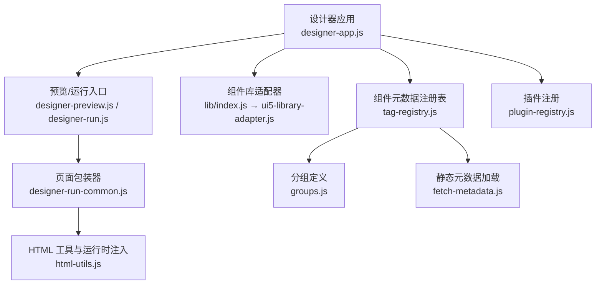
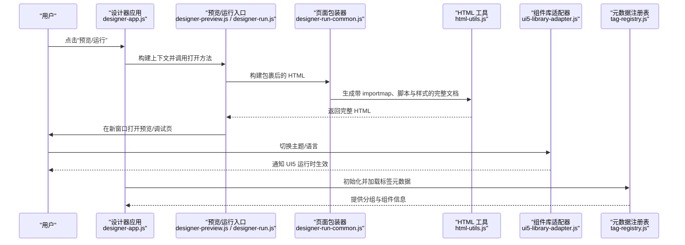
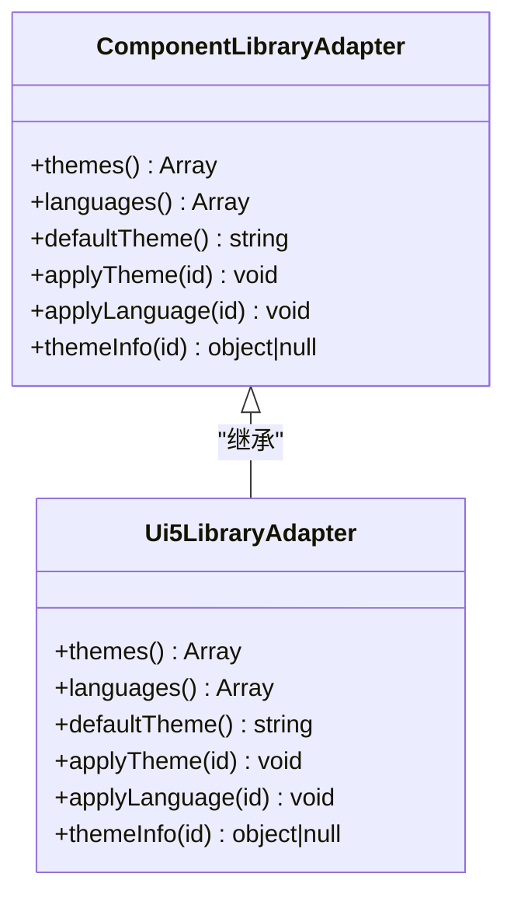
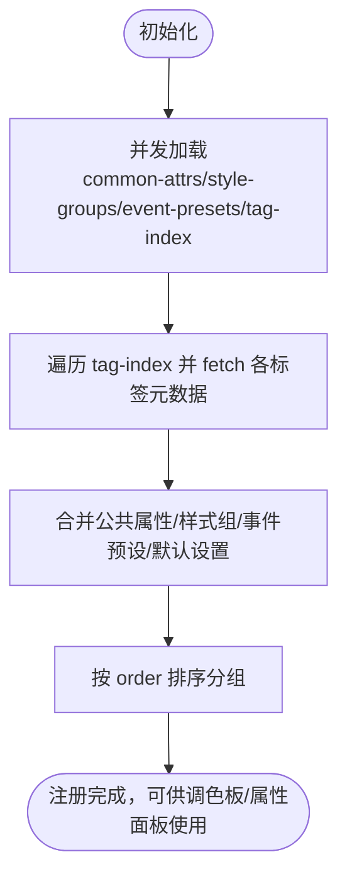
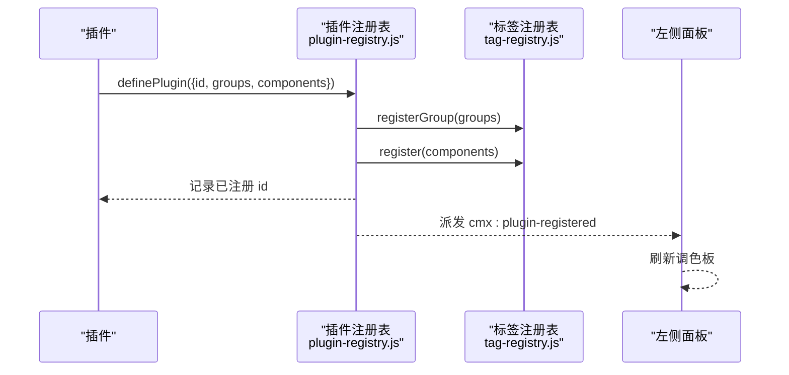
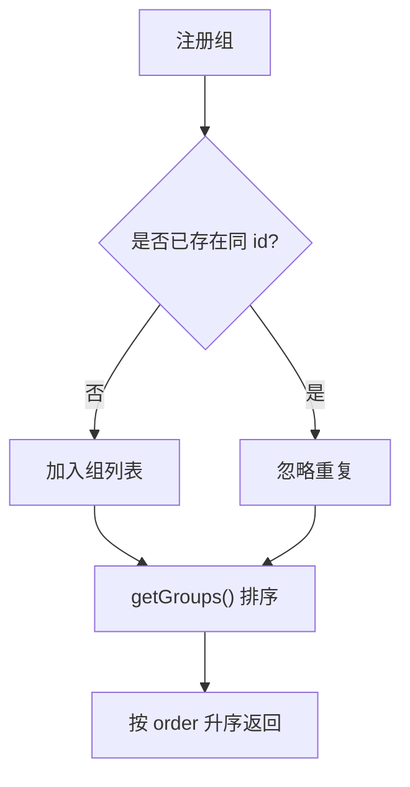
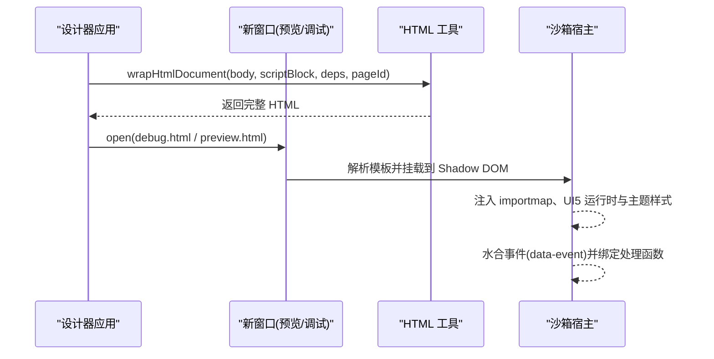
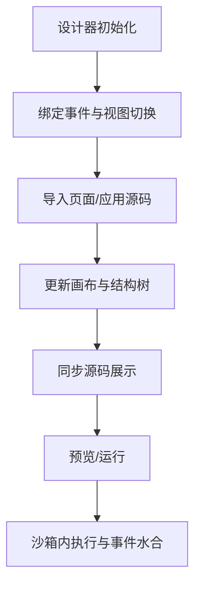
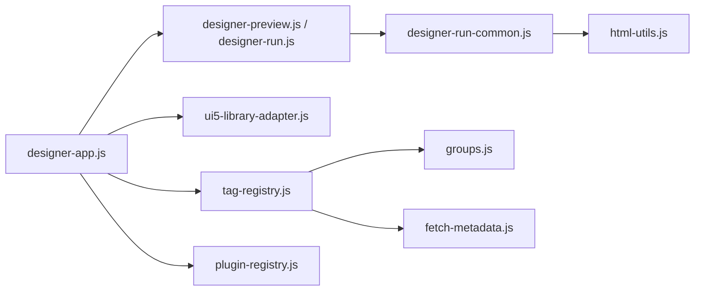

# 组件库适配器

<cite>
**本文引用的文件**
- [component-library-adapter.js](file://CMXHTMLDesigner/src/lib/component-library-adapter.js)
- [ui5-library-adapter.js](file://CMXHTMLDesigner/src/lib/ui5-library-adapter.js)
- [index.js](file://CMXHTMLDesigner/src/lib/index.js)
- [tag-registry.js](file://CMXHTMLDesigner/src/metadata/tag-registry.js)
- [groups.js](file://CMXHTMLDesigner/src/metadata/groups.js)
- [fetch-metadata.js](file://CMXHTMLDesigner/src/metadata/fetch-metadata.js)
- [plugin-registry.js](file://CMXHTMLDesigner/src/lib/plugin-registry.js)
- [html-utils.js](file://CMXHTMLDesigner/src/utils/html-utils.js)
- [designer-preview.js](file://CMXHTMLDesigner/src/components/designer-app/designer-preview.js)
- [designer-run-common.js](file://CMXHTMLDesigner/src/components/designer-app/designer-run-common.js)
- [designer-run.js](file://CMXHTMLDesigner/src/components/designer-app/designer-run.js)
- [designer-app.js](file://CMXHTMLDesigner/src/components/designer-app.js)
</cite>

## 目录
1. [简介](#简介)
2. [项目结构](#项目结构)
3. [核心组件](#核心组件)
4. [架构总览](#架构总览)
5. [详细组件分析](#详细组件分析)
6. [依赖关系分析](#依赖关系分析)
7. [性能考量](#性能考量)
8. [故障排查指南](#故障排查指南)
9. [结论](#结论)
10. [附录](#附录)

## 简介
本文件围绕“组件库适配器”在组件系统集成中的应用，系统阐述适配器模式、组件发现机制、元数据映射与运行时绑定；并完整描述组件库的加载流程（从静态资源获取到动态注册）、分组管理与排序算法、预览功能的沙箱隔离与样式注入原理，以及第三方组件集成的最佳实践、版本管理与依赖冲突解决方案。

## 项目结构
该子系统位于 HTML 设计器前端工程中，主要包含：
- 适配层抽象与实现：定义统一的组件库接口，并提供 SAP UI5 的具体实现。
- 组件元数据注册表：负责标签/组件的发现、分组、排序与默认行为配置。
- 插件注册机制：支持动态扩展组件组与组件元数据，并触发 UI 刷新。
- 运行期包装与预览：将设计区内容封装为可独立运行的页面，提供沙箱隔离与样式注入。

**图表来源**
- [designer-app.js:75-196](file://CMXHTMLDesigner/src/components/designer-app.js#L75-L196)
- [designer-preview.js:14-26](file://CMXHTMLDesigner/src/components/designer-app/designer-preview.js#L14-L26)
- [designer-run.js:13-51](file://CMXHTMLDesigner/src/components/designer-app/designer-run.js#L13-L51)
- [designer-run-common.js:10-21](file://CMXHTMLDesigner/src/components/designer-app/designer-run-common.js#L10-L21)
- [html-utils.js:237-367](file://CMXHTMLDesigner/src/utils/html-utils.js#L237-L367)
- [index.js:1-8](file://CMXHTMLDesigner/src/lib/index.js#L1-L8)
- [ui5-library-adapter.js:25-39](file://CMXHTMLDesigner/src/lib/ui5-library-adapter.js#L25-L39)
- [tag-registry.js:15-149](file://CMXHTMLDesigner/src/metadata/tag-registry.js#L15-L149)
- [groups.js:5-31](file://CMXHTMLDesigner/src/metadata/groups.js#L5-L31)
- [fetch-metadata.js:1-21](file://CMXHTMLDesigner/src/metadata/fetch-metadata.js#L1-L21)
- [plugin-registry.js:60-94](file://CMXHTMLDesigner/src/lib/plugin-registry.js#L60-L94)

**章节来源**
- [designer-app.js:75-196](file://CMXHTMLDesigner/src/components/designer-app.js#L75-L196)
- [designer-preview.js:14-26](file://CMXHTMLDesigner/src/components/designer-app/designer-preview.js#L14-L26)
- [designer-run.js:13-51](file://CMXHTMLDesigner/src/components/designer-app/designer-run.js#L13-L51)
- [designer-run-common.js:10-21](file://CMXHTMLDesigner/src/components/designer-app/designer-run-common.js#L10-L21)
- [html-utils.js:237-367](file://CMXHTMLDesigner/src/utils/html-utils.js#L237-L367)
- [index.js:1-8](file://CMXHTMLDesigner/src/lib/index.js#L1-L8)
- [ui5-library-adapter.js:25-39](file://CMXHTMLDesigner/src/lib/ui5-library-adapter.js#L25-L39)
- [tag-registry.js:15-149](file://CMXHTMLDesigner/src/metadata/tag-registry.js#L15-L149)
- [groups.js:5-31](file://CMXHTMLDesigner/src/metadata/groups.js#L5-L31)
- [fetch-metadata.js:1-21](file://CMXHTMLDesigner/src/metadata/fetch-metadata.js#L1-L21)
- [plugin-registry.js:60-94](file://CMXHTMLDesigner/src/lib/plugin-registry.js#L60-L94)

## 核心组件
- 组件库适配器抽象与实现
  - 抽象接口：统一主题、语言、默认主题与查询能力，屏蔽具体 UI 库差异。
  - UI5 实现：维护主题与语言列表，调用运行时切换主题与语言，并提供主题元信息查询。
  - 单例导出：通过模块级单例暴露给设计器使用。
- 组件元数据注册表
  - 负责标签/组件元数据的加载、合并、分组与排序。
  - 支持内置与插件扩展的组管理，按 order 升序排列。
  - 提供按组查询、全量查询、事件预设与样式组过滤等能力。
- 插件注册机制
  - 允许外部以插件形式注册自定义组件组与组件元数据。
  - 支持自定义 Inspector 渲染函数，并在注册完成后派发事件以刷新调色板。
- 运行期页面包装与预览
  - 将设计区 HTML 包裹为独立可运行文档，注入 importmap、UI5 运行时与主题样式。
  - 通过 Shadow DOM 与自定义元素实现沙箱隔离，避免污染全局环境。
  - 支持脚本块与依赖声明，便于调试与多页批量运行。

**章节来源**
- [component-library-adapter.js:17-39](file://CMXHTMLDesigner/src/lib/component-library-adapter.js#L17-L39)
- [ui5-library-adapter.js:25-39](file://CMXHTMLDesigner/src/lib/ui5-library-adapter.js#L25-L39)
- [index.js:1-8](file://CMXHTMLDesigner/src/lib/index.js#L1-L8)
- [tag-registry.js:15-149](file://CMXHTMLDesigner/src/metadata/tag-registry.js#L15-L149)
- [plugin-registry.js:60-94](file://CMXHTMLDesigner/src/lib/plugin-registry.js#L60-L94)
- [html-utils.js:237-367](file://CMXHTMLDesigner/src/utils/html-utils.js#L237-L367)

## 架构总览
下图展示了从设计器到运行时的整体交互：设计器通过适配器控制 UI5 主题/语言；通过元数据注册表发现与组织组件；通过页面包装生成可运行文档；预览窗口在沙箱中执行并注入样式。

**图表来源**
- [designer-app.js:286-290](file://CMXHTMLDesigner/src/components/designer-app.js#L286-L290)
- [designer-preview.js:14-26](file://CMXHTMLDesigner/src/components/designer-app/designer-preview.js#L14-L26)
- [designer-run.js:13-51](file://CMXHTMLDesigner/src/components/designer-app/designer-run.js#L13-L51)
- [designer-run-common.js:10-21](file://CMXHTMLDesigner/src/components/designer-app/designer-run-common.js#L10-L21)
- [html-utils.js:237-367](file://CMXHTMLDesigner/src/utils/html-utils.js#L237-L367)
- [ui5-library-adapter.js:25-39](file://CMXHTMLDesigner/src/lib/ui5-library-adapter.js#L25-L39)
- [tag-registry.js:123-149](file://CMXHTMLDesigner/src/metadata/tag-registry.js#L123-L149)

## 详细组件分析

### 组件库适配器（抽象与 UI5 实现）
- 抽象接口定义了主题、语言、默认主题与查询方法，确保替换 UI 库时无需改动业务代码。
- UI5 实现维护主题与语言常量，调用运行时 API 切换主题与语言，并提供主题元数据查询。
- 模块级单例导出，供设计器全局使用。

**图表来源**
- [component-library-adapter.js:17-39](file://CMXHTMLDesigner/src/lib/component-library-adapter.js#L17-L39)
- [ui5-library-adapter.js:25-39](file://CMXHTMLDesigner/src/lib/ui5-library-adapter.js#L25-L39)

**章节来源**
- [component-library-adapter.js:17-39](file://CMXHTMLDesigner/src/lib/component-library-adapter.js#L17-L39)
- [ui5-library-adapter.js:25-39](file://CMXHTMLDesigner/src/lib/ui5-library-adapter.js#L25-L39)
- [index.js:1-8](file://CMXHTMLDesigner/src/lib/index.js#L1-L8)

### 组件发现机制与元数据映射
- 元数据加载：启动时并发拉取通用属性、样式组、事件预设与标签索引，再按需拉取各标签元数据并注册。
- 分组管理：内置分组与插件扩展分组统一纳入注册表，按 order 升序排序输出。
- 元数据映射：每个标签元数据合并公共属性、样式组、事件预设与默认设置，缺失时提供兜底默认值。

**图表来源**
- [tag-registry.js:123-149](file://CMXHTMLDesigner/src/metadata/tag-registry.js#L123-L149)
- [fetch-metadata.js:10-20](file://CMXHTMLDesigner/src/metadata/fetch-metadata.js#L10-L20)
- [groups.js:5-31](file://CMXHTMLDesigner/src/metadata/groups.js#L5-L31)

**章节来源**
- [tag-registry.js:15-149](file://CMXHTMLDesigner/src/metadata/tag-registry.js#L15-L149)
- [fetch-metadata.js:1-21](file://CMXHTMLDesigner/src/metadata/fetch-metadata.js#L1-L21)
- [groups.js:5-31](file://CMXHTMLDesigner/src/metadata/groups.js#L5-L31)

### 插件注册与动态扩展
- 插件对象包含唯一 id、可选的自定义组定义与组件元数据数组。
- 注册过程会合并自定义组、覆盖同名组件元数据，并支持注册自定义 Inspector 渲染函数。
- 注册完成后派发事件，左侧调色板监听后自动刷新。

**图表来源**
- [plugin-registry.js:60-94](file://CMXHTMLDesigner/src/lib/plugin-registry.js#L60-L94)
- [tag-registry.js:30-41](file://CMXHTMLDesigner/src/metadata/tag-registry.js#L30-L41)

**章节来源**
- [plugin-registry.js:60-94](file://CMXHTMLDesigner/src/lib/plugin-registry.js#L60-L94)
- [tag-registry.js:30-41](file://CMXHTMLDesigner/src/metadata/tag-registry.js#L30-L41)

### 组件分组管理与排序算法
- 分组由内置定义与插件扩展共同组成，重复 id 的组会被忽略。
- 排序规则：按分组的 order 字段升序排列，未指定则使用默认值。
- 查询接口支持按组筛选、按组聚合与全量获取。

**图表来源**
- [tag-registry.js:30-41](file://CMXHTMLDesigner/src/metadata/tag-registry.js#L30-L41)
- [groups.js:5-31](file://CMXHTMLDesigner/src/metadata/groups.js#L5-L31)

**章节来源**
- [tag-registry.js:30-41](file://CMXHTMLDesigner/src/metadata/tag-registry.js#L30-L41)
- [groups.js:5-31](file://CMXHTMLDesigner/src/metadata/groups.js#L5-L31)

### 组件预览与沙箱隔离、样式注入
- 预览入口将设计区 HTML 包装为完整文档，注入 importmap、UI5 运行时与主题样式。
- 通过自定义元素与 Shadow DOM 隔离宿主环境，避免全局污染。
- 事件水合：基于 data-event 属性编译并绑定事件处理函数，支持调试模式下的断点注入。
- 支持多页批量运行与调试会话持久化。

**图表来源**
- [designer-preview.js:14-26](file://CMXHTMLDesigner/src/components/designer-app/designer-preview.js#L14-L26)
- [designer-run.js:13-51](file://CMXHTMLDesigner/src/components/designer-app/designer-run.js#L13-L51)
- [designer-run-common.js:10-21](file://CMXHTMLDesigner/src/components/designer-app/designer-run-common.js#L10-L21)
- [html-utils.js:237-367](file://CMXHTMLDesigner/src/utils/html-utils.js#L237-L367)

**章节来源**
- [designer-preview.js:14-26](file://CMXHTMLDesigner/src/components/designer-app/designer-preview.js#L14-L26)
- [designer-run.js:13-51](file://CMXHTMLDesigner/src/components/designer-app/designer-run.js#L13-L51)
- [designer-run-common.js:10-21](file://CMXHTMLDesigner/src/components/designer-app/designer-run-common.js#L10-L21)
- [html-utils.js:237-367](file://CMXHTMLDesigner/src/utils/html-utils.js#L237-L367)

### 运行时绑定与生命周期
- 设计器主应用协调画布、源码、属性面板与数据面板，建立事件总线式通信。
- 导入/保存/预览/运行等操作均通过统一上下文传递，保证行为一致。
- 源码与应用到画布的同步采用去重与延迟刷新策略，降低频繁变更带来的卡顿。

**图表来源**
- [designer-app.js:75-196](file://CMXHTMLDesigner/src/components/designer-app.js#L75-L196)
- [designer-app.js:320-345](file://CMXHTMLDesigner/src/components/designer-app.js#L320-L345)
- [designer-app.js:558-618](file://CMXHTMLDesigner/src/components/designer-app.js#L558-L618)

**章节来源**
- [designer-app.js:75-196](file://CMXHTMLDesigner/src/components/designer-app.js#L75-L196)
- [designer-app.js:320-345](file://CMXHTMLDesigner/src/components/designer-app.js#L320-L345)
- [designer-app.js:558-618](file://CMXHTMLDesigner/src/components/designer-app.js#L558-L618)

## 依赖关系分析
- 设计器应用依赖预览/运行入口、HTML 工具、组件库适配器与元数据注册表。
- 预览/运行入口依赖页面包装器与 HTML 工具。
- 页面包装器依赖 HTML 工具进行 importmap、脚本与样式注入。
- 元数据注册表依赖分组定义与静态元数据加载器。
- 插件注册表依赖元数据注册表，用于扩展组件与组。

**图表来源**
- [designer-app.js:75-196](file://CMXHTMLDesigner/src/components/designer-app.js#L75-L196)
- [designer-preview.js:14-26](file://CMXHTMLDesigner/src/components/designer-app/designer-preview.js#L14-L26)
- [designer-run.js:13-51](file://CMXHTMLDesigner/src/components/designer-app/designer-run.js#L13-L51)
- [designer-run-common.js:10-21](file://CMXHTMLDesigner/src/components/designer-app/designer-run-common.js#L10-L21)
- [html-utils.js:237-367](file://CMXHTMLDesigner/src/utils/html-utils.js#L237-L367)
- [ui5-library-adapter.js:25-39](file://CMXHTMLDesigner/src/lib/ui5-library-adapter.js#L25-L39)
- [tag-registry.js:123-149](file://CMXHTMLDesigner/src/metadata/tag-registry.js#L123-L149)
- [groups.js:5-31](file://CMXHTMLDesigner/src/metadata/groups.js#L5-L31)
- [fetch-metadata.js:1-21](file://CMXHTMLDesigner/src/metadata/fetch-metadata.js#L1-L21)
- [plugin-registry.js:60-94](file://CMXHTMLDesigner/src/lib/plugin-registry.js#L60-L94)

**章节来源**
- [designer-app.js:75-196](file://CMXHTMLDesigner/src/components/designer-app.js#L75-L196)
- [designer-preview.js:14-26](file://CMXHTMLDesigner/src/components/designer-app/designer-preview.js#L14-L26)
- [designer-run.js:13-51](file://CMXHTMLDesigner/src/components/designer-app/designer-run.js#L13-L51)
- [designer-run-common.js:10-21](file://CMXHTMLDesigner/src/components/designer-app/designer-run-common.js#L10-L21)
- [html-utils.js:237-367](file://CMXHTMLDesigner/src/utils/html-utils.js#L237-L367)
- [ui5-library-adapter.js:25-39](file://CMXHTMLDesigner/src/lib/ui5-library-adapter.js#L25-L39)
- [tag-registry.js:123-149](file://CMXHTMLDesigner/src/metadata/tag-registry.js#L123-L149)
- [groups.js:5-31](file://CMXHTMLDesigner/src/metadata/groups.js#L5-L31)
- [fetch-metadata.js:1-21](file://CMXHTMLDesigner/src/metadata/fetch-metadata.js#L1-L21)
- [plugin-registry.js:60-94](file://CMXHTMLDesigner/src/lib/plugin-registry.js#L60-L94)

## 性能考量
- 元数据并发加载：通过 Promise.all 并发拉取基础元数据与标签索引，减少首屏等待时间。
- 分组排序开销：分组数量通常较小，排序复杂度低，对性能影响可忽略。
- 预览/运行 HTML 构建：仅构建必要依赖与样式，避免冗余注入；importmap 固定条目集中管理，利于缓存。
- 刷新节流：设计器内部使用 requestAnimationFrame 合并多次变更，降低拖拽与编辑时的重排成本。
- 事件水合：仅在需要时编译并绑定事件，避免不必要的 Function 构造。

[本节为通用性能建议，不直接分析具体文件]

## 故障排查指南
- 元数据加载失败
  - 现象：无法显示组件或分组为空。
  - 排查：检查 metadata 路径与构建产物是否可用；确认 fetch 请求状态码与响应体。
  - 参考位置：元数据加载器抛出错误提示。
- 预览窗口被拦截
  - 现象：点击预览无反应。
  - 排查：浏览器弹出拦截策略；提示用户允许弹窗并重试。
  - 参考位置：预览入口检测 window.open 返回值并给出提示。
- 主题/语言未生效
  - 现象：切换主题或语言后界面未变化。
  - 排查：确认适配器是否正确调用运行时 API；检查运行时实例是否存在。
  - 参考位置：UI5 适配器调用运行时 setTheme/setLanguage。
- 事件不触发
  - 现象：data-event 绑定的代码未执行。
  - 排查：确认事件水合逻辑是否执行；检查事件名称与属性名；查看调试模式下生成的 sourceURL。
  - 参考位置：HTML 工具中的事件水合与调试注入。
- 源码应用到画布失败
  - 现象：应用源码后画布无变化或报错。
  - 排查：检查 __designer_meta__ 是否存在且合法；确认 HTML 片段是否包含整页外壳导致嵌套模板；查看源码与画布同步逻辑。
  - 参考位置：设计器应用的事件处理与源码应用流程。

**章节来源**
- [fetch-metadata.js:10-20](file://CMXHTMLDesigner/src/metadata/fetch-metadata.js#L10-L20)
- [designer-preview.js:14-26](file://CMXHTMLDesigner/src/components/designer-app/designer-preview.js#L14-L26)
- [ui5-library-adapter.js:25-39](file://CMXHTMLDesigner/src/lib/ui5-library-adapter.js#L25-L39)
- [html-utils.js:320-367](file://CMXHTMLDesigner/src/utils/html-utils.js#L320-L367)
- [designer-app.js:463-495](file://CMXHTMLDesigner/src/components/designer-app.js#L463-L495)

## 结论
组件库适配器通过抽象接口与具体实现解耦了 UI 库差异，配合元数据注册表与插件机制实现了组件的动态发现与扩展；预览功能借助沙箱隔离与样式注入保证了运行环境的稳定性与一致性。通过合理的加载策略与刷新节流，系统在易用性与性能之间取得平衡。对于第三方集成，建议遵循插件规范、明确版本约束与依赖声明，并通过测试验证兼容性。

[本节为总结性内容，不直接分析具体文件]

## 附录
- 第三方组件集成最佳实践
  - 使用插件注册机制扩展组件组与元数据，保持与内置组件一致的体验。
  - 在插件中声明依赖与样式，确保运行时可正确加载。
  - 提供自定义 Inspector 以提升属性编辑体验。
- 版本管理与依赖冲突
  - 通过 importmap 固定 UI5 运行时版本，避免多版本冲突。
  - 插件与组件元数据按 tag 覆盖，便于热更新与回滚。
  - 建议在发布前进行批量预览与回归测试，确保多页场景稳定。

[本节为补充说明，不直接分析具体文件]