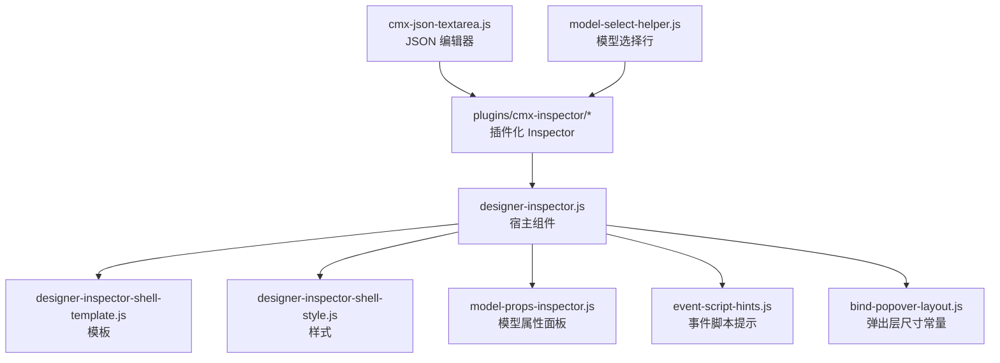
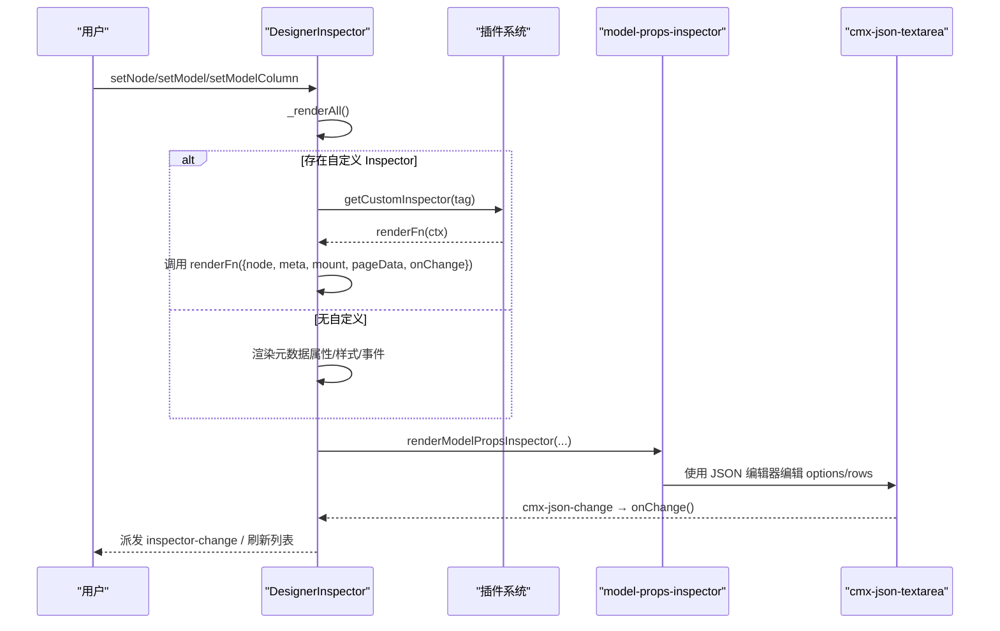
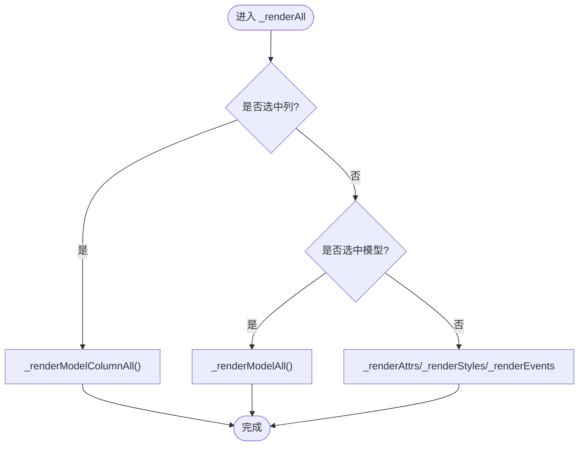
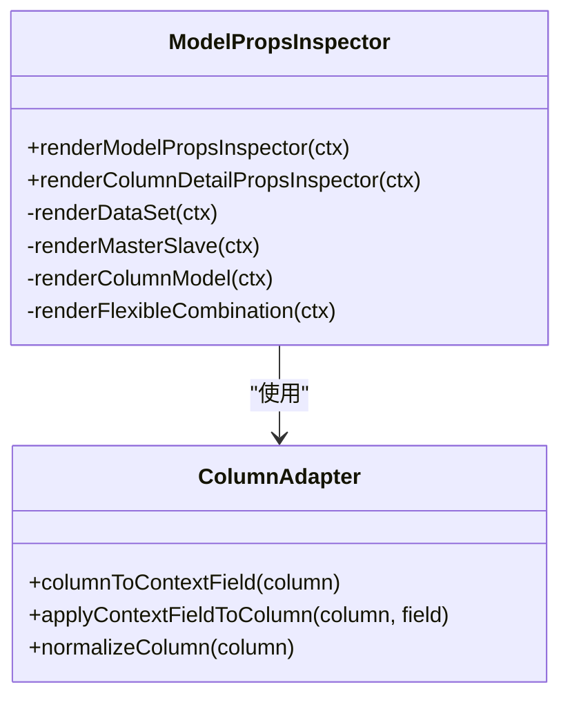
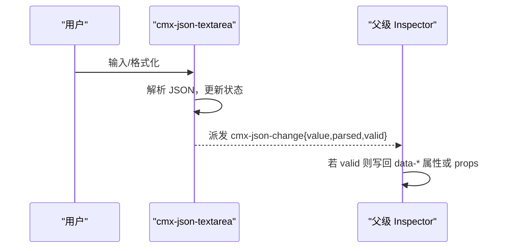
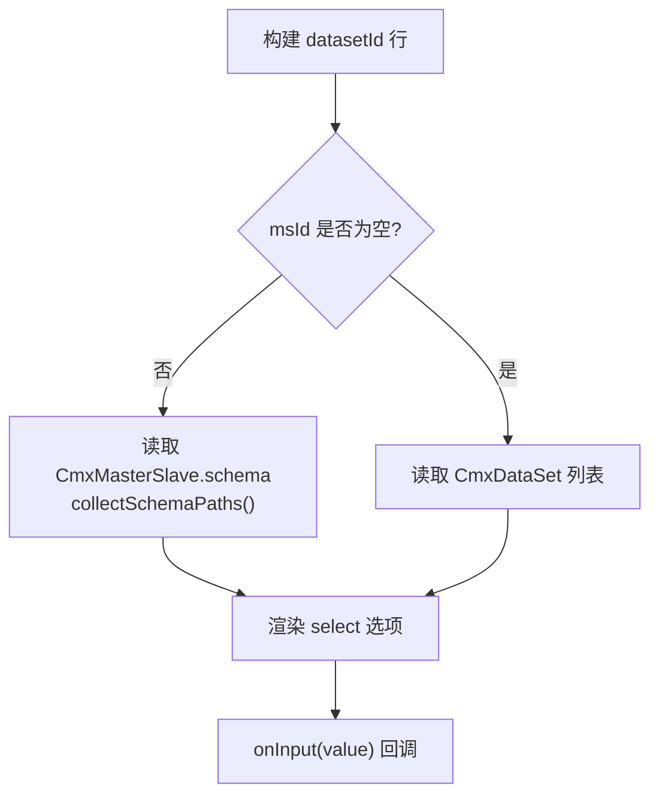
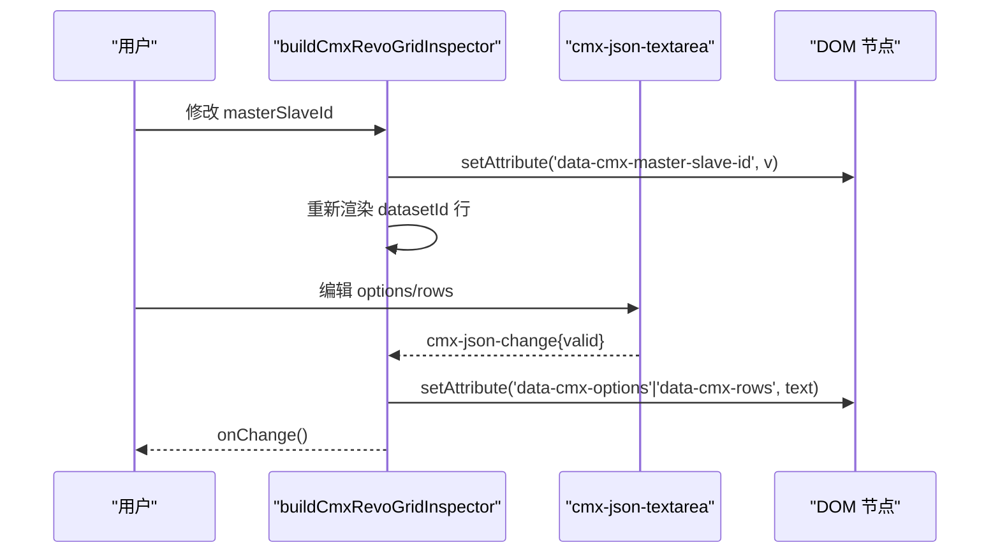
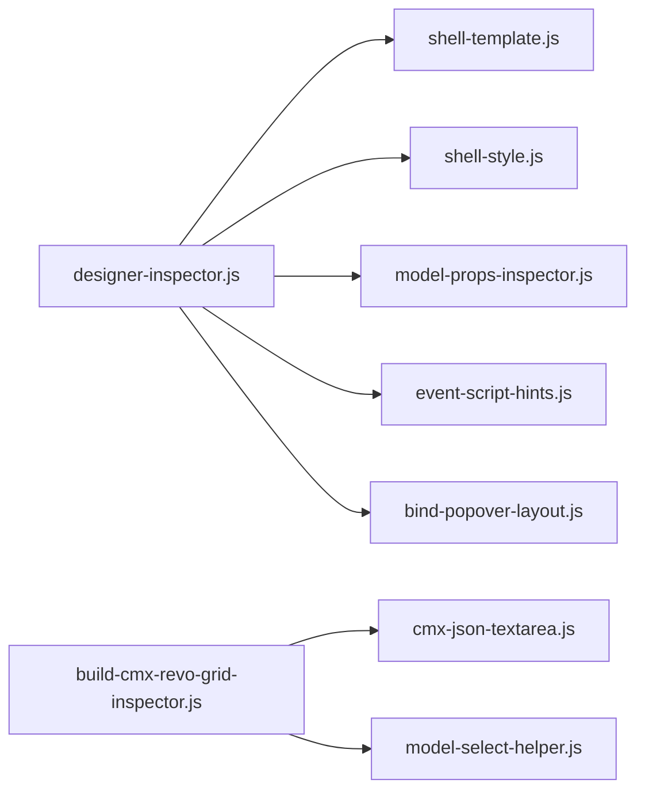

# 自定义属性面板

<cite>
**本文引用的文件**
- [designer-inspector.js](file://CMXHTMLDesigner/src/components/designer-inspector.js)
- [designer-inspector-shell-template.js](file://CMXHTMLDesigner/src/components/designer-inspector/designer-inspector-shell-template.js)
- [designer-inspector-shell-style.js](file://CMXHTMLDesigner/src/components/designer-inspector/designer-inspector-shell-style.js)
- [model-props-inspector.js](file://CMXHTMLDesigner/src/components/designer-inspector/model-props-inspector.js)
- [event-script-hints.js](file://CMXHTMLDesigner/src/components/designer-inspector/event-script-hints.js)
- [bind-popover-layout.js](file://CMXHTMLDesigner/src/components/designer-inspector/bind-popover-layout.js)
- [cmx-json-textarea.js](file://CMXHTMLDesigner/src/plugins/cmx-inspector/cmx-json-textarea.js)
- [model-select-helper.js](file://CMXHTMLDesigner/src/plugins/cmx-inspector/model-select-helper.js)
- [build-cmx-revo-grid-inspector.js](file://CMXHTMLDesigner/src/plugins/cmx-inspector/build-cmx-revo-grid-inspector.js)
</cite>

## 目录
1. [简介](#简介)
2. [项目结构](#项目结构)
3. [核心组件](#核心组件)
4. [架构总览](#架构总览)
5. [详细组件分析](#详细组件分析)
6. [依赖关系分析](#依赖关系分析)
7. [性能与体验优化](#性能与体验优化)
8. [故障排查指南](#故障排查指南)
9. [结论](#结论)
10. [附录：开发清单与最佳实践](#附录：开发清单与最佳实践)

## 简介
本指南面向需要在设计器中扩展或定制“属性面板（Inspector）”的开发者。内容覆盖：
- Inspector 渲染函数规范与上下文参数 ctx 的使用方式
- DOM 操作与事件处理机制
- 内置 Inspector 组件用法（JSON 编辑器、模型选择器等）
- 属性面板的数据绑定与变更检测
- 复杂属性面板示例与布局/交互最佳实践
- 调试技巧与性能优化建议

## 项目结构
右侧属性面板由一个宿主组件与多个子模块组成，采用“宿主 + 插件式渲染”的架构：
- 宿主组件负责 Tab 切换、节点/模型状态管理、通用属性/样式/事件/调试面板渲染
- 针对特定标签或模型的专用 Inspector 通过插件钩子注入
- 模型属性编辑集中在 model-props-inspector，提供 CmxDataSet / CmxMasterSlave / CmxColumnModel / FlexibleCombination 等模型的面板
- 通用 JSON 编辑器 cmx-json-textarea 提供带语法校验的多行输入能力
- 模型选择辅助 buildModelSelectRow / buildDatasetIdRow 提供“从模型面板选择”的下拉行

图示来源
- [designer-inspector.js:15-39](file://CMXHTMLDesigner/src/components/designer-inspector.js#L15-L39)
- [designer-inspector-shell-template.js:1-45](file://CMXHTMLDesigner/src/components/designer-inspector/designer-inspector-shell-template.js#L1-L45)
- [designer-inspector-shell-style.js:1-10](file://CMXHTMLDesigner/src/components/designer-inspector/designer-inspector-shell-style.js#L1-L10)
- [model-props-inspector.js:14-31](file://CMXHTMLDesigner/src/components/designer-inspector/model-props-inspector.js#L14-L31)
- [cmx-json-textarea.js:20-29](file://CMXHTMLDesigner/src/plugins/cmx-inspector/cmx-json-textarea.js#L20-L29)
- [model-select-helper.js:18-27](file://CMXHTMLDesigner/src/plugins/cmx-inspector/model-select-helper.js#L18-L27)

章节来源
- [designer-inspector.js:48-119](file://CMXHTMLDesigner/src/components/designer-inspector.js#L48-L119)
- [designer-inspector-shell-template.js:1-45](file://CMXHTMLDesigner/src/components/designer-inspector/designer-inspector-shell-template.js#L1-L45)

## 核心组件
- DesignerInspector（宿主）
  - 职责：维护当前选中节点/模型/列，渲染属性/样式/事件/调试四个面板；支持插件 hook 渲染自定义属性面板；派发 inspector-change 等事件；提供 log() 写入调试日志
  - 关键流程：setNode/setModel/setModelColumn → _renderAll → 按优先级渲染模型列/模型/节点属性
- 模型属性面板（model-props-inspector）
  - 职责：根据 modelType 分发到对应渲染器（CmxDataSet / CmxMasterSlave / CmxColumnModel / FlexibleCombination），并提供列详情属性编辑
- 内置组件
  - cmx-json-textarea：JSON 多行输入，实时校验，格式化，触发 cmx-json-change
  - model-select-helper：构建“从模型面板选择”的行，支持 datasetId 动态选项

章节来源
- [designer-inspector.js:171-266](file://CMXHTMLDesigner/src/components/designer-inspector.js#L171-L266)
- [model-props-inspector.js:14-31](file://CMXHTMLDesigner/src/components/designer-inspector/model-props-inspector.js#L14-L31)
- [cmx-json-textarea.js:20-89](file://CMXHTMLDesigner/src/plugins/cmx-inspector/cmx-json-textarea.js#L20-L89)
- [model-select-helper.js:18-84](file://CMXHTMLDesigner/src/plugins/cmx-inspector/model-select-helper.js#L18-L84)

## 架构总览
Inspector 采用“宿主 + 插件”模式：
- 宿主负责 UI 框架、Tab 管理、通用渲染与事件总线
- 插件通过 getCustomInspector 注册并返回渲染函数，接收统一上下文 ctx
- 模型属性面板作为内置插件，集中处理页面级模型与列的编辑

图示来源
- [designer-inspector.js:270-293](file://CMXHTMLDesigner/src/components/designer-inspector.js#L270-L293)
- [model-props-inspector.js:14-31](file://CMXHTMLDesigner/src/components/designer-inspector/model-props-inspector.js#L14-L31)
- [cmx-json-textarea.js:69-135](file://CMXHTMLDesigner/src/plugins/cmx-inspector/cmx-json-textarea.js#L69-L135)

## 详细组件分析

### 宿主组件：DesignerInspector
- 渲染入口
  - setNode/setModel/setModelColumn 设置上下文后调用 _renderAll
  - _renderAll 优先渲染模型列 → 模型 → 节点属性
- 属性面板
  - 若存在自定义 Inspector，则清空并调用插件渲染函数
  - 否则渲染元数据属性、UI5 Slot、原始 style、数据绑定按钮与弹出层
- 样式面板
  - 按样式分组渲染，支持颜色、下拉、数值等控件，实时同步 node.style
- 事件面板
  - 渲染已知事件芯片，打开 CodeMirror 编辑器，支持插入 debugger、绑定/移除事件
  - 对模型事件，将代码写入 model.events，并触发页面数据变更
- 调试面板
  - 提供控制台镜像开关，清空日志，log(msg, level) 追加日志行

图示来源
- [designer-inspector.js:182-266](file://CMXHTMLDesigner/src/components/designer-inspector.js#L182-L266)

章节来源
- [designer-inspector.js:48-119](file://CMXHTMLDesigner/src/components/designer-inspector.js#L48-L119)
- [designer-inspector.js:270-572](file://CMXHTMLDesigner/src/components/designer-inspector.js#L270-L572)
- [designer-inspector.js:601-800](file://CMXHTMLDesigner/src/components/designer-inspector.js#L601-L800)

### 模型属性面板：model-props-inspector
- 路由逻辑
  - 根据 model.modelType 选择渲染器：CmxDataSet / CmxMasterSlave / CmxColumnModel / FlexibleCombination
  - 未实现类型时显示空提示
- 列详情属性
  - 将 column 归一化为视图字段，使用 renderFieldPanel 生成表单，监听 input/change/click 更新 column 并触发 onChange
  - 支持枚举值数组路径写入、验证规则增删、字段提示浮层
- 各模型面板要点
  - CmxDataSet：实例名、数据源、调用时机、初始行 JSON、子数据集绑定
  - CmxMasterSlave：自动加载、加载形态、数据源字段、分页/深度/过滤等
  - CmxColumnModel：datasetId、toTitleCols、iconCol、元数据来源（metaModelId/metaTable）
  - FlexibleCombination：场景、后端接口、目标列模型绑定、内联规则 JSON

图示来源
- [model-props-inspector.js:14-31](file://CMXHTMLDesigner/src/components/designer-inspector/model-props-inspector.js#L14-L31)
- [model-props-inspector.js:37-128](file://CMXHTMLDesigner/src/components/designer-inspector/model-props-inspector.js#L37-L128)
- [model-props-inspector.js:541-590](file://CMXHTMLDesigner/src/components/designer-inspector/model-props-inspector.js#L541-L590)

章节来源
- [model-props-inspector.js:14-31](file://CMXHTMLDesigner/src/components/designer-inspector/model-props-inspector.js#L14-L31)
- [model-props-inspector.js:140-424](file://CMXHTMLDesigner/src/components/designer-inspector/model-props-inspector.js#L140-L424)
- [model-props-inspector.js:494-590](file://CMXHTMLDesigner/src/components/designer-inspector/model-props-inspector.js#L494-L590)

### 内置组件：cmx-json-textarea
- 功能
  - 多行文本输入，实时 JSON 解析校验，格式化按钮
  - setValue/getValue/getParsed API
  - 触发 cmx-json-change 事件，包含 value/parsed/valid
- 使用方式
  - 在 Inspector 中为 options/rows 等 JSON 属性提供可视化编辑
  - 监听 cmx-json-change，将有效 JSON 写回节点属性或模型 props

图示来源
- [cmx-json-textarea.js:20-89](file://CMXHTMLDesigner/src/plugins/cmx-inspector/cmx-json-textarea.js#L20-L89)
- [cmx-json-textarea.js:100-135](file://CMXHTMLDesigner/src/plugins/cmx-inspector/cmx-json-textarea.js#L100-L135)

章节来源
- [cmx-json-textarea.js:20-139](file://CMXHTMLDesigner/src/plugins/cmx-inspector/cmx-json-textarea.js#L20-L139)

### 模型选择辅助：model-select-helper
- buildModelSelectRow
  - 生成 label + 输入框 + 可选下拉（从 pageData._models 过滤指定 modelType）
  - 支持 items 直接传入，onInput(value) 回调
- buildDatasetIdRow
  - 当 msId 有值时，从对应 CmxMasterSlave.schema 递归收集路径作为选项
  - 否则从 CmxDataSet 列表提供选项

图示来源
- [model-select-helper.js:18-84](file://CMXHTMLDesigner/src/plugins/cmx-inspector/model-select-helper.js#L18-L84)
- [model-select-helper.js:88-130](file://CMXHTMLDesigner/src/plugins/cmx-inspector/model-select-helper.js#L88-L130)

章节来源
- [model-select-helper.js:18-132](file://CMXHTMLDesigner/src/plugins/cmx-inspector/model-select-helper.js#L18-L132)

### 插件示例：cmx-revo-grid 专属 Inspector
- 绑定项
  - masterSlaveId、datasetId、modelId（CmxColumnModel）
  - options、rows（使用 cmx-json-textarea）
- 交互
  - 选择 masterSlaveId 后动态刷新 datasetId 选项
  - JSON 编辑器校验通过后写回 data-cmx-* 属性，onChange 通知宿主

图示来源
- [build-cmx-revo-grid-inspector.js:20-102](file://CMXHTMLDesigner/src/plugins/cmx-inspector/build-cmx-revo-grid-inspector.js#L20-L102)
- [cmx-json-textarea.js:69-135](file://CMXHTMLDesigner/src/plugins/cmx-inspector/cmx-json-textarea.js#L69-L135)

章节来源
- [build-cmx-revo-grid-inspector.js:1-102](file://CMXHTMLDesigner/src/plugins/cmx-inspector/build-cmx-revo-grid-inspector.js#L1-L102)

### 事件脚本提示：event-script-hints
- 提供常见事件对象成员说明（如 click、input、change、媒体事件等）
- 生成编辑器上方提示 HTML，包括形参 event、上下文 this/$data、可调用函数名

章节来源
- [event-script-hints.js:1-101](file://CMXHTMLDesigner/src/components/designer-inspector/event-script-hints.js#L1-L101)

## 依赖关系分析
- 宿主依赖
  - 模板与样式：designer-inspector-shell-template.js、designer-inspector-shell-style.js
  - 插件系统：getCustomInspector（用于注入自定义 Inspector）
  - 模型属性面板：model-props-inspector
  - 事件提示：event-script-hints
  - 弹出层布局常量：bind-popover-layout
- 插件依赖
  - cmx-json-textarea：JSON 编辑器
  - model-select-helper：模型选择行
  - 具体组件 Inspector（如 revo-grid）组合上述能力

图示来源
- [designer-inspector.js:15-39](file://CMXHTMLDesigner/src/components/designer-inspector.js#L15-L39)
- [build-cmx-revo-grid-inspector.js:1-20](file://CMXHTMLDesigner/src/plugins/cmx-inspector/build-cmx-revo-grid-inspector.js#L1-L20)

章节来源
- [designer-inspector.js:15-39](file://CMXHTMLDesigner/src/components/designer-inspector.js#L15-L39)
- [build-cmx-revo-grid-inspector.js:1-20](file://CMXHTMLDesigner/src/plugins/cmx-inspector/build-cmx-revo-grid-inspector.js#L1-L20)

## 性能与体验优化
- 渲染策略
  - 按需渲染：仅在当前选中节点/模型/列变化时重渲染
  - 局部更新：JSON 编辑器仅在 valid 时写回属性，避免无效重绘
- 事件与变更
  - 使用 onChange 聚合多次输入，减少频繁刷新
  - 模型列编辑时，edit.mode 变化触发重渲染以对齐分区
- 用户体验
  - 使用 datalist 提供智能补全（服务名、模型实例、列字段）
  - 错误提示即时可见（JSON 解析失败、不完整绑定行）
  - 调试面板支持控制台镜像与日志清理
- 建议
  - 大表单分区块折叠，减少首屏渲染压力
  - 长列表虚拟滚动或分页加载（如 schema 路径过多）
  - 避免在 input 事件中执行昂贵计算，必要时节流/防抖

[本节为通用指导，不直接分析具体文件]

## 故障排查指南
- JSON 编辑器报错
  - 现象：cmx-json-textarea 显示 JSON ✗ 并给出错误信息
  - 排查：检查 textarea 内容是否为合法 JSON；使用格式化按钮定位问题
  - 参考：[cmx-json-textarea.js:100-135](file://CMXHTMLDesigner/src/plugins/cmx-inspector/cmx-json-textarea.js#L100-L135)
- 模型属性未生效
  - 现象：修改后未反映到模型或节点
  - 排查：确认 onChange 被调用；检查 bindInput/bindSelect/bindCheckbox 是否正确绑定
  - 参考：[model-props-inspector.js:462-492](file://CMXHTMLDesigner/src/components/designer-inspector/model-props-inspector.js#L462-L492)
- 事件未绑定
  - 现象：点击“绑定事件”无效
  - 排查：确认 currentEvtName 非空；CodeMirror 内容非空；canvas.attachHandler 成功
  - 参考：[designer-inspector.js:673-682](file://CMXHTMLDesigner/src/components/designer-inspector.js#L673-L682)
- 调试日志为空
  - 现象：调试面板无输出
  - 排查：确认 log() 调用；检查 console 镜像开关
  - 参考：[designer-inspector.js:120-135](file://CMXHTMLDesigner/src/components/designer-inspector.js#L120-L135)

章节来源
- [cmx-json-textarea.js:100-135](file://CMXHTMLDesigner/src/plugins/cmx-inspector/cmx-json-textarea.js#L100-L135)
- [model-props-inspector.js:462-492](file://CMXHTMLDesigner/src/components/designer-inspector/model-props-inspector.js#L462-L492)
- [designer-inspector.js:673-682](file://CMXHTMLDesigner/src/components/designer-inspector.js#L673-L682)
- [designer-inspector.js:120-135](file://CMXHTMLDesigner/src/components/designer-inspector.js#L120-L135)

## 结论
本指南梳理了自定义属性面板的完整实现路径：以 DesignerInspector 为宿主，结合 model-props-inspector 与插件体系，提供统一的渲染契约与丰富的内置组件。遵循本文的渲染规范、数据绑定与事件处理机制，可快速构建稳定高效的复杂配置界面。同时，借助调试面板与错误提示，可在开发阶段快速定位问题并优化体验。

[本节为总结性内容，不直接分析具体文件]

## 附录：开发清单与最佳实践
- 渲染函数规范
  - 接收 ctx = { node, meta, mount, pageData, onChange }
  - 通过 mount.innerHTML 或 appendChild 渲染 UI
  - 所有输入变更最终调用 onChange 通知宿主
- DOM 操作规范
  - 避免直接操作 Shadow DOM 外部元素
  - 使用事件委托与最小化重排
  - 对敏感字符进行转义（esc/escAttr）
- 事件处理机制
  - 原生事件：input/change/click 等
  - 自定义事件：cmx-json-change 等
  - 模型事件：写入 model.events 并触发页面数据变更
- 数据绑定与变更检测
  - 双向绑定：UI → props/column → 持久化
  - 变更检测：onChange 触发列表刷新与状态同步
- 复杂面板示例
  - 使用 cmx-json-textarea 编辑 JSON 配置
  - 使用 buildModelSelectRow / buildDatasetIdRow 提供智能选择
  - 分区块组织表单，提供即时校验与提示
- 布局与体验
  - 紧凑而清晰的分组与标题
  - 常用操作就近放置（如添加/删除行）
  - 错误与成功状态清晰可见
- 调试与优化
  - 使用 log() 记录关键步骤
  - 控制重渲染范围，避免全局刷新
  - 对大对象/长列表采取懒加载或分页

[本节为通用指导，不直接分析具体文件]