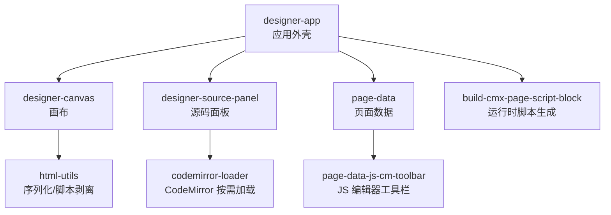
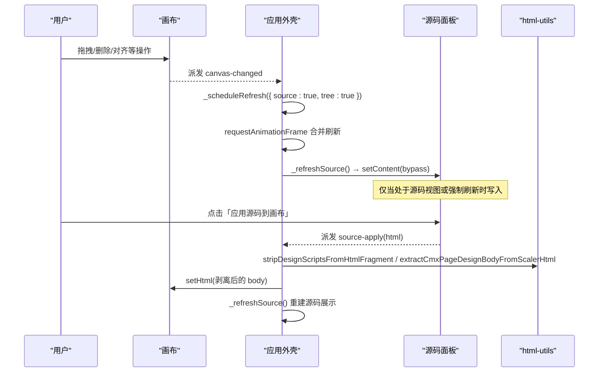
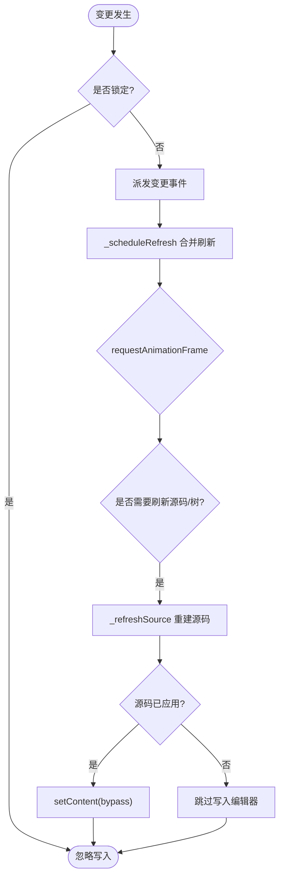
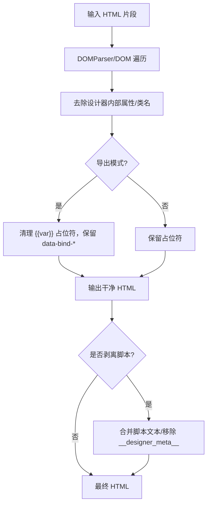
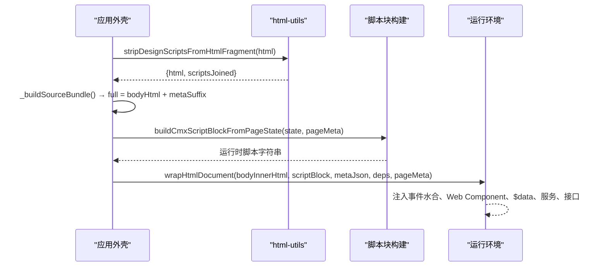
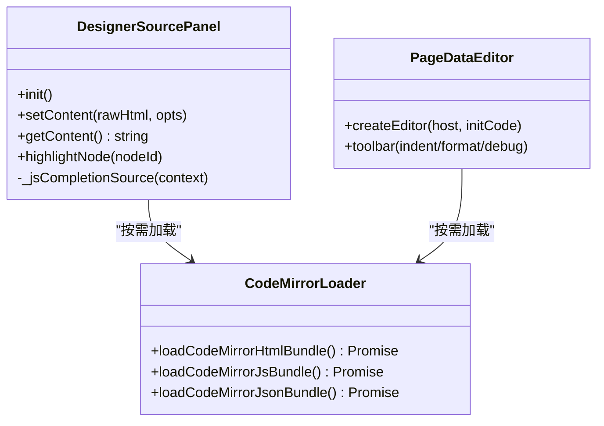
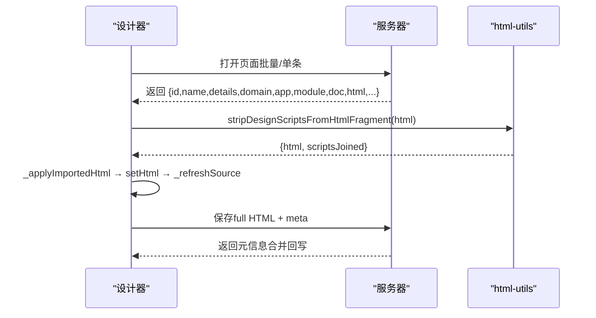
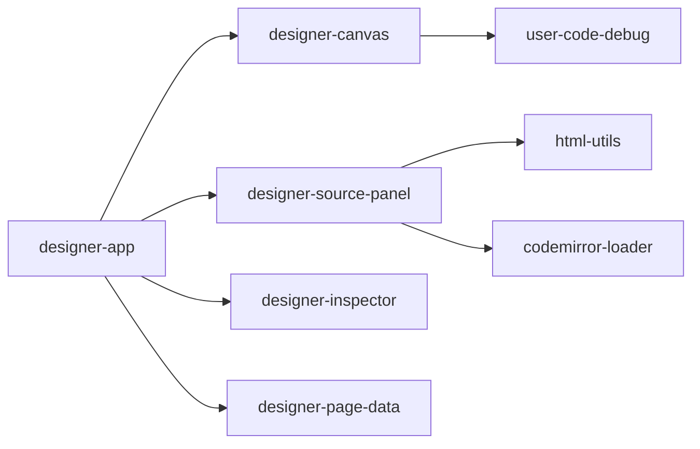

# 源码同步机制

<cite>
**本文引用的文件**
- [designer-app.js](file://CMXHTMLDesigner/src/components/designer-app.js)
- [designer-source-panel.js](file://CMXHTMLDesigner/src/components/designer-source-panel.js)
- [designer-canvas.js](file://CMXHTMLDesigner/src/components/designer-canvas.js)
- [html-utils.js](file://CMXHTMLDesigner/src/utils/html-utils.js)
- [codemirror-loader.js](file://CMXHTMLDesigner/src/lib/codemirror-loader.js)
- [build-cmx-page-script-block.js](file://CMXHTMLDesigner/src/utils/build-cmx-page-script-block.js)
- [page-data-panel-models.js](file://CMXHTMLDesigner/src/components/designer-page-data/page-data-panel-models.js)
- [page-data-js-cm-toolbar.js](file://CMXHTMLDesigner/src/components/designer-page-data/page-data-js-cm-toolbar.js)
- [html-utils.test.js](file://CMXHTMLDesigner/src/__tests__/html-utils.test.js)
</cite>

## 目录
1. [简介](#简介)
2. [项目结构](#项目结构)
3. [核心组件](#核心组件)
4. [架构总览](#架构总览)
5. [详细组件分析](#详细组件分析)
6. [依赖关系分析](#依赖关系分析)
7. [性能考虑](#性能考虑)
8. [故障排查指南](#故障排查指南)
9. [结论](#结论)
10. [附录](#附录)

## 简介
本技术文档围绕“画布与源码的双向同步”展开，系统阐述差异检测、冲突解决策略、HTML 片段解析/序列化/重构流程、脚本块提取与注入、版本管理、代码编辑器集成（语法高亮与智能提示）、源码导入导出全流程与格式规范、与版本控制系统的协作方式，以及大文件处理、错误恢复与性能优化实践。该机制支撑可视化设计器在“画布视图”和“源码视图”之间保持强一致，同时保证运行态页面可独立执行与调试。

## 项目结构
设计器由多个 Web Component 组成：
- 应用外壳 designer-app：协调画布、源码面板、属性面板、数据面板等，负责事件路由与刷新调度。
- 画布 designer-canvas：承载 DOM 节点、拖拽、撤销重做、选择与变更事件。
- 源码面板 designer-source-panel：基于 CodeMirror 6 的 HTML 源码编辑区，支持格式化、缩进、复制粘贴、显示/隐藏脚本。
- 工具库 html-utils：提供 HTML 序列化、脚本剥离、模板抽取、完整文档包装等能力。
- 编辑器加载器 codemirror-loader：按需动态加载 CodeMirror 模块，避免首包体积膨胀。
- 脚本块构建 build-cmx-page-script-block：将页面数据、函数、服务、接口生成运行时脚本。
- 页面数据编辑器 page-data-panel-models / page-data-js-cm-toolbar：JS/JSON 编辑器与工具栏，提供补全与格式化。

**图表来源**
- [designer-app.js:75-193](file://CMXHTMLDesigner/src/components/designer-app.js#L75-L193)
- [designer-canvas.js:172-218](file://CMXHTMLDesigner/src/components/designer-canvas.js#L172-L218)
- [designer-source-panel.js:81-148](file://CMXHTMLDesigner/src/components/designer-source-panel.js#L81-L148)
- [html-utils.js:25-148](file://CMXHTMLDesigner/src/utils/html-utils.js#L25-L148)
- [codemirror-loader.js:9-86](file://CMXHTMLDesigner/src/lib/codemirror-loader.js#L9-L86)
- [build-cmx-page-script-block.js:28-312](file://CMXHTMLDesigner/src/utils/build-cmx-page-script-block.js#L28-L312)

**章节来源**
- [designer-app.js:75-193](file://CMXHTMLDesigner/src/components/designer-app.js#L75-L193)
- [designer-canvas.js:172-218](file://CMXHTMLDesigner/src/components/designer-canvas.js#L172-L218)
- [designer-source-panel.js:81-148](file://CMXHTMLDesigner/src/components/designer-source-panel.js#L81-L148)
- [html-utils.js:25-148](file://CMXHTMLDesigner/src/utils/html-utils.js#L25-L148)
- [codemirror-loader.js:9-86](file://CMXHTMLDesigner/src/lib/codemirror-loader.js#L9-L86)
- [build-cmx-page-script-block.js:28-312](file://CMXHTMLDesigner/src/utils/build-cmx-page-script-block.js#L28-L312)

## 核心组件
- 画布组件
  - 职责：维护设计区 DOM、选择/拖拽/对齐/缩放、撤销重做历史、事件水合、序列化输出。
  - 关键方法：getHtml/getExportHtml/getHtmlWithIds/setHtml/clear/selectNodeById/rehydrateEvents。
  - 变更传播：通过 _emitChanged 派发 canvas-changed，驱动树面板与源码刷新调度。
- 源码面板组件
  - 职责：CodeMirror 6 HTML 编辑器、格式化、缩进、复制粘贴、显示/隐藏脚本、光标定位到节点。
  - 双向同步：source-change 上报；source-apply 触发应用到画布；setContent/bypassMutationLock 用于内部同步。
- 应用外壳组件
  - 职责：编排各子组件、监听事件、调度刷新、构建源码 bundle、导入/导出流程、页内运行锁定。
  - 关键逻辑：_refreshSource/_scheduleRefresh/_buildSourceBundle/_applyImportedHtml/source-apply 处理器。

**章节来源**
- [designer-canvas.js:172-218](file://CMXHTMLDesigner/src/components/designer-canvas.js#L172-L218)
- [designer-source-panel.js:192-291](file://CMXHTMLDesigner/src/components/designer-source-panel.js#L192-L291)
- [designer-app.js:402-495](file://CMXHTMLDesigner/src/components/designer-app.js#L402-L495)
- [designer-app.js:586-618](file://CMXHTMLDesigner/src/components/designer-app.js#L586-L618)

## 架构总览
画布与源码的双向同步通过“事件 + 状态聚合 + 延迟刷新”实现：
- 画布 → 源码：canvas-changed → _scheduleRefresh({ source: true }) → _refreshSource() → setContent(bypass)。
- 源码 → 画布：source-apply → 解析 meta → 剥离 script → setHtml → 刷新源码与树。
- 属性面板变更：inspector-change → 可能推入画布历史并触发 canvas-changed → 再走上述链路。
- 刷新节流：同帧多次变更合并为一次 requestAnimationFrame 刷新，降低卡顿。

**图表来源**
- [designer-app.js:415-495](file://CMXHTMLDesigner/src/components/designer-app.js#L415-L495)
- [designer-app.js:586-618](file://CMXHTMLDesigner/src/components/designer-app.js#L586-L618)
- [html-utils.js:123-148](file://CMXHTMLDesigner/src/utils/html-utils.js#L123-L148)
- [designer-canvas.js:206-218](file://CMXHTMLDesigner/src/components/designer-canvas.js#L206-L218)

## 详细组件分析

### 画布与源码双向同步算法
- 差异检测
  - 画布侧：每次操作后 pushHistory 记录快照，变更通过 _emitChanged 通知上层。
  - 源码侧：CodeMirror 更新监听 docChanged 派发 source-change；selectionSet 且未修改文档时派发 source-select（含 data-node-id）。
- 冲突解决策略
  - 页内运行锁定：_inlineRunDesignDesignLocked 期间阻止 source-apply 到画布，防止并发改写。
  - 只读模式：setMutationLocked(true) 禁止画布/源码写入，保障运行期稳定。
  - 刷新合并：_scheduleRefresh 使用 requestAnimationFrame 合并同帧多次变更，避免重复渲染。
- 数据流
  - 画布 → 源码：_refreshSource 从画布 getHtmlWithIds 构建 bodyHtml，附加 __designer_meta__ 形成 full，按 showScript 切换显示。
  - 源码 → 画布：source-apply 解析 __designer_meta__ 回写页面数据，剥离 script 后 setHtml，再刷新源码。

**图表来源**
- [designer-app.js:415-495](file://CMXHTMLDesigner/src/components/designer-app.js#L415-L495)
- [designer-app.js:586-618](file://CMXHTMLDesigner/src/components/designer-app.js#L586-L618)
- [designer-source-panel.js:123-140](file://CMXHTMLDesigner/src/components/designer-source-panel.js#L123-L140)

**章节来源**
- [designer-app.js:415-495](file://CMXHTMLDesigner/src/components/designer-app.js#L415-L495)
- [designer-app.js:586-618](file://CMXHTMLDesigner/src/components/designer-app.js#L586-L618)
- [designer-source-panel.js:123-140](file://CMXHTMLDesigner/src/components/designer-source-panel.js#L123-L140)

### HTML 片段的解析、序列化和重构
- 序列化
  - serializeDesignArea：去除设计器内部属性、选中/拖拽类名，可选过滤未知属性，保留 data-bind-* 供运行时绑定。
  - serializeDesignAreaWithIds：保留 data-node-id 以便源码面板定位。
  - prettyFormatHtml：对 HTML 进行缩进格式化，便于源码展示。
- 解析与重构
  - stripDesignScriptsFromHtmlFragment：移除可执行 script 与 __designer_meta__，返回干净 HTML 与合并脚本文本。
  - extractCmxPageDesignBodyFromScalerHtml：若误包含整页模板外壳，则抽取模板内真实设计区 HTML，避免嵌套模板导致运行不一致。
- 测试覆盖
  - 单元测试验证空区域、属性清理、类名清理、data-node-id 保留、业务属性保留等场景。

**图表来源**
- [html-utils.js:25-148](file://CMXHTMLDesigner/src/utils/html-utils.js#L25-L148)
- [html-utils.test.js:145-224](file://CMXHTMLDesigner/src/__tests__/html-utils.test.js#L145-L224)

**章节来源**
- [html-utils.js:25-148](file://CMXHTMLDesigner/src/utils/html-utils.js#L25-L148)
- [html-utils.test.js:145-224](file://CMXHTMLDesigner/src/__tests__/html-utils.test.js#L145-L224)

### 脚本块的提取、注入与版本管理
- 提取
  - stripDesignScriptsFromHtmlFragment：从片段中移除可执行 script 与 __designer_meta__，返回 scriptsJoined。
  - _buildSourceBundle：从画布获取 bodyHtml，拼接 __designer_meta__ JSON 作为 metaSuffix，形成 full。
- 注入
  - wrapHtmlDocument：生成完整 HTML 文档，嵌入 importmap、UI5 资源、主题样式，并在 <template> 中放置设计区，随后注入运行时脚本（事件水合、Web Component 壳）。
  - buildCmxScriptBlockFromPageState：根据页面数据/函数/服务/接口生成运行时脚本，绑定 $data、实例方法、服务调用、对外接口与脏标记。
- 版本管理
  - __designer_meta__：以 application/json 形式保存页面状态，导入/应用源码时解析回写，确保多轮编辑一致性。
  - 调试模式：通过 window.__cmxDebug 控制是否在事件/函数首行注入 debugger;，配合 sourceURL 使 DevTools 可按 URL 持久化断点。

**图表来源**
- [designer-app.js:367-390](file://CMXHTMLDesigner/src/components/designer-app.js#L367-L390)
- [html-utils.js:237-367](file://CMXHTMLDesigner/src/utils/html-utils.js#L237-L367)
- [build-cmx-page-script-block.js:28-312](file://CMXHTMLDesigner/src/utils/build-cmx-page-script-block.js#L28-L312)

**章节来源**
- [designer-app.js:367-390](file://CMXHTMLDesigner/src/components/designer-app.js#L367-L390)
- [html-utils.js:237-367](file://CMXHTMLDesigner/src/utils/html-utils.js#L237-L367)
- [build-cmx-page-script-block.js:28-312](file://CMXHTMLDesigner/src/utils/build-cmx-page-script-block.js#L28-L312)

### 代码编辑器集成、语法高亮与智能提示
- 编辑器初始化
  - codemirror-loader：按需动态加载 CodeMirror 6 及语言/命令/主题模块，提供 HTML/JS/JSON 三种 bundle。
  - designer-source-panel：创建 EditorView，启用 HTML 语言、JavaScript 自动补全、OneDark 主题、行换行、更新监听。
- 语法高亮与格式化
  - 工具栏按钮：增加/减少缩进、格式化 HTML、复制/粘贴全部源码。
  - prettyFormatHtml：对内容重新格式化后替换文档。
- 智能提示
  - 源码面板：针对 $data.* 提供页面变量补全；补充 event、console.log、alert、fetch 与页面函数/服务。
  - 页面数据编辑器：模型事件补全、JS 编辑器工具栏（缩进/格式化/插入调试语句）。

**图表来源**
- [designer-source-panel.js:81-148](file://CMXHTMLDesigner/src/components/designer-source-panel.js#L81-L148)
- [codemirror-loader.js:9-86](file://CMXHTMLDesigner/src/lib/codemirror-loader.js#L9-L86)
- [page-data-panel-models.js:442-487](file://CMXHTMLDesigner/src/components/designer-page-data/page-data-panel-models.js#L442-L487)
- [page-data-js-cm-toolbar.js:39-82](file://CMXHTMLDesigner/src/components/designer-page-data/page-data-js-cm-toolbar.js#L39-L82)

**章节来源**
- [designer-source-panel.js:81-148](file://CMXHTMLDesigner/src/components/designer-source-panel.js#L81-L148)
- [codemirror-loader.js:9-86](file://CMXHTMLDesigner/src/lib/codemirror-loader.js#L9-L86)
- [page-data-panel-models.js:442-487](file://CMXHTMLDesigner/src/components/designer-page-data/page-data-panel-models.js#L442-L487)
- [page-data-js-cm-toolbar.js:39-82](file://CMXHTMLDesigner/src/components/designer-page-data/page-data-js-cm-toolbar.js#L39-L82)

### 源码导入导出流程、格式规范与兼容性
- 导入流程
  - _applyImportedHtml：解析 __designer_meta__ 回写页面数据，抽取模板内设计区 HTML，剥离脚本后 setHtml，刷新源码与树。
  - 兼容整页/片段：若导入为整页，会识别 cmx-page-template-* 外壳并抽取真实设计区。
- 导出流程
  - _getDesignSourceViewHtml：返回 full（bodyHtml + scriptSuffix + metaSuffix），供服务器保存对话框提交。
  - wrapHtmlDocument：生成可独立运行的完整 HTML 文档，包含 importmap、UI5 资源、主题样式与运行时脚本。
- 格式规范
  - __designer_meta__：application/json，键值包含页面数据、函数、服务、接口等状态。
  - 设计区 HTML：仅包含业务节点与必要属性，去除设计器内部属性与 UI5 内部属性（可通过过滤器）。
- 兼容性处理
  - 旧版会话载荷兼容：parseDesignerRunSession 兼容整段 HTML 与新版 JSON 两种形态。
  - 多页调试：parseDesignerRunBatchSession 校验 pages 数组字段并规范化。

**图表来源**
- [designer-app.js:320-345](file://CMXHTMLDesigner/src/components/designer-app.js#L320-L345)
- [designer-app.js:367-390](file://CMXHTMLDesigner/src/components/designer-app.js#L367-L390)
- [html-utils.js:237-367](file://CMXHTMLDesigner/src/utils/html-utils.js#L237-L367)
- [html-utils.js:428-474](file://CMXHTMLDesigner/src/utils/html-utils.js#L428-L474)

**章节来源**
- [designer-app.js:320-345](file://CMXHTMLDesigner/src/components/designer-app.js#L320-L345)
- [designer-app.js:367-390](file://CMXHTMLDesigner/src/components/designer-app.js#L367-L390)
- [html-utils.js:237-367](file://CMXHTMLDesigner/src/utils/html-utils.js#L237-L367)
- [html-utils.js:428-474](file://CMXHTMLDesigner/src/utils/html-utils.js#L428-L474)

### 与版本控制系统的集成与协作编辑支持
- 版本控制集成
  - 保存产物为完整 HTML + __designer_meta__，可作为单一文件纳入 Git/SVN 等 VCS，便于 diff/merge。
  - 建议结合后端 API 进行增量保存（changeset/snapshot），减少网络开销与冲突概率。
- 协作编辑支持
  - 当前设计器侧重单机编辑，通过锁定机制（页内运行/只读）避免并发写入。
  - 可扩展层：引入协同引擎（Op 模型、串行化、定序、冲突裁决 LWW/顺序裁决），参考内存多报表共享编辑架构中的分层设计。

[本节为概念性说明，不直接分析具体文件]

## 依赖关系分析
- 组件耦合
  - designer-app 强依赖 designer-canvas、designer-source-panel、designer-inspector、designer-page-data。
  - designer-source-panel 依赖 html-utils（格式化）、codemirror-loader（编辑器模块）。
  - designer-canvas 依赖 html-utils（序列化/脚本剥离）与 user-code-debug（事件水合）。
- 外部依赖
  - CodeMirror 6 及其语言/命令/主题模块按需加载。
  - UI5 Web Components 通过 importmap 与 CDN 引入，主题参数内联以减少外部依赖。
- 潜在循环依赖
  - 组件间通过事件通信，无直接循环引用；脚本生成与运行时解耦，避免循环。

**图表来源**
- [designer-app.js:75-193](file://CMXHTMLDesigner/src/components/designer-app.js#L75-L193)
- [designer-source-panel.js:81-148](file://CMXHTMLDesigner/src/components/designer-source-panel.js#L81-L148)
- [designer-canvas.js:172-218](file://CMXHTMLDesigner/src/components/designer-canvas.js#L172-L218)

**章节来源**
- [designer-app.js:75-193](file://CMXHTMLDesigner/src/components/designer-app.js#L75-L193)
- [designer-source-panel.js:81-148](file://CMXHTMLDesigner/src/components/designer-source-panel.js#L81-L148)
- [designer-canvas.js:172-218](file://CMXHTMLDesigner/src/components/designer-canvas.js#L172-L218)

## 性能考虑
- 刷新合并：_scheduleRefresh 使用 requestAnimationFrame 合并同帧多次变更，显著降低拖拽与连续编辑时的卡顿。
- 按需加载：CodeMirror 模块通过 codemirror-loader 动态 import，避免首包体积过大。
- 序列化优化：serializeDesignArea 仅遍历设计区节点，去除不必要属性与类名，减少输出体积。
- 大文件处理：
  - 源码面板 setContent 使用一次性 changes 替换全文，避免逐行插入导致的重排。
  - 导入整页时抽取模板内设计区，避免嵌套模板导致的二次序列化与解析开销。
- 事件水合：事件代码通过 new Function 编译并附带 sourceURL，便于调试但不影响主路径性能。

[本节提供通用指导，不直接分析具体文件]

## 故障排查指南
- 常见问题
  - 应用源码失败：检查 _inlineRunDesignDesignLocked 是否为真；确认 HTML 是否包含有效模板外壳。
  - 脚本未生效：确认 stripDesignScriptsFromHtmlFragment 是否正确剥离；__designer_meta__ 是否存在且合法。
  - 智能提示缺失：确认 _pageDataComp 已设置；$data 成员名称是否匹配。
- 调试技巧
  - 开启调试模式：toggle debug-mode 后重绑事件，观察 sourceURL 与 debugger 注入。
  - 查看控制台日志：设计器初始化、导入成功、源码应用成功等日志位置。
- 恢复机制
  - 撤销/重做：画布维护历史栈，限制最大步数，避免内存增长。
  - 只读模式：setMutationLocked(true) 保护运行期不被外部写入破坏。

**章节来源**
- [designer-app.js:463-495](file://CMXHTMLDesigner/src/components/designer-app.js#L463-L495)
- [designer-canvas.js:232-264](file://CMXHTMLDesigner/src/components/designer-canvas.js#L232-L264)
- [designer-source-panel.js:150-171](file://CMXHTMLDesigner/src/components/designer-source-panel.js#L150-L171)

## 结论
本机制通过清晰的事件驱动与状态聚合，实现了画布与源码的强一致双向同步。借助 HTML 工具库完成片段的解析、序列化与重构，脚本块提取与注入保障了运行态页面的独立性与可调试性。编辑器按需加载与刷新合并提升了交互性能，导入导出流程与格式规范确保了跨版本与跨环境的兼容性。未来可在现有基础上扩展协同编辑能力，进一步提升团队协作效率。

[本节为总结性内容，不直接分析具体文件]

## 附录
- 关键流程图
  - 源码应用到画布时序图
  - HTML 序列化与脚本剥离流程图
  - 编辑器初始化与补全类图

[本节为补充材料，不直接分析具体文件]