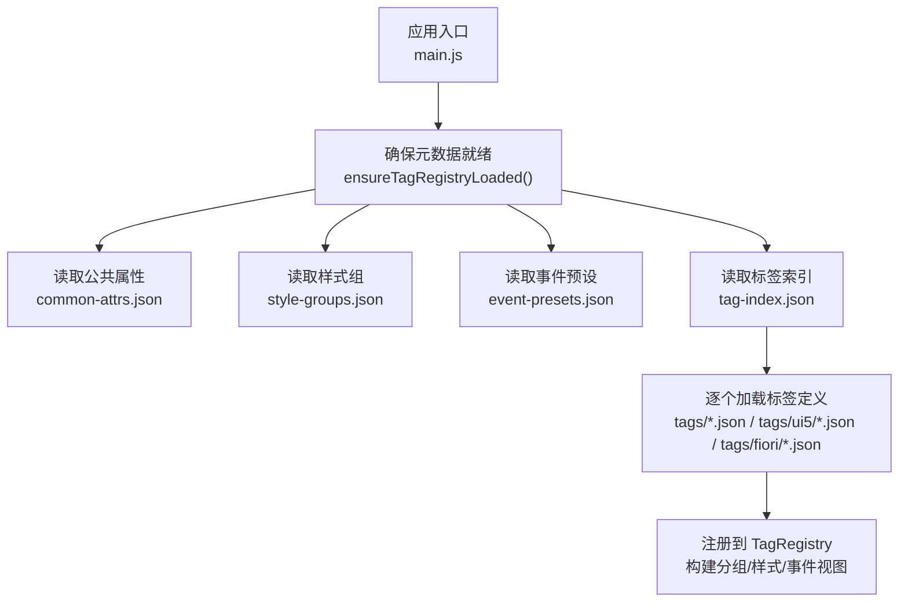
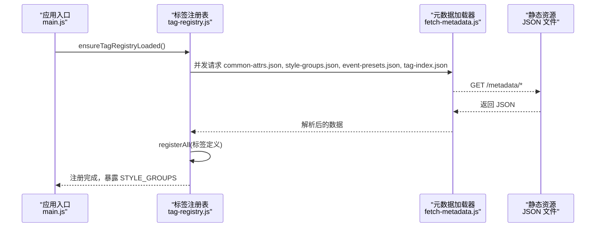
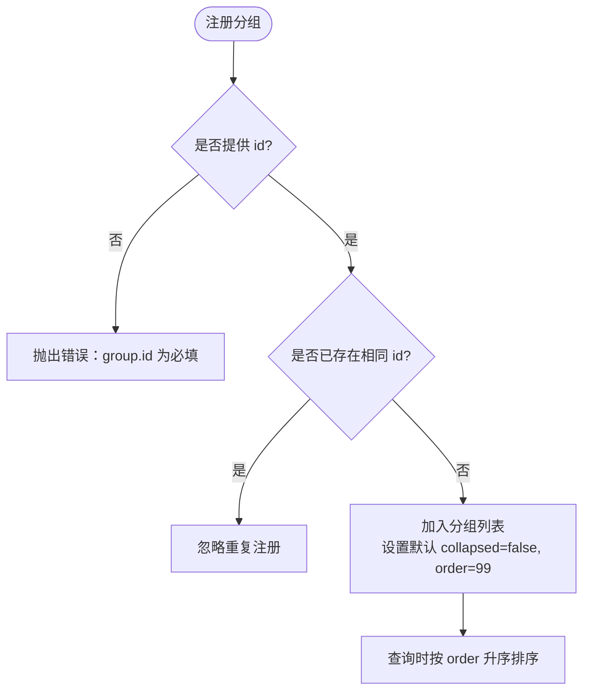
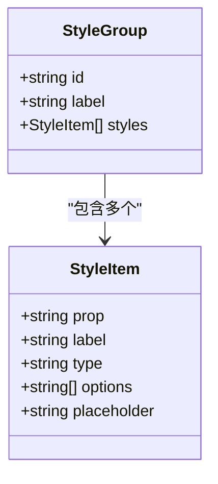
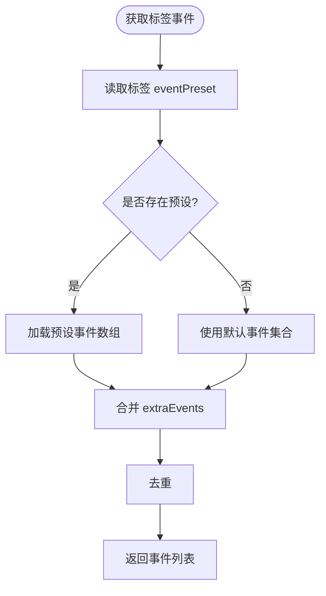
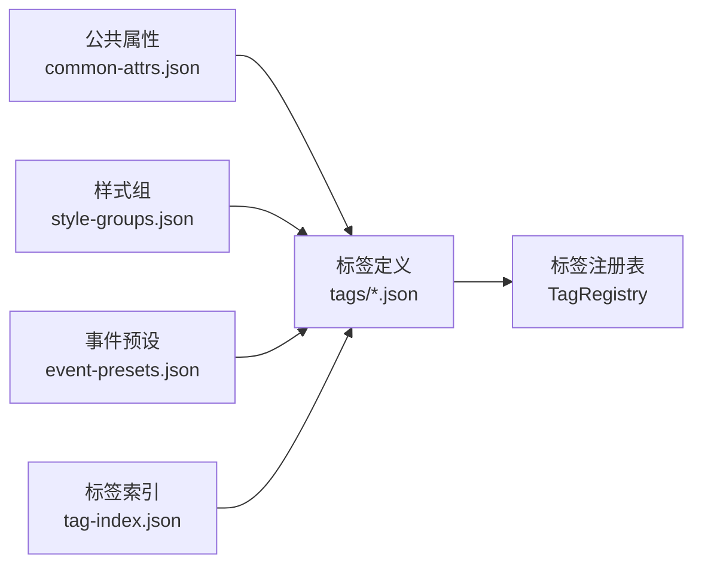
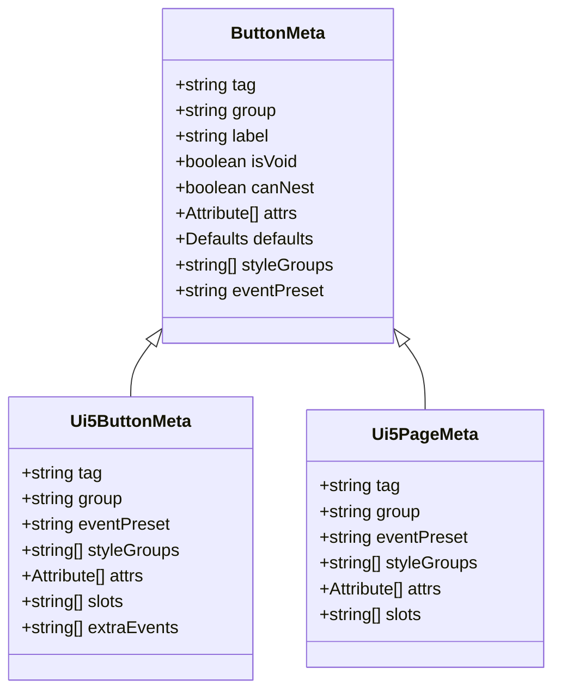
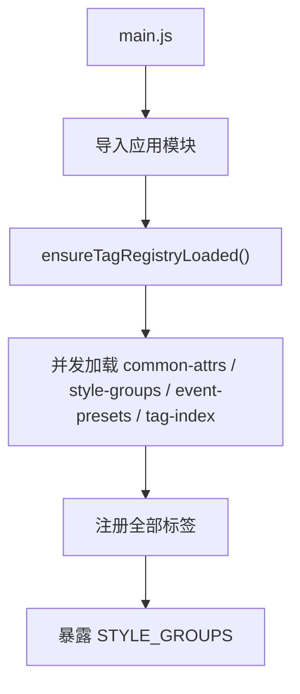

# 元数据管理

<cite>
**本文引用的文件**
- [tag-registry.js](file://CMXHTMLDesigner/src/metadata/tag-registry.js)
- [groups.js](file://CMXHTMLDesigner/src/metadata/groups.js)
- [style-groups.json](file://CMXHTMLDesigner/src/metadata/style-groups.json)
- [event-presets.json](file://CMXHTMLDesigner/src/metadata/event-presets.json)
- [common-attrs.json](file://CMXHTMLDesigner/src/metadata/common-attrs.json)
- [fetch-metadata.js](file://CMXHTMLDesigner/src/metadata/fetch-metadata.js)
- [button.json](file://CMXHTMLDesigner/src/metadata/tags/button.json)
- [ui5-button.json](file://CMXHTMLDesigner/src/metadata/tags/ui5/ui5-button.json)
- [ui5-page.json](file://CMXHTMLDesigner/src/metadata/tags/fiori/ui5-page.json)
- [vite.config.js](file://CMXHTMLDesigner/vite.config.js)
- [main.js](file://CMXHTMLDesigner/src/main.js)
</cite>

## 目录
1. [简介](#简介)
2. [项目结构](#项目结构)
3. [核心组件](#核心组件)
4. [架构总览](#架构总览)
5. [详细组件分析](#详细组件分析)
6. [依赖关系分析](#依赖关系分析)
7. [性能考虑](#性能考虑)
8. [故障排查指南](#故障排查指南)
9. [结论](#结论)
10. [附录：配置最佳实践与示例](#附录：配置最佳实践与示例)

## 简介
本指南面向元数据管理系统的开发者，围绕“组件分组、样式组、事件预设、标签索引与层次化组织”展开，说明内置与自定义分组的注册流程、样式组的配置结构与使用方式、事件预设的默认集合与扩展机制，以及元数据的层次化组织结构（标签索引、分组映射、依赖关系）。同时提供命名规范、版本控制与性能优化建议，并给出实际配置文件示例与错误处理策略。

## 项目结构
元数据相关资源集中在 HTML 设计器的 metadata 目录中，采用“配置即元数据”的方式：
- 标签索引：集中声明所有可用标签及其 JSON 路径
- 标签定义：每个标签一个 JSON，描述属性、插槽、默认值、样式组、事件预设等
- 样式组：以 JSON 数组定义可配置的样式类别与控件类型
- 事件预设：按场景分类的事件集合，供标签选择或合并
- 公共属性：跨标签通用的属性定义
- 运行时加载：通过 fetch 动态加载，避免打包体积膨胀

**图示来源**
- [main.js:16-23](file://CMXHTMLDesigner/src/main.js#L16-L23)
- [tag-registry.js:123-145](file://CMXHTMLDesigner/src/metadata/tag-registry.js#L123-L145)
- [fetch-metadata.js:10-20](file://CMXHTMLDesigner/src/metadata/fetch-metadata.js#L10-L20)

**章节来源**
- [tag-registry.js:15-118](file://CMXHTMLDesigner/src/metadata/tag-registry.js#L15-L118)
- [fetch-metadata.js:1-21](file://CMXHTMLDesigner/src/metadata/fetch-metadata.js#L1-L21)
- [vite.config.js:33-37](file://CMXHTMLDesigner/vite.config.js#L33-L37)

## 核心组件
- 标签注册表（TagRegistry）：维护标签元数据、分组、样式组、事件预设，并提供查询与聚合能力
- 分组管理（Groups）：内置分组定义与排序，支持插件扩展
- 样式组（Style Groups）：以 JSON 描述样式类别与属性编辑器
- 事件预设（Event Presets）：按场景提供默认事件集合，支持标签级扩展
- 标签索引（Tag Index）：统一索引所有标签定义的路径
- 公共属性（Common Attributes）：跨标签通用属性定义
- 元数据加载器（Fetch Metadata）：基于 Vite base 的动态加载工具

**章节来源**
- [tag-registry.js:15-118](file://CMXHTMLDesigner/src/metadata/tag-registry.js#L15-L118)
- [groups.js:5-31](file://CMXHTMLDesigner/src/metadata/groups.js#L5-L31)
- [style-groups.json:1-407](file://CMXHTMLDesigner/src/metadata/style-groups.json#L1-L407)
- [event-presets.json:1-72](file://CMXHTMLDesigner/src/metadata/event-presets.json#L1-L72)
- [common-attrs.json:1-37](file://CMXHTMLDesigner/src/metadata/common-attrs.json#L1-L37)
- [fetch-metadata.js:1-21](file://CMXHTMLDesigner/src/metadata/fetch-metadata.js#L1-L21)

## 架构总览
下图展示了从应用启动到元数据加载、注册与查询的完整流程，以及各模块之间的依赖关系。

**图示来源**
- [main.js:16-23](file://CMXHTMLDesigner/src/main.js#L16-L23)
- [tag-registry.js:123-145](file://CMXHTMLDesigner/src/metadata/tag-registry.js#L123-L145)
- [fetch-metadata.js:10-20](file://CMXHTMLDesigner/src/metadata/fetch-metadata.js#L10-L20)

## 详细组件分析

### 组件分组：定义与管理机制
- 内置分组：在 groups.js 中定义，包含 id、label、iconName、description、order、collapsed 等字段，用于调色板展示与排序
- 自定义分组：通过 TagRegistry.registerGroup(group) 进行注册，若同 id 已存在则忽略；未指定 order 时默认 99，collapsed 默认为 false
- 分组查询：getGroups() 返回所有分组并按 order 升序排列；getByGroup(groupId) 可按组筛选标签

**图示来源**
- [tag-registry.js:30-41](file://CMXHTMLDesigner/src/metadata/tag-registry.js#L30-L41)
- [groups.js:5-31](file://CMXHTMLDesigner/src/metadata/groups.js#L5-L31)

**章节来源**
- [tag-registry.js:24-41](file://CMXHTMLDesigner/src/metadata/tag-registry.js#L24-L41)
- [groups.js:5-31](file://CMXHTMLDesigner/src/metadata/groups.js#L5-L31)

### 样式组（style-groups）：配置结构和使用方式
- 配置结构：数组形式，每项为一个样式类别（如 layout、flex、text、box、position），包含 id、label、styles 数组
- 样式项：每个样式项包含 prop（CSS 属性名）、label（显示名称）、type（输入控件类型：text、select、color、number 等）、options（可选值）、placeholder（占位提示）
- 使用方式：
  - 全局样式组：在 TagRegistry 初始化时注入，作为默认样式集
  - 标签级覆盖：标签定义中的 styleGroups 字段可限定该标签可用的样式组集合
  - 运行时导出：ensureTagRegistryLoaded() 完成后，STYLE_GROUPS 暴露给 UI 渲染

**图示来源**
- [style-groups.json:1-407](file://CMXHTMLDesigner/src/metadata/style-groups.json#L1-L407)
- [tag-registry.js:96-102](file://CMXHTMLDesigner/src/metadata/tag-registry.js#L96-L102)

**章节来源**
- [style-groups.json:1-407](file://CMXHTMLDesigner/src/metadata/style-groups.json#L1-L407)
- [tag-registry.js:96-102](file://CMXHTMLDesigner/src/metadata/tag-registry.js#L96-L102)

### 事件预设（event-presets）：默认集合与扩展机制
- 默认集合：event-presets.json 按场景（common、form、media、ui5、ui5Form）定义事件数组
- 标签级选择：标签定义中的 eventPreset 字段决定基础事件集合；extraEvents 可追加额外事件
- 合并逻辑：最终事件集合 = 预设事件 + extraEvents，去重后得到唯一列表
- 回退策略：若未找到对应预设，则回退到 common 预设或内置默认事件集合

**图示来源**
- [event-presets.json:1-72](file://CMXHTMLDesigner/src/metadata/event-presets.json#L1-L72)
- [tag-registry.js:104-109](file://CMXHTMLDesigner/src/metadata/tag-registry.js#L104-L109)

**章节来源**
- [event-presets.json:1-72](file://CMXHTMLDesigner/src/metadata/event-presets.json#L1-L72)
- [tag-registry.js:104-109](file://CMXHTMLDesigner/src/metadata/tag-registry.js#L104-L109)

### 元数据的层次化组织结构：标签索引、分组映射与依赖关系
- 标签索引（tag-index.json）：集中声明所有标签的 tag 与 path，便于批量加载
- 分组映射：标签定义中的 group 字段指明所属分组；TagRegistry.getByGroups()/getByGroup() 提供分组查询
- 依赖关系：
  - 标签定义依赖公共属性（common-attrs.json）
  - 标签定义依赖样式组（style-groups.json）
  - 标签定义依赖事件预设（event-presets.json）
  - 运行时依赖 Vite base 路径（fetch-metadata.js）

**图示来源**
- [tag-registry.js:123-145](file://CMXHTMLDesigner/src/metadata/tag-registry.js#L123-L145)
- [fetch-metadata.js:10-20](file://CMXHTMLDesigner/src/metadata/fetch-metadata.js#L10-L20)

**章节来源**
- [tag-registry.js:123-145](file://CMXHTMLDesigner/src/metadata/tag-registry.js#L123-L145)
- [common-attrs.json:1-37](file://CMXHTMLDesigner/src/metadata/common-attrs.json#L1-L37)

### 标签定义示例与行为
- 按钮（button.json）：属于 default 分组，使用 form 事件预设，启用多类样式组，提供默认文本与属性
- UI5 按钮（ui5-button.json）：属于 ui5 分组，使用 ui5 事件预设，附加 extraEvents，支持更多属性与插槽
- Fiori 页面（ui5-page.json）：属于 fiori 分组，使用 ui5 事件预设，提供页面容器相关属性与插槽

**图示来源**
- [button.json:1-39](file://CMXHTMLDesigner/src/metadata/tags/button.json#L1-L39)
- [ui5-button.json:1-116](file://CMXHTMLDesigner/src/metadata/tags/ui5/ui5-button.json#L1-L116)
- [ui5-page.json:1-49](file://CMXHTMLDesigner/src/metadata/tags/fiori/ui5-page.json#L1-L49)

**章节来源**
- [button.json:1-39](file://CMXHTMLDesigner/src/metadata/tags/button.json#L1-L39)
- [ui5-button.json:1-116](file://CMXHTMLDesigner/src/metadata/tags/ui5/ui5-button.json#L1-L116)
- [ui5-page.json:1-49](file://CMXHTMLDesigner/src/metadata/tags/fiori/ui5-page.json#L1-L49)

## 依赖关系分析
- 应用入口 main.js 负责启动设计器，并在加载 UI5 runtime 后导入应用模块
- 元数据加载由 tag-registry.js 的 ensureTagRegistryLoaded() 触发，并发请求四个关键 JSON
- fetch-metadata.js 根据 Vite base 计算元数据 URL，并进行错误处理
- vite.config.js 将 metadata 插件接入构建流程，确保 dist/metadata 资源可被访问

**图示来源**
- [main.js:16-23](file://CMXHTMLDesigner/src/main.js#L16-L23)
- [tag-registry.js:123-145](file://CMXHTMLDesigner/src/metadata/tag-registry.js#L123-L145)
- [fetch-metadata.js:10-20](file://CMXHTMLDesigner/src/metadata/fetch-metadata.js#L10-L20)
- [vite.config.js:33-37](file://CMXHTMLDesigner/vite.config.js#L33-L37)

**章节来源**
- [main.js:16-23](file://CMXHTMLDesigner/src/main.js#L16-L23)
- [vite.config.js:33-37](file://CMXHTMLDesigner/vite.config.js#L33-L37)

## 性能考虑
- 并发加载：确保TagRegistry 使用 Promise.all 并发请求元数据，减少首屏等待时间
- 按需样式组：标签通过 styleGroups 限定可用样式类别，降低属性面板复杂度
- 事件最小化：仅引入必要事件预设与 extraEvents，避免冗余绑定
- 静态资源缓存：生产环境将 metadata 输出至 dist/metadata，利用浏览器缓存提升二次加载速度
- 构建优化：Vite 配置中排除大型依赖的预优化，减少包体积与构建时间

[本节为通用指导，不直接分析具体文件]

## 故障排查指南
- 元数据加载失败：
  - 现象：fetch 返回非 200 状态码
  - 原因：未构建 HTML 设计器或 base 路径不正确
  - 处理：检查 vite.config.js 的 base 与 fetch-metadata.js 的 URL 拼接，确保 /metadata/* 可访问
- 分组重复注册：
  - 现象：自定义分组未生效
  - 原因：同 id 已存在
  - 处理：确保自定义分组 id 唯一，或使用 registerGroup 前进行去重检查
- 事件缺失：
  - 现象：标签无期望事件
  - 原因：eventPreset 不存在或未配置 extraEvents
  - 处理：确认 event-presets.json 中存在对应预设，或在标签定义中追加 extraEvents
- 样式组不可用：
  - 现象：属性面板无样式选项
  - 原因：标签未启用相应 styleGroups
  - 处理：在标签定义中添加所需样式组 id

**章节来源**
- [fetch-metadata.js:10-20](file://CMXHTMLDesigner/src/metadata/fetch-metadata.js#L10-L20)
- [tag-registry.js:30-41](file://CMXHTMLDesigner/src/metadata/tag-registry.js#L30-L41)
- [tag-registry.js:104-109](file://CMXHTMLDesigner/src/metadata/tag-registry.js#L104-L109)
- [tag-registry.js:96-102](file://CMXHTMLDesigner/src/metadata/tag-registry.js#L96-L102)

## 结论
本系统通过“配置即元数据”的方式，实现了可扩展、可组合的标签元数据管理。分组、样式组、事件预设与标签定义的解耦设计，使得新增组件与定制交互变得简单且可控。结合并发加载与按需启用策略，系统在易用性与性能之间取得良好平衡。遵循命名规范与版本控制建议，可进一步提升团队协作效率与系统稳定性。

[本节为总结性内容，不直接分析具体文件]

## 附录：配置最佳实践与示例

### 命名规范
- 分组 id：使用小写英文，语义清晰（如 ui5、fiori、default）
- 样式组 id：使用小写英文，按功能域划分（如 layout、flex、text、box、position）
- 事件预设 key：使用场景名（如 common、form、media、ui5、ui5Form）
- 标签 tag：使用 kebab-case（如 ui5-button、ui5-page）
- 属性 name：使用小写英文，保持与 DOM/SAP UI5 一致

### 版本控制建议
- 将 metadata 目录纳入版本管理，变更需附带说明
- 对重大结构调整（如新增样式组、事件预设）进行增量发布
- 在标签定义中保留 __metaPath 以便溯源

### 性能优化建议
- 合理拆分样式组，避免单个组过大
- 使用事件预设减少重复定义
- 在生产环境启用静态资源缓存与 CDN

### 实际配置文件示例（路径引用）
- 分组定义：[groups.js:5-31](file://CMXHTMLDesigner/src/metadata/groups.js#L5-L31)
- 样式组：[style-groups.json:1-407](file://CMXHTMLDesigner/src/metadata/style-groups.json#L1-L407)
- 事件预设：[event-presets.json:1-72](file://CMXHTMLDesigner/src/metadata/event-presets.json#L1-L72)
- 公共属性：[common-attrs.json:1-37](file://CMXHTMLDesigner/src/metadata/common-attrs.json#L1-L37)
- 标签索引：[tag-index.json:1-800](file://CMXHTMLDesigner/src/metadata/tag-index.json#L1-L800)
- 标签定义示例：
  - [button.json:1-39](file://CMXHTMLDesigner/src/metadata/tags/button.json#L1-L39)
  - [ui5-button.json:1-116](file://CMXHTMLDesigner/src/metadata/tags/ui5/ui5-button.json#L1-L116)
  - [ui5-page.json:1-49](file://CMXHTMLDesigner/src/metadata/tags/fiori/ui5-page.json#L1-L49)

**章节来源**
- [groups.js:5-31](file://CMXHTMLDesigner/src/metadata/groups.js#L5-L31)
- [style-groups.json:1-407](file://CMXHTMLDesigner/src/metadata/style-groups.json#L1-L407)
- [event-presets.json:1-72](file://CMXHTMLDesigner/src/metadata/event-presets.json#L1-L72)
- [common-attrs.json:1-37](file://CMXHTMLDesigner/src/metadata/common-attrs.json#L1-L37)
- [tag-index.json:1-800](file://CMXHTMLDesigner/src/metadata/tag-index.json#L1-L800)
- [button.json:1-39](file://CMXHTMLDesigner/src/metadata/tags/button.json#L1-L39)
- [ui5-button.json:1-116](file://CMXHTMLDesigner/src/metadata/tags/ui5/ui5-button.json#L1-L116)
- [ui5-page.json:1-49](file://CMXHTMLDesigner/src/metadata/tags/fiori/ui5-page.json#L1-L49)