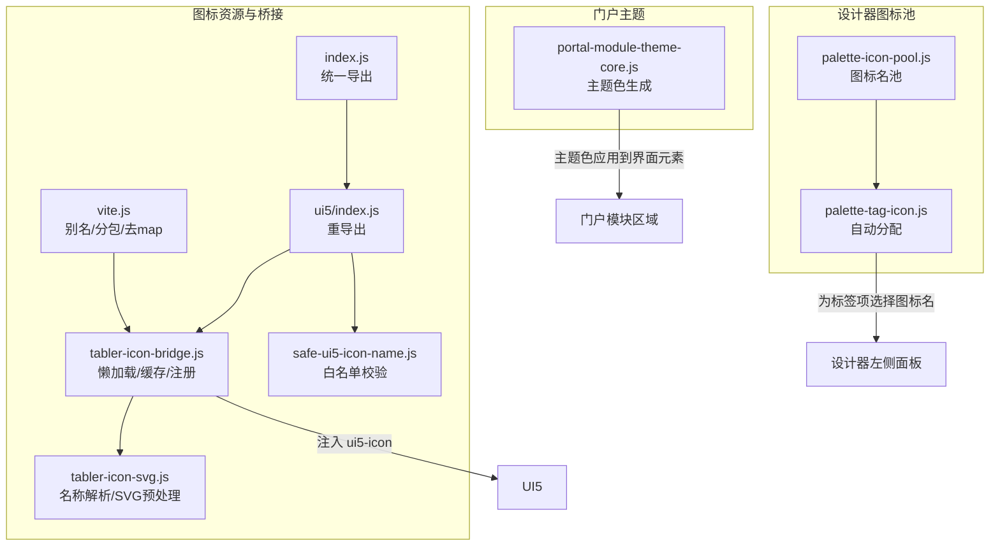
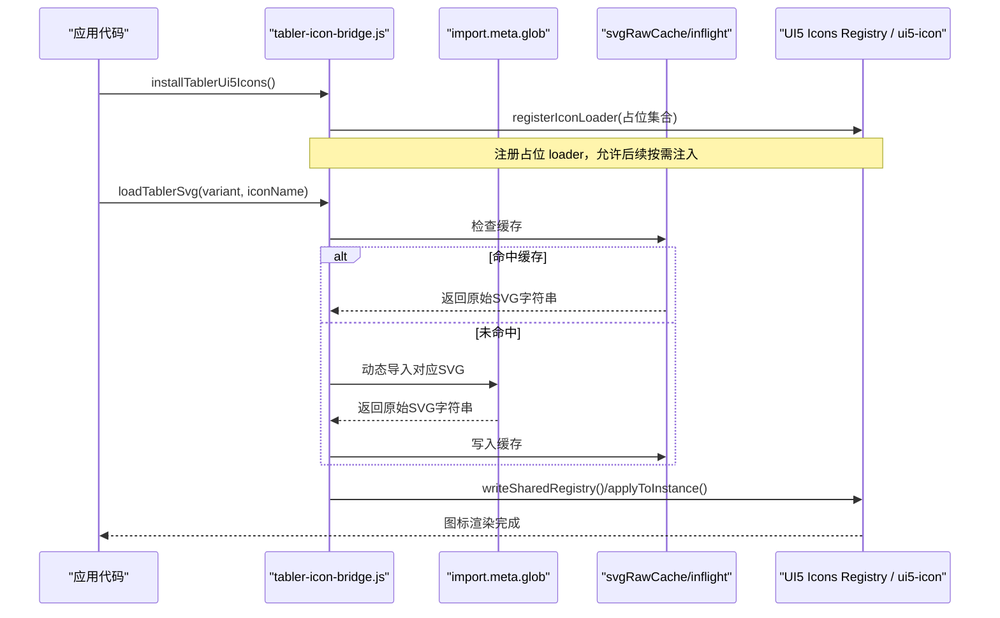
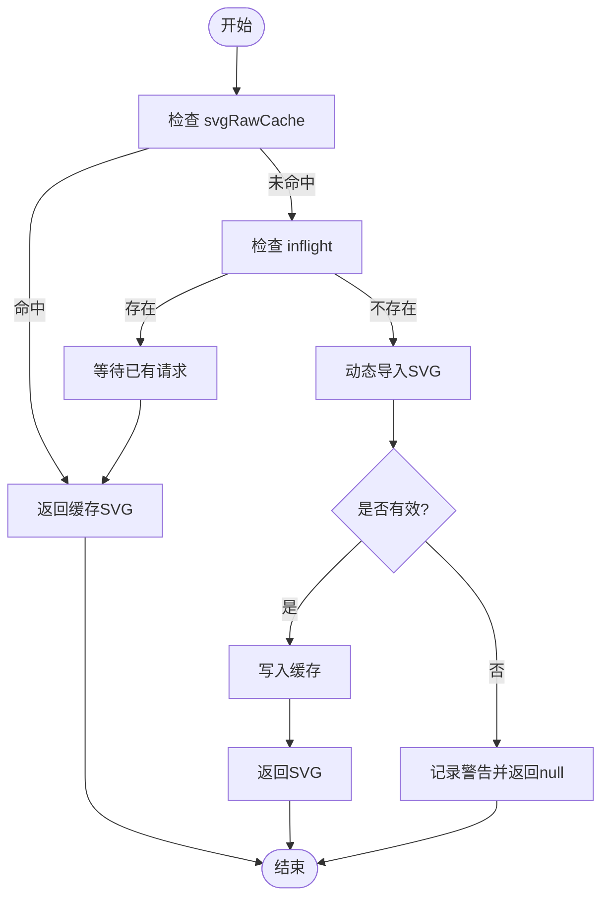
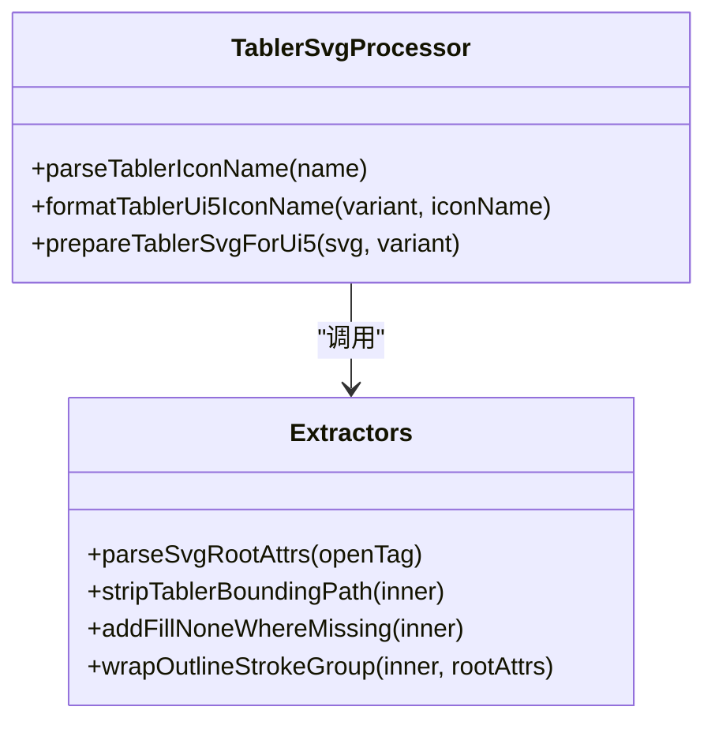
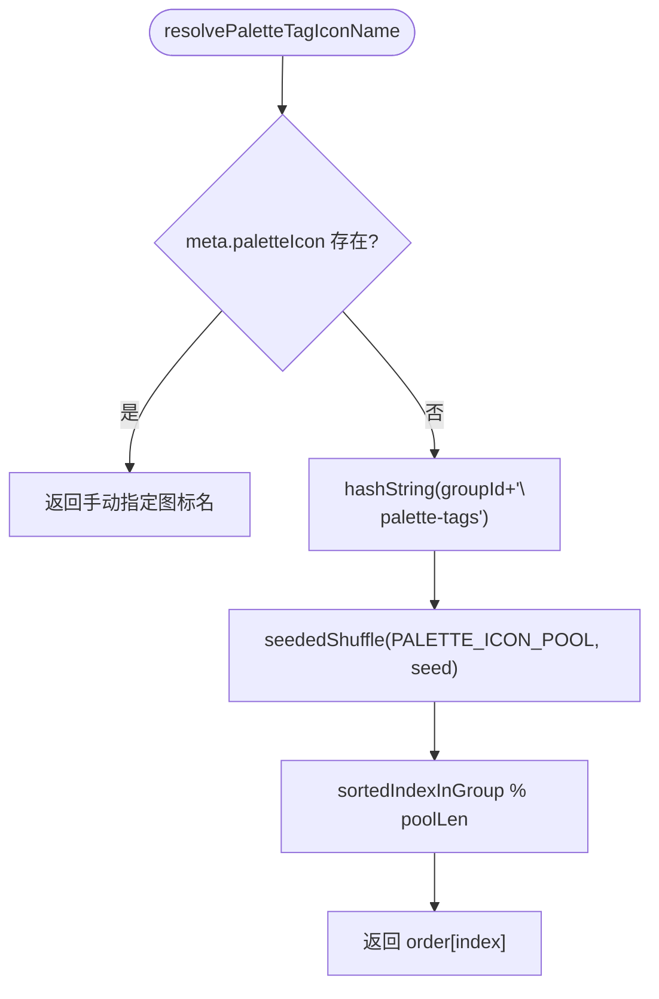
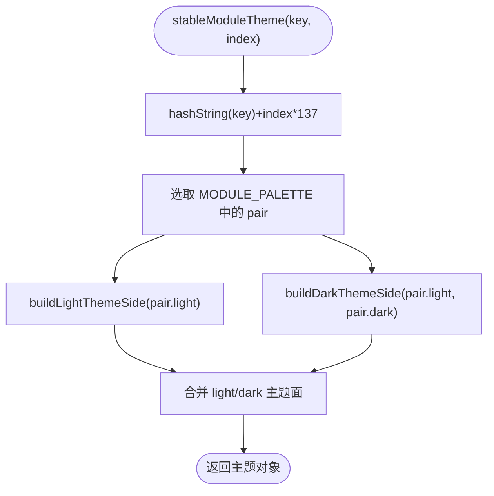
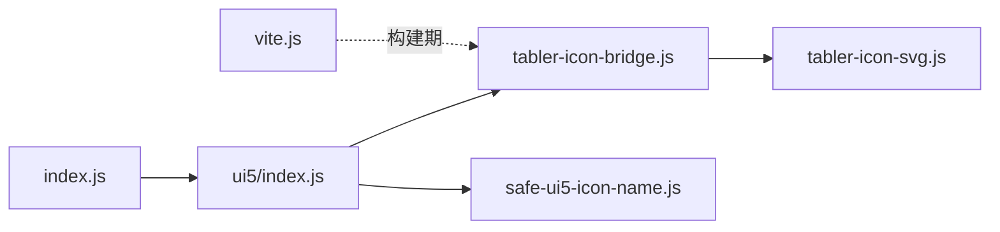

# 图标池管理

<cite>
**本文引用的文件**
- [packages/cmx-icon-resource/src/index.js](file://packages/cmx-icon-resource/src/index.js)
- [packages/cmx-icon-resource/src/ui5/index.js](file://packages/cmx-icon-resource/src/ui5/index.js)
- [packages/cmx-icon-resource/src/ui5/tabler-icon-bridge.js](file://packages/cmx-icon-resource/src/ui5/tabler-icon-bridge.js)
- [packages/cmx-icon-resource/src/ui5/tabler-icon-svg.js](file://packages/cmx-icon-resource/src/ui5/tabler-icon-svg.js)
- [packages/cmx-icon-resource/src/ui5/safe-ui5-icon-name.js](file://packages/cmx-icon-resource/src/ui5/safe-ui5-icon-name.js)
- [packages/cmx-icon-resource/vite.js](file://packages/cmx-icon-resource/vite.js)
- [CMXHTMLDesigner/src/utils/palette-icon-pool.js](file://CMXHTMLDesigner/src/utils/palette-icon-pool.js)
- [CMXHTMLDesigner/src/utils/palette-tag-icon.js](file://CMXHTMLDesigner/src/utils/palette-tag-icon.js)
- [CMXPortalManager/src/lib/portal-module-theme-core.js](file://CMXPortalManager/src/lib/portal-module-theme-core.js)
</cite>

## 目录
1. [简介](#简介)
2. [项目结构](#项目结构)
3. [核心组件](#核心组件)
4. [架构总览](#架构总览)
5. [详细组件分析](#详细组件分析)
6. [依赖关系分析](#依赖关系分析)
7. [性能与优化](#性能与优化)
8. [故障排查指南](#故障排查指南)
9. [结论](#结论)
10. [附录](#附录)

## 简介
本技术文档围绕“图标池管理系统”展开，聚焦以下目标：
- 图标资源的加载、缓存与复用机制（含 SVG 预加载策略与内存管理）
- 图标与组件的关联映射（自动分配与手动指定优先级）
- 图标主题支持与颜色管理（亮/暗主题适配）
- 性能优化策略（懒加载、构建期分包、缓存失效）
- 自定义图标集成方法（格式规范、尺寸标准、命名约定）
- 调试工具与性能监控说明

该体系以 cmx-icon-resource 为核心，提供 Tabler 图标到 UI5 的桥接能力；在设计器侧提供调色板图标池与自动分配策略；在门户侧提供模块主题色生成与配色方案。

## 项目结构
图标系统由三部分构成：
- 资源与桥接层：cmx-icon-resource 包负责 Tabler SVG 的按需加载、预处理、UI5 注册与应用
- 设计器图标池：CMXHTMLDesigner 提供调色板图标池与自动分配算法
- 门户主题：CMXPortalManager 提供模块主题色生成与标准化

图表来源
- [packages/cmx-icon-resource/src/index.js:1-33](file://packages/cmx-icon-resource/src/index.js#L1-L33)
- [packages/cmx-icon-resource/src/ui5/index.js:1-12](file://packages/cmx-icon-resource/src/ui5/index.js#L1-L12)
- [packages/cmx-icon-resource/src/ui5/tabler-icon-bridge.js:1-222](file://packages/cmx-icon-resource/src/ui5/tabler-icon-bridge.js#L1-L222)
- [packages/cmx-icon-resource/src/ui5/tabler-icon-svg.js:1-87](file://packages/cmx-icon-resource/src/ui5/tabler-icon-svg.js#L1-L87)
- [packages/cmx-icon-resource/src/ui5/safe-ui5-icon-name.js:1-19](file://packages/cmx-icon-resource/src/ui5/safe-ui5-icon-name.js#L1-L19)
- [packages/cmx-icon-resource/vite.js:1-82](file://packages/cmx-icon-resource/vite.js#L1-L82)
- [CMXHTMLDesigner/src/utils/palette-icon-pool.js:1-6](file://CMXHTMLDesigner/src/utils/palette-icon-pool.js#L1-L6)
- [CMXHTMLDesigner/src/utils/palette-tag-icon.js:1-60](file://CMXHTMLDesigner/src/utils/palette-tag-icon.js#L1-L60)
- [CMXPortalManager/src/lib/portal-module-theme-core.js:1-75](file://CMXPortalManager/src/lib/portal-module-theme-core.js#L1-L75)

章节来源
- [packages/cmx-icon-resource/src/index.js:1-33](file://packages/cmx-icon-resource/src/index.js#L1-L33)
- [packages/cmx-icon-resource/vite.js:1-82](file://packages/cmx-icon-resource/vite.js#L1-L82)
- [CMXHTMLDesigner/src/utils/palette-icon-pool.js:1-6](file://CMXHTMLDesigner/src/utils/palette-icon-pool.js#L1-L6)
- [CMXHTMLDesigner/src/utils/palette-tag-icon.js:1-60](file://CMXHTMLDesigner/src/utils/palette-tag-icon.js#L1-L60)
- [CMXPortalManager/src/lib/portal-module-theme-core.js:1-75](file://CMXPortalManager/src/lib/portal-module-theme-core.js#L1-L75)

## 核心组件
- 图标资源入口与导出：统一暴露安装、按需注册、SVG 加载、名称格式化等能力
- UI5 桥接器：实现 Tabler → UI5 的按需懒加载、共享注册表写入、实例渲染时注入
- SVG 处理：名称解析、viewBox 提取、outline/filled 差异处理、填充与描边修正
- 安全名称校验：对 ui5-icon name 进行白名单过滤，防止非法值注入
- 构建期优化：Vite 别名、按图标分包、去除图标 chunk 的 source map
- 设计器图标池：基于哈希打乱的稳定随机分配，支持手动覆盖
- 门户主题：根据模块键生成稳定的亮/暗主题色，并标准化输出

章节来源
- [packages/cmx-icon-resource/src/ui5/index.js:1-12](file://packages/cmx-icon-resource/src/ui5/index.js#L1-L12)
- [packages/cmx-icon-resource/src/ui5/tabler-icon-bridge.js:1-222](file://packages/cmx-icon-resource/src/ui5/tabler-icon-bridge.js#L1-L222)
- [packages/cmx-icon-resource/src/ui5/tabler-icon-svg.js:1-87](file://packages/cmx-icon-resource/src/ui5/tabler-icon-svg.js#L1-L87)
- [packages/cmx-icon-resource/src/ui5/safe-ui5-icon-name.js:1-19](file://packages/cmx-icon-resource/src/ui5/safe-ui5-icon-name.js#L1-L19)
- [packages/cmx-icon-resource/vite.js:1-82](file://packages/cmx-icon-resource/vite.js#L1-L82)
- [CMXHTMLDesigner/src/utils/palette-tag-icon.js:1-60](file://CMXHTMLDesigner/src/utils/palette-tag-icon.js#L1-L60)
- [CMXPortalManager/src/lib/portal-module-theme-core.js:1-75](file://CMXPortalManager/src/lib/portal-module-theme-core.js#L1-L75)

## 架构总览
图标系统采用“按需加载 + 运行时注入 + 构建期分包”的架构：
- 运行期：通过 import.meta.glob 动态导入 SVG，避免全量打包；首次使用时才加载对应 SVG
- 缓存：进程内 Map 缓存原始 SVG 文本，并发请求合并，避免重复网络/IO
- 注入：将 SVG 内容写入 UI5 共享注册表或直接设置到 ui5-icon 实例属性
- 构建期：按图标拆分独立 chunk，减少主包体积；去除图标 chunk 的 source map

图表来源
- [packages/cmx-icon-resource/src/ui5/tabler-icon-bridge.js:83-134](file://packages/cmx-icon-resource/src/ui5/tabler-icon-bridge.js#L83-L134)
- [packages/cmx-icon-resource/src/ui5/tabler-icon-bridge.js:140-184](file://packages/cmx-icon-resource/src/ui5/tabler-icon-bridge.js#L140-L184)

## 详细组件分析

### 组件A：Tabler 图标桥接器（按需加载与注入）
- 功能要点
  - 使用 import.meta.glob 收集所有 Tabler outline/filled SVG 的动态导入函数
  - 维护 svgRawCache 与 inflight 两个 Map，分别缓存原始 SVG 文本与进行中请求
  - 通过 UI5 共享资源写入 SVGIcons.registry，或直接在 ui5-icon 实例上设置 customTemplateAsString/viewBox
  - 拦截 ui5-icon 的 onBeforeRendering，识别 tabler-outline/* 或 tabler/filled/* 名称并注入内容
- 关键流程
  - 安装：注册占位 loader，延迟真正加载
  - 加载：查找对应 loader，读取原始 SVG，写入缓存
  - 注入：提取 viewBox 与 inner，写入共享注册表并更新实例属性
  - 注册：可选调用 unsafeRegisterIcon 使 getIconDataSync 可用

图表来源
- [packages/cmx-icon-resource/src/ui5/tabler-icon-bridge.js:95-134](file://packages/cmx-icon-resource/src/ui5/tabler-icon-bridge.js#L95-L134)

章节来源
- [packages/cmx-icon-resource/src/ui5/tabler-icon-bridge.js:1-222](file://packages/cmx-icon-resource/src/ui5/tabler-icon-bridge.js#L1-L222)

### 组件B：SVG 名称解析与预处理
- 名称解析：支持 tabler-outline/name 与 tabler/outline/name 两种写法
- 视图框提取：从 SVG 根节点提取 viewBox，默认回退到 0 0 24 24
- 轮廓模式修正：
  - 移除占位 path（避免 currentColor 导致黑块）
  - 为缺少 fill 的子元素添加 fill="none"
  - 将 outline 子元素包裹在带 stroke/stroke-width/stroke-linecap/stroke-linejoin 的组中
- 输出：{ viewBox, inner } 供 UI5 customTemplateAsString 使用

图表来源
- [packages/cmx-icon-resource/src/ui5/tabler-icon-svg.js:1-87](file://packages/cmx-icon-resource/src/ui5/tabler-icon-svg.js#L1-L87)

章节来源
- [packages/cmx-icon-resource/src/ui5/tabler-icon-svg.js:1-87](file://packages/cmx-icon-resource/src/ui5/tabler-icon-svg.js#L1-L87)

### 组件C：设计器图标池与自动分配
- 图标池：PALETTE_ICON_POOL 提供 SAP UI5 Icons v4 的图标名列表
- 分配策略：
  - 若元数据指定 paletteIcon，则优先使用手动指定
  - 否则基于 groupId 生成种子，对图标池进行稳定洗牌，再按排序后下标取模分配
- 效果：同一分组内尽量不重复，且不同分组可独立稳定分配

图表来源
- [CMXHTMLDesigner/src/utils/palette-tag-icon.js:1-60](file://CMXHTMLDesigner/src/utils/palette-tag-icon.js#L1-L60)
- [CMXHTMLDesigner/src/utils/palette-icon-pool.js:1-6](file://CMXHTMLDesigner/src/utils/palette-icon-pool.js#L1-L6)

章节来源
- [CMXHTMLDesigner/src/utils/palette-tag-icon.js:1-60](file://CMXHTMLDesigner/src/utils/palette-tag-icon.js#L1-L60)
- [CMXHTMLDesigner/src/utils/palette-icon-pool.js:1-6](file://CMXHTMLDesigner/src/utils/palette-icon-pool.js#L1-L6)

### 组件D：门户主题与颜色管理
- 主题色预设：MODULE_PALETTE 提供多组亮/暗主题色对
- 稳定生成：stableModuleTheme 基于 key 与 index 计算索引，生成一致的亮/暗主题
- 颜色清洗：cleanThemeColor 仅接受合法 CSS 颜色表达式
- 主题面生成：buildLightThemeSide/buildDarkThemeSide 生成 headerBg/headerText/contentBg/border 等字段

图表来源
- [CMXPortalManager/src/lib/portal-module-theme-core.js:1-75](file://CMXPortalManager/src/lib/portal-module-theme-core.js#L1-L75)

章节来源
- [CMXPortalManager/src/lib/portal-module-theme-core.js:1-75](file://CMXPortalManager/src/lib/portal-module-theme-core.js#L1-L75)

## 依赖关系分析
- 模块耦合
  - index.js 仅做统一导出，低耦合
  - ui5/index.js 重导出桥接与工具函数，便于消费方按需引入
  - tabler-icon-bridge.js 强依赖 UI5 共享资源与自定义元素生命周期
  - tabler-icon-svg.js 无外部依赖，纯文本处理
  - vite.js 提供构建期别名与分包策略，与消费方 Vite 配置解耦
- 外部依赖
  - @ui5/webcomponents-base 的共享资源与图标 API
  - 浏览器 customElements 与 import.meta.glob

图表来源
- [packages/cmx-icon-resource/src/index.js:1-33](file://packages/cmx-icon-resource/src/index.js#L1-L33)
- [packages/cmx-icon-resource/src/ui5/index.js:1-12](file://packages/cmx-icon-resource/src/ui5/index.js#L1-L12)
- [packages/cmx-icon-resource/src/ui5/tabler-icon-bridge.js:1-222](file://packages/cmx-icon-resource/src/ui5/tabler-icon-bridge.js#L1-L222)
- [packages/cmx-icon-resource/src/ui5/tabler-icon-svg.js:1-87](file://packages/cmx-icon-resource/src/ui5/tabler-icon-svg.js#L1-L87)
- [packages/cmx-icon-resource/src/ui5/safe-ui5-icon-name.js:1-19](file://packages/cmx-icon-resource/src/ui5/safe-ui5-icon-name.js#L1-L19)
- [packages/cmx-icon-resource/vite.js:1-82](file://packages/cmx-icon-resource/vite.js#L1-L82)

章节来源
- [packages/cmx-icon-resource/src/ui5/tabler-icon-bridge.js:1-222](file://packages/cmx-icon-resource/src/ui5/tabler-icon-bridge.js#L1-L222)
- [packages/cmx-icon-resource/vite.js:1-82](file://packages/cmx-icon-resource/vite.js#L1-L82)

## 性能与优化
- 懒加载与按需注册
  - 使用 import.meta.glob ?raw 动态导入 SVG，仅在首次使用时加载
  - 通过 registerIconLoader 注册占位集合，避免启动时加载真实资源
- 并发与缓存
  - inflight 合并重复请求，避免多次 IO
  - svgRawCache 缓存原始 SVG 文本，提升二次渲染速度
- 构建期优化
  - 图标相关 chunk 单独输出到 images/，与主 assets/ 分离
  - 去除图标 chunk 的 source map，减小产物体积
- 渲染优化
  - 直接设置 customTemplateAsString 与 viewBox，减少中间转换
  - 对 outline 模式进行 fill/stroke 修正，避免黑块重绘
- 缓存失效策略
  - 当前实现为进程内 Map，页面刷新即失效
  - 如需跨会话持久化，可在上层增加 IndexedDB/LocalStorage 缓存，并结合版本号或 hash 作为键前缀
- 精灵图建议
  - 当前采用 SVG 直出，无需传统精灵图
  - 若需进一步降低 HTTP 请求，可将常用图标内联为 base64 或合并为单一 SVG sprite，但需权衡可访问性与样式控制

[本节为通用性能指导，不直接分析具体文件]

## 故障排查指南
- 常见问题
  - 图标未显示：确认已调用 installTablerUi5Icons，并确保 ui5-icon 已定义
  - 名称错误：使用 safeUi5IconName 进行白名单校验，避免非法 name
  - 空 SVG：loadTablerSvg 会记录警告并返回 null，检查文件名与路径
  - 黑块问题：outline 模式下确保经过 prepareTablerSvgForUi5 处理
- 定位步骤
  - 控制台查看 [cmx-icon-resource] 警告信息
  - 检查 UI5 共享注册表是否写入成功
  - 验证 ui5-icon 实例属性是否正确设置
- 调试建议
  - 在 onBeforeRendering 断点处观察 name 解析结果
  - 打印 svgRawCache 与 inflight 状态，确认缓存命中情况
  - 使用浏览器 Network 面板确认懒加载 chunk 是否被触发

章节来源
- [packages/cmx-icon-resource/src/ui5/tabler-icon-bridge.js:186-222](file://packages/cmx-icon-resource/src/ui5/tabler-icon-bridge.js#L186-L222)
- [packages/cmx-icon-resource/src/ui5/safe-ui5-icon-name.js:1-19](file://packages/cmx-icon-resource/src/ui5/safe-ui5-icon-name.js#L1-L19)
- [packages/cmx-icon-resource/src/ui5/tabler-icon-svg.js:1-87](file://packages/cmx-icon-resource/src/ui5/tabler-icon-svg.js#L1-L87)

## 结论
本图标池管理系统通过“按需加载 + 进程内缓存 + 构建期分包”的组合策略，实现了高效、可扩展的图标资源管理。设计器侧提供稳定的自动分配机制，门户侧提供一致的主题色生成。整体架构清晰、职责分明，易于扩展与维护。

[本节为总结性内容，不直接分析具体文件]

## 附录

### 图标与组件的关联映射与优先级
- 自动分配：设计器侧基于分组种子与排序下标从图标池中分配，保证稳定性与低重复率
- 手动指定：若元数据包含 paletteIcon，则优先使用手动指定，覆盖自动分配
- 名称规范化：通过 safeUi5IconName 对 ui5-icon name 进行白名单校验，确保安全性

章节来源
- [CMXHTMLDesigner/src/utils/palette-tag-icon.js:43-59](file://CMXHTMLDesigner/src/utils/palette-tag-icon.js#L43-L59)
- [packages/cmx-icon-resource/src/ui5/safe-ui5-icon-name.js:1-19](file://packages/cmx-icon-resource/src/ui5/safe-ui5-icon-name.js#L1-L19)

### 自定义图标集成方法
- 格式规范：推荐使用 SVG，确保 viewBox 合理，避免多余占位 path
- 尺寸标准：建议 24x24 视口，便于与现有图标集保持一致
- 命名约定：遵循 tabler-{variant}/{iconName} 或 tabler/{variant}/{iconName} 形式
- 集成步骤：
  - 将 SVG 放入 icons/tabler/{variant}/ 目录
  - 通过 import.meta.glob 自动发现
  - 使用 ensureTablerUi5Icon 或 applyTablerSvgToUi5Icon 进行注册与注入

章节来源
- [packages/cmx-icon-resource/src/ui5/tabler-icon-svg.js:5-21](file://packages/cmx-icon-resource/src/ui5/tabler-icon-svg.js#L5-L21)
- [packages/cmx-icon-resource/src/ui5/tabler-icon-bridge.js:161-184](file://packages/cmx-icon-resource/src/ui5/tabler-icon-bridge.js#L161-L184)

### 调试工具与性能监控
- 控制台日志：loadTablerSvg 与 applyTablerSvgToUi5Icon 在异常路径输出警告
- 构建产物：images/ 下的图标 chunk 不包含 source map，便于生产环境部署
- 监控建议：
  - 统计 svgRawCache 命中率，评估缓存有效性
  - 监控 inflight 队列长度，识别并发热点
  - 结合 Performance 面板观察首次渲染耗时与懒加载触发时机

章节来源
- [packages/cmx-icon-resource/src/ui5/tabler-icon-bridge.js:113-134](file://packages/cmx-icon-resource/src/ui5/tabler-icon-bridge.js#L113-L134)
- [packages/cmx-icon-resource/vite.js:39-60](file://packages/cmx-icon-resource/vite.js#L39-L60)