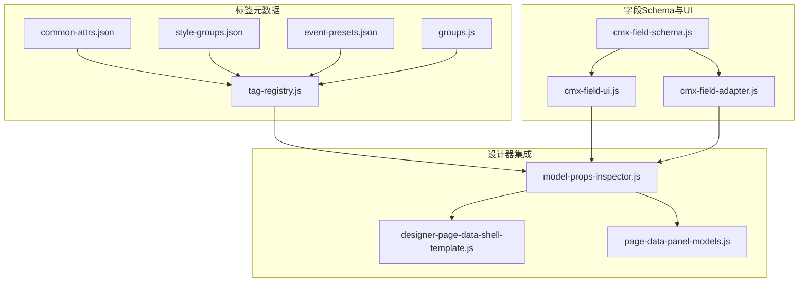
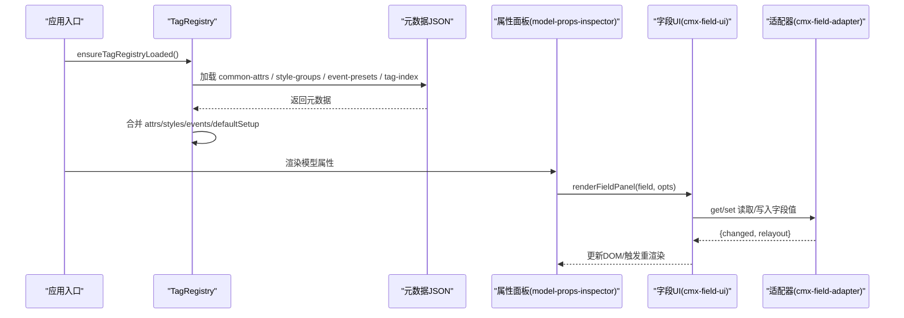
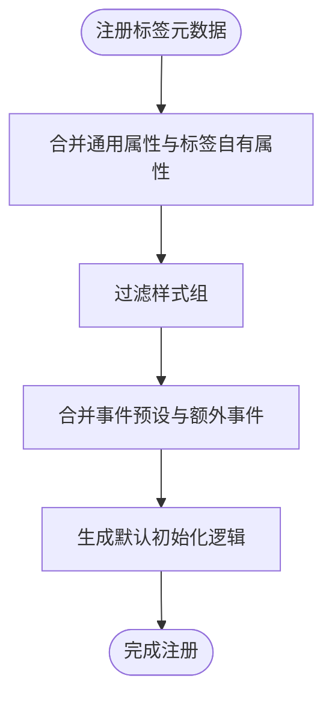
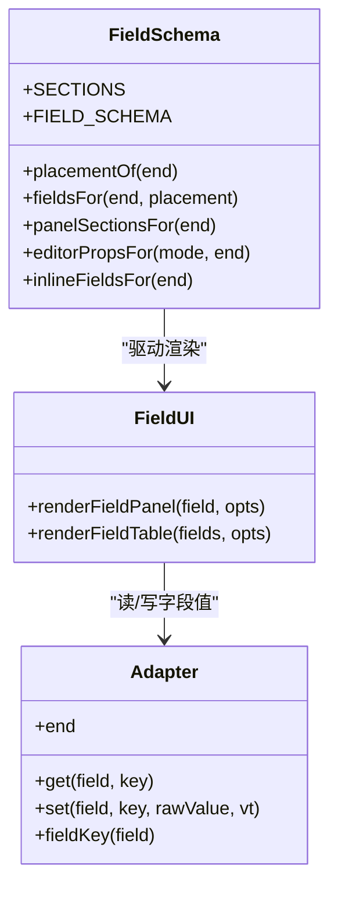
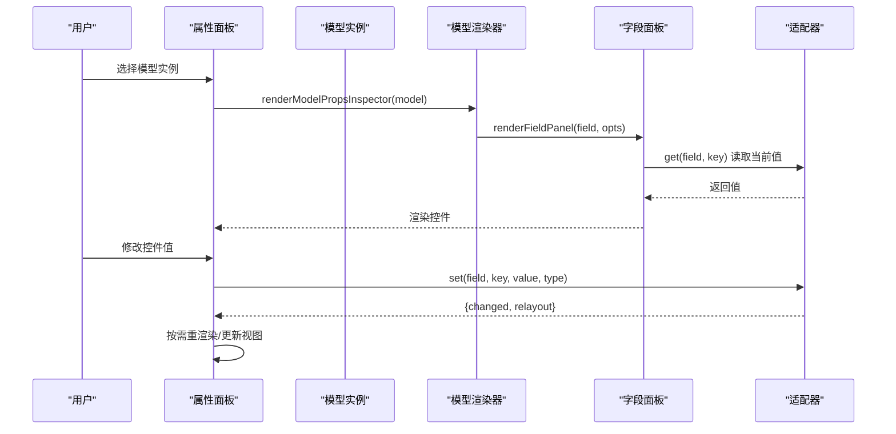
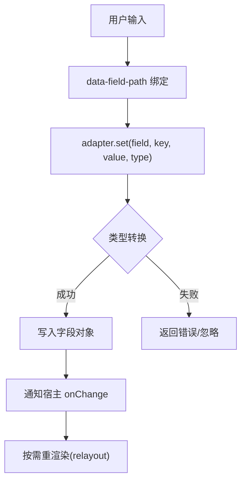
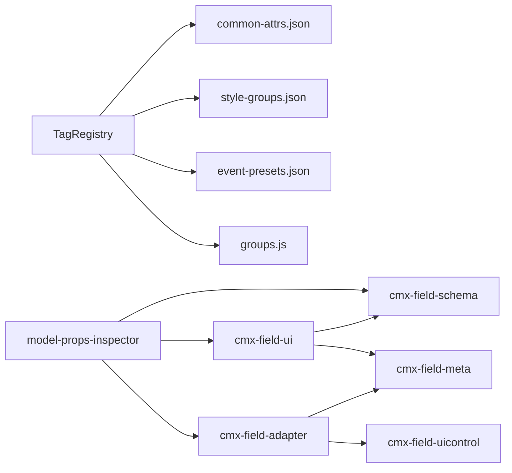

# 属性系统

<cite>
**本文引用的文件**
- [common-attrs.json](file://CMXHTMLDesigner/src/metadata/common-attrs.json)
- [tag-registry.js](file://CMXHTMLDesigner/src/metadata/tag-registry.js)
- [groups.js](file://CMXHTMLDesigner/src/metadata/groups.js)
- [style-groups.json](file://CMXHTMLDesigner/src/metadata/style-groups.json)
- [event-presets.json](file://CMXHTMLDesigner/src/metadata/event-presets.json)
- [model-props-inspector.js](file://CMXHTMLDesigner/src/components/designer-inspector/model-props-inspector.js)
- [designer-page-data-shell-template.js](file://CMXHTMLDesigner/src/components/designer-page-data/designer-page-data-shell-template.js)
- [page-data-panel-models.js](file://CMXHTMLDesigner/src/components/designer-page-data/page-data-panel-models.js)
- [cmx-field-schema.js](file://packages/cmx-data-comp/src/lib/cmx-field-schema.js)
- [cmx-field-ui.js](file://packages/cmx-data-comp/src/lib/cmx-field-ui.js)
- [cmx-field-adapter.js](file://packages/cmx-data-comp/src/lib/cmx-field-adapter.js)
- [validation.ts](file://cmx-mega-sheet/src/core/validation.ts)
</cite>

## 目录
1. [简介](#简介)
2. [项目结构](#项目结构)
3. [核心组件](#核心组件)
4. [架构总览](#架构总览)
5. [详细组件分析](#详细组件分析)
6. [依赖关系分析](#依赖关系分析)
7. [性能考量](#性能考量)
8. [故障排查指南](#故障排查指南)
9. [结论](#结论)
10. [附录](#附录)

## 简介
本文件为 CMX 属性系统的开发文档，聚焦以下目标：
- 通用属性（common-attrs）的定义规范与继承机制，统一 HTML 标准属性与 CMX 自定义属性。
- 属性类型系统与验证规则，覆盖字符串、数字、布尔值、枚举、对象等。
- 属性面板的自动生成机制：基于元数据的 UI 控件选择与渲染逻辑。
- 属性绑定与数据同步：双向绑定、实时预览、变更检测。
- 复杂属性类型的处理方案：数组、嵌套对象、函数/公式配置。
- 属性验证、错误提示与用户友好的编辑体验设计。

## 项目结构
属性系统由“标签元数据注册表 + 字段 Schema + 字段 UI 渲染 + 适配器”四部分组成，分别位于 CMXHTMLDesigner 与 cmx-data-comp 两个子项目中：
- 标签元数据注册表：负责加载 common-attrs、style-groups、event-presets、tag-index，并合并生成每个标签的可用属性集。
- 字段 Schema：定义三端（DCT/DOC/FLC）统一的字段属性集合、分区、控件类型、可见性/启用条件。
- 字段 UI 渲染：根据 Schema 动态生成表格内联编辑与右侧详编面板。
- 适配器：将 Schema 的规范键映射到各端实际存储路径，并提供类型转换、联动重渲染等能力。

图表来源
- [tag-registry.js:15-149](file://CMXHTMLDesigner/src/metadata/tag-registry.js#L15-L149)
- [cmx-field-schema.js:21-351](file://packages/cmx-data-comp/src/lib/cmx-field-schema.js#L21-L351)
- [cmx-field-ui.js:15-212](file://packages/cmx-data-comp/src/lib/cmx-field-ui.js#L15-L212)
- [cmx-field-adapter.js:22-203](file://packages/cmx-data-comp/src/lib/cmx-field-adapter.js#L22-L203)
- [model-props-inspector.js:14-31](file://CMXHTMLDesigner/src/components/designer-inspector/model-props-inspector.js#L14-L31)

章节来源
- [tag-registry.js:15-149](file://CMXHTMLDesigner/src/metadata/tag-registry.js#L15-L149)
- [cmx-field-schema.js:21-351](file://packages/cmx-data-comp/src/lib/cmx-field-schema.js#L21-L351)
- [cmx-field-ui.js:15-212](file://packages/cmx-data-comp/src/lib/cmx-field-ui.js#L15-L212)
- [cmx-field-adapter.js:22-203](file://packages/cmx-data-comp/src/lib/cmx-field-adapter.js#L22-L203)
- [model-props-inspector.js:14-31](file://CMXHTMLDesigner/src/components/designer-inspector/model-props-inspector.js#L14-L31)

## 核心组件
- 标签元数据注册表（TagRegistry）：集中管理标签分组、样式组、事件预设，并在 ensureTagRegistryLoaded 时异步加载 common-attrs、style-groups、event-presets、tag-index，合并后注册所有标签元数据。
- 字段 Schema（FIELD_SCHEMA）：统一三端字段属性定义，包含基本、引用字典、编辑、显示、约束、治理、控制、计算与带出、列布局等分区；支持 placement（inline/panel）、appliesTo（DCT/DOC/FLC）、visibleWhen/enableWhen 等运行时钩子。
- 字段 UI 渲染（renderFieldPanel/renderFieldTable）：按 Schema 动态生成控件（text/number/checkbox/select/select-text/formula/validations/enum-values），并输出可交互的 HTML。
- 字段适配器（makeDctAdapter/makeFlcAdapter）：读写桥接，处理类型转换（number/boolean/boolean-int/list/boolean-visible）、空值回收、联动重渲染（relayout）。

章节来源
- [tag-registry.js:15-149](file://CMXHTMLDesigner/src/metadata/tag-registry.js#L15-L149)
- [cmx-field-schema.js:21-351](file://packages/cmx-data-comp/src/lib/cmx-field-schema.js#L21-L351)
- [cmx-field-ui.js:15-212](file://packages/cmx-data-comp/src/lib/cmx-field-ui.js#L15-L212)
- [cmx-field-adapter.js:22-203](file://packages/cmx-data-comp/src/lib/cmx-field-adapter.js#L22-L203)

## 架构总览
属性系统采用“声明式元数据驱动”的架构：
- 元数据层：common-attrs.json 定义通用属性；style-groups.json 定义样式属性分组；event-presets.json 定义事件预设；groups.js 定义分组信息。
- 注册层：TagRegistry 在启动时加载元数据，合并为每个标签的 attrs/styles/events/defaultSetup。
- 模型属性层：model-props-inspector 针对具体模型类型（CmxDataSet/CmxMasterSlave/CmxColumnModel/FlexibleCombination）渲染属性表单。
- 字段面板层：cmx-data-comp 提供通用的字段 Schema 与 UI 渲染，支持多端差异化展示与行为。
- 适配层：适配器负责将 UI 层的规范键映射到各端存储路径，并执行类型转换与联动更新。

图表来源
- [tag-registry.js:123-146](file://CMXHTMLDesigner/src/metadata/tag-registry.js#L123-L146)
- [model-props-inspector.js:14-31](file://CMXHTMLDesigner/src/components/designer-inspector/model-props-inspector.js#L14-L31)
- [cmx-field-ui.js:182-212](file://packages/cmx-data-comp/src/lib/cmx-field-ui.js#L182-L212)
- [cmx-field-adapter.js:72-203](file://packages/cmx-data-comp/src/lib/cmx-field-adapter.js#L72-L203)

## 详细组件分析

### 通用属性（common-attrs）与继承机制
- 通用属性定义：common-attrs.json 列出 id、class、title、hidden、tabindex、lang 等通用属性，统一应用于所有标签。
- 继承机制：TagRegistry.register 会将 _commonAttrs 与标签自身 attrs 合并，形成最终 attrs 列表；get(tag) 对未知标签也回退到默认 attrs。
- 样式与事件：_stylesFromMeta 与 _eventsFromMeta 分别根据 styleGroups 和 eventPresets 决定可用样式与事件集合。

图表来源
- [tag-registry.js:43-65](file://CMXHTMLDesigner/src/metadata/tag-registry.js#L43-L65)
- [tag-registry.js:81-109](file://CMXHTMLDesigner/src/metadata/tag-registry.js#L81-L109)

章节来源
- [common-attrs.json:1-37](file://CMXHTMLDesigner/src/metadata/common-attrs.json#L1-L37)
- [tag-registry.js:43-109](file://CMXHTMLDesigner/src/metadata/tag-registry.js#L43-L109)

### 属性类型系统与验证规则
- 类型系统：cmx-field-schema.js 定义了 FIELD_SCHEMA，涵盖 basic/reference/edit/display/constraint/governance/control/compute/flcLayout 等分区；control 包括 text/number/checkbox/select/select-labeled/select-text/formula/validations/enum-values。
- 值类型转换：cmx-field-adapter.js 的 coerce 支持 number、boolean、boolean-int、list、boolean-visible 等类型转换；adapters 在 set 时自动处理空值删除与嵌套路径创建。
- 验证引擎：cmx-mega-sheet 的 validation.ts 提供 validateValue，支持 list/whole/decimal/date/textLength/custom 等规则，失败返回 message。

图表来源
- [cmx-field-schema.js:21-351](file://packages/cmx-data-comp/src/lib/cmx-field-schema.js#L21-L351)
- [cmx-field-adapter.js:22-203](file://packages/cmx-data-comp/src/lib/cmx-field-adapter.js#L22-L203)
- [cmx-field-ui.js:15-212](file://packages/cmx-data-comp/src/lib/cmx-field-ui.js#L15-L212)

章节来源
- [cmx-field-schema.js:21-351](file://packages/cmx-data-comp/src/lib/cmx-field-schema.js#L21-L351)
- [cmx-field-adapter.js:22-203](file://packages/cmx-data-comp/src/lib/cmx-field-adapter.js#L22-L203)
- [validation.ts:1-87](file://cmx-mega-sheet/src/core/validation.ts#L1-L87)

### 属性面板的自动生成机制
- 模型属性编辑器：model-props-inspector.js 根据 modelType 选择对应渲染器（renderDataSet/renderMasterSlave/renderColumnModel/renderFlexibleCombination），并挂载到右侧 Inspector。
- 字段面板渲染：cmx-field-ui.js 的 renderFieldPanel 按 SECTIONS 分组，结合 editorPropsFor 动态生成“录入控件属性”区；控件类型由 control 决定。
- 设计器集成：designer-page-data-shell-template.js 提供 Models 面板模板；page-data-panel-models.js 负责选中模型后渲染属性区并触发变更事件。

图表来源
- [model-props-inspector.js:14-31](file://CMXHTMLDesigner/src/components/designer-inspector/model-props-inspector.js#L14-L31)
- [cmx-field-ui.js:182-212](file://packages/cmx-data-comp/src/lib/cmx-field-ui.js#L182-L212)
- [cmx-field-adapter.js:72-203](file://packages/cmx-data-comp/src/lib/cmx-field-adapter.js#L72-L203)

章节来源
- [model-props-inspector.js:14-31](file://CMXHTMLDesigner/src/components/designer-inspector/model-props-inspector.js#L14-L31)
- [designer-page-data-shell-template.js:33-64](file://CMXHTMLDesigner/src/components/designer-page-data/designer-page-data-shell-template.js#L33-L64)
- [page-data-panel-models.js:209-250](file://CMXHTMLDesigner/src/components/designer-page-data/page-data-panel-models.js#L209-L250)
- [cmx-field-ui.js:182-212](file://packages/cmx-data-comp/src/lib/cmx-field-ui.js#L182-L212)

### 属性绑定与数据同步机制
- 双向绑定：适配器 set 方法将 UI 输入转换为规范值并写入字段对象；get 方法用于渲染控件初始值。
- 实时预览：UI 层通过 data-field-path/data-field-prop 标记控件，宿主监听 input/change 事件调用 adapter.set，并触发 onChange 回调以刷新预览。
- 变更检测：适配器返回 {changed, relayout}，relayout=true 表示需重渲染（如 edit.mode/display.mode 变化影响 visibleWhen）。

图表来源
- [cmx-field-adapter.js:56-64](file://packages/cmx-data-comp/src/lib/cmx-field-adapter.js#L56-L64)
- [cmx-field-adapter.js:179-200](file://packages/cmx-data-comp/src/lib/cmx-field-adapter.js#L179-L200)
- [model-props-inspector.js:462-492](file://CMXHTMLDesigner/src/components/designer-inspector/model-props-inspector.js#L462-L492)

章节来源
- [cmx-field-adapter.js:56-64](file://packages/cmx-data-comp/src/lib/cmx-field-adapter.js#L56-L64)
- [cmx-field-adapter.js:179-200](file://packages/cmx-data-comp/src/lib/cmx-field-adapter.js#L179-L200)
- [model-props-inspector.js:462-492](file://CMXHTMLDesigner/src/components/designer-inspector/model-props-inspector.js#L462-L492)

### 复杂属性类型的处理方案
- 数组：dependsOn 使用逗号串 ↔ 数组转换；enumValues 支持 [{value,label}] 或旧 string[]/逗号串归一化；validations 为数组行编辑。
- 嵌套对象：display.*、edit.*、source.*、defaultFrom.* 等通过 setPath/delPath 安全写入/删除，空对象自动回收。
- 函数/公式：formula 控件在 FLC 端提供公式编辑器按钮（open-formula），其他端降级为文本输入；validations.expr 支持表达式字符串。

章节来源
- [cmx-field-schema.js:266-285](file://packages/cmx-data-comp/src/lib/cmx-field-schema.js#L266-L285)
- [cmx-field-ui.js:92-124](file://packages/cmx-data-comp/src/lib/cmx-field-ui.js#L92-L124)
- [cmx-field-adapter.js:29-55](file://packages/cmx-data-comp/src/lib/cmx-field-adapter.js#L29-L55)

### 属性验证、错误提示与用户体验
- 验证规则：validateValue 支持 list/whole/decimal/date/textLength/custom，失败返回 message；表单组件内部校验（如 CmxTextInput.validate）支持长度/正则/身份证附加校验。
- 错误提示：属性面板中 JSON 输入区域（如 ds-rows、fc-inlineData）实时解析并显示错误消息；enum-values 重复 value 高亮提示。
- 用户体验：select-text 复合控件防丢值；tips 提供配置说明 Popover；visibleWhen/enableWhen 动态控制控件显隐与可用性。

章节来源
- [validation.ts:24-87](file://cmx-mega-sheet/src/core/validation.ts#L24-L87)
- [model-props-inspector.js:166-186](file://CMXHTMLDesigner/src/components/designer-inspector/model-props-inspector.js#L166-L186)
- [model-props-inspector.js:402-423](file://CMXHTMLDesigner/src/components/designer-inspector/model-props-inspector.js#L402-L423)
- [cmx-field-ui.js:73-86](file://packages/cmx-data-comp/src/lib/cmx-field-ui.js#L73-L86)

## 依赖关系分析
- TagRegistry 依赖 common-attrs.json、style-groups.json、event-presets.json、groups.js，并在 ensureTagRegistryLoaded 时异步加载 tag-index 及 tags/* 元数据。
- model-props-inspector 依赖 cmx-data-comp 的 fieldId、makeFlcAdapter、renderFieldPanel，实现模型属性的统一渲染。
- cmx-field-ui 依赖 cmx-field-schema 的 panelSectionsFor/editorPropsFor/inlineFieldsFor，以及 cmx-field-meta 的 fieldId。
- cmx-field-adapter 依赖 cmx-field-uicontrol 的 EDIT_MODES/toEditMode，以及 cmx-field-meta 的字段元信息操作。

图表来源
- [tag-registry.js:123-146](file://CMXHTMLDesigner/src/metadata/tag-registry.js#L123-L146)
- [model-props-inspector.js:1-5](file://CMXHTMLDesigner/src/components/designer-inspector/model-props-inspector.js#L1-L5)
- [cmx-field-ui.js:15-18](file://packages/cmx-data-comp/src/lib/cmx-field-ui.js#L15-L18)
- [cmx-field-adapter.js:19-21](file://packages/cmx-data-comp/src/lib/cmx-field-adapter.js#L19-L21)

章节来源
- [tag-registry.js:123-146](file://CMXHTMLDesigner/src/metadata/tag-registry.js#L123-L146)
- [model-props-inspector.js:1-5](file://CMXHTMLDesigner/src/components/designer-inspector/model-props-inspector.js#L1-L5)
- [cmx-field-ui.js:15-18](file://packages/cmx-data-comp/src/lib/cmx-field-ui.js#L15-L18)
- [cmx-field-adapter.js:19-21](file://packages/cmx-data-comp/src/lib/cmx-field-adapter.js#L19-L21)

## 性能考量
- 懒加载与缓存：TagRegistry.ensureTagRegistryLoaded 使用 Promise 缓存，避免重复加载元数据。
- 局部重渲染：适配器返回 relayout 标志，仅在必要时触发面板重渲染（如 edit.mode/display.mode），避免全量刷新导致的跳顶/失焦。
- 防丢值机制：select-text 控件在 select 切换时同步 input 值，减少不必要的全量重渲染。
- 空对象回收：delPath 在删除叶子后自动回收空父对象，保持数据结构整洁。

[本节为通用性能建议，不直接分析具体文件]

## 故障排查指南
- JSON 格式错误：ds-rows/fc-inlineData 输入框在解析失败时显示错误消息，检查 JSON 结构是否符合预期。
- 枚举值重复：enum-values 中重复 value 会高亮提示，需去重以保证唯一性。
- 类型转换失败：number/boolean 输入为空或非预期值会被转换为 undefined/false，检查 valueType 配置是否正确。
- 联动失效：若 display.mode/edit.mode 变更后未生效，确认适配器是否返回 relayout=true，并检查 visibleWhen/enableWhen 逻辑。

章节来源
- [model-props-inspector.js:166-186](file://CMXHTMLDesigner/src/components/designer-inspector/model-props-inspector.js#L166-L186)
- [model-props-inspector.js:402-423](file://CMXHTMLDesigner/src/components/designer-inspector/model-props-inspector.js#L402-L423)
- [cmx-field-ui.js:102-124](file://packages/cmx-data-comp/src/lib/cmx-field-ui.js#L102-L124)
- [cmx-field-adapter.js:179-200](file://packages/cmx-data-comp/src/lib/cmx-field-adapter.js#L179-L200)

## 结论
本属性系统通过声明式元数据驱动，实现了 HTML 标准属性与 CMX 自定义属性的统一管理，提供了强大的类型系统与验证能力，并支持复杂的数组、嵌套对象与公式配置。属性面板自动生成机制降低了开发成本，适配器确保了跨端数据一致性与联动更新。整体架构清晰、可扩展性强，适合企业级页面设计与数据建模场景。

[本节为总结性内容，不直接分析具体文件]

## 附录
- 常用属性键参考：见 cmx-field-schema.js 的 FIELD_SCHEMA。
- 事件预设参考：见 event-presets.json。
- 样式分组参考：见 style-groups.json。
- 通用属性参考：见 common-attrs.json。

[本节为参考资料索引，不直接分析具体文件]