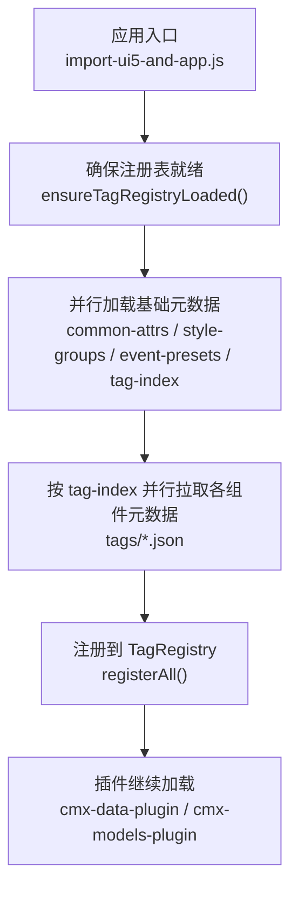
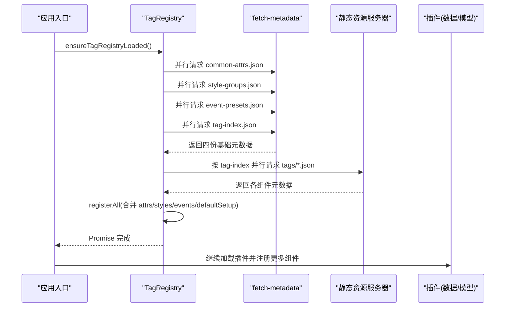
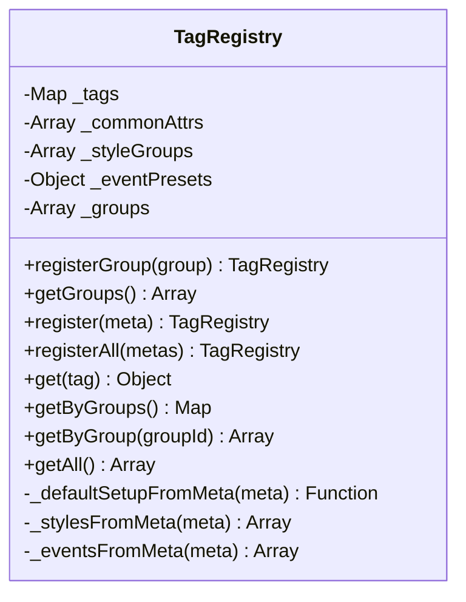
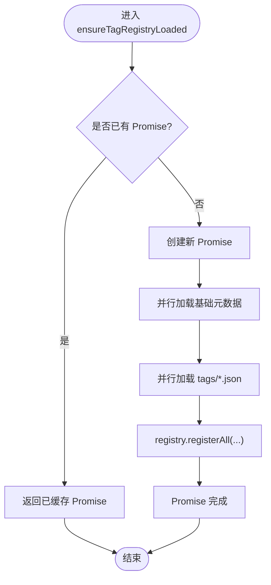
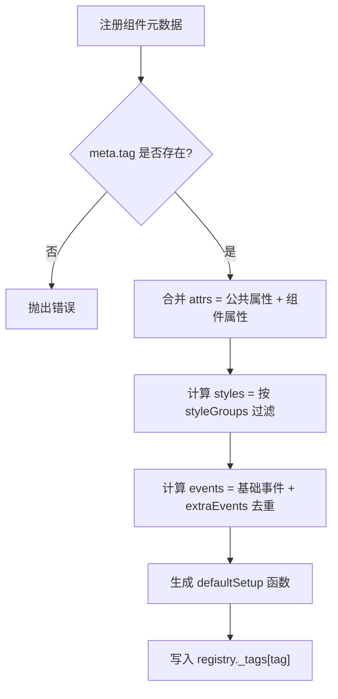
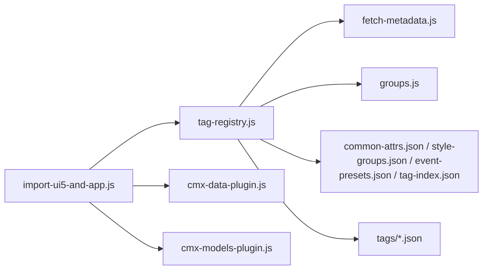

# 组件注册机制

<cite>
**本文引用的文件**
- [tag-registry.js](file://CMXHTMLDesigner/src/metadata/tag-registry.js)
- [fetch-metadata.js](file://CMXHTMLDesigner/src/metadata/fetch-metadata.js)
- [common-attrs.json](file://CMXHTMLDesigner/src/metadata/common-attrs.json)
- [style-groups.json](file://CMXHTMLDesigner/src/metadata/style-groups.json)
- [event-presets.json](file://CMXHTMLDesigner/src/metadata/event-presets.json)
- [tag-index.json](file://CMXHTMLDesigner/src/metadata/tag-index.json)
- [groups.js](file://CMXHTMLDesigner/src/metadata/groups.js)
- [button.json](file://CMXHTMLDesigner/src/metadata/tags/button.json)
- [import-ui5-and-app.js](file://CMXHTMLDesigner/src/import-ui5-and-app.js)
- [cmx-data-plugin.js](file://CMXHTMLDesigner/src/plugins/cmx-data-plugin.js)
- [cmx-models-plugin.js](file://CMXHTMLDesigner/src/plugins/cmx-models-plugin.js)
</cite>

## 目录
1. [简介](#简介)
2. [项目结构](#项目结构)
3. [核心组件](#核心组件)
4. [架构总览](#架构总览)
5. [详细组件分析](#详细组件分析)
6. [依赖关系分析](#依赖关系分析)
7. [性能考量](#性能考量)
8. [故障排查指南](#故障排查指南)
9. [结论](#结论)
10. [附录](#附录)

## 简介
本技术文档聚焦于设计器中的“组件注册机制”，围绕 TagRegistry 类的设计模式与实现原理，系统阐述：
- 组件元数据的注册流程、懒加载机制与缓存策略
- ensureTagRegistryLoaded() 的异步并行加载过程（common-attrs.json、style-groups.json、event-presets.json、tag-index.json）
- 组件元数据结构规范（tag、group、attrs、styles、events 等字段含义与验证规则）
- 自定义组件注册的完整示例（register() 与 registerAll() 的使用方式）
- 版本管理与向后兼容性处理策略

该机制将 UI5/Fiori/HTML 标签的调色板元数据以 JSON 形式构建到设计器的 metadata 目录，运行时通过 fetch 按需加载，避免将大量元数据打入 JS 包体。应用入口需在加载依赖 registry 的模块之前调用 ensureTagRegistryLoaded()，以确保后续插件与渲染逻辑能正确获取组件元数据。

## 项目结构
与组件注册机制直接相关的代码与资源分布如下：
- 注册表核心：TagRegistry 类与 ensureTagRegistryLoaded() 位于 metadata/tag-registry.js
- 元数据加载器：fetchDesignerMetadataJson 位于 metadata/fetch-metadata.js
- 基础元数据：common-attrs.json、style-groups.json、event-presets.json、tag-index.json
- 分组定义：groups.js
- 具体组件元数据：tags/*.json（例如 button.json）
- 启动时序：import-ui5-and-app.js 中先确保注册表加载完成，再加载插件与应用
- 插件扩展：cmx-data-plugin.js、cmx-models-plugin.js 通过 definePlugin 注册更多组件

图表来源
- [import-ui5-and-app.js:4-11](file://CMXHTMLDesigner/src/import-ui5-and-app.js#L4-L11)
- [tag-registry.js:123-145](file://CMXHTMLDesigner/src/metadata/tag-registry.js#L123-L145)
- [fetch-metadata.js:10-20](file://CMXHTMLDesigner/src/metadata/fetch-metadata.js#L10-L20)

章节来源
- [import-ui5-and-app.js:1-12](file://CMXHTMLDesigner/src/import-ui5-and-app.js#L1-L12)
- [tag-registry.js:1-149](file://CMXHTMLDesigner/src/metadata/tag-registry.js#L1-L149)
- [fetch-metadata.js:1-21](file://CMXHTMLDesigner/src/metadata/fetch-metadata.js#L1-L21)

## 核心组件
- TagRegistry：维护组件元数据 Map、公共属性、样式组、事件预设、分组列表；提供注册、查询、分组聚合等方法
- ensureTagRegistryLoaded()：负责首次且仅一次的懒加载，并行请求基础元数据与所有组件元数据，并批量注册
- fetchDesignerMetadataJson：统一的基础设施，根据 Vite base 计算路径并发起 fetch，失败时抛出明确错误信息
- 元数据 JSON：
  - common-attrs.json：全局通用属性定义（如 id、class、title、hidden、tabindex、lang）
  - style-groups.json：样式分组（布局、弹性盒、文字、盒模型、定位），每个分组包含若干样式项定义
  - event-presets.json：事件预设集合（common、form、media、ui5、ui5Form）
  - tag-index.json：组件清单，列出 tag 与其对应 tags/*.json 的路径
- groups.js：内置分组定义（UI5、Fiori、默认标签）

章节来源
- [tag-registry.js:15-110](file://CMXHTMLDesigner/src/metadata/tag-registry.js#L15-L110)
- [tag-registry.js:123-145](file://CMXHTMLDesigner/src/metadata/tag-registry.js#L123-L145)
- [fetch-metadata.js:10-20](file://CMXHTMLDesigner/src/metadata/fetch-metadata.js#L10-L20)
- [common-attrs.json:1-37](file://CMXHTMLDesigner/src/metadata/common-attrs.json#L1-L37)
- [style-groups.json:1-407](file://CMXHTMLDesigner/src/metadata/style-groups.json#L1-L407)
- [event-presets.json:1-72](file://CMXHTMLDesigner/src/metadata/event-presets.json#L1-L72)
- [tag-index.json:1-838](file://CMXHTMLDesigner/src/metadata/tag-index.json#L1-L838)
- [groups.js:1-32](file://CMXHTMLDesigner/src/metadata/groups.js#L1-L32)

## 架构总览
下图展示了从应用启动到组件注册完成的整体流程，以及各模块之间的交互关系。

图表来源
- [import-ui5-and-app.js:4-11](file://CMXHTMLDesigner/src/import-ui5-and-app.js#L4-L11)
- [tag-registry.js:123-145](file://CMXHTMLDesigner/src/metadata/tag-registry.js#L123-L145)
- [fetch-metadata.js:10-20](file://CMXHTMLDesigner/src/metadata/fetch-metadata.js#L10-L20)

## 详细组件分析

### TagRegistry 类设计与实现
- 职责边界
  - 管理组件元数据 Map（_tags）
  - 维护公共属性（_commonAttrs）、样式组（_styleGroups）、事件预设（_eventPresets）、分组列表（_groups）
  - 提供注册接口（register/registerAll）、查询接口（get/getByGroup/getAll/getByGroups）、分组管理（registerGroup/getGroups）
- 关键方法
  - register(meta)：校验必填字段 tag，合并 attrs（公共属性 + 组件自有属性），计算 styles（基于 styleGroups 过滤）、events（基于 eventPreset 与 extraEvents 去重）、defaultSetup（基于 defaults 设置初始内容/属性/样式）
  - get(tag)：若未命中则返回一个最小可用元数据（包含默认事件集、默认嵌套行为等）
  - _stylesFromMeta：根据 meta.styleGroups 或全部样式组生成允许使用的样式集合
  - _eventsFromMeta：根据 eventPreset 选择基础事件集，并合并 extraEvents，最终去重
  - _defaultSetupFromMeta：为元素设置默认文本/HTML/属性/样式，并对不可嵌套的空元素提供占位文本
- 设计模式
  - 单例式注册表：通过模块级实例 registry 暴露，保证全局唯一
  - 工厂式默认值：对未知 tag 提供兜底元数据，降低耦合
  - 组合式元数据：通过合并公共属性、样式组、事件预设与组件特定配置，形成最终元数据

图表来源
- [tag-registry.js:15-110](file://CMXHTMLDesigner/src/metadata/tag-registry.js#L15-L110)

章节来源
- [tag-registry.js:15-110](file://CMXHTMLDesigner/src/metadata/tag-registry.js#L15-L110)

### ensureTagRegistryLoaded() 异步加载与缓存
- 懒加载与缓存
  - 使用模块级变量 _tagsLoadPromise 缓存 Promise，多次调用返回同一 Promise，避免重复网络请求
- 并行加载策略
  - 第一步：并发请求 common-attrs.json、style-groups.json、event-presets.json、tag-index.json
  - 第二步：基于 tag-index 并发请求 tags/*.json
- 注册流程
  - 将基础元数据写入 registry 内部状态，并导出 STYLE_GROUPS 供外部使用
  - 将所有组件元数据传入 registerAll()，完成合并与注册
- 错误处理
  - fetch-metadata 在响应非 ok 时抛出带上下文的错误，便于快速定位问题（提示需先构建设计器）

图表来源
- [tag-registry.js:123-145](file://CMXHTMLDesigner/src/metadata/tag-registry.js#L123-L145)
- [fetch-metadata.js:10-20](file://CMXHTMLDesigner/src/metadata/fetch-metadata.js#L10-L20)

章节来源
- [tag-registry.js:123-145](file://CMXHTMLDesigner/src/metadata/tag-registry.js#L123-L145)
- [fetch-metadata.js:1-21](file://CMXHTMLDesigner/src/metadata/fetch-metadata.js#L1-L21)

### 组件元数据结构规范与验证规则
- 顶层字段
  - tag：组件标识，必填；用于 Map 键与 UI 展示
  - group：分组标识，用于归类显示（如 ui5、fiori、default）
  - label/description：用于 UI 展示与说明
  - isVoid/canNest：控制是否为空元素及是否允许嵌套
  - attrs：组件特有属性定义数组，会与公共属性合并
  - styleGroups：允许的样式组 ID 列表；未指定时使用全部样式组
  - eventPreset：事件预设名称（common/form/media/ui5/ui5Form），用于选择基础事件集
  - extraEvents：额外事件名数组，与基础事件集合并后去重
  - defaults：默认初始化配置（attributes/text/html/style）
- 验证规则
  - register(meta) 要求 meta.tag 存在，否则抛错
  - _eventsFromMeta 会合并基础事件与额外事件并去重
  - _stylesFromMeta 会根据 styleGroups 过滤可用样式
  - _defaultSetupFromMeta 会依据 defaults 设置元素初始内容与样式，并对不可嵌套的空元素提供占位文本
- 示例参考
  - button.json 展示了标准 HTML 按钮的元数据定义（包括类型选项、禁用状态、默认文本与属性、样式组与事件预设）

图表来源
- [tag-registry.js:43-55](file://CMXHTMLDesigner/src/metadata/tag-registry.js#L43-L55)
- [tag-registry.js:81-109](file://CMXHTMLDesigner/src/metadata/tag-registry.js#L81-L109)
- [button.json:1-39](file://CMXHTMLDesigner/src/metadata/tags/button.json#L1-L39)

章节来源
- [tag-registry.js:43-109](file://CMXHTMLDesigner/src/metadata/tag-registry.js#L43-L109)
- [button.json:1-39](file://CMXHTMLDesigner/src/metadata/tags/button.json#L1-L39)

### 自定义组件注册示例（register 与 registerAll）
- 通过插件机制动态添加组件
  - 插件通过 definePlugin 声明 groups 与 components 数组，每个组件对象遵循上述元数据结构规范
  - 插件会在 ensureTagRegistryLoaded() 完成后执行，从而安全地调用注册表进行扩展
- 示例一：数据组件插件（cmx-data-plugin.js）
  - 注册了多个 CMX 数据组件（如 cmx-revo-grid、cmx-tabulator、cmx-ui5-form、cmx-web-treeview、cmx-combo-box 等）
  - 每个组件定义了 attrs、extraEvents、defaults、styleGroups 等，满足设计器预览与属性面板需求
- 示例二：模型组件插件（cmx-models-plugin.js）
  - 注册不可视数据层类（modelOnly:true），仅出现在 Models 面板，不参与可视化拖拽
  - 提供 CMX 数据集、主从协调器、列模型、字典/单据元数据、弹性组合等模型组件
- 使用建议
  - 新增组件时，优先采用插件方式，保持与现有架构一致
  - 合理拆分 styleGroups 与 eventPreset，减少冗余
  - 为复杂组件提供 defaults 与 customInspector（如 cmx-pager、cmx-revo-grid 等）

章节来源
- [cmx-data-plugin.js:46-747](file://CMXHTMLDesigner/src/plugins/cmx-data-plugin.js#L46-L747)
- [cmx-models-plugin.js:39-118](file://CMXHTMLDesigner/src/plugins/cmx-models-plugin.js#L39-L118)

### 版本管理与向后兼容性策略
- 当前实现未显式引入版本号字段，但具备以下兼容能力：
  - 未知 tag 的兜底元数据：get(tag) 返回最小可用元数据，保证旧页面或未知组件仍可渲染
  - 可选字段容错：styleGroups、eventPreset、extraEvents、defaults 均为可选，缺失时回退到默认逻辑
  - 事件与样式可增量扩展：通过 extraEvents 与 styleGroups 白名单机制，新增能力不影响既有组件
- 建议实践：
  - 在组件元数据中增加 version 字段（由上层工具链或插件管理），并在升级时进行迁移脚本
  - 对破坏性变更采用渐进式策略：保留旧字段映射，逐步弃用并给出警告
  - 在 fetch-metadata 层增加版本协商或路由前缀，支持多版本元数据共存

[本节为概念性指导，不直接分析具体文件]

## 依赖关系分析
- 模块间依赖
  - import-ui5-and-app.js 依赖 tag-registry.js 的 ensureTagRegistryLoaded()
  - tag-registry.js 依赖 fetch-metadata.js 进行网络请求，依赖 groups.js 提供分组定义
  - 插件（cmx-data-plugin.js、cmx-models-plugin.js）在注册表就绪后注册更多组件
- 外部资源依赖
  - 静态资源路径由 fetch-metadata.js 根据 Vite base 计算，生产环境通常为 /metadata/...
  - 组件元数据分布在 tags/*.json，数量较多，采用并行加载提升首屏速度

图表来源
- [import-ui5-and-app.js:4-11](file://CMXHTMLDesigner/src/import-ui5-and-app.js#L4-L11)
- [tag-registry.js:123-145](file://CMXHTMLDesigner/src/metadata/tag-registry.js#L123-L145)
- [fetch-metadata.js:10-20](file://CMXHTMLDesigner/src/metadata/fetch-metadata.js#L10-L20)
- [cmx-data-plugin.js:46-747](file://CMXHTMLDesigner/src/plugins/cmx-data-plugin.js#L46-L747)
- [cmx-models-plugin.js:39-118](file://CMXHTMLDesigner/src/plugins/cmx-models-plugin.js#L39-L118)

章节来源
- [import-ui5-and-app.js:1-12](file://CMXHTMLDesigner/src/import-ui5-and-app.js#L1-L12)
- [tag-registry.js:123-145](file://CMXHTMLDesigner/src/metadata/tag-registry.js#L123-L145)
- [fetch-metadata.js:1-21](file://CMXHTMLDesigner/src/metadata/fetch-metadata.js#L1-L21)
- [cmx-data-plugin.js:46-747](file://CMXHTMLDesigner/src/plugins/cmx-data-plugin.js#L46-L747)
- [cmx-models-plugin.js:39-118](file://CMXHTMLDesigner/src/plugins/cmx-models-plugin.js#L39-L118)

## 性能考量
- 懒加载与一次性缓存：ensureTagRegistryLoaded() 仅执行一次，后续调用直接复用 Promise，避免重复网络开销
- 并行 I/O：基础元数据与组件元数据均并行请求，显著缩短首屏时间
- 按需样式与事件：通过 styleGroups 与 eventPreset 限制可用范围，减少不必要的数据体积
- 建议优化：
  - 对超大 tag-index 考虑分页或分片加载
  - 结合浏览器缓存策略（ETag/Last-Modified）提升二次访问性能
  - 对常用组件预取其元数据，进一步降低交互延迟

[本节提供一般性指导，不直接分析具体文件]

## 故障排查指南
- 常见错误
  - 构建产物缺失：当静态资源不可达时，fetch-metadata 会抛出包含 URL 与状态的错误，提示需先构建设计器
  - 元数据格式错误：若 JSON 结构不符合预期，可能导致注册失败或 UI 异常
- 排查步骤
  - 检查浏览器网络面板，确认 /metadata/* 资源是否成功返回
  - 核对 tag-index.json 中 path 与实际 tags/*.json 是否一致
  - 验证组件元数据必填字段（如 tag）与类型是否符合规范
  - 查看控制台错误堆栈，定位具体失败的请求与原因
- 相关实现
  - fetch-metadata 在响应非 ok 时抛出错误，便于快速定位
  - TagRegistry 在注册时对必填字段进行校验

章节来源
- [fetch-metadata.js:10-20](file://CMXHTMLDesigner/src/metadata/fetch-metadata.js#L10-L20)
- [tag-registry.js:43-55](file://CMXHTMLDesigner/src/metadata/tag-registry.js#L43-L55)

## 结论
该组件注册机制通过 TagRegistry 与 ensureTagRegistryLoaded() 实现了高内聚、低耦合的元数据管理：
- 以 JSON 驱动的方式解耦 UI 与配置，便于扩展与维护
- 懒加载与并行 I/O 显著提升性能，同时通过缓存避免重复请求
- 插件化扩展使得业务组件可独立演进，保持与核心机制的兼容
- 通过合理的默认值与容错策略，保障向后兼容性与健壮性

建议在后续迭代中引入版本字段与迁移脚本，进一步完善版本治理与兼容性保障。

[本节为总结性内容，不直接分析具体文件]

## 附录
- 关键文件速览
  - 注册表核心：tag-registry.js
  - 元数据加载器：fetch-metadata.js
  - 基础元数据：common-attrs.json、style-groups.json、event-presets.json、tag-index.json
  - 分组定义：groups.js
  - 组件示例：tags/button.json
  - 启动时序：import-ui5-and-app.js
  - 插件扩展：cmx-data-plugin.js、cmx-models-plugin.js

[本节为索引性内容，不直接分析具体文件]