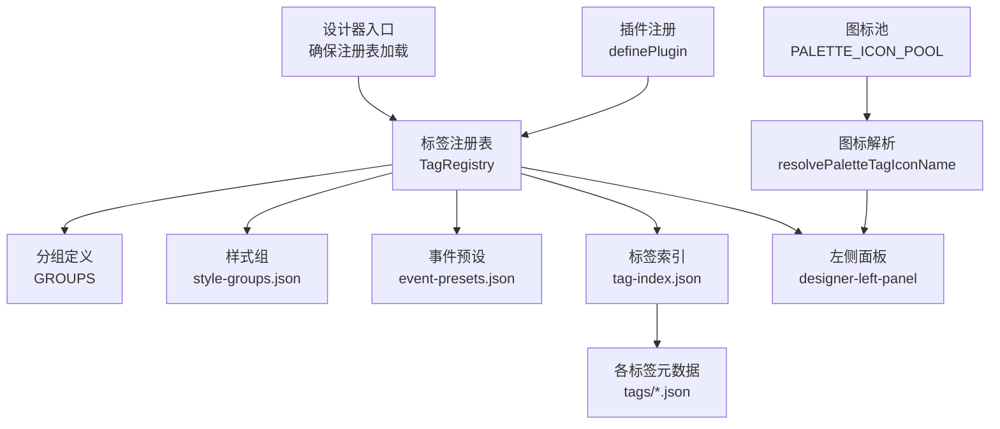
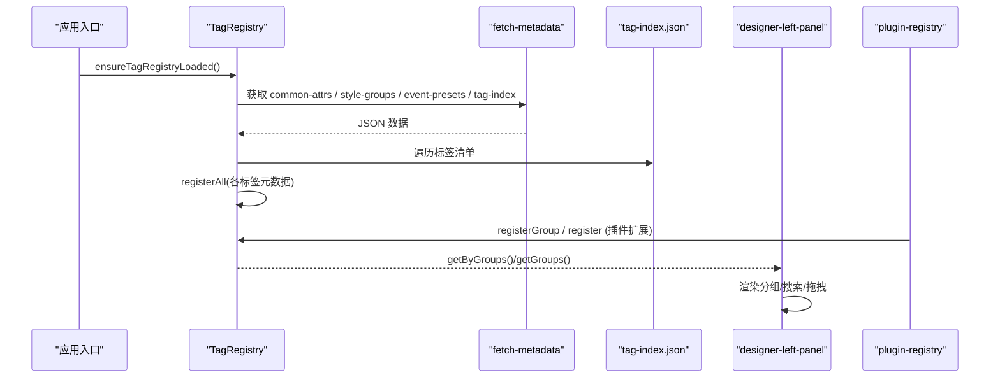
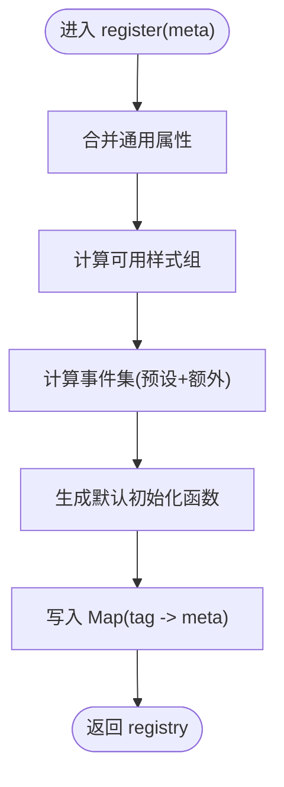
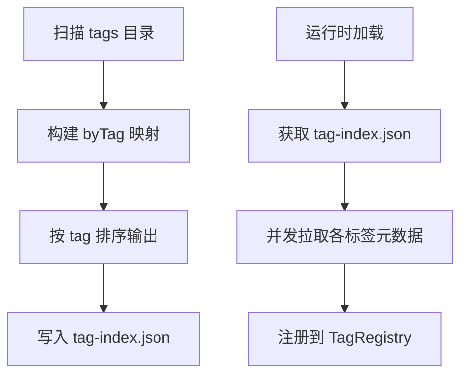
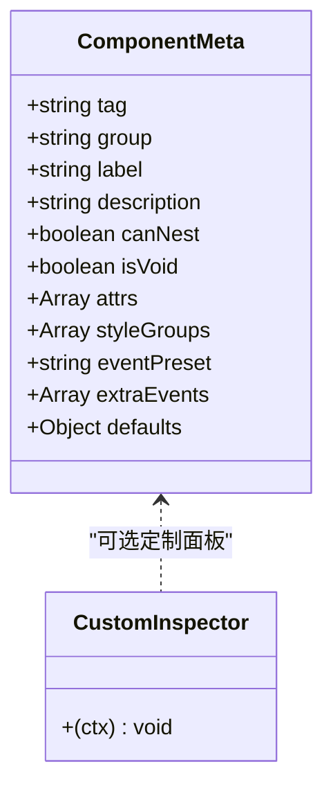
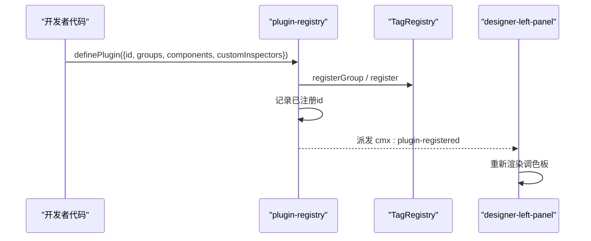
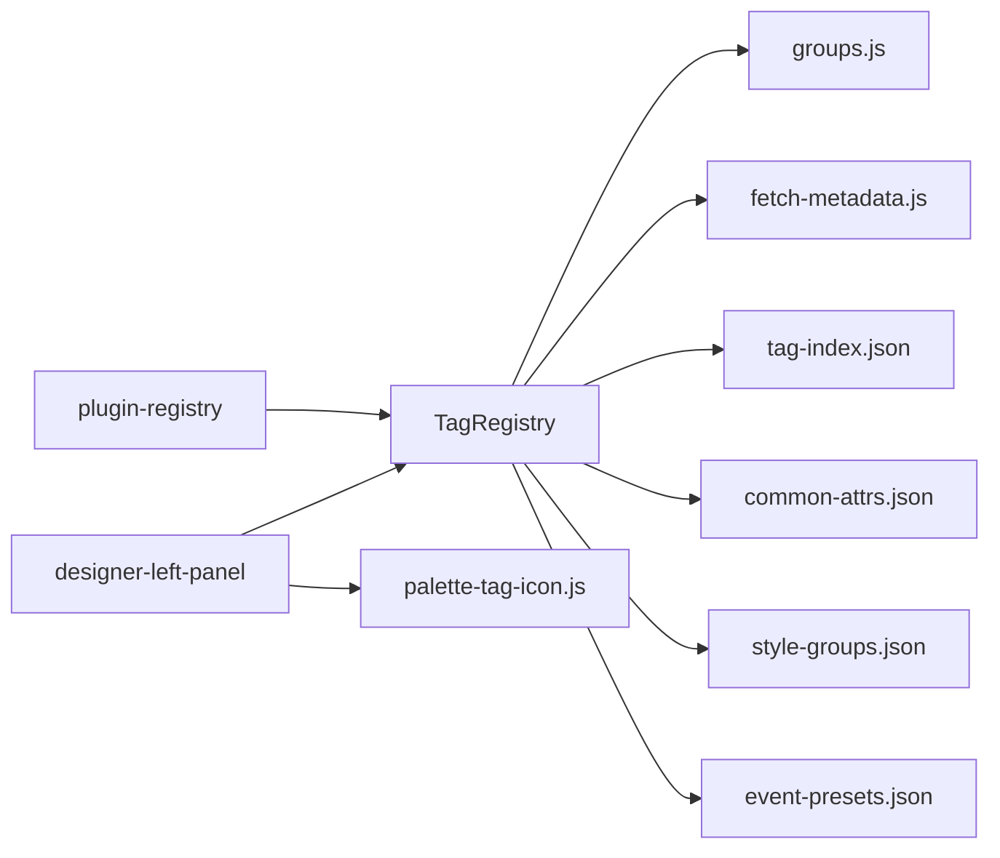

# 组件调色板系统

<cite>
**本文引用的文件**
- [tag-registry.js](file://CMXHTMLDesigner/src/metadata/tag-registry.js)
- [groups.js](file://CMXHTMLDesigner/src/metadata/groups.js)
- [fetch-metadata.js](file://CMXHTMLDesigner/src/metadata/fetch-metadata.js)
- [tag-index.json](file://CMXHTMLDesigner/src/metadata/tag-index.json)
- [common-attrs.json](file://CMXHTMLDesigner/src/metadata/common-attrs.json)
- [style-groups.json](file://CMXHTMLDesigner/src/metadata/style-groups.json)
- [event-presets.json](file://CMXHTMLDesigner/src/metadata/event-presets.json)
- [palette-icon-pool.js](file://CMXHTMLDesigner/src/utils/palette-icon-pool.js)
- [palette-tag-icon.js](file://CMXHTMLDesigner/src/utils/palette-tag-icon.js)
- [plugin-registry.js](file://CMXHTMLDesigner/src/lib/plugin-registry.js)
- [designer-left-panel.js](file://CMXHTMLDesigner/src/components/designer-left-panel.js)
- [cmx-data-plugin.js](file://CMXHTMLDesigner/src/plugins/cmx-data-plugin.js)
- [model-props-inspector.js](file://CMXHTMLDesigner/src/components/designer-inspector/model-props-inspector.js)
- [sync-tag-index.mjs](file://CMXHTMLDesigner/tools/sync-tag-index.mjs)
</cite>

## 目录
1. [简介](#简介)
2. [项目结构](#项目结构)
3. [核心组件](#核心组件)
4. [架构总览](#架构总览)
5. [详细组件分析](#详细组件分析)
6. [依赖关系分析](#依赖关系分析)
7. [性能考量](#性能考量)
8. [故障排查指南](#故障排查指南)
9. [结论](#结论)
10. [附录](#附录)

## 简介
本指南面向在 CMX HTML 设计器中开发“组件调色板”的工程师，系统性说明：
- 组件注册机制、元数据定义与分组管理
- 标签索引构建、图标池管理与图标分配策略
- 属性面板生成、事件绑定与默认值处理
- 自定义组件插件化注册流程与热重载支持
- 从简单 UI 到复杂数据绑定组件的开发范式
- 版本兼容性与运行时加载策略

## 项目结构
CMXHTMLDesigner 将“调色板元数据”与“运行时渲染”解耦：
- 元数据以 JSON 形式静态发布（dist/metadata），运行时按需 fetch 加载，不打包进 JS bundle
- 标签索引 tag-index.json 作为清单，驱动批量拉取各标签元数据
- 左侧面板 designer-left-panel 消费注册表并渲染可拖拽条目
- 插件体系通过 definePlugin 动态扩展组与组件元数据，并支持 HMR 重注册

图表来源
- [tag-registry.js:15-149](file://CMXHTMLDesigner/src/metadata/tag-registry.js#L15-L149)
- [designer-left-panel.js:217-326](file://CMXHTMLDesigner/src/components/designer-left-panel.js#L217-L326)
- [palette-tag-icon.js:1-60](file://CMXHTMLDesigner/src/utils/palette-tag-icon.js#L1-L60)
- [plugin-registry.js:1-95](file://CMXHTMLDesigner/src/lib/plugin-registry.js#L1-L95)

章节来源
- [tag-registry.js:1-149](file://CMXHTMLDesigner/src/metadata/tag-registry.js#L1-L149)
- [designer-left-panel.js:1-326](file://CMXHTMLDesigner/src/components/designer-left-panel.js#L1-L326)
- [plugin-registry.js:1-95](file://CMXHTMLDesigner/src/lib/plugin-registry.js#L1-L95)

## 核心组件
- 标签注册表 TagRegistry：集中维护标签元数据、分组、样式组、事件预设；提供 register/registerAll/get/getByGroups 等能力；负责合并通用属性、计算默认初始化逻辑。
- 分组 groups.js：声明内置分组（UI5/Fiori/默认）及排序、折叠状态。
- 元数据加载 fetch-metadata.js：统一基址与 fetch 封装，失败时给出明确提示。
- 标签索引 tag-index.json：所有标签的清单，按 tag 与相对路径组织。
- 通用属性 common-attrs.json：所有标签共享的基础属性集合。
- 样式组 style-groups.json：布局/弹性/文字/盒模型/定位等样式编辑项。
- 事件预设 event-presets.json：为不同类别组件预置常用事件集。
- 图标池 palette-icon-pool.js：SAP UI Icons v4 名称池。
- 图标解析 palette-tag-icon.js：基于分组种子打乱池子，按排序序号稳定分配图标名，支持 paletteIcon 覆盖。
- 插件注册 plugin-registry.js：definePlugin 聚合 groups/components/customInspectors，触发 cmx:plugin-registered 事件，支持 HMR 重注册。
- 左侧面板 designer-left-panel：渲染分组、搜索过滤、拖拽传输（区分 modelOnly 与普通元素）。
- 模型属性编辑器 model-props-inspector：右侧 Inspector 针对模型类型（CmxDataSet/CmxMasterSlave/CmxColumnModel/FlexibleCombination）的动态渲染与双向绑定。
- 同步脚本 sync-tag-index.mjs：扫描 tags 目录生成 tag-index.json，并检查 UI5/Fiori 模块导入完整性。

章节来源
- [tag-registry.js:1-149](file://CMXHTMLDesigner/src/metadata/tag-registry.js#L1-L149)
- [groups.js:1-32](file://CMXHTMLDesigner/src/metadata/groups.js#L1-L32)
- [fetch-metadata.js:1-21](file://CMXHTMLDesigner/src/metadata/fetch-metadata.js#L1-L21)
- [tag-index.json:1-800](file://CMXHTMLDesigner/src/metadata/tag-index.json#L1-L800)
- [common-attrs.json:1-37](file://CMXHTMLDesigner/src/metadata/common-attrs.json#L1-L37)
- [style-groups.json:1-407](file://CMXHTMLDesigner/src/metadata/style-groups.json#L1-L407)
- [event-presets.json:1-72](file://CMXHTMLDesigner/src/metadata/event-presets.json#L1-L72)
- [palette-icon-pool.js:1-6](file://CMXHTMLDesigner/src/utils/palette-icon-pool.js#L1-L6)
- [palette-tag-icon.js:1-60](file://CMXHTMLDesigner/src/utils/palette-tag-icon.js#L1-L60)
- [plugin-registry.js:1-95](file://CMXHTMLDesigner/src/lib/plugin-registry.js#L1-L95)
- [designer-left-panel.js:1-326](file://CMXHTMLDesigner/src/components/designer-left-panel.js#L1-L326)
- [model-props-inspector.js:1-712](file://CMXHTMLDesigner/src/components/designer-inspector/model-props-inspector.js#L1-L712)
- [sync-tag-index.mjs:1-215](file://CMXHTMLDesigner/tools/sync-tag-index.mjs#L1-L215)

## 架构总览
下图展示从“元数据加载”到“面板渲染”的关键调用链，以及插件扩展点。

图表来源
- [tag-registry.js:120-149](file://CMXHTMLDesigner/src/metadata/tag-registry.js#L120-L149)
- [fetch-metadata.js:1-21](file://CMXHTMLDesigner/src/metadata/fetch-metadata.js#L1-L21)
- [designer-left-panel.js:230-326](file://CMXHTMLDesigner/src/components/designer-left-panel.js#L230-L326)
- [plugin-registry.js:60-89](file://CMXHTMLDesigner/src/lib/plugin-registry.js#L60-L89)

## 详细组件分析

### 标签注册表与元数据装配
- 注册与合并：register 将 meta.tag 映射到完整元信息，自动合并 commonAttrs、styles、events、defaultSetup。
- 默认初始化：_defaultSetupFromMeta 根据 defaults.attributes/text/html/style 设置初始内容，并对非空容器兜底文本。
- 样式组裁剪：_stylesFromMeta 依据 meta.styleGroups 或全局 styleGroups 决定可用样式区。
- 事件预设：_eventsFromMeta 基于 eventPreset 与 extraEvents 去重合并。
- 懒加载：ensureTagRegistryLoaded 并发拉取基础配置与标签清单，再并行拉取每个标签元数据并注册。

图表来源
- [tag-registry.js:43-109](file://CMXHTMLDesigner/src/metadata/tag-registry.js#L43-L109)

章节来源
- [tag-registry.js:15-109](file://CMXHTMLDesigner/src/metadata/tag-registry.js#L15-L109)

### 分组管理与显示
- 分组定义：groups.js 声明 id、label、iconName、order、collapsed。
- 排序与折叠：getGroups 按 order 升序；面板渲染时根据 collapsed 控制展开状态。
- 分组图标：优先 iconName，否则回退到 legacy icon 或占位符。

章节来源
- [groups.js:1-32](file://CMXHTMLDesigner/src/metadata/groups.js#L1-L32)
- [designer-left-panel.js:12-25](file://CMXHTMLDesigner/src/components/designer-left-panel.js#L12-L25)

### 标签索引构建与动态加载
- 构建：sync-tag-index.mjs 递归扫描 src/metadata/tags，生成 tag-index.json，并按 tag 排序；对同名标签优先保留 fiori 路径。
- 运行期：ensureTagRegistryLoaded 读取 tag-index.json，并发请求各标签元数据并注册。
- 导入检查：脚本会检测 index.html 中的 UI5/Fiori 模块导入是否缺失，支持 --fix-imports 自动修复。

图表来源
- [sync-tag-index.mjs:63-95](file://CMXHTMLDesigner/tools/sync-tag-index.mjs#L63-L95)
- [tag-registry.js:120-149](file://CMXHTMLDesigner/src/metadata/tag-registry.js#L120-L149)

章节来源
- [sync-tag-index.mjs:1-215](file://CMXHTMLDesigner/tools/sync-tag-index.mjs#L1-L215)
- [tag-index.json:1-800](file://CMXHTMLDesigner/src/metadata/tag-index.json#L1-L800)

### 图标池与图标分配策略
- 图标池：PALETTE_ICON_POOL 提供 SAP UI Icons v4 名称列表。
- 分配算法：按 groupId 生成种子，对池进行确定性打乱；按该分组内排序后的下标取模分配，尽量不重复。
- 覆盖：meta.paletteIcon 可直接指定图标名。

章节来源
- [palette-icon-pool.js:1-6](file://CMXHTMLDesigner/src/utils/palette-icon-pool.js#L1-L6)
- [palette-tag-icon.js:1-60](file://CMXHTMLDesigner/src/utils/palette-tag-icon.js#L1-L60)
- [designer-left-panel.js:270-286](file://CMXHTMLDesigner/src/components/designer-left-panel.js#L270-L286)

### 属性面板生成与验证规则
- 属性定义：每个组件在插件或标签元数据中声明 attrs 数组，包含 name、label、type、options/placeholder/defaultValue 等。
- 可视化编辑：部分复杂组件通过 customInspectors 提供专用面板（如 RevoGrid、UI5 Form、Web Treeview、Pager）。
- 验证与默认值：defaults 支持 attributes/text/html/style/innerHTML；运行时由 defaultSetup 应用；JSON 字段在输入时做解析校验并反馈错误。
- 模型属性：model-props-inspector 针对 CmxDataSet/CmxMasterSlave/CmxColumnModel/FlexibleCombination 提供专属编辑界面，含双向绑定与变更回调 onChange。

图表来源
- [cmx-data-plugin.js:46-747](file://CMXHTMLDesigner/src/plugins/cmx-data-plugin.js#L46-L747)
- [model-props-inspector.js:14-31](file://CMXHTMLDesigner/src/components/designer-inspector/model-props-inspector.js#L14-L31)

章节来源
- [cmx-data-plugin.js:46-747](file://CMXHTMLDesigner/src/plugins/cmx-data-plugin.js#L46-L747)
- [model-props-inspector.js:1-712](file://CMXHTMLDesigner/src/components/designer-inspector/model-props-inspector.js#L1-L712)

### 事件绑定机制
- 事件预设：event-presets.json 提供 common/form/media/ui5/ui5Form 等事件集。
- 组合策略：组件可通过 eventPreset 选择基础事件，并通过 extraEvents 追加自定义事件。
- 运行时：设计器侧仅暴露事件名供用户编写脚本；实际 DOM 事件绑定由运行时组件实现。

章节来源
- [event-presets.json:1-72](file://CMXHTMLDesigner/src/metadata/event-presets.json#L1-L72)
- [tag-registry.js:104-109](file://CMXHTMLDesigner/src/metadata/tag-registry.js#L104-L109)

### 自定义组件注册流程与热重载
- 插件对象：{ id, groups?, components[], customInspectors? }
- 注册行为：
  - 注册自定义分组（同 id 忽略）
  - 注册组件元数据（同 tag 覆盖）
  - 注册 customInspectors（按 tag 覆盖）
  - 派发 cmx:plugin-registered 事件，左侧面板监听后刷新
- 热重载：HMR 场景下重新注册不会跳过，直接覆盖，保证开发体验即时生效。

图表来源
- [plugin-registry.js:60-89](file://CMXHTMLDesigner/src/lib/plugin-registry.js#L60-L89)
- [designer-left-panel.js:230-241](file://CMXHTMLDesigner/src/components/designer-left-panel.js#L230-L241)

章节来源
- [plugin-registry.js:1-95](file://CMXHTMLDesigner/src/lib/plugin-registry.js#L1-L95)
- [designer-left-panel.js:230-241](file://CMXHTMLDesigner/src/components/designer-left-panel.js#L230-L241)

### 拖拽与画布交互
- 普通元素：dragstart 设置 text/plain 为 tag 名，画布接受为 DOM 节点。
- 模型元素：modelOnly 标记的条目只设置 cmx-model-type，画布据此识别为“仅模型”，不接受为 DOM。
- 搜索过滤：输入框实时过滤分组与条目，匹配 tag 名或描述。

章节来源
- [designer-left-panel.js:243-326](file://CMXHTMLDesigner/src/components/designer-left-panel.js#L243-L326)

### 示例：从简单 UI 到复杂数据绑定组件
- 简单 UI 组件：参考 button.json，定义 tag/group/label/description/isVoid/canNest/attrs/defaults/styleGroups/eventPreset。
- 复杂数据组件：参考 cmx-data-plugin.js 中的 cmx-revo-grid/cmx-tabulator/cmx-ui5-form/cmx-web-treeview/cmx-combo-box 等，声明 data-cmx-* 属性、extraEvents、defaults，并提供 customInspector 完成复杂属性编辑。
- 模型联动：通过 data-cmx-master-slave-id 与 data-cmx-dataset-id 绑定 CmxMasterSlave/CmxDataSet，配合 ColumnModel 自动生成列。

章节来源
- [button.json:1-39](file://CMXHTMLDesigner/src/metadata/tags/button.json#L1-L39)
- [cmx-data-plugin.js:46-747](file://CMXHTMLDesigner/src/plugins/cmx-data-plugin.js#L46-L747)

## 依赖关系分析
- TagRegistry 依赖：
  - groups.js（分组定义）
  - fetch-metadata.js（远程 JSON 加载）
  - tag-index.json（标签清单）
  - common-attrs.json/style-groups.json/event-presets.json（基础配置）
- 左侧面板依赖：
  - TagRegistry（获取分组与标签）
  - palette-tag-icon.js（图标解析）
  - html-utils.js（转义）
- 插件体系：
  - plugin-registry.js 向 TagRegistry 注入分组与组件元数据
  - 自定义 Inspector 通过 getCustomInspector(tag) 获取

图表来源
- [tag-registry.js:15-149](file://CMXHTMLDesigner/src/metadata/tag-registry.js#L15-L149)
- [designer-left-panel.js:7-10](file://CMXHTMLDesigner/src/components/designer-left-panel.js#L7-L10)
- [plugin-registry.js:43-89](file://CMXHTMLDesigner/src/lib/plugin-registry.js#L43-L89)

章节来源
- [tag-registry.js:15-149](file://CMXHTMLDesigner/src/metadata/tag-registry.js#L15-L149)
- [designer-left-panel.js:7-10](file://CMXHTMLDesigner/src/components/designer-left-panel.js#L7-L10)
- [plugin-registry.js:43-89](file://CMXHTMLDesigner/src/lib/plugin-registry.js#L43-L89)

## 性能考量
- 元数据延迟加载：仅在 ensureTagRegistryLoaded 调用后拉取，避免阻塞首屏。
- 并发请求：基础配置与标签清单并行，标签元数据也并行拉取，降低总耗时。
- 图标池复用：使用确定性种子打乱池，避免重复计算与冲突。
- 分组渲染优化：左侧面板仅渲染可见分组，搜索时局部隐藏而非重建 DOM。
- 插件增量更新：HMR 重注册仅覆盖差异，减少全量刷新成本。

[本节为通用指导，无需具体文件引用]

## 故障排查指南
- 元数据加载失败：
  - 现象：fetch 返回非 2xx，抛出错误提示需先构建设计器。
  - 排查：确认 dist/metadata 已构建且 BASE_URL 正确。
- UI5/Fiori 模块未导入：
  - 现象：运行时无法解析 ui5-* 组件。
  - 排查：运行 sync-tag-index.mjs 检查并添加缺失导入，或使用 --fix-imports 自动修复。
- 插件未生效：
  - 现象：新增组件不在调色板显示。
  - 排查：确认 definePlugin 被调用且 id 唯一；检查 cmx:plugin-registered 事件是否派发；左侧面板是否监听并重渲染。
- 属性面板异常：
  - 现象：JSON 字段解析失败或无响应。
  - 排查：查看对应 customInspector 的错误提示区域；确认 attrs 白名单包含待保存属性。

章节来源
- [fetch-metadata.js:10-20](file://CMXHTMLDesigner/src/metadata/fetch-metadata.js#L10-L20)
- [sync-tag-index.mjs:146-195](file://CMXHTMLDesigner/tools/sync-tag-index.mjs#L146-L195)
- [plugin-registry.js:60-89](file://CMXHTMLDesigner/src/lib/plugin-registry.js#L60-L89)
- [model-props-inspector.js:166-186](file://CMXHTMLDesigner/src/components/designer-inspector/model-props-inspector.js#L166-L186)

## 结论
本系统通过“元数据驱动 + 插件扩展”的方式，实现了可扩展、可维护、高性能的组件调色板。借助标签索引与并发加载，保证了大规模组件集的快速启动；通过统一的属性定义与默认值机制，降低了组件接入成本；结合自定义 Inspector 与模型属性编辑器，覆盖了从简单 UI 到复杂数据绑定的全场景需求。建议在新组件开发中遵循现有元数据规范，充分利用事件预设与样式组，并通过插件方式注册，以获得一致的设计器体验。

[本节为总结性内容，无需具体文件引用]

## 附录
- 属性定义规范要点
  - 必填：name、label、type
  - 可选：placeholder、options、defaultValue、validate（由上层校验）
  - 类型：text、number、boolean、select、color 等
- 默认值处理
  - defaults.attributes：设置初始属性
  - defaults.text/html/innerHTML：设置初始内容
  - defaults.style：设置初始样式
- 版本与兼容性
  - 元数据向后兼容：新字段可渐进引入，旧数据缺失时由默认值补齐
  - 模型属性编辑器具备归一化逻辑，兼容历史字段形态
- 热重载支持
  - 插件重注册覆盖已有 tag 与 inspector，无需重启设计器

[本节为补充说明，无需具体文件引用]