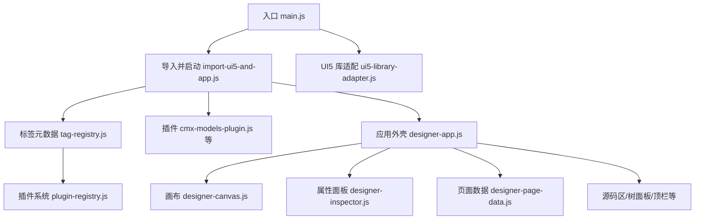
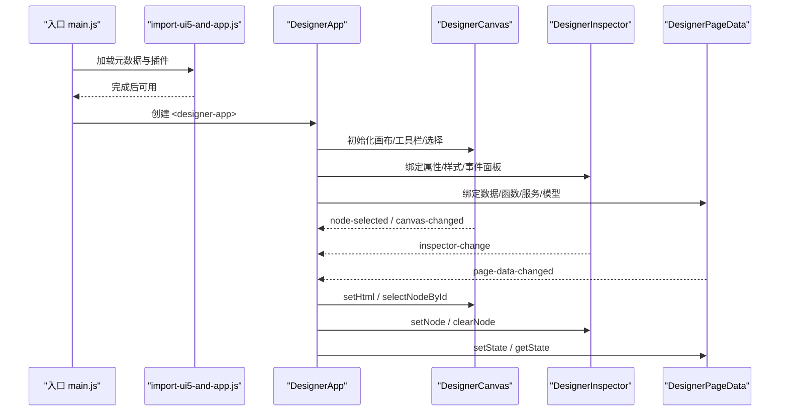
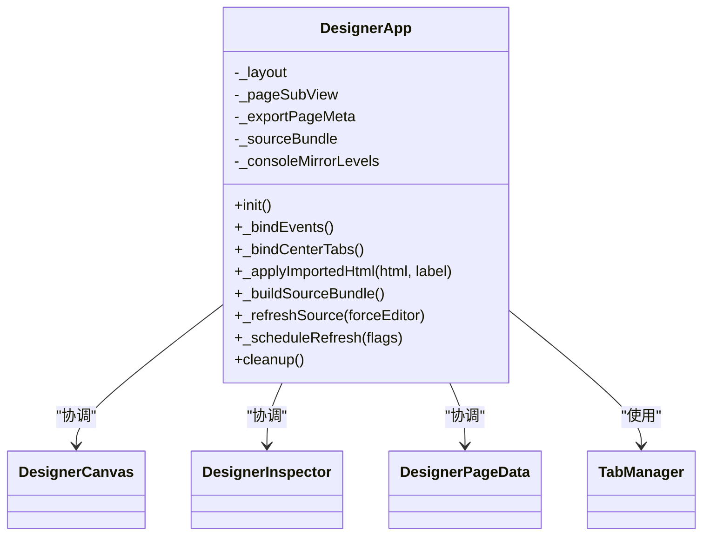
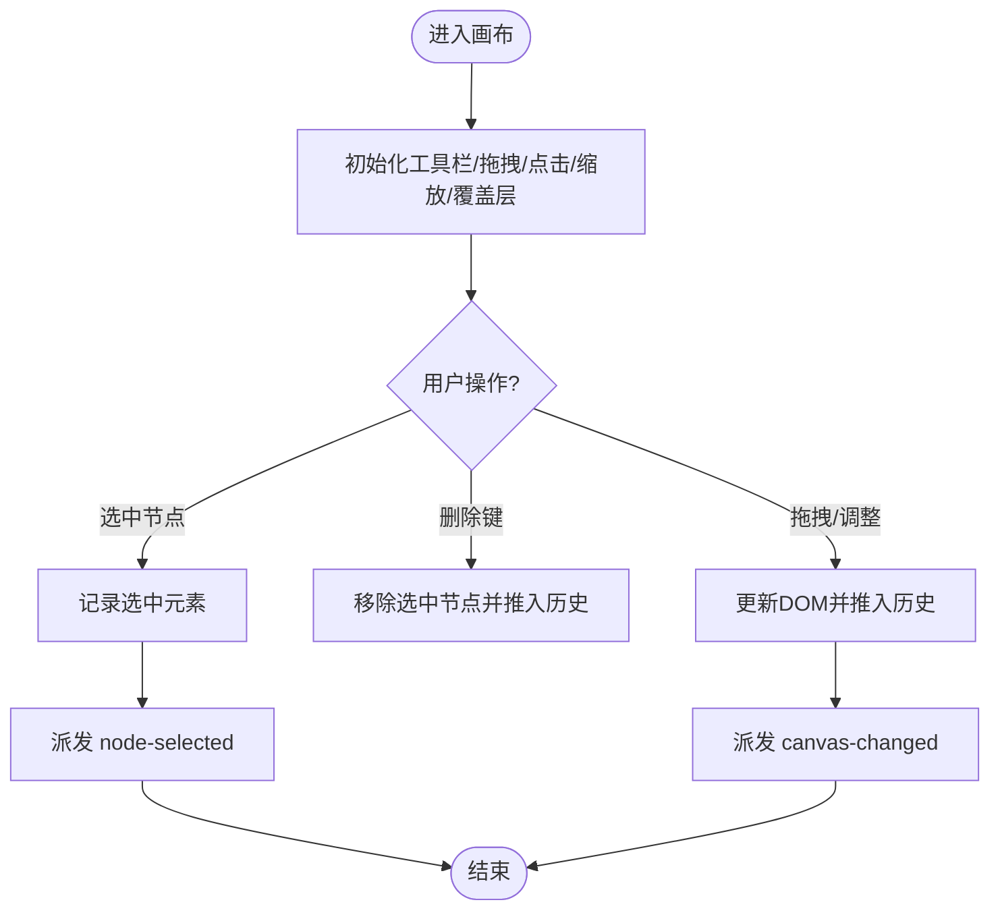
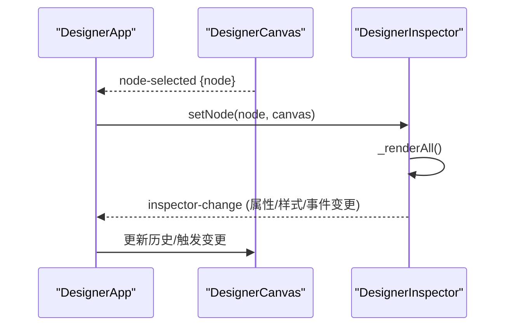
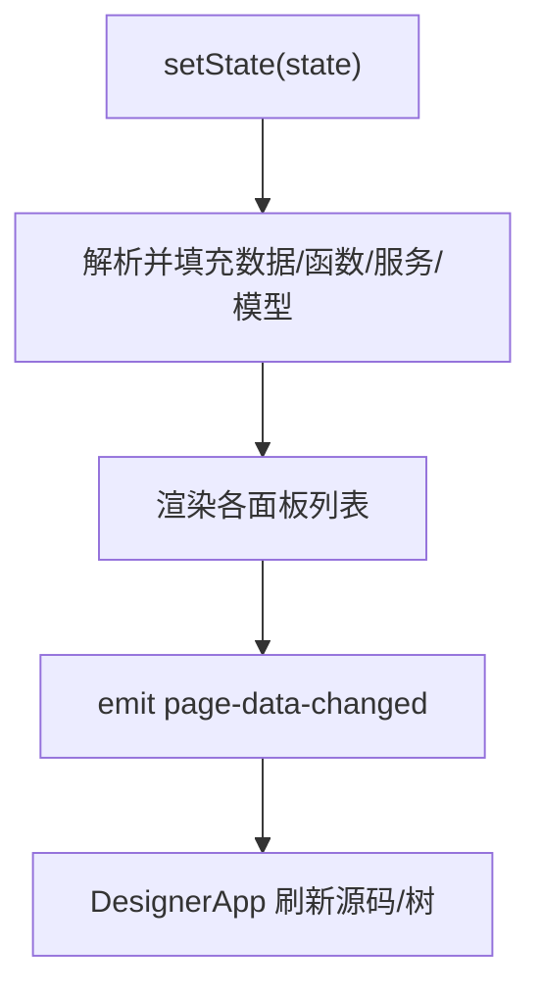
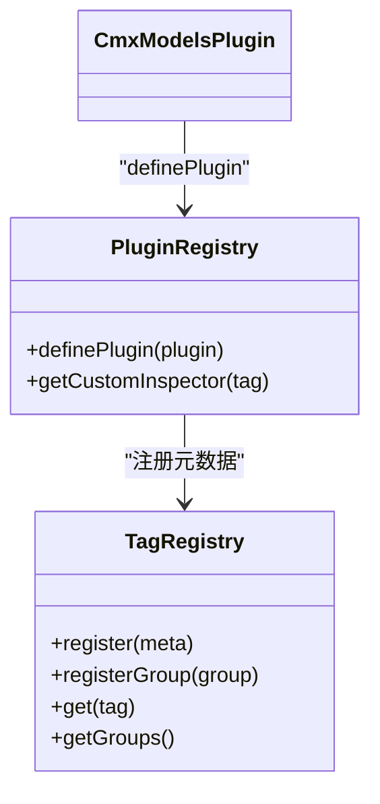
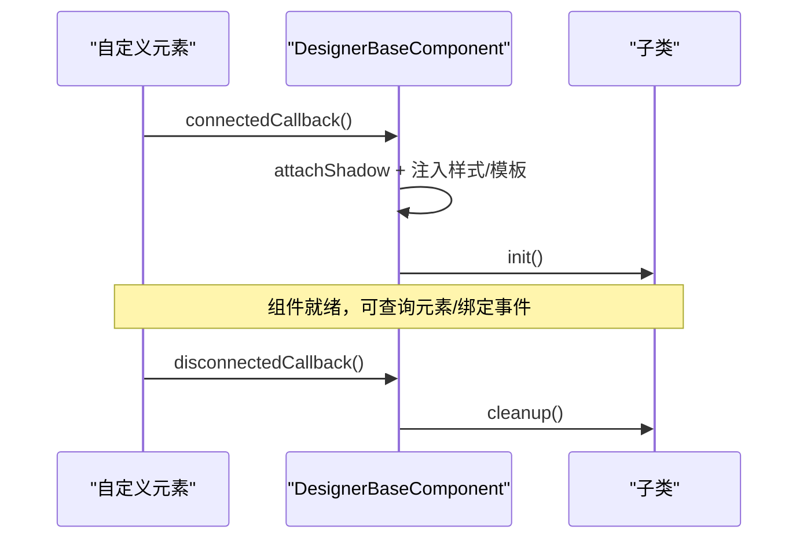
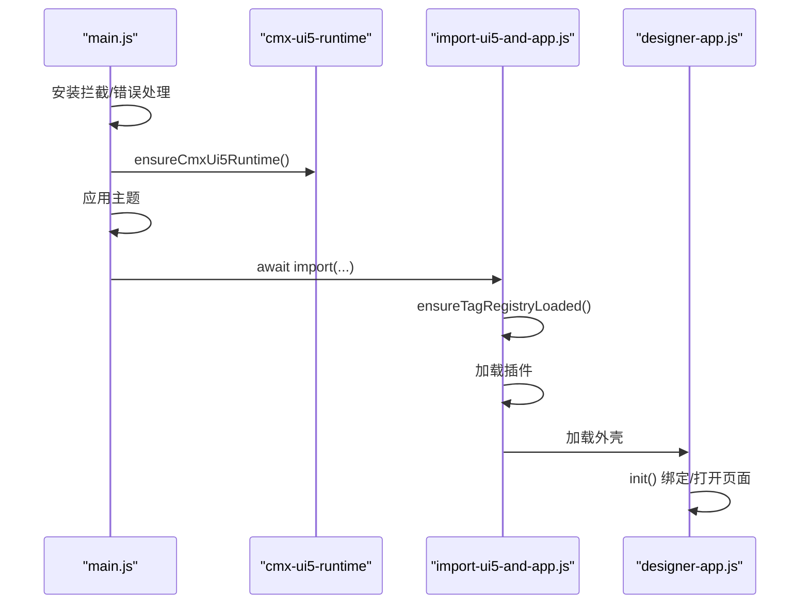
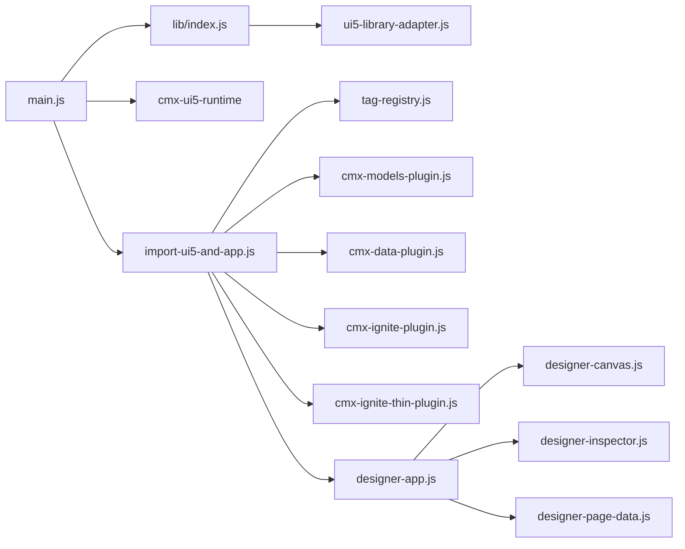

# 设计器架构概览

<cite>
**本文引用的文件**
- [main.js](file://CMXHTMLDesigner/src/main.js)
- [import-ui5-and-app.js](file://CMXHTMLDesigner/src/import-ui5-and-app.js)
- [designer-base-component.js](file://CMXHTMLDesigner/src/components/designer-base-component.js)
- [designer-app.js](file://CMXHTMLDesigner/src/components/designer-app.js)
- [designer-canvas.js](file://CMXHTMLDesigner/src/components/designer-canvas.js)
- [designer-inspector.js](file://CMXHTMLDesigner/src/components/designer-inspector.js)
- [designer-page-data.js](file://CMXHTMLDesigner/src/components/designer-page-data.js)
- [tag-registry.js](file://CMXHTMLDesigner/src/metadata/tag-registry.js)
- [plugin-registry.js](file://CMXHTMLDesigner/src/lib/plugin-registry.js)
- [ui5-library-adapter.js](file://CMXHTMLDesigner/src/lib/ui5-library-adapter.js)
- [tab-manager.js](file://CMXHTMLDesigner/src/utils/tab-manager.js)
- [build-cmx-page-script-block.js](file://CMXHTMLDesigner/src/utils/build-cmx-page-script-block.js)
- [cmx-models-plugin.js](file://CMXHTMLDesigner/src/plugins/cmx-models-plugin.js)
</cite>

## 目录
1. [简介](#简介)
2. [项目结构](#项目结构)
3. [核心组件](#核心组件)
4. [架构总览](#架构总览)
5. [详细组件分析](#详细组件分析)
6. [依赖关系分析](#依赖关系分析)
7. [性能考量](#性能考量)
8. [故障排查指南](#故障排查指南)
9. [结论](#结论)
10. [附录](#附录)

## 简介
本文件面向 CMX HTML 设计器的开发者与集成者，系统性说明设计器的整体架构模式、组件通信机制与生命周期管理。重点解释主应用外壳 DesignerApp 的职责（子组件协调、事件总线管理与状态同步）、Web Components 架构决策（Shadow DOM 使用策略与自定义元素生命周期）、初始化流程、模块加载机制与插件系统。文档包含架构图表与组件关系图，帮助读者快速理解设计器的内部工作原理。

## 项目结构
CMXHTMLDesigner 采用“基于 Web Components 的模块化设计器”架构：
- 入口层：负责认证、UI5 运行时准备、主题应用与按需加载业务模块。
- 应用外壳：DesignerApp 作为根组件，编排画布、属性面板、源码区、页面数据面板等子组件。
- 元数据与插件：标签元数据注册表与插件系统，支持动态扩展调色板与属性面板。
- 工具与适配：通用 Tab 切换、代码编辑器、调试注入、UI5 库适配等。

图表来源
- [main.js:1-29](file://CMXHTMLDesigner/src/main.js#L1-L29)
- [import-ui5-and-app.js:1-12](file://CMXHTMLDesigner/src/import-ui5-and-app.js#L1-L12)
- [designer-app.js:1-636](file://CMXHTMLDesigner/src/components/designer-app.js#L1-L636)
- [tag-registry.js:1-149](file://CMXHTMLDesigner/src/metadata/tag-registry.js#L1-L149)
- [plugin-registry.js:1-95](file://CMXHTMLDesigner/src/lib/plugin-registry.js#L1-L95)
- [ui5-library-adapter.js:1-40](file://CMXHTMLDesigner/src/lib/ui5-library-adapter.js#L1-L40)

章节来源
- [main.js:1-29](file://CMXHTMLDesigner/src/main.js#L1-L29)
- [import-ui5-and-app.js:1-12](file://CMXHTMLDesigner/src/import-ui5-and-app.js#L1-L12)

## 核心组件
- 基类 DesignerBaseComponent：统一 Shadow DOM 挂载、样式注入、init/cleanup 生命周期钩子，确保组件可插拔且幂等连接。
- 应用外壳 DesignerApp：协调各子组件、处理导入/导出/运行、维护布局与状态同步、集中订阅事件并广播变更。
- 画布 DesignerCanvas：可视化编辑区域，承载拖拽、缩放、对齐、撤销重做、选中与序列化。
- 属性面板 DesignerInspector：渲染节点属性/样式/事件，提供调试日志输出与模型列级属性编辑。
- 页面数据 DesignerPageData：管理页面数据、函数、服务、依赖、接口、数据流与模型；生成运行脚本块。
- 元数据与插件：TagRegistry 集中管理标签元数据与组；PluginRegistry 提供 definePlugin 扩展点。
- UI5 适配：Ui5LibraryAdapter 封装主题/语言切换，对接 cmx-ui5-runtime。

章节来源
- [designer-base-component.js:1-39](file://CMXHTMLDesigner/src/components/designer-base-component.js#L1-L39)
- [designer-app.js:1-636](file://CMXHTMLDesigner/src/components/designer-app.js#L1-L636)
- [designer-canvas.js:1-200](file://CMXHTMLDesigner/src/components/designer-canvas.js#L1-L200)
- [designer-inspector.js:1-200](file://CMXHTMLDesigner/src/components/designer-inspector.js#L1-L200)
- [designer-page-data.js:1-200](file://CMXHTMLDesigner/src/components/designer-page-data.js#L1-L200)
- [tag-registry.js:1-149](file://CMXHTMLDesigner/src/metadata/tag-registry.js#L1-L149)
- [plugin-registry.js:1-95](file://CMXHTMLDesigner/src/lib/plugin-registry.js#L1-L95)
- [ui5-library-adapter.js:1-40](file://CMXHTMLDesigner/src/lib/ui5-library-adapter.js#L1-L40)

## 架构总览
设计器采用“外壳 + 子组件 + 事件驱动”的架构：
- 外壳 DesignerApp 通过 CustomEvent 在子组件间传递状态变化，避免直接耦合。
- 画布与属性面板双向联动：画布选中节点 → 属性面板渲染；属性面板修改 → 触发 inspector-change → 画布更新并刷新源码/树。
- 页面数据与源码区解耦：页面数据变更仅触发源码重建，不直接改写画布。
- 元数据与插件：通过 TagRegistry 与 PluginRegistry 动态扩展调色板与属性面板。
- UI5 运行时：由 cmx-ui5-runtime 提供主题/语言能力，适配器统一调用。

图表来源
- [main.js:1-29](file://CMXHTMLDesigner/src/main.js#L1-L29)
- [import-ui5-and-app.js:1-12](file://CMXHTMLDesigner/src/import-ui5-and-app.js#L1-L12)
- [designer-app.js:1-636](file://CMXHTMLDesigner/src/components/designer-app.js#L1-L636)
- [designer-canvas.js:1-200](file://CMXHTMLDesigner/src/components/designer-canvas.js#L1-L200)
- [designer-inspector.js:1-200](file://CMXHTMLDesigner/src/components/designer-inspector.js#L1-L200)
- [designer-page-data.js:1-200](file://CMXHTMLDesigner/src/components/designer-page-data.js#L1-L200)

## 详细组件分析

### 应用外壳 DesignerApp
职责与行为：
- 子组件协调：持有画布、属性面板、页面数据、源码区、树面板引用，并在 init 中建立关联。
- 事件总线管理：监听画布、属性面板、页面数据的事件，统一调度刷新与状态同步。
- 状态同步：通过 _scheduleRefresh 合并同帧多次变更，减少重绘开销；构建源码 bundle 供保存/导出/运行。
- 导入/导出/运行：从服务器导入页面、批量打开多页、预览/新窗口运行、页内运行锁定设计区。
- 布局与交互：水平/垂直拖拽调整左右面板与树高度，TabManager 管理中央与页面子视图。

图表来源
- [designer-app.js:1-636](file://CMXHTMLDesigner/src/components/designer-app.js#L1-L636)
- [tab-manager.js:1-55](file://CMXHTMLDesigner/src/utils/tab-manager.js#L1-L55)

章节来源
- [designer-app.js:1-636](file://CMXHTMLDesigner/src/components/designer-app.js#L1-L636)

### 画布 DesignerCanvas
职责与行为：
- 可视化编辑：工具栏（撤销/重做/缩放/对齐/网格），缩放与居中，选中覆盖层与拖拽手柄。
- 交互控制：键盘删除、滚动隐藏临时覆盖层、属性过滤（仅保留元数据声明的属性）。
- 序列化：提供 getHtml/getExportHtml/getHtmlWithIds，用于保存/运行/调试。
- 调试与锁定：支持 rehydrateEvents 重新绑定事件；setMutationLocked 阻止外部写入以保护页内运行。

图表来源
- [designer-canvas.js:1-200](file://CMXHTMLDesigner/src/components/designer-canvas.js#L1-L200)

章节来源
- [designer-canvas.js:1-200](file://CMXHTMLDesigner/src/components/designer-canvas.js#L1-L200)

### 属性面板 DesignerInspector
职责与行为：
- 渲染：根据当前选中节点或模型，渲染属性/样式/事件面板；支持模型列级属性编辑。
- 调试日志：按级别着色输出，支持清空日志与控制台镜像开关。
- 插件扩展：通过 getCustomInspector 获取自定义渲染函数，实现特定标签的专属属性面板。

图表来源
- [designer-app.js:1-636](file://CMXHTMLDesigner/src/components/designer-app.js#L1-L636)
- [designer-inspector.js:1-200](file://CMXHTMLDesigner/src/components/designer-inspector.js#L1-L200)

章节来源
- [designer-inspector.js:1-200](file://CMXHTMLDesigner/src/components/designer-inspector.js#L1-L200)

### 页面数据 DesignerPageData
职责与行为：
- 状态管理：维护页面数据、函数、服务、依赖、接口、数据源、数据流与模型；提供 getState/setState。
- 视图切换：data/fn/svc/iface/flow/test/deps/models 多视图；渲染函数/服务列表与详情。
- 脚本生成：buildCmxScriptBlockFromPageState 生成运行时封装脚本，供预览/运行使用。
- 源码解析：mergeFnsFromDesignScript 从源码脚本解析函数声明并写入函数页。

图表来源
- [designer-page-data.js:1-200](file://CMXHTMLDesigner/src/components/designer-page-data.js#L1-L200)
- [designer-app.js:1-636](file://CMXHTMLDesigner/src/components/designer-app.js#L1-L636)

章节来源
- [designer-page-data.js:1-200](file://CMXHTMLDesigner/src/components/designer-page-data.js#L1-L200)

### 元数据与插件系统
- TagRegistry：集中管理标签元数据、样式组、事件预设与默认设置；ensureTagRegistryLoaded 异步加载 JSON 元数据并注册。
- PluginRegistry：definePlugin 注册自定义组与组件元数据，可选 customInspectors；注册后派发 cmx:plugin-registered 事件，左侧面板自动刷新。
- 示例插件：cmx-models-plugin 将 CMX 数据层类注册为不可视模型，暴露到全局以供函数/调试使用。

图表来源
- [tag-registry.js:1-149](file://CMXHTMLDesigner/src/metadata/tag-registry.js#L1-L149)
- [plugin-registry.js:1-95](file://CMXHTMLDesigner/src/lib/plugin-registry.js#L1-L95)
- [cmx-models-plugin.js:1-118](file://CMXHTMLDesigner/src/plugins/cmx-models-plugin.js#L1-L118)

章节来源
- [tag-registry.js:1-149](file://CMXHTMLDesigner/src/metadata/tag-registry.js#L1-L149)
- [plugin-registry.js:1-95](file://CMXHTMLDesigner/src/lib/plugin-registry.js#L1-L95)
- [cmx-models-plugin.js:1-118](file://CMXHTMLDesigner/src/plugins/cmx-models-plugin.js#L1-L118)

### Web Components 架构与生命周期
- 基类 DesignerBaseComponent：connectedCallback 中 attachShadow、注入样式与模板、调用 init；disconnectedCallback 调用 cleanup。
- Shadow DOM 策略：每个组件私有样式与模板隔离，避免全局污染；通过事件与公开 API 进行跨组件通信。
- 自定义元素生命周期：子类覆盖 styles/template/init/cleanup，保证可复用与易测试。

图表来源
- [designer-base-component.js:1-39](file://CMXHTMLDesigner/src/components/designer-base-component.js#L1-L39)

章节来源
- [designer-base-component.js:1-39](file://CMXHTMLDesigner/src/components/designer-base-component.js#L1-L39)

### 初始化流程与模块加载
- 入口 main.js：安装全局 fetch 拦截与错误兜底；校验登录；确保 UI5 运行时；读取主题并应用；按需导入 import-ui5-and-app.js。
- import-ui5-and-app.js：确保标签元数据加载完成；依次加载模型/数据/ignite 插件；最后加载应用外壳。
- 应用外壳：初始化布局、绑定事件、打开 URL 指定页面、注册 beforeunload 提示。

图表来源
- [main.js:1-29](file://CMXHTMLDesigner/src/main.js#L1-L29)
- [import-ui5-and-app.js:1-12](file://CMXHTMLDesigner/src/import-ui5-and-app.js#L1-L12)
- [designer-app.js:1-636](file://CMXHTMLDesigner/src/components/designer-app.js#L1-L636)

章节来源
- [main.js:1-29](file://CMXHTMLDesigner/src/main.js#L1-L29)
- [import-ui5-and-app.js:1-12](file://CMXHTMLDesigner/src/import-ui5-and-app.js#L1-L12)
- [designer-app.js:1-636](file://CMXHTMLDesigner/src/components/designer-app.js#L1-L636)

### 运行态脚本生成
- build-cmx-page-script-block.js：根据页面状态生成运行时封装脚本，包含模板查找、工作区上下文、坐标信息、数据绑定与生命周期清理。
- 设计器通过该脚本将设计时配置转换为可运行的 Web Component，支持预览与多页运行。

章节来源
- [build-cmx-page-script-block.js:75-312](file://CMXHTMLDesigner/src/utils/build-cmx-page-script-block.js#L75-L312)

## 依赖关系分析
- 入口依赖：main.js 依赖 cmx-ui5-runtime 与 lib/index.js（UI5 适配器）；import-ui5-and-app.js 依赖 tag-registry 与多个插件。
- 外壳依赖：designer-app.js 依赖各子组件、工具（drag-resize、html-utils、tab-manager）、API（html-pages-api）与对话框。
- 元数据依赖：tag-registry.js 依赖 fetch-metadata 与 groups；插件通过 plugin-registry 与 tag-registry 协作。
- UI5 适配：ui5-library-adapter.js 依赖 cmx-ui5-runtime/client 与 component-library-adapter。

图表来源
- [main.js:1-29](file://CMXHTMLDesigner/src/main.js#L1-L29)
- [import-ui5-and-app.js:1-12](file://CMXHTMLDesigner/src/import-ui5-and-app.js#L1-L12)
- [designer-app.js:1-636](file://CMXHTMLDesigner/src/components/designer-app.js#L1-L636)
- [tag-registry.js:1-149](file://CMXHTMLDesigner/src/metadata/tag-registry.js#L1-L149)
- [plugin-registry.js:1-95](file://CMXHTMLDesigner/src/lib/plugin-registry.js#L1-L95)
- [ui5-library-adapter.js:1-40](file://CMXHTMLDesigner/src/lib/ui5-library-adapter.js#L1-L40)

章节来源
- [main.js:1-29](file://CMXHTMLDesigner/src/main.js#L1-L29)
- [import-ui5-and-app.js:1-12](file://CMXHTMLDesigner/src/import-ui5-and-app.js#L1-L12)
- [designer-app.js:1-636](file://CMXHTMLDesigner/src/components/designer-app.js#L1-L636)

## 性能考量
- 刷新合并：DesignerApp 使用 requestAnimationFrame 合并同帧多次 source/tree 刷新，降低拖拽与连续编辑卡顿。
- 最小化 DOM 操作：画布变更仅更新结构树，不整段 innerHTML 替换源码区；属性面板变更仅在必要时推送源码。
- 懒加载与按需导入：入口按需导入 import-ui5-and-app.js，元数据与插件异步加载，减少首屏体积。
- 事件节流：画布滚动与遮罩隐藏使用 rAF 防抖，避免频繁重排。
- 序列化优化：画布序列化时仅保留元数据声明属性，去除 UI5 自动附加的内部属性。

[本节为通用性能建议，不直接分析具体文件]

## 故障排查指南
- 全局错误兜底：main.js 安装全局错误 toast，捕获 unhandledrejection/脚本错误，提升用户可见性。
- 打开页面失败：URL 深链打开失败会显示错误提示，便于定位后端问题。
- 属性面板调试：inspector 提供调试日志输出与级别过滤，支持控制台镜像开关。
- 页内运行锁定：页内运行期间禁止外部写入设计区，防止冲突；可通过 DesignerApp 的锁定标志与画布的 mutationLocked 控制。
- 插件重复注册：PluginRegistry 支持 HMR 重注册，按 tag 覆盖元数据与自定义面板，开发体验友好。

章节来源
- [main.js:1-29](file://CMXHTMLDesigner/src/main.js#L1-L29)
- [designer-app.js:1-636](file://CMXHTMLDesigner/src/components/designer-app.js#L1-L636)
- [designer-inspector.js:1-200](file://CMXHTMLDesigner/src/components/designer-inspector.js#L1-L200)
- [plugin-registry.js:1-95](file://CMXHTMLDesigner/src/lib/plugin-registry.js#L1-L95)

## 结论
CMX HTML 设计器以 Web Components 为核心，采用“外壳协调 + 事件驱动 + 元数据/插件扩展”的架构。DesignerApp 作为中枢，统一管理子组件通信与状态同步；DesignerCanvas/Inspector/PageData 各司其职并通过事件解耦；TagRegistry 与 PluginRegistry 提供灵活的扩展能力；UI5 适配器统一主题/语言切换。该架构在保证可维护性与可扩展性的同时，兼顾了性能与用户体验。

[本节为总结性内容，不直接分析具体文件]

## 附录
- 常用术语
  - 画布：可视化编辑区域，承载拖拽、缩放、对齐等操作。
  - 属性面板：展示与编辑选中节点的属性、样式、事件。
  - 页面数据：页面级数据、函数、服务、依赖、接口、数据流与模型。
  - 元数据：标签元数据，描述可用标签、属性、样式组与事件预设。
  - 插件：动态扩展调色板与属性面板的机制。
- 最佳实践
  - 使用 DesignerBaseComponent 规范组件生命周期。
  - 通过事件而非直接引用进行组件通信。
  - 利用 PluginRegistry 扩展自定义组件与面板。
  - 使用 TagRegistry 管理标签元数据，保持调色板一致性。
  - 在 DesignerApp 中合并刷新，避免频繁重绘。

[本节为概念性内容，不直接分析具体文件]