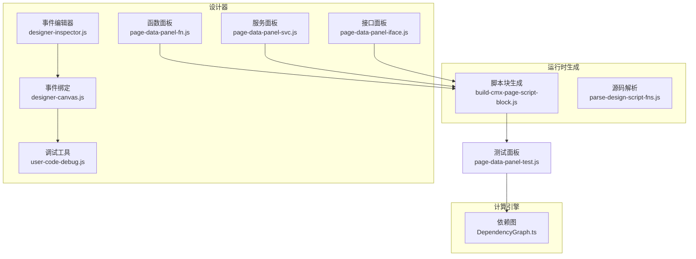
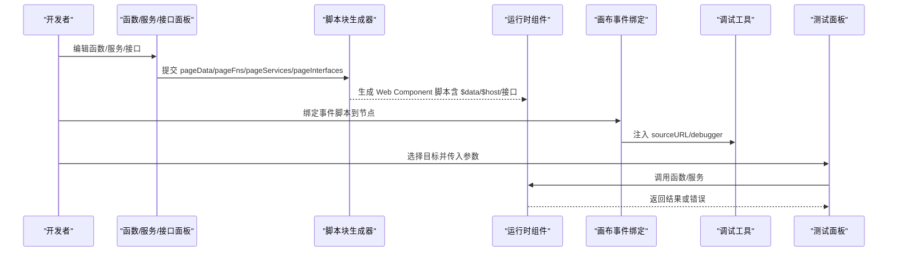
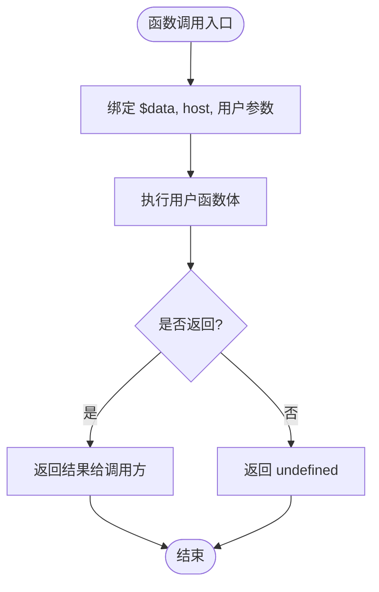
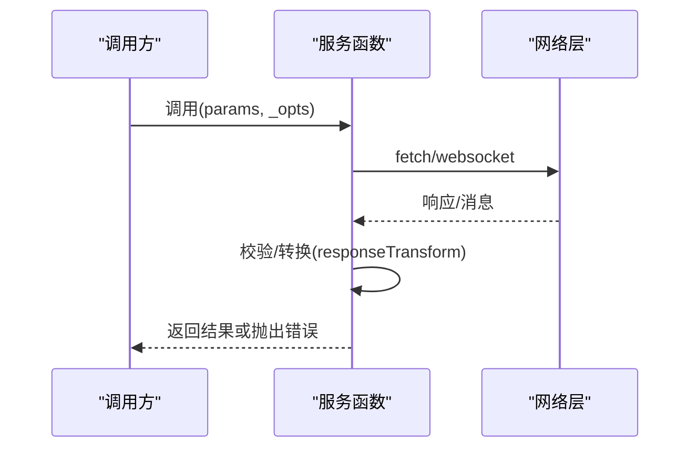
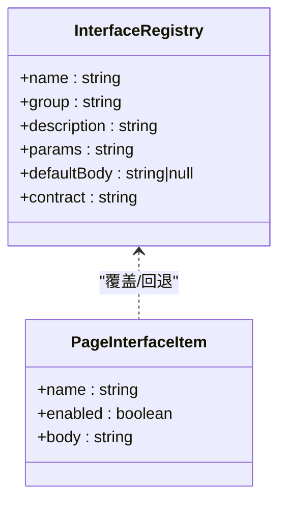
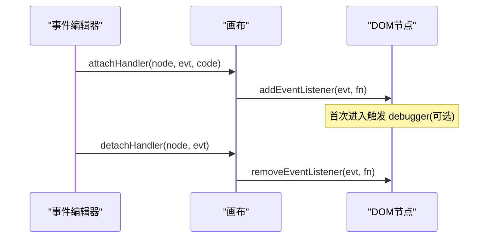
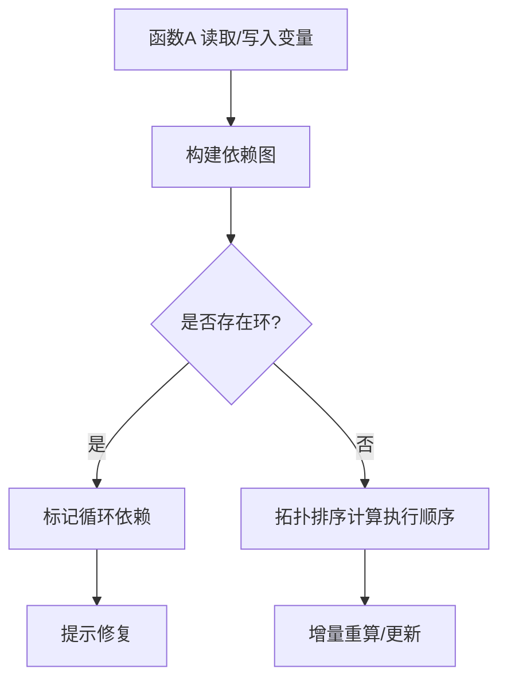
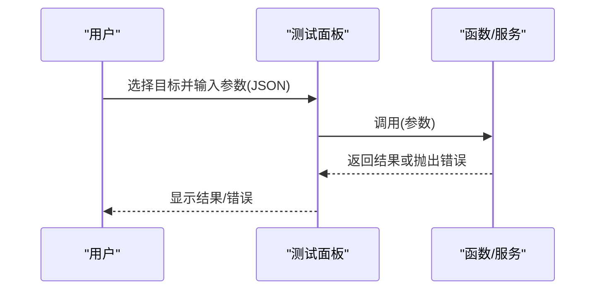
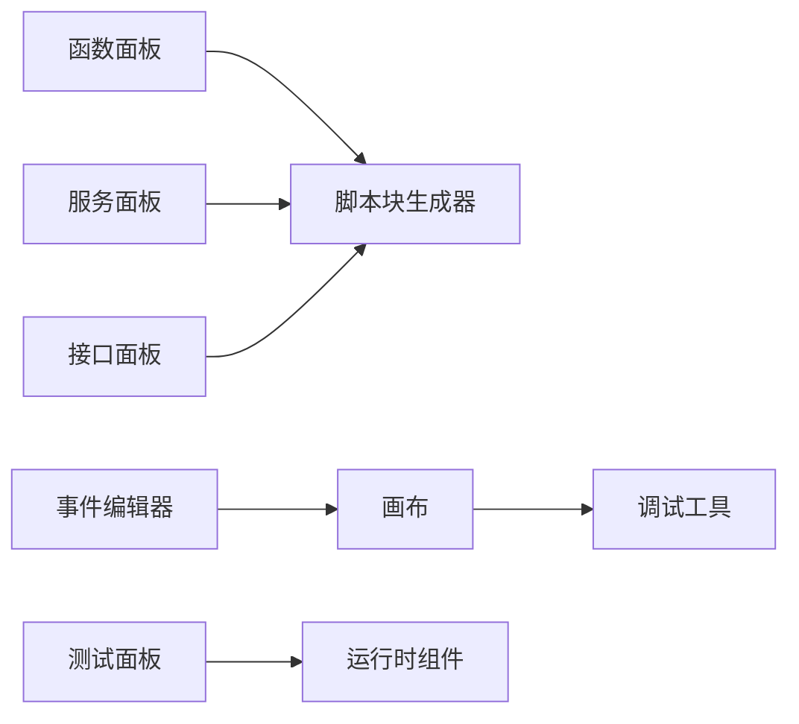

# 函数管理

<cite>
**本文引用的文件**
- [build-cmx-page-script-block.js](file://CMXHTMLDesigner/src/utils/build-cmx-page-script-block.js)
- [parse-design-script-fns.js](file://CMXHTMLDesigner/src/utils/parse-design-script-fns.js)
- [page-data-panel-fn.js](file://CMXHTMLDesigner/src/components/designer-page-data/page-data-panel-fn.js)
- [page-data-panel-svc.js](file://CMXHTMLDesigner/src/components/designer-page-data/page-data-panel-svc.js)
- [page-data-panel-iface.js](file://CMXHTMLDesigner/src/components/designer-page-data/page-data-panel-iface.js)
- [designer-canvas.js](file://CMXHTMLDesigner/src/components/designer-canvas.js)
- [designer-inspector.js](file://CMXHTMLDesigner/src/components/designer-inspector.js)
- [user-code-debug.js](file://CMXHTMLDesigner/src/utils/user-code-debug.js)
- [DependencyGraph.ts](file://cmx-mega-sheet/src/formula/DependencyGraph.ts)
- [DependencyGraph.test.ts](file://cmx-mega-sheet/test/DependencyGraph.test.ts)
- [page-data-panel-test.js](file://CMXHTMLDesigner/src/components/designer-page-data/page-data-panel-test.js)
</cite>

## 目录
1. [简介](#简介)
2. [项目结构](#项目结构)
3. [核心组件](#核心组件)
4. [架构总览](#架构总览)
5. [详细组件分析](#详细组件分析)
6. [依赖分析](#依赖分析)
7. [性能考虑](#性能考虑)
8. [故障排查指南](#故障排查指南)
9. [结论](#结论)
10. [附录](#附录)

## 简介
本指南面向“函数管理系统”的开发者，覆盖页面函数的定义规范、参数传递与返回值处理、函数依赖分析与变量读写追踪、代码静态检查、函数库组织与模块化设计、事件脚本绑定与生命周期、调试工具（断点与日志）、测试框架（模拟数据与断言）以及最佳实践与性能优化建议。内容基于 CMXHTMLDesigner 与 cmx-mega-sheet 的实际实现，确保可落地、可追溯。

## 项目结构
- 设计器侧（CMXHTMLDesigner）
  - 页面函数与服务编辑面板：page-data-panel-fn.js、page-data-panel-svc.js、page-data-panel-iface.js
  - 源码解析与运行时脚本生成：parse-design-script-fns.js、build-cmx-page-script-block.js
  - 事件脚本绑定与调试：designer-canvas.js、designer-inspector.js、user-code-debug.js
- 计算引擎侧（cmx-mega-sheet）
  - 依赖图与重算：DependencyGraph.ts 及其测试 DependencyGraph.test.ts
- 测试面板
  - 页面级函数/服务运行与结果展示：page-data-panel-test.js

**图表来源**
- [page-data-panel-fn.js:130-257](file://CMXHTMLDesigner/src/components/designer-page-data/page-data-panel-fn.js#L130-L257)
- [page-data-panel-svc.js:123-371](file://CMXHTMLDesigner/src/components/designer-page-data/page-data-panel-svc.js#L123-L371)
- [page-data-panel-iface.js:101-214](file://CMXHTMLDesigner/src/components/designer-page-data/page-data-panel-iface.js#L101-L214)
- [designer-inspector.js:630-717](file://CMXHTMLDesigner/src/components/designer-inspector.js#L630-L717)
- [designer-canvas.js:919-949](file://CMXHTMLDesigner/src/components/designer-canvas.js#L919-L949)
- [user-code-debug.js:1-59](file://CMXHTMLDesigner/src/utils/user-code-debug.js#L1-L59)
- [build-cmx-page-script-block.js:28-313](file://CMXHTMLDesigner/src/utils/build-cmx-page-script-block.js#L28-L313)
- [parse-design-script-fns.js:11-171](file://CMXHTMLDesigner/src/utils/parse-design-script-fns.js#L11-L171)
- [DependencyGraph.ts:66-96](file://cmx-mega-sheet/src/formula/DependencyGraph.ts#L66-L96)
- [page-data-panel-test.js:33-96](file://CMXHTMLDesigner/src/components/designer-page-data/page-data-panel-test.js#L33-L96)

**章节来源**
- [page-data-panel-fn.js:130-257](file://CMXHTMLDesigner/src/components/designer-page-data/page-data-panel-fn.js#L130-L257)
- [page-data-panel-svc.js:123-371](file://CMXHTMLDesigner/src/components/designer-page-data/page-data-panel-svc.js#L123-L371)
- [page-data-panel-iface.js:101-214](file://CMXHTMLDesigner/src/components/designer-page-data/page-data-panel-iface.js#L101-L214)
- [designer-inspector.js:630-717](file://CMXHTMLDesigner/src/components/designer-inspector.js#L630-L717)
- [designer-canvas.js:919-949](file://CMXHTMLDesigner/src/components/designer-canvas.js#L919-L949)
- [user-code-debug.js:1-59](file://CMXHTMLDesigner/src/utils/user-code-debug.js#L1-L59)
- [build-cmx-page-script-block.js:28-313](file://CMXHTMLDesigner/src/utils/build-cmx-page-script-block.js#L28-L313)
- [parse-design-script-fns.js:11-171](file://CMXHTMLDesigner/src/utils/parse-design-script-fns.js#L11-L171)
- [DependencyGraph.ts:66-96](file://cmx-mega-sheet/src/formula/DependencyGraph.ts#L66-L96)
- [page-data-panel-test.js:33-96](file://CMXHTMLDesigner/src/components/designer-page-data/page-data-panel-test.js#L33-L96)

## 核心组件
- 页面函数面板：提供函数名、参数声明、函数体编辑；支持变量读/写勾选以辅助依赖分析；支持删除与列表渲染。
- 服务面板：支持 REST/JSON-RPC/GraphQL/WebSocket 四类服务配置；自动生成请求体、查询串、错误处理；支持响应映射到 $data 字段与自定义转换函数。
- 接口面板：按注册表分组展示内置接口，支持启用/禁用与默认实现回退；签名与契约说明可视化。
- 事件脚本绑定：在画布节点上绑定事件处理脚本，支持 debugger 注入与 sourceURL 持久化断点。
- 脚本块生成器：将 pageData/pageFns/pageServices/pageInterfaces 编译为可运行的 Web Component 脚本，包含 $data Proxy、$host 上下文、接口方法、模型初始化等。
- 依赖图：用于公式/单元格依赖的前向/反向边维护、拓扑排序与环检测，支撑增量重算。
- 测试面板：选择函数或服务，输入 JSON 参数，执行并展示结果或错误信息。

**章节来源**
- [page-data-panel-fn.js:130-257](file://CMXHTMLDesigner/src/components/designer-page-data/page-data-panel-fn.js#L130-L257)
- [page-data-panel-svc.js:123-371](file://CMXHTMLDesigner/src/components/designer-page-data/page-data-panel-svc.js#L123-L371)
- [page-data-panel-iface.js:101-214](file://CMXHTMLDesigner/src/components/designer-page-data/page-data-panel-iface.js#L101-L214)
- [designer-canvas.js:919-949](file://CMXHTMLDesigner/src/components/designer-canvas.js#L919-L949)
- [build-cmx-page-script-block.js:28-313](file://CMXHTMLDesigner/src/utils/build-cmx-page-script-block.js#L28-L313)
- [DependencyGraph.ts:66-96](file://cmx-mega-sheet/src/formula/DependencyGraph.ts#L66-L96)
- [page-data-panel-test.js:33-96](file://CMXHTMLDesigner/src/components/designer-page-data/page-data-panel-test.js#L33-L96)

## 架构总览
下图展示了从设计器编辑到运行时执行的完整链路，包括函数/服务/接口的生成、事件脚本绑定、调试注入与依赖分析。

**图表来源**
- [page-data-panel-fn.js:130-257](file://CMXHTMLDesigner/src/components/designer-page-data/page-data-panel-fn.js#L130-L257)
- [page-data-panel-svc.js:123-371](file://CMXHTMLDesigner/src/components/designer-page-data/page-data-panel-svc.js#L123-L371)
- [page-data-panel-iface.js:101-214](file://CMXHTMLDesigner/src/components/designer-page-data/page-data-panel-iface.js#L101-L214)
- [build-cmx-page-script-block.js:28-313](file://CMXHTMLDesigner/src/utils/build-cmx-page-script-block.js#L28-L313)
- [designer-canvas.js:919-949](file://CMXHTMLDesigner/src/components/designer-canvas.js#L919-L949)
- [user-code-debug.js:1-59](file://CMXHTMLDesigner/src/utils/user-code-debug.js#L1-L59)
- [page-data-panel-test.js:33-96](file://CMXHTMLDesigner/src/components/designer-page-data/page-data-panel-test.js#L33-L96)

## 详细组件分析

### 页面函数：定义规范、参数与返回值
- 定义规范
  - 函数名需为合法 JS 标识符；参数声明为字符串形式，按逗号分割；函数体为纯文本。
  - 支持读取/写入页面变量的显式标记，便于依赖分析与提示。
- 参数传递机制
  - 运行时通过 new Function 将 $data、host 与用户参数注入为形参，调用时按声明顺序传参。
- 返回值处理
  - 函数直接 return 的值由调用方获取；若未 return，则返回 undefined。
- 编辑器与持久化
  - CodeMirror 编辑器实时同步 body；切换项或删除前会先持久化。
- 源码解析
  - 可从源码风格脚本中解析顶层 function/async function 声明，提取 name/params/body。

**图表来源**
- [build-cmx-page-script-block.js:165-180](file://CMXHTMLDesigner/src/utils/build-cmx-page-script-block.js#L165-L180)
- [parse-design-script-fns.js:11-171](file://CMXHTMLDesigner/src/utils/parse-design-script-fns.js#L11-L171)
- [page-data-panel-fn.js:130-257](file://CMXHTMLDesigner/src/components/designer-page-data/page-data-panel-fn.js#L130-L257)

**章节来源**
- [build-cmx-page-script-block.js:165-180](file://CMXHTMLDesigner/src/utils/build-cmx-page-script-block.js#L165-L180)
- [parse-design-script-fns.js:11-171](file://CMXHTMLDesigner/src/utils/parse-design-script-fns.js#L11-L171)
- [page-data-panel-fn.js:130-257](file://CMXHTMLDesigner/src/components/designer-page-data/page-data-panel-fn.js#L130-L257)

### 服务：REST/JSON-RPC/GraphQL/WebSocket
- 类型与配置
  - REST：method、url、headers、bodyTemplate、responseTo。
  - JSON-RPC：rpcMethod、payload 自动构造。
  - GraphQL：operationName、query、variables。
  - WebSocket：connect/send/close 三函数共享闭包连接。
- 请求构建
  - 自动设置 Content-Type；GET/DELETE 使用 URLSearchParams 拼接查询串；POST/PUT/PATCH 序列化 body。
- 响应处理
  - 非 ok 状态抛错；JSON-RPC 校验 error；GraphQL 校验 errors；可选 responseTransform 对数据进行转换。
- 运行时注入
  - 通过 genServiceCode/genServiceFnBody 生成函数体，并使用 AsyncFunction + sourceURL 使每个服务独立显示于 DevTools。

**图表来源**
- [page-data-panel-svc.js:373-569](file://CMXHTMLDesigner/src/components/designer-page-data/page-data-panel-svc.js#L373-L569)
- [build-cmx-page-script-block.js:182-233](file://CMXHTMLDesigner/src/utils/build-cmx-page-script-block.js#L182-L233)

**章节来源**
- [page-data-panel-svc.js:373-569](file://CMXHTMLDesigner/src/components/designer-page-data/page-data-panel-svc.js#L373-L569)
- [build-cmx-page-script-block.js:182-233](file://CMXHTMLDesigner/src/utils/build-cmx-page-script-block.js#L182-L233)

### 接口：注册表、签名与默认实现
- 注册表驱动
  - 按组展示接口，显示签名、描述与契约；支持启用/禁用与默认实现回退。
- 运行时行为
  - 启用时覆盖默认实现；未启用且存在默认实现时使用默认逻辑；否则宿主调用返回 undefined。
- 编辑器集成
  - 支持一键恢复默认实现；变更时实时更新侧边栏徽章与面板状态。

**图表来源**
- [page-data-panel-iface.js:101-214](file://CMXHTMLDesigner/src/components/designer-page-data/page-data-panel-iface.js#L101-L214)
- [build-cmx-page-script-block.js:235-280](file://CMXHTMLDesigner/src/utils/build-cmx-page-script-block.js#L235-L280)

**章节来源**
- [page-data-panel-iface.js:101-214](file://CMXHTMLDesigner/src/components/designer-page-data/page-data-panel-iface.js#L101-L214)
- [build-cmx-page-script-block.js:235-280](file://CMXHTMLDesigner/src/utils/build-cmx-page-script-block.js#L235-L280)

### 事件脚本：绑定方式、上下文与生命周期
- 绑定方式
  - 在画布节点上通过 data-event* 属性存储脚本；点击“绑定事件”后调用 attachHandler 注册监听器。
- 上下文对象
  - 事件回调中 this 指向绑定的 DOM 节点；event 作为参数传入。
- 生命周期
  - 移除事件时 detachHandler 解绑并从节点属性中清除；支持多次绑定/解绑。
- 调试增强
  - 装饰用户代码追加 sourceURL，支持在首行注入 debugger；调试模式开关持久化至 sessionStorage。

**图表来源**
- [designer-inspector.js:630-717](file://CMXHTMLDesigner/src/components/designer-inspector.js#L630-L717)
- [designer-canvas.js:919-949](file://CMXHTMLDesigner/src/components/designer-canvas.js#L919-L949)
- [user-code-debug.js:1-59](file://CMXHTMLDesigner/src/utils/user-code-debug.js#L1-L59)

**章节来源**
- [designer-inspector.js:630-717](file://CMXHTMLDesigner/src/components/designer-inspector.js#L630-L717)
- [designer-canvas.js:919-949](file://CMXHTMLDesigner/src/components/designer-canvas.js#L919-L949)
- [user-code-debug.js:1-59](file://CMXHTMLDesigner/src/utils/user-code-debug.js#L1-L59)

### 依赖分析与变量读写追踪
- 变量读写追踪
  - 函数面板允许勾选 readsVars/writesVars，用于标注函数对页面变量的读/写关系，辅助依赖可视化与提示。
- 依赖图能力
  - 支持前向/反向边维护、受影响集合计算、拓扑排序与环检测，适用于公式/单元格场景，也可借鉴到函数依赖分析。
- 静态检查建议
  - 结合 reads/writes 标记与依赖图，可在保存期进行循环引用、越权访问等诊断。

**图表来源**
- [page-data-panel-fn.js:19-54](file://CMXHTMLDesigner/src/components/designer-page-data/page-data-panel-fn.js#L19-L54)
- [DependencyGraph.ts:66-96](file://cmx-mega-sheet/src/formula/DependencyGraph.ts#L66-L96)
- [DependencyGraph.test.ts:35-127](file://cmx-mega-sheet/test/DependencyGraph.test.ts#L35-L127)

**章节来源**
- [page-data-panel-fn.js:19-54](file://CMXHTMLDesigner/src/components/designer-page-data/page-data-panel-fn.js#L19-L54)
- [DependencyGraph.ts:66-96](file://cmx-mega-sheet/src/formula/DependencyGraph.ts#L66-L96)
- [DependencyGraph.test.ts:35-127](file://cmx-mega-sheet/test/DependencyGraph.test.ts#L35-L127)

### 代码静态检查与源码解析
- 源码解析
  - 从源码风格脚本中提取顶层函数声明，支持 async/function，忽略字符串/模板中的误匹配。
- 静态检查
  - 名称合法性校验（JS 标识符）；参数与函数体分离存储；服务类型与字段可见性控制。
- 建议扩展
  - 引入 AST 解析替代正则/字符扫描，提升准确性与可扩展性。

**章节来源**
- [parse-design-script-fns.js:11-171](file://CMXHTMLDesigner/src/utils/parse-design-script-fns.js#L11-L171)
- [build-cmx-page-script-block.js:28-54](file://CMXHTMLDesigner/src/utils/build-cmx-page-script-block.js#L28-L54)

### 函数库的组织结构、命名约定与模块化设计
- 组织方式
  - 页面函数、服务、接口分别以数组形式存储在 pageFns/pageServices/pageInterfaces，统一由脚本块生成器编译。
- 命名约定
  - 函数/服务/接口名必须为合法 JS 标识符；服务名从目录条目清洗而来，避免冲突。
- 模块化设计
  - 各面板职责单一，通过公共工具（如 CodeMirror 编辑器、调试工具）复用；运行时通过 IIFE 隔离作用域，避免全局污染。

**章节来源**
- [page-data-panel-fn.js:130-257](file://CMXHTMLDesigner/src/components/designer-page-data/page-data-panel-fn.js#L130-L257)
- [page-data-panel-svc.js:167-234](file://CMXHTMLDesigner/src/components/designer-page-data/page-data-panel-svc.js#L167-L234)
- [build-cmx-page-script-block.js:28-54](file://CMXHTMLDesigner/src/utils/build-cmx-page-script-block.js#L28-L54)

### 事件脚本的绑定方式、上下文对象与生命周期管理
- 绑定方式
  - 通过 data-event* 属性存储脚本；点击“绑定事件”后调用 attachHandler 注册监听器。
- 上下文对象
  - 事件回调中 this 指向绑定的 DOM 节点；event 作为参数传入。
- 生命周期
  - 移除事件时 detachHandler 解绑并从节点属性中清除；支持多次绑定/解绑。
- 调试增强
  - 装饰用户代码追加 sourceURL，支持在首行注入 debugger；调试模式开关持久化至 sessionStorage。

**章节来源**
- [designer-inspector.js:630-717](file://CMXHTMLDesigner/src/components/designer-inspector.js#L630-L717)
- [designer-canvas.js:919-949](file://CMXHTMLDesigner/src/components/designer-canvas.js#L919-L949)
- [user-code-debug.js:1-59](file://CMXHTMLDesigner/src/utils/user-code-debug.js#L1-L59)

### 函数调试工具：断点设置与日志输出
- 断点设置
  - 编辑器提供“插入 debugger”按钮，在光标处插入 debugger;；调试模式下所有用户代码首行注入 debugger。
- 源映射
  - 通过 makeSourceUrl 生成稳定 sourceURL，使 DevTools Sources 面板按 URL 持久化断点。
- 日志输出
  - 运行时错误捕获并输出到控制台；WebSocket 连接/消息/错误日志打印。

**章节来源**
- [designer-inspector.js:695-704](file://CMXHTMLDesigner/src/components/designer-inspector.js#L695-L704)
- [user-code-debug.js:18-59](file://CMXHTMLDesigner/src/utils/user-code-debug.js#L18-L59)
- [page-data-panel-svc.js:456-474](file://CMXHTMLDesigner/src/components/designer-page-data/page-data-panel-svc.js#L456-L474)

### 函数测试框架：模拟数据与断言验证
- 使用方式
  - 选择函数或服务，输入 JSON 参数，点击运行；结果显示在结果框中，状态点指示成功/失败/运行中。
- 模拟数据
  - 参数以 JSON 形式传入；服务调用支持 headers/bodyTemplate 等配置。
- 断言验证
  - 建议在测试用例中对返回结果进行断言（如长度、关键字段），当前面板仅展示原始结果，可在上层封装断言逻辑。

**图表来源**
- [page-data-panel-test.js:33-96](file://CMXHTMLDesigner/src/components/designer-page-data/page-data-panel-test.js#L33-L96)

**章节来源**
- [page-data-panel-test.js:33-96](file://CMXHTMLDesigner/src/components/designer-page-data/page-data-panel-test.js#L33-L96)

## 依赖分析
- 组件耦合
  - 面板与生成器松耦合：面板只负责编辑与状态收集，生成器负责运行时脚本拼装。
  - 事件绑定与调试工具解耦：canvas 负责绑定，debug 工具负责代码装饰与调试模式。
- 外部依赖
  - CodeMirror 编辑器按需加载；WebSocket/fetch 用于服务通信；DevTools 通过 sourceURL 持久化断点。
- 潜在循环
  - 依赖图已具备环检测能力；建议在函数层面也引入类似机制，防止循环调用。

**图表来源**
- [page-data-panel-fn.js:130-257](file://CMXHTMLDesigner/src/components/designer-page-data/page-data-panel-fn.js#L130-L257)
- [page-data-panel-svc.js:123-371](file://CMXHTMLDesigner/src/components/designer-page-data/page-data-panel-svc.js#L123-L371)
- [page-data-panel-iface.js:101-214](file://CMXHTMLDesigner/src/components/designer-page-data/page-data-panel-iface.js#L101-L214)
- [designer-inspector.js:630-717](file://CMXHTMLDesigner/src/components/designer-inspector.js#L630-L717)
- [designer-canvas.js:919-949](file://CMXHTMLDesigner/src/components/designer-canvas.js#L919-L949)
- [user-code-debug.js:1-59](file://CMXHTMLDesigner/src/utils/user-code-debug.js#L1-L59)
- [page-data-panel-test.js:33-96](file://CMXHTMLDesigner/src/components/designer-page-data/page-data-panel-test.js#L33-L96)

**章节来源**
- [page-data-panel-fn.js:130-257](file://CMXHTMLDesigner/src/components/designer-page-data/page-data-panel-fn.js#L130-L257)
- [page-data-panel-svc.js:123-371](file://CMXHTMLDesigner/src/components/designer-page-data/page-data-panel-svc.js#L123-L371)
- [page-data-panel-iface.js:101-214](file://CMXHTMLDesigner/src/components/designer-page-data/page-data-panel-iface.js#L101-L214)
- [designer-inspector.js:630-717](file://CMXHTMLDesigner/src/components/designer-inspector.js#L630-L717)
- [designer-canvas.js:919-949](file://CMXHTMLDesigner/src/components/designer-canvas.js#L919-L949)
- [user-code-debug.js:1-59](file://CMXHTMLDesigner/src/utils/user-code-debug.js#L1-L59)
- [page-data-panel-test.js:33-96](file://CMXHTMLDesigner/src/components/designer-page-data/page-data-panel-test.js#L33-L96)

## 性能考虑
- 运行时开销
  - new Function/AsyncFunction 每次创建函数对象有开销；建议缓存常用函数或减少频繁重建。
  - $data 使用 Proxy 进行双向绑定，大量字段写入可能带来性能压力；建议批量更新或使用不可变更新策略。
- 网络请求
  - 服务调用支持 AbortSignal 取消；避免重复请求与长轮询未关闭。
- 依赖计算
  - 依赖图支持增量更新与拓扑排序；在函数层面也可采用类似策略，避免全量重算。

[本节为通用指导，不直接分析具体文件]

## 故障排查指南
- 事件脚本编译失败
  - 检查语法错误；查看控制台错误信息；确认 sourceURL 是否正确生成。
- 服务调用异常
  - 检查 HTTP 状态码与错误信息；JSON-RPC/GraphQL 的错误字段；WebSocket 连接状态。
- 依赖循环
  - 使用依赖图检测环；修正函数间的循环调用或数据依赖。
- 调试无断点
  - 确认调试模式已开启；检查浏览器 Sources 面板是否显示对应 sourceURL。

**章节来源**
- [designer-canvas.js:919-949](file://CMXHTMLDesigner/src/components/designer-canvas.js#L919-L949)
- [page-data-panel-svc.js:373-569](file://CMXHTMLDesigner/src/components/designer-page-data/page-data-panel-svc.js#L373-L569)
- [DependencyGraph.test.ts:35-127](file://cmx-mega-sheet/test/DependencyGraph.test.ts#L35-L127)
- [user-code-debug.js:18-59](file://CMXHTMLDesigner/src/utils/user-code-debug.js#L18-L59)

## 结论
本指南基于实际代码实现了函数管理的完整闭环：从设计器编辑、脚本生成、事件绑定、调试到测试与依赖分析。通过明确的命名约定、模块化设计与调试增强，开发者可以高效地构建与维护页面函数与服务。建议在生产环境中引入更严格的静态检查与依赖环检测，进一步提升稳定性与可维护性。

[本节为总结，不直接分析具体文件]

## 附录
- 最佳实践
  - 函数保持单一职责，避免过长函数体；合理使用 reads/writes 标记。
  - 服务调用统一错误处理与重试策略；WebSocket 注意连接生命周期管理。
  - 接口优先使用默认实现，仅在必要时覆盖；保持签名稳定。
- 性能优化技巧
  - 批量更新 $data；避免频繁创建函数对象；合理缓存网络结果。
- 常见陷阱
  - 循环依赖导致死锁；未正确释放 WebSocket 连接；sourceURL 缺失导致断点失效。

[本节为通用指导，不直接分析具体文件]