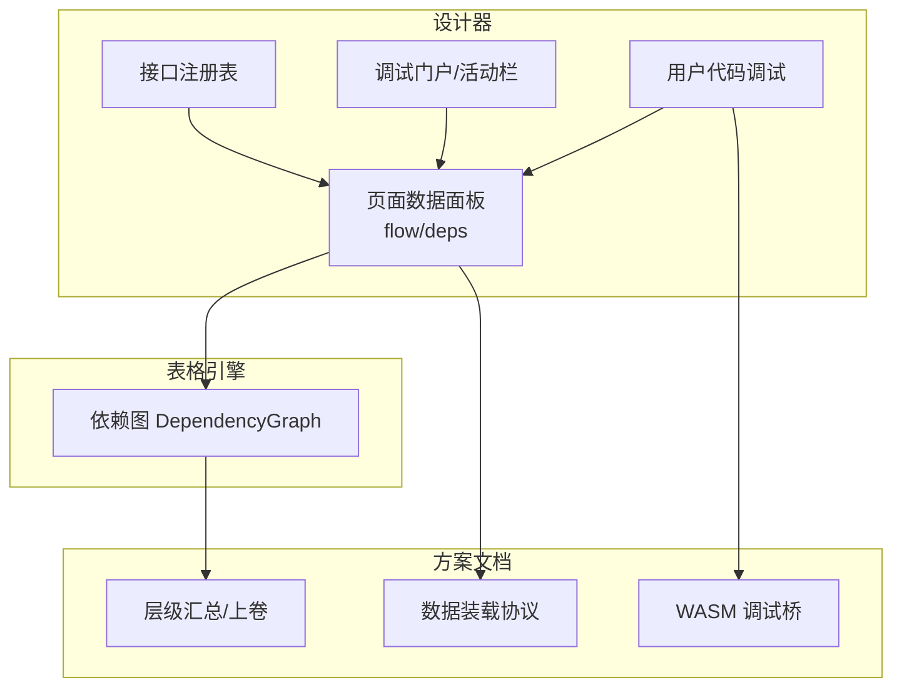
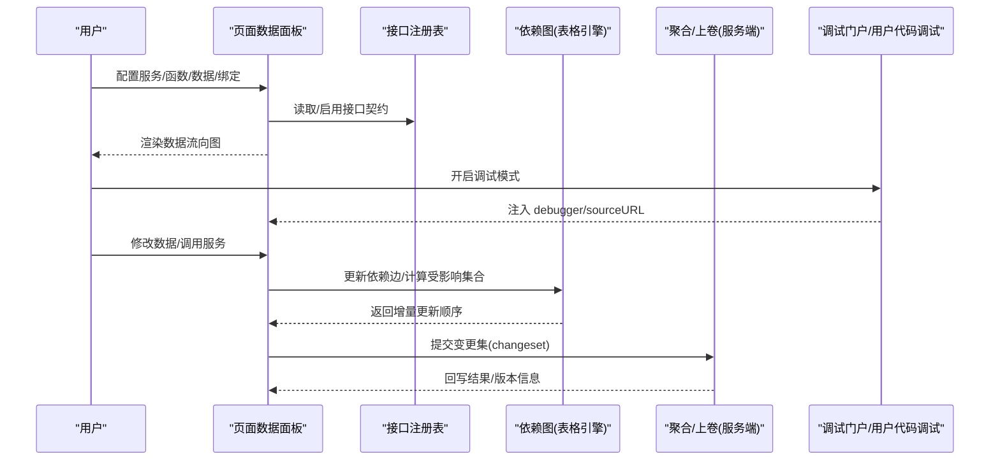
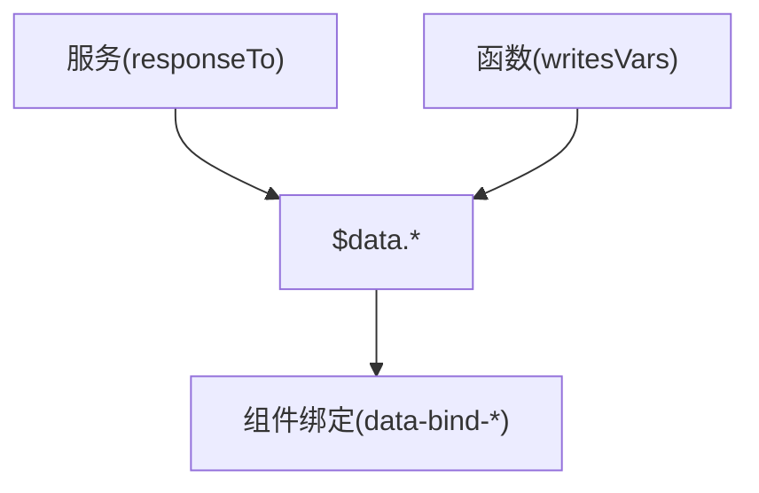
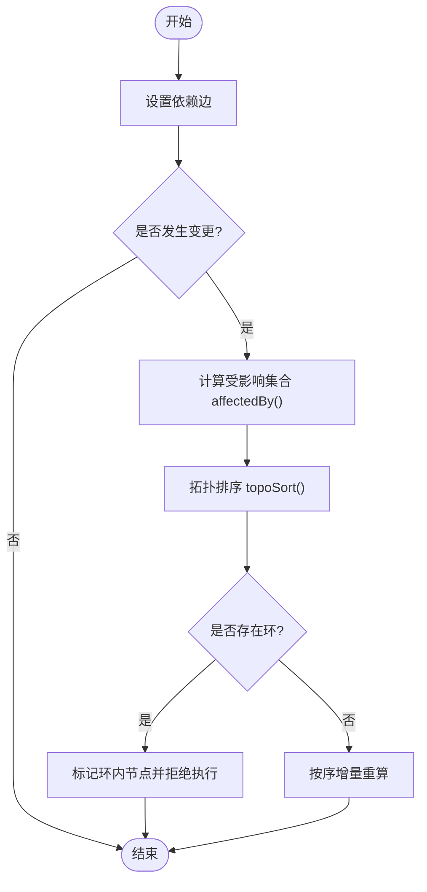
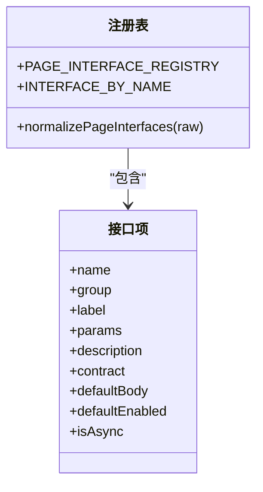
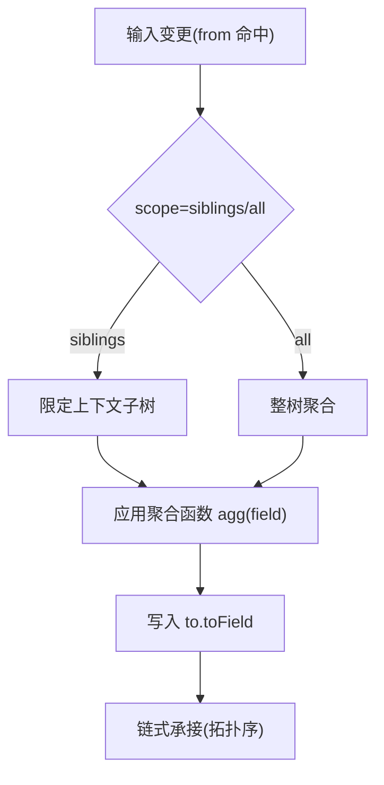
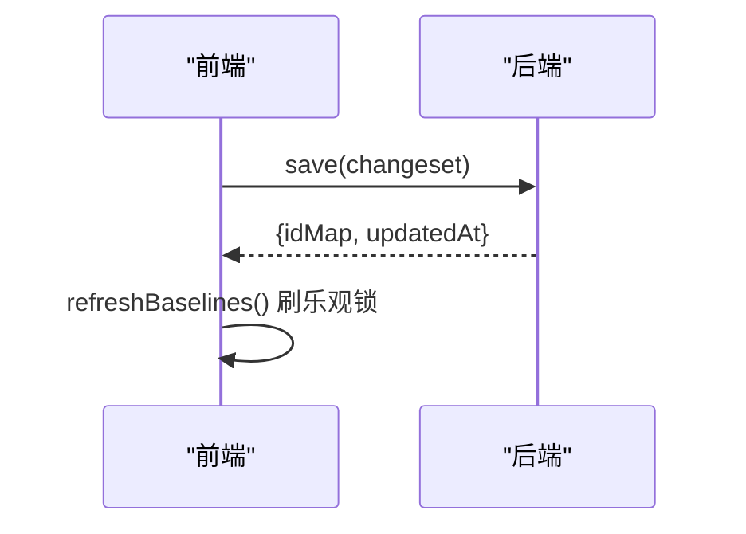
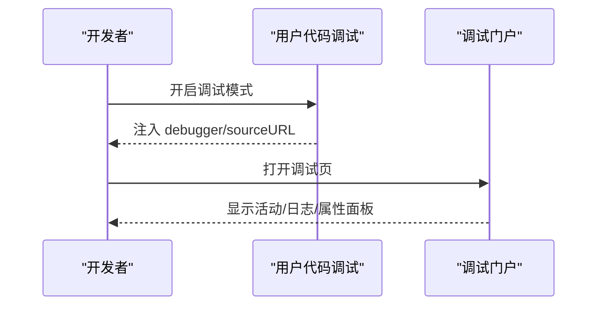
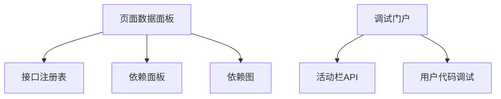

# 数据流管理

<cite>
**本文引用的文件**
- [registry-api.js](file://CMXHTMLDesigner/src/api/registry-api.js)
- [page-interface-registry.js](file://CMXHTMLDesigner/src/components/designer-page-data/page-interface-registry.js)
- [page-data-panel-flow.js](file://CMXHTMLDesigner/src/components/designer-page-data/page-data-panel-flow.js)
- [page-data-panel-deps.js](file://CMXHTMLDesigner/src/components/designer-page-data/page-data-panel-deps.js)
- [activities-api.js](file://CMXHTMLDesigner/src/debug-portal/activities-api.js)
- [user-code-debug.js](file://CMXHTMLDesigner/src/utils/user-code-debug.js)
- [DependencyGraph.test.ts](file://cmx-mega-sheet/test/DependencyGraph.test.ts)
- [model-master-slave.md](file://.agents/skills/html-page-generator/references/model-master-slave.md)
- [cmx-hierarchy-层级数据管理引擎方案.html](file://docs/cmx-hierarchy-层级数据管理引擎方案.html)
- [DCT数据字典存储与加载服务方案.html](file://docs/DCT数据字典存储与加载服务方案.html)
- [业务单据数据装载与前端模型映射方案.html](file://docs/业务单据数据装载与前端模型映射方案.html)
- [Rust-WASM二次开发平台-缺口补齐开发方案.md](file://docs/Rust-WASM二次开发平台-缺口补齐开发方案.md)
</cite>

## 目录
1. [引言](#引言)
2. [项目结构](#项目结构)
3. [核心组件](#核心组件)
4. [架构总览](#架构总览)
5. [详细组件分析](#详细组件分析)
6. [依赖分析](#依赖分析)
7. [性能考虑](#性能考虑)
8. [故障排查指南](#故障排查指南)
9. [结论](#结论)
10. [附录](#附录)

## 引言
本设计文档面向“数据流管理系统”，聚焦以下目标：
- 数据流向图的设计原理、节点连接关系与流转规则
- 依赖分析引擎的工作机制、循环依赖检测与冲突解决策略
- 接口注册表的组织结构、版本管理与兼容性处理
- 数据聚合的计算逻辑、实时同步机制与增量更新策略
- 数据血缘追踪的实现方法、影响分析与变更传播
- 数据流调试工具的使用方法、执行跟踪与性能分析
- 最佳实践建议、性能优化方案与故障排查指南

## 项目结构
仓库包含多套子系统，与数据流管理密切相关的模块主要位于：
- CMXHTMLDesigner：页面设计器、数据面板、流程可视化、调试门户、用户代码可断点化能力
- cmx-mega-sheet：表格引擎中的依赖图（DependencyGraph）实现与测试，支撑公式级依赖与增量重算
- docs：体系化方案文档，涵盖层级汇总、数据装载协议、WASM 调试桥等

**章节来源**
- [page-data-panel-flow.js:1-145](file://CMXHTMLDesigner/src/components/designer-page-data/page-data-panel-flow.js#L1-L145)
- [page-data-panel-deps.js:1-96](file://CMXHTMLDesigner/src/components/designer-page-data/page-data-panel-deps.js#L1-L96)
- [page-interface-registry.js:1-468](file://CMXHTMLDesigner/src/components/designer-page-data/page-interface-registry.js#L1-L468)
- [activities-api.js:1-164](file://CMXHTMLDesigner/src/debug-portal/activities-api.js#L1-L164)
- [user-code-debug.js:1-60](file://CMXHTMLDesigner/src/utils/user-code-debug.js#L1-L60)
- [DependencyGraph.test.ts:35-108](file://cmx-mega-sheet/test/DependencyGraph.test.ts#L35-L108)
- [model-master-slave.md:86-141](file://.agents/skills/html-page-generator/references/model-master-slave.md#L86-L141)
- [cmx-hierarchy-层级数据管理引擎方案.html:398-415](file://docs/cmx-hierarchy-层级数据管理引擎方案.html#L398-L415)
- [DCT数据字典存储与加载服务方案.html:658-660](file://docs/DCT数据字典存储与加载服务方案.html#L658-L660)
- [业务单据数据装载与前端模型映射方案.html:869-884](file://docs/业务单据数据装载与前端模型映射方案.html#L869-L884)
- [Rust-WASM二次开发平台-缺口补齐开发方案.md:120-131](file://docs/Rust-WASM二次开发平台-缺口补齐开发方案.md#L120-L131)

## 核心组件
- 页面数据流可视化：解析服务/函数到数据变量再到组件绑定的数据流向，生成三列流程图（服务/函数 → 数据 → 绑定）
- 依赖管理面板：声明外部库的加载方式（script/module）、URL、全局名或 importmap 注入
- 接口注册表：集中定义页面对外暴露的方法契约（状态、生命周期、编辑、持久化、工作流、对话框、数据注入），并提供默认实现与调试增强
- 调试门户与活动栏：统一获取并缓存活动配置，驱动侧边栏渲染
- 用户代码可断点化：为动态生成的用户代码注入稳定 sourceURL，支持进入即暂停
- 依赖图与增量计算：基于 DependencyGraph 的拓扑排序与受影响集合计算，支撑公式/字段级增量更新
- 聚合与上卷：通过 AggRule 声明在写时或读时进行层级汇总，服务端权威计算保证安全
- 数据装载协议：前后端以 changeset/load/export{columnar} 对齐，确保双向一致
- WASM 调试桥：提供稳态化调试路径与可选 DAP 桥接

**章节来源**
- [page-data-panel-flow.js:1-145](file://CMXHTMLDesigner/src/components/designer-page-data/page-data-panel-flow.js#L1-L145)
- [page-data-panel-deps.js:1-96](file://CMXHTMLDesigner/src/components/designer-page-data/page-data-panel-deps.js#L1-L96)
- [page-interface-registry.js:1-468](file://CMXHTMLDesigner/src/components/designer-page-data/page-interface-registry.js#L1-L468)
- [activities-api.js:1-164](file://CMXHTMLDesigner/src/debug-portal/activities-api.js#L1-L164)
- [user-code-debug.js:1-60](file://CMXHTMLDesigner/src/utils/user-code-debug.js#L1-L60)
- [DependencyGraph.test.ts:35-108](file://cmx-mega-sheet/test/DependencyGraph.test.ts#L35-L108)
- [model-master-slave.md:86-141](file://.agents/skills/html-page-generator/references/model-master-slave.md#L86-L141)
- [cmx-hierarchy-层级数据管理引擎方案.html:398-415](file://docs/cmx-hierarchy-层级数据管理引擎方案.html#L398-L415)
- [业务单据数据装载与前端模型映射方案.html:318-326](file://docs/业务单据数据装载与前端模型映射方案.html#L318-L326)
- [Rust-WASM二次开发平台-缺口补齐开发方案.md:120-131](file://docs/Rust-WASM二次开发平台-缺口补齐开发方案.md#L120-L131)

## 架构总览
数据流管理贯穿“设计期—运行期—调试期”：
- 设计期：页面数据面板维护服务/函数/数据/绑定关系；依赖面板声明外部资源；接口注册表提供标准扩展点
- 运行期：页面按注册表挂载宿主方法；数据变化触发依赖图增量重算；聚合规则在服务端权威计算
- 调试期：活动栏统一入口；用户代码可断点化；WASM 调试桥提供跨进程调试能力

**图表来源**
- [page-data-panel-flow.js:1-145](file://CMXHTMLDesigner/src/components/designer-page-data/page-data-panel-flow.js#L1-L145)
- [page-interface-registry.js:1-468](file://CMXHTMLDesigner/src/components/designer-page-data/page-interface-registry.js#L1-L468)
- [DependencyGraph.test.ts:35-108](file://cmx-mega-sheet/test/DependencyGraph.test.ts#L35-L108)
- [业务单据数据装载与前端模型映射方案.html:318-326](file://docs/业务单据数据装载与前端模型映射方案.html#L318-L326)
- [user-code-debug.js:1-60](file://CMXHTMLDesigner/src/utils/user-code-debug.js#L1-L60)

## 详细组件分析

### 数据流向图与节点连接关系
- 数据来源：服务（responseTo 指向数据变量）与函数（writesVars 写入数据变量）
- 数据变量：$data 下的命名空间，作为中间层
- 绑定目标：组件属性 data-bind-* 与 $data 变量的映射
- 可视化：三列布局（服务/函数 → 数据 → 绑定），箭头表示数据流向

**图表来源**
- [page-data-panel-flow.js:28-145](file://CMXHTMLDesigner/src/components/designer-page-data/page-data-panel-flow.js#L28-L145)

**章节来源**
- [page-data-panel-flow.js:1-145](file://CMXHTMLDesigner/src/components/designer-page-data/page-data-panel-flow.js#L1-L145)

### 依赖分析引擎：循环依赖检测与冲突解决
- 依赖图：维护正向/反向边，支持查询被依赖者与受影响集合
- 拓扑排序：对指定子图进行排序，返回有序序列与环集合
- 增量更新：给定变更源，计算受影响的下游节点集合，避免全量重算
- 冲突处理：当检测到环时，标记参与环的节点，阻断执行直至修复

**图表来源**
- [DependencyGraph.test.ts:35-108](file://cmx-mega-sheet/test/DependencyGraph.test.ts#L35-L108)

**章节来源**
- [DependencyGraph.test.ts:35-108](file://cmx-mega-sheet/test/DependencyGraph.test.ts#L35-L108)

### 接口注册表：组织结构、版本管理与兼容性
- 分组组织：状态查询、生命周期、编辑动作、持久化、工作流、对话框、数据注入
- 契约描述：每条接口含名称、参数、描述、契约说明、默认实现、是否异步
- 兼容策略：未启用接口返回 undefined；默认实现保证宿主调用不抛错；新增接口向后兼容
- 调试增强：每个实现独立 sourceURL，调试模式自动注入 debugger

**图表来源**
- [page-interface-registry.js:1-468](file://CMXHTMLDesigner/src/components/designer-page-data/page-interface-registry.js#L1-L468)

**章节来源**
- [page-interface-registry.js:1-468](file://CMXHTMLDesigner/src/components/designer-page-data/page-interface-registry.js#L1-L468)

### 数据聚合：计算逻辑、实时同步与增量更新
- 聚合规则：from/agg/field/to/toField/scope，支持 sum/avg/min/max/count
- 触发时机：setData/setFlatData 后预热；字段变更、行增删命中相关规则
- 执行时机：写时上卷（落库前重算）或读时上卷（查询现算），服务端权威
- 增量策略：仅重算受 from 影响的规则，结合依赖图缩小范围

**图表来源**
- [model-master-slave.md:86-141](file://.agents/skills/html-page-generator/references/model-master-slave.md#L86-L141)
- [cmx-hierarchy-层级数据管理引擎方案.html:398-415](file://docs/cmx-hierarchy-层级数据管理引擎方案.html#L398-L415)

**章节来源**
- [model-master-slave.md:86-141](file://.agents/skills/html-page-generator/references/model-master-slave.md#L86-L141)
- [cmx-hierarchy-层级数据管理引擎方案.html:398-415](file://docs/cmx-hierarchy-层级数据管理引擎方案.html#L398-L415)

### 数据血缘追踪：影响分析与变更传播
- 血缘来源：服务→数据→组件绑定，形成从源头到展示的全链路
- 影响分析：基于依赖图计算 affectedBy，定位变更传播路径
- 变更传播：按拓扑序增量更新，避免级联风暴

**图表来源**
- [page-data-panel-flow.js:28-145](file://CMXHTMLDesigner/src/components/designer-page-data/page-data-panel-flow.js#L28-L145)
- [DependencyGraph.test.ts:35-108](file://cmx-mega-sheet/test/DependencyGraph.test.ts#L35-L108)

**章节来源**
- [page-data-panel-flow.js:1-145](file://CMXHTMLDesigner/src/components/designer-page-data/page-data-panel-flow.js#L1-L145)
- [DependencyGraph.test.ts:35-108](file://cmx-mega-sheet/test/DependencyGraph.test.ts#L35-L108)

### 实时同步与增量更新策略
- 前端：字段级变更事件触发命中规则的增量重算
- 后端：changeset 上传，服务端 rollup 权威计算，返回 idMap/updatedAt 刷新基线
- 协议对齐：load/export{columnar} 与前端 CmxDataSet.fromJSON 直吃

**图表来源**
- [业务单据数据装载与前端模型映射方案.html:318-326](file://docs/业务单据数据装载与前端模型映射方案.html#L318-L326)

**章节来源**
- [业务单据数据装载与前端模型映射方案.html:318-326](file://docs/业务单据数据装载与前端模型映射方案.html#L318-L326)

### 调试工具：使用方法、执行跟踪与性能分析
- 用户代码可断点化：为 new Function 拼出的用户代码追加稳定 sourceURL，调试模式首行注入 debugger
- 调试门户：活动栏统一入口，缓存活动定义，侧边栏按 type 渲染
- 依赖面板：声明 script/module 依赖，便于运行时加载与提示
- WASM 调试桥：稳态化 debug_prepare → cmx-debug 会话 → CodeLLDB attach，可选 DAP 桥

**图表来源**
- [user-code-debug.js:1-60](file://CMXHTMLDesigner/src/utils/user-code-debug.js#L1-L60)
- [activities-api.js:1-164](file://CMXHTMLDesigner/src/debug-portal/activities-api.js#L1-L164)
- [Rust-WASM二次开发平台-缺口补齐开发方案.md:120-131](file://docs/Rust-WASM二次开发平台-缺口补齐开发方案.md#L120-L131)

**章节来源**
- [user-code-debug.js:1-60](file://CMXHTMLDesigner/src/utils/user-code-debug.js#L1-L60)
- [activities-api.js:1-164](file://CMXHTMLDesigner/src/debug-portal/activities-api.js#L1-L164)
- [Rust-WASM二次开发平台-缺口补齐开发方案.md:120-131](file://docs/Rust-WASM二次开发平台-缺口补齐开发方案.md#L120-L131)

## 依赖分析
- 设计器侧依赖：页面数据面板依赖接口注册表与依赖面板，用于生成数据流向图与资源加载
- 表格引擎依赖：依赖图支撑公式/字段级增量更新，与聚合规则协同
- 调试侧依赖：活动栏与用户代码调试共同提升可观测性
- 版本与兼容：接口注册表默认实现保障向后兼容；活动栏配置白名单校验防止非法值

**图表来源**
- [page-data-panel-flow.js:1-145](file://CMXHTMLDesigner/src/components/designer-page-data/page-data-panel-flow.js#L1-L145)
- [page-data-panel-deps.js:1-96](file://CMXHTMLDesigner/src/components/designer-page-data/page-data-panel-deps.js#L1-L96)
- [page-interface-registry.js:1-468](file://CMXHTMLDesigner/src/components/designer-page-data/page-interface-registry.js#L1-L468)
- [activities-api.js:1-164](file://CMXHTMLDesigner/src/debug-portal/activities-api.js#L1-L164)
- [user-code-debug.js:1-60](file://CMXHTMLDesigner/src/utils/user-code-debug.js#L1-L60)

**章节来源**
- [page-data-panel-flow.js:1-145](file://CMXHTMLDesigner/src/components/designer-page-data/page-data-panel-flow.js#L1-L145)
- [page-data-panel-deps.js:1-96](file://CMXHTMLDesigner/src/components/designer-page-data/page-data-panel-deps.js#L1-L96)
- [page-interface-registry.js:1-468](file://CMXHTMLDesigner/src/components/designer-page-data/page-interface-registry.js#L1-L468)
- [activities-api.js:1-164](file://CMXHTMLDesigner/src/debug-portal/activities-api.js#L1-L164)
- [user-code-debug.js:1-60](file://CMXHTMLDesigner/src/utils/user-code-debug.js#L1-L60)

## 性能考虑
- 增量更新优先：利用依赖图计算受影响集合，避免全量重算
- 聚合分场景：写时上卷适合报表/凭证类，读时上卷适合纯展示维度
- 缓存与去抖：活动栏加载去重与缓存，减少重复请求
- 调试开销控制：调试模式仅在需要时开启，避免生产环境注入 debugger
- 网络与资源：依赖面板支持 module 与 script 两种加载方式，按需选择以提升加载性能

[本节为通用指导，无需具体文件引用]

## 故障排查指南
- 循环依赖导致无法执行：检查依赖图拓扑排序结果，定位环内节点并修复
- 聚合结果异常：确认 AggRule 的 from/to/field 与 scope 配置，核对服务端权威计算
- 数据不同步：核对 changeset 结构与后端响应，确认 refreshBaselines 刷新
- 调试无法断点：确认 sourceURL 注入与调试模式开关，检查浏览器 Sources 面板
- 活动栏不显示：检查活动定义白名单与 sideNav 类型，确认 API 返回正常

**章节来源**
- [DependencyGraph.test.ts:35-108](file://cmx-mega-sheet/test/DependencyGraph.test.ts#L35-L108)
- [model-master-slave.md:86-141](file://.agents/skills/html-page-generator/references/model-master-slave.md#L86-L141)
- [业务单据数据装载与前端模型映射方案.html:318-326](file://docs/业务单据数据装载与前端模型映射方案.html#L318-L326)
- [user-code-debug.js:1-60](file://CMXHTMLDesigner/src/utils/user-code-debug.js#L1-L60)
- [activities-api.js:1-164](file://CMXHTMLDesigner/src/debug-portal/activities-api.js#L1-L164)

## 结论
本系统通过“设计期可视化—运行期增量计算—调试期可观测”的闭环，实现了数据流的透明化管理。依赖图与聚合规则协同，确保高效与正确性；接口注册表提供标准化扩展点与兼容保障；调试工具链覆盖用户代码与 WASM 场景，提升问题定位效率。建议在复杂场景中优先采用写时上卷与服务端权威计算，并结合依赖图进行精细化增量更新。

[本节为总结，无需具体文件引用]

## 附录
- 接口注册表分组与默认实现参考：[page-interface-registry.js:1-468](file://CMXHTMLDesigner/src/components/designer-page-data/page-interface-registry.js#L1-L468)
- 数据流向图渲染与绑定解析参考：[page-data-panel-flow.js:1-145](file://CMXHTMLDesigner/src/components/designer-page-data/page-data-panel-flow.js#L1-L145)
- 依赖面板与资源加载参考：[page-data-panel-deps.js:1-96](file://CMXHTMLDesigner/src/components/designer-page-data/page-data-panel-deps.js#L1-L96)
- 活动栏与调试门户参考：[activities-api.js:1-164](file://CMXHTMLDesigner/src/debug-portal/activities-api.js#L1-L164)
- 用户代码可断点化参考：[user-code-debug.js:1-60](file://CMXHTMLDesigner/src/utils/user-code-debug.js#L1-L60)
- 依赖图与增量计算参考：[DependencyGraph.test.ts:35-108](file://cmx-mega-sheet/test/DependencyGraph.test.ts#L35-L108)
- 聚合规则与上卷策略参考：[model-master-slave.md:86-141](file://.agents/skills/html-page-generator/references/model-master-slave.md#L86-L141), [cmx-hierarchy-层级数据管理引擎方案.html:398-415](file://docs/cmx-hierarchy-层级数据管理引擎方案.html#L398-L415)
- 数据装载协议参考：[业务单据数据装载与前端模型映射方案.html:318-326](file://docs/业务单据数据装载与前端模型映射方案.html#L318-L326)
- WASM 调试桥参考：[Rust-WASM二次开发平台-缺口补齐开发方案.md:120-131](file://docs/Rust-WASM二次开发平台-缺口补齐开发方案.md#L120-L131)