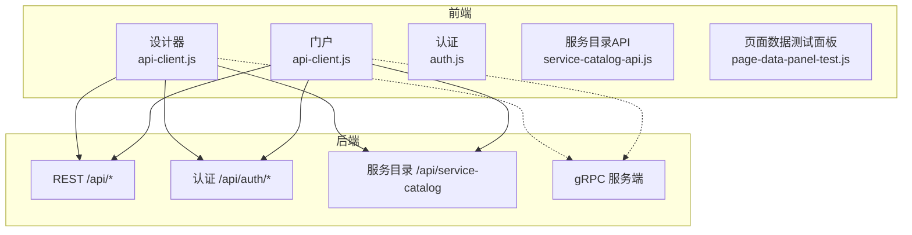
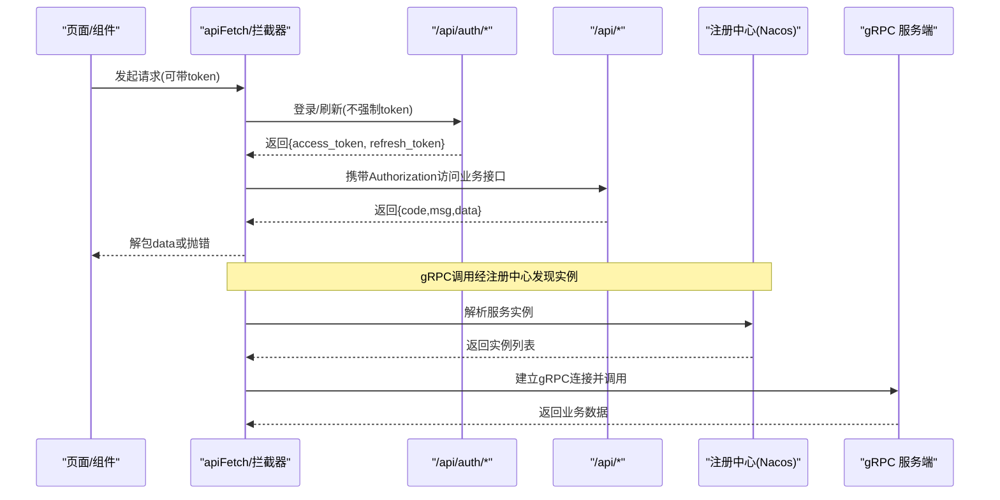
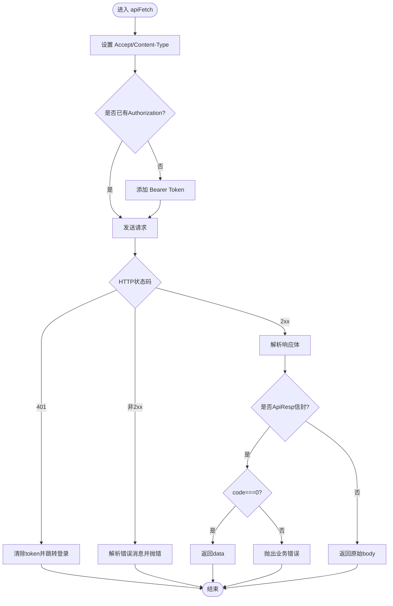
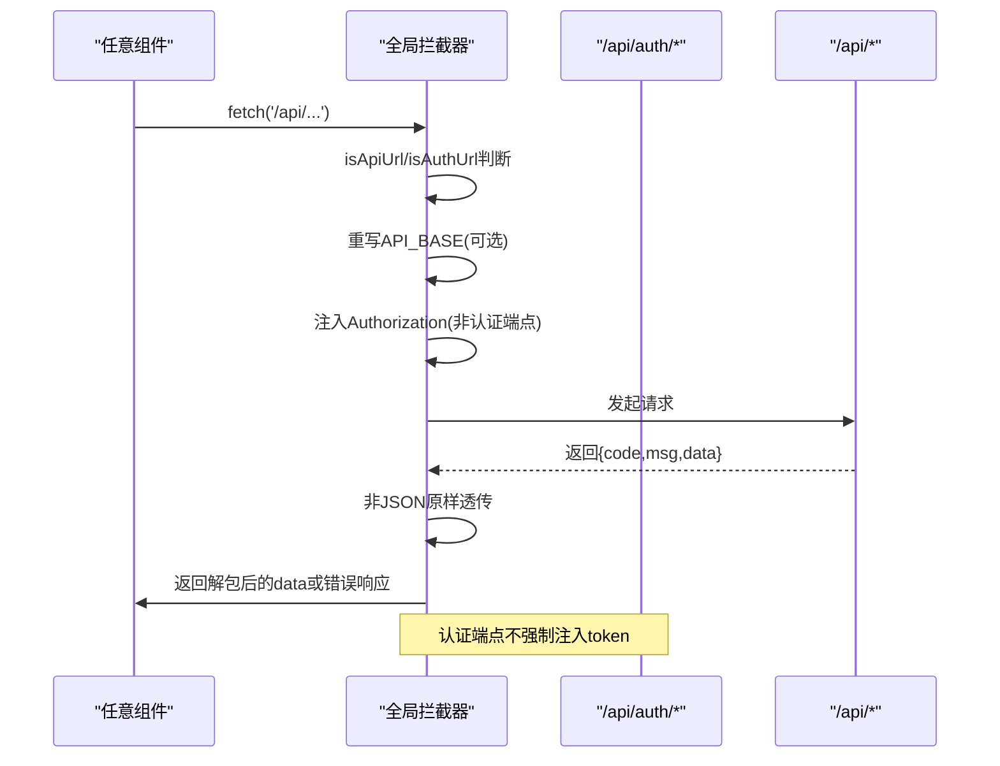
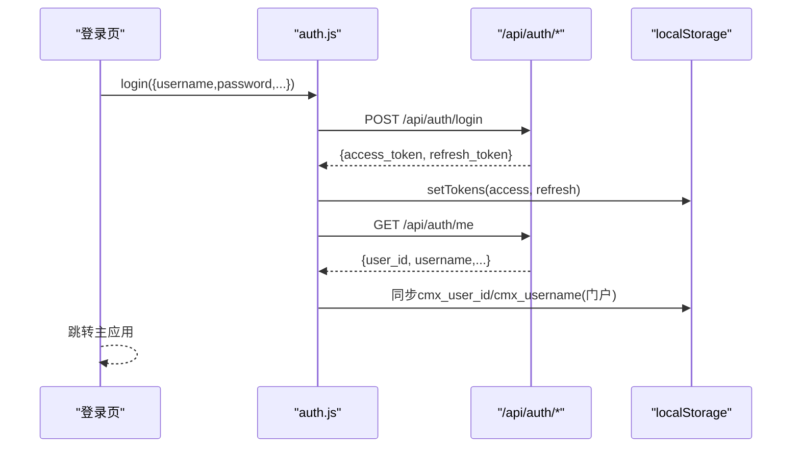
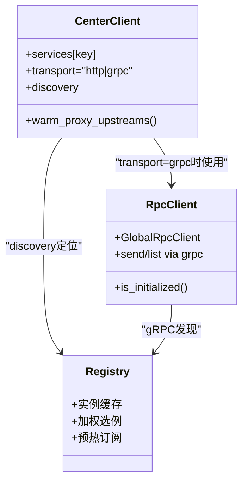
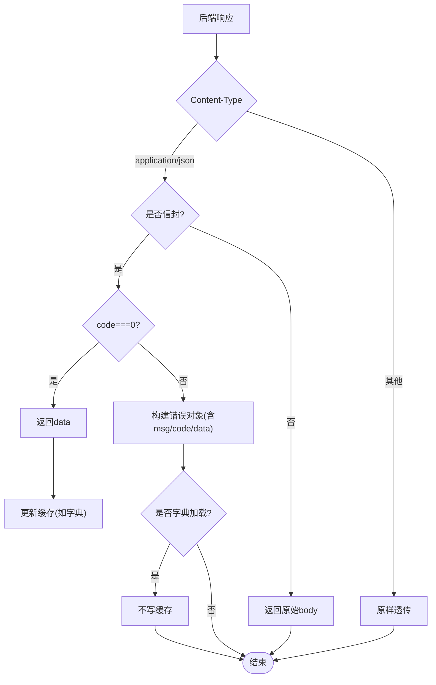
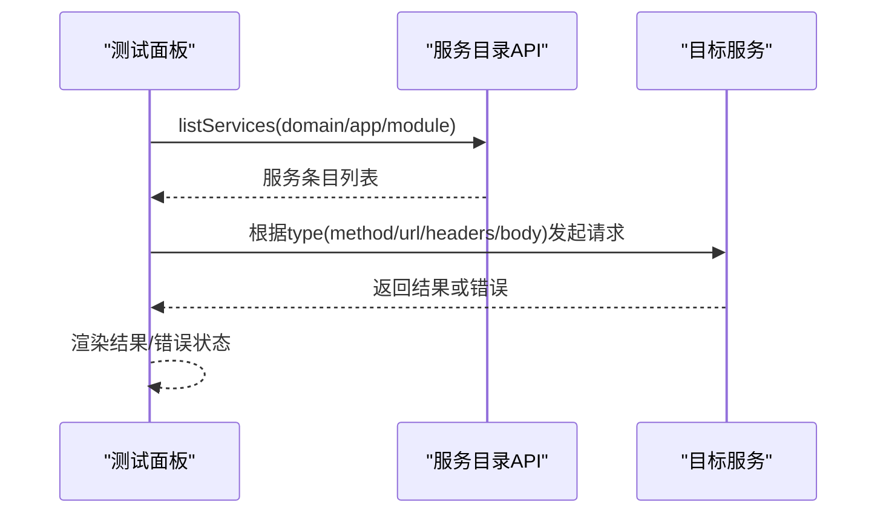
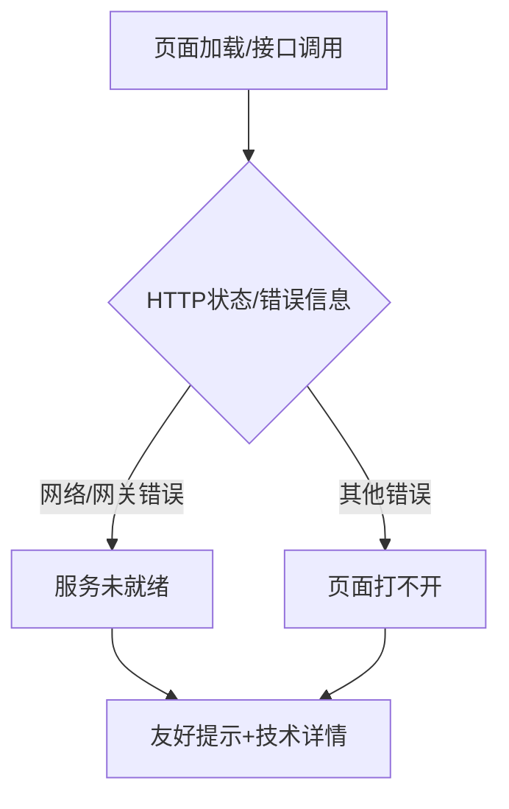
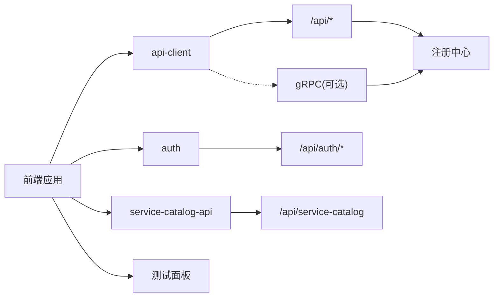

# 服务管理

<cite>
**本文引用的文件**
- [CMXHTMLDesigner/src/lib/api-client.js](file://CMXHTMLDesigner/src/lib/api-client.js)
- [CMXPortalManager/src/lib/api-client.js](file://CMXPortalManager/src/lib/api-client.js)
- [CMXHTMLDesigner/src/lib/auth.js](file://CMXHTMLDesigner/src/lib/auth.js)
- [CMXPortalManager/src/lib/auth.js](file://CMXPortalManager/src/lib/auth.js)
- [CMXHTMLDesigner/src/api/service-catalog-api.js](file://CMXHTMLDesigner/src/api/service-catalog-api.js)
- [CMXHTMLDesigner/src/components/designer-page-data/page-data-panel-test.js](file://CMXHTMLDesigner/src/components/designer-page-data/page-data-panel-test.js)
- [documents/20260822_cmx-后端_三类服务通信配置关系总结.md](file://documents/20260822_cmx-后端_三类服务通信配置关系总结.md)
- [packages/cmx-data-comp/src/lib/__tests__/cmx-dict-cache.test.js](file://packages/cmx-data-comp/src/lib/__tests__/cmx-dict-cache.test.js)
- [CMXPortalManager/src/lib/workspace-native-pages.js](file://CMXPortalManager/src/lib/workspace-native-pages.js)
</cite>

## 目录
1. [简介](#简介)
2. [项目结构](#项目结构)
3. [核心组件](#核心组件)
4. [架构总览](#架构总览)
5. [详细组件分析](#详细组件分析)
6. [依赖关系分析](#依赖关系分析)
7. [性能考虑](#性能考虑)
8. [故障排查指南](#故障排查指南)
9. [结论](#结论)
10. [附录](#附录)

## 简介
本集成文档面向“服务管理系统”，聚焦以下目标：
- RESTful API 的配置、请求参数封装与响应数据处理
- RPC 接口的调用方式、方法注册与参数序列化
- 服务目录的注册机制、接口发现与服务发现
- 请求拦截器的实现、认证令牌注入与错误重试机制
- 响应转换器的配置、数据格式化与业务逻辑处理
- Mock 服务的搭建、测试数据生成与接口模拟
- 服务监控、性能分析与故障诊断的工具使用指南

## 项目结构
本项目包含两个前端应用（设计器与门户）以及后端通信与配置说明文档。关键位置如下：
- 统一 API 客户端与全局 fetch 拦截器：分别在 CMXHTMLDesigner 与 CMXPortalManager 中提供，负责令牌注入、信封解包、401 跳转等
- 认证模块：封装登录、登出、当前用户获取与鉴权守卫
- 服务目录 API：为设计器提供按域/应用/模块过滤的服务条目列表
- 页面数据测试面板：支持对 REST/JSON-RPC/GraphQL 进行在线调试与模拟
- 后端通信配置文档：描述注册中心、[rpc]、[center_client] 三者的职责与依赖



**图表来源**
- [CMXHTMLDesigner/src/lib/api-client.js:167-245](file://CMXHTMLDesigner/src/lib/api-client.js#L167-L245)
- [CMXPortalManager/src/lib/api-client.js:175-258](file://CMXPortalManager/src/lib/api-client.js#L175-L258)
- [CMXHTMLDesigner/src/api/service-catalog-api.js:1-46](file://CMXHTMLDesigner/src/api/service-catalog-api.js#L1-L46)
- [CMXHTMLDesigner/src/components/designer-page-data/page-data-panel-test.js:93-142](file://CMXHTMLDesigner/src/components/designer-page-data/page-data-panel-test.js#L93-L142)
- [documents/20260822_cmx-后端_三类服务通信配置关系总结.md:6-73](file://documents/20260822_cmx-后端_三类服务通信配置关系总结.md#L6-L73)

**章节来源**
- [CMXHTMLDesigner/src/lib/api-client.js:1-245](file://CMXHTMLDesigner/src/lib/api-client.js#L1-L245)
- [CMXPortalManager/src/lib/api-client.js:1-259](file://CMXPortalManager/src/lib/api-client.js#L1-L259)
- [CMXHTMLDesigner/src/api/service-catalog-api.js:1-46](file://CMXHTMLDesigner/src/api/service-catalog-api.js#L1-L46)
- [documents/20260822_cmx-后端_三类服务通信配置关系总结.md:6-73](file://documents/20260822_cmx-后端_三类服务通信配置关系总结.md#L6-L73)

## 核心组件
- 统一 API 客户端：提供 apiFetch/apiGet/apiPost/apiDelete，自动设置 Accept/Content-Type、注入 Authorization、解析 ApiResp 信封、处理 401 并跳转登录
- 全局 fetch 拦截器：拦截同源 /api/* 请求，自动注入令牌、重写跨域基础地址、透明拆信封、将业务错误映射为非 2xx 响应体
- 认证助手：封装 /api/auth/* 的登录、登出、当前用户查询、鉴权守卫；门户版在登录后同步用户身份到本地存储
- 服务目录 API：提供按 domain/app/module 过滤的服务条目列表与单个服务定义查询
- 页面数据测试面板：支持 REST/JSON-RPC/GraphQL 的在线调试，构造请求体或查询参数，展示结果与错误

**章节来源**
- [CMXHTMLDesigner/src/lib/api-client.js:75-158](file://CMXHTMLDesigner/src/lib/api-client.js#L75-L158)
- [CMXPortalManager/src/lib/api-client.js:83-166](file://CMXPortalManager/src/lib/api-client.js#L83-L166)
- [CMXHTMLDesigner/src/lib/auth.js:1-100](file://CMXHTMLDesigner/src/lib/auth.js#L1-L100)
- [CMXPortalManager/src/lib/auth.js:1-121](file://CMXPortalManager/src/lib/auth.js#L1-L121)
- [CMXHTMLDesigner/src/api/service-catalog-api.js:1-46](file://CMXHTMLDesigner/src/api/service-catalog-api.js#L1-L46)
- [CMXHTMLDesigner/src/components/designer-page-data/page-data-panel-test.js:33-142](file://CMXHTMLDesigner/src/components/designer-page-data/page-data-panel-test.js#L33-L142)

## 架构总览
系统采用“前端统一客户端 + 后端统一信封”的架构：
- 前端通过 apiFetch 或全局拦截器发起 /api/* 请求
- 后端返回统一信封 { code, msg, data }，code=0 表示成功
- 前端自动解包信封，业务错误抛出 Error，401 触发清 token 并跳转登录
- 对于非 JSON（SSE/下载/二进制），拦截器原样透传
- 服务间通信通过 gRPC（由 [rpc] 配置启用）与 HTTP（由 [center_client] 配置拨号规则），均依赖注册中心进行实例发现与缓存



**图表来源**
- [CMXHTMLDesigner/src/lib/api-client.js:167-245](file://CMXHTMLDesigner/src/lib/api-client.js#L167-L245)
- [CMXPortalManager/src/lib/api-client.js:175-258](file://CMXPortalManager/src/lib/api-client.js#L175-L258)
- [CMXHTMLDesigner/src/lib/auth.js:33-50](file://CMXHTMLDesigner/src/lib/auth.js#L33-L50)
- [CMXPortalManager/src/lib/auth.js:33-51](file://CMXPortalManager/src/lib/auth.js#L33-L51)
- [documents/20260822_cmx-后端_三类服务通信配置关系总结.md:39-73](file://documents/20260822_cmx-后端_三类服务通信配置关系总结.md#L39-L73)

## 详细组件分析

### RESTful API 配置与请求封装
- 基础地址重写：当配置了 VITE_API_BASE 时，所有相对路径 /api/* 会被改写为绝对地址，便于前后端不同源部署
- 请求头自动设置：Accept 默认 application/json；当存在 body 且未显式指定 Content-Type 时自动设置为 application/json（FormData 除外）
- 令牌注入：优先从 localStorage 读取 access token，并在非 /api/auth/* 的请求中注入 Authorization: Bearer <token>
- 信封解包：成功时直接返回 data；失败时根据 code 映射为非 2xx 响应体，使 res.ok=false 且消费者可读错误文案
- 原始响应模式：rawResponse=true 时返回原始 Response，用于下载/二进制场景



**图表来源**
- [CMXHTMLDesigner/src/lib/api-client.js:75-158](file://CMXHTMLDesigner/src/lib/api-client.js#L75-L158)
- [CMXPortalManager/src/lib/api-client.js:83-166](file://CMXPortalManager/src/lib/api-client.js#L83-L166)

**章节来源**
- [CMXHTMLDesigner/src/lib/api-client.js:25-36](file://CMXHTMLDesigner/src/lib/api-client.js#L25-L36)
- [CMXHTMLDesigner/src/lib/api-client.js:75-158](file://CMXHTMLDesigner/src/lib/api-client.js#L75-L158)
- [CMXPortalManager/src/lib/api-client.js:25-36](file://CMXPortalManager/src/lib/api-client.js#L25-L36)
- [CMXPortalManager/src/lib/api-client.js:83-166](file://CMXPortalManager/src/lib/api-client.js#L83-L166)

### 全局请求拦截器与认证令牌注入
- 拦截范围：仅对同源 /api/* 生效，避免误改第三方请求
- 跨域重写：若配置了 API_BASE，则把相对 /api/* 改写为绝对地址
- 令牌注入：读取本地 token，在非认证端点且未显式设置 Authorization 时注入
- 401 处理：清除本地 token 并跳转到登录页（防回环保护）
- 信封透明拆包：对 JSON 响应进行信封解包，业务错误映射为非 2xx 响应体，保留 msg/code/data（含 violations）以便前端高亮与展开



**图表来源**
- [CMXHTMLDesigner/src/lib/api-client.js:167-245](file://CMXHTMLDesigner/src/lib/api-client.js#L167-L245)
- [CMXPortalManager/src/lib/api-client.js:175-258](file://CMXPortalManager/src/lib/api-client.js#L175-L258)

**章节来源**
- [CMXHTMLDesigner/src/lib/api-client.js:167-245](file://CMXHTMLDesigner/src/lib/api-client.js#L167-L245)
- [CMXPortalManager/src/lib/api-client.js:175-258](file://CMXPortalManager/src/lib/api-client.js#L175-L258)

### 认证流程与用户身份同步
- 登录：POST /api/auth/login，成功后写入 access_token 与 refresh_token
- 登出：POST /api/auth/logout，即使后端失败也清理本地 token
- 当前用户：GET /api/auth/me，未登录或失效返回 null
- 鉴权守卫：requireAuthOrRedirect 在未登录时跳转登录页
- 门户增强：登录后异步同步 cmx_user_id 与 cmx_username 到本地存储，供待办中心等按人过滤的场景使用



**图表来源**
- [CMXHTMLDesigner/src/lib/auth.js:33-50](file://CMXHTMLDesigner/src/lib/auth.js#L33-L50)
- [CMXPortalManager/src/lib/auth.js:33-64](file://CMXPortalManager/src/lib/auth.js#L33-L64)

**章节来源**
- [CMXHTMLDesigner/src/lib/auth.js:1-100](file://CMXHTMLDesigner/src/lib/auth.js#L1-L100)
- [CMXPortalManager/src/lib/auth.js:1-121](file://CMXPortalManager/src/lib/auth.js#L1-L121)

### 服务目录注册与接口发现
- 服务目录 API：GET /api/service-catalog?domain=&app=&module= 返回服务条目列表；GET /api/service-catalog/:id 获取单个服务定义
- 设计器使用：服务面板可从目录选择服务，支持预览 URL、方法、头部、请求体模板与参数
- 服务发现（后端）：通过注册中心维护实例缓存，支持按权重选例与预热订阅，消除冷启动延迟

```mermaid
flowchart TD
Dev["设计器服务面板"] --> List["listServices(domain/app/module)"]
List --> Catalog["/api/service-catalog"]
Catalog --> Items["服务条目列表"]
Dev --> Detail["getServiceById(id)"]
Detail --> Catalog
Catalog --> Item["单个服务定义"]
Note over Catalog: 后端通过注册中心维护实例与发现
```

**图表来源**
- [CMXHTMLDesigner/src/api/service-catalog-api.js:1-46](file://CMXHTMLDesigner/src/api/service-catalog-api.js#L1-L46)
- [documents/20260822_cmx-后端_三类服务通信配置关系总结.md:64-73](file://documents/20260822_cmx-后端_三类服务通信配置关系总结.md#L64-L73)

**章节来源**
- [CMXHTMLDesigner/src/api/service-catalog-api.js:1-46](file://CMXHTMLDesigner/src/api/service-catalog-api.js#L1-L46)
- [documents/20260822_cmx-后端_三类服务通信配置关系总结.md:6-73](file://documents/20260822_cmx-后端_三类服务通信配置关系总结.md#L6-L73)

### RPC 接口调用、方法注册与参数序列化
- 调用方式：通过 [center_client] 的 services.{key} 配置键，transport=grpc 时走 gRPC 通道；url 静态直连时走 HTTP
- 方法注册：后端以 gRPC 暴露服务，需启用 [rpc] enabled=true 并监听 grpc.port；被调用的进程需在注册中心广播端口与元数据
- 参数序列化：JSON-RPC/GraphQL 在测试面板中按约定格式封装；gRPC 调用由底层客户端完成序列化
- 服务发现：gRPC 客户端经注册中心解析目标实例，支持 group/clusters 过滤与加权随机选例



**图表来源**
- [documents/20260822_cmx-后端_三类服务通信配置关系总结.md:39-73](file://documents/20260822_cmx-后端_三类服务通信配置关系总结.md#L39-L73)

**章节来源**
- [documents/20260822_cmx-后端_三类服务通信配置关系总结.md:39-73](file://documents/20260822_cmx-后端_三类服务通信配置关系总结.md#L39-L73)

### 响应转换器与数据格式化
- 信封解包：统一将 {code,msg,data} 转换为裸 data 或错误对象，保持 res.ok 语义一致
- 错误增强：业务错误保留 msg/code/data，必要时提取 violations 数组用于前端逐行高亮
- 非 JSON 透传：SSE/下载/二进制响应不被解包，直接返回给消费者
- 字典缓存：HTTP 失败或信封 code≠0 时不写缓存，下次重试；成功后再写入，避免脏数据



**图表来源**
- [CMXHTMLDesigner/src/lib/api-client.js:217-245](file://CMXHTMLDesigner/src/lib/api-client.js#L217-L245)
- [CMXPortalManager/src/lib/api-client.js:224-258](file://CMXPortalManager/src/lib/api-client.js#L224-L258)
- [packages/cmx-data-comp/src/lib/__tests__/cmx-dict-cache.test.js:131-160](file://packages/cmx-data-comp/src/lib/__tests__/cmx-dict-cache.test.js#L131-L160)

**章节来源**
- [CMXHTMLDesigner/src/lib/api-client.js:217-245](file://CMXHTMLDesigner/src/lib/api-client.js#L217-L245)
- [CMXPortalManager/src/lib/api-client.js:224-258](file://CMXPortalManager/src/lib/api-client.js#L224-L258)
- [packages/cmx-data-comp/src/lib/__tests__/cmx-dict-cache.test.js:131-160](file://packages/cmx-data-comp/src/lib/__tests__/cmx-dict-cache.test.js#L131-L160)

### Mock 服务搭建、测试数据生成与接口模拟
- 设计器内置测试面板：支持 REST/JSON-RPC/GraphQL 三种类型，可配置 headers/bodyTemplate/query 等，运行后显示结果或错误
- 服务目录选择：通过 service-catalog-api 拉取服务条目，作为 Mock 目标
- 测试数据：可在面板中以 JSON 形式输入参数，组合成请求体或查询参数
- WebSocket 限制：当前不支持 WebSocket 类型的在线测试



**图表来源**
- [CMXHTMLDesigner/src/components/designer-page-data/page-data-panel-test.js:93-142](file://CMXHTMLDesigner/src/components/designer-page-data/page-data-panel-test.js#L93-L142)
- [CMXHTMLDesigner/src/api/service-catalog-api.js:21-46](file://CMXHTMLDesigner/src/api/service-catalog-api.js#L21-L46)

**章节来源**
- [CMXHTMLDesigner/src/components/designer-page-data/page-data-panel-test.js:33-142](file://CMXHTMLDesigner/src/components/designer-page-data/page-data-panel-test.js#L33-L142)
- [CMXHTMLDesigner/src/api/service-catalog-api.js:1-46](file://CMXHTMLDesigner/src/api/service-catalog-api.js#L1-L46)

### 服务监控、性能分析与故障诊断
- 错误空状态：当微服务不可达或网关错误时，统一归类为“服务未就绪”，给出友好提示与技术详情折叠
- 常见错误匹配：不可达/未配置/连接拒绝/超时/502/503/504 等网络与网关错误
- 建议工具：结合浏览器开发者工具观察请求/响应、拦截器行为；利用 SSE 流式接口查看执行进度与日志



**图表来源**
- [CMXPortalManager/src/lib/workspace-native-pages.js:249-266](file://CMXPortalManager/src/lib/workspace-native-pages.js#L249-L266)

**章节来源**
- [CMXPortalManager/src/lib/workspace-native-pages.js:249-266](file://CMXPortalManager/src/lib/workspace-native-pages.js#L249-L266)

## 依赖关系分析
- 前端依赖：
  - api-client.js 提供统一的请求与信封处理
  - auth.js 提供认证与鉴权能力
  - service-catalog-api.js 提供目录查询能力
  - page-data-panel-test.js 提供在线调试能力
- 后端依赖：
  - [rpc] 启用 gRPC 服务端/客户端设施
  - [center_client] 管理服务间调用与反代拨号规则
  - 注册中心（Nacos）提供实例缓存与远程配置



**图表来源**
- [CMXHTMLDesigner/src/lib/api-client.js:167-245](file://CMXHTMLDesigner/src/lib/api-client.js#L167-L245)
- [CMXPortalManager/src/lib/api-client.js:175-258](file://CMXPortalManager/src/lib/api-client.js#L175-L258)
- [documents/20260822_cmx-后端_三类服务通信配置关系总结.md:39-73](file://documents/20260822_cmx-后端_三类服务通信配置关系总结.md#L39-L73)

**章节来源**
- [CMXHTMLDesigner/src/lib/api-client.js:167-245](file://CMXHTMLDesigner/src/lib/api-client.js#L167-L245)
- [CMXPortalManager/src/lib/api-client.js:175-258](file://CMXPortalManager/src/lib/api-client.js#L175-L258)
- [documents/20260822_cmx-后端_三类服务通信配置关系总结.md:39-73](file://documents/20260822_cmx-后端_三类服务通信配置关系总结.md#L39-L73)

## 性能考虑
- 信封解包仅在 JSON 响应上进行，非 JSON 原样透传，减少不必要的解析开销
- 字典缓存失败不写缓存，避免脏数据影响后续装载；成功再写入，提升命中率
- gRPC 客户端与服务端通过注册中心预热订阅，降低首次调用冷启动延迟
- 跨域重写仅在配置 API_BASE 时生效，避免无谓的 URL 拼接

[本节为通用指导，无需特定文件引用]

## 故障排查指南
- 401 未授权：检查是否已登录、token 是否过期；确认拦截器是否正确注入 Authorization
- 业务错误：查看信封中的 msg 与 code；若包含 violations，可在前端逐行高亮
- 服务不可达：识别网络/网关错误，统一归为“服务未就绪”，查看技术详情定位根因
- 字典加载失败：确认 HTTP 响应与信封 code；失败不写缓存，重试后可恢复

**章节来源**
- [CMXHTMLDesigner/src/lib/api-client.js:217-245](file://CMXHTMLDesigner/src/lib/api-client.js#L217-L245)
- [CMXPortalManager/src/lib/api-client.js:224-258](file://CMXPortalManager/src/lib/api-client.js#L224-L258)
- [packages/cmx-data-comp/src/lib/__tests__/cmx-dict-cache.test.js:131-160](file://packages/cmx-data-comp/src/lib/__tests__/cmx-dict-cache.test.js#L131-L160)
- [CMXPortalManager/src/lib/workspace-native-pages.js:249-266](file://CMXPortalManager/src/lib/workspace-native-pages.js#L249-L266)

## 结论
本系统集成通过统一的前端 API 客户端与后端信封协议，实现了稳定的认证、请求拦截、响应转换与服务发现。配合设计器的在线测试面板与服务目录能力，开发者可快速对接 REST/JSON-RPC/GraphQL 与 gRPC 服务。注册中心与 [rpc]/[center_client] 配置共同保障了服务间的可靠通信与高性能。

[本节为总结性内容，无需特定文件引用]

## 附录
- 环境变量与配置项：
  - VITE_API_BASE：前后端不同源时的 API 基础地址重写
  - BASE_URL：应用托管基路径，影响登录页跳转
  - NACOS_* 与 SERVICE_REGISTRY_*：注册中心与配置中心开关与连接信息
  - [rpc] 与 [center_client]：gRPC 设施与服务间拨号规则

[本节为补充信息，无需特定文件引用]