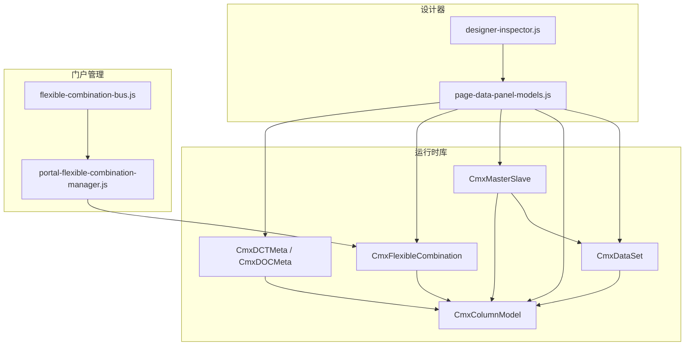
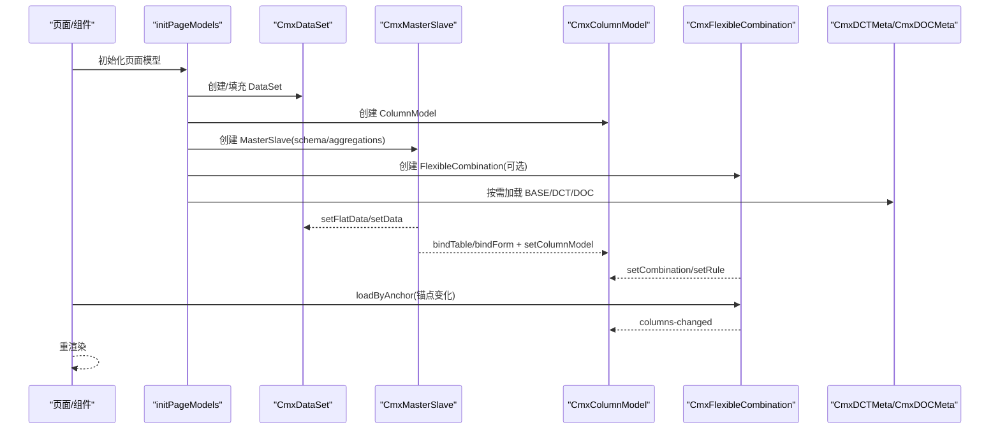
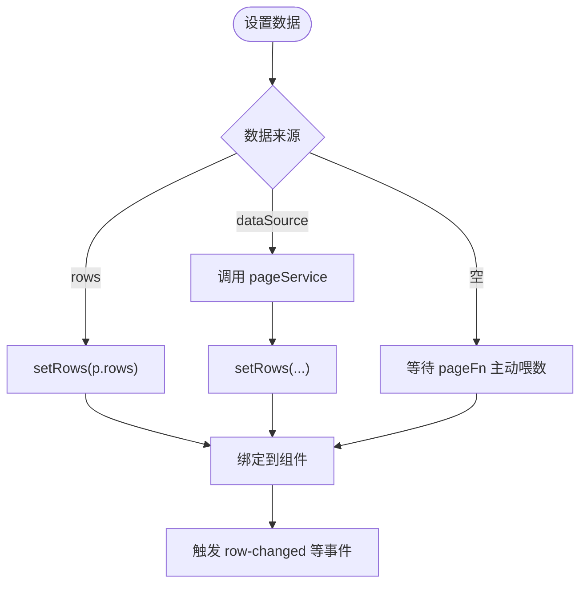
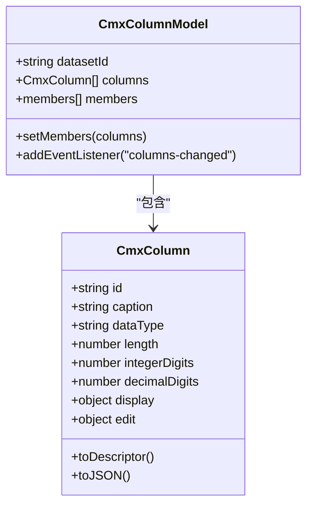
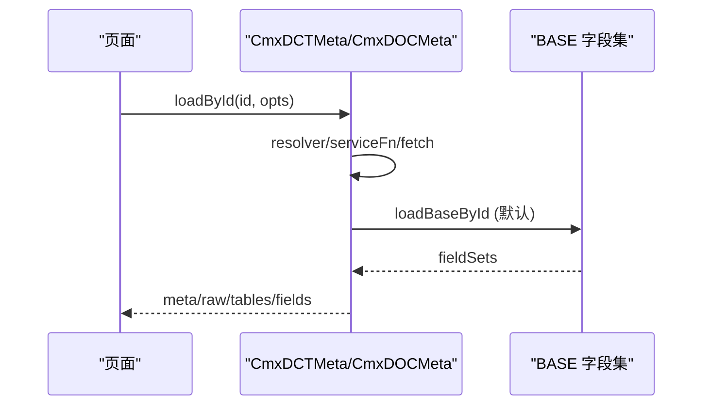
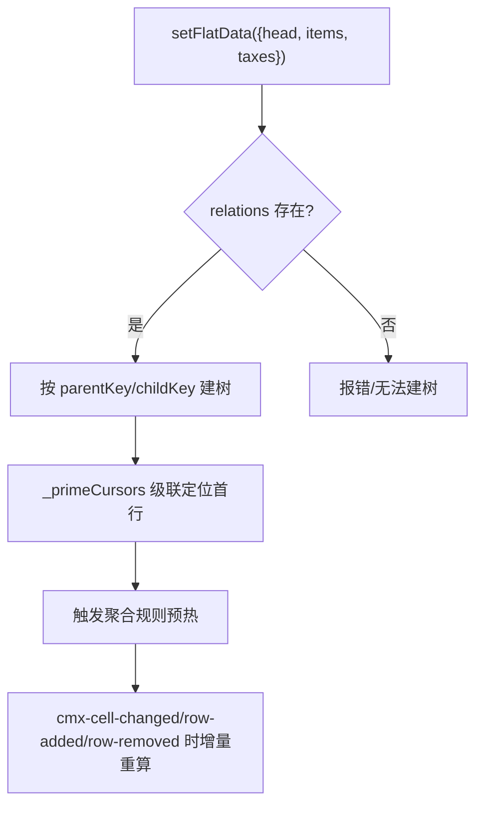
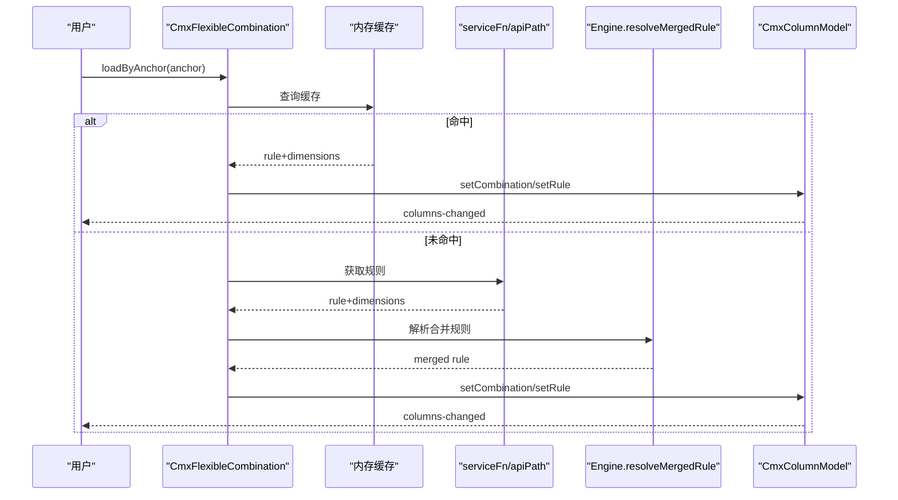
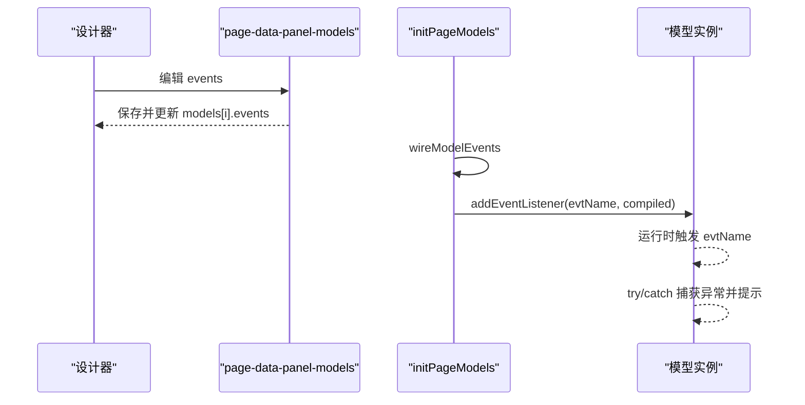
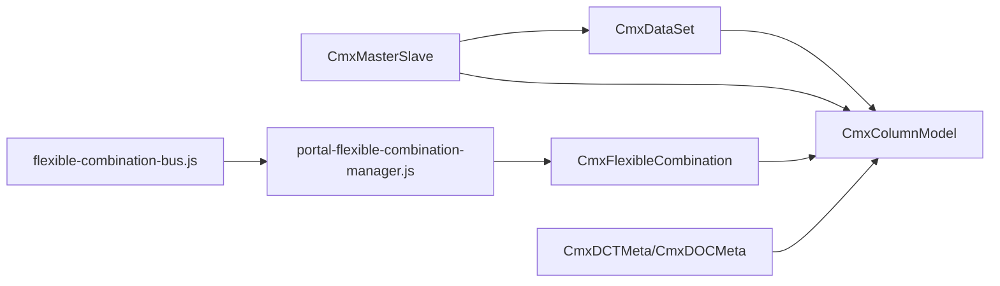

# 模型管理

<cite>
**本文引用的文件**
- [packages/cmx-data-comp/src/lib/cmx-data-set.js](file://packages/cmx-data-comp/src/lib/cmx-data-set.js)
- [packages/cmx-data-comp/src/lib/cmx-column-model.js](file://packages/cmx-data-comp/src/lib/cmx-column-model.js)
- [packages/cmx-data-comp/src/lib/cmx-master-slave.js](file://packages/cmx-data-comp/src/lib/cmx-master-slave.js)
- [packages/cmx-data-comp/src/lib/cmx-flexible-combination.js](file://packages/cmx-data-comp/src/lib/cmx-flexible-combination.js)
- [packages/cmx-data-comp/src/lib/cmx-dct-meta.js](file://packages/cmx-data-comp/src/lib/cmx-dct-meta.js)
- [packages/cmx-data-comp/src/lib/init-page-models.js](file://packages/cmx-data-comp/src/lib/init-page-models.js)
- [CMXHTMLDesigner/src/components/designer-page-data/page-data-panel-models.js](file://CMXHTMLDesigner/src/components/designer-page-data/page-data-panel-models.js)
- [CMXHTMLDesigner/src/components/designer-inspector.js](file://CMXHTMLDesigner/src/components/designer-inspector.js)
- [CMXPortalManager/src/components/portal-flexible-combination-manager.js](file://CMXPortalManager/src/components/portal-flexible-combination-manager.js)
- [CMXPortalManager/src/lib/flexible-combination-bus.js](file://CMXPortalManager/src/lib/flexible-combination-bus.js)
- [.agents/skills/html-page-generator/references/model-dataset.md](file://.agents/skills/html-page-generator/references/model-dataset.md)
- [.agents/skills/html-page-generator/references/model-column-model.md](file://.agents/skills/html-page-generator/references/model-column-model.md)
- [.agents/skills/html-page-generator/references/model-dct-doc-meta.md](file://.agents/skills/html-page-generator/references/model-dct-doc-meta.md)
- [.agents/skills/html-page-generator/references/model-master-slave.md](file://.agents/skills/html-page-generator/references/model-master-slave.md)
- [.agents/skills/html-page-generator/references/model-flexible-combination.md](file://.agents/skills/html-page-generator/references/model-flexible-combination.md)
</cite>

## 目录
1. [简介](#简介)
2. [项目结构](#项目结构)
3. [核心组件](#核心组件)
4. [架构总览](#架构总览)
5. [详细组件分析](#详细组件分析)
6. [依赖关系分析](#依赖关系分析)
7. [性能考量](#性能考量)
8. [故障排查指南](#故障排查指南)
9. [结论](#结论)
10. [附录](#附录)

## 简介
本技术文档面向“模型管理系统”，围绕以下能力展开：数据集（DataSet）配置与字段映射、列模型（ColumnModel）定义与显示格式、元数据（Meta）加载与版本管理、主从协调器（MasterSlave）的关系与同步、弹性组合（FlexibleCombination）的动态布局与缓存、模型事件处理流程与错误恢复，并给出完整配置示例、调试方法与常见问题解决方案。目标是帮助开发者快速理解并正确配置各模型，同时提供可操作的排障路径。

## 项目结构
仓库中与模型体系相关的核心代码集中在 cmx-data-comp 包，设计器与门户侧提供配置编辑与管理界面；SKILL 参考文档提供了字段规范与最佳实践。

图表来源
- [packages/cmx-data-comp/src/lib/cmx-data-set.js](file://packages/cmx-data-comp/src/lib/cmx-data-set.js)
- [packages/cmx-data-comp/src/lib/cmx-column-model.js](file://packages/cmx-data-comp/src/lib/cmx-column-model.js)
- [packages/cmx-data-comp/src/lib/cmx-master-slave.js](file://packages/cmx-data-comp/src/lib/cmx-master-slave.js)
- [packages/cmx-data-comp/src/lib/cmx-flexible-combination.js](file://packages/cmx-data-comp/src/lib/cmx-flexible-combination.js)
- [packages/cmx-data-comp/src/lib/cmx-dct-meta.js](file://packages/cmx-data-comp/src/lib/cmx-dct-meta.js)
- [CMXHTMLDesigner/src/components/designer-page-data/page-data-panel-models.js](file://CMXHTMLDesigner/src/components/designer-page-data/page-data-panel-models.js)
- [CMXHTMLDesigner/src/components/designer-inspector.js](file://CMXHTMLDesigner/src/components/designer-inspector.js)
- [CMXPortalManager/src/components/portal-flexible-combination-manager.js](file://CMXPortalManager/src/components/portal-flexible-combination-manager.js)
- [CMXPortalManager/src/lib/flexible-combination-bus.js](file://CMXPortalManager/src/lib/flexible-combination-bus.js)

章节来源
- [.agents/skills/html-page-generator/references/model-dataset.md:1-241](file://.agents/skills/html-page-generator/references/model-dataset.md#L1-L241)
- [.agents/skills/html-page-generator/references/model-column-model.md:38-123](file://.agents/skills/html-page-generator/references/model-column-model.md#L38-L123)
- [.agents/skills/html-page-generator/references/model-dct-doc-meta.md:1-351](file://.agents/skills/html-page-generator/references/model-dct-doc-meta.md#L1-L351)
- [.agents/skills/html-page-generator/references/model-master-slave.md:1-414](file://.agents/skills/html-page-generator/references/model-master-slave.md#L1-L414)
- [.agents/skills/html-page-generator/references/model-flexible-combination.md:1-547](file://.agents/skills/html-page-generator/references/model-flexible-combination.md#L1-L547)

## 核心组件
- 数据集（CmxDataSet）：树形数据容器，支持父子子集、行增删改、事件派发与可视绑定。
- 列模型（CmxColumnModel）：描述列的展示/编辑/校验/聚合等元信息，驱动表格/表单渲染。
- 元数据（CmxDCTMeta/CmxDOCMeta/BASE）：加载字典/单据/共享字段集，提供字段定义给其它模型。
- 主从协调器（CmxMasterSlave）：维护递归主从数据树、视图联动、选中行传播与自动聚合。
- 弹性组合（CmxFlexibleCombination）：按锚点维度动态生成列模型，支持缓存、多规则合并与回退。

章节来源
- [packages/cmx-data-comp/src/lib/cmx-data-set.js](file://packages/cmx-data-comp/src/lib/cmx-data-set.js)
- [packages/cmx-data-comp/src/lib/cmx-column-model.js](file://packages/cmx-data-comp/src/lib/cmx-column-model.js)
- [packages/cmx-data-comp/src/lib/cmx-dct-meta.js](file://packages/cmx-data-comp/src/lib/cmx-dct-meta.js)
- [packages/cmx-data-comp/src/lib/cmx-master-slave.js](file://packages/cmx-data-comp/src/lib/cmx-master-slave.js)
- [packages/cmx-data-comp/src/lib/cmx-flexible-combination.js](file://packages/cmx-data-comp/src/lib/cmx-flexible-combination.js)

## 架构总览
模型系统以“元数据 → 列模型 → 数据集 → 视图”为主线，主从协调器负责多层级数据联动与聚合，弹性组合根据上下文动态改写列模型。

图表来源
- [packages/cmx-data-comp/src/lib/init-page-models.js](file://packages/cmx-data-comp/src/lib/init-page-models.js)
- [packages/cmx-data-comp/src/lib/cmx-master-slave.js](file://packages/cmx-data-comp/src/lib/cmx-master-slave.js)
- [packages/cmx-data-comp/src/lib/cmx-flexible-combination.js](file://packages/cmx-data-comp/src/lib/cmx-flexible-combination.js)
- [packages/cmx-data-comp/src/lib/cmx-dct-meta.js](file://packages/cmx-data-comp/src/lib/cmx-dct-meta.js)

## 详细组件分析

### 数据集（CmxDataSet）
- 配置要点
  - dataSource：数据来源（pageService 名），配合 dataSourceEvent 控制调用时机。
  - children：声明子数据集，形成树形结构。
  - rows：初始静态数据（测试/演示）。
- 字段映射与类型转换
  - 列模型通过 datasetId 关联 DataSet，列 id 对应数据行属性 key。
  - 数据类型由列模型的 dataType 决定，显示/编辑行为由 display/edit 配置控制。
- 事件
  - ds-row-added、ds-row-removed、cursor-changed、row-changed 等，可在 pageFn 中监听。
- 可视化绑定
  - 纯 DataSet 模式：data-cmx-dataset-id 直接绑定到组件。
  - 主从模式：通过 MS 的路径绑定，不在 DOM 上重复绑 datasetId。

图表来源
- [.agents/skills/html-page-generator/references/model-dataset.md:1-241](file://.agents/skills/html-page-generator/references/model-dataset.md#L1-L241)
- [packages/cmx-data-comp/src/lib/cmx-data-set.js](file://packages/cmx-data-comp/src/lib/cmx-data-set.js)

章节来源
- [.agents/skills/html-page-generator/references/model-dataset.md:1-241](file://.agents/skills/html-page-generator/references/model-dataset.md#L1-L241)
- [packages/cmx-data-comp/src/lib/cmx-data-set.js](file://packages/cmx-data-comp/src/lib/cmx-data-set.js)

### 列模型（CmxColumnModel）
- 定义方式
  - datasetId：关联目标 DataSet（单层表名）。
  - columns/columnGroups：列与列组定义数组。
  - members：运行时成员集合（可由弹性组合改写）。
- 字段映射机制
  - 列 id 即数据行字段 key；caption 为显示标题（支持多语言对象）。
  - dataType 枚举：VARCHAR/TEXT/BIGINT/INT/NUMBER/DECIMAL/DATE/DATETIME/TIMESTAMP/BOOLEAN/JSON。
- 验证与显示格式
  - edit.mode：录入控件模式（如 cmx-number-input、cmx-dict-select、readonly 等）。
  - display.mode/format：数值格式化（thousands/percent/currency）、日期时间格式、负数红字、千分位、零值空白等。
  - validate/requiredWhen/readonlyWhen：条件必填/只读与校验表达式。
- 序列化与适配器
  - toDescriptor/toJSON：适配不同渲染层，剥离函数或保留函数用于运行时。

图表来源
- [packages/cmx-data-comp/src/lib/cmx-column-model.js](file://packages/cmx-data-comp/src/lib/cmx-column-model.js)
- [packages/cmx-data-comp/src/lib/cmx-column.js](file://packages/cmx-data-comp/src/lib/cmx-column.js)

章节来源
- [.agents/skills/html-page-generator/references/model-column-model.md:38-123](file://.agents/skills/html-page-generator/references/model-column-model.md#L38-L123)
- [packages/cmx-data-comp/src/lib/cmx-column-model.js](file://packages/cmx-data-comp/src/lib/cmx-column-model.js)
- [packages/cmx-data-comp/src/lib/cmx-column.js](file://packages/cmx-data-comp/src/lib/cmx-column.js)

### 元数据（Meta）加载、缓存与版本管理
- 加载优先级
  - resolver/baseResolver（最高优先）→ serviceFn/baseServiceFn → 默认 fetch(apiPath/baseApiPath)。
- 批量加载与基础字段集
  - loadMetaBatch 一次拉取多个 DCT/DOC 及共享 BASE 字段集，自动去重 base。
  - loadById 默认继续 loadBaseById 合并 BASE；可通过 options.loadBase=false 关闭。
- 版本管理
  - id 归一为 stem（去除 .json 与 _vN 后缀），后端按 moduleCode 反查默认/最新版本。
  - BASE 反查强制清空 application/app，避免误用主元数据坐标。
- 常用 API
  - listTables/getTable/listFieldSets/getFieldSet/listFields/getField。
  - DCT 专用 getDictionary/listDictionaries；DOC 专用 getDocument/listDocuments。

图表来源
- [packages/cmx-data-comp/src/lib/cmx-dct-meta.js](file://packages/cmx-data-comp/src/lib/cmx-dct-meta.js)
- [.agents/skills/html-page-generator/references/model-dct-doc-meta.md:60-86](file://.agents/skills/html-page-generator/references/model-dct-doc-meta.md#L60-L86)

章节来源
- [.agents/skills/html-page-generator/references/model-dct-doc-meta.md:1-351](file://.agents/skills/html-page-generator/references/model-dct-doc-meta.md#L1-L351)
- [packages/cmx-data-comp/src/lib/cmx-dct-meta.js](file://packages/cmx-data-comp/src/lib/cmx-dct-meta.js)

### 主从协调器（CmxMasterSlave）
- 配置要点
  - schema：路径树，定义表与父子关系（id 唯一，path 用点分隔完整路径）。
  - aggregations：聚合规则（from/agg/field/to/toField/scope），监听 cell/row 变更自动汇总。
  - relations：平铺数据的主外键关系（放在 dataFlow.relations），供 setFlatData 建树。
- 数据装载
  - setFlatData：推荐，传入平铺对象 + relations，自动建树并级联定位首行。
  - setData：复杂场景，自行构造 CmxDataSet 并注入 tables。
- 视图绑定
  - DOM 声明式：data-cmx-master-slave-id、data-cmx-dataset-id（完整路径）、data-cmx-kind（single/list）、data-cmx-model-id。
  - 命令式：bindForm/bindTable + setColumnModel。
- 事件
  - change/select/aggregate，可用于日志或联动逻辑。

图表来源
- [.agents/skills/html-page-generator/references/model-master-slave.md:147-177](file://.agents/skills/html-page-generator/references/model-master-slave.md#L147-L177)
- [.agents/skills/html-page-generator/references/model-master-slave.md:231-268](file://.agents/skills/html-page-generator/references/model-master-slave.md#L231-L268)

章节来源
- [.agents/skills/html-page-generator/references/model-master-slave.md:1-414](file://.agents/skills/html-page-generator/references/model-master-slave.md#L1-L414)
- [packages/cmx-data-comp/src/lib/cmx-master-slave.js](file://packages/cmx-data-comp/src/lib/cmx-master-slave.js)

### 弹性组合（FlexibleCombination）
- 实现原理
  - 按 anchorValues 计算缓存键，命中则直接应用；否则请求 serviceFn/apiPath 或读取 inlineData。
  - 使用引擎 resolveMergedRule 合并多规则（评分、层级泛化 $under、__path 祖先链）。
  - 将生成的 CmxColumn 数组写入目标 columnModel.setMembers，触发 columns-changed 重渲染。
- 动态布局算法
  - 匹配评分：精确 match=3、$in/$under=1.5、属性条件≈1、兜底=0、不符=-1；最终 specificity = score*100 + 锚点维度数。
  - 字段合并：同名字段高分胜出，同分顺序靠前者；全部不命中返回 null（最小列集/回退）。
- 缓存策略
  - 内存缓存按锚点签名存储；clear 清空缓存并还原初始列；invalidateCache 可按锚点清缓存。
- 多绑定
  - columnModelId 支持字符串（单绑定）或对象（按 table 路由到不同列模型），'*' 兜底。
- 事件
  - flexible-combination-loaded/error/cleared，需在 pageFn 中 addEventListener 监听。

图表来源
- [packages/cmx-data-comp/src/lib/cmx-flexible-combination.js:98-240](file://packages/cmx-data-comp/src/lib/cmx-flexible-combination.js#L98-L240)
- [.agents/skills/html-page-generator/references/model-flexible-combination.md:285-324](file://.agents/skills/html-page-generator/references/model-flexible-combination.md#L285-L324)

章节来源
- [.agents/skills/html-page-generator/references/model-flexible-combination.md:1-547](file://.agents/skills/html-page-generator/references/model-flexible-combination.md#L1-L547)
- [packages/cmx-data-comp/src/lib/cmx-flexible-combination.js](file://packages/cmx-data-comp/src/lib/cmx-flexible-combination.js)

### 模型事件处理流程、状态管理与错误恢复
- 事件绑定与执行
  - initPageModels 扫描 models[i].events，编译为 Function 并 addEventListener 到对应实例。
  - 运行环境注入 host，支持 debugger 断点；异常捕获后 toast 提示。
- 设计器编辑
  - designer-inspector 与 page-data-panel-models 提供事件脚本编辑、插入调试器、保存与刷新。
- 错误恢复
  - 元数据加载失败：console.warn 并继续下一环。
  - 弹性组合失败：dispatch error 事件，回退到初始列。
  - 主从协调器：relations 缺失导致无法建树时需检查 dataFlow.relations。

图表来源
- [packages/cmx-data-comp/src/lib/init-page-models.js:677-705](file://packages/cmx-data-comp/src/lib/init-page-models.js#L677-L705)
- [CMXHTMLDesigner/src/components/designer-inspector.js:765-796](file://CMXHTMLDesigner/src/components/designer-inspector.js#L765-L796)
- [CMXHTMLDesigner/src/components/designer-page-data/page-data-panel-models.js:282-407](file://CMXHTMLDesigner/src/components/designer-page-data/page-data-panel-models.js#L282-L407)

章节来源
- [packages/cmx-data-comp/src/lib/init-page-models.js:677-705](file://packages/cmx-data-comp/src/lib/init-page-models.js#L677-L705)
- [CMXHTMLDesigner/src/components/designer-inspector.js:765-796](file://CMXHTMLDesigner/src/components/designer-inspector.js#L765-L796)
- [CMXHTMLDesigner/src/components/designer-page-data/page-data-panel-models.js:282-407](file://CMXHTMLDesigner/src/components/designer-page-data/page-data-panel-models.js#L282-L407)

## 依赖关系分析
- 组件耦合
  - MS 强依赖 DS 与 CM：通过 setFlatData/setData 注入数据，通过 bindTable/bindForm 绑定视图与列模型。
  - FC 依赖 CM：通过 setCombination/setRule 改写列成员，触发 columns-changed。
  - Meta 为 CM 提供字段定义来源（DCT/DOC/BASE）。
- 外部依赖
  - 设计器与门户管理组件通过 EventTarget 总线协作（如弹性组合列表与主体）。
- 潜在循环
  - 无直接循环依赖；通过事件与回调解耦。

图表来源
- [CMXPortalManager/src/lib/flexible-combination-bus.js:1-22](file://CMXPortalManager/src/lib/flexible-combination-bus.js#L1-L22)
- [CMXPortalManager/src/components/portal-flexible-combination-manager.js:438-463](file://CMXPortalManager/src/components/portal-flexible-combination-manager.js#L438-L463)

章节来源
- [CMXPortalManager/src/lib/flexible-combination-bus.js:1-22](file://CMXPortalManager/src/lib/flexible-combination-bus.js#L1-L22)
- [CMXPortalManager/src/components/portal-flexible-combination-manager.js:438-463](file://CMXPortalManager/src/components/portal-flexible-combination-manager.js#L438-L463)

## 性能考量
- 元数据批量加载：loadMetaBatch 减少网络往返，BASE 字段集自动去重。
- 主从聚合优化：aggregations 按 from 反向索引，仅对相关规则重算；scope=all 谨慎使用。
- 弹性组合缓存：按锚点签名缓存结果，clear/invalidateCache 控制缓存粒度。
- 视图绑定防抖：避免重复绑定（initPageModels 已做检查），SPA 切换页时销毁 MS 实例防止泄漏。

[本节为通用指导，无需具体文件引用]

## 故障排查指南
- 元数据加载失败
  - 检查 resolver/serviceFn/apiPath 是否正确；domain 是否必填；BASE 合并是否开启。
  - 参考：加载优先级与默认请求参数。
- 主从数据未联动
  - 确认 schema path 完整且 id 唯一；relations 是否写在 dataFlow.relations；setFlatData 是否调用。
- 弹性组合不生效
  - 检查 columnModelId 是否指向存在的列模型；anchor 是否传值；服务是否返回规则；必要时 clear 缓存。
- 模型事件未触发
  - 确认 events 已保存；wireModelEvents 是否执行；运行时是否有异常被捕获。

章节来源
- [.agents/skills/html-page-generator/references/model-dct-doc-meta.md:60-86](file://.agents/skills/html-page-generator/references/model-dct-doc-meta.md#L60-L86)
- [.agents/skills/html-page-generator/references/model-master-slave.md:395-414](file://.agents/skills/html-page-generator/references/model-master-slave.md#L395-L414)
- [.agents/skills/html-page-generator/references/model-flexible-combination.md:522-547](file://.agents/skills/html-page-generator/references/model-flexible-combination.md#L522-L547)
- [packages/cmx-data-comp/src/lib/init-page-models.js:677-705](file://packages/cmx-data-comp/src/lib/init-page-models.js#L677-L705)

## 结论
模型管理系统通过 DataSet、ColumnModel、Meta、MasterSlave 与 FlexibleCombination 的协同，实现了从数据装载、字段映射、主从联动到动态列配置的完整闭环。合理配置与遵循最佳实践（批量加载、缓存、聚合优化、事件调试）可显著提升开发效率与运行性能。

[本节为总结性内容，无需具体文件引用]

## 附录
- 配置示例速览
  - 数据集：dataSource/dataSourceEvent/children/rows。
  - 列模型：datasetId/columns/display/edit/validate。
  - 元数据：id/domain/module/application/autoLoad/json/fieldSets。
  - 主从协调器：schema/aggregations/relations + setFlatData。
  - 弹性组合：domain/app/module/scenario/columnModelId/serviceFn/apiPath/inlineData。
- 调试方法
  - 设计器事件编辑器插入 debugger；控制台查看 model event 编译与运行时错误。
  - 弹性组合事件监听 flexible-combination-loaded/error/cleared。
- 常见问题
  - 字段名 app vs application；columnModelId 拼写；relations 位置；BASE 字段集引用名拼写。

[本节为补充说明，无需具体文件引用]