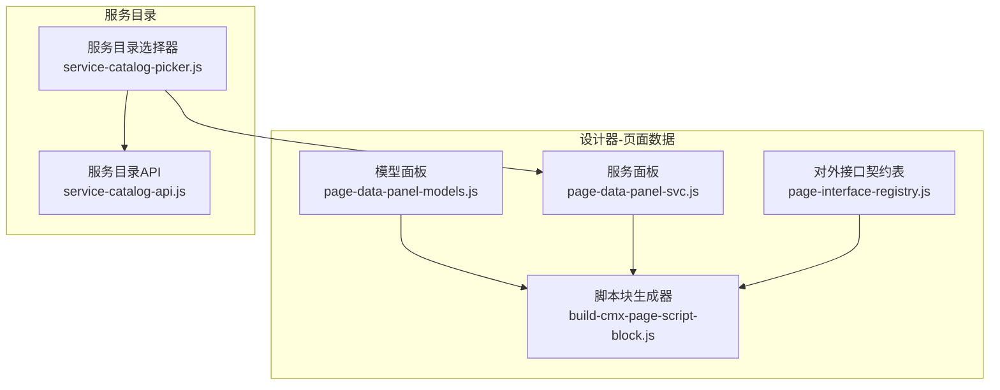
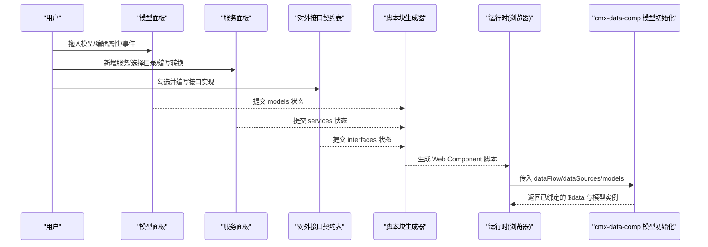
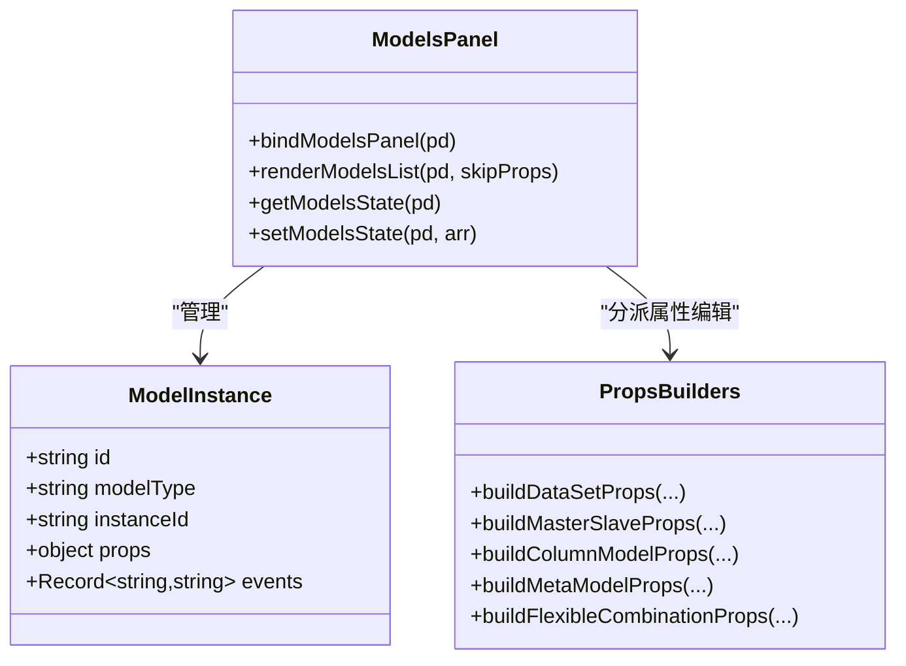
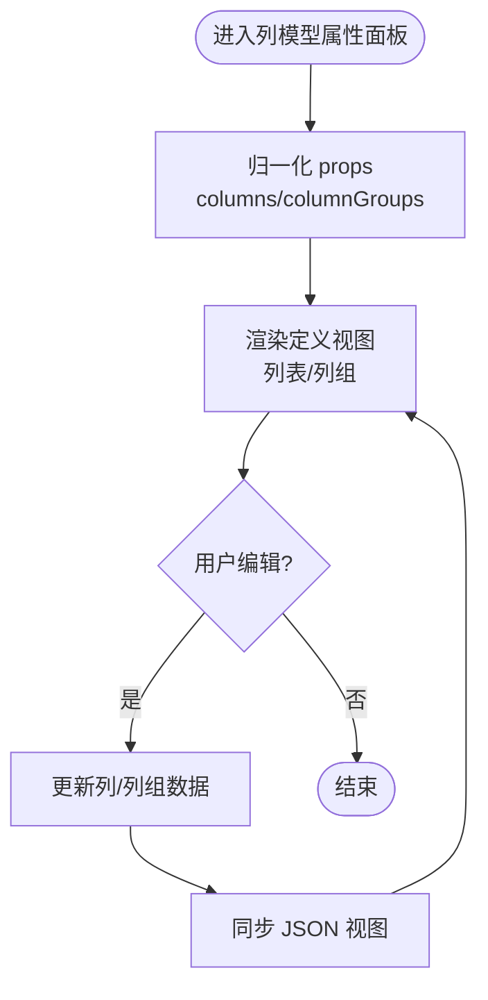
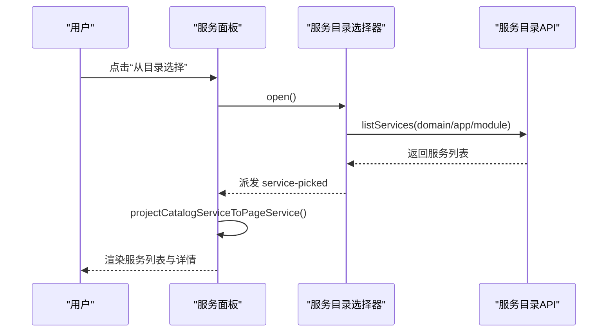
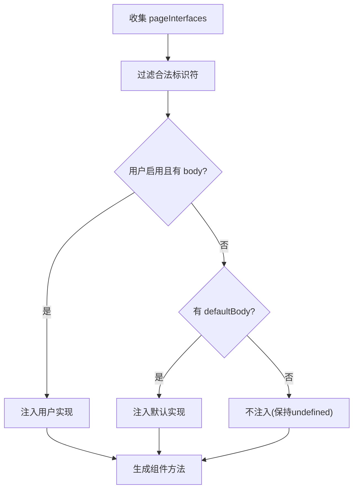
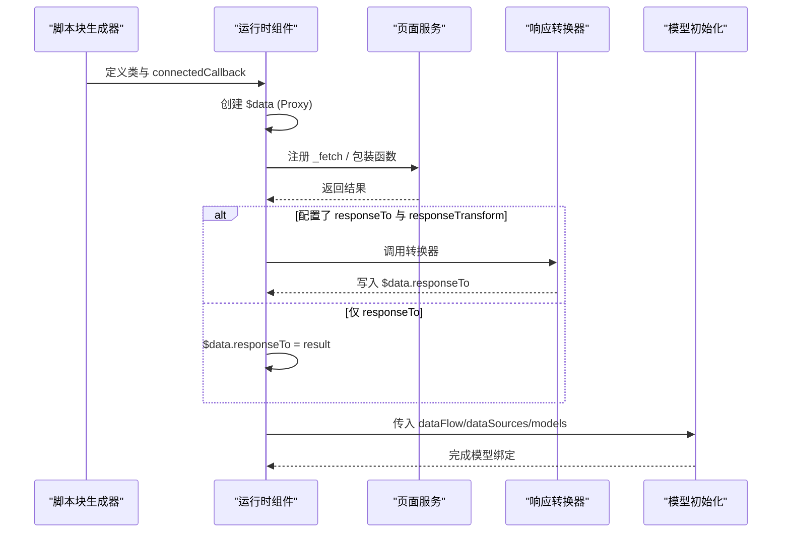
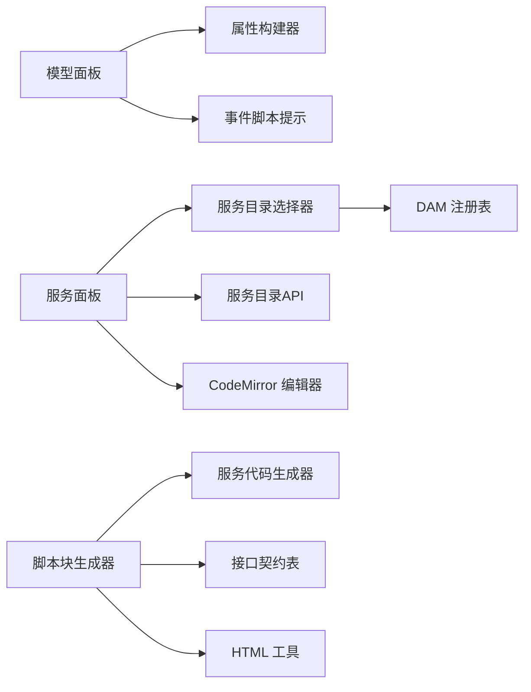

# 页面数据管理

<cite>
**本文引用的文件**
- [page-data-panel-models.js](file://CMXHTMLDesigner/src/components/designer-page-data/page-data-panel-models.js)
- [models-props-dataset.js](file://CMXHTMLDesigner/src/components/designer-page-data/models-props-dataset.js)
- [models-props-columnmodel.js](file://CMXHTMLDesigner/src/components/designer-page-data/models-props-columnmodel.js)
- [models-props-masterslave.js](file://CMXHTMLDesigner/src/components/designer-page-data/models-props-masterslave.js)
- [page-data-panel-svc.js](file://CMXHTMLDesigner/src/components/designer-page-data/page-data-panel-svc.js)
- [service-catalog-picker.js](file://CMXHTMLDesigner/src/components/designer-page-data/service-catalog-picker.js)
- [service-catalog-api.js](file://CMXHTMLDesigner/src/api/service-catalog-api.js)
- [build-cmx-page-script-block.js](file://CMXHTMLDesigner/src/utils/build-cmx-page-script-block.js)
- [page-interface-registry.js](file://CMXHTMLDesigner/src/components/designer-page-data/page-interface-registry.js)
</cite>

## 目录
1. [简介](#简介)
2. [项目结构](#项目结构)
3. [核心组件](#核心组件)
4. [架构总览](#架构总览)
5. [详细组件分析](#详细组件分析)
6. [依赖关系分析](#依赖关系分析)
7. [性能考虑](#性能考虑)
8. [故障排查指南](#故障排查指南)
9. [结论](#结论)
10. [附录](#附录)

## 简介
本文件面向“页面数据管理系统”的开发与维护，聚焦于设计器侧的模型定义、数据源配置与服务接口管理机制。文档说明数据集的 CRUD 操作、字段映射与类型转换；解释函数库的组织方式、参数传递与返回值处理；描述服务目录注册机制、接口调用与错误处理；并提供数据绑定最佳实践、性能优化技巧、调试方法、后端 API 集成方式、缓存策略与离线支持建议，以及完整开发示例与常见问题解决方案。

## 项目结构
该能力集中在 CMXHTMLDesigner 的设计器页面数据模块中，围绕“模型面板”“服务面板”“对外接口契约表”和“脚本块生成器”展开：
- 模型面板：负责从调色板拖入模型实例（数据集、主从协调器、列模型、元数据等），提供属性编辑与事件脚本编辑。
- 服务面板：维护页面级服务（REST/JSON-RPC/GraphQL/WebSocket），支持从服务目录选择并投影为页面服务，提供响应体转换编辑器。
- 对外接口契约表：集中声明宿主可调用/覆盖的页面生命周期与业务接口，生成器据此注入默认实现或用户实现。
- 脚本块生成器：将页面数据、函数、服务、接口与模型初始化逻辑打包成可运行的 Web Component 脚本。

图表来源
- [page-data-panel-models.js:97-155](file://CMXHTMLDesigner/src/components/designer-page-data/page-data-panel-models.js#L97-L155)
- [page-data-panel-svc.js:123-165](file://CMXHTMLDesigner/src/components/designer-page-data/page-data-panel-svc.js#L123-L165)
- [service-catalog-picker.js:14-16](file://CMXHTMLDesigner/src/components/designer-page-data/service-catalog-picker.js#L14-L16)
- [service-catalog-api.js:29-36](file://CMXHTMLDesigner/src/api/service-catalog-api.js#L29-L36)
- [build-cmx-page-script-block.js:28-54](file://CMXHTMLDesigner/src/utils/build-cmx-page-script-block.js#L28-L54)

章节来源
- [page-data-panel-models.js:97-155](file://CMXHTMLDesigner/src/components/designer-page-data/page-data-panel-models.js#L97-L155)
- [page-data-panel-svc.js:123-165](file://CMXHTMLDesigner/src/components/designer-page-data/page-data-panel-svc.js#L123-L165)
- [service-catalog-picker.js:14-16](file://CMXHTMLDesigner/src/components/designer-page-data/service-catalog-picker.js#L14-L16)
- [service-catalog-api.js:29-36](file://CMXHTMLDesigner/src/api/service-catalog-api.js#L29-L36)
- [build-cmx-page-script-block.js:28-54](file://CMXHTMLDesigner/src/utils/build-cmx-page-script-block.js#L28-L54)

## 核心组件
- 模型面板：维护 pd._models 数组，支持拖拽创建、删除、选中、属性编辑与事件脚本编辑；按模型类型分发到对应属性构建器。
- 服务面板：维护 pd._pageServices 数组，支持增删改查、从服务目录选择、响应体转换编辑器、代码生成与导出。
- 对外接口契约表：集中声明 host 上的方法名、分组、参数、默认实现与启用状态，供生成器注入。
- 脚本块生成器：根据页面状态生成 Web Component 脚本，包含 $data 绑定、页面函数、页面服务、对外接口与模型初始化。

章节来源
- [page-data-panel-models.js:35-95](file://CMXHTMLDesigner/src/components/designer-page-data/page-data-panel-models.js#L35-L95)
- [page-data-panel-svc.js:373-477](file://CMXHTMLDesigner/src/components/designer-page-data/page-data-panel-svc.js#L373-L477)
- [page-interface-registry.js:34-434](file://CMXHTMLDesigner/src/components/designer-page-data/page-interface-registry.js#L34-L434)
- [build-cmx-page-script-block.js:165-233](file://CMXHTMLDesigner/src/utils/build-cmx-page-script-block.js#L165-L233)

## 架构总览
设计器通过“模型面板”“服务面板”“对外接口契约表”收集页面运行时所需的全部配置，再由“脚本块生成器”输出一个自包含的 Web Component 脚本。运行期由 cmx-data-comp 的 initPageModels 完成模型加载与数据流装配。

图表来源
- [page-data-panel-models.js:97-155](file://CMXHTMLDesigner/src/components/designer-page-data/page-data-panel-models.js#L97-L155)
- [page-data-panel-svc.js:123-165](file://CMXHTMLDesigner/src/components/designer-page-data/page-data-panel-svc.js#L123-L165)
- [build-cmx-page-script-block.js:284-298](file://CMXHTMLDesigner/src/utils/build-cmx-page-script-block.js#L284-L298)

## 详细组件分析

### 模型面板与模型类型
- 支持的模型类型包括：CmxDataSet、CmxMasterSlave、CmxColumnModel、CmxDCTMeta、CmxDOCMeta、FlexibleCombination。
- 每个模型实例包含 id、modelType、instanceId、props、events。
- 属性编辑通过 PROPS_BUILDERS 分派到具体构建器；事件编辑使用 CodeMirror 编辑器，支持自动补全与调试插入。

图表来源
- [page-data-panel-models.js:35-51](file://CMXHTMLDesigner/src/components/designer-page-data/page-data-panel-models.js#L35-L51)
- [page-data-panel-models.js:97-155](file://CMXHTMLDesigner/src/components/designer-page-data/page-data-panel-models.js#L97-L155)
- [page-data-panel-models.js:530-549](file://CMXHTMLDesigner/src/components/designer-page-data/page-data-panel-models.js#L530-L549)

章节来源
- [page-data-panel-models.js:35-95](file://CMXHTMLDesigner/src/components/designer-page-data/page-data-panel-models.js#L35-L95)
- [page-data-panel-models.js:97-155](file://CMXHTMLDesigner/src/components/designer-page-data/page-data-panel-models.js#L97-L155)
- [page-data-panel-models.js:214-247](file://CMXHTMLDesigner/src/components/designer-page-data/page-data-panel-models.js#L214-L247)
- [page-data-panel-models.js:280-392](file://CMXHTMLDesigner/src/components/designer-page-data/page-data-panel-models.js#L280-L392)
- [page-data-panel-models.js:530-549](file://CMXHTMLDesigner/src/components/designer-page-data/page-data-panel-models.js#L530-L549)

### 数据集（CmxDataSet）
- 在模型面板中作为资源项存在，其属性（如实例名、数据来源、初始行数据、子数据集）统一在右侧属性区域编辑。
- 适合用于静态数据或简单列表展示场景。

章节来源
- [models-props-dataset.js:1-16](file://CMXHTMLDesigner/src/components/designer-page-data/models-props-dataset.js#L1-L16)

### 列模型（CmxColumnModel）
- 提供可视化列定义与列组管理，支持复制/粘贴、添加/删除列、移动顺序、枚举值管理、JSON 视图同步与格式化。
- 内部维护 columns 与 columnGroups 两个核心结构，并在 JSON 与 UI 之间做双向转换。
- 支持将上下文字段转换为列对象，并对历史数据结构进行兼容归一化。

图表来源
- [models-props-columnmodel.js:23-109](file://CMXHTMLDesigner/src/components/designer-page-data/models-props-columnmodel.js#L23-L109)
- [models-props-columnmodel.js:479-515](file://CMXHTMLDesigner/src/components/designer-page-data/models-props-columnmodel.js#L479-L515)
- [models-props-columnmodel.js:642-683](file://CMXHTMLDesigner/src/components/designer-page-data/models-props-columnmodel.js#L642-L683)

章节来源
- [models-props-columnmodel.js:23-109](file://CMXHTMLDesigner/src/components/designer-page-data/models-props-columnmodel.js#L23-L109)
- [models-props-columnmodel.js:176-247](file://CMXHTMLDesigner/src/components/designer-page-data/models-props-columnmodel.js#L176-L247)
- [models-props-columnmodel.js:479-515](file://CMXHTMLDesigner/src/components/designer-page-data/models-props-columnmodel.js#L479-L515)
- [models-props-columnmodel.js:642-683](file://CMXHTMLDesigner/src/components/designer-page-data/models-props-columnmodel.js#L642-L683)

### 主从协调器（CmxMasterSlave）
- 提供 Schema 路径树与聚合规则编辑，便于定义复杂数据的层级结构与汇总计算。
- 支持动态添加/删除节点与聚合规则，实时回写至 props.schema 与 props.aggregations。

章节来源
- [models-props-masterslave.js:6-121](file://CMXHTMLDesigner/src/components/designer-page-data/models-props-masterslave.js#L6-L121)

### 服务面板与服务目录
- 服务面板维护 pd._pageServices，支持 REST/JSON-RPC/GraphQL/WebSocket 四种类型。
- 可从服务目录选择条目，自动投影为页面服务（清洗名称、提取 RPC/GQL 信息、序列化 headers）。
- 提供响应体转换编辑器，可将结果写入指定 $data 字段。

图表来源
- [page-data-panel-svc.js:146-165](file://CMXHTMLDesigner/src/components/designer-page-data/page-data-panel-svc.js#L146-L165)
- [service-catalog-picker.js:214-232](file://CMXHTMLDesigner/src/components/designer-page-data/service-catalog-picker.js#L214-L232)
- [service-catalog-api.js:29-36](file://CMXHTMLDesigner/src/api/service-catalog-api.js#L29-L36)

章节来源
- [page-data-panel-svc.js:123-165](file://CMXHTMLDesigner/src/components/designer-page-data/page-data-panel-svc.js#L123-L165)
- [page-data-panel-svc.js:184-234](file://CMXHTMLDesigner/src/components/designer-page-data/page-data-panel-svc.js#L184-L234)
- [page-data-panel-svc.js:262-371](file://CMXHTMLDesigner/src/components/designer-page-data/page-data-panel-svc.js#L262-L371)
- [service-catalog-picker.js:14-16](file://CMXHTMLDesigner/src/components/designer-page-data/service-catalog-picker.js#L14-L16)
- [service-catalog-api.js:29-36](file://CMXHTMLDesigner/src/api/service-catalog-api.js#L29-L36)

### 对外接口契约表与注入
- 契约表定义了 host 上的方法名、分组、参数、默认实现与是否默认启用。
- 生成器会按顺序注入：用户启用的实现优先，否则注入默认实现；未启用且无默认实现的接口保持 undefined。
- 支持脏标记、忙状态、初始快照、生命周期钩子与工作流相关接口。

图表来源
- [page-interface-registry.js:34-434](file://CMXHTMLDesigner/src/components/designer-page-data/page-interface-registry.js#L34-L434)
- [build-cmx-page-script-block.js:45-54](file://CMXHTMLDesigner/src/utils/build-cmx-page-script-block.js#L45-L54)
- [build-cmx-page-script-block.js:235-279](file://CMXHTMLDesigner/src/utils/build-cmx-page-script-block.js#L235-L279)

章节来源
- [page-interface-registry.js:34-434](file://CMXHTMLDesigner/src/components/designer-page-data/page-interface-registry.js#L34-L434)
- [build-cmx-page-script-block.js:45-54](file://CMXHTMLDesigner/src/utils/build-cmx-page-script-block.js#L45-L54)
- [build-cmx-page-script-block.js:235-279](file://CMXHTMLDesigner/src/utils/build-cmx-page-script-block.js#L235-L279)

### 脚本块生成与运行时初始化
- 生成器将页面数据、函数、服务、接口与模型初始化逻辑打包为 Web Component 脚本。
- $data 通过 Proxy 绑定，变更时自动更新 DOM 上以 data-bind-* 标注的属性。
- 服务分为两类：WebSocket 直接内联；其他类型生成 _fetch 函数与包装函数，支持 responseTransform 与 sourceURL 调试。
- 最终委托给 cmx-data-comp 的 initPageModels 完成模型装载与数据流装配。

图表来源
- [build-cmx-page-script-block.js:110-163](file://CMXHTMLDesigner/src/utils/build-cmx-page-script-block.js#L110-L163)
- [build-cmx-page-script-block.js:182-233](file://CMXHTMLDesigner/src/utils/build-cmx-page-script-block.js#L182-L233)
- [build-cmx-page-script-block.js:284-298](file://CMXHTMLDesigner/src/utils/build-cmx-page-script-block.js#L284-L298)

章节来源
- [build-cmx-page-script-block.js:110-163](file://CMXHTMLDesigner/src/utils/build-cmx-page-script-block.js#L110-L163)
- [build-cmx-page-script-block.js:182-233](file://CMXHTMLDesigner/src/utils/build-cmx-page-script-block.js#L182-L233)
- [build-cmx-page-script-block.js:284-298](file://CMXHTMLDesigner/src/utils/build-cmx-page-script-block.js#L284-L298)

## 依赖关系分析
- 模型面板依赖各模型类型的属性构建器与事件脚本提示。
- 服务面板依赖服务目录选择器与 API 客户端，同时依赖 CodeMirror 编辑器与工具函数。
- 脚本块生成器依赖服务代码生成器、接口契约表与 HTML 工具函数。
- 服务目录选择器依赖 DAM 注册表与服务目录 API。

图表来源
- [page-data-panel-models.js:17-33](file://CMXHTMLDesigner/src/components/designer-page-data/page-data-panel-models.js#L17-L33)
- [page-data-panel-svc.js:1-9](file://CMXHTMLDesigner/src/components/designer-page-data/page-data-panel-svc.js#L1-L9)
- [service-catalog-picker.js:14-16](file://CMXHTMLDesigner/src/components/designer-page-data/service-catalog-picker.js#L14-L16)
- [build-cmx-page-script-block.js:1-12](file://CMXHTMLDesigner/src/utils/build-cmx-page-script-block.js#L1-L12)

章节来源
- [page-data-panel-models.js:17-33](file://CMXHTMLDesigner/src/components/designer-page-data/page-data-panel-models.js#L17-L33)
- [page-data-panel-svc.js:1-9](file://CMXHTMLDesigner/src/components/designer-page-data/page-data-panel-svc.js#L1-L9)
- [service-catalog-picker.js:14-16](file://CMXHTMLDesigner/src/components/designer-page-data/service-catalog-picker.js#L14-L16)
- [build-cmx-page-script-block.js:1-12](file://CMXHTMLDesigner/src/utils/build-cmx-page-script-block.js#L1-L12)

## 性能考虑
- 懒加载编辑器：事件脚本与 JSON 编辑器按需加载 CodeMirror，避免首屏阻塞。
- 增量渲染：属性编辑触发 onChange 后局部重渲染，减少整页刷新。
- 闭包与内存管理：服务面板在切换列表时销毁旧编辑器并解绑，防止内存泄漏。
- 网络请求：服务调用支持 AbortSignal，便于取消重复请求。
- 数据绑定：$data 使用 Proxy 仅对变更键触发 DOM 更新，降低渲染开销。
- 模型初始化：延迟导入 initPageModels，仅在需要时加载，提升启动速度。

[本节为通用性能建议，无需特定文件引用]

## 故障排查指南
- 服务目录加载失败：检查 /api/service-catalog 可达性与返回格式；若失败，选择器会显示警告条并降级为“全部服务”。
- HTTP 错误：服务调用在非 ok 状态时抛出错误，建议在 responseTransform 中捕获并提示。
- JSON 解析失败：列模型 JSON 视图应用时会校验根节点与数组类型，失败会显示错误消息。
- 接口未生效：确认接口已启用且 body 非空；若无默认实现且未启用，宿主调用将得到 undefined。
- 模型未初始化：若 initPageModels 加载失败，生成器会回退到调用 host.initPage({})，可在 onMount/initPage 中补充初始化逻辑。

章节来源
- [service-catalog-picker.js:214-232](file://CMXHTMLDesigner/src/components/designer-page-data/service-catalog-picker.js#L214-L232)
- [service-catalog-api.js:8-18](file://CMXHTMLDesigner/src/api/service-catalog-api.js#L8-L18)
- [models-props-columnmodel.js:485-515](file://CMXHTMLDesigner/src/components/designer-page-data/models-props-columnmodel.js#L485-L515)
- [build-cmx-page-script-block.js:284-298](file://CMXHTMLDesigner/src/utils/build-cmx-page-script-block.js#L284-L298)

## 结论
页面数据管理系统通过“模型面板”“服务面板”“对外接口契约表”与“脚本块生成器”形成闭环：设计器侧完成模型与服务配置，运行期生成可执行的 Web Component 脚本，并由 cmx-data-comp 完成模型装载与数据绑定。该体系具备高扩展性、良好调试体验与清晰的职责边界，适合企业级页面的快速开发与维护。

[本节为总结性内容，无需特定文件引用]

## 附录

### 数据集 CRUD 与字段映射、类型转换
- 创建：从调色板拖入模型实例，自动生成 id、instanceId 与默认 props。
- 读取：选中模型实例后，属性构建器渲染对应编辑区；列模型支持 JSON 视图查看。
- 更新：属性编辑触发 onChange，局部重渲染并持久化到 pd._models。
- 删除：移除实例并清理选中状态。
- 字段映射：列模型在 UI 与 JSON 间双向转换，支持历史结构兼容归一化。
- 类型转换：输入值按 valueType 进行 number/boolean 等转换，确保存储一致性。

章节来源
- [page-data-panel-models.js:120-151](file://CMXHTMLDesigner/src/components/designer-page-data/page-data-panel-models.js#L120-L151)
- [models-props-columnmodel.js:788-800](file://CMXHTMLDesigner/src/components/designer-page-data/models-props-columnmodel.js#L788-L800)
- [models-props-columnmodel.js:642-683](file://CMXHTMLDesigner/src/components/designer-page-data/models-props-columnmodel.js#L642-L683)

### 函数库组织、参数传递与返回值处理
- 页面函数：逐条 new Function 注入，支持自定义形参，DevTools 按 sourceURL 分文件。
- 页面服务：REST/JSON-RPC/GraphQL 生成 _fetch 与包装函数；WebSocket 生成 connect/send/close。
- 返回值：_fetch 返回原始结果；包装函数可选择写入 $data.responseTo 并返回结果。
- 响应转换：responseTransform 作为独立函数注入，可访问 data/$data/host。

章节来源
- [build-cmx-page-script-block.js:165-233](file://CMXHTMLDesigner/src/utils/build-cmx-page-script-block.js#L165-L233)
- [page-data-panel-svc.js:373-477](file://CMXHTMLDesigner/src/components/designer-page-data/page-data-panel-svc.js#L373-L477)

### 服务目录注册机制、接口调用与错误处理
- 注册：服务目录通过 /api/service-catalog 暴露，支持 domain/app/module 过滤。
- 选择：选择器加载 DAM 树与服务列表，用户选择后投影为页面服务。
- 调用：页面服务在运行期通过 fetch 发起请求，非 ok 抛错；JSON-RPC/GraphQL 分别处理 error/errors。
- 错误处理：选择器显示错误条；服务调用可在 responseTransform 中捕获并提示。

章节来源
- [service-catalog-api.js:29-36](file://CMXHTMLDesigner/src/api/service-catalog-api.js#L29-L36)
- [service-catalog-picker.js:214-232](file://CMXHTMLDesigner/src/components/designer-page-data/service-catalog-picker.js#L214-L232)
- [page-data-panel-svc.js:417-454](file://CMXHTMLDesigner/src/components/designer-page-data/page-data-panel-svc.js#L417-L454)

### 数据绑定最佳实践、性能优化与调试方法
- 最佳实践：使用 data-bind-* 属性绑定 $data 字段；避免频繁大对象赋值，尽量增量更新。
- 性能优化：懒加载编辑器、按需导入模型初始化、使用 AbortSignal 取消重复请求。
- 调试方法：开启调试模式后，函数体前插入 debugger；每个服务/接口拥有独立 sourceURL，便于定位。

章节来源
- [build-cmx-page-script-block.js:110-163](file://CMXHTMLDesigner/src/utils/build-cmx-page-script-block.js#L110-L163)
- [build-cmx-page-script-block.js:165-233](file://CMXHTMLDesigner/src/utils/build-cmx-page-script-block.js#L165-L233)
- [build-cmx-page-script-block.js:235-279](file://CMXHTMLDesigner/src/utils/build-cmx-page-script-block.js#L235-L279)

### 后端 API 集成、数据缓存策略与离线支持
- 集成方式：服务面板支持 REST/JSON-RPC/GraphQL/WebSocket；headers/bodyTemplate 可模板化。
- 缓存策略：建议在 responseTransform 中结合本地存储（localStorage/sessionStorage）或内存缓存层实现；对于高频只读数据，可基于 key 缓存并设置过期时间。
- 离线支持：WebSocket 连接断开时记录最后消息；HTTP 请求失败时可降级为读取本地缓存；在 canClose/cancel 中提示用户离线状态。

[本节为通用集成建议，无需特定文件引用]

### 完整开发示例与常见问题解决方案
- 示例流程：
  - 在模型面板拖入 CmxColumnModel，定义列与列组，切换到 JSON 视图验证结构。
  - 在服务面板新增 REST 服务，填写 url/method/headers/bodyTemplate，编写 responseTransform 将结果写入 $data.list。
  - 在对外接口契约表中启用 initPage，编写异步初始化逻辑，调用服务获取数据。
  - 运行页面，观察 $data 绑定与模型初始化结果。
- 常见问题：
  - 服务目录无法加载：检查网络与后端接口；查看选择器错误条。
  - JSON 应用失败：检查根节点类型与数组字段；查看状态提示。
  - 接口未生效：确认启用与 body；若无默认实现，需编写实现。
  - 模型未初始化：检查 initPageModels 是否可用；必要时在 initPage 中补充逻辑。

章节来源
- [service-catalog-picker.js:214-232](file://CMXHTMLDesigner/src/components/designer-page-data/service-catalog-picker.js#L214-L232)
- [models-props-columnmodel.js:485-515](file://CMXHTMLDesigner/src/components/designer-page-data/models-props-columnmodel.js#L485-L515)
- [build-cmx-page-script-block.js:284-298](file://CMXHTMLDesigner/src/utils/build-cmx-page-script-block.js#L284-L298)