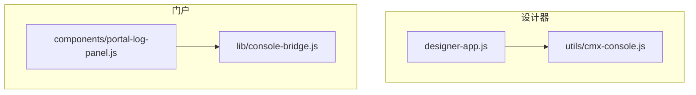
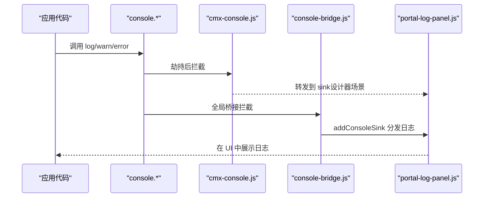
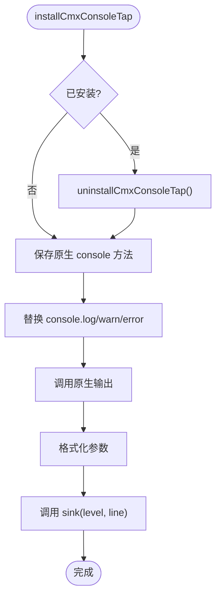
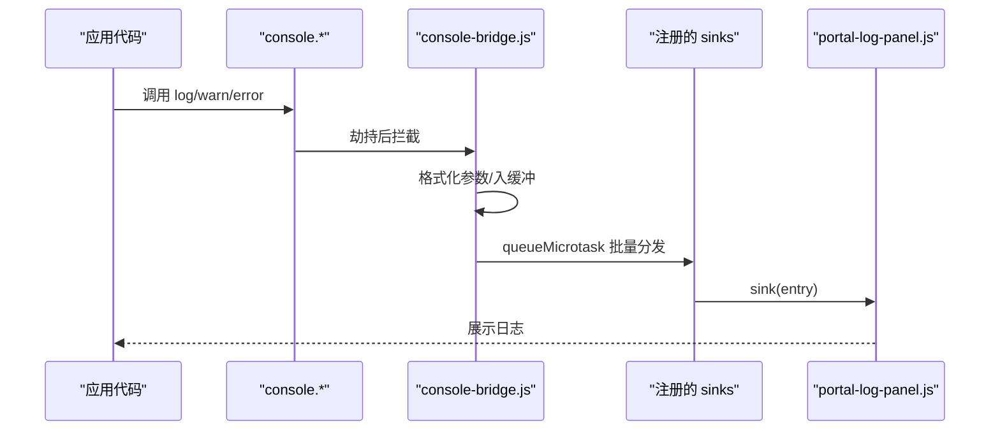
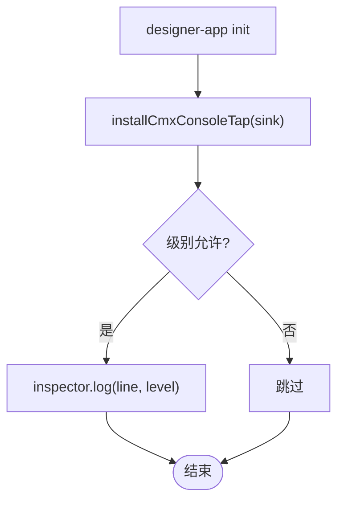
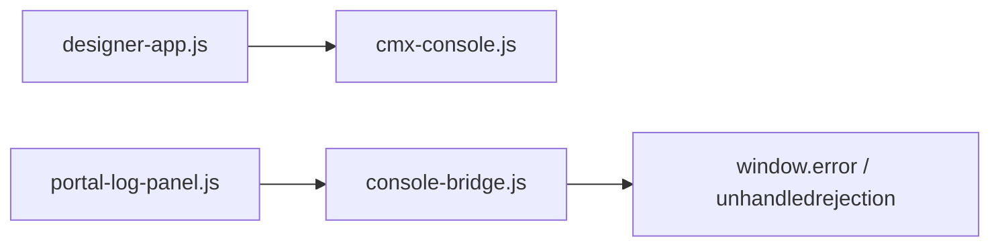

# 控制台日志系统

<cite>
**本文引用的文件**
- [CMXHTMLDesigner/src/utils/cmx-console.js](file://CMXHTMLDesigner/src/utils/cmx-console.js)
- [CMXHTMLDesigner/src/components/designer-app.js](file://CMXHTMLDesigner/src/components/designer-app.js)
- [CMXHTMLDesigner/src/__tests__/cmx-console.test.js](file://CMXHTMLDesigner/src/__tests__/cmx-console.test.js)
- [CMXPortalManager/src/lib/console-bridge.js](file://CMXPortalManager/src/lib/console-bridge.js)
- [CMXPortalManager/src/components/portal-log-panel.js](file://CMXPortalManager/src/components/portal-log-panel.js)
</cite>

## 目录
1. [简介](#简介)
2. [项目结构](#项目结构)
3. [核心组件](#核心组件)
4. [架构总览](#架构总览)
5. [详细组件分析](#详细组件分析)
6. [依赖关系分析](#依赖关系分析)
7. [性能考量](#性能考量)
8. [故障排查指南](#故障排查指南)
9. [结论](#结论)
10. [附录：API 使用示例](#附录api-使用示例)

## 简介
本技术文档围绕控制台日志系统展开，重点说明以下方面：
- console 劫持机制的实现原理：如何保存并替换原生 console 方法，确保日志双写与可恢复。
- 日志级别管理（log、warn、error）的处理逻辑与格式化策略。
- sink 模式设计：如何支持自定义日志输出目标，以及多 sink 分发与限流缓冲。
- 安装/卸载机制、状态管理与错误处理。
- 完整 API 使用示例：installCmxConsoleTap、uninstallCmxConsoleTap、isCmxConsoleTapInstalled 的使用方式。

该日志系统由两部分组成：
- 设计器侧的轻量级 console tap：用于将 console.log/warn/error 转发到设计器内部调试区。
- 门户侧的全局 console bridge：统一收集 console、window.error、unhandledrejection 等来源的日志，并通过 sink 模式分发给 UI 面板或其他消费者。

## 项目结构
与日志系统直接相关的代码分布在两个子项目中：
- CMXHTMLDesigner：提供设计器内的 console 劫持能力，暴露 installCmxConsoleTap/uninstallCmxConsoleTap/isCmxConsoleTapInstalled。
- CMXPortalManager：提供全局 console bridge，暴露 installConsoleBridge/uninstallConsoleBridge/addConsoleSink，并在 portal-log-panel 中消费日志。

图表来源
- [CMXHTMLDesigner/src/components/designer-app.js:37-94](file://CMXHTMLDesigner/src/components/designer-app.js#L37-L94)
- [CMXHTMLDesigner/src/utils/cmx-console.js:1-84](file://CMXHTMLDesigner/src/utils/cmx-console.js#L1-L84)
- [CMXPortalManager/src/lib/console-bridge.js:1-169](file://CMXPortalManager/src/lib/console-bridge.js#L1-L169)
- [CMXPortalManager/src/components/portal-log-panel.js:1-66](file://CMXPortalManager/src/components/portal-log-panel.js#L1-L66)

章节来源
- [CMXHTMLDesigner/src/components/designer-app.js:37-94](file://CMXHTMLDesigner/src/components/designer-app.js#L37-L94)
- [CMXHTMLDesigner/src/utils/cmx-console.js:1-84](file://CMXHTMLDesigner/src/utils/cmx-console.js#L1-L84)
- [CMXPortalManager/src/lib/console-bridge.js:1-169](file://CMXPortalManager/src/lib/console-bridge.js#L1-L169)
- [CMXPortalManager/src/components/portal-log-panel.js:1-66](file://CMXPortalManager/src/components/portal-log-panel.js#L1-L66)

## 核心组件
- 设计器 console tap（cmx-console.js）
  - 保存原生 console 方法引用，避免递归与丢失对象样式。
  - 劫持 log/warn/error，先调用原生输出，再调用 sink。
  - 提供安装/卸载/状态查询 API。
- 门户 console bridge（console-bridge.js）
  - 单例安装，保留原始 console 引用，桥接同时调用原始方法。
  - 统一捕获 window.error 与 unhandledrejection。
  - 环形缓冲 + microtask 批处理，防止高频日志阻塞渲染。
  - 多 sink 注册与反注册，单个 sink 失败不影响其他 sink。
- 日志面板（portal-log-panel.js）
  - 作为 sink 消费桥接日志，按级别分类展示，支持导出与过滤。

章节来源
- [CMXHTMLDesigner/src/utils/cmx-console.js:1-84](file://CMXHTMLDesigner/src/utils/cmx-console.js#L1-L84)
- [CMXPortalManager/src/lib/console-bridge.js:1-169](file://CMXPortalManager/src/lib/console-bridge.js#L1-L169)
- [CMXPortalManager/src/components/portal-log-panel.js:1-66](file://CMXPortalManager/src/components/portal-log-panel.js#L1-L66)

## 架构总览
整体数据流如下：
- 应用代码调用 console.log/warn/error。
- 设计器侧通过 cmx-console.js 劫持，双写到 DevTools 与 inspector 调试区。
- 门户侧通过 console-bridge.js 统一收集 console、window.error、unhandledrejection，并以 sink 模式分发到 portal-log-panel 等消费者。
- 日志面板以 tab 形式展示不同级别的日志，并提供导出等功能。

图表来源
- [CMXHTMLDesigner/src/utils/cmx-console.js:37-68](file://CMXHTMLDesigner/src/utils/cmx-console.js#L37-L68)
- [CMXPortalManager/src/lib/console-bridge.js:88-135](file://CMXPortalManager/src/lib/console-bridge.js#L88-L135)
- [CMXPortalManager/src/components/portal-log-panel.js:1-66](file://CMXPortalManager/src/components/portal-log-panel.js#L1-L66)

## 详细组件分析

### 设计器 console tap（cmx-console.js）
- 实现要点
  - 保存原生 console 方法引用（cmx_log），避免递归与对象引用丢失。
  - 劫持 log/warn/error，先调用原生输出，再调用 sink。
  - 提供安装/卸载/状态查询 API，支持重复安装时自动卸载旧实例。
- 日志级别与格式化
  - 级别：log、warn、error。
  - 格式化：对每个参数进行安全序列化（undefined/null/string/Error/JSON.stringify兜底为String）。
- 安装/卸载与状态管理
  - installCmxConsoleTap：若已安装则先卸载，再保存原方法并替换。
  - uninstallCmxConsoleTap：恢复原方法，重置状态。
  - isCmxConsoleTapInstalled：返回当前是否已安装。
- 错误处理
  - sink 调用包裹 try/catch，避免 sink 内部异常影响业务。

图表来源
- [CMXHTMLDesigner/src/utils/cmx-console.js:37-68](file://CMXHTMLDesigner/src/utils/cmx-console.js#L37-L68)
- [CMXHTMLDesigner/src/utils/cmx-console.js:17-31](file://CMXHTMLDesigner/src/utils/cmx-console.js#L17-L31)

章节来源
- [CMXHTMLDesigner/src/utils/cmx-console.js:1-84](file://CMXHTMLDesigner/src/utils/cmx-console.js#L1-L84)
- [CMXHTMLDesigner/src/__tests__/cmx-console.test.js:1-43](file://CMXHTMLDesigner/src/__tests__/cmx-console.test.js#L1-L43)

### 门户 console bridge（console-bridge.js）
- 实现要点
  - 单例安装：installConsoleBridge 多次调用安全（_installed 标志）。
  - 保留原始 console 引用，桥接同时调用原始方法，保证 DevTools 体验。
  - 统一捕获 window.error 与 unhandledrejection，转换为标准日志条目。
  - 环形缓冲（默认 500 条）+ microtask 批处理，避免高频日志阻塞渲染线程。
  - 多 sink 注册与反注册：addConsoleSink 返回反注册函数；单个 sink 失败不影响其他。
- 日志级别与格式化
  - 级别映射：log/info -> info，warn -> warn，error -> error，debug -> debug。
  - 格式化：对 Error 优先取 stack/message，对象尝试 JSON.stringify 兜底为 String。
  - 可选抑制：针对特定 i18n 缺失警告进行抑制（如 Key not found in the i18n bundle）。
- 安装/卸载与状态管理
  - installConsoleBridge：设置 _installed，绑定事件监听，替换 console 方法。
  - uninstallConsoleBridge：恢复原始方法，移除事件监听，清理状态。
  - addConsoleSink：注册 sink，立即 flush 缓冲中的历史日志。
- 错误处理
  - sink 调用包裹 try/catch，确保单个 sink 失败不影响其他 sink。
  - 递归保护：_inSink 哨兵防止 sink 内部触发 console.* 导致栈溢出。

图表来源
- [CMXPortalManager/src/lib/console-bridge.js:88-135](file://CMXPortalManager/src/lib/console-bridge.js#L88-L135)
- [CMXPortalManager/src/lib/console-bridge.js:59-83](file://CMXPortalManager/src/lib/console-bridge.js#L59-L83)
- [CMXPortalManager/src/components/portal-log-panel.js:1-66](file://CMXPortalManager/src/components/portal-log-panel.js#L1-L66)

章节来源
- [CMXPortalManager/src/lib/console-bridge.js:1-169](file://CMXPortalManager/src/lib/console-bridge.js#L1-L169)
- [CMXPortalManager/src/components/portal-log-panel.js:1-66](file://CMXPortalManager/src/components/portal-log-panel.js#L1-L66)

### 设计器集成点（designer-app.js）
- 在安装阶段调用 installCmxConsoleTap，将日志转发到 inspector 调试区。
- 通过 _consoleMirrorLevels 控制各级别是否同步到 inspector。
- 在组件销毁或需要时调用 uninstallCmxConsoleTap 恢复原生行为。

图表来源
- [CMXHTMLDesigner/src/components/designer-app.js:37-94](file://CMXHTMLDesigner/src/components/designer-app.js#L37-L94)

章节来源
- [CMXHTMLDesigner/src/components/designer-app.js:37-94](file://CMXHTMLDesigner/src/components/designer-app.js#L37-L94)

## 依赖关系分析
- 设计器侧
  - designer-app.js 依赖 cmx-console.js 提供的安装/卸载 API。
  - cmx-console.js 不依赖外部模块，仅操作全局 console。
- 门户侧
  - portal-log-panel.js 依赖 console-bridge.js 的 addConsoleSink。
  - console-bridge.js 依赖全局 window 事件（error、unhandledrejection）。

图表来源
- [CMXHTMLDesigner/src/components/designer-app.js:37-94](file://CMXHTMLDesigner/src/components/designer-app.js#L37-L94)
- [CMXHTMLDesigner/src/utils/cmx-console.js:1-84](file://CMXHTMLDesigner/src/utils/cmx-console.js#L1-L84)
- [CMXPortalManager/src/components/portal-log-panel.js:1-66](file://CMXPortalManager/src/components/portal-log-panel.js#L1-L66)
- [CMXPortalManager/src/lib/console-bridge.js:116-135](file://CMXPortalManager/src/lib/console-bridge.js#L116-L135)

章节来源
- [CMXHTMLDesigner/src/components/designer-app.js:37-94](file://CMXHTMLDesigner/src/components/designer-app.js#L37-L94)
- [CMXHTMLDesigner/src/utils/cmx-console.js:1-84](file://CMXHTMLDesigner/src/utils/cmx-console.js#L1-L84)
- [CMXPortalManager/src/components/portal-log-panel.js:1-66](file://CMXPortalManager/src/components/portal-log-panel.js#L1-L66)
- [CMXPortalManager/src/lib/console-bridge.js:116-135](file://CMXPortalManager/src/lib/console-bridge.js#L116-L135)

## 性能考量
- 设计器侧
  - 每次 console 调用都会格式化参数并调用 sink，建议 sink 实现尽量轻量。
  - 可通过 _consoleMirrorLevels 控制级别，减少不必要的 UI 更新。
- 门户侧
  - 环形缓冲限制最大条目数，避免内存无限增长。
  - 使用 queueMicrotask 合并高频日志，降低渲染线程压力。
  - 单个 sink 失败不影响其他 sink，提高鲁棒性。
  - 可选抑制特定噪音日志（如 i18n 缺失警告），减少无效输出。

[本节为通用性能指导，不直接分析具体文件]

## 故障排查指南
- 常见问题
  - 日志未显示：检查是否正确安装 console bridge/tap，确认 sink 已注册且未被卸载。
  - 日志丢失：确认缓冲是否已满（默认 500 条），必要时调整 BUFFER_LIMIT。
  - 递归崩溃：确保 sink 内部不再触发 console.*，或使用 _inSink 哨兵保护。
  - 性能问题：减少 sink 内复杂计算，利用微任务批处理特性。
- 定位方法
  - 在设计器中通过 isCmxConsoleTapInstalled 判断是否已安装。
  - 在门户中通过 addConsoleSink 返回的反注册函数检查 sink 生命周期。
  - 查看 portal-log-panel 的日志输出与过滤条件。

章节来源
- [CMXHTMLDesigner/src/utils/cmx-console.js:71-83](file://CMXHTMLDesigner/src/utils/cmx-console.js#L71-L83)
- [CMXPortalManager/src/lib/console-bridge.js:151-168](file://CMXPortalManager/src/lib/console-bridge.js#L151-L168)
- [CMXPortalManager/src/components/portal-log-panel.js:1-66](file://CMXPortalManager/src/components/portal-log-panel.js#L1-L66)

## 结论
该控制台日志系统通过两层实现满足设计与门户场景的需求：
- 设计器侧提供轻量、易用的 console tap，便于开发调试。
- 门户侧提供健壮的全局 console bridge，统一收集与分发日志，支持多 sink 与高性能处理。
两者均具备良好的安装/卸载机制、状态管理与错误处理能力，适合在企业级应用中广泛使用。

[本节为总结性内容，不直接分析具体文件]

## 附录：API 使用示例

### 设计器侧 API
- installCmxConsoleTap(sink)
  - 作用：安装 console 劫持，将 log/warn/error 双写到 DevTools 与 sink。
  - 参数：sink(level: 'log'|'warn'|'error', line: string) => void
  - 示例：在设计器初始化时安装，并将日志转发到 inspector。
  - 参考路径：[CMXHTMLDesigner/src/utils/cmx-console.js:37-68](file://CMXHTMLDesigner/src/utils/cmx-console.js#L37-L68)
- uninstallCmxConsoleTap()
  - 作用：卸载 console 劫持，恢复原生 console 行为。
  - 参考路径：[CMXHTMLDesigner/src/utils/cmx-console.js:71-79](file://CMXHTMLDesigner/src/utils/cmx-console.js#L71-L79)
- isCmxConsoleTapInstalled()
  - 作用：查询当前是否已安装 console 劫持。
  - 返回值：boolean
  - 参考路径：[CMXHTMLDesigner/src/utils/cmx-console.js:81-83](file://CMXHTMLDesigner/src/utils/cmx-console.js#L81-L83)

章节来源
- [CMXHTMLDesigner/src/utils/cmx-console.js:37-83](file://CMXHTMLDesigner/src/utils/cmx-console.js#L37-L83)
- [CMXHTMLDesigner/src/__tests__/cmx-console.test.js:14-41](file://CMXHTMLDesigner/src/__tests__/cmx-console.test.js#L14-L41)

### 门户侧 API
- installConsoleBridge()
  - 作用：安装全局 console bridge，统一收集 console、window.error、unhandledrejection。
  - 特点：单例安装，保留原始 console 引用，microtask 批处理。
  - 参考路径：[CMXPortalManager/src/lib/console-bridge.js:88-135](file://CMXPortalManager/src/lib/console-bridge.js#L88-L135)
- uninstallConsoleBridge()
  - 作用：卸载全局 console bridge，恢复原始 console 行为，移除事件监听。
  - 参考路径：[CMXPortalManager/src/lib/console-bridge.js:137-149](file://CMXPortalManager/src/lib/console-bridge.js#L137-L149)
- addConsoleSink(sink)
  - 作用：注册日志 sink，返回反注册函数；注册时会 flush 缓冲中的历史日志。
  - 参数：sink(entry: { level, message, source, time }) => void
  - 参考路径：[CMXPortalManager/src/lib/console-bridge.js:151-168](file://CMXPortalManager/src/lib/console-bridge.js#L151-L168)

章节来源
- [CMXPortalManager/src/lib/console-bridge.js:88-168](file://CMXPortalManager/src/lib/console-bridge.js#L88-L168)
- [CMXPortalManager/src/components/portal-log-panel.js:1-66](file://CMXPortalManager/src/components/portal-log-panel.js#L1-L66)