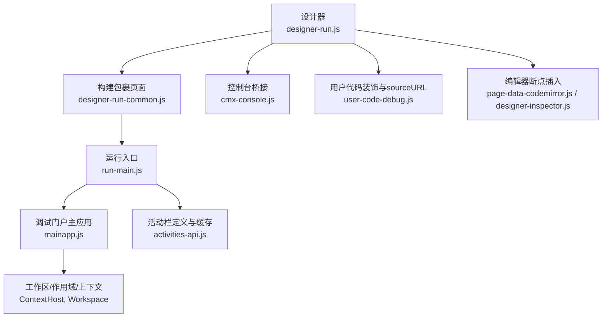
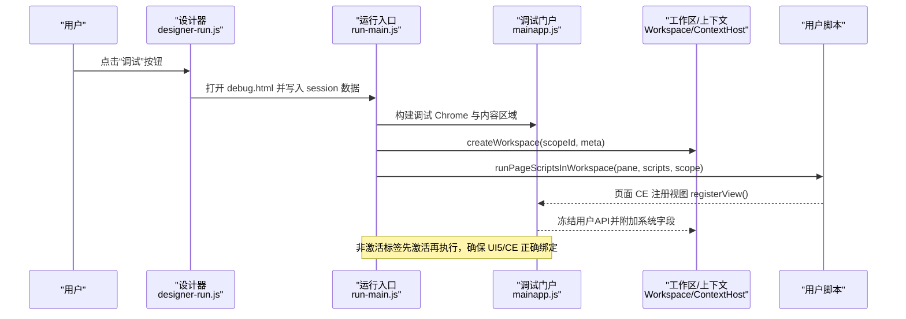
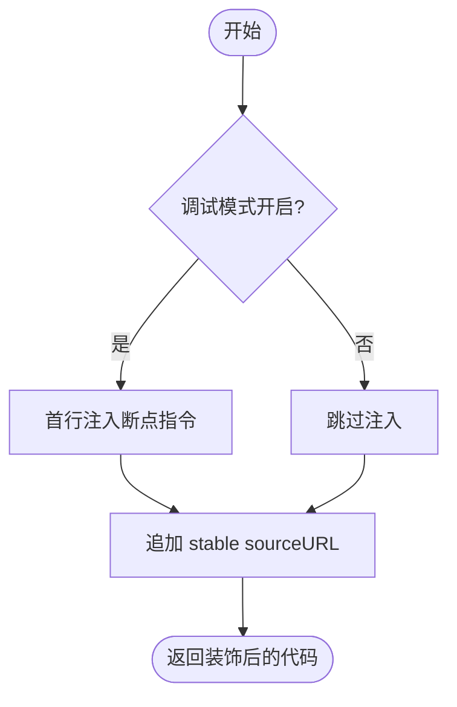
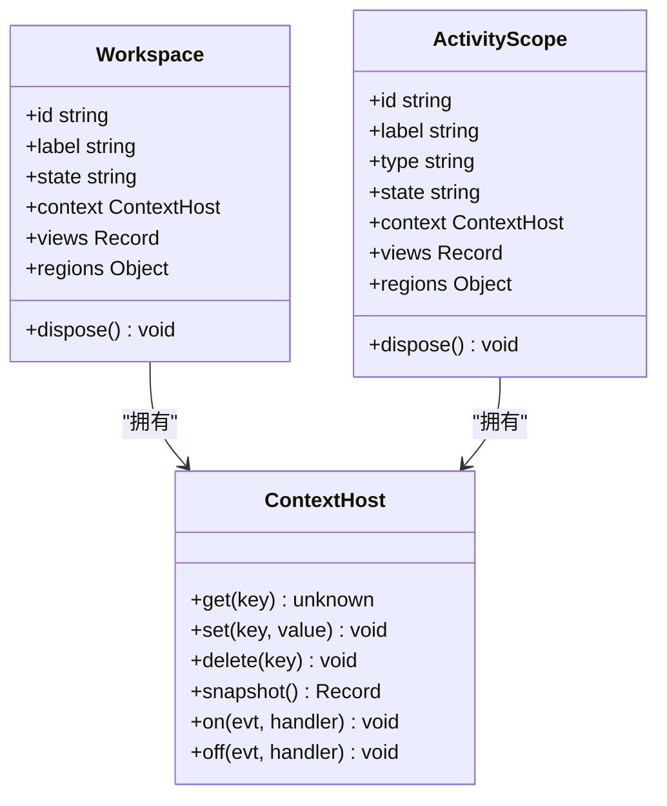
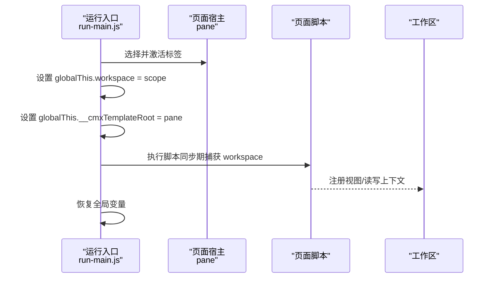
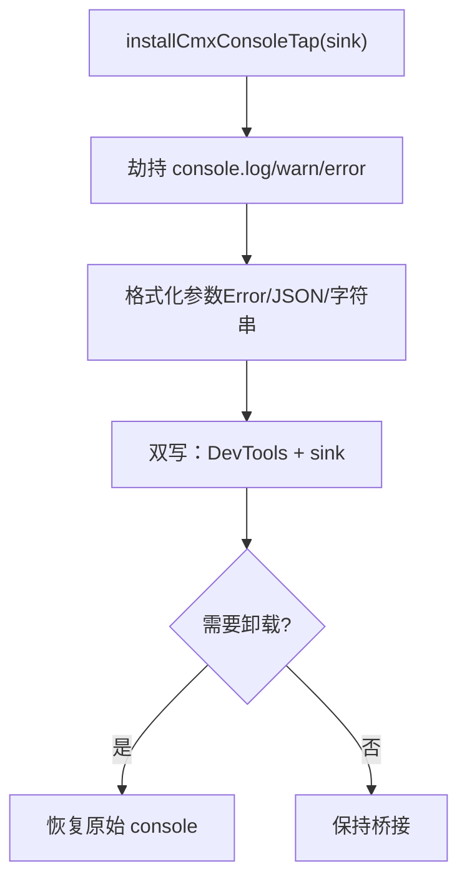
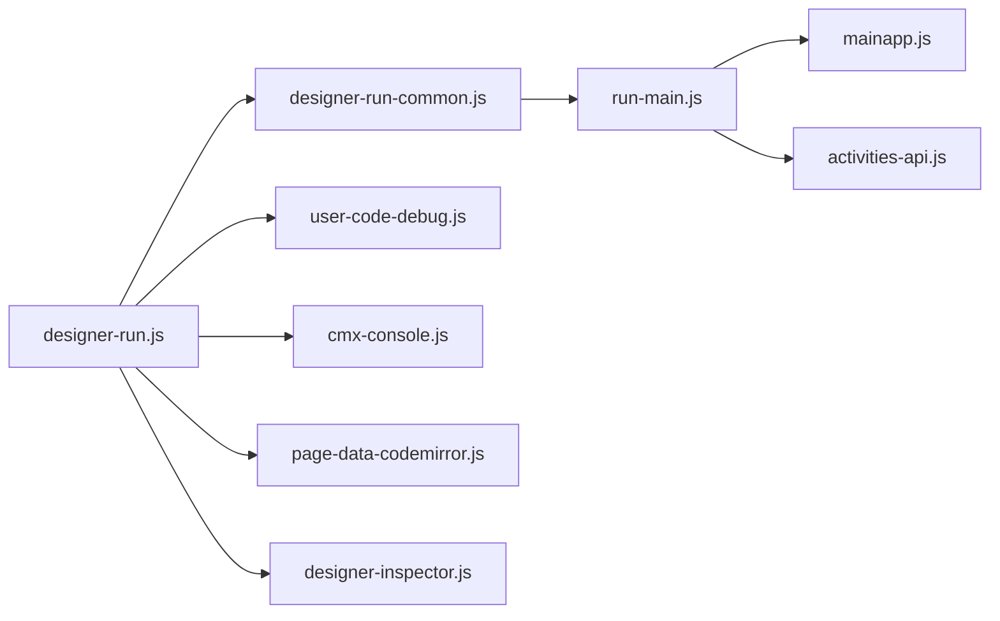

# 用户代码调试

<cite>
**本文引用的文件**
- [user-code-debug.js](file://CMXHTMLDesigner/src/utils/user-code-debug.js)
- [mainapp.js](file://CMXHTMLDesigner/src/debug-portal/mainapp.js)
- [activities-api.js](file://CMXHTMLDesigner/src/debug-portal/activities-api.js)
- [designer-run.js](file://CMXHTMLDesigner/src/components/designer-app/designer-run.js)
- [designer-run-common.js](file://CMXHTMLDesigner/src/components/designer-app/designer-run-common.js)
- [run-main.js](file://CMXHTMLDesigner/src/run-main.js)
- [cmx-console.js](file://CMXHTMLDesigner/src/utils/cmx-console.js)
- [page-data-codemirror.js](file://CMXHTMLDesigner/src/components/designer-page-data/page-data-codemirror.js)
- [designer-inspector.js](file://CMXHTMLDesigner/src/components/designer-inspector.js)
- [workspace-native-pages.js](file://CMXPortalManager/src/lib/workspace-native-pages.js)
- [mainapp-workspace-context-page-view.md](file://CMXPortalManager/docs/mainapp-workspace-context-page-view.md)
</cite>

## 目录
1. [简介](#简介)
2. [项目结构](#项目结构)
3. [核心组件](#核心组件)
4. [架构总览](#架构总览)
5. [详细组件分析](#详细组件分析)
6. [依赖关系分析](#依赖关系分析)
7. [性能与监控](#性能与监控)
8. [故障排查指南](#故障排查指南)
9. [结论](#结论)
10. [附录](#附录)

## 简介
本指南面向需要在平台中安全地执行、调试和观察“用户代码”（事件脚本、函数脚本、服务脚本等）的开发者。文档围绕以下目标展开：
- 说明用户代码执行环境的安全隔离机制，包括沙箱模式与权限控制策略。
- 解释断点设置、变量检查与调用栈跟踪的实现原理与使用方式。
- 描述异常捕获与处理机制，以及错误信息的格式化与展示。
- 覆盖调试会话管理、上下文切换与性能监控要点。
- 提供调试工作流程的最佳实践、常见问题排查方法与性能优化建议。

## 项目结构
与用户代码调试相关的核心模块分布在设计器与调试门户中：
- 设计器侧负责将用户代码包装为可调试单元，注入 sourceURL、可选的断点指令，并通过新窗口或批处理模式启动调试。
- 调试门户提供工作区（Workspace）、视图（View）与作用域（Scope）管理，承载页面宿主元素、共享上下文与跨视图通信。
- 控制台桥接用于统一输出日志到 DevTools 与自定义面板。
- 编辑器集成支持在 CodeMirror 中插入断点，辅助快速定位问题。

**图表来源**
- [designer-run.js:13-50](file://CMXHTMLDesigner/src/components/designer-app/designer-run.js#L13-L50)
- [designer-run-common.js:10-21](file://CMXHTMLDesigner/src/components/designer-app/designer-run-common.js#L10-L21)
- [run-main.js:188-323](file://CMXHTMLDesigner/src/run-main.js#L188-L323)
- [mainapp.js:33-136](file://CMXHTMLDesigner/src/debug-portal/mainapp.js#L33-L136)
- [activities-api.js:88-125](file://CMXHTMLDesigner/src/debug-portal/activities-api.js#L88-L125)
- [user-code-debug.js:18-37](file://CMXHTMLDesigner/src/utils/user-code-debug.js#L18-L37)
- [cmx-console.js:37-79](file://CMXHTMLDesigner/src/utils/cmx-console.js#L37-L79)
- [page-data-codemirror.js:63-72](file://CMXHTMLDesigner/src/components/designer-page-data/page-data-codemirror.js#L63-L72)
- [designer-inspector.js:695-704](file://CMXHTMLDesigner/src/components/designer-inspector.js#L695-L704)

**章节来源**
- [designer-run.js:13-50](file://CMXHTMLDesigner/src/components/designer-app/designer-run.js#L13-L50)
- [designer-run-common.js:10-21](file://CMXHTMLDesigner/src/components/designer-app/designer-run-common.js#L10-L21)
- [run-main.js:188-323](file://CMXHTMLDesigner/src/run-main.js#L188-L323)
- [mainapp.js:33-136](file://CMXHTMLDesigner/src/debug-portal/mainapp.js#L33-L136)
- [activities-api.js:88-125](file://CMXHTMLDesigner/src/debug-portal/activities-api.js#L88-L125)
- [user-code-debug.js:18-37](file://CMXHTMLDesigner/src/utils/user-code-debug.js#L18-L37)
- [cmx-console.js:37-79](file://CMXHTMLDesigner/src/utils/cmx-console.js#L37-L79)
- [page-data-codemirror.js:63-72](file://CMXHTMLDesigner/src/components/designer-page-data/page-data-codemirror.js#L63-L72)
- [designer-inspector.js:695-704](file://CMXHTMLDesigner/src/components/designer-inspector.js#L695-L704)

## 核心组件
- 用户代码装饰器：为每条用户代码生成稳定的 sourceURL，并在调试模式下于首行注入断点指令，使浏览器 DevTools 能按虚拟文件持久化断点。
- 调试门户主应用：提供工作区（Workspace）、活动作用域（ActivityScope）与共享上下文（ContextHost），实现视图注册、注销与跨视图访问。
- 运行入口：负责从设计器传递的 HTML/脚本数据创建调试标签页，激活对应工作区并执行页面脚本。
- 控制台桥接：劫持全局 console 方法，双写到 DevTools 与自定义 sink，便于在调试面板集中查看日志。
- 编辑器集成：在 CodeMirror 中便捷插入断点，提升调试效率。
- 活动栏 API：加载并缓存活动定义，保证调试界面与门户一致的活动导航能力。

**章节来源**
- [user-code-debug.js:18-37](file://CMXHTMLDesigner/src/utils/user-code-debug.js#L18-L37)
- [mainapp.js:33-136](file://CMXHTMLDesigner/src/debug-portal/mainapp.js#L33-L136)
- [run-main.js:188-323](file://CMXHTMLDesigner/src/run-main.js#L188-L323)
- [cmx-console.js:37-79](file://CMXHTMLDesigner/src/utils/cmx-console.js#L37-L79)
- [page-data-codemirror.js:63-72](file://CMXHTMLDesigner/src/components/designer-page-data/page-data-codemirror.js#L63-L72)
- [designer-inspector.js:695-704](file://CMXHTMLDesigner/src/components/designer-inspector.js#L695-L704)
- [activities-api.js:88-125](file://CMXHTMLDesigner/src/debug-portal/activities-api.js#L88-L125)

## 架构总览
下图展示了从设计器触发调试到调试门户执行用户代码的整体流程，包括会话初始化、工作区创建、视图注册与脚本执行。

**图表来源**
- [designer-run.js:13-50](file://CMXHTMLDesigner/src/components/designer-app/designer-run.js#L13-L50)
- [run-main.js:188-323](file://CMXHTMLDesigner/src/run-main.js#L188-L323)
- [mainapp.js:185-287](file://CMXHTMLDesigner/src/debug-portal/mainapp.js#L185-L287)

## 详细组件分析

### 用户代码装饰与断点注入
- 稳定 sourceURL：通过组合 kind 与部件生成唯一且稳定的 URL，使 DevTools 将每条用户代码视为独立虚拟文件，断点可持久化。
- 调试模式开关：读取/写入 sessionStorage 中的调试标志；当开启时，在用户代码首行注入断点指令，进入即暂停。
- 运行时标志：将调试状态序列化为字面量，作为 window.__cmxDebug 的初始值注入导出/运行/调试页脚本中，供运行时判断是否启用断点。

**图表来源**
- [user-code-debug.js:18-37](file://CMXHTMLDesigner/src/utils/user-code-debug.js#L18-L37)
- [user-code-debug.js:39-59](file://CMXHTMLDesigner/src/utils/user-code-debug.js#L39-L59)

**章节来源**
- [user-code-debug.js:18-37](file://CMXHTMLDesigner/src/utils/user-code-debug.js#L18-L37)
- [user-code-debug.js:39-59](file://CMXHTMLDesigner/src/utils/user-code-debug.js#L39-L59)

### 调试会话与工作区管理
- 工作区（Workspace）：每个 content 标签对应一个工作区，包含共享上下文、视图集合与区域列表。
- 活动作用域（ActivityScope）：结构与 Workspace 类似但仅含 explorer 区域，调试主页面不主动创建，保留 API 对齐。
- 视图注册与注销：页面 CE 通过 getPageApi() 暴露用户 API，调试门户将其冻结并附加系统字段（viewId、region、pageId），同时维护 host 引用以正确处理重复连接与销毁。
- 上下文（ContextHost）：提供 get/set/delete/snapshot/on/off 能力，仅 set/delete 触发 change 事件，避免裸赋值带来的通知缺失。

**图表来源**
- [mainapp.js:33-136](file://CMXHTMLDesigner/src/debug-portal/mainapp.js#L33-L136)

**章节来源**
- [mainapp.js:33-136](file://CMXHTMLDesigner/src/debug-portal/mainapp.js#L33-L136)
- [mainapp.js:185-287](file://CMXHTMLDesigner/src/debug-portal/mainapp.js#L185-L287)
- [mainapp.js:296-315](file://CMXHTMLDesigner/src/debug-portal/mainapp.js#L296-L315)

### 页面脚本执行与上下文切换
- 运行入口在执行页面脚本前，临时设置 globalThis.workspace 与 __cmxTemplateRoot，确保顶层脚本能在同步执行期捕获 workspace。
- 对非激活标签，先激活并强制布局后再执行脚本，避免 UI5/自定义元素在隐藏容器内无法正确绑定事件的问题。
- 关闭调试 tab 时回收对应 workspace，释放资源。

**图表来源**
- [run-main.js:188-238](file://CMXHTMLDesigner/src/run-main.js#L188-L238)
- [run-main.js:243-323](file://CMXHTMLDesigner/src/run-main.js#L243-L323)

**章节来源**
- [run-main.js:188-238](file://CMXHTMLDesigner/src/run-main.js#L188-L238)
- [run-main.js:243-323](file://CMXHTMLDesigner/src/run-main.js#L243-L323)

### 控制台桥接与日志收集
- 安装控制台桥接后，所有 console.log/warn/error 会双写到原生 DevTools 与自定义 sink，便于在调试面板集中查看。
- 错误对象会被格式化为堆栈或名称+消息，复杂对象尝试 JSON 序列化，失败则降级为字符串。
- 支持卸载桥接，恢复原始 console 行为。

**图表来源**
- [cmx-console.js:37-79](file://CMXHTMLDesigner/src/utils/cmx-console.js#L37-L79)

**章节来源**
- [cmx-console.js:37-79](file://CMXHTMLDesigner/src/utils/cmx-console.js#L37-L79)

### 编辑器集成与断点插入
- 在 CodeMirror 视图中，可在当前光标处插入断点指令，并自动聚焦编辑器，提升调试效率。
- 事件面板也提供插入断点的快捷操作，便于在事件脚本中快速定位问题。

**章节来源**
- [page-data-codemirror.js:63-72](file://CMXHTMLDesigner/src/components/designer-page-data/page-data-codemirror.js#L63-L72)
- [designer-inspector.js:695-704](file://CMXHTMLDesigner/src/components/designer-inspector.js#L695-L704)

### 活动栏与调试界面一致性
- 活动栏定义通过 GET 接口获取并进行规范化校验，缓存结果以避免重复请求。
- 调试门户复用与门户一致的侧栏渲染逻辑，保证调试体验与生产界面一致。

**章节来源**
- [activities-api.js:88-125](file://CMXHTMLDesigner/src/debug-portal/activities-api.js#L88-L125)
- [activities-api.js:30-82](file://CMXHTMLDesigner/src/debug-portal/activities-api.js#L30-L82)

## 依赖关系分析
- 设计器运行模块依赖运行入口进行页面包装与多标签批量调试。
- 运行入口依赖调试门户的工作区与视图管理机制，确保脚本执行环境与上下文正确。
- 控制台桥接与用户代码装饰器为调试体验提供基础支撑。
- 活动栏 API 为调试界面提供与门户一致的导航能力。

**图表来源**
- [designer-run.js:13-50](file://CMXHTMLDesigner/src/components/designer-app/designer-run.js#L13-L50)
- [designer-run-common.js:10-21](file://CMXHTMLDesigner/src/components/designer-app/designer-run-common.js#L10-L21)
- [run-main.js:188-323](file://CMXHTMLDesigner/src/run-main.js#L188-L323)
- [mainapp.js:185-287](file://CMXHTMLDesigner/src/debug-portal/mainapp.js#L185-L287)
- [activities-api.js:88-125](file://CMXHTMLDesigner/src/debug-portal/activities-api.js#L88-L125)
- [user-code-debug.js:18-37](file://CMXHTMLDesigner/src/utils/user-code-debug.js#L18-L37)
- [cmx-console.js:37-79](file://CMXHTMLDesigner/src/utils/cmx-console.js#L37-L79)
- [page-data-codemirror.js:63-72](file://CMXHTMLDesigner/src/components/designer-page-data/page-data-codemirror.js#L63-L72)
- [designer-inspector.js:695-704](file://CMXHTMLDesigner/src/components/designer-inspector.js#L695-L704)

**章节来源**
- [designer-run.js:13-50](file://CMXHTMLDesigner/src/components/designer-app/designer-run.js#L13-L50)
- [run-main.js:188-323](file://CMXHTMLDesigner/src/run-main.js#L188-L323)
- [mainapp.js:185-287](file://CMXHTMLDesigner/src/debug-portal/mainapp.js#L185-L287)
- [activities-api.js:88-125](file://CMXHTMLDesigner/src/debug-portal/activities-api.js#L88-L125)

## 性能与监控
- 调试模式下的断点注入会增加首次执行开销，建议在开发阶段按需开启，避免影响性能敏感路径。
- 控制台桥接会在每次日志输出时进行格式化与双写，高频日志场景下可能带来额外开销，建议仅在调试期间启用。
- 运行入口对非激活标签的执行顺序进行了优化，先激活再执行，减少 UI5/CE 绑定失败导致的重渲染。
- 活动栏定义采用去重加载与缓存，避免重复网络请求。

[本节为通用性能讨论，不直接分析具体文件]

## 故障排查指南
- 调试窗口被拦截：若新窗口未弹出，检查浏览器弹窗拦截策略，允许调试窗口后重试。
- 脚本执行无响应：确认页面脚本在同步执行期捕获了 workspace，避免在 setTimeout 中再读取全局 workspace。
- 视图未注册或重复注册：检查页面 CE 是否正确调用 getPageApi()，并确保 viewId 唯一；调试门户会对重复连接做幂等处理。
- 上下文变更未生效：注意仅 set/delete 触发 change 事件，裸赋值不会通知监听者。
- 控制台日志丢失：确认已安装控制台桥接，并检查 sink 是否正常接收日志。
- 活动栏显示异常：检查活动定义接口返回是否符合规范，必要时查看缓存与解析结果。

**章节来源**
- [designer-run.js:13-50](file://CMXHTMLDesigner/src/components/designer-app/designer-run.js#L13-L50)
- [mainapp-workspace-context-page-view.md:79-110](file://CMXPortalManager/docs/mainapp-workspace-context-page-view.md#L79-L110)
- [mainapp.js:254-287](file://CMXHTMLDesigner/src/debug-portal/mainapp.js#L254-L287)
- [cmx-console.js:37-79](file://CMXHTMLDesigner/src/utils/cmx-console.js#L37-L79)
- [activities-api.js:88-125](file://CMXHTMLDesigner/src/debug-portal/activities-api.js#L88-L125)

## 结论
该调试体系通过稳定的 sourceURL、可控的断点注入、完善的工作区与上下文管理、以及统一的控制台桥接，为用户代码提供了安全、可观测且高效的调试环境。结合编辑器集成与活动栏一致性，开发者可以在设计与运行阶段获得一致的调试体验。在生产环境中，应谨慎启用调试功能，并结合权限控制与最小权限原则，确保用户代码执行的隔离性与安全性。

[本节为总结性内容，不直接分析具体文件]

## 附录
- 最佳实践
  - 在开发阶段开启调试模式，利用稳定 sourceURL 与 DevTools 断点持久化能力快速定位问题。
  - 在事件脚本中使用编辑器插入断点，配合控制台桥接集中查看日志。
  - 在页面顶层脚本同步捕获 workspace，避免异步读取导致的不一致。
  - 合理使用上下文共享，避免裸赋值，优先使用 set/get/delete 与 change 监听。
  - 对于高频日志场景，谨慎启用控制台桥接，或在关键路径上局部启用。
- 常见问题
  - 调试窗口被拦截：允许弹窗并重试。
  - 视图未注册：检查 getPageApi() 返回值与 viewId 唯一性。
  - 上下文变更未触发：确认使用 set/delete 而非裸赋值。
  - 活动栏异常：检查接口返回与缓存解析。

[本节为补充信息，不直接分析具体文件]