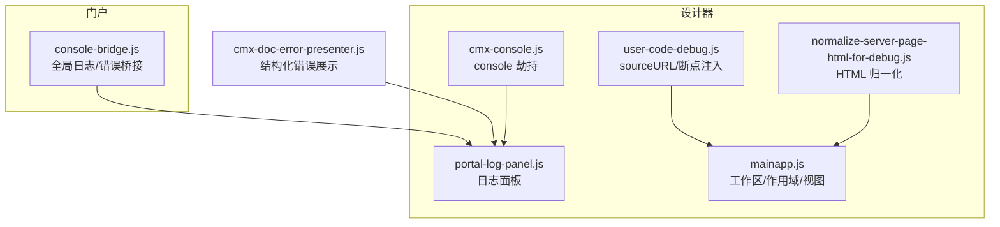
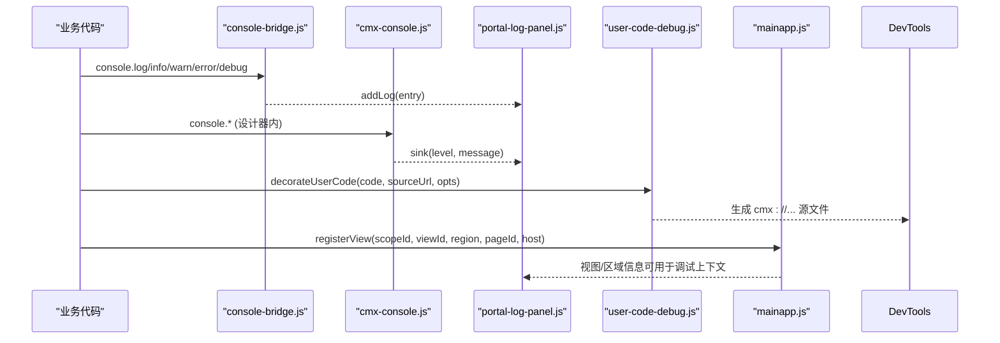
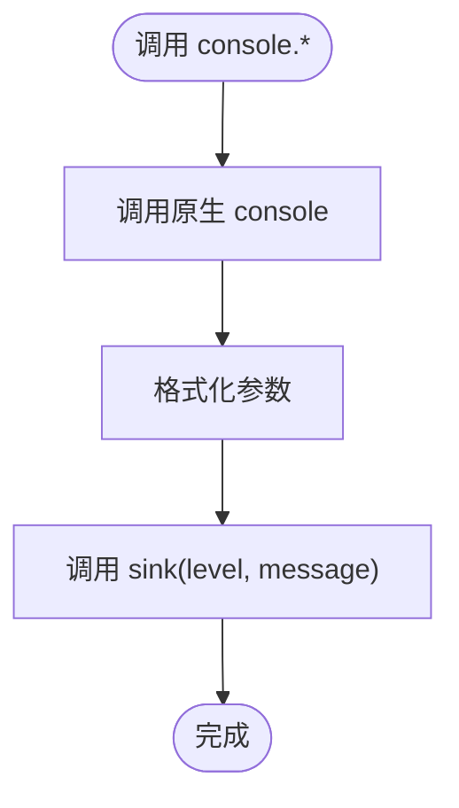
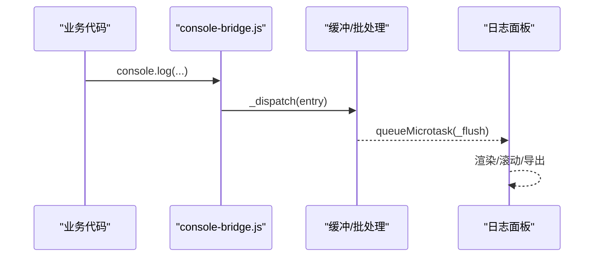
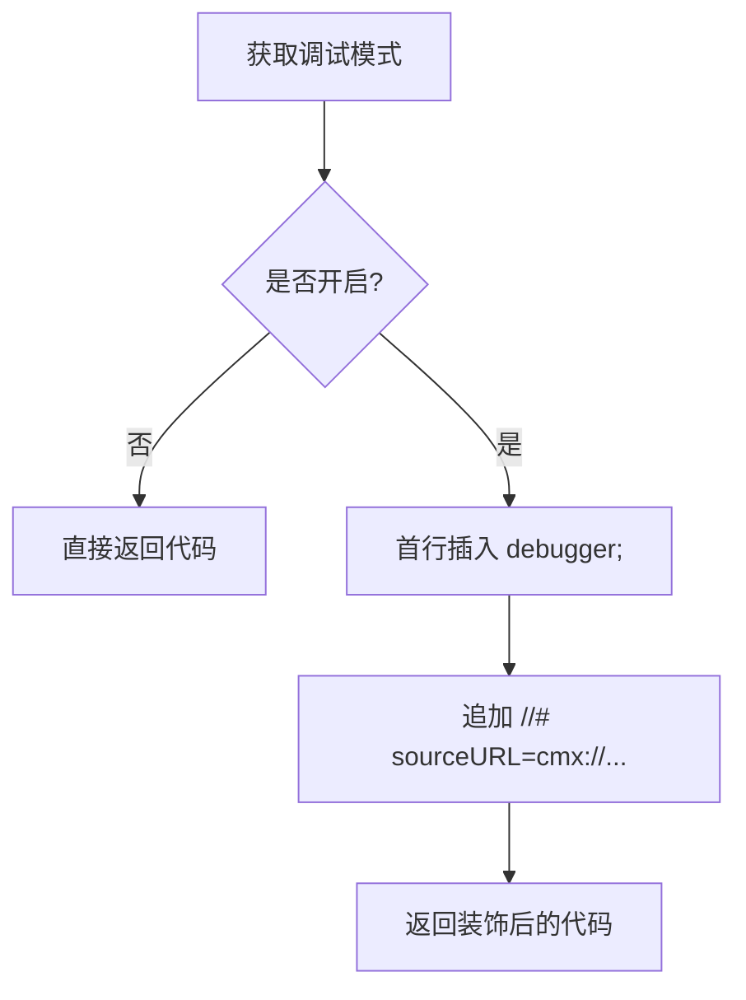
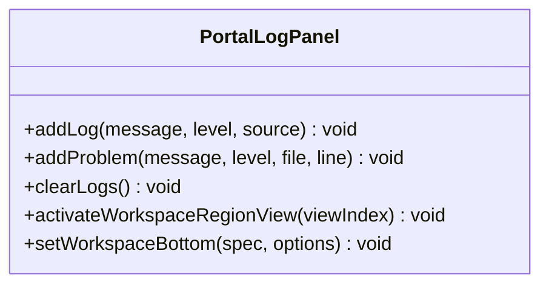
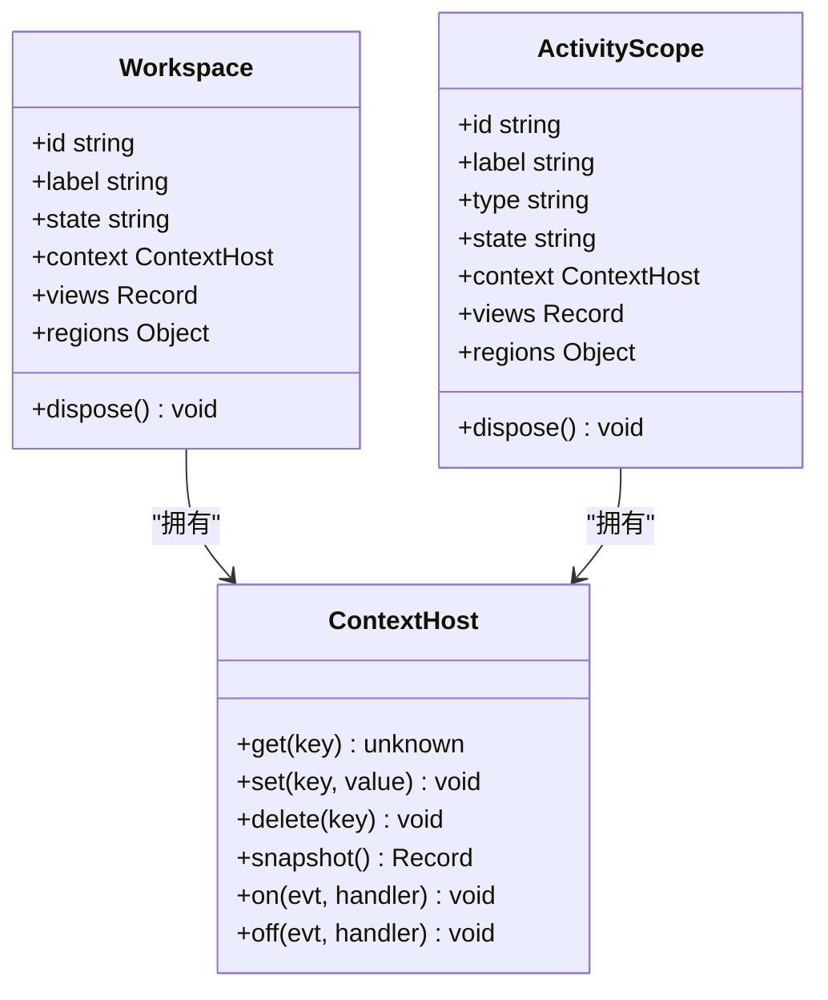
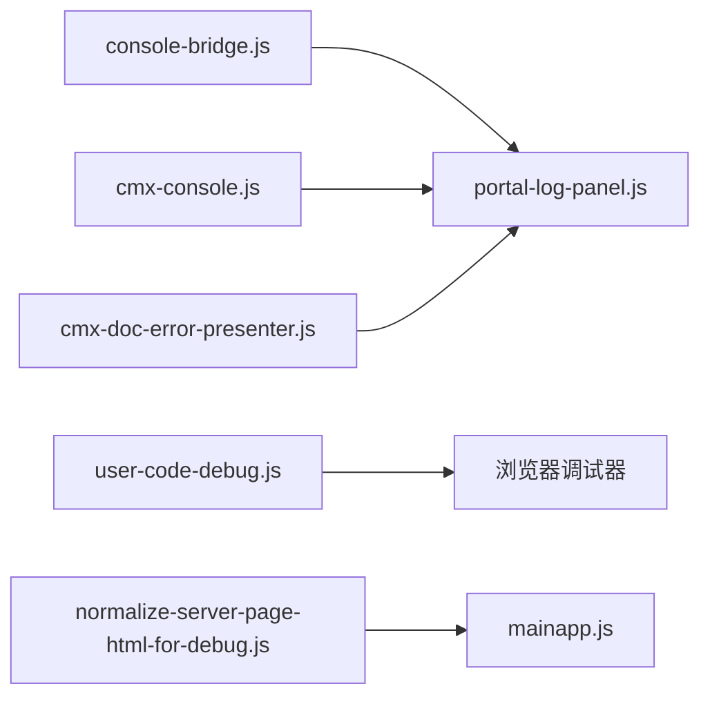

# 调试工具集

<cite>
**本文引用的文件**
- [CMXHTMLDesigner/src/utils/cmx-console.js](file://CMXHTMLDesigner/src/utils/cmx-console.js)
- [CMXHTMLDesigner/src/utils/user-code-debug.js](file://CMXHTMLDesigner/src/utils/user-code-debug.js)
- [CMXHTMLDesigner/src/debug-portal/portal-log-panel.js](file://CMXHTMLDesigner/src/debug-portal/portal-log-panel.js)
- [CMXPortalManager/src/lib/console-bridge.js](file://CMXPortalManager/src/lib/console-bridge.js)
- [CMXHTMLDesigner/src/debug-portal/mainapp.js](file://CMXHTMLDesigner/src/debug-portal/mainapp.js)
- [CMXHTMLDesigner/src/utils/normalize-server-page-html-for-debug.js](file://CMXHTMLDesigner/src/utils/normalize-server-page-html-for-debug.js)
- [packages/cmx-data-comp/src/lib/cmx-doc-error-presenter.js](file://packages/cmx-data-comp/src/lib/cmx-doc-error-presenter.js)
</cite>

## 目录
1. [简介](#简介)
2. [项目结构](#项目结构)
3. [核心组件](#核心组件)
4. [架构总览](#架构总览)
5. [详细组件分析](#详细组件分析)
6. [依赖关系分析](#依赖关系分析)
7. [性能与内存优化建议](#性能与内存优化建议)
8. [故障排查指南](#故障排查指南)
9. [结论](#结论)
10. [附录：调试工作流与最佳实践](#附录调试工作流与最佳实践)

## 简介
本指南面向在 CMX 企业门户与设计器中开发、集成和扩展“调试工具集”的工程师。文档围绕以下目标展开：
- 控制台日志系统的设计、日志级别管理与输出格式化
- 用户代码调试机制（断点注入、sourceURL 持久化、变量检查）
- 错误捕获与堆栈跟踪、异常处理与错误报告
- 性能分析与资源使用监控的实践建议
- 完整的调试工作流程、常见问题排查与优化建议

## 项目结构
调试能力横跨设计器与门户两个前端工程，关键位置如下：
- 设计器侧
  - 控制台桥接：劫持 console.log/warn/error，双写到 DevTools 与自定义 sink
  - 用户代码调试：为 new Function 生成的用户脚本注入 sourceURL 与可选 debugger 断点
  - 调试面板：日志、问题、终端、调试控制台等标签页，支持导出与溢出菜单
  - 调试主应用：工作区与作用域模型、视图注册/注销、上下文共享
  - 服务端 HTML 归一化：将保存的源码片段包装成可运行态 HTML，便于调试
- 门户侧
  - 全局 console/错误桥接：统一收集 console.*、window.error、unhandledrejection，限批 flush 到 sink
  - Agent Console：用于交互式诊断与执行（非本次重点，但可作为扩展入口）

图表来源
- [CMXHTMLDesigner/src/utils/cmx-console.js:1-84](file://CMXHTMLDesigner/src/utils/cmx-console.js#L1-L84)
- [CMXHTMLDesigner/src/debug-portal/portal-log-panel.js:1-520](file://CMXHTMLDesigner/src/debug-portal/portal-log-panel.js#L1-L520)
- [CMXHTMLDesigner/src/utils/user-code-debug.js:1-60](file://CMXHTMLDesigner/src/utils/user-code-debug.js#L1-L60)
- [CMXHTMLDesigner/src/debug-portal/mainapp.js:1-332](file://CMXHTMLDesigner/src/debug-portal/mainapp.js#L1-L332)
- [CMXHTMLDesigner/src/utils/normalize-server-page-html-for-debug.js:1-77](file://CMXHTMLDesigner/src/utils/normalize-server-page-html-for-debug.js#L1-L77)
- [CMXPortalManager/src/lib/console-bridge.js:1-169](file://CMXPortalManager/src/lib/console-bridge.js#L1-L169)
- [packages/cmx-data-comp/src/lib/cmx-doc-error-presenter.js:1-159](file://packages/cmx-data-comp/src/lib/cmx-doc-error-presenter.js#L1-L159)

章节来源
- [CMXHTMLDesigner/src/utils/cmx-console.js:1-84](file://CMXHTMLDesigner/src/utils/cmx-console.js#L1-L84)
- [CMXHTMLDesigner/src/debug-portal/portal-log-panel.js:1-520](file://CMXHTMLDesigner/src/debug-portal/portal-log-panel.js#L1-L520)
- [CMXHTMLDesigner/src/utils/user-code-debug.js:1-60](file://CMXHTMLDesigner/src/utils/user-code-debug.js#L1-L60)
- [CMXPortalManager/src/lib/console-bridge.js:1-169](file://CMXPortalManager/src/lib/console-bridge.js#L1-L169)
- [CMXHTMLDesigner/src/debug-portal/mainapp.js:1-332](file://CMXHTMLDesigner/src/debug-portal/mainapp.js#L1-L332)
- [CMXHTMLDesigner/src/utils/normalize-server-page-html-for-debug.js:1-77](file://CMXHTMLDesigner/src/utils/normalize-server-page-html-for-debug.js#L1-L77)
- [packages/cmx-data-comp/src/lib/cmx-doc-error-presenter.js:1-159](file://packages/cmx-data-comp/src/lib/cmx-doc-error-presenter.js#L1-L159)

## 核心组件
- 控制台日志桥接（设计器）
  - 劫持 window.console 的 log/warn/error，先调用原生方法，再转发到 sink
  - 提供安装/卸载开关，避免重复安装；对 sink 抛错做隔离，不影响业务
  - 参数格式化：undefined/null/Error/JSON 序列化兜底
- 控制台日志桥接（门户）
  - 单例安装，保留原始 console 引用，支持卸载还原
  - 同时监听 window.error 与 unhandledrejection，统一转成日志条目
  - 环形缓冲 + microtask 批量 flush，防止高频日志阻塞渲染线程
  - 内置过滤规则，抑制特定 i18n 缺失警告
- 用户代码调试
  - 生成稳定 sourceURL（cmx://...），使 DevTools Sources 按 URL 持久化断点
  - 调试模式开启时，在首行注入 debugger;，进入即暂停
  - 调试状态写入 sessionStorage，并暴露运行时字面量供导出/运行页使用
- 调试日志面板
  - 多标签：输出、问题、终端、调试控制台
  - 支持添加日志/问题、清空、导出文本、底部工作区视图挂载
  - 溢出菜单自适应布局，徽章提示未读
- 调试主应用（Workspace/ActivityScope）
  - 提供 ContextHost 共享上下文（set/delete 触发 change）
  - Workspace/ActivityScope 管理 views、regions、host 映射
  - registerView/unregisterView 冻结 API 对象，附加系统字段
- 服务端 HTML 归一化
  - 将保存的源码片段包装为可运行态 HTML，注入元数据与依赖
  - 兼容旧格式与新格式，确保事件与宿主生效
- 结构化错误展示
  - 将后端存储错误分类为冲突/校验/通用失败，输出友好标题、正文、明细与帮助码
  - 支持静默取消（AbortError），避免误弹窗

章节来源
- [CMXHTMLDesigner/src/utils/cmx-console.js:1-84](file://CMXHTMLDesigner/src/utils/cmx-console.js#L1-L84)
- [CMXPortalManager/src/lib/console-bridge.js:1-169](file://CMXPortalManager/src/lib/console-bridge.js#L1-L169)
- [CMXHTMLDesigner/src/utils/user-code-debug.js:1-60](file://CMXHTMLDesigner/src/utils/user-code-debug.js#L1-L60)
- [CMXHTMLDesigner/src/debug-portal/portal-log-panel.js:1-520](file://CMXHTMLDesigner/src/debug-portal/portal-log-panel.js#L1-L520)
- [CMXHTMLDesigner/src/debug-portal/mainapp.js:1-332](file://CMXHTMLDesigner/src/debug-portal/mainapp.js#L1-L332)
- [CMXHTMLDesigner/src/utils/normalize-server-page-html-for-debug.js:1-77](file://CMXHTMLDesigner/src/utils/normalize-server-page-html-for-debug.js#L1-L77)
- [packages/cmx-data-comp/src/lib/cmx-doc-error-presenter.js:1-159](file://packages/cmx-data-comp/src/lib/cmx-doc-error-presenter.js#L1-L159)

## 架构总览
下图展示了从业务代码到调试面板的数据流：业务代码通过 console.* 或抛出异常，被桥接层捕获后汇聚到日志面板；用户代码经 sourceURL 装饰后可在 DevTools 设置断点；服务端返回的页面片段被归一化为可运行态，便于调试。

图表来源
- [CMXPortalManager/src/lib/console-bridge.js:88-135](file://CMXPortalManager/src/lib/console-bridge.js#L88-L135)
- [CMXHTMLDesigner/src/utils/cmx-console.js:37-79](file://CMXHTMLDesigner/src/utils/cmx-console.js#L37-L79)
- [CMXHTMLDesigner/src/debug-portal/portal-log-panel.js:67-84](file://CMXHTMLDesigner/src/debug-portal/portal-log-panel.js#L67-L84)
- [CMXHTMLDesigner/src/utils/user-code-debug.js:18-37](file://CMXHTMLDesigner/src/utils/user-code-debug.js#L18-L37)
- [CMXHTMLDesigner/src/debug-portal/mainapp.js:254-287](file://CMXHTMLDesigner/src/debug-portal/mainapp.js#L254-L287)

## 详细组件分析

### 控制台日志系统（设计器）
- 设计要点
  - 保留原生 console 引用以避免递归与样式丢失
  - 安装/卸载可控，适合 HMR 与测试环境
  - sink 内部异常隔离，保证业务稳定性
- 数据流
  - 业务 console.* → 原生输出 → sink('level', formattedMessage)
  - 参数格式化：undefined/null/Error/JSON 序列化兜底
- 复杂度
  - 每次日志 O(n) 字符串拼接与 JSON 序列化，sink 实现应避免重计算
- 优化建议
  - 在 sink 端做去重/合并/节流
  - 大对象按需序列化，避免全量 JSON.stringify

图表来源
- [CMXHTMLDesigner/src/utils/cmx-console.js:37-79](file://CMXHTMLDesigner/src/utils/cmx-console.js#L37-L79)

章节来源
- [CMXHTMLDesigner/src/utils/cmx-console.js:1-84](file://CMXHTMLDesigner/src/utils/cmx-console.js#L1-L84)

### 控制台日志系统（门户）
- 设计要点
  - 单例安装，保留原 console，支持卸载还原
  - 同时捕获 window.error 与 unhandledrejection
  - 环形缓冲 + microtask 批量 flush，避免频繁 UI 更新
  - 内置过滤规则抑制特定 i18n 缺失警告
- 数据流
  - console.* / error / rejection → _dispatch → buffer → queueMicrotask(_flush) → sinks
- 复杂度
  - 新增日志 O(1)，flush 批次 O(k)（k 为待刷新条数）
- 优化建议
  - 合理设置 BUFFER_LIMIT，结合 sink 端聚合
  - 对高频日志进行采样或合并

图表来源
- [CMXPortalManager/src/lib/console-bridge.js:59-83](file://CMXPortalManager/src/lib/console-bridge.js#L59-L83)
- [CMXPortalManager/src/lib/console-bridge.js:88-135](file://CMXPortalManager/src/lib/console-bridge.js#L88-L135)

章节来源
- [CMXPortalManager/src/lib/console-bridge.js:1-169](file://CMXPortalManager/src/lib/console-bridge.js#L1-L169)

### 用户代码调试机制（断点与 sourceURL）
- 设计要点
  - 为 new Function 生成的用户代码追加稳定的 sourceURL（cmx://...），使 DevTools 按 URL 持久化断点
  - 调试模式开启时在首行注入 debugger;，进入即暂停
  - 调试状态持久化至 sessionStorage，并提供运行时字面量供导出/运行页使用
- 使用方式
  - 生成 sourceURL：makeSourceUrl(kind, parts)
  - 装饰代码：decorateUserCode(code, sourceUrl, { breakOnEnter })
  - 读取/设置调试模式：getDesignerDebugMode/setDesignerDebugMode/debugModeRuntimeLiteral
- 复杂度
  - 字符串拼接与正则替换，O(L)（L 为代码长度）
- 优化建议
  - 仅在调试模式开启时注入 debugger;
  - 复用 sourceURL 生成逻辑，避免重复创建

图表来源
- [CMXHTMLDesigner/src/utils/user-code-debug.js:18-37](file://CMXHTMLDesigner/src/utils/user-code-debug.js#L18-L37)
- [CMXHTMLDesigner/src/utils/user-code-debug.js:41-59](file://CMXHTMLDesigner/src/utils/user-code-debug.js#L41-L59)

章节来源
- [CMXHTMLDesigner/src/utils/user-code-debug.js:1-60](file://CMXHTMLDesigner/src/utils/user-code-debug.js#L1-L60)

### 调试日志面板（输出/问题/终端/调试控制台）
- 功能
  - 多标签切换、日志条目追加、问题列表渲染、清空、导出文本
  - 底部工作区视图挂载（cmx_ws_bottom），支持激活与缓存根节点复用
  - 溢出菜单自适应布局，徽章提示未读
- 数据结构
  - 日志条目：id、message、level、source、time
  - 问题条目：message、level、file、line
- 复杂度
  - 追加日志 O(1) DOM 操作；渲染问题列表 O(m)（m 为问题数量）
- 优化建议
  - 大量日志时使用虚拟滚动或分页
  - 导出前合并/压缩内容

图表来源
- [CMXHTMLDesigner/src/debug-portal/portal-log-panel.js:25-144](file://CMXHTMLDesigner/src/debug-portal/portal-log-panel.js#L25-L144)
- [CMXHTMLDesigner/src/debug-portal/portal-log-panel.js:470-516](file://CMXHTMLDesigner/src/debug-portal/portal-log-panel.js#L470-L516)

章节来源
- [CMXHTMLDesigner/src/debug-portal/portal-log-panel.js:1-520](file://CMXHTMLDesigner/src/debug-portal/portal-log-panel.js#L1-L520)

### 调试主应用（工作区与作用域）
- 设计要点
  - ContextHost：基于 Map 的键值共享，仅 set/delete 触发 change 事件
  - Workspace/ActivityScope：管理 views、regions、host 映射，支持 dispose
  - registerView/unregisterView：冻结 API 对象，附加系统字段（__viewId/__region/__pageId）
  - scopeIdFromDom：由 DOM 上溯定位所属作用域
- 复杂度
  - 注册/注销 O(1)~O(r)（r 为区域数量）
- 优化建议
  - 避免频繁注册/注销同一视图
  - 合理使用 snapshot 进行只读访问

图表来源
- [CMXHTMLDesigner/src/debug-portal/mainapp.js:33-101](file://CMXHTMLDesigner/src/debug-portal/mainapp.js#L33-L101)
- [CMXHTMLDesigner/src/debug-portal/mainapp.js:115-164](file://CMXHTMLDesigner/src/debug-portal/mainapp.js#L115-L164)
- [CMXHTMLDesigner/src/debug-portal/mainapp.js:254-332](file://CMXHTMLDesigner/src/debug-portal/mainapp.js#L254-L332)

章节来源
- [CMXHTMLDesigner/src/debug-portal/mainapp.js:1-332](file://CMXHTMLDesigner/src/debug-portal/mainapp.js#L1-L332)

### 服务端 HTML 归一化（调试用）
- 设计要点
  - 将保存的源码片段包装为可运行态 HTML，注入 __designer_meta__ 与 cmx 脚本块
  - 兼容旧格式（仅 HTML 片段）与新格式（含坐标元信息）
  - 剥离设计时脚本，确保运行态行为一致
- 复杂度
  - DOMParser 解析与字符串拼接，O(N)（N 为 HTML 大小）
- 优化建议
  - 对超大 HTML 分片处理或懒加载
  - 缓存已归一化的结果，避免重复转换

章节来源
- [CMXHTMLDesigner/src/utils/normalize-server-page-html-for-debug.js:1-77](file://CMXHTMLDesigner/src/utils/normalize-server-page-html-for-debug.js#L1-L77)

### 错误捕获与堆栈跟踪（结构化错误展示）
- 设计要点
  - 将后端存储错误分类为冲突/校验/通用失败，输出友好标题、正文、明细与帮助码
  - 支持静默取消（AbortError），避免误弹窗
  - 标记“已呈现”，避免全局 unhandledrejection 再次弹窗造成重复提示
- 复杂度
  - 错误描述与展示 O(1)~O(v)（v 为 violations 数量）
- 优化建议
  - 对长明细进行折叠/分页
  - 结合日志面板记录错误上下文

章节来源
- [packages/cmx-data-comp/src/lib/cmx-doc-error-presenter.js:1-159](file://packages/cmx-data-comp/src/lib/cmx-doc-error-presenter.js#L1-L159)

## 依赖关系分析
- 松耦合设计
  - 日志桥接与日志面板通过 sink 接口解耦，便于替换实现
  - 用户代码调试与运行/导出流程通过 sourceURL 与调试模式开关解耦
  - 错误展示与上层调用方通过 describeDocError/presentDocError 解耦
- 潜在循环依赖
  - 当前模块间以单向依赖为主，未发现明显循环
- 外部依赖
  - DevTools（Sources/Console）、DOMParser、sessionStorage、Fetch/SSE（Agent Console）

图表来源
- [CMXPortalManager/src/lib/console-bridge.js:88-135](file://CMXPortalManager/src/lib/console-bridge.js#L88-L135)
- [CMXHTMLDesigner/src/utils/cmx-console.js:37-79](file://CMXHTMLDesigner/src/utils/cmx-console.js#L37-L79)
- [CMXHTMLDesigner/src/utils/user-code-debug.js:18-37](file://CMXHTMLDesigner/src/utils/user-code-debug.js#L18-L37)
- [CMXHTMLDesigner/src/utils/normalize-server-page-html-for-debug.js:13-76](file://CMXHTMLDesigner/src/utils/normalize-server-page-html-for-debug.js#L13-L76)
- [packages/cmx-data-comp/src/lib/cmx-doc-error-presenter.js:87-159](file://packages/cmx-data-comp/src/lib/cmx-doc-error-presenter.js#L87-L159)

章节来源
- [CMXPortalManager/src/lib/console-bridge.js:1-169](file://CMXPortalManager/src/lib/console-bridge.js#L1-L169)
- [CMXHTMLDesigner/src/utils/cmx-console.js:1-84](file://CMXHTMLDesigner/src/utils/cmx-console.js#L1-L84)
- [CMXHTMLDesigner/src/utils/user-code-debug.js:1-60](file://CMXHTMLDesigner/src/utils/user-code-debug.js#L1-L60)
- [CMXHTMLDesigner/src/utils/normalize-server-page-html-for-debug.js:1-77](file://CMXHTMLDesigner/src/utils/normalize-server-page-html-for-debug.js#L1-L77)
- [packages/cmx-data-comp/src/lib/cmx-doc-error-presenter.js:1-159](file://packages/cmx-data-comp/src/lib/cmx-doc-error-presenter.js#L1-L159)

## 性能与内存优化建议
- 日志系统
  - 使用门户侧 console-bridge 的缓冲与微任务批处理，避免高频 UI 更新
  - 在 sink 端实现去重、采样、合并，减少 DOM 操作
  - 对大对象采用延迟序列化或摘要展示
- 用户代码调试
  - 仅在调试模式开启时注入 debugger;，减少不必要的中断
  - 复用 sourceURL 生成逻辑，避免重复字符串拼接
- 日志面板
  - 大数据量场景考虑虚拟滚动或分页
  - 导出前压缩内容，限制导出条数
- 错误展示
  - 对长明细进行折叠/分页，避免一次性渲染过多 DOM
  - 结合日志面板记录错误上下文，便于回溯
- 内存泄漏检测
  - 使用浏览器 Memory 面板录制 Heap Snapshot，对比前后快照查找残留引用
  - 关注 ContextHost 的 change handlers 与 workspace 的 hosts map 是否正确清理
- 资源使用监控
  - 使用 Performance 面板观察长任务与重排重绘
  - 对 SSE/网络请求进行采样与超时控制，避免资源占用过高

[本节为通用指导，不直接分析具体文件]

## 故障排查指南
- 日志未显示
  - 检查是否已安装 console-bridge 或 cmx-console tap
  - 确认 sink 已正确注册且无异常
  - 查看是否触发了内置过滤规则（如 i18n 缺失警告）
- 断点无效
  - 确认用户代码已通过 decorateUserCode 注入 sourceURL
  - 检查调试模式是否开启，首行是否包含 debugger;
  - 在 DevTools Sources 中查找 cmx://... 对应源文件
- 错误重复弹窗
  - 确认错误已被 presentDocError 标记“已呈现”，避免全局 unhandledrejection 再次弹窗
  - 检查 AbortError 是否被静默处理
- 面板卡顿
  - 减少日志频率，启用批处理
  - 对日志面板启用虚拟滚动或分页
  - 避免在 sink 中进行重计算或同步阻塞操作

章节来源
- [CMXPortalManager/src/lib/console-bridge.js:59-83](file://CMXPortalManager/src/lib/console-bridge.js#L59-L83)
- [CMXHTMLDesigner/src/utils/user-code-debug.js:18-37](file://CMXHTMLDesigner/src/utils/user-code-debug.js#L18-L37)
- [packages/cmx-data-comp/src/lib/cmx-doc-error-presenter.js:87-159](file://packages/cmx-data-comp/src/lib/cmx-doc-error-presenter.js#L87-L159)

## 结论
本调试工具集通过分层设计实现了：
- 统一的日志采集与展示（设计器与门户协同）
- 可断点化的用户代码调试（sourceURL 与调试模式）
- 结构化的错误捕获与展示（分类、明细、帮助码）
- 可扩展的工作区与作用域模型（便于调试上下文管理）
- 服务端 HTML 归一化（便于调试运行态）

建议在生产环境中谨慎启用高开销的调试功能，并结合性能与内存工具进行持续优化。

[本节为总结性内容，不直接分析具体文件]

## 附录：调试工作流与最佳实践
- 启动调试
  - 在设计器中启用调试模式，确保 user-code-debug 注入 sourceURL 与 debugger;
  - 在门户中安装 console-bridge，注册日志 sink（如 portal-log-panel）
- 设置断点
  - 在 DevTools Sources 中找到 cmx://... 对应源文件，设置断点
  - 利用 mainapp 的 registerView 获取视图上下文，便于变量检查
- 收集日志
  - 使用 console.* 输出关键路径信息，配合 portal-log-panel 导出日志
  - 对高频日志进行采样或合并，避免性能影响
- 处理错误
  - 使用 presentDocError 弹出结构化错误对话框，结合 helpCode 获取帮助
  - 对 AbortError 静默处理，避免误弹窗
- 性能优化
  - 使用 Performance 与 Memory 面板分析瓶颈
  - 对日志面板与错误展示进行虚拟化/分页优化
  - 合理配置缓冲大小与批处理策略

[本节为通用指导，不直接分析具体文件]