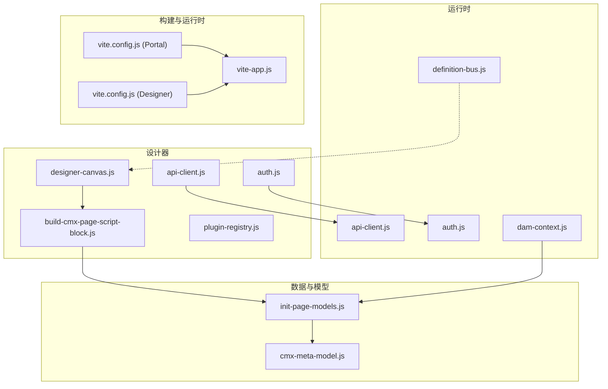
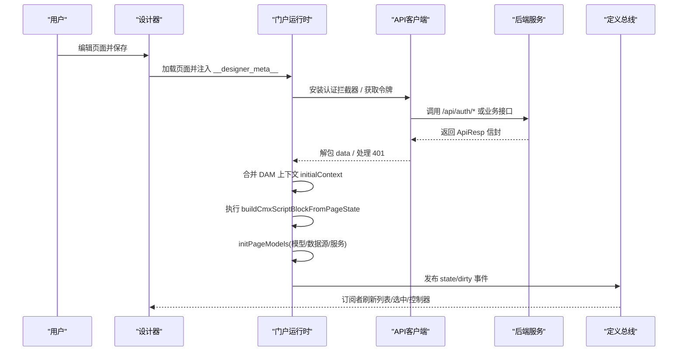
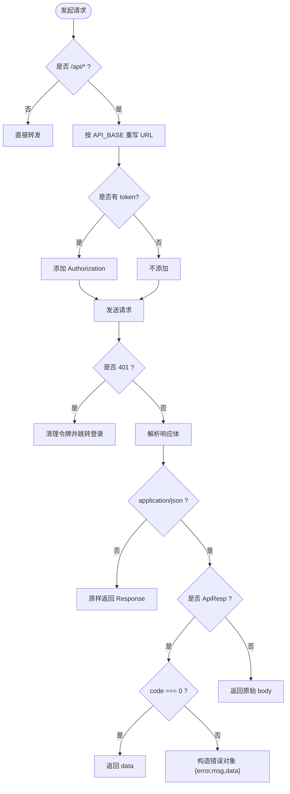
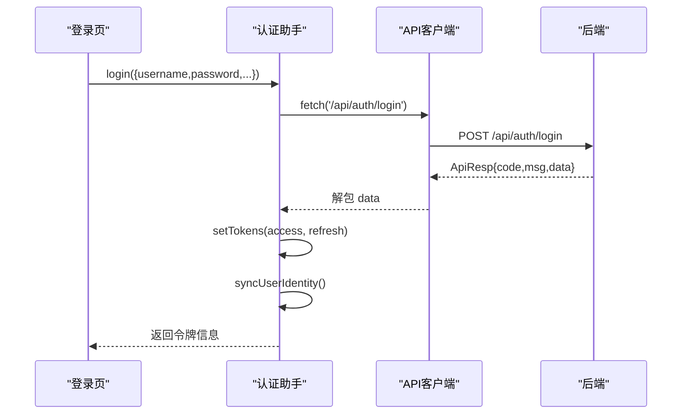
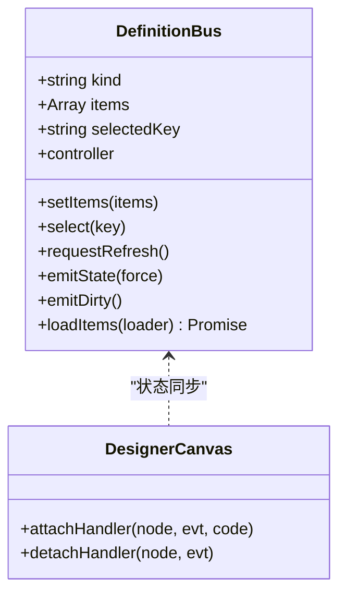
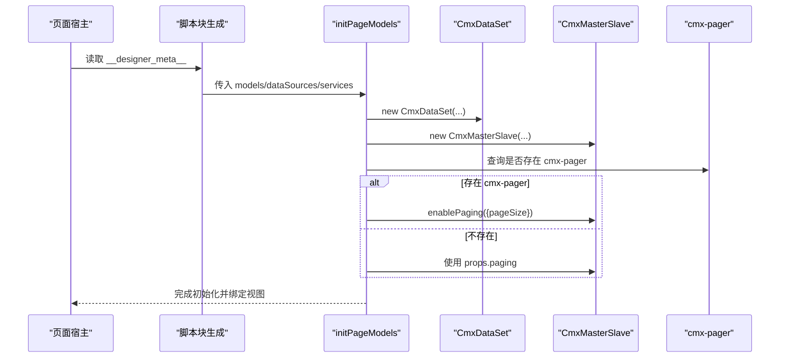
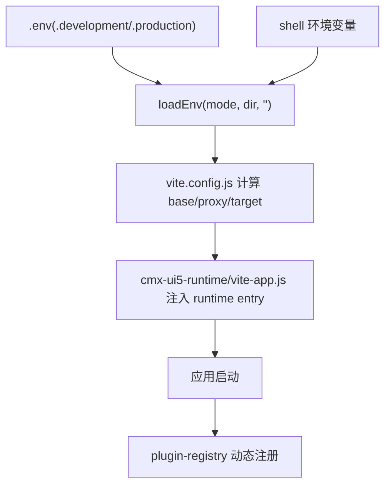
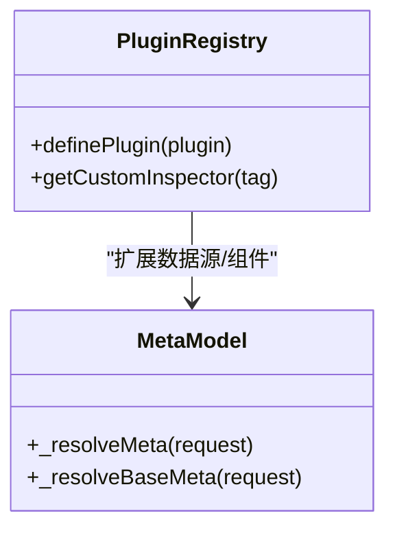
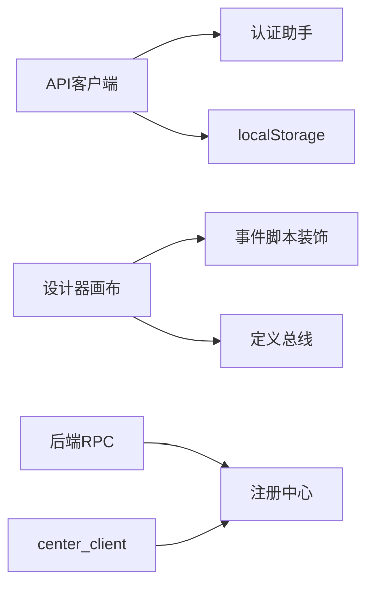

# 上下文注入

<cite>
**本文引用的文件**
- [CMXHTMLDesigner/src/lib/api-client.js](file://CMXHTMLDesigner/src/lib/api-client.js)
- [CMXPortalManager/src/lib/api-client.js](file://CMXPortalManager/src/lib/api-client.js)
- [CMXHTMLDesigner/src/lib/auth.js](file://CMXHTMLDesigner/src/lib/auth.js)
- [CMXPortalManager/src/lib/auth.js](file://CMXPortalManager/src/lib/auth.js)
- [CMXPortalManager/src/lib/definition-bus.js](file://CMXPortalManager/src/lib/definition-bus.js)
- [CMXHTMLDesigner/src/components/designer-canvas.js](file://CMXHTMLDesigner/src/components/designer-canvas.js)
- [CMXHTMLDesigner/src/utils/build-cmx-page-script-block.js](file://CMXHTMLDesigner/src/utils/build-cmx-page-script-block.js)
- [packages/cmx-data-comp/src/lib/init-page-models.js](file://packages/cmx-data-comp/src/lib/init-page-models.js)
- [packages/cmx-data-comp/src/lib/cmx-meta-model.js](file://packages/cmx-data-comp/src/lib/cmx-meta-model.js)
- [CMXPortalManager/src/lib/dam-context.js](file://CMXPortalManager/src/lib/dam-context.js)
- [CMXPortalManager/vite.config.js](file://CMXPortalManager/vite.config.js)
- [CMXHTMLDesigner/vite.config.js](file://CMXHTMLDesigner/vite.config.js)
- [packages/cmx-ui5-runtime/vite-app.js](file://packages/cmx-ui5-runtime/vite-app.js)
- [CMXHTMLDesigner/src/lib/plugin-registry.js](file://CMXHTMLDesigner/src/lib/plugin-registry.js)
- [documents/20260822_cmx-后端_三类服务通信配置关系总结.md](file://documents/20260822_cmx-后端_三类服务通信配置关系总结.md)
- [documents/20260822_cmx-center-client_服务定位map化与微服务接入Nacos方案.md](file://documents/20260822_cmx-center-client_服务定位map化与微服务接入Nacos方案.md)
- [docs/Rust-WASM-下一代企业应用架构.md](file://docs/Rust-WASM-下一代企业应用架构.md)
</cite>

## 目录
1. [简介](#简介)
2. [项目结构](#项目结构)
3. [核心组件](#核心组件)
4. [架构总览](#架构总览)
5. [详细组件分析](#详细组件分析)
6. [依赖分析](#依赖分析)
7. [性能考虑](#性能考虑)
8. [故障排查指南](#故障排查指南)
9. [结论](#结论)
10. [附录](#附录)

## 简介
本指南面向“上下文注入系统”，聚焦运行时上下文的构建、设计器与运行时的通信机制、环境变量与配置的加载顺序与优先级、上下文隔离与安全、以及扩展点与自定义注入。文档以代码为依据，提供可追溯的源码路径与图示，帮助读者从整体到细节理解上下文如何在设计期与运行期被装配、传递与消费。

## 项目结构
本项目由多个前端工程与共享包组成：
- CMXHTMLDesigner：页面设计器，负责事件脚本编译、画布交互、插件注册与元数据注入。
- CMXPortalManager：门户运行时，负责认证、API客户端、定义总线、上下文合并与页面渲染。
- packages/cmx-data-comp：数据模型与页面初始化库，负责模型实例化、分页、数据源解析等。
- packages/cmx-ui5-runtime：UI5运行时集成与Vite插件，负责运行时入口注入与资源托管。
- documents/docs：架构与配置说明文档，涵盖服务发现、RPC、Wasm沙箱等。

图表来源
- [CMXHTMLDesigner/src/lib/api-client.js:1-245](file://CMXHTMLDesigner/src/lib/api-client.js#L1-L245)
- [CMXPortalManager/src/lib/api-client.js:1-259](file://CMXPortalManager/src/lib/api-client.js#L1-L259)
- [CMXHTMLDesigner/src/components/designer-canvas.js:900-950](file://CMXHTMLDesigner/src/components/designer-canvas.js#L900-L950)
- [CMXHTMLDesigner/src/utils/build-cmx-page-script-block.js:286-304](file://CMXHTMLDesigner/src/utils/build-cmx-page-script-block.js#L286-L304)
- [packages/cmx-data-comp/src/lib/init-page-models.js:1023-1047](file://packages/cmx-data-comp/src/lib/init-page-models.js#L1023-L1047)
- [packages/cmx-data-comp/src/lib/cmx-meta-model.js:586-621](file://packages/cmx-data-comp/src/lib/cmx-meta-model.js#L586-L621)
- [CMXPortalManager/src/lib/dam-context.js:137-143](file://CMXPortalManager/src/lib/dam-context.js#L137-L143)
- [CMXPortalManager/vite.config.js:1-184](file://CMXPortalManager/vite.config.js#L1-L184)
- [CMXHTMLDesigner/vite.config.js:1-118](file://CMXHTMLDesigner/vite.config.js#L1-L118)
- [packages/cmx-ui5-runtime/vite-app.js:122-149](file://packages/cmx-ui5-runtime/vite-app.js#L122-L149)

章节来源
- [CMXPortalManager/vite.config.js:15-41](file://CMXPortalManager/vite.config.js#L15-L41)
- [CMXHTMLDesigner/vite.config.js:15-36](file://CMXHTMLDesigner/vite.config.js#L15-L36)
- [packages/cmx-ui5-runtime/vite-app.js:122-149](file://packages/cmx-ui5-runtime/vite-app.js#L122-L149)

## 核心组件
- API 客户端与认证拦截器：统一封装请求、自动注入令牌、处理信封与401跳转，支持跨域重写与二进制透传。
- 认证助手：登录/登出、当前用户同步、鉴权门控。
- 定义总线：跨模块共享状态（列表/选中/控制器），用于设计器与运行时的状态同步。
- 页面脚本块生成：将设计期模型与服务注入运行时代码，触发页面模型初始化。
- 页面模型初始化：创建数据集、列模型、主从协调器、弹性组合等，并绑定可视组件。
- DAM 上下文合并：将领域/应用/模块信息注入页面初始上下文。
- 插件注册：动态注册组件元数据与自定义检查器，扩展设计器能力。

章节来源
- [CMXHTMLDesigner/src/lib/api-client.js:1-245](file://CMXHTMLDesigner/src/lib/api-client.js#L1-L245)
- [CMXPortalManager/src/lib/api-client.js:1-259](file://CMXPortalManager/src/lib/api-client.js#L1-L259)
- [CMXHTMLDesigner/src/lib/auth.js:1-100](file://CMXHTMLDesigner/src/lib/auth.js#L1-L100)
- [CMXPortalManager/src/lib/auth.js:1-121](file://CMXPortalManager/src/lib/auth.js#L1-L121)
- [CMXPortalManager/src/lib/definition-bus.js:1-48](file://CMXPortalManager/src/lib/definition-bus.js#L1-L48)
- [CMXHTMLDesigner/src/utils/build-cmx-page-script-block.js:286-304](file://CMXHTMLDesigner/src/utils/build-cmx-page-script-block.js#L286-L304)
- [packages/cmx-data-comp/src/lib/init-page-models.js:1023-1047](file://packages/cmx-data-comp/src/lib/init-page-models.js#L1023-L1047)
- [packages/cmx-data-comp/src/lib/cmx-meta-model.js:586-621](file://packages/cmx-data-comp/src/lib/cmx-meta-model.js#L586-L621)
- [CMXPortalManager/src/lib/dam-context.js:137-143](file://CMXPortalManager/src/lib/dam-context.js#L137-L143)
- [CMXHTMLDesigner/src/lib/plugin-registry.js:1-95](file://CMXHTMLDesigner/src/lib/plugin-registry.js#L1-L95)

## 架构总览
下图展示上下文注入的关键流程：设计期通过脚本块注入模型与服务；运行时完成认证、API调用、上下文合并与模型初始化；设计器与运行期间通过事件总线进行状态同步。

图表来源
- [CMXHTMLDesigner/src/utils/build-cmx-page-script-block.js:286-304](file://CMXHTMLDesigner/src/utils/build-cmx-page-script-block.js#L286-L304)
- [packages/cmx-data-comp/src/lib/init-page-models.js:1023-1047](file://packages/cmx-data-comp/src/lib/init-page-models.js#L1023-L1047)
- [CMXPortalManager/src/lib/dam-context.js:137-143](file://CMXPortalManager/src/lib/dam-context.js#L137-L143)
- [CMXPortalManager/src/lib/api-client.js:174-259](file://CMXPortalManager/src/lib/api-client.js#L174-L259)
- [CMXHTMLDesigner/src/lib/api-client.js:167-245](file://CMXHTMLDesigner/src/lib/api-client.js#L167-L245)
- [CMXPortalManager/src/lib/definition-bus.js:19-47](file://CMXPortalManager/src/lib/definition-bus.js#L19-L47)

## 详细组件分析

### API 客户端与认证拦截器
- 职责：统一请求封装、自动注入 Authorization、解析 ApiResp 信封、401 跳转、跨域重写、二进制透传。
- 关键行为：
  - 全局拦截器仅对同源 /api/* 生效，避免污染第三方请求。
  - 非 JSON 响应（SSE/下载）原样透传，不拆信封。
  - 业务错误保留 msg/code/data，便于前端结构化展示。
- 安全要点：
  - 仅在必要时注入 token，避免泄露到非 API 请求。
  - 401 时清理本地令牌并重定向登录页，防止回环与超长 redirect。

图表来源
- [CMXPortalManager/src/lib/api-client.js:174-259](file://CMXPortalManager/src/lib/api-client.js#L174-L259)
- [CMXHTMLDesigner/src/lib/api-client.js:167-245](file://CMXHTMLDesigner/src/lib/api-client.js#L167-L245)

章节来源
- [CMXPortalManager/src/lib/api-client.js:1-259](file://CMXPortalManager/src/lib/api-client.js#L1-L259)
- [CMXHTMLDesigner/src/lib/api-client.js:1-245](file://CMXHTMLDesigner/src/lib/api-client.js#L1-L245)

### 认证流程与会话管理
- 登录：调用 /api/auth/login，写入 access_token/refresh_token，并异步同步用户身份到 localStorage。
- 登出：调用 /api/auth/logout，清理本地令牌与身份信息。
- 鉴权门控：启动时若未登录则重定向至登录页，带回跳参数。

图表来源
- [CMXPortalManager/src/lib/auth.js:33-64](file://CMXPortalManager/src/lib/auth.js#L33-L64)
- [CMXHTMLDesigner/src/lib/auth.js:33-47](file://CMXHTMLDesigner/src/lib/auth.js#L33-L47)
- [CMXPortalManager/src/lib/api-client.js:174-259](file://CMXPortalManager/src/lib/api-client.js#L174-L259)

章节来源
- [CMXPortalManager/src/lib/auth.js:1-121](file://CMXPortalManager/src/lib/auth.js#L1-L121)
- [CMXHTMLDesigner/src/lib/auth.js:1-100](file://CMXHTMLDesigner/src/lib/auth.js#L1-L100)

### 设计器与运行时的通信机制
- 事件脚本编译与绑定：设计器在画布中为节点附加事件处理器，使用 sourceUrl 装饰用户代码以便调试。
- 定义总线：跨模块共享 DCT/DOC 列表、选中项、控制器与脏标记，支持去重加载与局部刷新。
- 状态同步：运行时通过 busFor(kind) 获取总线实例，发布 state/dirty 事件，设计器侧监听更新。

图表来源
- [CMXPortalManager/src/lib/definition-bus.js:9-47](file://CMXPortalManager/src/lib/definition-bus.js#L9-L47)
- [CMXHTMLDesigner/src/components/designer-canvas.js:912-947](file://CMXHTMLDesigner/src/components/designer-canvas.js#L912-L947)

章节来源
- [CMXPortalManager/src/lib/definition-bus.js:1-48](file://CMXPortalManager/src/lib/definition-bus.js#L1-L48)
- [CMXHTMLDesigner/src/components/designer-canvas.js:900-950](file://CMXHTMLDesigner/src/components/designer-canvas.js#L900-L950)

### 运行时上下文构建与模型初始化
- 脚本块注入：设计期生成的脚本块包含 pageFns/pageServices/importmap，并在运行时调用 initPageModels。
- 模型初始化：创建 CmxDataSet/CmxColumnModel/CmxMasterSlave/FlexibleCombination，并将数据绑定到可视组件。
- 分页策略：优先检测 cmx-pager 组件启用分页，其次兼容 props.paging。

图表来源
- [CMXHTMLDesigner/src/utils/build-cmx-page-script-block.js:286-304](file://CMXHTMLDesigner/src/utils/build-cmx-page-script-block.js#L286-L304)
- [packages/cmx-data-comp/src/lib/init-page-models.js:1023-1047](file://packages/cmx-data-comp/src/lib/init-page-models.js#L1023-L1047)

章节来源
- [CMXHTMLDesigner/src/utils/build-cmx-page-script-block.js:286-304](file://CMXHTMLDesigner/src/utils/build-cmx-page-script-block.js#L286-L304)
- [packages/cmx-data-comp/src/lib/init-page-models.js:1023-1047](file://packages/cmx-data-comp/src/lib/init-page-models.js#L1023-L1047)

### 环境变量、全局配置与插件配置的加载顺序与优先级
- 环境变量分层：.env 默认值 → .env.production 覆盖 → shell 环境变量最高优先级（CI/CD）。
- 构建期注入：vite.config.js 通过 loadEnv(mode, dir, '') 加载所有前缀变量，仅 config 可见；生产 base 与代理目标由此决定。
- 运行时注入：UI5 运行时插件在 dev 模式 external UI5 并注入 runtime entry URL，确保单实例与热更新。
- 插件配置：设计器通过 plugin-registry 动态注册组件元数据与 customInspectors，支持 HMR 重注册。

图表来源
- [CMXPortalManager/vite.config.js:15-41](file://CMXPortalManager/vite.config.js#L15-L41)
- [CMXHTMLDesigner/vite.config.js:15-36](file://CMXHTMLDesigner/vite.config.js#L15-L36)
- [packages/cmx-ui5-runtime/vite-app.js:122-149](file://packages/cmx-ui5-runtime/vite-app.js#L122-L149)
- [CMXHTMLDesigner/src/lib/plugin-registry.js:60-89](file://CMXHTMLDesigner/src/lib/plugin-registry.js#L60-L89)

章节来源
- [CMXPortalManager/vite.config.js:15-41](file://CMXPortalManager/vite.config.js#L15-L41)
- [CMXHTMLDesigner/vite.config.js:15-36](file://CMXHTMLDesigner/vite.config.js#L15-L36)
- [packages/cmx-ui5-runtime/vite-app.js:122-149](file://packages/cmx-ui5-runtime/vite-app.js#L122-L149)
- [CMXHTMLDesigner/src/lib/plugin-registry.js:1-95](file://CMXHTMLDesigner/src/lib/plugin-registry.js#L1-L95)

### 上下文隔离、安全考虑与性能优化
- 上下文隔离：
  - 前端：每个页面通过独立脚本块与 globalThis.workspace 隔离上下文；事件脚本使用 sourceUrl 装饰，限制作用域。
  - 后端：Wasm 插件通过 Extism/Wasmtime 提供强隔离、燃料预算与内存上限，默认拒绝文件系统/网络/环境变量访问。
- 安全要点：
  - 仅对 /api/* 注入 Authorization，避免泄露；401 时清理令牌并跳转登录。
  - 插件能力最小授予，未知 import 导致实例化失败。
- 性能优化：
  - 构建期拆分重型 vendor chunk，减少首屏解析时间。
  - 运行时按需加载模型与分页，避免一次性加载全部数据。

章节来源
- [CMXHTMLDesigner/src/components/designer-canvas.js:912-947](file://CMXHTMLDesigner/src/components/designer-canvas.js#L912-L947)
- [docs/Rust-WASM-下一代企业应用架构.md:206-249](file://docs/Rust-WASM-下一代企业应用架构.md#L206-L249)
- [CMXPortalManager/vite.config.js:97-168](file://CMXPortalManager/vite.config.js#L97-L168)
- [CMXHTMLDesigner/vite.config.js:90-103](file://CMXHTMLDesigner/vite.config.js#L90-L103)

### 上下文扩展点与自定义注入
- 插件注册：definePlugin 支持 groups/components/customInspectors，HMR 下可重注册并覆盖元数据。
- 自定义检查器：按 tag 注入 inspector 渲染函数，接收 node/meta/mount/pageData/onChange，实现属性面板定制。
- 数据源解析：cmx-meta-model 支持 serviceFn/baseServiceFn 或 apiPath 解析定义配置，便于扩展数据源策略。

图表来源
- [CMXHTMLDesigner/src/lib/plugin-registry.js:60-94](file://CMXHTMLDesigner/src/lib/plugin-registry.js#L60-L94)
- [packages/cmx-data-comp/src/lib/cmx-meta-model.js:586-621](file://packages/cmx-data-comp/src/lib/cmx-meta-model.js#L586-L621)

章节来源
- [CMXHTMLDesigner/src/lib/plugin-registry.js:1-95](file://CMXHTMLDesigner/src/lib/plugin-registry.js#L1-L95)
- [packages/cmx-data-comp/src/lib/cmx-meta-model.js:586-621](file://packages/cmx-data-comp/src/lib/cmx-meta-model.js#L586-L621)

## 依赖分析
- 前端依赖：
  - API 客户端依赖认证助手与 localStorage；全局拦截器依赖 window.fetch 与 API_BASE。
  - 设计器画布依赖事件脚本装饰与调试模式；定义总线依赖 globalThis.__cmxDefinitionBuses。
- 后端依赖（参考文档）：
  - RPC 与 discovery 均依赖注册中心基础设施；gRPC 客户端需 GlobalRpcClient 已初始化。
  - center_client 支持静态 url 或服务发现（discovery），后者依赖实例缓存与健康过滤。

图表来源
- [CMXPortalManager/src/lib/api-client.js:174-259](file://CMXPortalManager/src/lib/api-client.js#L174-L259)
- [CMXHTMLDesigner/src/components/designer-canvas.js:912-947](file://CMXHTMLDesigner/src/components/designer-canvas.js#L912-L947)
- [documents/20260822_cmx-后端_三类服务通信配置关系总结.md:39-54](file://documents/20260822_cmx-后端_三类服务通信配置关系总结.md#L39-L54)
- [documents/20260822_cmx-center-client_服务定位map化与微服务接入Nacos方案.md:78-93](file://documents/20260822_cmx-center-client_服务定位map化与微服务接入Nacos方案.md#L78-L93)

章节来源
- [documents/20260822_cmx-后端_三类服务通信配置关系总结.md:1-54](file://documents/20260822_cmx-后端_三类服务通信配置关系总结.md#L1-L54)
- [documents/20260822_cmx-center-client_服务定位map化与微服务接入Nacos方案.md:78-93](file://documents/20260822_cmx-center-client_服务定位map化与微服务接入Nacos方案.md#L78-L93)

## 性能考虑
- 构建期拆分：将重型第三方库拆分为独立 chunk，减少首屏解析与缓存命中成本。
- 运行时按需加载：initPageModels 根据页面需求加载模型与分页，避免全量数据。
- 事件脚本优化：仅在设计器画布中临时绑定事件，生产环境按需注入，减少不必要监听。
- 网络层优化：API 客户端对非 JSON 响应原样透传，避免重复解析；401 快速失败并清理状态。

[本节为通用指导，无需特定文件引用]

## 故障排查指南
- 401 循环跳转：
  - 检查 LOGIN_PATH 是否正确（base-aware），避免硬编码导致 404。
  - 确认拦截器仅对 /api/* 生效，auth 端点不强制注入 token。
- 白屏或页面无法打开：
  - 检查 vite.base 与代理配置，确保 /api 与 /shared 正确转发。
  - 确认 __designer_meta__ 已注入且 initPageModels 成功。
- 插件未生效：
  - 验证 definePlugin 的 id 唯一性与 components 非空。
  - 检查 HMR 重注册是否覆盖旧元数据。

章节来源
- [CMXPortalManager/src/lib/api-client.js:174-259](file://CMXPortalManager/src/lib/api-client.js#L174-L259)
- [CMXHTMLDesigner/src/lib/api-client.js:167-245](file://CMXHTMLDesigner/src/lib/api-client.js#L167-L245)
- [CMXPortalManager/vite.config.js:84-95](file://CMXPortalManager/vite.config.js#L84-L95)
- [CMXHTMLDesigner/src/lib/plugin-registry.js:60-89](file://CMXHTMLDesigner/src/lib/plugin-registry.js#L60-L89)

## 结论
上下文注入系统在设计与运行阶段通过脚本块、API 客户端、认证助手与定义总线协同工作，实现了安全的令牌传递、灵活的配置加载与可扩展的插件机制。结合构建期拆分与运行时按需加载，系统在性能与可维护性之间取得平衡。未来可进一步引入更细粒度的权限控制与监控埋点，提升可观测性与安全性。

[本节为总结，无需特定文件引用]

## 附录
- 环境变量清单：
  - CMX_APP_BASE：应用基础路径（dev=/，prod=/portal/ 或 /html/）。
  - CMX_VITE_BACKEND：后端目标地址（开发联调端口）。
  - VITE_API_BASE：前后端不同源时的 API 重写基址。
- 关键路径：
  - 认证：/api/auth/login, /api/auth/logout, /api/auth/me。
  - 页面初始化：initPageModels(models, dataSources, services)。
  - 插件注册：definePlugin({id, groups, components, customInspectors})。

[本节为补充信息，无需特定文件引用]