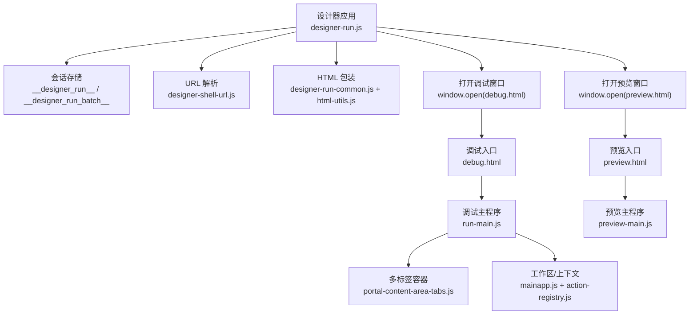
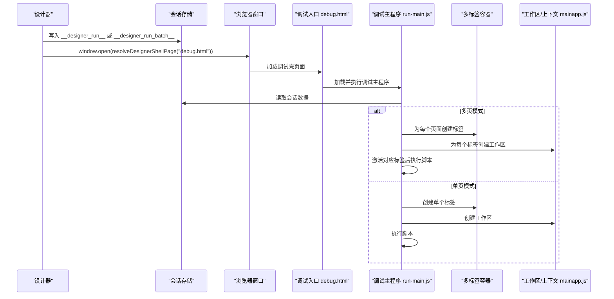
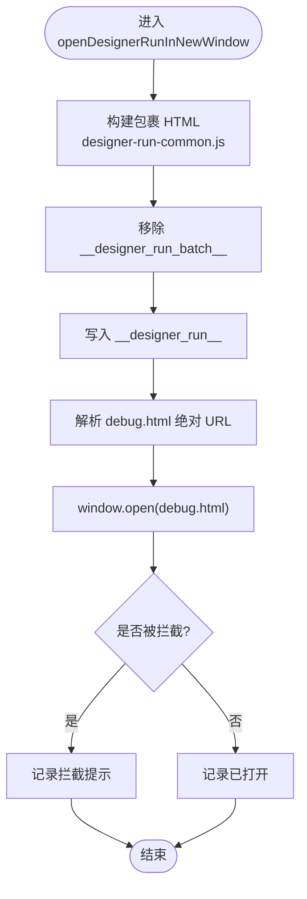
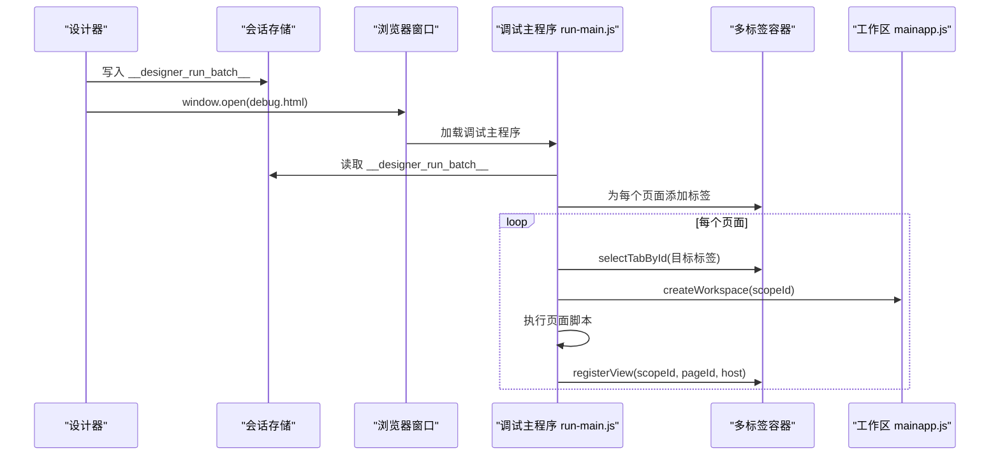
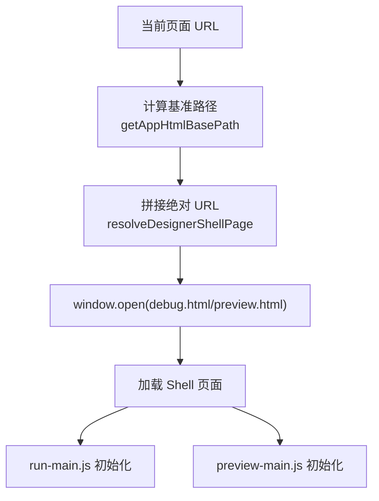
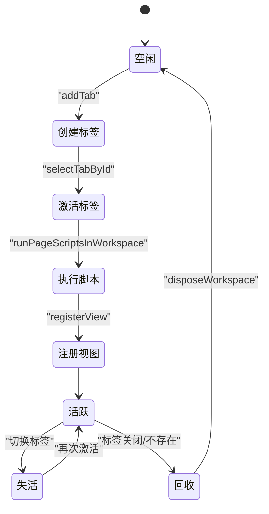
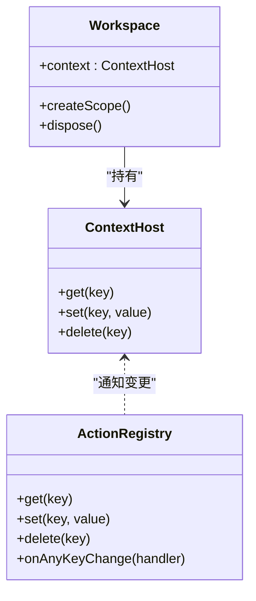
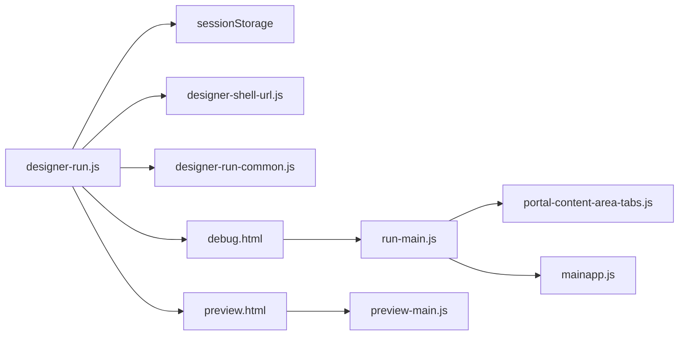

# 窗口管理

<cite>
**本文引用的文件**
- [designer-run.js](file://CMXHTMLDesigner/src/components/designer-app/designer-run.js)
- [designer-run-common.js](file://CMXHTMLDesigner/src/components/designer-app/designer-run-common.js)
- [designer-shell-url.js](file://CMXHTMLDesigner/src/utils/designer-shell-url.js)
- [debug.html](file://CMXHTMLDesigner/debug.html)
- [preview.html](file://CMXHTMLDesigner/preview.html)
- [run-main.js](file://CMXHTMLDesigner/src/run-main.js)
- [preview-main.js](file://CMXHTMLDesigner/src/preview-main.js)
- [html-utils.js](file://CMXHTMLDesigner/src/utils/html-utils.js)
- [tab-manager.js](file://CMXHTMLDesigner/src/utils/tab-manager.js)
- [portal-content-area-tabs.js](file://CMXPortalManager/src/components/portal-content-area-tabs.js)
- [portal-content-area-tab-menu.js](file://CMXPortalManager/src/components/portal-content-area-tab-menu.js)
- [mainapp.js](file://CMXPortalManager/src/lib/mainapp.js)
- [action-registry.js](file://CMXPortalManager/src/lib/action-registry.js)
</cite>

## 目录
1. [简介](#简介)
2. [项目结构](#项目结构)
3. [核心组件](#核心组件)
4. [架构总览](#架构总览)
5. [详细组件分析](#详细组件分析)
6. [依赖关系分析](#依赖关系分析)
7. [性能考虑](#性能考虑)
8. [故障排查指南](#故障排查指南)
9. [结论](#结论)
10. [附录](#附录)

## 简介
本技术指南聚焦于“窗口管理系统”，围绕设计器新窗口打开机制、会话存储键约定、调试与预览页面加载流程、浏览器弹窗拦截处理、多标签页支持、窗口生命周期管理、窗口通信、状态同步与错误恢复策略进行系统化说明。读者可据此理解从设计器触发运行到调试/预览窗口渲染执行的完整链路，并掌握在多标签场景下的资源管理与错误自愈方法。

## 项目结构
- 设计器侧负责构造待运行的 HTML 片段、写入会话存储、调用 window.open 打开调试或预览窗口。
- 调试入口 debug.html 加载 run-main.js，解析会话数据，构建 Shell UI，按单页或多页模式创建标签并执行脚本。
- 预览入口 preview.html 加载 preview-main.js，读取会话中的预览 HTML，注入并执行脚本。
- 工具模块提供 URL 解析、HTML 包装、模板根节点设置、脚本提取等能力。
- 门户侧的标签与上下文机制为调试 Shell 的多标签与状态同步提供支撑。

图表来源
- [designer-run.js:13-51](file://CMXHTMLDesigner/src/components/designer-app/designer-run.js#L13-L51)
- [designer-shell-url.js:1-21](file://CMXHTMLDesigner/src/utils/designer-shell-url.js#L1-L21)
- [designer-run-common.js:10-21](file://CMXHTMLDesigner/src/components/designer-app/designer-run-common.js#L10-L21)
- [debug.html:1-45](file://CMXHTMLDesigner/debug.html#L1-L45)
- [run-main.js:243-377](file://CMXHTMLDesigner/src/run-main.js#L243-L377)
- [preview.html:1-12](file://CMXHTMLDesigner/preview.html#L1-L12)
- [preview-main.js:7-49](file://CMXHTMLDesigner/src/preview-main.js#L7-L49)

章节来源
- [designer-run.js:13-51](file://CMXHTMLDesigner/src/components/designer-app/designer-run.js#L13-L51)
- [designer-shell-url.js:1-21](file://CMXHTMLDesigner/src/utils/designer-shell-url.js#L1-L21)
- [designer-run-common.js:10-21](file://CMXHTMLDesigner/src/components/designer-app/designer-run-common.js#L10-L21)
- [debug.html:1-45](file://CMXHTMLDesigner/debug.html#L1-L45)
- [run-main.js:243-377](file://CMXHTMLDesigner/src/run-main.js#L243-L377)
- [preview.html:1-12](file://CMXHTMLDesigner/preview.html#L1-L12)
- [preview-main.js:7-49](file://CMXHTMLDesigner/src/preview-main.js#L7-L49)

## 核心组件
- 新窗口打开函数：openDesignerRunInNewWindow 与 openDesignerMultiPagesRunInNewWindow，分别负责单页与多页调试窗口的打开与会话数据准备。
- 会话存储键：
  - __designer_run__：单页调试数据（包含 HTML 与 pageId）。
  - __designer_run_batch__：多页调试数据（包含 pages 数组）。
  - __designer_preview__：预览 HTML（由预览流程使用）。
- 调试入口与主程序：debug.html 作为壳页面，run-main.js 负责解析会话、构建 Shell、创建标签、执行脚本、注册视图与生命周期。
- 预览入口与主程序：preview.html 作为壳页面，preview-main.js 负责读取预览 HTML、注入并执行脚本。
- URL 解析：designer-shell-url.js 提供 resolveDesignerShellPage，确保在不同部署路径下正确定位 debug.html/preview.html。
- HTML 包装：designer-run-common.js 调用 html-utils.js 将设计区内容包装为可独立运行的文档片段，并剥离/提取脚本。

章节来源
- [designer-run.js:13-51](file://CMXHTMLDesigner/src/components/designer-app/designer-run.js#L13-L51)
- [designer-run-common.js:10-21](file://CMXHTMLDesigner/src/components/designer-app/designer-run-common.js#L10-L21)
- [run-main.js:243-377](file://CMXHTMLDesigner/src/run-main.js#L243-L377)
- [preview-main.js:7-49](file://CMXHTMLDesigner/src/preview-main.js#L7-L49)
- [designer-shell-url.js:1-21](file://CMXHTMLDesigner/src/utils/designer-shell-url.js#L1-L21)

## 架构总览
下图展示了从设计器触发到调试/预览窗口渲染的端到端流程，包括会话存储读写、窗口打开、Shell 构建、标签创建与脚本执行。

图表来源
- [designer-run.js:13-51](file://CMXHTMLDesigner/src/components/designer-app/designer-run.js#L13-L51)
- [run-main.js:243-377](file://CMXHTMLDesigner/src/run-main.js#L243-L377)
- [designer-shell-url.js:1-21](file://CMXHTMLDesigner/src/utils/designer-shell-url.js#L1-L21)

## 详细组件分析

### 新窗口打开机制：openDesignerRunInNewWindow
- 功能要点
  - 生成包裹后的页面 HTML 并获取 pageId。
  - 清理多页键 __designer_run_batch__，避免与单页模式冲突。
  - 将 { html, pageId } 写入 __designer_run__。
  - 通过 resolveDesignerShellPage('debug.html') 计算绝对 URL 并打开新窗口。
  - 检测 window.open 返回值，若被拦截则记录日志提示用户允许弹窗。
- 关键交互
  - 与 designer-run-common.js 协作生成可运行 HTML。
  - 与 designer-shell-url.js 协作解析 shell 页面 URL。
  - 与 run-main.js 协作在调试窗口中解析 __designer_run__ 并渲染。

图表来源
- [designer-run.js:13-25](file://CMXHTMLDesigner/src/components/designer-app/designer-run.js#L13-L25)
- [designer-run-common.js:10-21](file://CMXHTMLDesigner/src/components/designer-app/designer-run-common.js#L10-L21)
- [designer-shell-url.js:16-21](file://CMXHTMLDesigner/src/utils/designer-shell-url.js#L16-L21)

章节来源
- [designer-run.js:13-25](file://CMXHTMLDesigner/src/components/designer-app/designer-run.js#L13-L25)
- [designer-run-common.js:10-21](file://CMXHTMLDesigner/src/components/designer-app/designer-run-common.js#L10-L21)
- [designer-shell-url.js:16-21](file://CMXHTMLDesigner/src/utils/designer-shell-url.js#L16-L21)

### 多标签调试：openDesignerMultiPagesRunInNewWindow
- 功能要点
  - 接收 pages 列表，序列化为可传输字段（pageId、html、name、details、timestamp）。
  - 清理单页键 __designer_run__，避免与多页模式冲突。
  - 将 { pages } 写入 __designer_run_batch__。
  - 打开 debug.html，并在调试主程序中按多页模式创建多个标签。
- 多标签渲染流程
  - run-main.js 读取 __designer_run_batch__，解析每个页面的 HTML。
  - 为每个页面创建标签，提取并缓存脚本文本。
  - 切换至目标标签以执行脚本，确保 Shadow DOM 内元素能正确布局与事件绑定。
  - 为每个标签创建工作区，注册页面宿主，并在关闭时回收。

图表来源
- [designer-run.js:35-51](file://CMXHTMLDesigner/src/components/designer-app/designer-run.js#L35-L51)
- [run-main.js:259-324](file://CMXHTMLDesigner/src/run-main.js#L259-L324)
- [mainapp.js:251-288](file://CMXPortalManager/src/lib/mainapp.js#L251-L288)

章节来源
- [designer-run.js:35-51](file://CMXHTMLDesigner/src/components/designer-app/designer-run.js#L35-L51)
- [run-main.js:259-324](file://CMXHTMLDesigner/src/run-main.js#L259-L324)
- [mainapp.js:251-288](file://CMXPortalManager/src/lib/mainapp.js#L251-L288)

### 调试窗口 URL 解析与 Shell 页面加载
- URL 解析
  - getAppHtmlBasePath 根据当前页面路径推导基准路径。
  - resolveDesignerShellPage 基于 origin+base 拼接 debug.html/preview.html 的绝对 URL。
- Shell 加载
  - debug.html 引入 run-main.js 作为调试主程序。
  - run-main.js 初始化主题、构建 ShellBar 与工作区容器，监听标签切换事件以同步模板根节点。
  - preview.html 引入 preview-main.js，用于预览模式。

图表来源
- [designer-shell-url.js:1-21](file://CMXHTMLDesigner/src/utils/designer-shell-url.js#L1-L21)
- [debug.html:1-45](file://CMXHTMLDesigner/debug.html#L1-L45)
- [preview.html:1-12](file://CMXHTMLDesigner/preview.html#L1-L12)
- [run-main.js:243-256](file://CMXHTMLDesigner/src/run-main.js#L243-L256)
- [preview-main.js:7-13](file://CMXHTMLDesigner/src/preview-main.js#L7-L13)

章节来源
- [designer-shell-url.js:1-21](file://CMXHTMLDesigner/src/utils/designer-shell-url.js#L1-L21)
- [debug.html:1-45](file://CMXHTMLDesigner/debug.html#L1-L45)
- [preview.html:1-12](file://CMXHTMLDesigner/preview.html#L1-L12)
- [run-main.js:243-256](file://CMXHTMLDesigner/src/run-main.js#L243-L256)
- [preview-main.js:7-13](file://CMXHTMLDesigner/src/preview-main.js#L7-L13)

### 浏览器弹窗拦截处理
- 设计器侧
  - 调用 window.open 后立即检查返回值，若为 null 则记录日志提示用户允许弹窗。
  - 预览模式下额外显示 toast 提示，提升用户体验。
- 建议实践
  - 在用户手势（点击按钮）中触发 open，避免被浏览器判定为自动弹出。
  - 提供明确的引导文案，指导用户允许本站弹出窗口。

章节来源
- [designer-run.js:22-24](file://CMXHTMLDesigner/src/components/designer-app/designer-run.js#L22-L24)
- [designer-preview.js:14-26](file://CMXHTMLDesigner/src/components/designer-app/designer-preview.js#L14-L26)

### 多标签支持与生命周期管理
- 多标签创建
  - run-main.js 为每个页面创建标签，并缓存 liveTabIds 集合。
  - 切换标签时更新 __cmxTemplateRoot，确保模板查询在当前 pane 生效。
- 生命周期回收
  - 监听标签激活事件，当某标签不再存在时调用 disposeWorkspace 释放工作区。
  - 页面宿主在 disconnectedCallback 中调用 __cmxDispose 链，完成 unregisterView 等清理。
- 脏标记与关闭保护
  - portal-content-area-tab-menu.js 提供脏关闭对话框，支持保存/丢弃/取消操作。
  - portal-content-area-tabs.js 维护 _tabs 列表与 dirty 状态，增量渲染 pane，避免重复初始化。

图表来源
- [run-main.js:169-181](file://CMXHTMLDesigner/src/run-main.js#L169-L181)
- [run-main.js:285-324](file://CMXHTMLDesigner/src/run-main.js#L285-L324)
- [portal-content-area-tab-menu.js:39-68](file://CMXPortalManager/src/components/portal-content-area-tab-menu.js#L39-L68)
- [portal-content-area-tabs.js:24-78](file://CMXPortalManager/src/components/portal-content-area-tabs.js#L24-L78)

章节来源
- [run-main.js:169-181](file://CMXHTMLDesigner/src/run-main.js#L169-L181)
- [run-main.js:285-324](file://CMXHTMLDesigner/src/run-main.js#L285-L324)
- [portal-content-area-tab-menu.js:39-68](file://CMXPortalManager/src/components/portal-content-area-tab-menu.js#L39-L68)
- [portal-content-area-tabs.js:24-78](file://CMXPortalManager/src/components/portal-content-area-tabs.js#L24-L78)

### 窗口通信机制与状态同步
- 模板根节点同步
  - run-main.js 在标签切换时更新 globalThis.__cmxTemplateRoot，使页面脚本能在正确的 pane 中查找模板。
- 工作区与上下文
  - mainapp.js 提供 ContextHost，支持 set/get/delete 并派发 change 事件；ActionRegistry 实现依赖追踪与批量刷新。
  - 多标签场景下，每个标签拥有独立 scopeId 的工作区，避免状态污染。
- 页面宿主注册与销毁
  - registerView/unregisterView 在标签激活/关闭时注册与注销页面宿主，配合 __cmxDispose 链完成资源释放。

图表来源
- [mainapp.js:31-56](file://CMXPortalManager/src/lib/mainapp.js#L31-L56)
- [action-registry.js:112-283](file://CMXPortalManager/src/lib/action-registry.js#L112-L283)
- [run-main.js:188-203](file://CMXHTMLDesigner/src/run-main.js#L188-L203)

章节来源
- [mainapp.js:31-56](file://CMXPortalManager/src/lib/mainapp.js#L31-L56)
- [action-registry.js:112-283](file://CMXPortalManager/src/lib/action-registry.js#L112-L283)
- [run-main.js:188-203](file://CMXHTMLDesigner/src/run-main.js#L188-L203)

### 错误恢复策略
- 预览失败兜底
  - preview-main.js 捕获启动异常，向用户展示错误信息，避免空白页。
- 调试脚本执行隔离
  - run-main.js 在执行页内脚本前临时设置 workspace 与 __cmxTemplateRoot，执行后恢复，避免全局污染。
- 标签关闭与资源回收
  - 通过 wireDebugWorkspaceDispose 监听标签变化，对消失的标签调用 disposeWorkspace，防止内存泄漏。
  - 页面宿主 __cmxDispose 链保证 unregisterView 等清理逻辑幂等执行。

章节来源
- [preview-main.js:35-49](file://CMXHTMLDesigner/src/preview-main.js#L35-L49)
- [run-main.js:188-203](file://CMXHTMLDesigner/src/run-main.js#L188-L203)
- [run-main.js:169-181](file://CMXHTMLDesigner/src/run-main.js#L169-L181)

## 依赖关系分析
- 设计器 → 会话存储：写入 __designer_run__ 或 __designer_run_batch__。
- 设计器 → URL 解析：resolveDesignerShellPage 确定调试/预览入口。
- 调试入口 → 调试主程序：debug.html 加载 run-main.js。
- 调试主程序 → 多标签容器：创建与管理标签。
- 调试主程序 → 工作区/上下文：创建 scope、注册视图、生命周期管理。
- 预览入口 → 预览主程序：preview.html 加载 preview-main.js。

图表来源
- [designer-run.js:13-51](file://CMXHTMLDesigner/src/components/designer-app/designer-run.js#L13-L51)
- [designer-shell-url.js:1-21](file://CMXHTMLDesigner/src/utils/designer-shell-url.js#L1-L21)
- [designer-run-common.js:10-21](file://CMXHTMLDesigner/src/components/designer-app/designer-run-common.js#L10-L21)
- [debug.html:1-45](file://CMXHTMLDesigner/debug.html#L1-L45)
- [run-main.js:243-377](file://CMXHTMLDesigner/src/run-main.js#L243-L377)
- [portal-content-area-tabs.js:24-78](file://CMXPortalManager/src/components/portal-content-area-tabs.js#L24-L78)
- [mainapp.js:31-56](file://CMXPortalManager/src/lib/mainapp.js#L31-L56)
- [preview.html:1-12](file://CMXHTMLDesigner/preview.html#L1-L12)
- [preview-main.js:7-49](file://CMXHTMLDesigner/src/preview-main.js#L7-L49)

章节来源
- [designer-run.js:13-51](file://CMXHTMLDesigner/src/components/designer-app/designer-run.js#L13-L51)
- [designer-shell-url.js:1-21](file://CMXHTMLDesigner/src/utils/designer-shell-url.js#L1-L21)
- [designer-run-common.js:10-21](file://CMXHTMLDesigner/src/components/designer-app/designer-run-common.js#L10-L21)
- [debug.html:1-45](file://CMXHTMLDesigner/debug.html#L1-L45)
- [run-main.js:243-377](file://CMXHTMLDesigner/src/run-main.js#L243-L377)
- [portal-content-area-tabs.js:24-78](file://CMXPortalManager/src/components/portal-content-area-tabs.js#L24-L78)
- [mainapp.js:31-56](file://CMXPortalManager/src/lib/mainapp.js#L31-L56)
- [preview.html:1-12](file://CMXHTMLDesigner/preview.html#L1-L12)
- [preview-main.js:7-49](file://CMXHTMLDesigner/src/preview-main.js#L7-L49)

## 性能考虑
- 多标签脚本执行顺序
  - 为避免隐藏标签内的 UI5/自定义元素无法正确绑定事件，run-main.js 在每页脚本执行前先激活对应标签并强制一次布局，再恢复默认选中标签。
- 增量渲染
  - portal-content-area-tabs.js 采用增量方式重建 tab-bar 与 tab-body，减少 CE 的重复初始化开销。
- 资源回收
  - 标签关闭时调用 disposeWorkspace，页面宿主 __cmxDispose 链确保 unregisterView 等清理逻辑执行，避免内存泄漏。
- 主题与样式
  - debug.html 与 run-main.js 注入关键样式，确保 ShellBar 与工作区高度链稳定，避免 UI5 全局样式破坏布局。

[本节为通用性能讨论，不直接分析具体文件]

## 故障排查指南
- 调试窗口被拦截
  - 现象：window.open 返回 null，控制台提示拦截。
  - 处理：在用户点击事件中触发 open；提示用户允许弹窗；预览模式显示 toast。
- 预览加载失败
  - 现象：预览窗口空白或报错。
  - 处理：preview-main.js 捕获异常并展示错误信息；检查 __designer_preview__ 内容与脚本。
- 多标签脚本未执行或布局异常
  - 现象：脚本未执行或 UI5 组件未绑定事件。
  - 处理：确认 run-main.js 先激活标签并强制布局；检查 __cmxTemplateRoot 是否正确指向当前 pane。
- 标签关闭后资源未释放
  - 现象：内存增长或重复初始化。
  - 处理：确认 wireDebugWorkspaceDispose 正常触发 disposeWorkspace；检查 __cmxDispose 链是否执行。

章节来源
- [designer-run.js:22-24](file://CMXHTMLDesigner/src/components/designer-app/designer-run.js#L22-L24)
- [preview-main.js:35-49](file://CMXHTMLDesigner/src/preview-main.js#L35-L49)
- [run-main.js:309-318](file://CMXHTMLDesigner/src/run-main.js#L309-L318)
- [run-main.js:169-181](file://CMXHTMLDesigner/src/run-main.js#L169-L181)

## 结论
本指南系统梳理了设计器到新窗口调试/预览的完整链路，明确了会话存储键的使用约定、URL 解析与 Shell 加载流程、多标签支持与生命周期管理、窗口通信与状态同步机制，以及错误恢复策略。遵循本文档的实践，可在复杂多标签场景下保障调试体验与系统稳定性。

## 附录
- 常用键值约定
  - __designer_run__：单页调试数据（html、pageId）。
  - __designer_run_batch__：多页调试数据（pages 数组）。
  - __designer_preview__：预览 HTML。
- 相关工具函数
  - getAppHtmlBasePath：推导基准路径。
  - resolveDesignerShellPage：解析 shell 页面绝对 URL。
  - buildWrappedDesignerPageHtml：包装设计区 HTML 并提取脚本。
  - TabManager：通用 Tab 切换管理器（辅助 UI 组件）。

章节来源
- [designer-run.js:13-51](file://CMXHTMLDesigner/src/components/designer-app/designer-run.js#L13-L51)
- [designer-shell-url.js:1-21](file://CMXHTMLDesigner/src/utils/designer-shell-url.js#L1-L21)
- [designer-run-common.js:10-21](file://CMXHTMLDesigner/src/components/designer-app/designer-run-common.js#L10-L21)
- [tab-manager.js:1-55](file://CMXHTMLDesigner/src/utils/tab-manager.js#L1-L55)