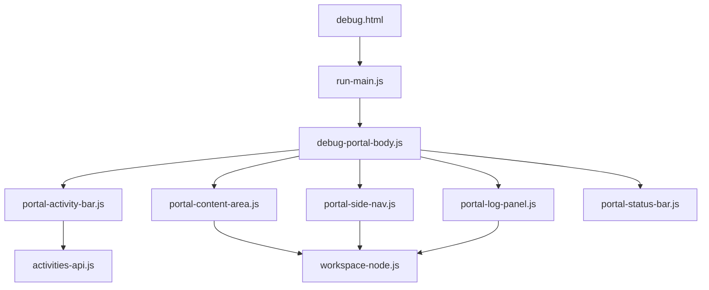
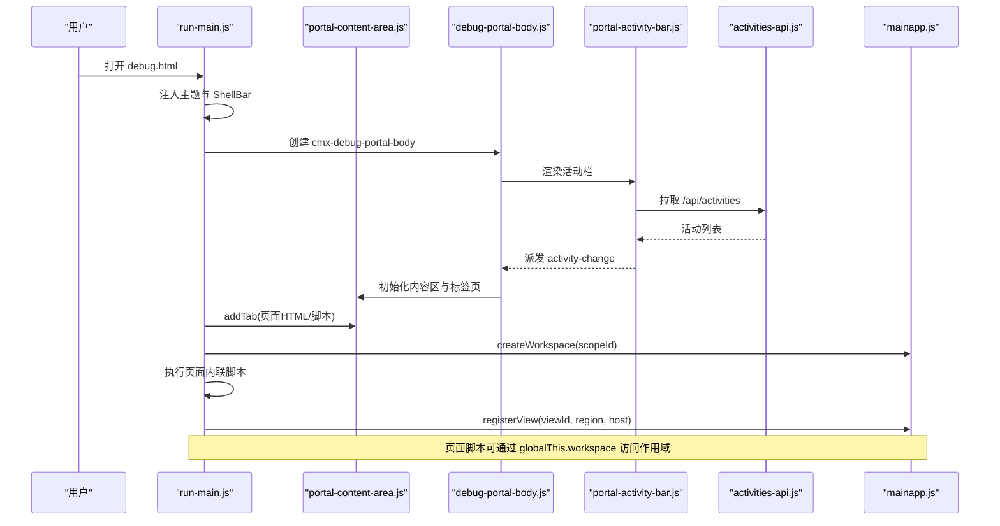
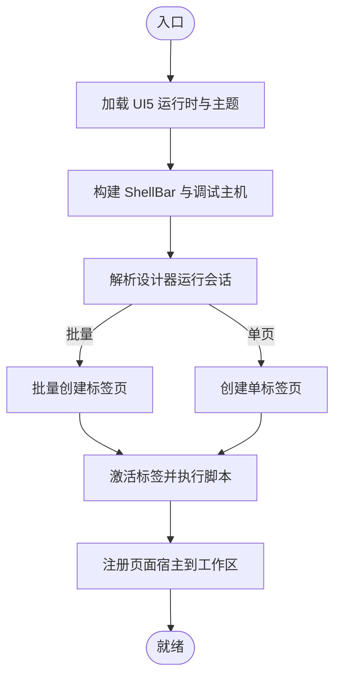
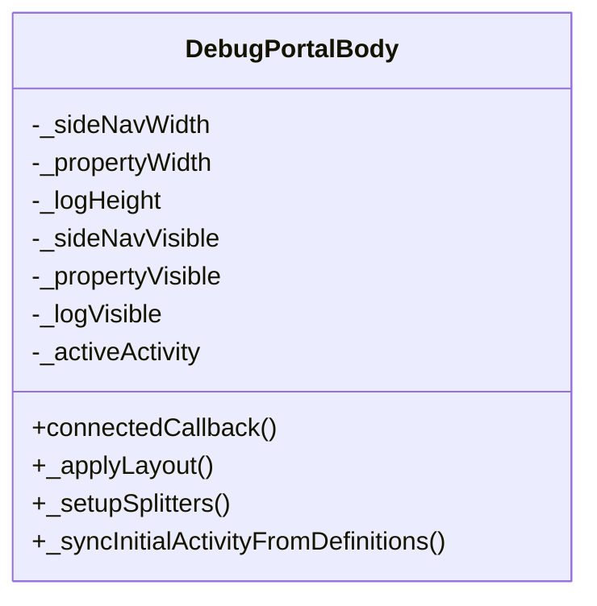
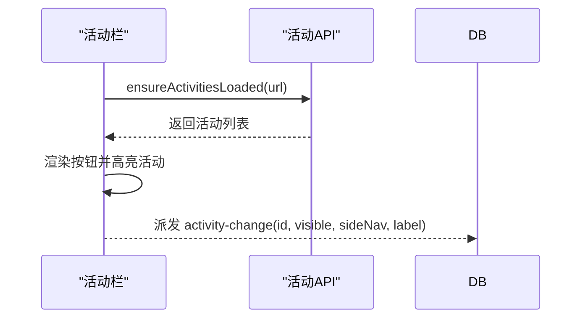
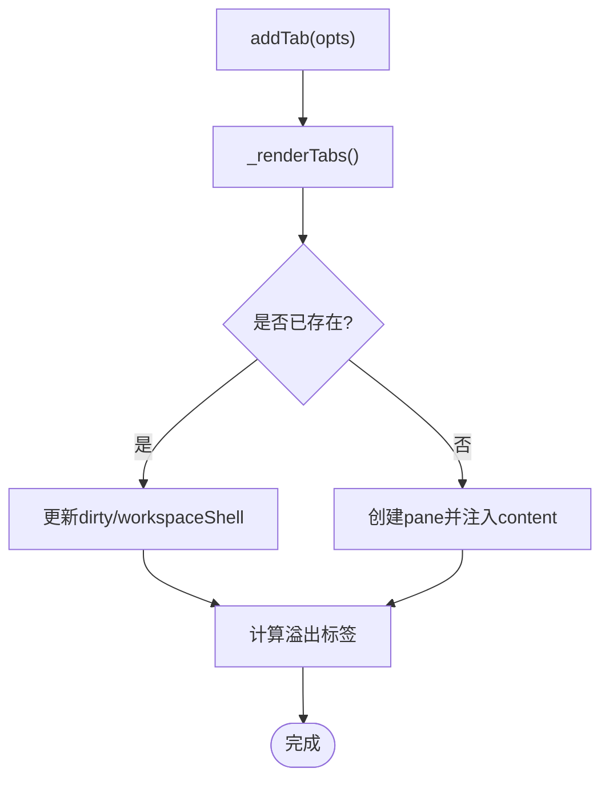
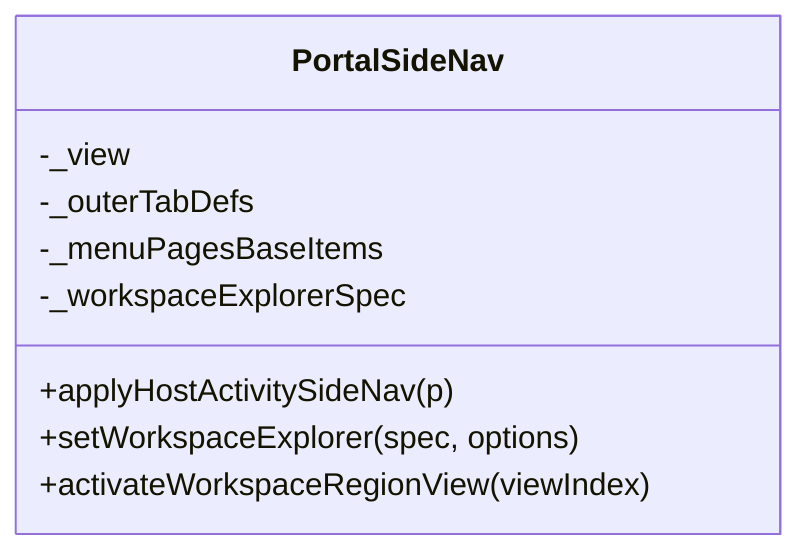
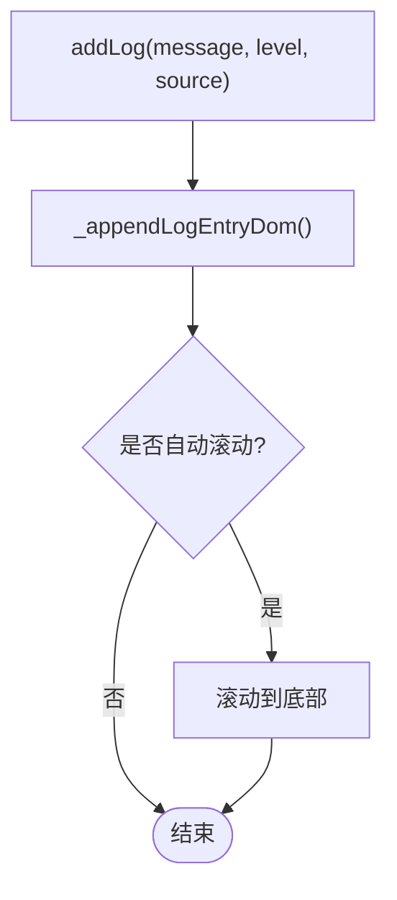
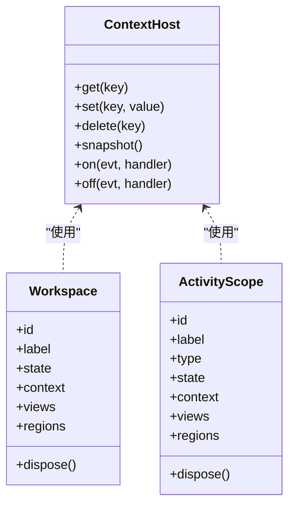
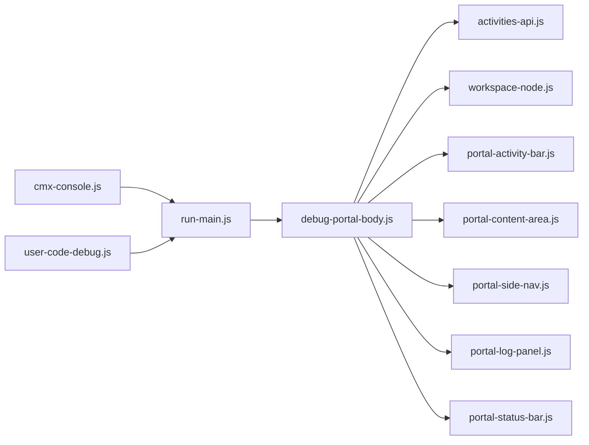

# 调试外壳

<cite>
**本文引用的文件**
- [debug.html](file://CMXHTMLDesigner/debug.html)
- [run-main.js](file://CMXHTMLDesigner/src/run-main.js)
- [mainapp.js](file://CMXHTMLDesigner/src/debug-portal/mainapp.js)
- [debug-portal-body.js](file://CMXHTMLDesigner/src/debug-portal/debug-portal-body.js)
- [activities-api.js](file://CMXHTMLDesigner/src/debug-portal/activities-api.js)
- [portal-activity-bar.js](file://CMXHTMLDesigner/src/debug-portal/portal-activity-bar.js)
- [portal-content-area.js](file://CMXHTMLDesigner/src/debug-portal/portal-content-area.js)
- [portal-side-nav.js](file://CMXHTMLDesigner/src/debug-portal/portal-side-nav.js)
- [portal-log-panel.js](file://CMXHTMLDesigner/src/debug-portal/portal-log-panel.js)
- [portal-status-bar.js](file://CMXHTMLDesigner/src/debug-portal/portal-status-bar.js)
- [workspace-node.js](file://CMXHTMLDesigner/src/debug-portal/workspace-node.js)
- [cmx-console.js](file://CMXHTMLDesigner/src/utils/cmx-console.js)
- [user-code-debug.js](file://CMXHTMLDesigner/src/utils/user-code-debug.js)
</cite>

## 目录
1. [简介](#简介)
2. [项目结构](#项目结构)
3. [核心组件](#核心组件)
4. [架构总览](#架构总览)
5. [详细组件分析](#详细组件分析)
6. [依赖关系分析](#依赖关系分析)
7. [性能与错误处理](#性能与错误处理)
8. [故障排查指南](#故障排查指南)
9. [结论](#结论)
10. [附录：调试接口与集成方式](#附录：调试接口与集成方式)

## 简介
本技术文档面向“调试外壳”系统，聚焦 debug.html 作为调试容器的作用与工作原理，并完整说明调试门户的初始化流程（主应用启动、模块加载、界面渲染），以及调试工具栏、日志面板、活动监控的实现机制。同时覆盖调试模式下的特殊行为（如用户代码断点注入）、性能优化策略、错误捕获与导出能力，并提供调试接口的使用方法和自定义调试工具的集成方式。

## 项目结构
调试外壳由一个轻量 HTML 入口与一组 Web Components 组成，采用 Shadow DOM 隔离样式与状态，通过事件与 API 协同工作：
- 入口页面：debug.html
- 运行时装配：run-main.js（构建 ShellBar、注入内容区、执行页面脚本）
- 调试主体：debug-portal-body.js（布局、侧边栏、内容区、属性面板、底部日志、状态栏）
- 活动定义：activities-api.js（从后端获取活动栏配置）
- 活动栏：portal-activity-bar.js
- 内容标签页：portal-content-area.js
- 侧边导航：portal-side-nav.js
- 日志面板：portal-log-panel.js
- 状态栏：portal-status-bar.js
- 工作区节点与区域视图：workspace-node.js
- 控制台桥接与用户代码调试：cmx-console.js、user-code-debug.js

**图表来源**
- [debug.html:1-45](file://CMXHTMLDesigner/debug.html#L1-L45)
- [run-main.js:100-147](file://CMXHTMLDesigner/src/run-main.js#L100-L147)
- [debug-portal-body.js:118-293](file://CMXHTMLDesigner/src/debug-portal/debug-portal-body.js#L118-L293)
- [activities-api.js:88-125](file://CMXHTMLDesigner/src/debug-portal/activities-api.js#L88-L125)
- [workspace-node.js:285-325](file://CMXHTMLDesigner/src/debug-portal/workspace-node.js#L285-L325)

**章节来源**
- [debug.html:1-45](file://CMXHTMLDesigner/debug.html#L1-L45)
- [run-main.js:100-147](file://CMXHTMLDesigner/src/run-main.js#L100-L147)
- [debug-portal-body.js:118-293](file://CMXHTMLDesigner/src/debug-portal/debug-portal-body.js#L118-L293)

## 核心组件
- 调试容器与 Shell：run-main.js 负责注入 UI5 ShellBar、主题与应用壳，并将 cmx-debug-portal-body 挂载为工作区容器。
- 调试主体：debug-portal-body.js 提供可拖拽分割的布局（侧边栏、内容区、属性面板、底部日志、状态栏），并协调活动栏切换与面板显隐。
- 活动定义与活动栏：activities-api.js 拉取 /api/activities，portal-activity-bar.js 渲染活动图标并派发 activity-change 事件。
- 内容标签页：portal-content-area.js 管理多标签页、右键菜单、未保存提示、工作区区域缓存根等。
- 侧边导航：portal-side-nav.js 支持菜单页面与内置模板，支持搜索、快捷键、工作区 Explorer 子签。
- 日志面板：portal-log-panel.js 提供输出、问题、终端占位、调试控制台，支持导出与自动滚动。
- 状态栏：portal-status-bar.js 提供左侧状态项与右侧托盘（通知、用户）。
- 工作区节点：workspace-node.js 统一渲染 content/explorer/property/bottom 区域视图，支持多视图 Tab 切换与扩展类型。
- 控制台桥接与用户代码调试：cmx-console.js 劫持 console 双写；user-code-debug.js 给用户代码注入 sourceURL 与可选 debugger 断点。

**章节来源**
- [run-main.js:100-147](file://CMXHTMLDesigner/src/run-main.js#L100-L147)
- [debug-portal-body.js:118-293](file://CMXHTMLDesigner/src/debug-portal/debug-portal-body.js#L118-L293)
- [activities-api.js:88-125](file://CMXHTMLDesigner/src/debug-portal/activities-api.js#L88-L125)
- [portal-activity-bar.js:64-151](file://CMXHTMLDesigner/src/debug-portal/portal-activity-bar.js#L64-L151)
- [portal-content-area.js:276-490](file://CMXHTMLDesigner/src/debug-portal/portal-content-area.js#L276-L490)
- [portal-side-nav.js:246-403](file://CMXHTMLDesigner/src/debug-portal/portal-side-nav.js#L246-L403)
- [portal-log-panel.js:153-337](file://CMXHTMLDesigner/src/debug-portal/portal-log-panel.js#L153-L337)
- [portal-status-bar.js:52-188](file://CMXHTMLDesigner/src/debug-portal/portal-status-bar.js#L52-L188)
- [workspace-node.js:285-325](file://CMXHTMLDesigner/src/debug-portal/workspace-node.js#L285-L325)
- [cmx-console.js:37-79](file://CMXHTMLDesigner/src/utils/cmx-console.js#L37-L79)
- [user-code-debug.js:32-59](file://CMXHTMLDesigner/src/utils/user-code-debug.js#L32-L59)

## 架构总览
调试外壳以 run-main.js 为运行时装配器，将设计器导出的 HTML 与脚本注入到 portal-content-area 的标签页中，并通过 mainapp.js 暴露全局 mainapp 与工作区作用域，使页面脚本可以访问 workspace、views、regions 等上下文。

**图表来源**
- [run-main.js:243-377](file://CMXHTMLDesigner/src/run-main.js#L243-L377)
- [debug-portal-body.js:65-72](file://CMXHTMLDesigner/src/debug-portal/debug-portal-body.js#L65-L72)
- [activities-api.js:88-125](file://CMXHTMLDesigner/src/debug-portal/activities-api.js#L88-L125)
- [mainapp.js:185-287](file://CMXHTMLDesigner/src/debug-portal/mainapp.js#L185-L287)

## 详细组件分析

### 调试容器与主应用启动（debug.html + run-main.js）
- debug.html 仅包含关键样式与模块入口，确保 Shadow DOM 宿主正确布局，避免外部 display 覆盖。
- run-main.js 在加载 UI5 运行时后，构建暗色 ShellBar，插入 cmx-debug-portal-body，并从 sessionStorage 解析设计器运行会话（单页或批量），为每个页面创建标签页，设置 __cmxTemplateRoot，执行页面脚本，并注册页面宿主到 mainapp 工作区。

**图表来源**
- [debug.html:1-45](file://CMXHTMLDesigner/debug.html#L1-L45)
- [run-main.js:100-147](file://CMXHTMLDesigner/src/run-main.js#L100-L147)
- [run-main.js:243-377](file://CMXHTMLDesigner/src/run-main.js#L243-L377)

**章节来源**
- [debug.html:1-45](file://CMXHTMLDesigner/debug.html#L1-L45)
- [run-main.js:100-147](file://CMXHTMLDesigner/src/run-main.js#L100-L147)
- [run-main.js:243-377](file://CMXHTMLDesigner/src/run-main.js#L243-L377)

### 调试门户主体（debug-portal-body.js）
- 提供网格布局：中区（活动栏+侧边+内容+属性+底部日志）与底部状态行。
- 支持左右/上下拖拽分割线调整尺寸，持久化当前标签的属性/底部 dock 偏好。
- 监听活动栏 activity-change 事件，同步侧边栏可见性与活动视图。
- 监听内容区 tab 激活事件，更新 activeWorkspaceId，并应用工作区 shell（explorer/property/bottom）。
- 提供快捷键：Ctrl/Cmd+B 切换侧边栏，J 切换日志，P 切换属性面板。

**图表来源**
- [debug-portal-body.js:43-72](file://CMXHTMLDesigner/src/debug-portal/debug-portal-body.js#L43-L72)
- [debug-portal-body.js:295-330](file://CMXHTMLDesigner/src/debug-portal/debug-portal-body.js#L295-L330)
- [debug-portal-body.js:332-384](file://CMXHTMLDesigner/src/debug-portal/debug-portal-body.js#L332-L384)
- [debug-portal-body.js:386-555](file://CMXHTMLDesigner/src/debug-portal/debug-portal-body.js#L386-L555)

**章节来源**
- [debug-portal-body.js:118-293](file://CMXHTMLDesigner/src/debug-portal/debug-portal-body.js#L118-L293)
- [debug-portal-body.js:386-555](file://CMXHTMLDesigner/src/debug-portal/debug-portal-body.js#L386-L555)

### 活动栏与活动定义（portal-activity-bar.js + activities-api.js）
- activities-api.js 从 /api/activities 拉取活动定义，校验字段并缓存结果，供活动栏与侧边栏共用。
- portal-activity-bar.js 渲染活动按钮，点击时派发 activity-change，携带 id、visible、sideNav、label。
- 支持 top/bottom 分组显示，默认选中第一个活动。

**图表来源**
- [activities-api.js:88-125](file://CMXHTMLDesigner/src/debug-portal/activities-api.js#L88-L125)
- [portal-activity-bar.js:64-151](file://CMXHTMLDesigner/src/debug-portal/portal-activity-bar.js#L64-L151)

**章节来源**
- [activities-api.js:88-125](file://CMXHTMLDesigner/src/debug-portal/activities-api.js#L88-L125)
- [portal-activity-bar.js:64-151](file://CMXHTMLDesigner/src/debug-portal/portal-activity-bar.js#L64-L151)

### 内容标签页（portal-content-area.js）
- 管理多标签页，支持添加、关闭、右键菜单（关闭其他/左侧/右侧/已保存/全部）。
- 维护 dirty 状态，关闭未保存标签时弹出确认对话框。
- 支持工作区区域缓存根（explorer/property/bottom），切换标签时复用 DOM，减少重复渲染。
- 提供 getActiveWorkspaceShell/getTabWorkspaceDockOpen/setTabWorkspaceDockOpen 等方法，与宿主协作控制面板显隐。

**图表来源**
- [portal-content-area.js:100-136](file://CMXHTMLDesigner/src/debug-portal/portal-content-area.js#L100-L136)
- [portal-content-area.js:276-490](file://CMXHTMLDesigner/src/debug-portal/portal-content-area.js#L276-L490)
- [portal-content-area.js:568-634](file://CMXHTMLDesigner/src/debug-portal/portal-content-area.js#L568-L634)

**章节来源**
- [portal-content-area.js:100-136](file://CMXHTMLDesigner/src/debug-portal/portal-content-area.js#L100-L136)
- [portal-content-area.js:276-490](file://CMXHTMLDesigner/src/debug-portal/portal-content-area.js#L276-L490)
- [portal-content-area.js:568-634](file://CMXHTMLDesigner/src/debug-portal/portal-content-area.js#L568-L634)

### 侧边导航（portal-side-nav.js）
- 支持两种侧栏类型：menu-pages（拉取菜单 JSON）与 built-in（search/scm/extensions）。
- 支持外层签切换（活动/工作区），工作区 Explorer 子签可缓存根节点，避免重复渲染。
- 提供搜索与快捷键（Alt+S 或 / 聚焦搜索框），支持权限过滤与高亮匹配。
- 通过 setWorkspaceExplorer 注入工作区视图，并在外层第二签展示。

**图表来源**
- [portal-side-nav.js:105-134](file://CMXHTMLDesigner/src/debug-portal/portal-side-nav.js#L105-L134)
- [portal-side-nav.js:172-200](file://CMXHTMLDesigner/src/debug-portal/portal-side-nav.js#L172-L200)
- [portal-side-nav.js:459-499](file://CMXHTMLDesigner/src/debug-portal/portal-side-nav.js#L459-L499)

**章节来源**
- [portal-side-nav.js:246-403](file://CMXHTMLDesigner/src/debug-portal/portal-side-nav.js#L246-L403)
- [portal-side-nav.js:459-499](file://CMXHTMLDesigner/src/debug-portal/portal-side-nav.js#L459-L499)
- [portal-side-nav.js:708-754](file://CMXHTMLDesigner/src/debug-portal/portal-side-nav.js#L708-L754)

### 日志面板（portal-log-panel.js）
- 提供输出、问题、终端占位、调试控制台四个标签。
- addLog/addProblem 支持级别、来源、时间戳，自动滚动与徽标提示。
- setWorkspaceBottom 支持注入工作区底部视图，支持激活与挂载根复用。
- 支持导出日志为文本文件，关闭面板触发 panel-close 事件。

**图表来源**
- [portal-log-panel.js:67-84](file://CMXHTMLDesigner/src/debug-portal/portal-log-panel.js#L67-L84)
- [portal-log-panel.js:470-485](file://CMXHTMLDesigner/src/debug-portal/portal-log-panel.js#L470-L485)
- [portal-log-panel.js:508-516](file://CMXHTMLDesigner/src/debug-portal/portal-log-panel.js#L508-L516)

**章节来源**
- [portal-log-panel.js:153-337](file://CMXHTMLDesigner/src/debug-portal/portal-log-panel.js#L153-L337)
- [portal-log-panel.js:470-485](file://CMXHTMLDesigner/src/debug-portal/portal-log-panel.js#L470-L485)
- [portal-log-panel.js:508-516](file://CMXHTMLDesigner/src/debug-portal/portal-log-panel.js#L508-L516)

### 状态栏（portal-status-bar.js）
- 左侧显示分支、错误/警告计数、信息状态；右侧显示编码、语言、通知、用户。
- 支持注册/注销/更新状态项，点击托盘项派发 status-item-click 事件。
- 与 debug-portal-body.js 联动：点击通知铃铛可切换日志面板。

**章节来源**
- [portal-status-bar.js:52-188](file://CMXHTMLDesigner/src/debug-portal/portal-status-bar.js#L52-L188)
- [debug-portal-body.js:409-419](file://CMXHTMLDesigner/src/debug-portal/debug-portal-body.js#L409-L419)

### 工作区与作用域（mainapp.js + workspace-node.js）
- mainapp.js 暴露全局 mainapp，包含 workspaces、activityScopes、activeWorkspaceId。
- Workspace 提供 context（ContextHost）、views、regions，支持 registerView/unregisterView 冻结 API 对象并附加系统字段。
- workspace-node.js 统一渲染 content/explorer/property/bottom 区域视图，支持多视图 Tab 切换与扩展类型注册。

**图表来源**
- [mainapp.js:33-101](file://CMXHTMLDesigner/src/debug-portal/mainapp.js#L33-L101)
- [mainapp.js:115-164](file://CMXHTMLDesigner/src/debug-portal/mainapp.js#L115-L164)
- [mainapp.js:185-287](file://CMXHTMLDesigner/src/debug-portal/mainapp.js#L185-L287)
- [workspace-node.js:285-325](file://CMXHTMLDesigner/src/debug-portal/workspace-node.js#L285-L325)

**章节来源**
- [mainapp.js:33-101](file://CMXHTMLDesigner/src/debug-portal/mainapp.js#L33-L101)
- [mainapp.js:185-287](file://CMXHTMLDesigner/src/debug-portal/mainapp.js#L185-L287)
- [workspace-node.js:285-325](file://CMXHTMLDesigner/src/debug-portal/workspace-node.js#L285-L325)

## 依赖关系分析
- run-main.js 依赖 UI5 运行时与库主题，并引入 debug-portal-body。
- debug-portal-body.js 依赖 activities-api、workspace-node、mainapp 与各面板组件。
- activities-api.js 提供活动定义的标准化与缓存。
- portal-content-area.js、portal-side-nav.js、portal-log-panel.js 均依赖 workspace-node 进行区域视图渲染与交互。
- cmx-console.js 与 user-code-debug.js 为调试增强工具，可在设计器或运行期启用。

**图表来源**
- [run-main.js:10-25](file://CMXHTMLDesigner/src/run-main.js#L10-L25)
- [debug-portal-body.js:1-17](file://CMXHTMLDesigner/src/debug-portal/debug-portal-body.js#L1-L17)
- [activities-api.js:1-164](file://CMXHTMLDesigner/src/debug-portal/activities-api.js#L1-L164)
- [workspace-node.js:1-80](file://CMXHTMLDesigner/src/debug-portal/workspace-node.js#L1-L80)
- [cmx-console.js:1-84](file://CMXHTMLDesigner/src/utils/cmx-console.js#L1-L84)
- [user-code-debug.js:1-60](file://CMXHTMLDesigner/src/utils/user-code-debug.js#L1-L60)

**章节来源**
- [run-main.js:10-25](file://CMXHTMLDesigner/src/run-main.js#L10-L25)
- [debug-portal-body.js:1-17](file://CMXHTMLDesigner/src/debug-portal/debug-portal-body.js#L1-L17)
- [activities-api.js:1-164](file://CMXHTMLDesigner/src/debug-portal/activities-api.js#L1-L164)
- [workspace-node.js:1-80](file://CMXHTMLDesigner/src/debug-portal/workspace-node.js#L1-L80)
- [cmx-console.js:1-84](file://CMXHTMLDesigner/src/utils/cmx-console.js#L1-L84)
- [user-code-debug.js:1-60](file://CMXHTMLDesigner/src/utils/user-code-debug.js#L1-L60)

## 性能与错误处理
- 性能优化
  - 活动定义缓存：ensureActivitiesLoaded 去重加载并缓存结果，避免重复请求。
  - 工作区区域缓存根：Content 标签为 explorer/property/bottom 首次创建 DOM 根节点，切换时复用，减少重建成本。
  - 批量侧栏更新：applyHostActivitySideNav 批量写入属性后再渲染，避免多次 fetch。
  - 溢出标签折叠：tab-strip-overflow 计算可见范围，隐藏多余标签并以菜单形式提供。
  - Shadow DOM 隔离：各组件使用 Shadow DOM，避免样式污染与重排。
- 错误处理
  - 活动定义拉取失败：activities-api.js 捕获异常并返回空数组，保证活动栏可用。
  - getPageApi 异常：mainapp.js 捕获异常并记录警告，仍允许无用户 API 的视图注册。
  - 自定义视图渲染异常：workspace-node.js 捕获异常并显示错误信息，避免崩溃。
  - 控制台桥接：cmx-console.js 对 sink 调用进行 try-catch，防止业务受影响。
  - 用户代码调试：user-code-debug.js 提供安全 slug 与 sourceURL，便于定位错误。

**章节来源**
- [activities-api.js:88-125](file://CMXHTMLDesigner/src/debug-portal/activities-api.js#L88-L125)
- [mainapp.js:263-268](file://CMXHTMLDesigner/src/debug-portal/mainapp.js#L263-L268)
- [workspace-node.js:380-396](file://CMXHTMLDesigner/src/debug-portal/workspace-node.js#L380-L396)
- [cmx-console.js:37-79](file://CMXHTMLDesigner/src/utils/cmx-console.js#L37-L79)
- [user-code-debug.js:32-59](file://CMXHTMLDesigner/src/utils/user-code-debug.js#L32-L59)

## 故障排查指南
- 活动栏为空
  - 检查 /api/activities 响应格式与字段校验；查看 activities-api.js 的 parseActivityEntries 逻辑。
  - 若网络失败，活动栏会回退为空，需检查后端服务可用性。
- 日志面板不显示新日志
  - 确认 addLog 被调用且 _activeTab 为 output；检查 _appendLogEntryDom 是否正确追加 DOM。
  - 若自动滚动关闭，需手动滚动查看。
- 标签页无法关闭
  - 检查 closeable 标志与 dirty 状态；未保存标签会弹出确认对话框。
  - 右键菜单中的关闭操作受 closeable 与 dirty 影响。
- 侧边导航菜单不加载
  - 检查 menu-pages URL 与权限过滤；查看 _loadMenuPagesMenu 的错误处理与 busy 指示。
  - 若快速切换导致旧请求覆盖，使用 _menuPagesLoadGen 世代保护。
- 用户代码无法断点
  - 确认 user-code-debug.js 的 decorateUserCode 已注入 sourceURL；检查 __cmx_designer_debug_mode__ 开关。
  - 在 DevTools Sources 中查找 cmx://... 虚拟文件并设置断点。

**章节来源**
- [activities-api.js:53-82](file://CMXHTMLDesigner/src/debug-portal/activities-api.js#L53-L82)
- [portal-log-panel.js:67-84](file://CMXHTMLDesigner/src/debug-portal/portal-log-panel.js#L67-L84)
- [portal-content-area.js:742-800](file://CMXHTMLDesigner/src/debug-portal/portal-content-area.js#L742-L800)
- [portal-side-nav.js:708-754](file://CMXHTMLDesigner/src/debug-portal/portal-side-nav.js#L708-L754)
- [user-code-debug.js:32-59](file://CMXHTMLDesigner/src/utils/user-code-debug.js#L32-L59)

## 结论
调试外壳通过模块化 Web Components 与统一的 WorkSpace 模型，提供了稳定、可扩展的调试环境。其核心优势在于：
- 清晰的职责分离：Shell、活动栏、内容区、侧边栏、日志、状态栏各司其职。
- 强大的工作区模型：支持多区域视图、多标签页、缓存根复用与上下文共享。
- 完善的调试能力：控制台桥接、用户代码断点注入、日志导出与错误捕获。
- 良好的用户体验：拖拽分割、快捷键、溢出折叠、未保存提示。

## 附录：调试接口与集成方式
- 调试接口
  - 全局 mainapp：workspaces、activityScopes、activeWorkspaceId，用于查询与设置当前工作区。
  - 工作区 API：createWorkspace/disposeWorkspace、registerView/unregisterView、setActiveWorkspace。
  - 工作区节点：WorkspaceNode.fromMenuNode/fromNavSelectionDetail/open_view，驱动 Content/Explorer/Property/Bottom。
  - 区域视图：registerWorkspaceViewType 注册自定义类型，renderWorkspaceRegionViewsHtml 渲染区域视图。
  - 控制台桥接：installCmxConsoleTap/uninstallCmxConsoleTap，劫持 console 并双写到 sink。
  - 用户代码调试：decorateUserCode/makeSourceUrl/getDesignerDebugMode/setDesignerDebugMode，注入 sourceURL 与可选 debugger。
- 集成方式
  - 在设计器导出 HTML 时，确保 body 内含 <cmx-html-pages-…> 与脚本，run-main.js 会自动解析并注入。
  - 在页面脚本中通过 globalThis.workspace 访问工作区上下文，或使用 this.workspace 在 CE 内部访问。
  - 通过 activities-api 配置活动栏，支持 menu-pages 与 built-in 模板。
  - 通过 workspace-node 配置 explorer/property/bottom 视图，支持多视图与自定义类型。
  - 使用 portal-log-panel.addLog/addProblem 记录调试信息，支持导出与自动滚动。
  - 使用 cmx-console.installCmxConsoleTap 将 console 输出转发到自定义 sink（如 inspector 调试区）。
  - 使用 user-code-debug.decorateUserCode 为用户代码注入 sourceURL，便于 DevTools 断点与定位。

**章节来源**
- [mainapp.js:185-287](file://CMXHTMLDesigner/src/debug-portal/mainapp.js#L185-L287)
- [workspace-node.js:40-42](file://CMXHTMLDesigner/src/debug-portal/workspace-node.js#L40-L42)
- [workspace-node.js:285-325](file://CMXHTMLDesigner/src/debug-portal/workspace-node.js#L285-L325)
- [cmx-console.js:37-79](file://CMXHTMLDesigner/src/utils/cmx-console.js#L37-L79)
- [user-code-debug.js:32-59](file://CMXHTMLDesigner/src/utils/user-code-debug.js#L32-L59)