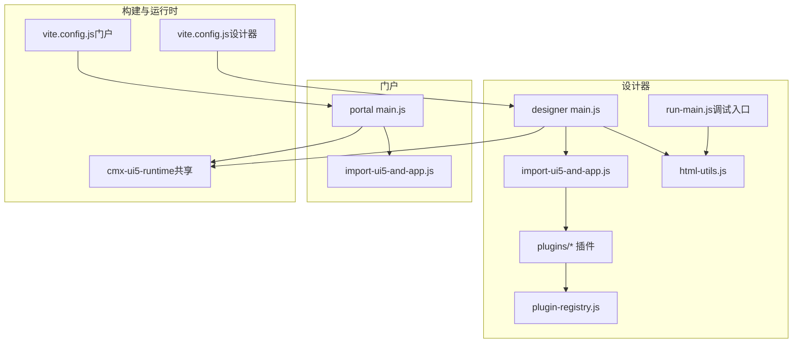
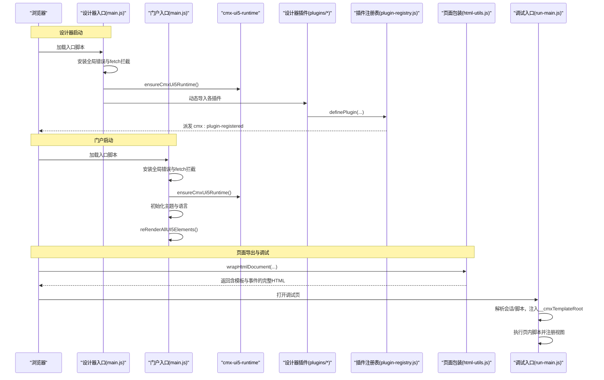
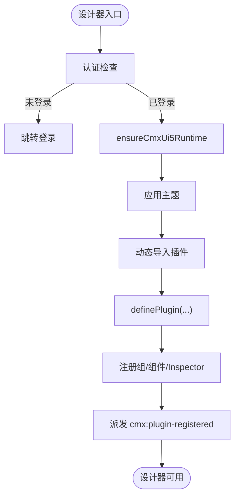
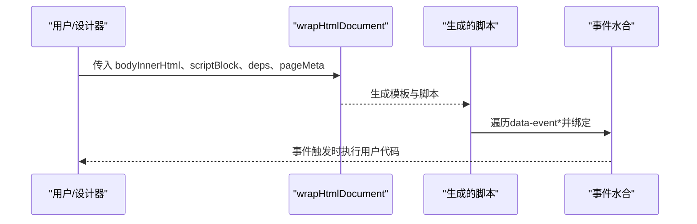
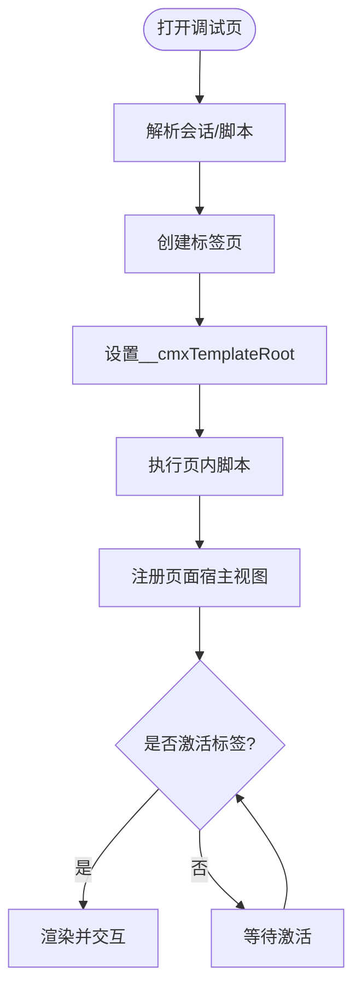
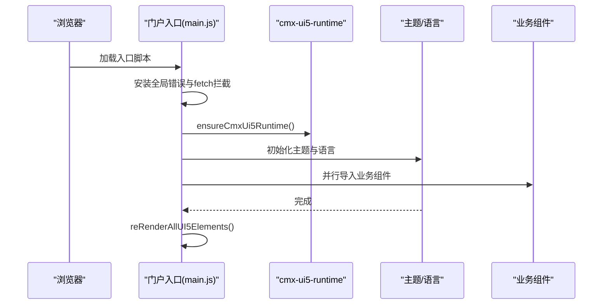
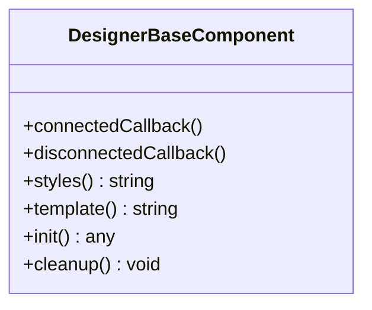
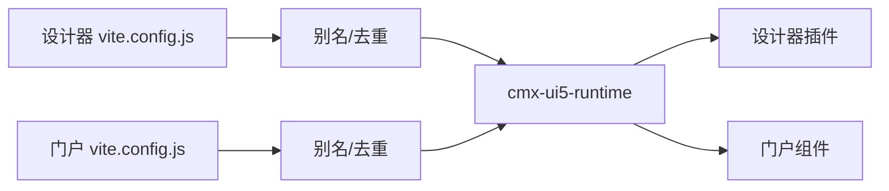

# 运行环境初始化

<cite>
**本文引用的文件**
- [CMXHTMLDesigner/src/main.js](file://CMXHTMLDesigner/src/main.js)
- [CMXPortalManager/src/main.js](file://CMXPortalManager/src/main.js)
- [CMXHTMLDesigner/src/import-ui5-and-app.js](file://CMXHTMLDesigner/src/import-ui5-and-app.js)
- [CMXPortalManager/src/import-ui5-and-app.js](file://CMXPortalManager/src/import-ui5-and-app.js)
- [CMXHTMLDesigner/src/lib/plugin-registry.js](file://CMXHTMLDesigner/src/lib/plugin-registry.js)
- [CMXHTMLDesigner/src/plugins/cmx-models-plugin.js](file://CMXHTMLDesigner/src/plugins/cmx-models-plugin.js)
- [CMXHTMLDesigner/src/utils/html-utils.js](file://CMXHTMLDesigner/src/utils/html-utils.js)
- [CMXHTMLDesigner/src/components/designer-base-component.js](file://CMXHTMLDesigner/src/components/designer-base-component.js)
- [CMXHTMLDesigner/src/run-main.js](file://CMXHTMLDesigner/src/run-main.js)
- [CMXHTMLDesigner/vite.config.js](file://CMXHTMLDesigner/vite.config.js)
- [CMXPortalManager/vite.config.js](file://CMXPortalManager/vite.config.js)
</cite>

## 目录
1. [简介](#简介)
2. [项目结构](#项目结构)
3. [核心组件](#核心组件)
4. [架构总览](#架构总览)
5. [详细组件分析](#详细组件分析)
6. [依赖关系分析](#依赖关系分析)
7. [性能考虑](#性能考虑)
8. [故障排查指南](#故障排查指南)
9. [结论](#结论)
10. [附录](#附录)

## 简介
本指南面向“运行环境初始化系统”，覆盖设计器与门户两个前端应用的启动流程、依赖加载机制、模块解析策略；解释设计器页面的包装过程、上下文注入与事件绑定；描述运行时配置选项、环境变量设置与性能优化参数；说明插件系统的集成方式、扩展点注册与动态加载机制；并提供完整的初始化流程图、错误恢复策略与监控指标收集建议。

## 项目结构
仓库包含两个关键的前端应用：
- CMXHTMLDesigner：可视化页面设计器，负责页面元数据、调色板、画布、调试运行等能力。
- CMXPortalManager：门户壳层与应用容器，负责主题/语言初始化、工作区视图注册、业务组件装配与页面渲染。

两者均基于 cmx-ui5-runtime 提供的 UI5 运行时，并通过 Vite 构建与开发服务器进行模块解析、代理与分包优化。

图表来源
- [CMXHTMLDesigner/src/main.js:1-29](file://CMXHTMLDesigner/src/main.js#L1-L29)
- [CMXPortalManager/src/main.js:1-49](file://CMXPortalManager/src/main.js#L1-L49)
- [CMXHTMLDesigner/src/import-ui5-and-app.js:1-12](file://CMXHTMLDesigner/src/import-ui5-and-app.js#L1-L12)
- [CMXPortalManager/src/import-ui5-and-app.js:1-45](file://CMXPortalManager/src/import-ui5-and-app.js#L1-L45)
- [CMXHTMLDesigner/vite.config.js:1-118](file://CMXHTMLDesigner/vite.config.js#L1-L118)
- [CMXPortalManager/vite.config.js:1-184](file://CMXPortalManager/vite.config.js#L1-L184)

章节来源
- [CMXHTMLDesigner/src/main.js:1-29](file://CMXHTMLDesigner/src/main.js#L1-L29)
- [CMXPortalManager/src/main.js:1-49](file://CMXPortalManager/src/main.js#L1-L49)
- [CMXHTMLDesigner/vite.config.js:1-118](file://CMXHTMLDesigner/vite.config.js#L1-L118)
- [CMXPortalManager/vite.config.js:1-184](file://CMXPortalManager/vite.config.js#L1-L184)

## 核心组件
- 应用引导与认证拦截
  - 设计器与门户均在入口安装全局 fetch 拦截器与全局错误提示，确保 /api 请求携带鉴权并统一处理未登录场景。
- UI5 运行时初始化
  - 通过 ensureCmxUi5Runtime 保证 UI5 资源与副作用垫片就绪，随后按需导入业务模块。
- 主题与语言
  - 门户在 UI5 运行时后初始化主题与语言，并对已渲染的 UI5 元素执行重渲染以适配主题/语言变化。
- 插件系统
  - 设计器通过 plugin-registry 提供 definePlugin 接口，支持组定义、组件元数据注册与自定义 Inspector 渲染函数，并在注册完成后派发事件通知 UI 刷新。
- 页面包装与事件水合
  - html-utils 将设计器导出的 HTML 包装为独立可运行文档，注入 importmap、UI5 脚本、模板与事件水合逻辑；支持 Shadow DOM 下的模板查询与多页隔离。
- 调试运行
  - run-main 提供调试宿主，解析会话中的页面与脚本，按标签页创建 workspace，注入 __cmxTemplateRoot，执行页内脚本并注册页面宿主视图。

章节来源
- [CMXHTMLDesigner/src/main.js:11-23](file://CMXHTMLDesigner/src/main.js#L11-L23)
- [CMXPortalManager/src/main.js:16-43](file://CMXPortalManager/src/main.js#L16-L43)
- [CMXHTMLDesigner/src/lib/plugin-registry.js:1-95](file://CMXHTMLDesigner/src/lib/plugin-registry.js#L1-L95)
- [CMXHTMLDesigner/src/utils/html-utils.js:170-369](file://CMXHTMLDesigner/src/utils/html-utils.js#L170-L369)
- [CMXHTMLDesigner/src/run-main.js:149-378](file://CMXHTMLDesigner/src/run-main.js#L149-L378)

## 架构总览
下图展示从浏览器加载到应用可用的完整初始化链路，包括认证、运行时、主题/语言、插件与页面包装。

图表来源
- [CMXHTMLDesigner/src/main.js:11-23](file://CMXHTMLDesigner/src/main.js#L11-L23)
- [CMXPortalManager/src/main.js:16-43](file://CMXPortalManager/src/main.js#L16-L43)
- [CMXHTMLDesigner/src/import-ui5-and-app.js:1-12](file://CMXHTMLDesigner/src/import-ui5-and-app.js#L1-L12)
- [CMXPortalManager/src/import-ui5-and-app.js:1-45](file://CMXPortalManager/src/import-ui5-and-app.js#L1-L45)
- [CMXHTMLDesigner/src/lib/plugin-registry.js:60-89](file://CMXHTMLDesigner/src/lib/plugin-registry.js#L60-L89)
- [CMXHTMLDesigner/src/utils/html-utils.js:237-369](file://CMXHTMLDesigner/src/utils/html-utils.js#L237-L369)
- [CMXHTMLDesigner/src/run-main.js:243-378](file://CMXHTMLDesigner/src/run-main.js#L243-L378)

## 详细组件分析

### 设计器启动与插件系统
- 启动顺序
  - 安装全局错误与 fetch 拦截 → 校验登录 → 初始化 UI5 运行时 → 应用主题 → 动态导入业务模块与插件。
- 插件注册
  - 通过 definePlugin 注册组、组件元数据与自定义 Inspector；重复注册时按 tag 覆盖，便于 HMR 热更新。
  - 注册完成后派发 cmx:plugin-registered 事件，左侧面板监听并刷新调色板。
- 模型类暴露
  - 模型插件将常用数据模型类暴露至 globalThis，供 pageFns 与调试控制台使用。

图表来源
- [CMXHTMLDesigner/src/main.js:16-23](file://CMXHTMLDesigner/src/main.js#L16-L23)
- [CMXHTMLDesigner/src/lib/plugin-registry.js:60-89](file://CMXHTMLDesigner/src/lib/plugin-registry.js#L60-L89)
- [CMXHTMLDesigner/src/plugins/cmx-models-plugin.js:21-37](file://CMXHTMLDesigner/src/plugins/cmx-models-plugin.js#L21-L37)

章节来源
- [CMXHTMLDesigner/src/main.js:11-23](file://CMXHTMLDesigner/src/main.js#L11-L23)
- [CMXHTMLDesigner/src/lib/plugin-registry.js:1-95](file://CMXHTMLDesigner/src/lib/plugin-registry.js#L1-L95)
- [CMXHTMLDesigner/src/plugins/cmx-models-plugin.js:1-118](file://CMXHTMLDesigner/src/plugins/cmx-models-plugin.js#L1-L118)

### 设计器页面包装、上下文注入与事件绑定
- 页面包装
  - wrapHtmlDocument 生成完整 HTML：注入 importmap、UI5 脚本、样式、模板与 body 宿主元素；支持 script/module 两类依赖。
  - 模板以 <template id="..."> 形式存在，避免 Shadow DOM 下 document 无法查询的问题。
- 上下文注入
  - 通过 IIFE 形参注入 templateRoot，优先使用传入容器，回退到 window.__cmxTemplateRoot 或 document。
  - 页面坐标 domain/application/module/doc 直接内联到宿主实例，供组件兜底读取。
- 事件绑定
  - 遍历 data-event* 属性，编译为 Function，附加到对应事件；支持 sourceURL 以便 DevTools 断点持久化。
  - 支持 host 作用域调用，使事件代码能访问宿主实例上下文。

图表来源
- [CMXHTMLDesigner/src/utils/html-utils.js:237-369](file://CMXHTMLDesigner/src/utils/html-utils.js#L237-L369)

章节来源
- [CMXHTMLDesigner/src/utils/html-utils.js:170-369](file://CMXHTMLDesigner/src/utils/html-utils.js#L170-L369)

### 调试运行与工作区生命周期
- 调试入口
  - run-main 解析 sessionStorage 中的单页或批量页面会话，创建调试 Shell 与内容区域。
  - 对每个标签页：克隆 body、提取脚本、设置 __cmxTemplateRoot、执行脚本、注册页面宿主视图。
- 工作区管理
  - 切换标签时同步 __cmxTemplateRoot；关闭标签时回收 workspace，防止内存泄漏。
- 布局与样式
  - 为 cmx-html-pages-* 宿主设置 block 布局与尺寸，避免 flex/grid 计算异常。

图表来源
- [CMXHTMLDesigner/src/run-main.js:243-378](file://CMXHTMLDesigner/src/run-main.js#L243-L378)

章节来源
- [CMXHTMLDesigner/src/run-main.js:149-378](file://CMXHTMLDesigner/src/run-main.js#L149-L378)

### 门户启动与主题/语言初始化
- 启动顺序
  - 安装控制台桥接、全局错误与 fetch 拦截 → 认证检查 → 获取当前用户信息 → 初始化 UI5 运行时 → 导入业务组件 → 初始化主题与语言 → 重渲染所有 UI5 元素。
- 组件注册
  - 注册工作区视图类型（HTML 页面与原生页面），并异步加载数据组件与默认皮肤配置。
  - 并行注册侧边栏、内容区、属性面板、日志面板等业务组件。

图表来源
- [CMXPortalManager/src/main.js:16-43](file://CMXPortalManager/src/main.js#L16-L43)
- [CMXPortalManager/src/import-ui5-and-app.js:1-45](file://CMXPortalManager/src/import-ui5-and-app.js#L1-L45)

章节来源
- [CMXPortalManager/src/main.js:16-43](file://CMXPortalManager/src/main.js#L16-L43)
- [CMXPortalManager/src/import-ui5-and-app.js:1-45](file://CMXPortalManager/src/import-ui5-and-app.js#L1-L45)

### 基础组件与生命周期
- 基类设计
  - DesignerBaseComponent 封装 Shadow DOM 挂载、样式注入、init/cleanup 钩子，确保幂等连接与资源清理。
- 适用场景
  - 设计器内部各面板与工具组件继承该基类，统一生命周期管理与错误捕获。

图表来源
- [CMXHTMLDesigner/src/components/designer-base-component.js:1-38](file://CMXHTMLDesigner/src/components/designer-base-component.js#L1-L38)

章节来源
- [CMXHTMLDesigner/src/components/designer-base-component.js:1-38](file://CMXHTMLDesigner/src/components/designer-base-component.js#L1-L38)

## 依赖关系分析
- 构建期依赖
  - 两应用均通过 Vite 配置引入 cmx-ui5-runtime 插件与 localeDataWhitelist 插件，实现 UI5 运行时注入与本地化白名单。
  - 别名与去重：将 cmx-data-comp 与 cmx-ui5-runtime 源码路径映射到 monorepo 内源文件，确保 dev 模式顶层 await 与源码调试；对 UI5 相关包进行 dedupe 避免多实例。
- 运行期依赖
  - 设计器插件依赖 cmx-data-comp 的数据模型与服务数据源；门户在 import-ui5-and-app 中注册工作区视图并加载数据组件。
  - 页面运行依赖 importmap 中声明的 UI5 模块与可选 module 依赖。

图表来源
- [CMXHTMLDesigner/vite.config.js:37-71](file://CMXHTMLDesigner/vite.config.js#L37-L71)
- [CMXPortalManager/vite.config.js:42-83](file://CMXPortalManager/vite.config.js#L42-L83)

章节来源
- [CMXHTMLDesigner/vite.config.js:37-71](file://CMXHTMLDesigner/vite.config.js#L37-L71)
- [CMXPortalManager/vite.config.js:42-83](file://CMXPortalManager/vite.config.js#L42-L83)

## 性能考虑
- 首屏与懒加载
  - 门户构建启用 modulePreload 过滤重型 chunk（如 ignite-spreadsheet），避免首屏不必要的预加载。
  - 使用 manualChunks/codeSplitting 将大型第三方库拆分为独立 chunk，提升缓存命中与并行解析效率。
- 依赖优化
  - optimizeDeps 排除 UI5 相关包，避免预构建带来的体积与兼容性问题。
  - dedupe 确保 UI5、lit 等关键库仅解析一份实例，避免响应式失效与内存浪费。
- 构建目标与 SourceMap
  - target 设置为 es2022，开启 sourcemap，便于开发与问题定位。
- 运行时优化
  - 页面包装阶段采用模板 cloneNode(true) 替代字符串序列化，减少二次解析开销。
  - 事件编译使用 new Function 并附带 sourceURL，兼顾性能与调试体验。

章节来源
- [CMXPortalManager/vite.config.js:97-169](file://CMXPortalManager/vite.config.js#L97-L169)
- [CMXHTMLDesigner/vite.config.js:90-115](file://CMXHTMLDesigner/vite.config.js#L90-L115)
- [CMXHTMLDesigner/src/utils/html-utils.js:170-228](file://CMXHTMLDesigner/src/utils/html-utils.js#L170-L228)

## 故障排查指南
- 启动失败兜底
  - 设计器与门户入口均捕获 bootstrap 异常，显示致命错误界面，避免白屏。
- 认证与网络
  - 全局 fetch 拦截器统一处理 401 与 token 注入；若未登录会跳转到登录页。
- 用户信息获取失败
  - 门户在获取当前用户信息失败时不阻断启动，降级部分功能并提示错误。
- 调试页脚本执行
  - 调试入口在执行页内脚本前设置 __cmxTemplateRoot，确保 Shadow DOM 下模板可被正确查询；关闭标签时回收 workspace，避免内存泄漏。
- 插件热更新
  - 插件重复注册时按 tag 覆盖，HMR 修改后可立即生效；若出现冲突，检查自定义 Inspector 与组件元数据是否重复定义。

章节来源
- [CMXHTMLDesigner/src/main.js:25-28](file://CMXHTMLDesigner/src/main.js#L25-L28)
- [CMXPortalManager/src/main.js:27-43](file://CMXPortalManager/src/main.js#L27-L43)
- [CMXHTMLDesigner/src/run-main.js:188-238](file://CMXHTMLDesigner/src/run-main.js#L188-L238)
- [CMXHTMLDesigner/src/lib/plugin-registry.js:64-89](file://CMXHTMLDesigner/src/lib/plugin-registry.js#L64-L89)

## 结论
本运行环境初始化系统通过统一的认证与运行时初始化、分层的环境变量与构建配置、可扩展的插件体系以及健壮的页面包装与调试机制，实现了设计器与门户的高效启动与稳定运行。结合精细的分包与依赖优化策略，系统在首屏性能与可维护性方面具备良好表现。建议在后续迭代中持续完善监控指标采集与告警规则，进一步提升可观测性与运维效率。

## 附录
- 环境变量与构建配置要点
  - 设计器与门户均通过 loadEnv(mode, dir, '') 加载 .env 系列文件，支持 CMX_APP_BASE 与 CMX_VITE_BACKEND 等变量；CMX_ 前缀仅在构建期可见。
  - 生产构建使用绝对 base，避免相对路径解析错误；开发模式通过 proxy 转发 /shared、/api、/rpc、/graphql、/trpc、/sse、/ws 等后端接口。
- 插件扩展点
  - 使用 definePlugin 注册组与组件元数据；customInspectors 可为特定 tag 提供自定义 Inspector 渲染函数；注册完成后通过事件驱动 UI 刷新。
- 页面运行契约
  - 通过 __cmxTemplateRoot 指定模板根容器；页面宿主元素 data-cmx-html-page-host 用于识别与布局；事件水合基于 data-event* 属性。

章节来源
- [CMXHTMLDesigner/vite.config.js:15-31](file://CMXHTMLDesigner/vite.config.js#L15-L31)
- [CMXPortalManager/vite.config.js:15-33](file://CMXPortalManager/vite.config.js#L15-L33)
- [CMXHTMLDesigner/src/lib/plugin-registry.js:1-95](file://CMXHTMLDesigner/src/lib/plugin-registry.js#L1-L95)
- [CMXHTMLDesigner/src/utils/html-utils.js:237-369](file://CMXHTMLDesigner/src/utils/html-utils.js#L237-L369)