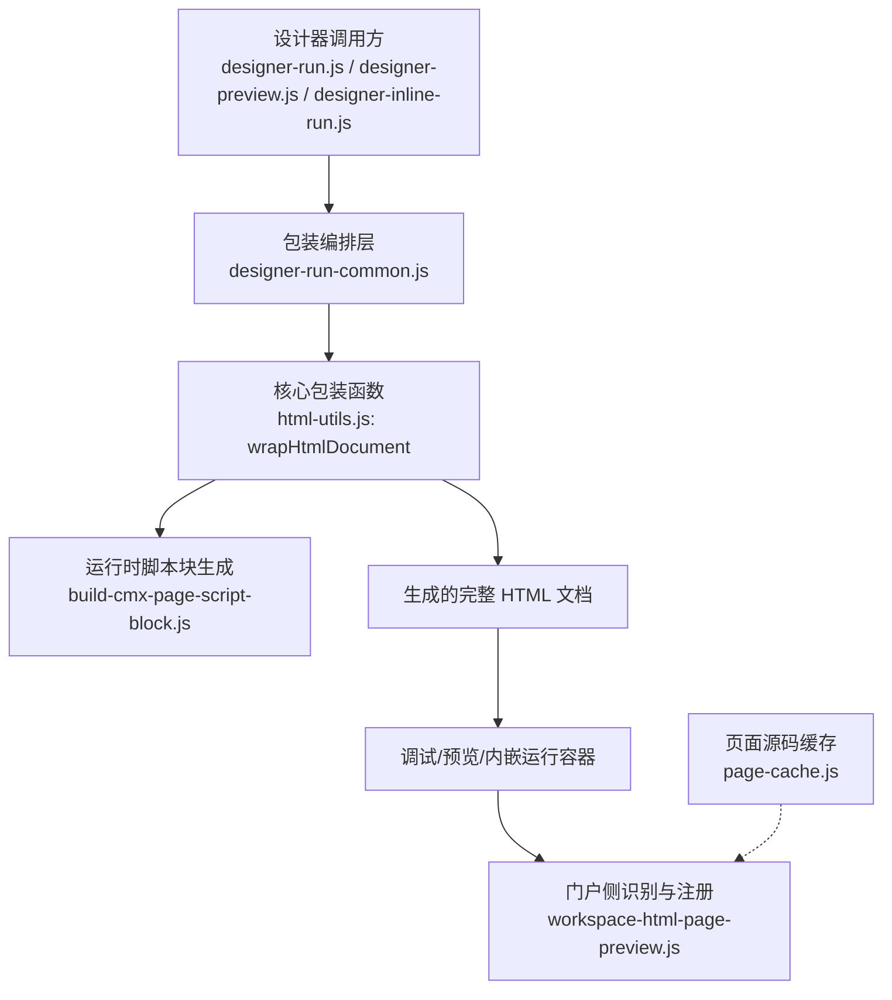
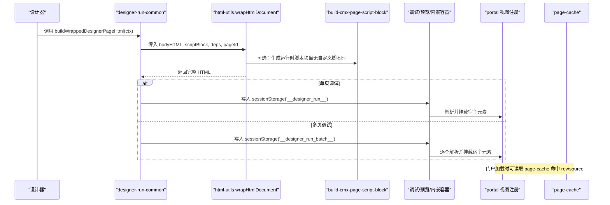
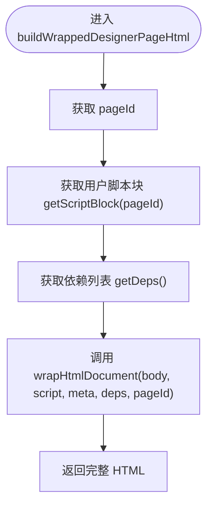
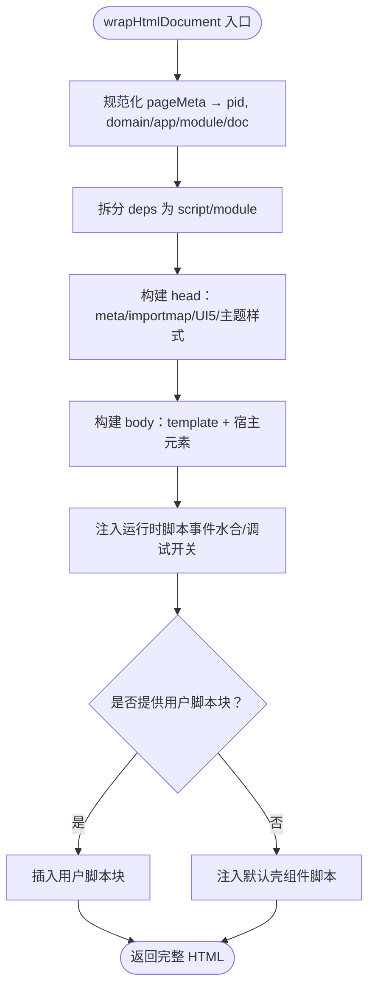
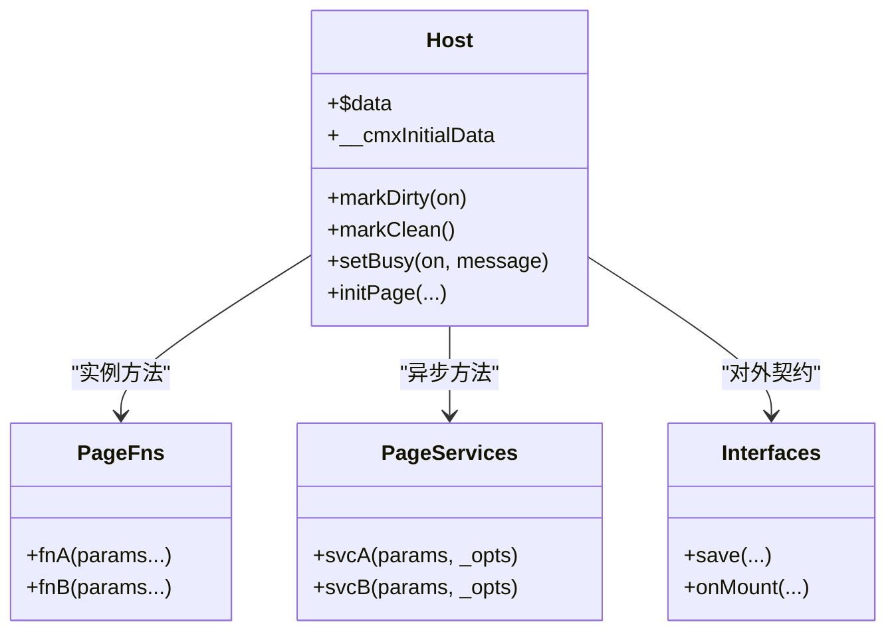
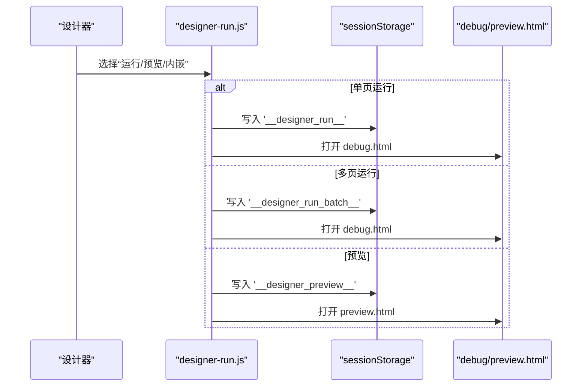
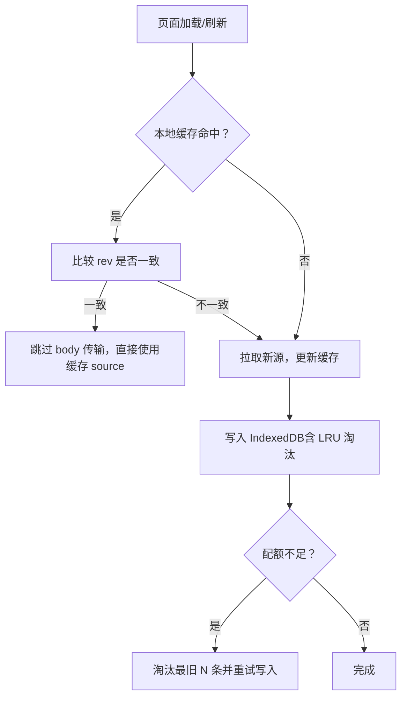
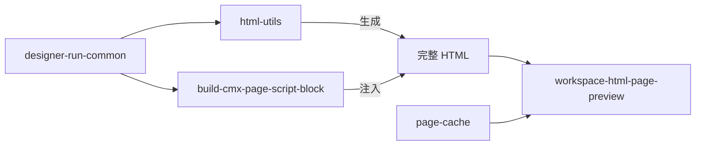

# 页面包装机制

<cite>
**本文引用的文件**
- [designer-run-common.js](file://CMXHTMLDesigner/src/components/designer-app/designer-run-common.js)
- [html-utils.js](file://CMXHTMLDesigner/src/utils/html-utils.js)
- [build-cmx-page-script-block.js](file://CMXHTMLDesigner/src/utils/build-cmx-page-script-block.js)
- [designer-run.js](file://CMXHTMLDesigner/src/components/designer-app/designer-run.js)
- [designer-preview.js](file://CMXHTMLDesigner/src/components/designer-app/designer-preview.js)
- [designer-inline-run.js](file://CMXHTMLDesigner/src/components/designer-app/designer-inline-run.js)
- [page-cache.js](file://CMXPortalManager/src/lib/page-cache.js)
- [workspace-html-page-preview.js](file://CMXPortalManager/src/lib/workspace-html-page-preview.js)
</cite>

## 目录
1. [简介](#简介)
2. [项目结构](#项目结构)
3. [核心组件](#核心组件)
4. [架构总览](#架构总览)
5. [详细组件分析](#详细组件分析)
6. [依赖关系分析](#依赖关系分析)
7. [性能考量](#性能考量)
8. [故障排查指南](#故障排查指南)
9. [结论](#结论)
10. [附录](#附录)

## 简介
本技术文档聚焦“设计器页面的 HTML 包装机制”，系统性说明从设计区到可运行页面的完整流程：如何提取与重组页面结构、注入运行时脚本与配置元数据、解析页面 ID、处理版本控制与缓存策略，以及单页/多页模式的差异。文档同时给出完整的流程图与扩展点说明，帮助读者理解并安全地扩展该机制。

## 项目结构
围绕页面包装的关键代码分布在以下模块：
- 设计器入口与调用方：designer-run.js、designer-preview.js、designer-inline-run.js
- 包装编排层：designer-run-common.js（统一构建包装 HTML）
- 核心包装实现：html-utils.js（wrapHtmlDocument 等）
- 运行时脚本块生成：build-cmx-page-script-block.js（将 page-data/fns/services/interfaces 编译为可执行脚本）
- 门户侧加载与渲染：workspace-html-page-preview.js（识别宿主元素并注册视图）
- 页面源码缓存：page-cache.js（IndexedDB LRU + 配额管理）

图表来源
- [designer-run.js:1-52](file://CMXHTMLDesigner/src/components/designer-app/designer-run.js#L1-L52)
- [designer-preview.js:1-27](file://CMXHTMLDesigner/src/components/designer-app/designer-preview.js#L1-L27)
- [designer-inline-run.js:1-92](file://CMXHTMLDesigner/src/components/designer-app/designer-inline-run.js#L1-L92)
- [designer-run-common.js:1-22](file://CMXHTMLDesigner/src/components/designer-app/designer-run-common.js#L1-L22)
- [html-utils.js:237-367](file://CMXHTMLDesigner/src/utils/html-utils.js#L237-L367)
- [build-cmx-page-script-block.js:28-312](file://CMXHTMLDesigner/src/utils/build-cmx-page-script-block.js#L28-L312)
- [workspace-html-page-preview.js:185-212](file://CMXPortalManager/src/lib/workspace-html-page-preview.js#L185-L212)
- [page-cache.js:1-312](file://CMXPortalManager/src/lib/page-cache.js#L1-L312)

章节来源
- [designer-run.js:1-52](file://CMXHTMLDesigner/src/components/designer-app/designer-run.js#L1-L52)
- [designer-preview.js:1-27](file://CMXHTMLDesigner/src/components/designer-app/designer-preview.js#L1-L27)
- [designer-inline-run.js:1-92](file://CMXHTMLDesigner/src/components/designer-app/designer-inline-run.js#L1-L92)
- [designer-run-common.js:1-22](file://CMXHTMLDesigner/src/components/designer-app/designer-run-common.js#L1-L22)
- [html-utils.js:237-367](file://CMXHTMLDesigner/src/utils/html-utils.js#L237-L367)
- [build-cmx-page-script-block.js:28-312](file://CMXHTMLDesigner/src/utils/build-cmx-page-script-block.js#L28-L312)
- [workspace-html-page-preview.js:185-212](file://CMXPortalManager/src/lib/workspace-html-page-preview.js#L185-L212)
- [page-cache.js:1-312](file://CMXPortalManager/src/lib/page-cache.js#L1-L312)

## 核心组件
- 包装编排器 buildWrappedDesignerPageHtml
  - 职责：从上下文获取 pageId、设计区 body HTML、用户脚本块与依赖列表，调用 wrapHtmlDocument 生成完整 HTML。
  - 输入：getPageId、getDesignBodyHtmlForExportAndRun、pageData.getScriptBlock/getDeps。
  - 输出：完整可运行的 HTML 字符串。
- 核心包装器 wrapHtmlDocument
  - 职责：组装 DOCTYPE/head/body，注入 importmap、UI5 主题与样式、模板与宿主元素、事件水合脚本、用户脚本或默认壳组件脚本。
  - 关键产物：
    - <template id="cmx-page-template-{slug}"> 承载设计区内容
    - <cmx-html-pages-{slug}> 作为宿主 Web Component
    - 事件水合函数 __hydrateEvents
    - 页面级坐标 $coord（domain/app/module/doc）
- 运行时脚本块生成 buildCmxScriptBlockFromPageState
  - 职责：将 page-data、page-fns、page-services、page-interfaces 编译为可在宿主实例上执行的脚本块，支持 sourceURL 断点定位、脏标记、忙状态、模型初始化委托等。
- 页面缓存 page-cache
  - 职责：使用 IndexedDB 持久化页面源码与版本信息，提供 LRU 淘汰、配额超限回退、批量读写、持久化存储请求等能力。
- 门户侧识别 workspace-html-page-preview
  - 职责：在渲染后查找宿主元素（data-cmx-html-page-host 或类名前缀），将其注册为视图区域，确保页面在门户中正确显示。

章节来源
- [designer-run-common.js:1-22](file://CMXHTMLDesigner/src/components/designer-app/designer-run-common.js#L1-L22)
- [html-utils.js:237-367](file://CMXHTMLDesigner/src/utils/html-utils.js#L237-L367)
- [build-cmx-page-script-block.js:28-312](file://CMXHTMLDesigner/src/utils/build-cmx-page-script-block.js#L28-L312)
- [page-cache.js:1-312](file://CMXPortalManager/src/lib/page-cache.js#L1-L312)
- [workspace-html-page-preview.js:185-212](file://CMXPortalManager/src/lib/workspace-html-page-preview.js#L185-L212)

## 架构总览
下图展示了从设计器到最终运行时的端到端流程，包括单页/多页模式与缓存路径。

图表来源
- [designer-run-common.js:1-22](file://CMXHTMLDesigner/src/components/designer-app/designer-run-common.js#L1-L22)
- [html-utils.js:237-367](file://CMXHTMLDesigner/src/utils/html-utils.js#L237-L367)
- [build-cmx-page-script-block.js:28-312](file://CMXHTMLDesigner/src/utils/build-cmx-page-script-block.js#L28-L312)
- [designer-run.js:13-51](file://CMXHTMLDesigner/src/components/designer-app/designer-run.js#L13-L51)
- [workspace-html-page-preview.js:185-212](file://CMXPortalManager/src/lib/workspace-html-page-preview.js#L185-L212)
- [page-cache.js:85-180](file://CMXPortalManager/src/lib/page-cache.js#L85-L180)

## 详细组件分析

### 包装编排器 buildWrappedDesignerPageHtml
- 作用：聚合上下文中的页面标识、设计区 HTML、用户脚本块与依赖，统一调用 wrapHtmlDocument 产出完整 HTML。
- 关键点：
  - 通过 ctx.getPageId() 获取页面 ID，用于生成唯一标签名与模板 ID。
  - 优先使用 ctx.pageData.getScriptBlock(pageId)，否则为空串，由 wrapHtmlDocument 注入默认壳脚本。
  - 依赖列表 deps 会被拆分为 script/module 两类，分别以 <script src> 与 importmap 形式注入。

图表来源
- [designer-run-common.js:10-21](file://CMXHTMLDesigner/src/components/designer-app/designer-run-common.js#L10-L21)

章节来源
- [designer-run-common.js:1-22](file://CMXHTMLDesigner/src/components/designer-app/designer-run-common.js#L1-L22)

### 核心包装器 wrapHtmlDocument
- 作用：构造完整 HTML 文档，包含 head 资源、importmap、UI5 主题、body 模板与宿主元素、事件水合脚本、用户脚本或默认壳脚本。
- 关键行为：
  - 页面 ID 规范化：slugForCmxHtmlPagesTag → 生成稳定的标签名与模板 ID。
  - 依赖注入：script 类型直接 <script src>；module 类型合并进 importmap。
  - 模板与宿主：<template id="cmx-page-template-{slug}"> + <cmx-html-pages-{slug}>。
  - 事件水合：__hydrateEvents 扫描 data-event* 属性并绑定事件处理器，支持 sourceURL 断点。
  - 默认壳组件：若无用户脚本，则注入 _cmxShellPageComponentScript，完成 Shadow DOM 挂载、$coord 设置与事件水合。
  - 元数据注入：可选的 <script type="application/json" id="__designer_meta__"> 用于再次导入恢复。

图表来源
- [html-utils.js:237-367](file://CMXHTMLDesigner/src/utils/html-utils.js#L237-L367)

章节来源
- [html-utils.js:237-367](file://CMXHTMLDesigner/src/utils/html-utils.js#L237-L367)

### 运行时脚本块生成 buildCmxScriptBlockFromPageState
- 作用：将设计器的 page-data、page-fns、page-services、page-interfaces 转换为可在宿主实例上执行的脚本块。
- 关键特性：
  - 数据绑定：基于 data-bind-* 的属性双向更新，Proxy 驱动 $data 变更。
  - 函数与服务：逐条 new Function/new AsyncFunction 注入，附带 sourceURL 便于调试。
  - WebSocket 服务：保持内联以维持闭包变量共享。
  - 接口契约：提供 markDirty/markClean/setBusy 与初始快照 __cmxInitialData，支持作者覆盖或默认实现。
  - 模型初始化：委托给 cmx-data-comp/init-page-models，框架不感知具体模型类。

图表来源
- [build-cmx-page-script-block.js:28-312](file://CMXHTMLDesigner/src/utils/build-cmx-page-script-block.js#L28-L312)

章节来源
- [build-cmx-page-script-block.js:28-312](file://CMXHTMLDesigner/src/utils/build-cmx-page-script-block.js#L28-L312)

### 单页与多页模式差异
- 单页模式：
  - 通过 openDesignerRunInNewWindow 将单个页面的 HTML 与 pageId 写入 sessionStorage('__designer_run__')，打开 debug.html 进行调试。
- 多页模式：
  - 通过 openDesignerMultiPagesRunInNewWindow 将多个页面的 HTML 与元信息写入 sessionStorage('__designer_run_batch__')，debug.html 按批次加载。
- 预览模式：
  - 通过 openDesignerPreview 将完整 HTML 写入 sessionStorage('__designer_preview__')，打开 preview.html 进行预览。
- 内嵌运行：
  - 通过 openDesignerInlineRunDialog 将包装后的 HTML 解析并注入到对话框容器中，保留主应用 UI5 环境。

图表来源
- [designer-run.js:13-51](file://CMXHTMLDesigner/src/components/designer-app/designer-run.js#L13-L51)
- [designer-preview.js:14-26](file://CMXHTMLDesigner/src/components/designer-app/designer-preview.js#L14-L26)
- [designer-inline-run.js:42-91](file://CMXHTMLDesigner/src/components/designer-app/designer-inline-run.js#L42-L91)

章节来源
- [designer-run.js:13-51](file://CMXHTMLDesigner/src/components/designer-app/designer-run.js#L13-L51)
- [designer-preview.js:14-26](file://CMXHTMLDesigner/src/components/designer-app/designer-preview.js#L14-L26)
- [designer-inline-run.js:42-91](file://CMXHTMLDesigner/src/components/designer-app/designer-inline-run.js#L42-L91)

### 页面 ID 解析与命名规范
- slugForCmxHtmlPagesTag：将业务 pageId 转为合法的 HTML 自定义元素名后缀（小写、数字、连字符，长度限制）。
- cmxHtmlPagesElementLocalName：生成宿主标签名 cmx-html-pages-{slug}。
- cmxPageTemplateElementId：生成模板 ID cmx-page-template-{slug}。
- cmxPageRuntimeClassName：生成 JS 类名 CmxHtmlPage_{slug}，保证合法标识符。

章节来源
- [html-utils.js:394-421](file://CMXHTMLDesigner/src/utils/html-utils.js#L394-L421)

### 版本控制与缓存策略
- 版本锚点：服务端返回的 rev（xxhash64→16hex）作为 ETag，本地 rev === server rev 即命中，跳过 body 传输。
- 存储介质：IndexedDB（cmx-page-cache），避免 localStorage 容量与同步阻塞问题。
- 容量策略：LRU 上限 500 项，启动时尝试 navigator.storage.persist() 防低压淘汰；写入捕获 QuotaExceededError 后主动淘汰最旧一批重试。
- 批量操作：getPages/putPages 减少往返；删除与清空支持调试与全量 bust。
- 坐标字段：domain/app/module/doc 随缓存条目保存，供 enrich 注入 host.$coord。

图表来源
- [page-cache.js:85-180](file://CMXPortalManager/src/lib/page-cache.js#L85-L180)
- [page-cache.js:206-278](file://CMXPortalManager/src/lib/page-cache.js#L206-L278)

章节来源
- [page-cache.js:85-180](file://CMXPortalManager/src/lib/page-cache.js#L85-L180)
- [page-cache.js:206-278](file://CMXPortalManager/src/lib/page-cache.js#L206-L278)

### 错误处理与回退机制
- 事件编译失败：__hydrateEvents 捕获异常并记录警告，不影响其他事件绑定。
- 脚本执行异常：事件处理器 try/catch 包裹，避免单点失败影响整体。
- 默认壳组件：当未提供用户脚本时，自动注入默认壳，确保页面仍可运行。
- 缓存写入失败：捕获配额错误并主动淘汰旧条目后重试；其他错误降级为日志。
- 弹窗拦截：预览/运行窗口被拦截时提示用户允许弹出并重试。

章节来源
- [html-utils.js:320-367](file://CMXHTMLDesigner/src/utils/html-utils.js#L320-L367)
- [designer-preview.js:19-25](file://CMXHTMLDesigner/src/components/designer-app/designer-preview.js#L19-L25)
- [page-cache.js:156-170](file://CMXPortalManager/src/lib/page-cache.js#L156-L170)

### 自定义扩展点
- 用户脚本块注入：通过 pageData.getScriptBlock(pageId) 返回自定义脚本，替代默认壳。
- 依赖声明：通过 pageData.getDeps() 声明外部依赖，支持 script/module 两种加载方式。
- 页面接口契约：通过 page-interfaces 暴露 save/onMount 等接口，支持作者覆盖或默认实现。
- 模型初始化：通过 globalThis.__cmxInitPageModels 或动态 import 指定模型初始化逻辑。
- 宿主识别：门户侧通过 data-cmx-html-page-host 或类名前缀识别宿主元素并注册视图。

章节来源
- [designer-run-common.js:10-21](file://CMXHTMLDesigner/src/components/designer-app/designer-run-common.js#L10-L21)
- [html-utils.js:237-367](file://CMXHTMLDesigner/src/utils/html-utils.js#L237-L367)
- [build-cmx-page-script-block.js:28-312](file://CMXHTMLDesigner/src/utils/build-cmx-page-script-block.js#L28-L312)
- [workspace-html-page-preview.js:185-212](file://CMXPortalManager/src/lib/workspace-html-page-preview.js#L185-L212)

## 依赖关系分析
- 低耦合：designer-run-common 仅负责参数聚合，核心逻辑集中在 html-utils 与 build-cmx-page-script-block。
- 明确边界：运行时脚本块生成与 HTML 包装解耦，便于独立测试与替换。
- 门户集成：workspace-html-page-preview 通过约定式选择器识别宿主，降低侵入性。
- 缓存透明：page-cache 提供统一的读/写/淘汰 API，上层无需关心存储细节。

图表来源
- [designer-run-common.js:1-22](file://CMXHTMLDesigner/src/components/designer-app/designer-run-common.js#L1-L22)
- [html-utils.js:237-367](file://CMXHTMLDesigner/src/utils/html-utils.js#L237-L367)
- [build-cmx-page-script-block.js:28-312](file://CMXHTMLDesigner/src/utils/build-cmx-page-script-block.js#L28-L312)
- [workspace-html-page-preview.js:185-212](file://CMXPortalManager/src/lib/workspace-html-page-preview.js#L185-L212)
- [page-cache.js:1-312](file://CMXPortalManager/src/lib/page-cache.js#L1-L312)

章节来源
- [designer-run-common.js:1-22](file://CMXHTMLDesigner/src/components/designer-app/designer-run-common.js#L1-L22)
- [html-utils.js:237-367](file://CMXHTMLDesigner/src/utils/html-utils.js#L237-L367)
- [build-cmx-page-script-block.js:28-312](file://CMXHTMLDesigner/src/utils/build-cmx-page-script-block.js#L28-L312)
- [workspace-html-page-preview.js:185-212](file://CMXPortalManager/src/lib/workspace-html-page-preview.js#L185-L212)
- [page-cache.js:1-312](file://CMXPortalManager/src/lib/page-cache.js#L1-L312)

## 性能考量
- 模板克隆：使用 template.content.cloneNode(true) 替代 innerHTML 序列化，提升渲染性能。
- 依赖加载：script 类型同步加载确保全局可用；module 类型通过 importmap 统一管理。
- 事件水合：new Function 替代 eval，配合 sourceURL 提高调试效率。
- 缓存命中：rev 比对避免重复传输 body；LRU 控制内存占用；批量读写减少 IO 次数。
- 主题内联：将主题 CSS 变量内联，减少外部请求，提升首屏体验。

[本节为通用性能建议，不直接分析具体文件]

## 故障排查指南
- 事件未生效
  - 检查 data-event* 属性是否正确；查看 __hydrateEvents 是否执行；确认事件编译无异常。
- 脚本未执行
  - 确认用户脚本块已注入；检查浏览器控制台是否有语法错误；验证 sourceURL 是否可定位。
- 预览/调试窗口被拦截
  - 允许站点弹出窗口；检查 open 返回值；必要时改用内嵌运行。
- 缓存导致旧版本
  - 清理 IndexedDB 缓存或触发 bust；核对 rev 是否更新；检查 LRU 淘汰是否生效。
- 配额不足
  - 观察 QuotaExceededError；等待自动淘汰重试；必要时手动清空缓存。

章节来源
- [html-utils.js:320-367](file://CMXHTMLDesigner/src/utils/html-utils.js#L320-L367)
- [designer-preview.js:19-25](file://CMXHTMLDesigner/src/components/designer-app/designer-preview.js#L19-L25)
- [page-cache.js:156-170](file://CMXPortalManager/src/lib/page-cache.js#L156-L170)
- [page-cache.js:195-204](file://CMXPortalManager/src/lib/page-cache.js#L195-L204)

## 结论
页面包装机制通过清晰的职责划分与可扩展的注入点，实现了从设计区到可运行页面的稳定转换。wrapHtmlDocument 负责结构与资源装配，buildCmxPageScriptBlockFromPageState 负责运行时逻辑编译，page-cache 提供高性能缓存保障，门户侧通过约定式识别完成集成。单页/多页模式与内嵌运行覆盖了常见调试与预览场景，错误处理与回退机制确保鲁棒性。

[本节为总结性内容，不直接分析具体文件]

## 附录
- 关键函数路径参考
  - 包装编排：designer-run-common.js:10-21
  - 核心包装：html-utils.js:237-367
  - 脚本块生成：build-cmx-page-script-block.js:28-312
  - 单页/多页运行：designer-run.js:13-51
  - 预览：designer-preview.js:14-26
  - 内嵌运行：designer-inline-run.js:42-91
  - 门户识别：workspace-html-page-preview.js:185-212
  - 缓存：page-cache.js:85-180, 206-278

[本节为索引性内容，不直接分析具体文件]