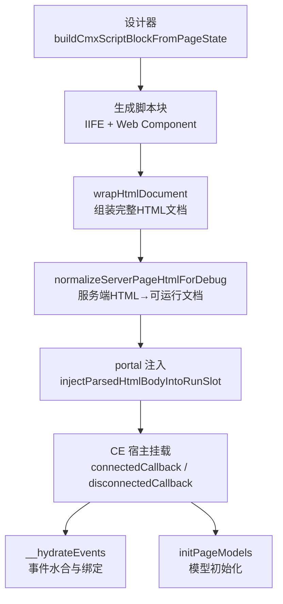
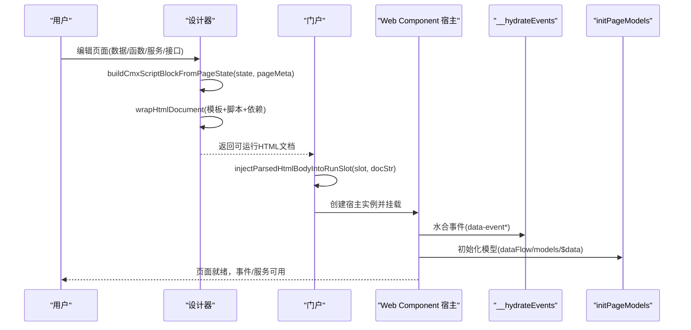
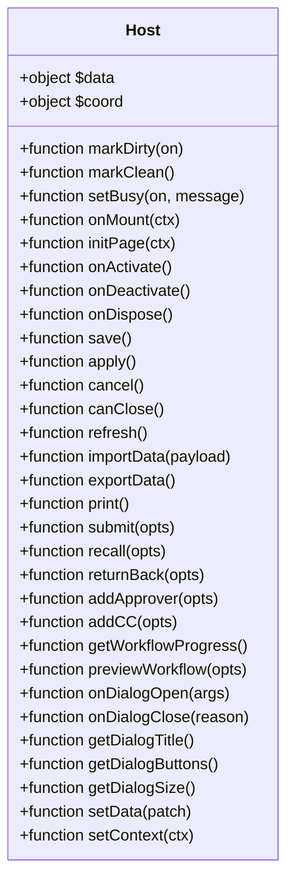
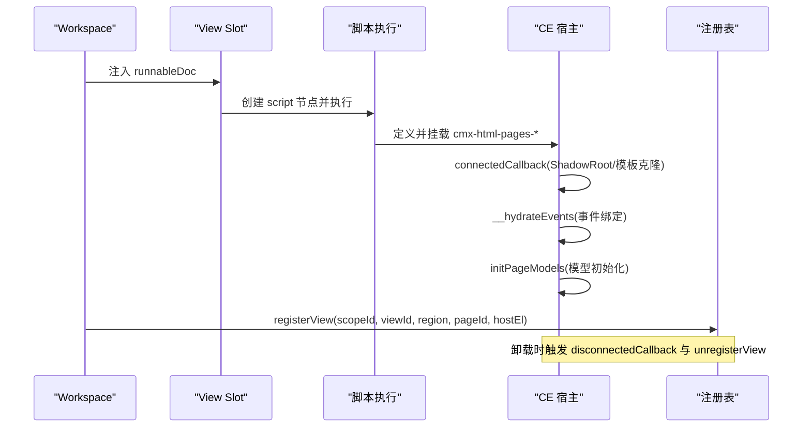
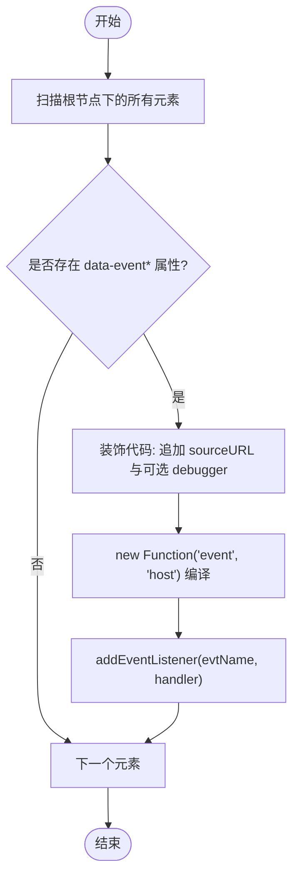
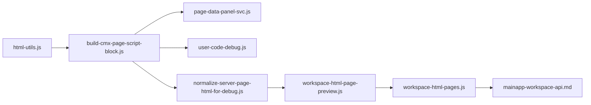

# 页内执行引擎

<cite>
**本文引用的文件**
- [build-cmx-page-script-block.js](file://CMXHTMLDesigner/src/utils/build-cmx-page-script-block.js)
- [html-utils.js](file://CMXHTMLDesigner/src/utils/html-utils.js)
- [normalize-server-page-html-for-debug.js](file://CMXHTMLDesigner/src/utils/normalize-server-page-html-for-debug.js)
- [page-interface-registry.js](file://CMXHTMLDesigner/src/components/designer-page-data/page-interface-registry.js)
- [page-data-panel-svc.js](file://CMXHTMLDesigner/src/components/designer-page-data/page-data-panel-svc.js)
- [user-code-debug.js](file://CMXHTMLDesigner/src/utils/user-code-debug.js)
- [workspace-html-page-preview.js](file://CMXPortalManager/src/lib/workspace-html-page-preview.js)
- [workspace-html-pages.js](file://CMXPortalManager/src/lib/workspace-html-pages.js)
- [mainapp-workspace-api.md](file://CMXPortalManager/docs/mainapp-workspace-api.md)
</cite>

## 目录
1. [简介](#简介)
2. [项目结构](#项目结构)
3. [核心组件](#核心组件)
4. [架构总览](#架构总览)
5. [详细组件分析](#详细组件分析)
6. [依赖关系分析](#依赖关系分析)
7. [性能考量](#性能考量)
8. [故障排查指南](#故障排查指南)
9. [结论](#结论)
10. [附录：API参考与最佳实践](#附录api参考与最佳实践)

## 简介
本技术文档面向“页内执行引擎”，聚焦以下目标：
- 脚本解析机制：如何将设计器保存的页面状态（数据、函数、服务、接口）编译为可执行的运行时脚本。
- 函数提取与上下文隔离：如何从元数据中提取函数体，并以稳定的 sourceURL 注入到宿主实例作用域中。
- 事件通信协议与消息传递：如何通过 data-event* 属性将用户代码编译为事件处理器，并绑定到 DOM。
- 状态同步策略：$data 代理绑定、脏标记、初始快照与模型初始化流程。
- 安全沙箱与权限控制：基于 new Function/AsyncFunction 的作用域限制、sourceURL 调试隔离、以及资源限制建议。
- 调试工具集成：断点支持、变量监视、调试模式开关与 DevTools 友好化。
- API 参考与最佳实践：面向使用者的运行期契约、调用约定与使用示例。

## 项目结构
页内执行引擎由“设计器侧”和“门户侧”两部分协作完成：
- 设计器侧负责把“画布 HTML + 元数据”转换为“可运行的完整 HTML 文档”，并在其中注入 Web Component、事件水合、函数与服务实现。
- 门户侧负责在 workspace 视图中加载、注入并执行该文档，完成视图注册、生命周期管理与卸载。

**图表来源**
- [build-cmx-page-script-block.js:28-312](file://CMXHTMLDesigner/src/utils/build-cmx-page-script-block.js#L28-L312)
- [html-utils.js:237-367](file://CMXHTMLDesigner/src/utils/html-utils.js#L237-L367)
- [normalize-server-page-html-for-debug.js:13-76](file://CMXHTMLDesigner/src/utils/normalize-server-page-html-for-debug.js#L13-L76)
- [workspace-html-page-preview.js:109-271](file://CMXPortalManager/src/lib/workspace-html-page-preview.js#L109-L271)

**章节来源**
- [build-cmx-page-script-block.js:28-312](file://CMXHTMLDesigner/src/utils/build-cmx-page-script-block.js#L28-L312)
- [html-utils.js:237-367](file://CMXHTMLDesigner/src/utils/html-utils.js#L237-L367)
- [normalize-server-page-html-for-debug.js:13-76](file://CMXHTMLDesigner/src/utils/normalize-server-page-html-for-debug.js#L13-L76)
- [workspace-html-page-preview.js:109-271](file://CMXPortalManager/src/lib/workspace-html-page-preview.js#L109-L271)

## 核心组件
- 脚本构建器：根据页面状态生成 IIFE 与 Web Component，注册 $data、host、函数、服务、对外接口，并委托模型初始化。
- 文档装配器：将画布片段、脚本块、依赖与元数据包装成完整 HTML 文档，注入 __hydrateEvents 与调试开关。
- 服务端适配：将服务器保存的源码包（含 __designer_meta__）转换为可运行文档，兼容旧版整页与新片段。
- 门户注入器：在 workspace 视图中解析并注入可运行文档，注册视图、设置 props/actions、处理卸载与刷新。
- 事件水合：遍历 data-event* 属性，编译用户代码为事件处理器，附加 sourceURL 与可选 debugger 前缀。
- 服务生成器：按 REST/JSON-RPC/GraphQL/WebSocket 类型生成请求逻辑与响应转换，封装为 host 方法。
- 调试工具：提供 makeSourceUrl、decorateUserCode、debugModeRuntimeLiteral 等能力，使每条用户代码独立可见并可断点。

**章节来源**
- [build-cmx-page-script-block.js:28-312](file://CMXHTMLDesigner/src/utils/build-cmx-page-script-block.js#L28-L312)
- [html-utils.js:237-367](file://CMXHTMLDesigner/src/utils/html-utils.js#L237-L367)
- [normalize-server-page-html-for-debug.js:13-76](file://CMXHTMLDesigner/src/utils/normalize-server-page-html-for-debug.js#L13-L76)
- [workspace-html-page-preview.js:109-271](file://CMXPortalManager/src/lib/workspace-html-page-preview.js#L109-L271)
- [page-data-panel-svc.js:373-569](file://CMXHTMLDesigner/src/components/designer-page-data/page-data-panel-svc.js#L373-L569)
- [user-code-debug.js:1-59](file://CMXHTMLDesigner/src/utils/user-code-debug.js#L1-L59)

## 架构总览
页内执行引擎采用“设计时元数据 → 运行时脚本 → 宿主实例 → 事件/模型/服务”的分层架构：
- 设计时：页面状态包含 pageData、pageFns、pageServices、pageInterfaces、dataFlow、models 等。
- 运行时：通过 buildCmxScriptBlockFromPageState 生成 IIFE，定义 Web Component，挂载 $data/host，注册函数与服务，声明对外接口。
- 宿主：portal 将可运行文档注入 slot，执行脚本，注册视图，维护生命周期与卸载。
- 事件：__hydrateEvents 扫描 data-event*，编译并绑定事件处理器；支持调试模式自动插入 debugger。
- 模型：委托 cmx-data-comp 的 initPageModels 进行数据流与模型初始化。

**图表来源**
- [build-cmx-page-script-block.js:28-312](file://CMXHTMLDesigner/src/utils/build-cmx-page-script-block.js#L28-L312)
- [html-utils.js:237-367](file://CMXHTMLDesigner/src/utils/html-utils.js#L237-L367)
- [workspace-html-page-preview.js:109-271](file://CMXPortalManager/src/lib/workspace-html-page-preview.js#L109-L271)

## 详细组件分析

### 脚本构建器：buildCmxScriptBlockFromPageState
职责：
- 校验并过滤合法 pageData、pageFns、pageServices、pageInterfaces。
- 生成 IIFE 与 Web Component，注入 $data（Proxy 绑定）、host（坐标、脏标记、忙状态、初始快照）。
- 逐条用 new Function 注入 pageFns，参数顺序固定为 "$data","host",...params，附带 sourceURL 与可选 debugger。
- 生成 pageServices：REST/JSON-RPC/GraphQL 使用 AsyncFunction，WebSocket 共享闭包变量；支持 responseTo 与 responseTransform。
- 注册对外接口：按 PAGE_INTERFACE_REGISTRY 生成默认实现或用户覆盖；提供 markDirty/markClean/setBusy 等能力。
- 委托模型初始化：动态 import initPageModels 并传入 dataFlow/dataSources/models、host、root、$data。

复杂度与优化：
- 模板查询缓存至 IIFE 闭包，避免多实例重复 querySelector。
- 使用 fragment cloneNode(true) 替代 innerHTML 字符串路径，提升渲染性能。
- 接口与函数按 registry 顺序稳定生成，便于宿主消费。

**章节来源**
- [build-cmx-page-script-block.js:28-312](file://CMXHTMLDesigner/src/utils/build-cmx-page-script-block.js#L28-L312)
- [page-interface-registry.js:44-434](file://CMXHTMLDesigner/src/components/designer-page-data/page-interface-registry.js#L44-L434)

#### 类图（运行时宿主与方法）

**图表来源**
- [build-cmx-page-script-block.js:235-280](file://CMXHTMLDesigner/src/utils/build-cmx-page-script-block.js#L235-L280)
- [page-interface-registry.js:44-434](file://CMXHTMLDesigner/src/components/designer-page-data/page-interface-registry.js#L44-L434)

### 文档装配器：wrapHtmlDocument
职责：
- 将画布片段、脚本块、依赖与元数据组合为完整 HTML 文档。
- 注入 __cmxDebug 开关、__cmxPageId、__cmxNodeIdOf、__cmxDecorate、__hydrateEvents。
- 生成 cmx-html-pages-* 宿主标签与 template，确保多页互不冲突。
- 支持 script/module 依赖加载与 importmap 配置。

关键点：
- 事件水合：遍历 data-event*，编译用户代码为 new Function("event", src)，附加 sourceURL 与可选 debugger。
- 主题与样式：内联 UI5 主题参数，保证导出页面无 CDN 也可正确显示。

**章节来源**
- [html-utils.js:237-367](file://CMXHTMLDesigner/src/utils/html-utils.js#L237-L367)

### 服务端适配：normalizeServerPageHtmlForDebug
职责：
- 将服务器保存的源码包（可能仅含画布片段与 __designer_meta__）转换为可运行文档。
- 若输入已是可运行文档（含 __hydrateEvents 与 cmx-html-pages-*），直接返回。
- 否则解析 meta，提取设计区片段，调用 buildCmxScriptBlockFromPageState 生成脚本块，再调用 wrapHtmlDocument 组装。

兼容性：
- 兼容旧版整页与新片段两种形态。
- 对非法 JSON meta 保持降级，仍可使用仅 UI 的 wrap。

**章节来源**
- [normalize-server-page-html-for-debug.js:13-76](file://CMXHTMLDesigner/src/utils/normalize-server-page-html-for-debug.js#L13-L76)

### 门户注入器：workspace-html-page-preview
职责：
- 将可运行文档注入 workspace 的 run-slot，执行脚本，注册视图，设置 props/actions。
- 处理刷新修复：当 CE 已 define 但模板内容变化时，替换 shadowRoot 并重新水合事件。
- 卸载钩子：链式调用 host.__cmxDispose，并 unregisterView 释放资源。
- 兼容旧版 payload：支持 textarea 与 script[type="application/json"] 两种载荷形式。

关键流程：
- 注入前设置 globalThis.workspace 与 __cmxTemplateRoot，供脚本与 CE 查找模板。
- 注入后定位宿主元素，注册 view，挂 lazy actions getter，监听移除以清理。

**章节来源**
- [workspace-html-page-preview.js:109-271](file://CMXPortalManager/src/lib/workspace-html-page-preview.js#L109-L271)
- [workspace-html-pages.js:299-337](file://CMXPortalManager/src/lib/workspace-html-pages.js#L299-L337)
- [mainapp-workspace-api.md:267-296](file://CMXPortalManager/docs/mainapp-workspace-api.md#L267-L296)

#### 序列图：视图注入与生命周期

**图表来源**
- [workspace-html-page-preview.js:109-271](file://CMXPortalManager/src/lib/workspace-html-page-preview.js#L109-L271)
- [html-utils.js:237-367](file://CMXHTMLDesigner/src/utils/html-utils.js#L237-L367)

### 事件通信协议与消息传递
- 协议：DOM 元素的 data-event* 属性承载用户代码，* 为事件名（如 click、input）。
- 编译：__cmxDecorate 将代码拼接为 new Function("event", "with(host){...}") 或 new Function("event")，附加 sourceURL 与可选 debugger。
- 绑定：__hydrateEvents 遍历 root.querySelectorAll("*")，为每个带 data-event* 的元素添加事件监听。
- 作用域：优先使用 localHost（宿主实例），否则 null；异常被捕获并记录，不影响其余订阅者。

**章节来源**
- [html-utils.js:327-356](file://CMXHTMLDesigner/src/utils/html-utils.js#L327-L356)
- [user-code-debug.js:18-37](file://CMXHTMLDesigner/src/utils/user-code-debug.js#L18-L37)

#### 流程图：事件水合与执行

**图表来源**
- [html-utils.js:327-356](file://CMXHTMLDesigner/src/utils/html-utils.js#L327-L356)

### 状态同步策略
- $data 代理：使用 Proxy 拦截 set，触发 __applyBindings 更新 DOM 上 data-bind-* 绑定的属性。
- 脏标记：host.markDirty/on 控制 __cmxDirty，并派发 cmx-page-dirty-changed 事件。
- 初始快照：host.__cmxInitialData 在 fns/svcs 注册后抓取 _$dataRaw 的深拷贝，用于 reset。
- 模型初始化：委托 initPageModels，传入 dataFlow/dataSources/models、host、root、$data；失败时回退到调用 host.initPage({})。

**章节来源**
- [build-cmx-page-script-block.js:111-163](file://CMXHTMLDesigner/src/utils/build-cmx-page-script-block.js#L111-L163)
- [build-cmx-page-script-block.js:235-298](file://CMXHTMLDesigner/src/utils/build-cmx-page-script-block.js#L235-L298)

### 安全沙箱与权限控制
- 作用域隔离：用户代码通过 new Function/AsyncFunction 编译，作用域限定为形参列表（$data、host、params、_opts），无法访问外部全局变量。
- 调试隔离：每条用户代码附加 stable sourceURL（cmx://...），DevTools 可按 URL 持久化断点。
- 资源限制建议：
  - 网络：服务调用走 fetch/WebSocket，建议在后端或服务网关层实施域名白名单、QPS/超时/响应体大小限制。
  - 内存：避免在用户代码中创建大对象或无限循环；可在宿主层监控长任务并中断。
  - 权限：默认 deny-by-default，仅暴露必要能力（$data、host、fetch/WebSocket）；如需扩展能力（如 HTTP 出站），应通过 manifest 申请并受策略表约束。

**章节来源**
- [build-cmx-page-script-block.js:165-233](file://CMXHTMLDesigner/src/utils/build-cmx-page-script-block.js#L165-L233)
- [html-utils.js:327-356](file://CMXHTMLDesigner/src/utils/html-utils.js#L327-L356)
- [user-code-debug.js:1-59](file://CMXHTMLDesigner/src/utils/user-code-debug.js#L1-L59)

### 调试工具集成、断点支持与变量监视
- 调试模式：getDesignerDebugMode/setDesignerDebugMode 管理 sessionStorage 中的调试开关；debugModeRuntimeLiteral 输出 window.__cmxDebug 的初值。
- 断点注入：decorateUserCode 在首行插入 debugger;（当 breakOnEnter=true）；__cmxDecorate 在事件水合时同样支持。
- 变量监视：sourceURL 使 DevTools Sources 面板将每条用户代码作为独立虚拟文件展示，便于查看局部变量与作用域。
- 编辑器集成：CodeMirror 支持插入 debugger; 并提供 JS 补全（$data.host 成员提示）。

**章节来源**
- [user-code-debug.js:1-59](file://CMXHTMLDesigner/src/utils/user-code-debug.js#L1-L59)
- [html-utils.js:327-356](file://CMXHTMLDesigner/src/utils/html-utils.js#L327-L356)
- [page-data-codemirror.js:63-98](file://CMXHTMLDesigner/src/components/designer-page-data/page-data-codemirror.js#L63-L98)

## 依赖关系分析
- 设计器侧依赖：
  - html-utils：模板/文档装配、事件水合、slug/class 生成。
  - build-cmx-page-script-block：脚本构建、函数/服务/接口注入。
  - page-data-panel-svc：服务代码生成与函数体提取。
  - user-code-debug：调试开关与 sourceURL 装饰。
- 门户侧依赖：
  - workspace-html-page-preview：视图注入、生命周期管理、卸载清理。
  - workspace-html-pages：批量加载与缓存、预览字段增强。
  - mainapp-workspace-api：区域配置与数据加载流程说明。

**图表来源**
- [html-utils.js:237-367](file://CMXHTMLDesigner/src/utils/html-utils.js#L237-L367)
- [build-cmx-page-script-block.js:28-312](file://CMXHTMLDesigner/src/utils/build-cmx-page-script-block.js#L28-L312)
- [page-data-panel-svc.js:373-569](file://CMXHTMLDesigner/src/components/designer-page-data/page-data-panel-svc.js#L373-L569)
- [normalize-server-page-html-for-debug.js:13-76](file://CMXHTMLDesigner/src/utils/normalize-server-page-html-for-debug.js#L13-L76)
- [workspace-html-page-preview.js:109-271](file://CMXPortalManager/src/lib/workspace-html-page-preview.js#L109-L271)
- [workspace-html-pages.js:299-337](file://CMXPortalManager/src/lib/workspace-html-pages.js#L299-L337)
- [mainapp-workspace-api.md:267-296](file://CMXPortalManager/docs/mainapp-workspace-api.md#L267-L296)

**章节来源**
- [html-utils.js:237-367](file://CMXHTMLDesigner/src/utils/html-utils.js#L237-L367)
- [build-cmx-page-script-block.js:28-312](file://CMXHTMLDesigner/src/utils/build-cmx-page-script-block.js#L28-L312)
- [page-data-panel-svc.js:373-569](file://CMXHTMLDesigner/src/components/designer-page-data/page-data-panel-svc.js#L373-L569)
- [normalize-server-page-html-for-debug.js:13-76](file://CMXHTMLDesigner/src/utils/normalize-server-page-html-for-debug.js#L13-L76)
- [workspace-html-page-preview.js:109-271](file://CMXPortalManager/src/lib/workspace-html-page-preview.js#L109-L271)
- [workspace-html-pages.js:299-337](file://CMXPortalManager/src/lib/workspace-html-pages.js#L299-L337)
- [mainapp-workspace-api.md:267-296](file://CMXPortalManager/docs/mainapp-workspace-api.md#L267-L296)

## 性能考量
- 模板克隆：使用 template.content.cloneNode(true) 替代 innerHTML 字符串路径，减少序列化/解析开销。
- 查询缓存：_resolveTpl 缓存模板引用，避免多实例重复 querySelector。
- 事件水合：一次性遍历 root.querySelectorAll("*")，批量绑定事件，异常隔离不影响其他绑定。
- 模型初始化：异步 .then() 链，失败时回退到 initPage，避免阻塞主流程。
- 刷新修复：比较 shadowRoot 内容与当前模板，不一致时替换并重水合，避免旧模板导致的显示问题。

[本节为通用性能指导，无需特定文件来源]

## 故障排查指南
- 事件编译失败：检查 data-event* 属性中的代码语法；查看控制台 "[event compile]" 警告。
- 事件执行错误：查看控制台 "[event]" 警告；确认 localHost 是否正确注入。
- 模型初始化失败：查看 "[cmx-html-pages] initPageModels failed" 警告；确认 dataFlow/models 配置正确。
- 视图注入失败：检查 portal 注入时的异常信息；确认 slot 存在且未被重复 hydrate。
- 调试模式无效：确认 sessionStorage 中调试开关已设置；检查 window.__cmxDebug 是否为 true。

**章节来源**
- [html-utils.js:327-356](file://CMXHTMLDesigner/src/utils/html-utils.js#L327-L356)
- [build-cmx-page-script-block.js:284-298](file://CMXHTMLDesigner/src/utils/build-cmx-page-script-block.js#L284-L298)
- [workspace-html-page-preview.js:326-411](file://CMXPortalManager/src/lib/workspace-html-page-preview.js#L326-L411)
- [user-code-debug.js:39-59](file://CMXHTMLDesigner/src/utils/user-code-debug.js#L39-L59)

## 结论
页内执行引擎通过“设计时元数据 → 运行时脚本 → 宿主实例 → 事件/模型/服务”的分层架构，实现了：
- 安全的脚本执行：基于 new Function/AsyncFunction 的作用域限制与 sourceURL 调试隔离。
- 灵活的事件通信：data-event* 属性驱动，编译为事件处理器并绑定到 DOM。
- 可靠的状态同步：$data 代理绑定、脏标记、初始快照与模型初始化。
- 完善的调试体验：断点支持、变量监视、调试模式开关与 DevTools 友好化。
- 可扩展的服务体系：REST/JSON-RPC/GraphQL/WebSocket 统一封装，支持响应转换与数据映射。

[本节为总结性内容，无需特定文件来源]

## 附录：API参考与最佳实践

### 运行期 API（host 方法）
- 状态查询：isDirty、getState、validate、getResult、isEditable、isLocked、canUndo、canRedo。
- 生命周期：onMount(ctx)、initPage(ctx)、onActivate、onDeactivate、onDispose。
- 编辑动作：undo、redo、reset、setEditable(on)、setLocked(on)。
- 持久化：save()、apply()、cancel()、canClose()、refresh()、importData(payload)、exportData()、print()。
- 工作流：submit(opts)、recall(opts)、returnBack(opts)、addApprover(opts)、addCC(opts)、getWorkflowProgress()、previewWorkflow(opts)。
- 对话框：onDialogOpen(args)、onDialogClose(reason)、getDialogTitle()、getDialogButtons()、getDialogSize()。
- 数据注入：setData(patch)、setContext(ctx)。

调用约定：
- 隐式参数：$data、host（顺序固定在前）。
- 显式参数：见各接口 params。
- 返回值：同步方法返回布尔/对象；异步方法返回 Promise。

**章节来源**
- [page-interface-registry.js:44-434](file://CMXHTMLDesigner/src/components/designer-page-data/page-interface-registry.js#L44-L434)
- [build-cmx-page-script-block.js:235-280](file://CMXHTMLDesigner/src/utils/build-cmx-page-script-block.js#L235-L280)

### 使用示例
- 页面函数：在 pageFns 中定义函数体，运行时通过 host.fnName($data, host, ...params) 调用。
- 页面服务：在 pageServices 中配置 REST/JSON-RPC/GraphQL/WebSocket，运行时通过 host.serviceName(params, _opts) 调用。
- 事件绑定：在 DOM 元素上添加 data-eventclick="console.log('clicked')"，运行时自动编译并绑定。
- 模型初始化：在 dataFlow/models 中配置数据流与模型，运行时通过 initPageModels 初始化。

**章节来源**
- [build-cmx-page-script-block.js:165-233](file://CMXHTMLDesigner/src/utils/build-cmx-page-script-block.js#L165-L233)
- [page-data-panel-svc.js:373-569](file://CMXHTMLDesigner/src/components/designer-page-data/page-data-panel-svc.js#L373-L569)
- [html-utils.js:327-356](file://CMXHTMLDesigner/src/utils/html-utils.js#L327-L356)

### 最佳实践
- 函数体保持简洁：避免复杂逻辑，必要时拆分为多个函数。
- 服务调用加超时：通过 _opts.signal 支持取消请求，避免长时间阻塞。
- 事件处理异常隔离：在事件代码中捕获异常，避免影响其他事件。
- 调试模式谨慎使用：生产环境关闭 debugger; 注入，避免意外暂停。
- 资源限制：在服务网关层实施域名白名单、QPS/超时/响应体大小限制，防止滥用。

[本节为通用指导，无需特定文件来源]