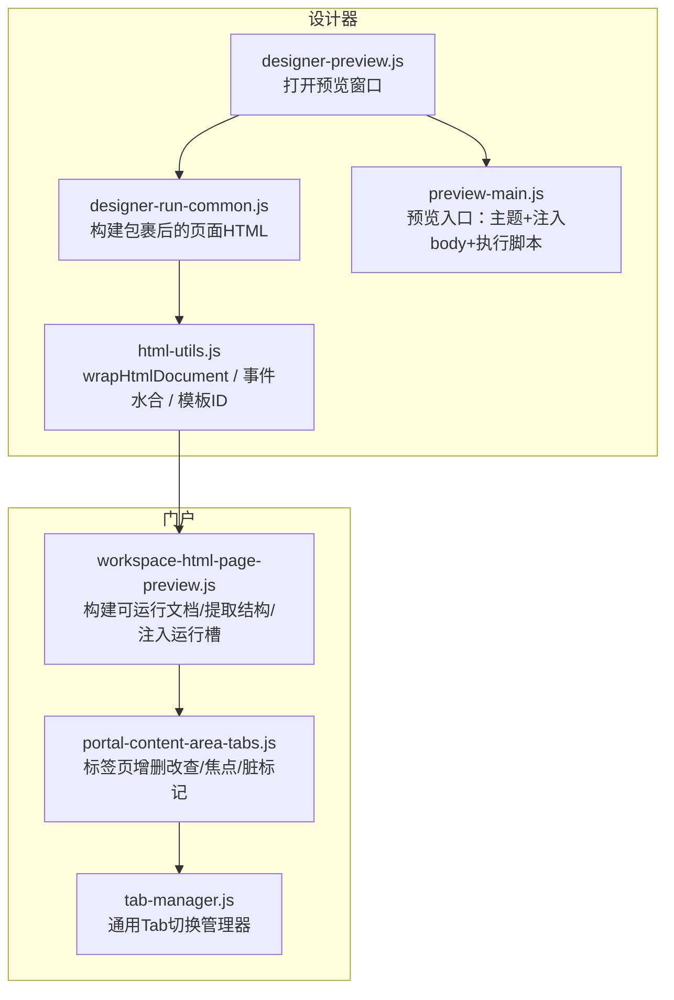
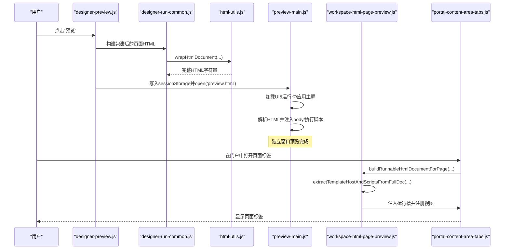
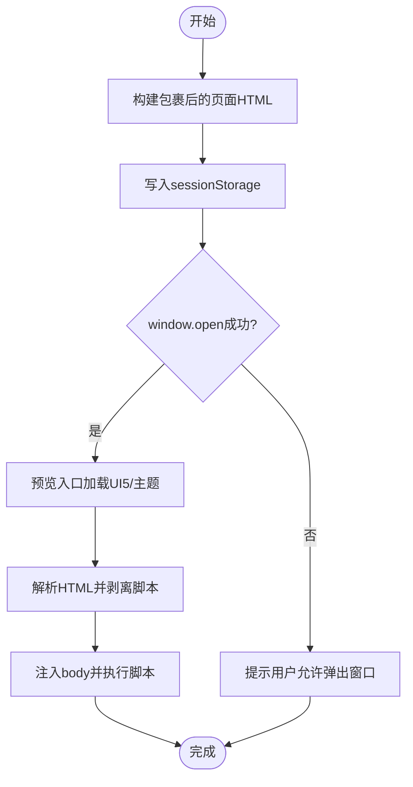
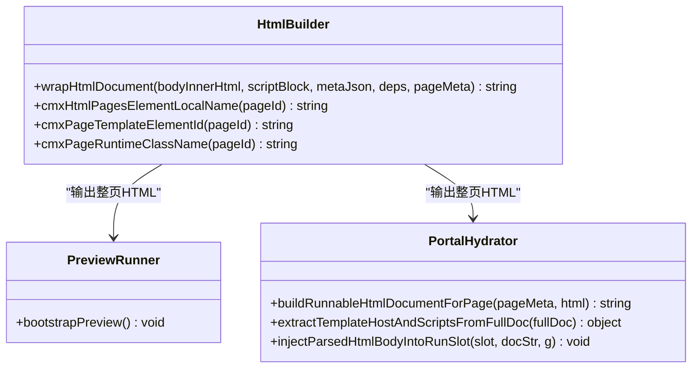
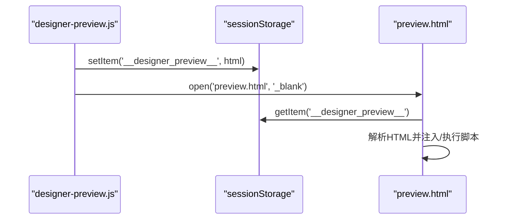
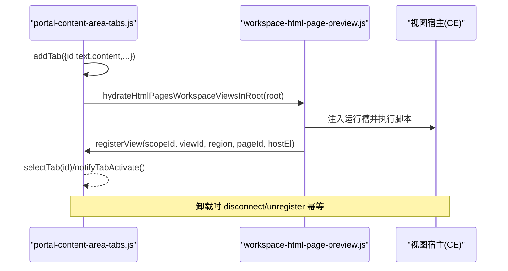
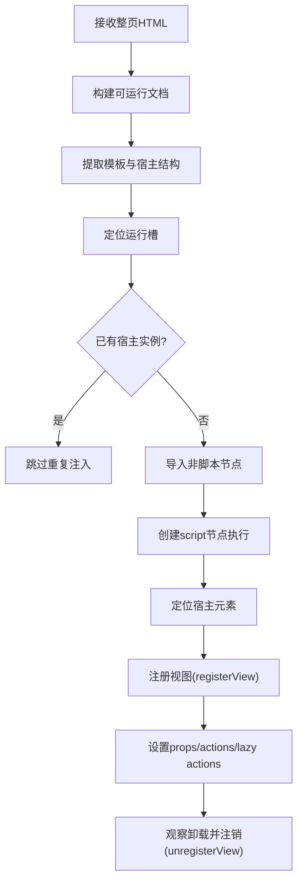
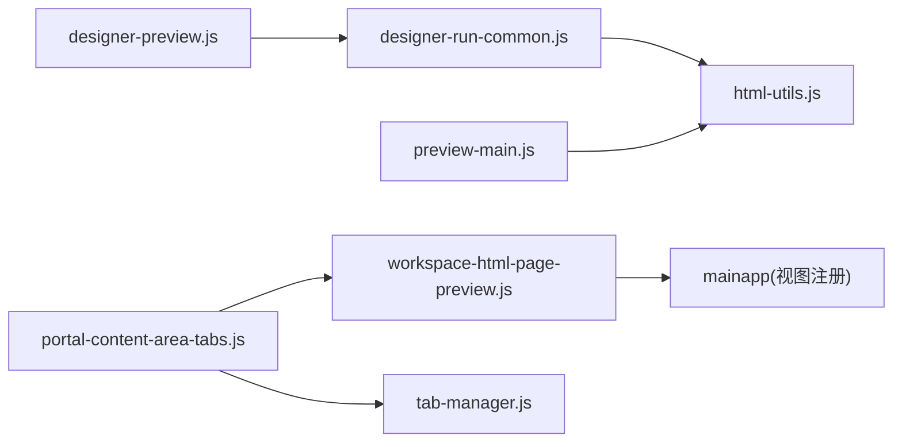

# 预览窗口管理

<cite>
**本文引用的文件**
- [designer-preview.js](file://CMXHTMLDesigner/src/components/designer-app/designer-preview.js)
- [preview-main.js](file://CMXHTMLDesigner/src/preview-main.js)
- [html-utils.js](file://CMXHTMLDesigner/src/utils/html-utils.js)
- [designer-run-common.js](file://CMXHTMLDesigner/src/components/designer-app/designer-run-common.js)
- [workspace-html-page-preview.js](file://CMXPortalManager/src/lib/workspace-html-page-preview.js)
- [portal-content-area-tabs.js](file://CMXPortalManager/src/components/portal-content-area-tabs.js)
- [tab-manager.js](file://CMXHTMLDesigner/src/utils/tab-manager.js)
</cite>

## 目录
1. [简介](#简介)
2. [项目结构](#项目结构)
3. [核心组件](#核心组件)
4. [架构总览](#架构总览)
5. [详细组件分析](#详细组件分析)
6. [依赖关系分析](#依赖关系分析)
7. [性能考虑](#性能考虑)
8. [故障排查指南](#故障排查指南)
9. [结论](#结论)
10. [附录：API 与调试](#附录api-与调试)

## 简介
本技术文档聚焦“预览窗口管理”能力，覆盖以下方面：
- 预览窗口的创建机制、生命周期管理与浏览器兼容性处理（含弹窗拦截）
- 页面 HTML 的构建过程、沙箱隔离策略与安全防护措施
- sessionStorage 的数据传递机制、窗口拦截检测和处理方案
- 多标签页管理的实现原理、窗口焦点控制和状态同步机制
- 完整的 API 接口说明、错误处理策略和调试方法

该能力横跨设计器（CMXHTMLDesigner）与门户（CMXPortalManager）两端：设计器负责生成可运行的整页 HTML 并通过独立窗口或宿主区域进行预览；门户侧提供在应用内以标签页形式渲染同一类页面的能力。

## 项目结构
预览相关的关键代码分布在两个子项目中：
- CMXHTMLDesigner：负责将设计区内容包装为可运行整页 HTML，通过独立窗口预览或在调试环境中运行
- CMXPortalManager：负责在门户应用中以标签页方式注入并运行这些页面，提供视图注册、卸载、状态同步等能力

图表来源
- [designer-preview.js:14-26](file://CMXHTMLDesigner/src/components/designer-app/designer-preview.js#L14-L26)
- [designer-run-common.js:10-21](file://CMXHTMLDesigner/src/components/designer-app/designer-run-common.js#L10-L21)
- [html-utils.js:237-367](file://CMXHTMLDesigner/src/utils/html-utils.js#L237-L367)
- [preview-main.js:7-33](file://CMXHTMLDesigner/src/preview-main.js#L7-L33)
- [workspace-html-page-preview.js:15-19](file://CMXPortalManager/src/lib/workspace-html-page-preview.js#L15-L19)
- [portal-content-area-tabs.js:24-78](file://CMXPortalManager/src/components/portal-content-area-tabs.js#L24-L78)
- [tab-manager.js:24-53](file://CMXHTMLDesigner/src/utils/tab-manager.js#L24-L53)

章节来源
- [designer-preview.js:14-26](file://CMXHTMLDesigner/src/components/designer-app/designer-preview.js#L14-L26)
- [designer-run-common.js:10-21](file://CMXHTMLDesigner/src/components/designer-app/designer-run-common.js#L10-L21)
- [html-utils.js:237-367](file://CMXHTMLDesigner/src/utils/html-utils.js#L237-L367)
- [preview-main.js:7-33](file://CMXHTMLDesigner/src/preview-main.js#L7-L33)
- [workspace-html-page-preview.js:15-19](file://CMXPortalManager/src/lib/workspace-html-page-preview.js#L15-L19)
- [portal-content-area-tabs.js:24-78](file://CMXPortalManager/src/components/portal-content-area-tabs.js#L24-L78)
- [tab-manager.js:24-53](file://CMXHTMLDesigner/src/utils/tab-manager.js#L24-L53)

## 核心组件
- 预览触发器：负责收集当前设计区 HTML、脚本块与依赖，构建完整页面文档，写入 sessionStorage，并尝试打开新窗口
- 预览入口：加载 UI5 运行时、应用主题、从 sessionStorage 读取 HTML 并安全注入到 body，再按序执行脚本
- HTML 构建器：将设计区片段包装为可运行整页，包含模板、宿主自定义元素、importmap、UI5 资源、事件水合脚本等
- 门户注入器：将服务端返回的整页 HTML 规范为可运行文档，提取静态结构与脚本文本，并在宿主的运行槽中注入执行，完成视图注册与卸载
- 标签页管理：维护标签集合、激活态、脏标记、焦点切换与上下文同步

章节来源
- [designer-preview.js:14-26](file://CMXHTMLDesigner/src/components/designer-app/designer-preview.js#L14-L26)
- [preview-main.js:7-33](file://CMXHTMLDesigner/src/preview-main.js#L7-L33)
- [html-utils.js:237-367](file://CMXHTMLDesigner/src/utils/html-utils.js#L237-L367)
- [workspace-html-page-preview.js:15-19](file://CMXPortalManager/src/lib/workspace-html-page-preview.js#L15-L19)
- [portal-content-area-tabs.js:24-78](file://CMXPortalManager/src/components/portal-content-area-tabs.js#L24-L78)

## 架构总览
预览流程分为两条路径：
- 独立窗口预览：设计器 → 构建整页HTML → 写入sessionStorage → 打开新窗口 → 预览入口加载UI5并注入执行
- 门户内标签页预览：后端返回整页HTML → 门户构建可运行文档 → 提取结构与脚本 → 注入运行槽 → 注册视图并执行脚本

图表来源
- [designer-preview.js:14-26](file://CMXHTMLDesigner/src/components/designer-app/designer-preview.js#L14-L26)
- [designer-run-common.js:10-21](file://CMXHTMLDesigner/src/components/designer-app/designer-run-common.js#L10-L21)
- [html-utils.js:237-367](file://CMXHTMLDesigner/src/utils/html-utils.js#L237-L367)
- [preview-main.js:7-33](file://CMXHTMLDesigner/src/preview-main.js#L7-L33)
- [workspace-html-page-preview.js:15-19](file://CMXPortalManager/src/lib/workspace-html-page-preview.js#L15-L19)
- [portal-content-area-tabs.js:24-78](file://CMXPortalManager/src/components/portal-content-area-tabs.js#L24-L78)

## 详细组件分析

### 预览窗口创建与生命周期管理
- 创建机制
  - 调用方传入上下文（获取页面ID、设计区HTML、脚本块与依赖），构建包裹后的整页HTML
  - 将HTML写入 sessionStorage 指定键，随后尝试以 _blank 打开 preview.html
  - 若 window.open 被拦截，提示用户允许弹出窗口并重试
- 生命周期
  - 预览窗口启动后，入口脚本确保 UI5 运行时可用，应用主题，然后从 sessionStorage 读取 HTML
  - 使用 DOMParser 解析 HTML，剥离脚本节点后注入 body，再逐个创建 script 节点执行
  - 异常时展示友好的错误占位，避免空白页
- 浏览器兼容性与拦截处理
  - 使用 open(..., '_blank', 'noopener,noreferrer') 的安全参数组合
  - 对返回值进行判空，给出明确的用户提示与日志

图表来源
- [designer-preview.js:14-26](file://CMXHTMLDesigner/src/components/designer-app/designer-preview.js#L14-L26)
- [preview-main.js:7-33](file://CMXHTMLDesigner/src/preview-main.js#L7-L33)

章节来源
- [designer-preview.js:14-26](file://CMXHTMLDesigner/src/components/designer-app/designer-preview.js#L14-L26)
- [preview-main.js:7-33](file://CMXHTMLDesigner/src/preview-main.js#L7-L33)

### 页面HTML构建与沙箱隔离
- 构建过程
  - 将设计区片段封装为完整 HTML 文档，包含：
    - 标准 meta/viewport/title
    - importmap 与 UI5 模块资源
    - 主题样式变量
    - 与 pageId 绑定的 <template id="cmx-page-template-...">
    - 宿主自定义元素 <cmx-html-pages-... data-cmx-html-page-host="">
    - 事件水合脚本（基于 data-event* 属性）
    - 可选的业务脚本块
- 沙箱隔离策略
  - 通过 Shadow DOM 宿主组件隔离样式与事件作用域
  - 模板与宿主分离，避免直接污染主文档
  - 事件代码通过 Function 构造并附带 sourceURL，便于调试且避免 eval
  - 在门户注入时，仅将非脚本节点导入运行槽，脚本按需创建并执行，控制执行时机与作用域
- 安全措施
  - 移除设计器内部属性与不可信属性
  - 对属性值进行转义
  - 限制可执行的 script type，过滤 src 与内联脚本的来源与类型

图表来源
- [html-utils.js:237-367](file://CMXHTMLDesigner/src/utils/html-utils.js#L237-L367)
- [preview-main.js:7-33](file://CMXHTMLDesigner/src/preview-main.js#L7-L33)
- [workspace-html-page-preview.js:15-19](file://CMXPortalManager/src/lib/workspace-html-page-preview.js#L15-L19)

章节来源
- [html-utils.js:237-367](file://CMXHTMLDesigner/src/utils/html-utils.js#L237-L367)
- [preview-main.js:7-33](file://CMXHTMLDesigner/src/preview-main.js#L7-L33)
- [workspace-html-page-preview.js:15-19](file://CMXPortalManager/src/lib/workspace-html-page-preview.js#L15-L19)

### sessionStorage 数据传递与窗口拦截处理
- 数据传递
  - 设计器将整页 HTML 写入 sessionStorage 的专用键
  - 预览入口从同一键读取并解析，设置标题与 body 类名，剥离脚本后注入，再执行脚本
- 拦截处理
  - 当 window.open 返回 null 时，记录日志并提示用户允许弹出窗口
  - 提供友好提示，避免用户误以为功能失效

图表来源
- [designer-preview.js:14-26](file://CMXHTMLDesigner/src/components/designer-app/designer-preview.js#L14-L26)
- [preview-main.js:7-33](file://CMXHTMLDesigner/src/preview-main.js#L7-L33)

章节来源
- [designer-preview.js:14-26](file://CMXHTMLDesigner/src/components/designer-app/designer-preview.js#L14-L26)
- [preview-main.js:7-33](file://CMXHTMLDesigner/src/preview-main.js#L7-L33)

### 多标签页管理、焦点控制与状态同步
- 标签页管理
  - 支持添加、更新、选择、关闭标签，维护 dirty 标记与初始上下文
  - 增量渲染：仅重建顶部条，主体 pane 原地复用，减少 CE 重连开销
- 焦点控制
  - 选择标签后通知激活，派发焦点事件供上层监听
- 状态同步
  - 在 tab 已存在时，可直接同步 workspace.context 的字段
  - 视图注册/卸载：注入完成后定位宿主元素并注册视图；卸载时通过断开回调与 MutationObserver 兜底注销

图表来源
- [portal-content-area-tabs.js:24-78](file://CMXPortalManager/src/components/portal-content-area-tabs.js#L24-L78)
- [workspace-html-page-preview.js:109-271](file://CMXPortalManager/src/lib/workspace-html-page-preview.js#L109-L271)

章节来源
- [portal-content-area-tabs.js:24-78](file://CMXPortalManager/src/components/portal-content-area-tabs.js#L24-L78)
- [workspace-html-page-preview.js:109-271](file://CMXPortalManager/src/lib/workspace-html-page-preview.js#L109-L271)

### 复杂逻辑流程图：门户注入与视图注册

图表来源
- [workspace-html-page-preview.js:109-271](file://CMXPortalManager/src/lib/workspace-html-page-preview.js#L109-L271)

章节来源
- [workspace-html-page-preview.js:109-271](file://CMXPortalManager/src/lib/workspace-html-page-preview.js#L109-L271)

## 依赖关系分析
- 设计器侧依赖
  - designer-preview.js 依赖 designer-run-common.js 与 html-utils.js
  - preview-main.js 依赖 UI5 运行时与主题库
- 门户侧依赖
  - workspace-html-page-preview.js 依赖 mainapp 的作用域与视图注册机制
  - portal-content-area-tabs.js 提供标签页容器与交互
  - tab-manager.js 提供通用的 Tab 切换逻辑

图表来源
- [designer-preview.js:14-26](file://CMXHTMLDesigner/src/components/designer-app/designer-preview.js#L14-L26)
- [designer-run-common.js:10-21](file://CMXHTMLDesigner/src/components/designer-app/designer-run-common.js#L10-L21)
- [html-utils.js:237-367](file://CMXHTMLDesigner/src/utils/html-utils.js#L237-L367)
- [workspace-html-page-preview.js:15-19](file://CMXPortalManager/src/lib/workspace-html-page-preview.js#L15-L19)
- [portal-content-area-tabs.js:24-78](file://CMXPortalManager/src/components/portal-content-area-tabs.js#L24-L78)
- [tab-manager.js:24-53](file://CMXHTMLDesigner/src/utils/tab-manager.js#L24-L53)

章节来源
- [designer-preview.js:14-26](file://CMXHTMLDesigner/src/components/designer-app/designer-preview.js#L14-L26)
- [designer-run-common.js:10-21](file://CMXHTMLDesigner/src/components/designer-app/designer-run-common.js#L10-L21)
- [html-utils.js:237-367](file://CMXHTMLDesigner/src/utils/html-utils.js#L237-L367)
- [workspace-html-page-preview.js:15-19](file://CMXPortalManager/src/lib/workspace-html-page-preview.js#L15-L19)
- [portal-content-area-tabs.js:24-78](file://CMXPortalManager/src/components/portal-content-area-tabs.js#L24-L78)
- [tab-manager.js:24-53](file://CMXHTMLDesigner/src/utils/tab-manager.js#L24-L53)

## 性能考虑
- 增量渲染：门户标签页主体 pane 采用增量补充与摘除，避免全量重建导致 CE 频繁重连
- 模板缓存：事件水合与模板查询在闭包中缓存，减少重复查询
- 脚本执行时机：仅在需要时创建 script 节点执行，避免不必要的计算
- 主题与资源预加载：UI5 bundle 与图标资源提前引入，减少首屏等待
- 防抖与去重：MutationObserver 与幂等注销避免重复操作

[本节为通用性能建议，不直接分析具体文件]

## 故障排查指南
- 预览窗口被拦截
  - 现象：无法打开新窗口
  - 处理：检查控制台日志与 toast 提示，引导用户允许弹出窗口
  - 参考位置：设计器打开窗口失败时的提示与日志
- 预览加载失败
  - 现象：预览窗口显示错误占位
  - 处理：查看错误信息，确认 UI5 运行时是否加载成功、HTML 是否有效
  - 参考位置：预览入口的错误捕获与占位渲染
- 页面注入失败
  - 现象：门户标签页内出现错误提示或空白
  - 处理：检查 textarea/script payload 是否为合法 JSON，确认运行槽是否存在
  - 参考位置：门户注入器的错误捕获与恢复逻辑
- 视图未注册或内存泄漏
  - 现象：切换标签后行为异常或资源未释放
  - 处理：确认 disconnectedCallback 与 MutationObserver 是否触发，检查 unregisterView 是否幂等
  - 参考位置：门户注入器的卸载钩子与观察者

章节来源
- [designer-preview.js:14-26](file://CMXHTMLDesigner/src/components/designer-app/designer-preview.js#L14-L26)
- [preview-main.js:35-48](file://CMXHTMLDesigner/src/preview-main.js#L35-L48)
- [workspace-html-page-preview.js:326-410](file://CMXPortalManager/src/lib/workspace-html-page-preview.js#L326-L410)

## 结论
预览窗口管理在设计器与门户之间形成了清晰的职责边界：设计器负责生成可运行整页 HTML 并提供独立窗口预览；门户负责在应用内以标签页形式注入、注册与卸载视图。通过 sessionStorage 传递数据、Shadow DOM 与自定义元素实现沙箱隔离、事件水合与调试增强，以及增量渲染与幂等注销保障性能与稳定性。整体方案兼顾安全性、可维护性与用户体验。

[本节为总结性内容，不直接分析具体文件]

## 附录：API 与调试
- 设计器侧关键函数
  - 打开预览窗口：openDesignerPreview(ctx)
    - 作用：构建包裹后的页面 HTML，写入 sessionStorage，尝试打开 preview.html
    - 输入：上下文对象（getPageId、getDesignBodyHtmlForExportAndRun、pageData、log、window）
    - 输出：无（副作用：打开窗口/提示）
    - 参考位置：[designer-preview.js:14-26](file://CMXHTMLDesigner/src/components/designer-app/designer-preview.js#L14-L26)
  - 构建包裹后的页面 HTML：buildWrappedDesignerPageHtml(ctx)
    - 作用：聚合页面 ID、脚本块与依赖，调用 wrapHtmlDocument
    - 参考位置：[designer-run-common.js:10-21](file://CMXHTMLDesigner/src/components/designer-app/designer-run-common.js#L10-L21)
  - 构建整页 HTML：wrapHtmlDocument(bodyInnerHtml, scriptBlock, metaJson, deps, pageMeta)
    - 作用：生成包含模板、宿主、importmap、UI5 资源与事件水合的完整 HTML
    - 参考位置：[html-utils.js:237-367](file://CMXHTMLDesigner/src/utils/html-utils.js#L237-L367)
- 预览入口
  - bootstrapPreview()
    - 作用：加载 UI5 运行时、应用主题、解析并注入 HTML、执行脚本
    - 参考位置：[preview-main.js:7-33](file://CMXHTMLDesigner/src/preview-main.js#L7-L33)
- 门户侧关键函数
  - buildRunnableHtmlDocumentForPage(pageMeta, html)
    - 作用：将服务端返回的 HTML 规范为可运行整页文档
    - 参考位置：[workspace-html-page-preview.js:15-19](file://CMXPortalManager/src/lib/workspace-html-page-preview.js#L15-L19)
  - extractTemplateHostAndScriptsFromFullDoc(fullDoc)
    - 作用：提取静态结构与脚本文本，用于结构预览与脚本执行
    - 参考位置：[workspace-html-page-preview.js:27-45](file://CMXPortalManager/src/lib/workspace-html-page-preview.js#L27-L45)
  - injectParsedHtmlBodyIntoRunSlot(slot, docStr, g)
    - 作用：将解析后的 body 子节点顺序挂入运行槽并执行脚本，完成视图注册与卸载钩子
    - 参考位置：[workspace-html-page-preview.js:109-271](file://CMXPortalManager/src/lib/workspace-html-page-preview.js#L109-L271)
  - hydrateHtmlPagesWorkspaceViewsInRoot(root)
    - 作用：扫描运行槽中的 payload，注入并执行，刷新可见性，安装多视图 tab reorder
    - 参考位置：[workspace-html-page-preview.js:326-410](file://CMXPortalManager/src/lib/workspace-html-page-preview.js#L326-L410)
- 标签页管理
  - addTab/selectTab/setTabDirty/getTabDirty/hasAnyDirtyTab
    - 作用：标签页增删改查、焦点与脏标记管理
    - 参考位置：[portal-content-area-tabs.js:24-78](file://CMXPortalManager/src/components/portal-content-area-tabs.js#L24-L78)
- 调试方法
  - 设计器调试模式：通过全局 __cmxDebug 控制事件代码是否插入 debugger
  - 事件 sourceURL：事件代码附带 cmx:// 前缀的 URL，便于 DevTools 断点持久化
  - 预览错误占位：预览入口捕获异常并渲染错误信息，便于快速定位问题
  - 门户注入错误：注入失败时在运行槽内显示错误提示，避免静默失败

章节来源
- [designer-preview.js:14-26](file://CMXHTMLDesigner/src/components/designer-app/designer-preview.js#L14-L26)
- [designer-run-common.js:10-21](file://CMXHTMLDesigner/src/components/designer-app/designer-run-common.js#L10-L21)
- [html-utils.js:237-367](file://CMXHTMLDesigner/src/utils/html-utils.js#L237-L367)
- [preview-main.js:7-33](file://CMXHTMLDesigner/src/preview-main.js#L7-L33)
- [workspace-html-page-preview.js:15-19](file://CMXPortalManager/src/lib/workspace-html-page-preview.js#L15-L19)
- [workspace-html-page-preview.js:109-271](file://CMXPortalManager/src/lib/workspace-html-page-preview.js#L109-L271)
- [workspace-html-page-preview.js:326-410](file://CMXPortalManager/src/lib/workspace-html-page-preview.js#L326-L410)
- [portal-content-area-tabs.js:24-78](file://CMXPortalManager/src/components/portal-content-area-tabs.js#L24-L78)