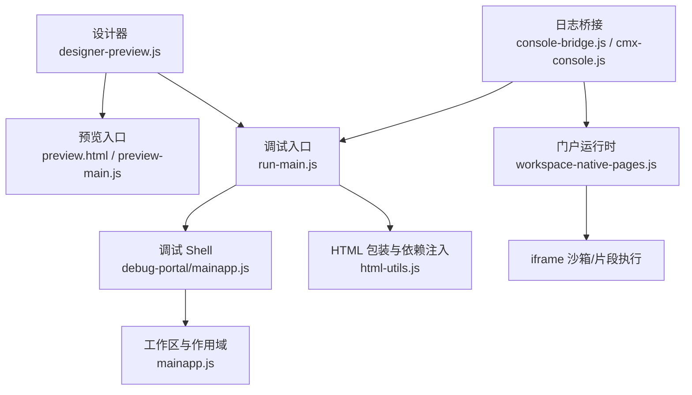
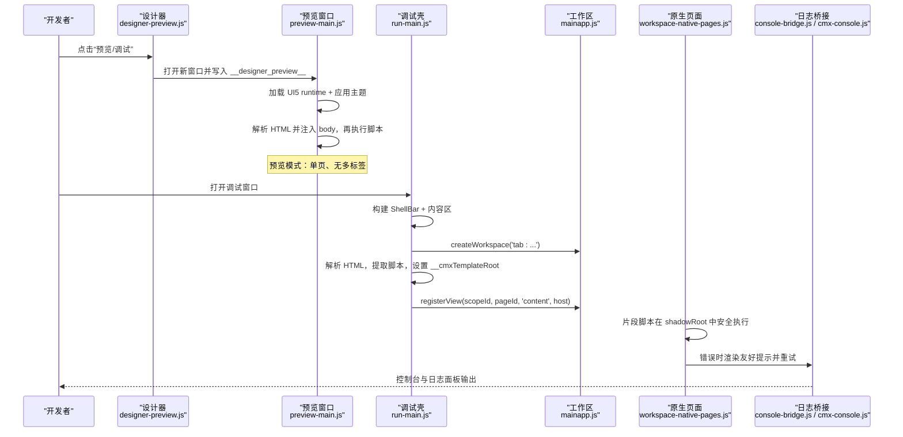
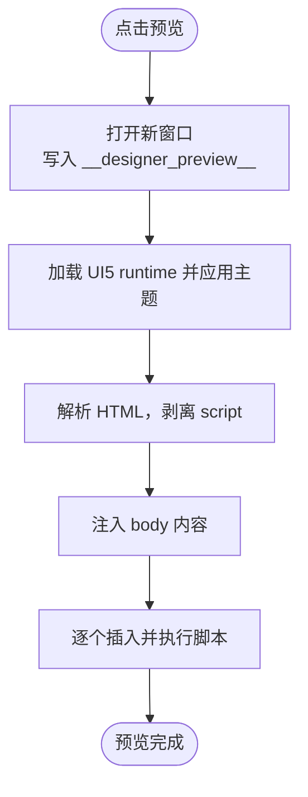
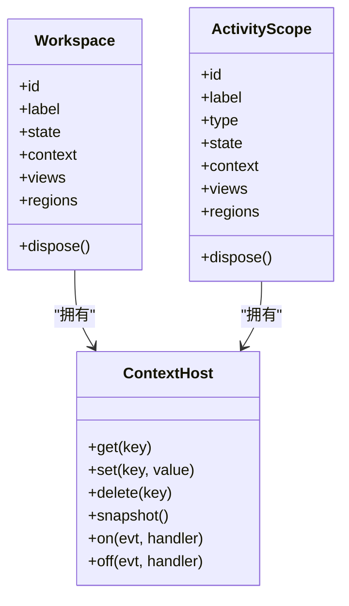
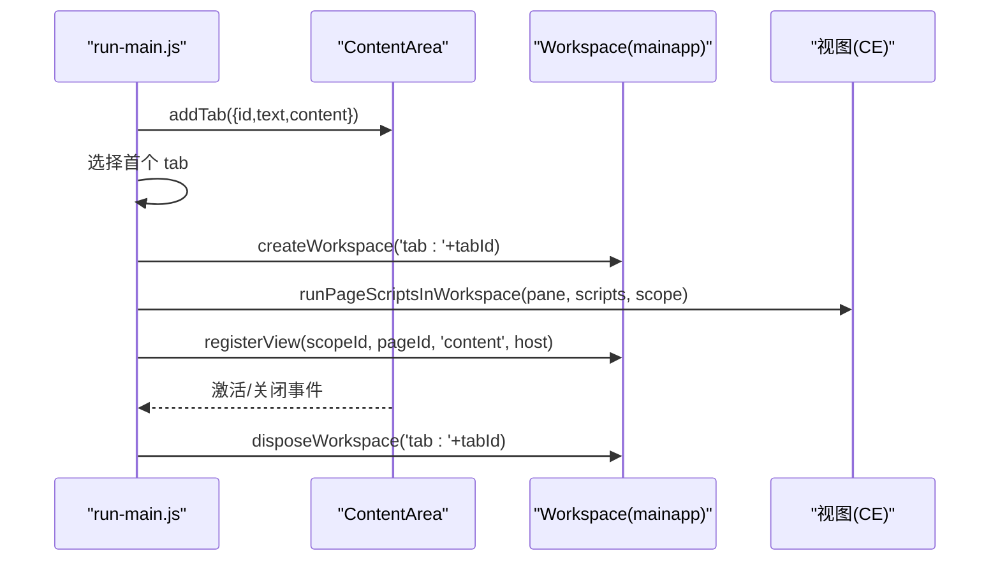
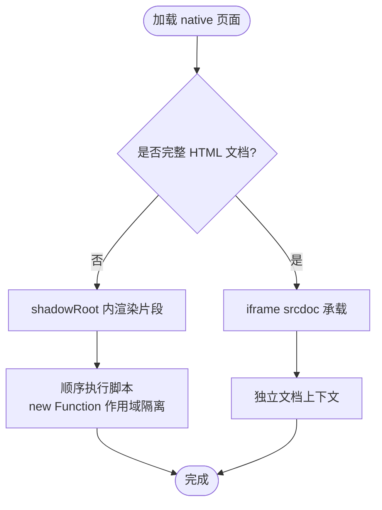
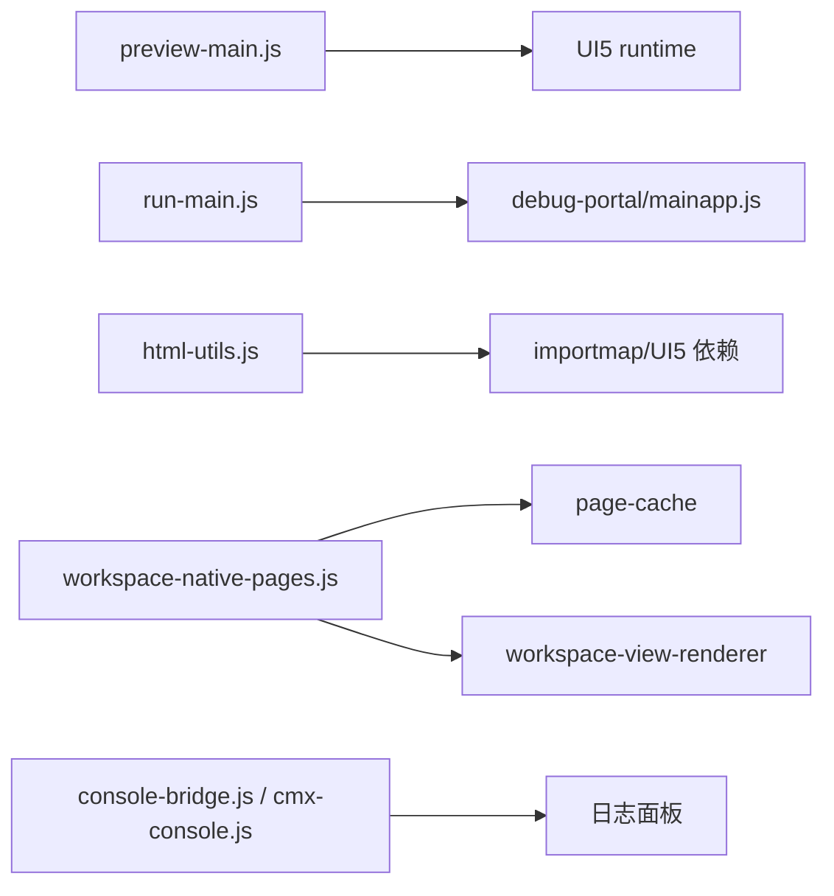
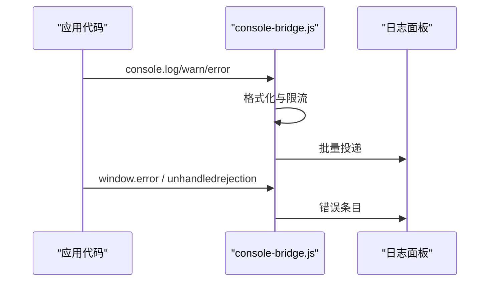

# 预览运行系统

<cite>
**本文引用的文件**
- [preview-main.js](file://CMXHTMLDesigner/src/preview-main.js)
- [run-main.js](file://CMXHTMLDesigner/src/run-main.js)
- [designer-preview.js](file://CMXHTMLDesigner/src/components/designer-app/designer-preview.js)
- [designer-run-common.js](file://CMXHTMLDesigner/src/components/designer-app/designer-run-common.js)
- [html-utils.js](file://CMXHTMLDesigner/src/utils/html-utils.js)
- [mainapp.js](file://CMXHTMLDesigner/src/debug-portal/mainapp.js)
- [workspace-native-pages.js](file://CMXPortalManager/src/lib/workspace-native-pages.js)
- [console-bridge.js](file://CMXPortalManager/src/lib/console-bridge.js)
- [cmx-console.js](file://CMXHTMLDesigner/src/utils/cmx-console.js)
- [designer-shell-url.js](file://CMXHTMLDesigner/src/utils/designer-shell-url.js)
</cite>

## 目录
1. [简介](#简介)
2. [项目结构](#项目结构)
3. [核心组件](#核心组件)
4. [架构总览](#架构总览)
5. [详细组件分析](#详细组件分析)
6. [依赖关系分析](#依赖关系分析)
7. [性能与资源管理](#性能与资源管理)
8. [调试、日志与错误追踪](#调试日志与错误追踪)
9. [故障排除指南](#故障排除指南)
10. [结论](#结论)

## 简介
本指南面向“预览运行系统”的开发者，覆盖预览窗口创建机制、沙箱隔离与安全策略、运行环境初始化、依赖加载与模块解析、页内运行原理（上下文隔离与事件通信）、多页面运行管理与状态同步、调试工具使用、日志收集与错误追踪、性能监控与内存管理、资源清理等主题。文档以仓库中实际实现为依据，提供可追溯的代码级来源与可视化流程图。

## 项目结构
预览运行系统横跨两个子工程：
- CMXHTMLDesigner：负责设计器侧的预览入口、调试壳、HTML 包装与脚本注入。
- CMXPortalManager：负责门户运行时中的原生页面（native_pages）渲染、iframe 沙箱、工作区作用域与视图注册。

图表来源
- [designer-preview.js:14-26](file://CMXHTMLDesigner/src/components/designer-app/designer-preview.js#L14-L26)
- [preview-main.js:7-33](file://CMXHTMLDesigner/src/preview-main.js#L7-L33)
- [run-main.js:105-147](file://CMXHTMLDesigner/src/run-main.js#L105-L147)
- [html-utils.js:237-367](file://CMXHTMLDesigner/src/utils/html-utils.js#L237-L367)
- [mainapp.js:115-177](file://CMXHTMLDesigner/src/debug-portal/mainapp.js#L115-L177)
- [workspace-native-pages.js:168-242](file://CMXPortalManager/src/lib/workspace-native-pages.js#L168-L242)
- [console-bridge.js:88-135](file://CMXPortalManager/src/lib/console-bridge.js#L88-L135)
- [cmx-console.js:37-69](file://CMXHTMLDesigner/src/utils/cmx-console.js#L37-L69)

章节来源
- [designer-preview.js:14-26](file://CMXHTMLDesigner/src/components/designer-app/designer-preview.js#L14-L26)
- [preview-main.js:7-33](file://CMXHTMLDesigner/src/preview-main.js#L7-L33)
- [run-main.js:105-147](file://CMXHTMLDesigner/src/run-main.js#L105-L147)
- [html-utils.js:237-367](file://CMXHTMLDesigner/src/utils/html-utils.js#L237-L367)
- [mainapp.js:115-177](file://CMXHTMLDesigner/src/debug-portal/mainapp.js#L115-L177)
- [workspace-native-pages.js:168-242](file://CMXPortalManager/src/lib/workspace-native-pages.js#L168-L242)
- [console-bridge.js:88-135](file://CMXPortalManager/src/lib/console-bridge.js#L88-L135)
- [cmx-console.js:37-69](file://CMXHTMLDesigner/src/utils/cmx-console.js#L37-L69)

## 核心组件
- 预览启动器：从设计器打开独立预览窗口，通过 sessionStorage 传递 HTML 内容并加载 UI5 runtime。
- 调试壳：构建暗色 Shell，支持多标签页调试，按 Tab 切换模板根与工作区作用域。
- HTML 包装器：将设计区 HTML 包裹为完整文档，注入 importmap、UI5 依赖、事件水合与脚本块。
- 工作区与作用域：维护 workspace、context、views、regions 的生命周期与跨视图通信。
- 原生页面运行时：支持整页 iframe 沙箱与片段脚本在 shadowRoot 中安全执行，具备缓存与重试。
- 日志桥接：统一捕获 console、全局 error、unhandledrejection，并批量投递到日志面板。

章节来源
- [designer-preview.js:14-26](file://CMXHTMLDesigner/src/components/designer-app/designer-preview.js#L14-L26)
- [preview-main.js:7-33](file://CMXHTMLDesigner/src/preview-main.js#L7-L33)
- [run-main.js:188-238](file://CMXHTMLDesigner/src/run-main.js#L188-L238)
- [html-utils.js:237-367](file://CMXHTMLDesigner/src/utils/html-utils.js#L237-L367)
- [mainapp.js:33-101](file://CMXHTMLDesigner/src/debug-portal/mainapp.js#L33-L101)
- [workspace-native-pages.js:168-242](file://CMXPortalManager/src/lib/workspace-native-pages.js#L168-L242)
- [console-bridge.js:88-135](file://CMXPortalManager/src/lib/console-bridge.js#L88-L135)

## 架构总览
预览运行系统由“设计器触发 → 独立预览/调试窗口 → 运行时渲染 → 作用域与视图注册 → 日志与错误上报”构成闭环。

图表来源
- [designer-preview.js:14-26](file://CMXHTMLDesigner/src/components/designer-app/designer-preview.js#L14-L26)
- [preview-main.js:7-33](file://CMXHTMLDesigner/src/preview-main.js#L7-L33)
- [run-main.js:243-377](file://CMXHTMLDesigner/src/run-main.js#L243-L377)
- [mainapp.js:185-287](file://CMXHTMLDesigner/src/debug-portal/mainapp.js#L185-L287)
- [workspace-native-pages.js:168-242](file://CMXPortalManager/src/lib/workspace-native-pages.js#L168-L242)
- [console-bridge.js:88-135](file://CMXPortalManager/src/lib/console-bridge.js#L88-L135)

## 详细组件分析

### 预览窗口创建机制与沙箱隔离
- 设计器通过 open 新窗口并写入 sessionStorage，预览页读取后加载 UI5 runtime，应用主题，解析 HTML 并执行脚本。
- 预览模式为单页，不启用多标签；若被拦截会给出 Toast 提示。
- 安全策略：预览页直接执行用户脚本，适合开发期快速验证；生产运行建议采用 iframe 或 native_pages 的严格沙箱。

图表来源
- [designer-preview.js:14-26](file://CMXHTMLDesigner/src/components/designer-app/designer-preview.js#L14-L26)
- [preview-main.js:7-33](file://CMXHTMLDesigner/src/preview-main.js#L7-L33)

章节来源
- [designer-preview.js:14-26](file://CMXHTMLDesigner/src/components/designer-app/designer-preview.js#L14-L26)
- [preview-main.js:7-33](file://CMXHTMLDesigner/src/preview-main.js#L7-L33)

### 运行环境初始化、依赖加载与模块解析
- 依赖加载：通过 importmap 注入 UI5 相关模块，同时支持外部 script/module 依赖。
- 模块解析：importmap 指定 CDN 路径；module 类型依赖合并进 importmap；script 类型同步加载确保全局变量可用。
- 主题与样式：默认主题参数内联，保证导出/运行时无需 CDN 即可获得完整样式。

章节来源
- [html-utils.js:237-367](file://CMXHTMLDesigner/src/utils/html-utils.js#L237-L367)

### 页内运行原理、上下文隔离与事件通信
- 上下文隔离：
  - 片段脚本在 shadowRoot 中执行，避免 DOM/CSS 冲突；普通脚本通过 new Function 包作用域执行，注入 workspace/host/ctx。
  - 整页 HTML 通过 iframe srcdoc 承载，完全隔离宿主环境与全局变量。
- 事件通信：
  - 事件水合：data-event* 属性编译为函数，绑定到对应元素；支持 in-host 调用 with(host)。
  - 工作区 context：通过 ContextHost 提供 set/get/delete/snapshot/on/off，仅 set/delete 触发 change。
  - 视图 API：registerView 冻结用户 API 并附加 __viewId/__region/__pageId，供跨视图访问。

图表来源
- [mainapp.js:33-101](file://CMXHTMLDesigner/src/debug-portal/mainapp.js#L33-L101)
- [mainapp.js:115-177](file://CMXHTMLDesigner/src/debug-portal/mainapp.js#L115-L177)

章节来源
- [workspace-native-pages.js:168-242](file://CMXPortalManager/src/lib/workspace-native-pages.js#L168-L242)
- [html-utils.js:320-367](file://CMXHTMLDesigner/src/utils/html-utils.js#L320-L367)
- [mainapp.js:33-101](file://CMXHTMLDesigner/src/debug-portal/mainapp.js#L33-L101)

### 多页面运行管理、窗口控制与状态同步
- 多页面调试：run-main.js 支持批量页面调试，每个页面一个 tab，自动设置 __cmxTemplateRoot 与 workspace 作用域。
- 窗口控制：通过 portal-content-area 的 addTab/selectTabById/disposeWorkspace 管理生命周期。
- 状态同步：切换 tab 时更新 activeWorkspaceId 与模板根；关闭 tab 时回收 workspace 与视图。

图表来源
- [run-main.js:259-324](file://CMXHTMLDesigner/src/run-main.js#L259-L324)
- [run-main.js:338-377](file://CMXHTMLDesigner/src/run-main.js#L338-L377)
- [mainapp.js:185-287](file://CMXHTMLDesigner/src/debug-portal/mainapp.js#L185-L287)

章节来源
- [run-main.js:259-324](file://CMXHTMLDesigner/src/run-main.js#L259-L324)
- [run-main.js:338-377](file://CMXHTMLDesigner/src/run-main.js#L338-L377)
- [mainapp.js:185-287](file://CMXHTMLDesigner/src/debug-portal/mainapp.js#L185-L287)

### 原生页面运行时与沙箱策略
- 片段模式：shadowRoot 内挂载 .native-page-root，收集并顺序执行 <script>，普通脚本用 new Function 包作用域，注入 workspace/host/ctx。
- 整页模式：iframe srcdoc 承载，sandbox 限制能力，referrerpolicy=no-referrer，彻底隔离。
- 错误处理：区分“服务未就绪”与“页面打不开”，提供友好文案与重试按钮。

图表来源
- [workspace-native-pages.js:168-242](file://CMXPortalManager/src/lib/workspace-native-pages.js#L168-L242)
- [workspace-native-pages.js:365-373](file://CMXPortalManager/src/lib/workspace-native-pages.js#L365-L373)

章节来源
- [workspace-native-pages.js:168-242](file://CMXPortalManager/src/lib/workspace-native-pages.js#L168-L242)
- [workspace-native-pages.js:365-373](file://CMXPortalManager/src/lib/workspace-native-pages.js#L365-L373)

## 依赖关系分析
- 预览入口依赖 UI5 runtime 与主题库；调试壳依赖 debug-portal-body 与 mainapp。
- HTML 包装器依赖 theme 参数与 importmap 配置；事件水合依赖 data-event 属性。
- 原生页面运行时依赖 page-cache、workspace-view-renderer、mainapp。
- 日志桥接统一捕获 console/error/unhandledrejection，并批量 flush。

图表来源
- [preview-main.js:4-10](file://CMXHTMLDesigner/src/preview-main.js#L4-L10)
- [run-main.js:10-25](file://CMXHTMLDesigner/src/run-main.js#L10-L25)
- [html-utils.js:273-305](file://CMXHTMLDesigner/src/utils/html-utils.js#L273-L305)
- [workspace-native-pages.js:7-11](file://CMXPortalManager/src/lib/workspace-native-pages.js#L7-L11)
- [console-bridge.js:88-135](file://CMXPortalManager/src/lib/console-bridge.js#L88-L135)

章节来源
- [preview-main.js:4-10](file://CMXHTMLDesigner/src/preview-main.js#L4-L10)
- [run-main.js:10-25](file://CMXHTMLDesigner/src/run-main.js#L10-L25)
- [html-utils.js:273-305](file://CMXHTMLDesigner/src/utils/html-utils.js#L273-L305)
- [workspace-native-pages.js:7-11](file://CMXPortalManager/src/lib/workspace-native-pages.js#L7-L11)
- [console-bridge.js:88-135](file://CMXPortalManager/src/lib/console-bridge.js#L88-L135)

## 性能与资源管理
- 模板根与布局：调试模式下先激活 tab 并强制布局，再执行脚本，避免隐藏容器导致的事件绑定失败。
- 脚本执行：片段脚本顺序执行，避免并发竞争；整页 iframe 隔离减少主线程干扰。
- 缓存与重试：native 页面使用 IndexedDB 持久缓存与 ETag/304 优化；错误态提供重试按钮。
- 资源清理：disconnectedCallback 中 bump _seq 防止 detached 实例继续执行；disposeWorkspace 释放 workspace 与 hosts。

章节来源
- [run-main.js:307-324](file://CMXHTMLDesigner/src/run-main.js#L307-L324)
- [workspace-native-pages.js:88-127](file://CMXPortalManager/src/lib/workspace-native-pages.js#L88-L127)
- [workspace-native-pages.js:392-415](file://CMXPortalManager/src/lib/workspace-native-pages.js#L392-L415)
- [mainapp.js:197-205](file://CMXHTMLDesigner/src/debug-portal/mainapp.js#L197-L205)

## 调试、日志与错误追踪
- 设计器控制台桥接：installCmxConsoleTap 劫持 console.log/warn/error，双写到 DevTools 与 sink。
- 门户日志桥接：installConsoleBridge 统一捕获 console、window.error、unhandledrejection，环形缓冲与微任务批处理，避免阻塞。
- 错误展示：native 页面错误态提供“技术详情”折叠面板与重试按钮；预览失败时在预览窗内显示错误占位。

图表来源
- [console-bridge.js:88-135](file://CMXPortalManager/src/lib/console-bridge.js#L88-L135)
- [cmx-console.js:37-69](file://CMXHTMLDesigner/src/utils/cmx-console.js#L37-L69)

章节来源
- [console-bridge.js:88-135](file://CMXPortalManager/src/lib/console-bridge.js#L88-L135)
- [cmx-console.js:37-69](file://CMXHTMLDesigner/src/utils/cmx-console.js#L37-L69)
- [preview-main.js:35-48](file://CMXHTMLDesigner/src/preview-main.js#L35-L48)
- [workspace-native-pages.js:258-349](file://CMXPortalManager/src/lib/workspace-native-pages.js#L258-L349)

## 故障排除指南
- 预览窗口被拦截：检查浏览器弹出策略，允许站点弹出窗口；设计器会给出 Toast 提示。
- 预览加载失败：预览页捕获异常并在页面内显示错误信息，便于定位问题。
- 原生页面无法加载：检查后端服务是否就绪；错误态区分“服务未就绪”与“页面打不开”，提供重试。
- 多页调试空白：确认已激活对应 tab 并强制布局；检查 __cmxTemplateRoot 是否正确设置。
- 日志缺失：确认已安装 console 桥接；检查 sink 注册与缓冲 flush。

章节来源
- [designer-preview.js:14-26](file://CMXHTMLDesigner/src/components/designer-app/designer-preview.js#L14-L26)
- [preview-main.js:35-48](file://CMXHTMLDesigner/src/preview-main.js#L35-L48)
- [workspace-native-pages.js:258-349](file://CMXPortalManager/src/lib/workspace-native-pages.js#L258-L349)
- [run-main.js:307-324](file://CMXHTMLDesigner/src/run-main.js#L307-L324)
- [console-bridge.js:88-135](file://CMXPortalManager/src/lib/console-bridge.js#L88-L135)

## 结论
预览运行系统在设计器与门户运行时之间提供了灵活且安全的运行环境：预览模式快速验证，调试模式支持多页面与上下文隔离，原生页面运行时提供 iframe 与片段两种沙箱策略。通过统一的日志桥接与错误态展示，开发者可获得良好的调试体验。结合缓存、重试与资源清理机制，系统在性能与稳定性方面具备良好表现。