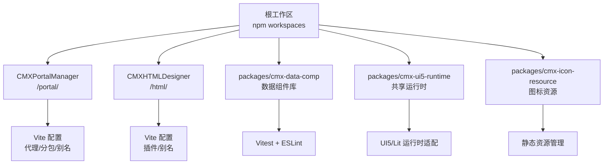
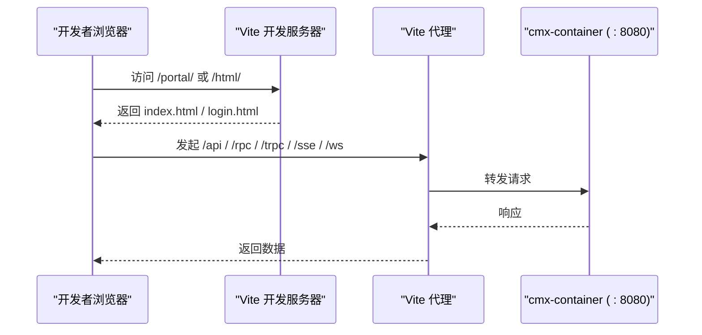
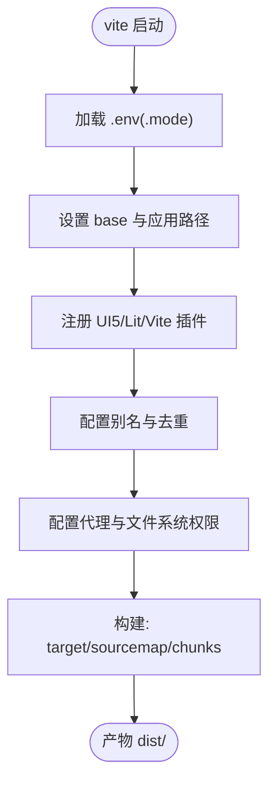
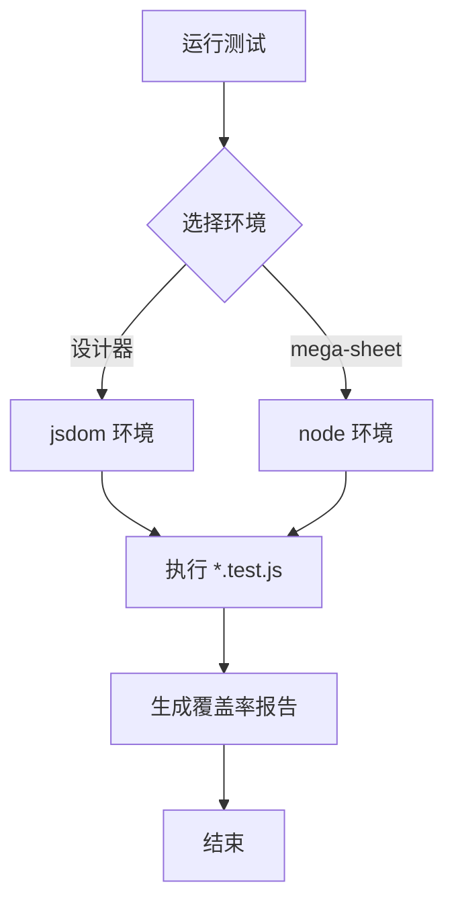
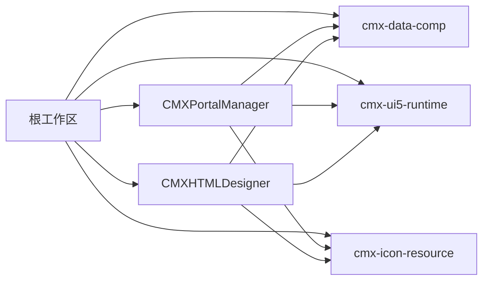

# 开发指南

<cite>
**本文引用的文件**
- [README.md](file://README.md)
- [CONTRIBUTING.md](file://CONTRIBUTING.md)
- [AGENTS.md](file://AGENTS.md)
- [package.json](file://package.json)
- [CMXPortalManager/package.json](file://CMXPortalManager/package.json)
- [CMXHTMLDesigner/package.json](file://CMXHTMLDesigner/package.json)
- [packages/cmx-ui5-runtime/package.json](file://packages/cmx-ui5-runtime/package.json)
- [packages/cmx-data-comp/package.json](file://packages/cmx-data-comp/package.json)
- [CMXPortalManager/vite.config.js](file://CMXPortalManager/vite.config.js)
- [CMXHTMLDesigner/vite.config.js](file://CMXHTMLDesigner/vite.config.js)
- [CMXHTMLDesigner/vitest.config.js](file://CMXHTMLDesigner/vitest.config.js)
- [cmx-mega-sheet/package.json](file://cmx-mega-sheet/package.json)
- [cmx-mega-sheet/tsconfig.json](file://cmx-mega-sheet/tsconfig.json)
- [cmx-mega-sheet/vitest.config.ts](file://cmx-mega-sheet/vitest.config.ts)
- [CMXPortalManager/eslint.config.js](file://CMXPortalManager/eslint.config.js)
- [docker命令.txt](file://docker命令.txt)
</cite>

## 更新摘要
**所做更改**
- 更新了项目结构部分以反映新的npm workspace结构
- 新增了文档与知识库路径章节，详细说明五个不同的文档位置
- 更新了构建系统文档以包含共享包的构建流程
- 增强了开发环境配置说明

## 目录
1. [简介](#简介)
2. [项目结构](#项目结构)
3. [核心组件](#核心组件)
4. [架构总览](#架构总览)
5. [详细组件分析](#详细组件分析)
6. [依赖关系分析](#依赖关系分析)
7. [性能与构建优化](#性能与构建优化)
8. [调试与测试](#调试与测试)
9. [代码规范与提交流程](#代码规范与提交流程)
10. [文档与知识库管理](#文档与知识库管理)
11. [常见问题与故障排除](#常见问题与故障排除)
12. [结论](#结论)
13. [附录：常用命令与环境变量](#附录：常用命令与环境变量)

## 简介
本指南面向参与 CMX 企业门户平台（前端 monorepo）的开发者，覆盖开发环境配置、Vite 配置、TypeScript 设置、测试框架使用、代码风格、提交与 PR 流程、调试技巧、性能分析与发布建议，以及贡献与问题反馈方式。项目由以下部分组成：
- CMXPortalManager：门户运行时（/portal/）
- CMXHTMLDesigner：可视化设计器（/html/）
- packages/cmx-data-comp：数据层 Web Components
- packages/cmx-ui5-runtime：共享 UI5/Tabler 运行时（/shared/）

后端为 Rust 多 crate workspace（cmx-container），提供元数据驱动的单据/字典/报表/流程等能力。

**章节来源**
- [README.md:1-73](file://README.md#L1-L73)

## 项目结构
根目录为 npm workspaces monorepo，统一安装与脚本入口；各子应用各自维护 Vite、ESLint、测试配置。**新增的共享包结构**包括 cmx-ui5-runtime 和 cmx-data-comp，作为 Portal 和 Designer 的共同依赖。

**图示来源**
- [package.json:6-25](file://package.json#L6-L25)
- [CMXPortalManager/vite.config.js:27-183](file://CMXPortalManager/vite.config.js#L27-L183)
- [CMXHTMLDesigner/vite.config.js:26-117](file://CMXHTMLDesigner/vite.config.js#L26-L117)

**章节来源**
- [package.json:1-39](file://package.json#L1-L39)
- [README.md:8-17](file://README.md#L8-L17)

## 核心组件
- 门户运行时（CMXPortalManager）：基于 Vite 8 构建，集成 UI5 WebComponents、Lit、AI 工作台等；通过环境变量与代理联调后端 cmx-container。
- HTML 设计器（CMXHTMLDesigner）：可视化页面编辑与预览，内置自定义 Vite 插件以注入设计期元数据。
- 数据组件库（cmx-data-comp）：Web Components 实现主从表格、数据集、表单控件等，供两应用复用。
- 共享运行时（cmx-ui5-runtime）：提供 UI5 主题、本地化、Vite 插件与副作用垫片，被 Portal 和 Designer 共同依赖。

**章节来源**
- [README.md:10-17](file://README.md#L10-L17)
- [CMXPortalManager/package.json:24-53](file://CMXPortalManager/package.json#L24-L53)
- [CMXHTMLDesigner/package.json:14-30](file://CMXHTMLDesigner/package.json#L14-L30)
- [packages/cmx-ui5-runtime/package.json:1-31](file://packages/cmx-ui5-runtime/package.json#L1-L31)

## 架构总览
前端通过 Vite 启动开发服务器，按模式加载 .env，并将 /api、/rpc、/trpc、/sse、/ws 等请求代理到后端 cmx-container（默认 :8080）。生产构建输出静态资源，由后端 web-server 同源托管。

**图示来源**
- [CMXPortalManager/vite.config.js:27-96](file://CMXPortalManager/vite.config.js#L27-L96)
- [CMXHTMLDesigner/vite.config.js:26-84](file://CMXHTMLDesigner/vite.config.js#L26-L84)

**章节来源**
- [AGENTS.md:180-212](file://AGENTS.md#L180-L212)

## 详细组件分析

### Vite 配置（门户）
- 环境变量分层：.env（通用）、.env.production（生产覆盖）、shell 环境变量（最高优先级）。
- base 路径：dev 为相对路径，prod 为绝对路径（/portal/），避免资源解析异常。
- 插件：UI5 副作用垫片、运行时应用插件、本地化白名单。
- 别名与去重：将 cmx-data-comp 与 cmx-ui5-runtime 指向源码，确保 dev 支持顶层 await；对 UI5/Lit 等做 dedupe，避免多实例。
- 代理：/shared、/api、/rpc、/trpc、/sse、/ws 指向后端目标。
- 构建：es2022 target、source map、手动分包（vendor-ignite-*、lit、markdown、shiki 等），modulePreload 过滤重型 chunk。

**图示来源**
- [CMXPortalManager/vite.config.js:27-183](file://CMXPortalManager/vite.config.js#L27-L183)

**章节来源**
- [CMXPortalManager/vite.config.js:1-184](file://CMXPortalManager/vite.config.js#L1-L184)

### Vite 配置（设计器）
- 环境变量与 base 策略同门户，但 prod 基础路径为 /html/。
- 插件：UI5 副作用垫片、运行时应用插件、本地化白名单、设计期元数据插件。
- 别名与去重：同上，保证 cmx-data-comp 与 cmx-ui5-runtime 源码解析。
- 代理：增加 /graphql 路由。
- 构建：多入口（index/login/preview/debug），target es2022，开启 source map。

**章节来源**
- [CMXHTMLDesigner/vite.config.js:1-118](file://CMXHTMLDesigner/vite.config.js#L1-L118)

### TypeScript 设置（cmx-mega-sheet）
- 目标 ES2022，模块系统 ESNext，解析器 bundler。
- 严格模式：strict、noUncheckedIndexedAccess、exactOptionalPropertyTypes、noImplicitOverride、noFallthroughCasesInSwitch、noImplicitReturns、forceConsistentCasingInFileNames。
- 声明与映射：declaration、declarationMap、sourceMap、verbatimModuleSyntax、isolatedModules。
- 类型：types 为空数组，避免污染全局类型。

**章节来源**
- [cmx-mega-sheet/tsconfig.json:1-27](file://cmx-mega-sheet/tsconfig.json#L1-L27)

### 测试框架（Vitest）
- 设计器：jsdom 环境，收集 src/utils/**/*.js 覆盖率，阈值 40%。
- mega-sheet：node 环境（无 DOM 逻辑更快），可选在单文件顶部切换 jsdom；报告 html/text。
- 根脚本：统一执行子包测试与 lint。

**图示来源**
- [CMXHTMLDesigner/vitest.config.js:1-15](file://CMXHTMLDesigner/vitest.config.js#L1-L15)
- [cmx-mega-sheet/vitest.config.ts:1-17](file://cmx-mega-sheet/vitest.config.ts#L1-L17)
- [package.json:16-25](file://package.json#L16-L25)

**章节来源**
- [CMXHTMLDesigner/vitest.config.js:1-15](file://CMXHTMLDesigner/vitest.config.js#L1-L15)
- [cmx-mega-sheet/vitest.config.ts:1-17](file://cmx-mega-sheet/vitest.config.ts#L1-L17)
- [package.json:16-25](file://package.json#L1-L25)

### 代码风格与安全规则（ESLint）
- 禁止裸 innerHTML/outerHTML/insertAdjacentHTML/document.write，强制使用转义工具或 DOM API。
- 禁止 eval/new Function，禁止原生 alert/confirm/prompt。
- 统一 escHtml/escAttr/escAttrHtml 来源，避免转义策略漂移。
- ai-workbench 与 escape.js 特定豁免，保持迁入代码原貌与工具文件合理性。

**章节来源**
- [CMXPortalManager/eslint.config.js:1-125](file://CMXPortalManager/eslint.config.js#L1-L125)

## 依赖关系分析
- 根工作区统一管理版本与脚本，workspaces 包含 packages/* 与两个子应用。
- 子应用依赖 cmx-data-comp、cmx-icon-resource、cmx-ui5-runtime。
- 门户与设计器均依赖 UI5 WebComponents、Lit、CodeMirror、Zod 等。
- 构建时通过 alias 与 dedupe 控制依赖解析与打包体积。

**图示来源**
- [package.json:6-25](file://package.json#L6-L25)
- [CMXPortalManager/package.json:24-53](file://CMXPortalManager/package.json#L24-L53)
- [CMXHTMLDesigner/package.json:14-30](file://CMXHTMLDesigner/package.json#L14-L30)

**章节来源**
- [package.json:1-39](file://package.json#L1-L39)

## 性能与构建优化
- 分包策略：将重型第三方库拆分为独立 vendor chunk（如 ignite-spreadsheet/grids/gauges、lit、markdown、shiki、floating-ui），减少首屏解析压力。
- modulePreload：过滤掉仅在动态导入路径上的重型 vendor chunk，避免首屏预加载不必要资源。
- 去重：dedupe UI5/Lit 等关键库，避免多实例导致状态不一致。
- 目标与 Source Map：es2022 target，开启 sourcemap 便于定位问题。
- 依赖优化：exclude UI5 相关包，避免预构建带来的兼容性问题。

**章节来源**
- [CMXPortalManager/vite.config.js:97-183](file://CMXPortalManager/vite.config.js#L97-L183)

## 调试与测试
- 开发联调：
  - 前端地址：http://127.0.0.1:5173/
  - 登录账号：admin / Admin@12345
  - 后端默认：http://127.0.0.1:8080，API 前缀 /api
  - 鉴权：Bearer token 或 X-API-Key（开发免登录）
- 环境变量：
  - CMX_APP_BASE：应用基础路径（dev 默认相对路径，prod 绝对路径）
  - CMX_VITE_BACKEND：后端目标地址（可覆盖端口）
- 测试：
  - 根脚本统一执行子包测试与 lint
  - 设计器：jsdom 环境，覆盖率 v8
  - mega-sheet：node 环境，可选 jsdom
- Docker 辅助：
  - 提供 PostgreSQL、Redis 容器启动示例，便于本地联调

**章节来源**
- [AGENTS.md:180-212](file://AGENTS.md#L180-L212)
- [CMXPortalManager/vite.config.js:27-32](file://CMXPortalManager/vite.config.js#L27-L32)
- [CMXHTMLDesigner/vite.config.js:26-31](file://CMXHTMLDesigner/vite.config.js#L26-L31)
- [CMXHTMLDesigner/vitest.config.js:1-15](file://CMXHTMLDesigner/vitest.config.js#L1-L15)
- [cmx-mega-sheet/vitest.config.ts:1-17](file://cmx-mega-sheet/vitest.config.ts#L1-L17)
- [docker命令.txt:1-21](file://docker命令.txt#L1-L21)

## 代码规范与提交流程
- 分支命名：从 main 切特性分支，feat/<简述> / fix/<简述>
- 提交信息：Conventional Commits（feat(scope): ... / fix(scope): ... / docs: ... / refactor: ...）
- 提交前必过：
  - 前端：npm test、npm run lint
  - 后端：cargo test、cargo clippy、cargo fmt --check
- 安全与合规：
  - 禁止提交凭据、内网地址、大二进制、node_modules/dist/target/.env
  - 只提交模板与示例配置，真实值走环境变量或未跟踪配置
  - 测试数据必须脱敏
- 贡献与问题反馈：
  - 一般 bug/需求：GitHub Issue
  - 安全问题：勿开公开 Issue，遵循安全流程

**章节来源**
- [CONTRIBUTING.md:1-44](file://CONTRIBUTING.md#L1-L44)

## 文档与知识库管理
**新增** 根据 AGENTS.md 第九节的更新，项目现在有五处不同的文档位置，每处都有特定的用途：

### 五处文档位置详解

| 路径 | 类型 | 用途 | 管理方式 |
|------|------|------|----------|
| `.qoder/repowiki/zh/content/` | 自动生成的 Wiki | 前端侧为主的项目概览、快速开始、开发指南等入门资料 | 自动生成，不手工编辑 |
| `.qoder/repowiki/knowledge/zh/` | 模块知识库 | 7个条目 + _index.yaml，涵盖架构设计、技术栈、编码规范等 | 自动生成，改模块前先读相关条目 |
| `documents/` | 人工方案库 | 根27个方案散文件 + plans/、MDM主数据管理平台/等专题目录 | 新方案/计划写这里，按plan-naming命名 |
| `docs/` | 历史资料区 | 60个散文件（32md+27html+1txt），包含DCT/DOC元数据、MDM、Rust-WASM等历史设计 | 查历史设计用，不要写入新方案 |
| 子仓 `docs/` + `README.md` | 仓库级文档 | 各仓自身架构/API/测试手册 | 后端细节查这里 |

### 文档管理红线
- `.qoder/repowiki/` 全是**生成物**——不手工编辑（重新生成即覆盖）；与代码冲突时**以代码为准**
- Wiki / knowledge 目录名含中文与空格，命令行引用**必须加引号**
- 规范类内容（组件用法、主题接入、页面样式、SQL/handler 规范）真源在**技能** `.agents/skills/`（§三），不在 Wiki / docs——两者冲突以技能为准

**章节来源**
- [AGENTS.md:248-265](file://AGENTS.md#L248-L265)

## 常见问题与故障排除
- 构建后 /portal/login.html 被 ServeDir 兜底成 index 导致反复 401 与 414：
  - 原因：多入口 input 未被读取，仅产出 index.html
  - 解决：确保 rollupOptions/rolldownOptions 的 input 包含 login.html
- 首屏过大或 Firefox 解析慢：
  - 原因：barrel 聚合了重型 vendor chunk
  - 解决：启用 manualChunks/codeSplitting groups，拆分 vendor 包
- 主题与样式问题：
  - 新组件/页面必须同时兼容 UI5 大主题与 Neo 皮肤/色调，禁止硬编码色值
- 依赖冲突或多实例：
  - 使用 dedupe 对 UI5/Lit 等关键库去重，避免双实例导致 reactive 失效
- 代理失败：
  - 检查 CMX_VITE_BACKEND 与 server.proxy 配置，确认后端服务已启动且端口可达

**章节来源**
- [CMXPortalManager/vite.config.js:107-116](file://CMXPortalManager/vite.config.js#L107-L116)
- [CMXPortalManager/vite.config.js:117-168](file://CMXPortalManager/vite.config.js#L117-L168)
- [AGENTS.md:91-113](file://AGENTS.md#L91-L113)
- [CMXPortalManager/vite.config.js:84-96](file://CMXPortalManager/vite.config.js#L84-L96)

## 结论
本指南总结了 CMX 企业门户平台的开发环境、Vite 配置、TypeScript 设置、测试框架、代码规范与提交流程，并提供了调试与性能优化建议。**新增的文档与知识库管理章节**帮助开发者更好地利用项目的五处文档资源。遵循上述实践可提升开发效率与交付质量。

## 附录：常用命令与环境变量
- 常用命令（根工作区）：
  - npm install
  - npm run build:apps
  - npm run build:runtime（先构建共享运行时）
  - npm run build:portal / build:html
  - npm test
  - npm run lint
- 子应用命令：
  - CMXPortalManager：npm run dev / build / preview
  - CMXHTMLDesigner：npm run dev / build / preview / test / test:coverage
  - cmx-mega-sheet：npm run build / typecheck / test / test:watch / test:coverage
  - packages/cmx-ui5-runtime：npm run build / dev
  - packages/cmx-data-comp：npm run test / lint
- 环境变量：
  - CMX_APP_BASE：应用基础路径（dev 相对，prod 绝对）
  - CMX_VITE_BACKEND：后端目标地址（可覆盖端口）

**章节来源**
- [package.json:16-25](file://package.json#L16-L25)
- [CMXPortalManager/package.json:8-22](file://CMXPortalManager/package.json#L8-L22)
- [CMXHTMLDesigner/package.json:6-12](file://CMXHTMLDesigner/package.json#L6-L12)
- [packages/cmx-ui5-runtime/package.json:12-15](file://packages/cmx-ui5-runtime/package.json#L12-L15)
- [packages/cmx-data-comp/package.json:8-13](file://packages/cmx-data-comp/package.json#L8-L13)
- [cmx-mega-sheet/package.json:18-23](file://cmx-mega-sheet/package.json#L18-L23)
- [CMXPortalManager/vite.config.js:27-32](file://CMXPortalManager/vite.config.js#L27-L32)
- [CMXHTMLDesigner/vite.config.js:26-31](file://CMXHTMLDesigner/vite.config.js#L26-L31)