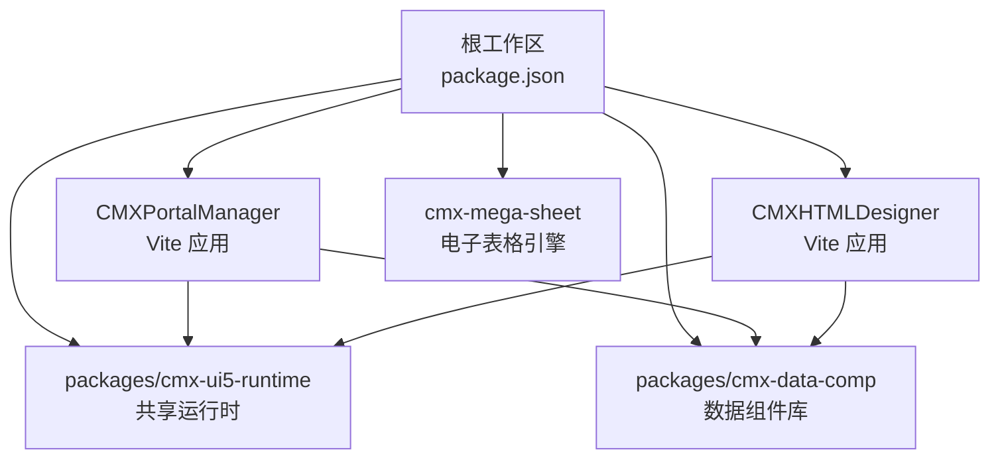
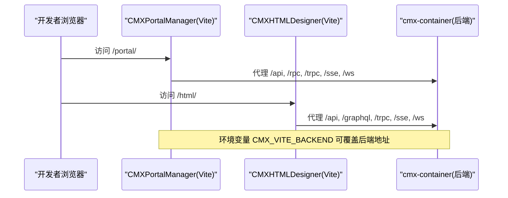
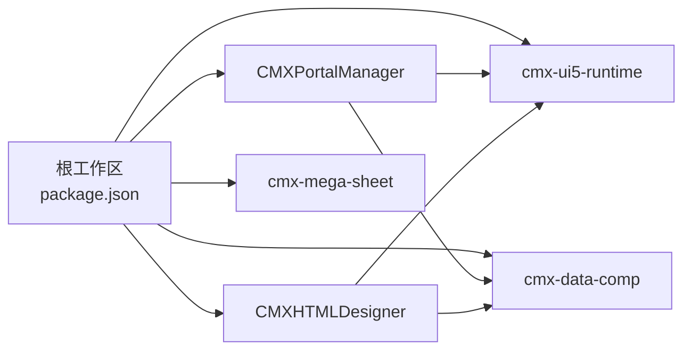

# 快速开始

<cite>
**本文引用的文件**
- [README.md](file://README.md)
- [package.json](file://package.json)
- [CMXPortalManager/package.json](file://CMXPortalManager/package.json)
- [CMXHTMLDesigner/package.json](file://CMXHTMLDesigner/package.json)
- [cmx-mega-sheet/package.json](file://cmx-mega-sheet/package.json)
- [CMXPortalManager/vite.config.js](file://CMXPortalManager/vite.config.js)
- [CMXHTMLDesigner/vite.config.js](file://CMXHTMLDesigner/vite.config.js)
- [CMXPortalManager/scripts/run-vite.mjs](file://CMXPortalManager/scripts/run-vite.mjs)
- [CMXHTMLDesigner/scripts/run-vite.mjs](file://CMXHTMLDesigner/scripts/run-vite.mjs)
- [CMXHTMLDesigner/vitest.config.js](file://CMXHTMLDesigner/vitest.config.js)
- [cmx-mega-sheet/vitest.config.ts](file://cmx-mega-sheet/vitest.config.ts)
- [docker命令.txt](file://docker命令.txt)
- [AGENTS.md](file://AGENTS.md)
</cite>

## 目录
1. [简介](#简介)
2. [项目结构](#项目结构)
3. [核心组件](#核心组件)
4. [架构总览](#架构总览)
5. [详细组件分析](#详细组件分析)
6. [依赖关系分析](#依赖关系分析)
7. [性能注意事项](#性能注意事项)
8. [故障排查指南](#故障排查指南)
9. [结论](#结论)
10. [附录](#附录)

## 简介
本指南面向新加入的开发者，目标是“从零到运行”：安装 Node.js、npm、Rust、PostgreSQL，完成依赖安装、构建与测试，并分别启动门户管理器（CMXPortalManager）、可视化设计器（CMXHTMLDesigner）以及电子表格引擎（cmx-mega-sheet）。同时提供常见环境问题定位与调试技巧，帮助你快速进入开发状态。

## 项目结构
仓库采用 npm workspaces 多包管理，前端应用与共享运行时位于根目录下，电子表格引擎作为独立包存在：
- CMXPortalManager：门户运行时，默认路由 /portal/
- CMXHTMLDesigner：可视化设计器，默认路由 /html/
- packages/cmx-data-comp：数据层 Web Components（由门户与设计器复用）
- packages/cmx-ui5-runtime：共享 UI5/Tabler 运行时，默认路由 /shared/
- cmx-mega-sheet：自研电子表格引擎（TypeScript + Web Components）

图表来源
- [package.json:6-10](file://package.json#L6-L10)
- [CMXPortalManager/vite.config.js:84-95](file://CMXPortalManager/vite.config.js#L84-L95)
- [CMXHTMLDesigner/vite.config.js:72-84](file://CMXHTMLDesigner/vite.config.js#L72-L84)

章节来源
- [README.md:8-17](file://README.md#L8-L17)
- [package.json:1-25](file://package.json#L1-L25)

## 核心组件
- 门户管理器（CMXPortalManager）
  - 使用 Vite 进行开发与构建，通过 scripts/run-vite.mjs 调用 Vite CLI，避免 monorepo 下路径解析问题。
  - 生产构建输出多入口（index.html、login.html），并通过 base 与环境变量控制部署路径。
  - 开发服务器将 /api、/rpc、/trpc、/sse、/ws、/shared 等代理到后端目标地址。
- 可视化设计器（CMXHTMLDesigner）
  - 同样基于 Vite，支持 dev/build/preview/test 脚本；测试环境为 jsdom。
  - 构建产物包含多个页面入口（index、login、preview、debug）。
- 电子表格引擎（cmx-mega-sheet）
  - TypeScript 工程，提供 build/typecheck/test 脚本；测试默认 node 环境，渲染相关用例可按需切换 jsdom。

章节来源
- [CMXPortalManager/package.json:8-22](file://CMXPortalManager/package.json#L8-L22)
- [CMXHTMLDesigner/package.json:6-12](file://CMXHTMLDesigner/package.json#L6-L12)
- [cmx-mega-sheet/package.json:18-23](file://cmx-mega-sheet/package.json#L18-L23)
- [CMXPortalManager/scripts/run-vite.mjs:1-31](file://CMXPortalManager/scripts/run-vite.mjs#L1-L31)
- [CMXHTMLDesigner/scripts/run-vite.mjs:1-31](file://CMXHTMLDesigner/scripts/run-vite.mjs#L1-L31)
- [CMXHTMLDesigner/vitest.config.js:1-15](file://CMXHTMLDesigner/vitest.config.js#L1-L15)
- [cmx-mega-sheet/vitest.config.ts:1-17](file://cmx-mega-sheet/vitest.config.ts#L1-L17)

## 架构总览
前端通过 Vite 启动开发服务器，按模式加载环境变量，并将 API 请求代理至后端（cmx-container，Rust）。生产构建时，各子应用产出静态资源，由后端或 CDN 托管。

图表来源
- [CMXPortalManager/vite.config.js:27-33](file://CMXPortalManager/vite.config.js#L27-L33)
- [CMXPortalManager/vite.config.js:84-95](file://CMXPortalManager/vite.config.js#L84-L95)
- [CMXHTMLDesigner/vite.config.js:26-32](file://CMXHTMLDesigner/vite.config.js#L26-L32)
- [CMXHTMLDesigner/vite.config.js:72-84](file://CMXHTMLDesigner/vite.config.js#L72-L84)

## 详细组件分析

### 开发环境搭建（Node.js、npm、Rust、PostgreSQL）
- Node.js 与 npm
  - 推荐版本：Node ^18 || ^20 || >=22（见门户工程 engines 字段）。
  - 在仓库根目录执行 npm install 安装所有 workspace 依赖。
- Rust
  - 用于后端 cmx-container 编译与运行；本地需安装 Rust Toolchain。
- PostgreSQL
  - 可使用 Docker 快速拉起数据库实例（端口 5432）。

章节来源
- [CMXPortalManager/package.json:5-7](file://CMXPortalManager/package.json#L5-L7)
- [README.md:28-43](file://README.md#L28-L43)
- [docker命令.txt:1-7](file://docker命令.txt#L1-L7)

### 安装与构建
- 根目录统一命令
  - 安装依赖：npm install
  - 全量构建：npm run build:apps（会先构建共享运行时，再构建门户与设计器）
  - 仅构建门户：npm run build:portal
  - 仅构建设计器：npm run build:html
- 子项目独立构建
  - 门户：cd CMXPortalManager && npm run build
  - 设计器：cd CMXHTMLDesigner && npm run build
  - 电子表格引擎：cd cmx-mega-sheet && npm run build

章节来源
- [package.json:16-25](file://package.json#L16-L25)
- [CMXPortalManager/package.json:8-11](file://CMXPortalManager/package.json#L8-L11)
- [CMXHTMLDesigner/package.json:6-11](file://CMXHTMLDesigner/package.json#L6-L11)
- [cmx-mega-sheet/package.json:18-23](file://cmx-mega-sheet/package.json#L18-L23)

### 测试
- 根目录
  - 全量测试：npm test（会运行 cmx-data-comp 与 cmx-html-designer 的测试）
- 子项目
  - 门户：无自动化测试脚本，建议通过构建+lint+手动验证
  - 设计器：npm test（jsdom 环境）
  - 电子表格引擎：npm test（node 环境）

章节来源
- [package.json:16-19](file://package.json#L16-L19)
- [CMXHTMLDesigner/package.json:10-11](file://CMXHTMLDesigner/package.json#L10-L11)
- [cmx-mega-sheet/package.json:20-23](file://cmx-mega-sheet/package.json#L20-L23)
- [CMXHTMLDesigner/vitest.config.js:1-15](file://CMXHTMLDesigner/vitest.config.js#L1-L15)
- [cmx-mega-sheet/vitest.config.ts:1-17](file://cmx-mega-sheet/vitest.config.ts#L1-L17)

### 启动各个子项目（开发模式）
- 门户管理器（CMXPortalManager）
  - 命令：npm run dev:portal（根目录）或 cd CMXPortalManager && npm run dev
  - 说明：scripts/run-vite.mjs 会定位 Vite CLI 并启动开发服务器；默认监听本地端口，可通过环境变量调整后端代理目标。
- 可视化设计器（CMXHTMLDesigner）
  - 命令：npm run dev:html（根目录）或 cd CMXHTMLDesigner && npm run dev
  - 说明：同上，通过 run-vite.mjs 启动 Vite；支持 preview 预览构建产物。
- 电子表格引擎（cmx-mega-sheet）
  - 命令：cd cmx-mega-sheet && npm run test:watch（开发时常用）
  - 说明：该包主要提供库能力，通常被其他应用引用；如需本地联调，可在 demo 目录中打开对应 HTML 或通过测试驱动验证。

章节来源
- [package.json:20-21](file://package.json#L20-L21)
- [CMXPortalManager/scripts/run-vite.mjs:10-30](file://CMXPortalManager/scripts/run-vite.mjs#L10-L30)
- [CMXHTMLDesigner/scripts/run-vite.mjs:10-30](file://CMXHTMLDesigner/scripts/run-vite.mjs#L10-L30)
- [cmx-mega-sheet/package.json:20-23](file://cmx-mega-sheet/package.json#L20-L23)

### 环境变量与代理配置
- 环境变量分层
  - .env：所有模式共享
  - .env.development/.env.production：按模式覆盖
  - 系统环境变量优先级最高（如 CI/CD 场景）
- 关键变量
  - CMX_APP_BASE：应用基础路径（dev 通常为 ./，prod 分别为 /portal/、/html/）
  - CMX_VITE_BACKEND：后端目标地址（默认 http://127.0.0.1:8080）
- 代理路径
  - 门户：/shared、/api、/rpc、/trpc、/sse、/ws
  - 设计器：/shared、/api、/graphql、/trpc、/sse、/ws

章节来源
- [CMXPortalManager/vite.config.js:15-33](file://CMXPortalManager/vite.config.js#L15-L33)
- [CMXPortalManager/vite.config.js:84-95](file://CMXPortalManager/vite.config.js#L84-L95)
- [CMXHTMLDesigner/vite.config.js:15-32](file://CMXHTMLDesigner/vite.config.js#L15-L32)
- [CMXHTMLDesigner/vite.config.js:72-84](file://CMXHTMLDesigner/vite.config.js#L72-L84)

### 构建产物与多入口
- 门户管理器
  - 多入口：index.html、login.html
  - 生产 base：/portal/（可通过 CMX_APP_BASE 覆盖）
- 可视化设计器
  - 多入口：index.html、login.html、preview.html、debug.html
  - 生产 base：/html/（可通过 CMX_APP_BASE 覆盖）

章节来源
- [CMXPortalManager/vite.config.js:97-116](file://CMXPortalManager/vite.config.js#L97-L116)
- [CMXHTMLDesigner/vite.config.js:90-102](file://CMXHTMLDesigner/vite.config.js#L90-L102)

## 依赖关系分析
- 工作区与工作流
  - 根 package.json 声明 workspaces，统一管理 packages/*、CMXHTMLDesigner、CMXPortalManager。
  - 根脚本通过 -w 指定工作区执行命令，保证构建与测试的一致性。
- 子项目依赖
  - 门户与设计器均依赖 cmx-ui5-runtime 与 cmx-data-comp，并在 vite.config.js 中设置别名以指向源码，便于开发期热更新。
  - 电子表格引擎独立发布，供上层业务引用。

图表来源
- [package.json:6-10](file://package.json#L6-L10)
- [CMXPortalManager/vite.config.js:42-65](file://CMXPortalManager/vite.config.js#L42-L65)
- [CMXHTMLDesigner/vite.config.js:37-58](file://CMXHTMLDesigner/vite.config.js#L37-L58)

章节来源
- [package.json:1-25](file://package.json#L1-L25)
- [AGENTS.md:215-228](file://AGENTS.md#L215-L228)

## 性能注意事项
- 首屏优化
  - 门户构建启用 modulePreload 过滤重型 vendor chunk（如 ignite spreadsheet），避免首屏加载无关资源。
  - 通过 manualChunks/codeSplitting 将大型第三方库拆分为独立 chunk，提升并行解析与缓存命中率。
- 依赖去重
  - 对 UI5、lit 等关键库进行 dedupe，避免重复实例导致行为异常。
- 依赖预优化排除
  - 对 UI5 相关包进行 optimizeDeps.exclude，减少预打包开销。

章节来源
- [CMXPortalManager/vite.config.js:101-106](file://CMXPortalManager/vite.config.js#L101-L106)
- [CMXPortalManager/vite.config.js:112-168](file://CMXPortalManager/vite.config.js#L112-L168)
- [CMXPortalManager/vite.config.js:66-82](file://CMXPortalManager/vite.config.js#L66-L82)
- [CMXPortalManager/vite.config.js:170-181](file://CMXPortalManager/vite.config.js#L170-L181)

## 故障排查指南
- 未找到 Vite
  - 现象：启动时报错提示未找到 vite。
  - 处理：确保在仓库根目录执行过 npm install；run-vite.mjs 会从当前包或根 node_modules 查找 Vite。
- 后端连接失败
  - 现象：API 请求 404/502 或跨域错误。
  - 处理：检查 CMX_VITE_BACKEND 是否指向正确的后端地址；确认后端已启动且端口可达。
- 登录反复跳转或 414
  - 现象：访问 login 页面后出现 redirect 叠加或 URL 过长。
  - 处理：检查生产 base 是否正确（/portal/ 或 /html/），避免相对路径解析错误；必要时调整代理与路由。
- 构建产物缺失
  - 现象：构建后缺少 login.html 等入口。
  - 处理：确认 rollupOptions/rolldownOptions 的 input 配置包含所需入口；确保 Vite/Rolldown 版本兼容。
- 测试环境差异
  - 现象：部分测试在 jsdom/node 环境下表现不一致。
  - 处理：根据组件特性选择合适的环境；渲染相关用例可在文件顶部指定 jsdom。

章节来源
- [CMXPortalManager/scripts/run-vite.mjs:16-22](file://CMXPortalManager/scripts/run-vite.mjs#L16-L22)
- [CMXHTMLDesigner/scripts/run-vite.mjs:16-22](file://CMXHTMLDesigner/scripts/run-vite.mjs#L16-L22)
- [CMXPortalManager/vite.config.js:27-33](file://CMXPortalManager/vite.config.js#L27-L33)
- [CMXHTMLDesigner/vite.config.js:26-32](file://CMXHTMLDesigner/vite.config.js#L26-L32)
- [CMXHTMLDesigner/vitest.config.js:4-6](file://CMXHTMLDesigner/vitest.config.js#L4-L6)
- [cmx-mega-sheet/vitest.config.ts:3-8](file://cmx-mega-sheet/vitest.config.ts#L3-L8)

## 结论
通过本指南，你可以在本地快速完成 CMX 企业门户平台的开发环境搭建、依赖安装、构建与测试，并分别启动门户管理器、可视化设计器与电子表格引擎。结合环境变量与代理配置，你可以灵活对接后端服务；借助构建优化策略，获得更好的首屏与运行性能。遇到问题时，可参考故障排查指南快速定位与解决。

## 附录
- 一键命令速查
  - 安装依赖：npm install
  - 全量构建：npm run build:apps
  - 仅构建门户：npm run build:portal
  - 仅构建设计器：npm run build:html
  - 全量测试：npm test
  - 启动门户开发：npm run dev:portal
  - 启动设计器开发：npm run dev:html
  - 电子表格引擎测试：cd cmx-mega-sheet && npm run test:watch
- 数据库快速启动（Docker）
  - 使用 docker 命令拉起 PostgreSQL（端口 5432），按需挂载数据卷。

章节来源
- [AGENTS.md:215-228](file://AGENTS.md#L215-L228)
- [docker命令.txt:1-7](file://docker命令.txt#L1-L7)