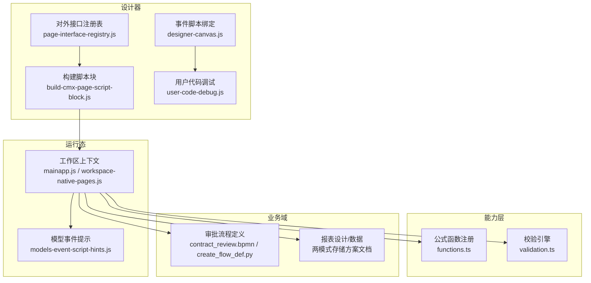
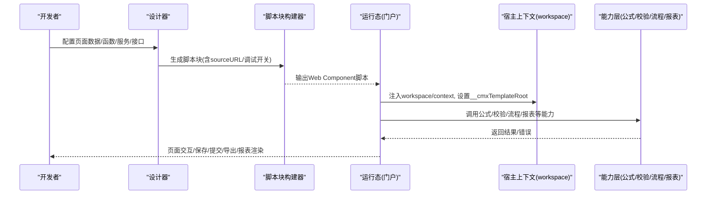
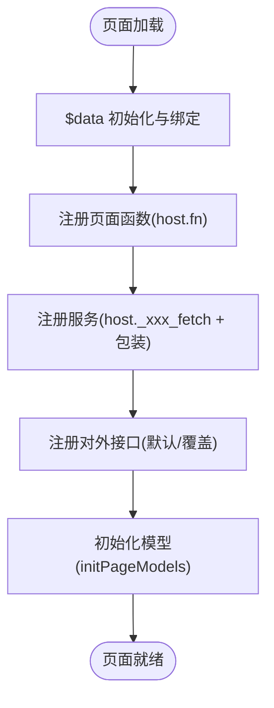
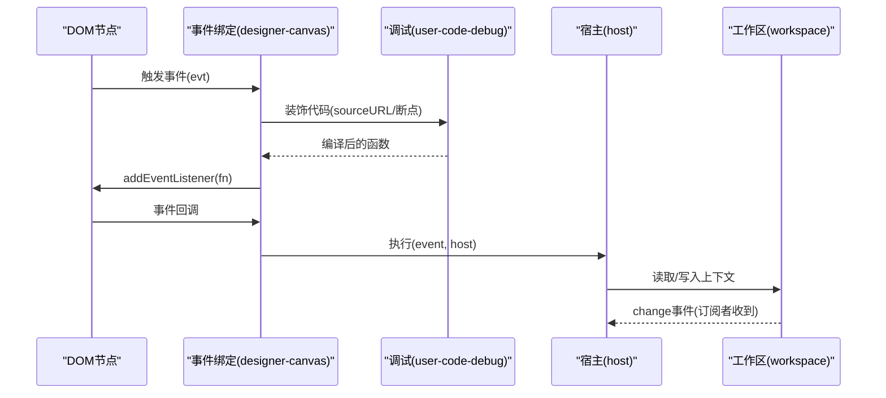
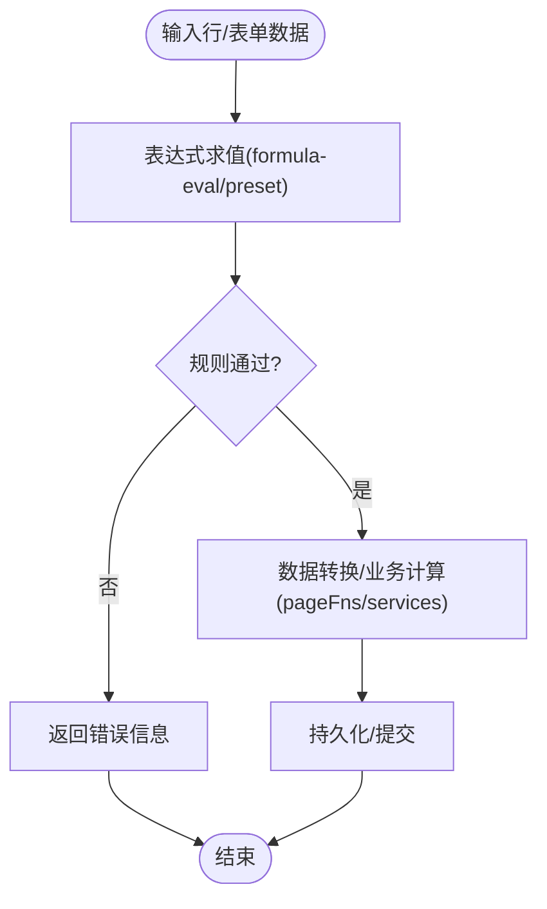
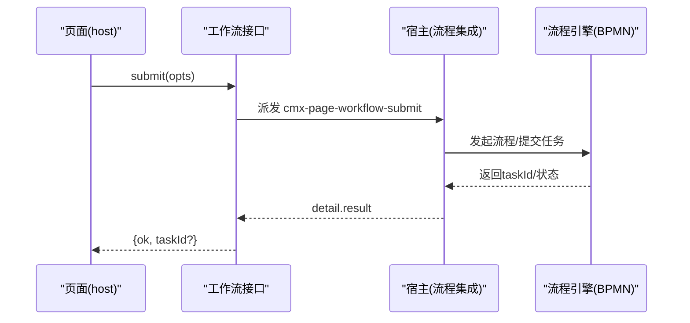
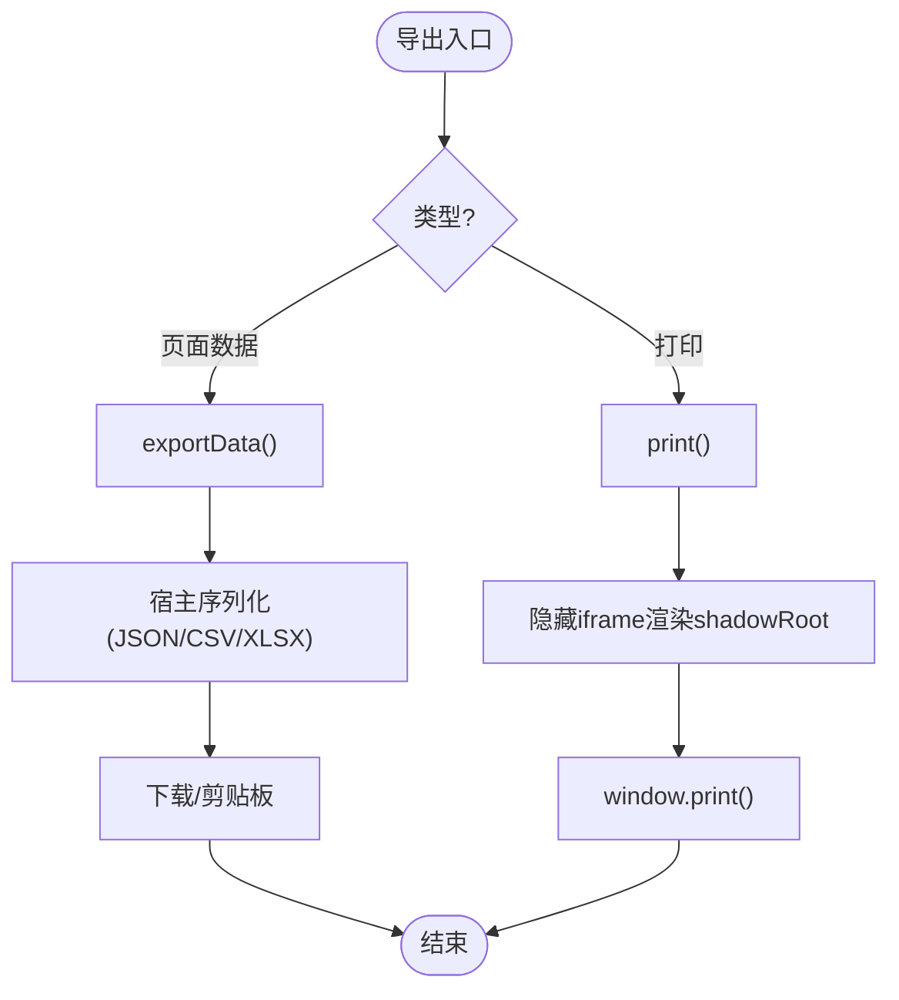
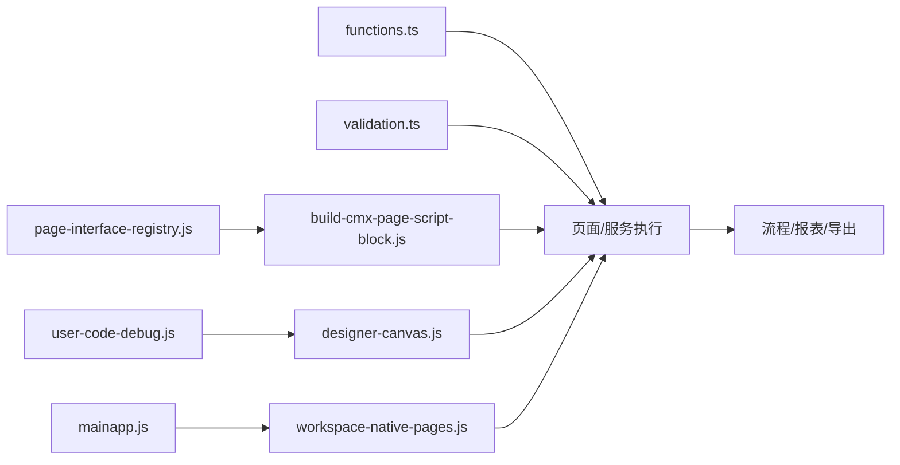

# 业务流程扩展

<cite>
**本文引用的文件**
- [build-cmx-page-script-block.js](file://CMXHTMLDesigner/src/utils/build-cmx-page-script-block.js)
- [page-interface-registry.js](file://CMXHTMLDesigner/src/components/designer-page-data/page-interface-registry.js)
- [designer-canvas.js](file://CMXHTMLDesigner/src/components/designer-canvas.js)
- [user-code-debug.js](file://CMXHTMLDesigner/src/utils/user-code-debug.js)
- [mainapp.js](file://CMXPortalManager/src/lib/mainapp.js)
- [workspace-native-pages.js](file://CMXPortalManager/src/lib/workspace-native-pages.js)
- [models-event-script-hints.js](file://CMXHTMLDesigner/src/components/designer-page-data/models-event-script-hints.js)
- [functions.ts](file://cmx-mega-sheet/src/formula/functions.ts)
- [validation.ts](file://cmx-mega-sheet/src/core/validation.ts)
- [column-editor-display-guide.md](file://packages/cmx-data-comp/docs/column-editor-display-guide.md)
- [业务单据数据装载与前端模型映射方案.md](file://docs/业务单据数据装载与前端模型映射方案.md)
- [20260817_cmx-mdm_主数据CR审批对接流程平台方案.md](file://documents/MDM主数据管理平台/20260817_cmx-mdm_主数据CR审批对接流程平台方案.md)
- [contract_review.bpmn](file://.agents/skills/cmx-flow-toolkit/examples/contract_review.bpmn)
- [create_flow_def.py](file://.agents/skills/cmx-flow-toolkit/scripts/create_flow_def.py)
</cite>

## 目录
1. [简介](#简介)
2. [项目结构](#项目结构)
3. [核心组件](#核心组件)
4. [架构总览](#架构总览)
5. [详细组件分析](#详细组件分析)
6. [依赖关系分析](#依赖关系分析)
7. [性能考量](#性能考量)
8. [故障排查指南](#故障排查指南)
9. [结论](#结论)
10. [附录](#附录)

## 简介
本开发文档面向需要在页面中扩展业务逻辑的开发者，聚焦以下目标：
- 在页面中扩展业务逻辑、自定义事件处理器和数据验证规则
- 理解脚本引擎工作机制、函数注册与上下文管理
- 实现表单验证、数据转换、业务计算与流程控制
- 解决复杂业务场景（审批流程、数据导出、报表生成）
- 掌握脚本安全限制、调试方法与性能优化技巧

## 项目结构
本项目围绕“页面脚本注入 + 运行时执行 + 宿主上下文”展开，关键位置如下：
- 设计器侧：负责将页面元数据、函数、服务、对外接口编译为可运行脚本块，并挂载到 Web Component
- 运行侧：门户工作区提供全局上下文（workspace/context），页面脚本通过闭包或全局桥访问
- 模型与事件：模型事件提示与默认事件契约，便于编写事件脚本
- 公式与校验：表格与列级公式求值、校验规则引擎
- 流程与报表：BPMN 流程定义与部署、报表设计与数据存取

**图表来源**
- [build-cmx-page-script-block.js:28-312](file://CMXHTMLDesigner/src/utils/build-cmx-page-script-block.js#L28-L312)
- [page-interface-registry.js:1-468](file://CMXHTMLDesigner/src/components/designer-page-data/page-interface-registry.js#L1-L468)
- [designer-canvas.js:919-949](file://CMXHTMLDesigner/src/components/designer-canvas.js#L919-L949)
- [user-code-debug.js:1-60](file://CMXHTMLDesigner/src/utils/user-code-debug.js#L1-L60)
- [mainapp.js:18-56](file://CMXPortalManager/src/lib/mainapp.js#L18-L56)
- [workspace-native-pages.js:185-204](file://CMXPortalManager/src/lib/workspace-native-pages.js#L185-L204)
- [models-event-script-hints.js:1-92](file://CMXHTMLDesigner/src/components/designer-page-data/models-event-script-hints.js#L1-L92)
- [functions.ts:1133-1148](file://cmx-mega-sheet/src/formula/functions.ts#L1133-L1148)
- [validation.ts:60-87](file://cmx-mega-sheet/src/core/validation.ts#L60-L87)
- [contract_review.bpmn:1-37](file://.agents/skills/cmx-flow-toolkit/examples/contract_review.bpmn#L1-L37)
- [create_flow_def.py:27-48](file://.agents/skills/cmx-flow-toolkit/scripts/create_flow_def.py#L27-L48)

**章节来源**
- [build-cmx-page-script-block.js:28-312](file://CMXHTMLDesigner/src/utils/build-cmx-page-script-block.js#L28-L312)
- [page-interface-registry.js:1-468](file://CMXHTMLDesigner/src/components/designer-page-data/page-interface-registry.js#L1-L468)
- [designer-canvas.js:919-949](file://CMXHTMLDesigner/src/components/designer-canvas.js#L919-L949)
- [user-code-debug.js:1-60](file://CMXHTMLDesigner/src/utils/user-code-debug.js#L1-L60)
- [mainapp.js:18-56](file://CMXPortalManager/src/lib/mainapp.js#L18-L56)
- [workspace-native-pages.js:185-204](file://CMXPortalManager/src/lib/workspace-native-pages.js#L185-L204)
- [models-event-script-hints.js:1-92](file://CMXHTMLDesigner/src/components/designer-page-data/models-event-script-hints.js#L1-L92)

## 核心组件
- 脚本块构建器：将页面数据、函数、服务、对外接口编译为 Web Component 脚本，注入 $data、host、坐标上下文，并初始化模型
- 对外接口注册表：定义 host 暴露的方法（状态查询、生命周期、编辑动作、持久化、工作流、对话框、数据注入），支持默认实现与作者覆盖
- 事件脚本绑定：将用户编写的 DOM 事件脚本编译为 Function，附加 sourceURL 与可选断点，按节点/事件名管理监听
- 上下文与工作区：portal 在工作区注入 workspace 与模板根，页面脚本同步捕获；原生页脚本通过闭包或全局桥获取 host
- 模型事件提示：提供模型事件清单与 event.detail 字段说明，辅助编写事件脚本
- 公式与校验：内置函数注册表与校验引擎，支撑列级/单元格级计算与规则校验
- 流程与报表：BPMN 流程定义与部署脚本；报表双模式（设计/数据）存储与端点

**章节来源**
- [build-cmx-page-script-block.js:28-312](file://CMXHTMLDesigner/src/utils/build-cmx-page-script-block.js#L28-L312)
- [page-interface-registry.js:1-468](file://CMXHTMLDesigner/src/components/designer-page-data/page-interface-registry.js#L1-L468)
- [designer-canvas.js:919-949](file://CMXHTMLDesigner/src/components/designer-canvas.js#L919-L949)
- [mainapp.js:18-56](file://CMXPortalManager/src/lib/mainapp.js#L18-L56)
- [workspace-native-pages.js:185-204](file://CMXPortalManager/src/lib/workspace-native-pages.js#L185-L204)
- [models-event-script-hints.js:1-92](file://CMXHTMLDesigner/src/components/designer-page-data/models-event-script-hints.js#L1-L92)
- [functions.ts:1133-1148](file://cmx-mega-sheet/src/formula/functions.ts#L1133-L1148)
- [validation.ts:60-87](file://cmx-mega-sheet/src/core/validation.ts#L60-L87)

## 架构总览
页面扩展由“设计期配置 → 运行期注入 → 宿主上下文 → 业务能力”构成闭环。

**图表来源**
- [build-cmx-page-script-block.js:28-312](file://CMXHTMLDesigner/src/utils/build-cmx-page-script-block.js#L28-L312)
- [mainapp.js:18-56](file://CMXPortalManager/src/lib/mainapp.js#L18-L56)
- [workspace-native-pages.js:185-204](file://CMXPortalManager/src/lib/workspace-native-pages.js#L185-L204)
- [functions.ts:1133-1148](file://cmx-mega-sheet/src/formula/functions.ts#L1133-L1148)
- [validation.ts:60-87](file://cmx-mega-sheet/src/core/validation.ts#L60-L87)

## 详细组件分析

### 脚本引擎与函数注册机制
- 脚本块构建器在 connectedCallback 中：
  - 解析 pageData 并创建 Proxy 驱动的 $data，自动绑定 data-bind-*
  - 使用 new Function 将每个 pageFns 注入为 host 方法，附带 sourceURL 与调试入口
  - 对 pageServices 生成 fetch 包装与响应转换，同样带 sourceURL
  - 对外接口根据注册表生成默认实现或作者覆盖方法，并提供 markDirty/markClean/setBusy 等通用能力
  - 最后委托 initPageModels 完成模型初始化
- 函数签名约定：隐式参数 $data、host，显式参数来自声明；异步服务通过 AsyncFunction 封装

**图表来源**
- [build-cmx-page-script-block.js:110-233](file://CMXHTMLDesigner/src/utils/build-cmx-page-script-block.js#L110-L233)
- [build-cmx-page-script-block.js:235-298](file://CMXHTMLDesigner/src/utils/build-cmx-page-script-block.js#L235-L298)

**章节来源**
- [build-cmx-page-script-block.js:28-312](file://CMXHTMLDesigner/src/utils/build-cmx-page-script-block.js#L28-L312)

### 事件处理器与上下文管理
- 事件脚本绑定：
  - 将用户代码装饰为 Function，附加 sourceURL，支持进入即断点
  - 以 node.addEventListener 挂载，内部维护 __evStore 避免重复绑定
- 上下文管理：
  - 设计器/运行期通过 globalThis.workspace 与 __cmxTemplateRoot 传递工作区与模板根
  - 原生页脚本通过闭包或全局桥 __cmxNativeHost 获取当前 host
  - 共享上下文 ContextHost 仅通过 set/delete 派发 change，避免裸赋值导致不同步

**图表来源**
- [designer-canvas.js:919-949](file://CMXHTMLDesigner/src/components/designer-canvas.js#L919-L949)
- [user-code-debug.js:1-60](file://CMXHTMLDesigner/src/utils/user-code-debug.js#L1-L60)
- [mainapp.js:18-56](file://CMXPortalManager/src/lib/mainapp.js#L18-L56)
- [workspace-native-pages.js:185-204](file://CMXPortalManager/src/lib/workspace-native-pages.js#L185-L204)

**章节来源**
- [designer-canvas.js:919-949](file://CMXHTMLDesigner/src/components/designer-canvas.js#L919-L949)
- [user-code-debug.js:1-60](file://CMXHTMLDesigner/src/utils/user-code-debug.js#L1-L60)
- [mainapp.js:18-56](file://CMXPortalManager/src/lib/mainapp.js#L18-L56)
- [workspace-native-pages.js:185-204](file://CMXPortalManager/src/lib/workspace-native-pages.js#L185-L204)

### 表单验证、数据转换与业务计算
- 列级验证：
  - validateFormula 支持 preset 与表达式规则，保存时统一调用预设进行校验
  - 表达式语法包含基础运算、字段引用、比较、逻辑与常用函数
- 公式引擎：
  - 函数注册表集中管理内置函数，支持易失性标记与名称列表
  - 校验引擎实现多种操作符与自定义公式评估，失败返回结构化错误
- 业务计算：
  - 通过 pageFns 与 services 组合实现数据转换与计算，$data 作为读写载体
  - 服务响应可映射回 $data 指定字段，简化双向绑定

**图表来源**
- [column-editor-display-guide.md:354-376](file://packages/cmx-data-comp/docs/column-editor-display-guide.md#L354-L376)
- [functions.ts:1133-1148](file://cmx-mega-sheet/src/formula/functions.ts#L1133-L1148)
- [validation.ts:60-87](file://cmx-mega-sheet/src/core/validation.ts#L60-L87)
- [build-cmx-page-script-block.js:165-233](file://CMXHTMLDesigner/src/utils/build-cmx-page-script-block.js#L165-L233)

**章节来源**
- [column-editor-display-guide.md:354-376](file://packages/cmx-data-comp/docs/column-editor-display-guide.md#L354-L376)
- [functions.ts:1133-1148](file://cmx-mega-sheet/src/formula/functions.ts#L1133-L1148)
- [validation.ts:60-87](file://cmx-mega-sheet/src/core/validation.ts#L60-L87)
- [build-cmx-page-script-block.js:165-233](file://CMXHTMLDesigner/src/utils/build-cmx-page-script-block.js#L165-L233)

### 流程控制与审批场景
- 页面工作流接口：
  - submit/recall/returnBack/addApprover/addCC/getWorkflowProgress/previewWorkflow 等，默认实现通过派发 CustomEvent 交由宿主处理
  - 宿主可监听这些事件并完成实际流程调用，返回结果给页面
- BPMN 流程定义：
  - 示例合同评审流程包含并行网关、多实例、条件网关与终止事件
  - 部署脚本支持幂等发布与校验，确保 key、策略与表单绑定正确
- 审批策略：
  - 四眼原则、角色候选池、取回策略（lenient）与授权校验保障流程安全

**图表来源**
- [page-interface-registry.js:295-365](file://CMXHTMLDesigner/src/components/designer-page-data/page-interface-registry.js#L295-L365)
- [contract_review.bpmn:1-37](file://.agents/skills/cmx-flow-toolkit/examples/contract_review.bpmn#L1-L37)
- [create_flow_def.py:27-48](file://.agents/skills/cmx-flow-toolkit/scripts/create_flow_def.py#L27-L48)

**章节来源**
- [page-interface-registry.js:295-365](file://CMXHTMLDesigner/src/components/designer-page-data/page-interface-registry.js#L295-L365)
- [contract_review.bpmn:1-37](file://.agents/skills/cmx-flow-toolkit/examples/contract_review.bpmn#L1-L37)
- [create_flow_def.py:27-48](file://.agents/skills/cmx-flow-toolkit/scripts/create_flow_def.py#L27-L48)
- [20260817_cmx-mdm_主数据CR审批对接流程平台方案.md:126-288](file://documents/MDM主数据管理平台/20260817_cmx-mdm_主数据CR审批对接流程平台方案.md#L126-L288)

### 数据导出与报表生成
- 数据导出：
  - exportData 默认返回 getState()，宿主可自定义序列化（JSON/CSV/Excel）
  - 打印功能通过隐藏 iframe 渲染 shadowRoot 内容并调用 print
- 报表生成：
  - 双模式：设计模式（布局/区域/公式/样式）与数据模式（组织+期间值）
  - 端点提供 layout 与 data 的读写，后端以 BLOB+关系表存储，前端派生行列与单元格映射

**图表来源**
- [page-interface-registry.js:267-293](file://CMXHTMLDesigner/src/components/designer-page-data/page-interface-registry.js#L267-L293)
- [业务单据数据装载与前端模型映射方案.md:1111-1119](file://docs/业务单据数据装载与前端模型映射方案.md#L1111-L1119)

**章节来源**
- [page-interface-registry.js:267-293](file://CMXHTMLDesigner/src/components/designer-page-data/page-interface-registry.js#L267-L293)
- [业务单据数据装载与前端模型映射方案.md:1111-1119](file://docs/业务单据数据装载与前端模型映射方案.md#L1111-L1119)

## 依赖关系分析
- 设计器依赖：
  - build-cmx-page-script-block.js 依赖 page-interface-registry.js 的接口定义与归一化
  - designer-canvas.js 依赖 user-code-debug.js 的 sourceURL 与断点注入
- 运行态依赖：
  - mainapp.js 提供 ContextHost 与 workspace 注入
  - workspace-native-pages.js 提供原生页脚本执行环境（闭包/全局桥）
- 能力层依赖：
  - functions.ts 提供公式函数注册与调试
  - validation.ts 提供校验规则执行
- 业务域依赖：
  - BPMN 流程定义与部署脚本驱动流程引擎
  - 报表设计/数据文档定义前后端契约

**图表来源**
- [page-interface-registry.js:1-468](file://CMXHTMLDesigner/src/components/designer-page-data/page-interface-registry.js#L1-L468)
- [build-cmx-page-script-block.js:28-312](file://CMXHTMLDesigner/src/utils/build-cmx-page-script-block.js#L28-L312)
- [designer-canvas.js:919-949](file://CMXHTMLDesigner/src/components/designer-canvas.js#L919-L949)
- [user-code-debug.js:1-60](file://CMXHTMLDesigner/src/utils/user-code-debug.js#L1-L60)
- [mainapp.js:18-56](file://CMXPortalManager/src/lib/mainapp.js#L18-L56)
- [workspace-native-pages.js:185-204](file://CMXPortalManager/src/lib/workspace-native-pages.js#L185-L204)
- [functions.ts:1133-1148](file://cmx-mega-sheet/src/formula/functions.ts#L1133-L1148)
- [validation.ts:60-87](file://cmx-mega-sheet/src/core/validation.ts#L60-L87)

**章节来源**
- [page-interface-registry.js:1-468](file://CMXHTMLDesigner/src/components/designer-page-data/page-interface-registry.js#L1-L468)
- [build-cmx-page-script-block.js:28-312](file://CMXHTMLDesigner/src/utils/build-cmx-page-script-block.js#L28-L312)
- [designer-canvas.js:919-949](file://CMXHTMLDesigner/src/components/designer-canvas.js#L919-L949)
- [user-code-debug.js:1-60](file://CMXHTMLDesigner/src/utils/user-code-debug.js#L1-L60)
- [mainapp.js:18-56](file://CMXPortalManager/src/lib/mainapp.js#L18-L56)
- [workspace-native-pages.js:185-204](file://CMXPortalManager/src/lib/workspace-native-pages.js#L185-L204)
- [functions.ts:1133-1148](file://cmx-mega-sheet/src/formula/functions.ts#L1133-L1148)
- [validation.ts:60-87](file://cmx-mega-sheet/src/core/validation.ts#L60-L87)

## 性能考量
- 脚本执行：
  - 使用 new Function/AsyncFunction 即时编译，减少中间层开销
  - 通过 sourceURL 与模块化作用域提升调试效率，避免全局污染
- 数据绑定：
  - $data 使用 Proxy 仅对变更键触发重绑，降低无关更新成本
- 公式与校验：
  - 内置函数集中注册，易失性函数按需重算
  - 校验规则在保存点批量执行，避免频繁实时校验
- 流程与报表：
  - 流程节点与网关由引擎高效调度
  - 报表布局与数据分离，减少重复计算与传输体积

[本节为通用指导，不直接分析具体文件]

## 故障排查指南
- 事件脚本编译失败：
  - 检查事件脚本语法，查看控制台错误信息
  - 确认 sourceURL 是否正确生成，便于定位问题
- 上下文未生效：
  - 确保在顶层脚本同步捕获 globalThis.workspace
  - 原生页脚本通过 __cmxNativeHost 获取 host
- 校验失败：
  - 检查 validateFormula 规则表达式与 message
  - 确认保存前是否调用预设校验
- 流程提交失败：
  - 检查宿主是否正确监听工作流事件并返回 result
  - 核对 BPMN 流程 key、策略与表单绑定

**章节来源**
- [designer-canvas.js:919-949](file://CMXHTMLDesigner/src/components/designer-canvas.js#L919-L949)
- [user-code-debug.js:1-60](file://CMXHTMLDesigner/src/utils/user-code-debug.js#L1-L60)
- [mainapp.js:18-56](file://CMXPortalManager/src/lib/mainapp.js#L18-L56)
- [workspace-native-pages.js:185-204](file://CMXPortalManager/src/lib/workspace-native-pages.js#L185-L204)
- [column-editor-display-guide.md:354-376](file://packages/cmx-data-comp/docs/column-editor-display-guide.md#L354-L376)
- [page-interface-registry.js:295-365](file://CMXHTMLDesigner/src/components/designer-page-data/page-interface-registry.js#L295-L365)

## 结论
通过脚本引擎、函数注册、上下文管理与能力层集成，本系统提供了灵活的页面扩展能力。开发者可在设计器中配置页面数据、函数与服务，利用对外接口与事件脚本实现表单验证、数据转换、业务计算与流程控制。结合 BPMN 流程与报表双模式，可应对复杂业务场景。调试与安全机制保障了开发与运行的稳定性。

[本节为总结，不直接分析具体文件]

## 附录
- 模型事件提示：
  - 提供各模型类的事件清单与 event.detail 字段说明，便于编写事件脚本
- 工作区 API：
  - 上下文通过 set/delete 派发 change，避免裸赋值导致不同步
- 审批流程方案：
  - 明确四眼原则、取回策略与授权校验，确保流程安全与合规

**章节来源**
- [models-event-script-hints.js:1-92](file://CMXHTMLDesigner/src/components/designer-page-data/models-event-script-hints.js#L1-L92)
- [mainapp.js:18-56](file://CMXPortalManager/src/lib/mainapp.js#L18-L56)
- [20260817_cmx-mdm_主数据CR审批对接流程平台方案.md:126-288](file://documents/MDM主数据管理平台/20260817_cmx-mdm_主数据CR审批对接流程平台方案.md#L126-L288)