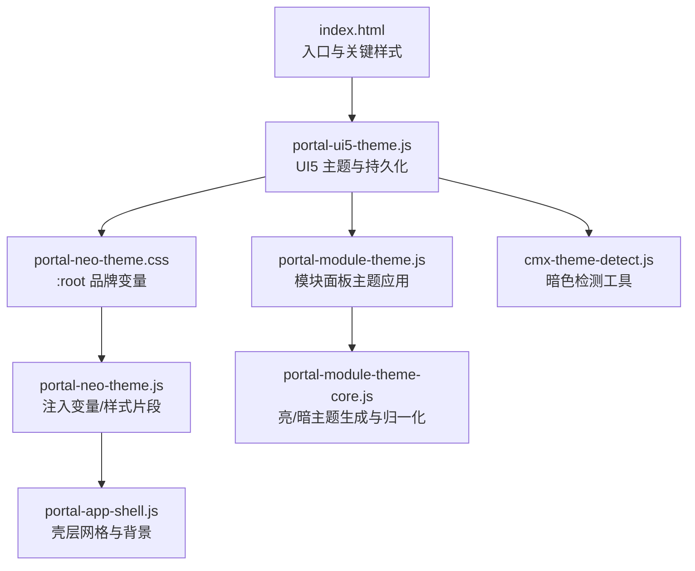
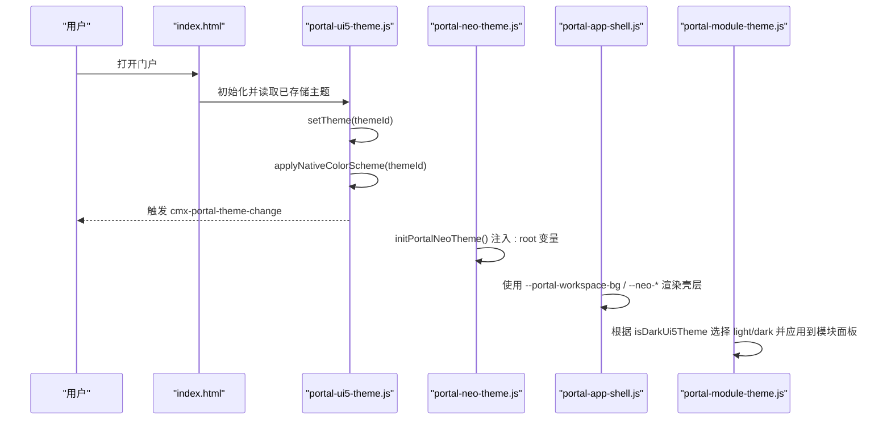
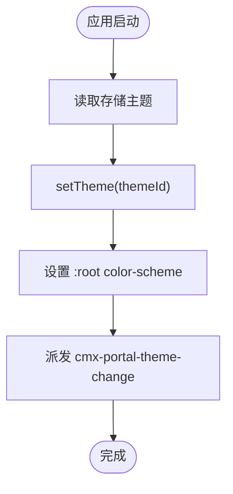
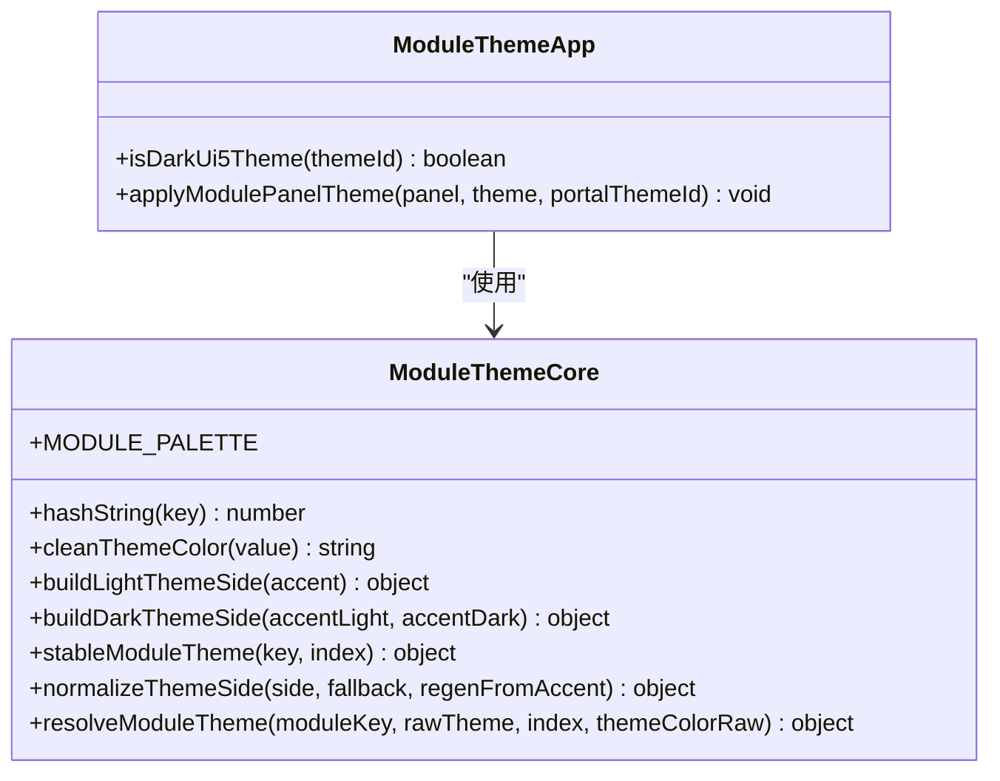
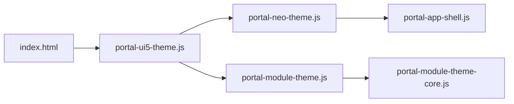

# 主题定制

<cite>
**本文引用的文件**
- [portal-neo-theme.css](file://CMXPortalManager/src/lib/portal-neo-theme.css)
- [portal-neo-theme.js](file://CMXPortalManager/src/lib/portal-neo-theme.js)
- [portal-ui5-theme.js](file://CMXPortalManager/src/lib/portal-ui5-theme.js)
- [portal-module-theme-core.js](file://CMXPortalManager/src/lib/portal-module-theme-core.js)
- [portal-module-theme.js](file://CMXPortalManager/src/lib/portal-module-theme.js)
- [cmx-theme-detect.js](file://packages/cmx-data-comp/src/lib/cmx-theme-detect.js)
- [portal-app-shell.js](file://CMXPortalManager/src/components/portal-app-shell.js)
- [index.html](file://CMXPortalManager/index.html)
- [login.html](file://CMXPortalManager/login.html)
- [page-style-guide.md](file://.agents/skills/cmx-components-guide/references/page-style-guide.md)
</cite>

## 目录
1. [简介](#简介)
2. [项目结构](#项目结构)
3. [核心组件](#核心组件)
4. [架构总览](#架构总览)
5. [详细组件分析](#详细组件分析)
6. [依赖关系分析](#依赖关系分析)
7. [性能考量](#性能考量)
8. [故障排查指南](#故障排查指南)
9. [结论](#结论)
10. [附录](#附录)

## 简介
本文件面向在 CMX 平台进行主题定制与品牌化落地的工程师与设计师，系统性说明：
- 主题架构：CSS 变量系统、UI5 主题集成、模块级主题与动态切换机制。
- 定制方法：颜色方案、字体设置、布局调整与响应式策略。
- 企业级实践：多环境部署、版本管理与调试技巧。
- 最佳实践：如何安全覆盖组件样式、避免闪烁、保证可访问性与一致性。

## 项目结构
CMX 门户的主题体系由三层构成：
- UI5 主题层：通过 portal-ui5-theme.js 管理 UI5 主题（Horizon/Quartz 等）与亮/暗模式，持久化并驱动原生控件的 color-scheme。
- Neo 品牌层：portal-neo-theme.css/js 提供品牌 token（--neo-*）、全局渐变、滚动条、ShellBar、侧边栏、状态栏等统一视觉。
- 模块主题层：portal-module-theme-core.js + portal-module-theme.js 为各模块生成稳定配色，随 UI5 亮/暗自动切换。

图表来源
- [index.html:1-42](file://CMXPortalManager/index.html#L1-L42)
- [portal-ui5-theme.js:1-73](file://CMXPortalManager/src/lib/portal-ui5-theme.js#L1-L73)
- [portal-neo-theme.css:1-59](file://CMXPortalManager/src/lib/portal-neo-theme.css#L1-L59)
- [portal-neo-theme.js:1-636](file://CMXPortalManager/src/lib/portal-neo-theme.js#L1-L636)
- [portal-app-shell.js:1-200](file://CMXPortalManager/src/components/portal-app-shell.js#L1-L200)
- [portal-module-theme.js:1-76](file://CMXPortalManager/src/lib/portal-module-theme.js#L1-L76)
- [portal-module-theme-core.js:1-113](file://CMXPortalManager/src/lib/portal-module-theme-core.js#L1-L113)
- [cmx-theme-detect.js:1-31](file://packages/cmx-data-comp/src/lib/cmx-theme-detect.js#L1-L31)

章节来源
- [index.html:1-42](file://CMXPortalManager/index.html#L1-L42)
- [portal-ui5-theme.js:1-73](file://CMXPortalManager/src/lib/portal-ui5-theme.js#L1-L73)
- [portal-neo-theme.css:1-59](file://CMXPortalManager/src/lib/portal-neo-theme.css#L1-L59)
- [portal-neo-theme.js:1-636](file://CMXPortalManager/src/lib/portal-neo-theme.js#L1-L636)
- [portal-app-shell.js:1-200](file://CMXPortalManager/src/components/portal-app-shell.js#L1-L200)
- [portal-module-theme.js:1-76](file://CMXPortalManager/src/lib/portal-module-theme.js#L1-L76)
- [portal-module-theme-core.js:1-113](file://CMXPortalManager/src/lib/portal-module-theme-core.js#L1-L113)
- [cmx-theme-detect.js:1-31](file://packages/cmx-data-comp/src/lib/cmx-theme-detect.js#L1-L31)

## 核心组件
- UI5 主题管理：维护主题列表、默认主题、持久化 key，切换时同步 :root 的 color-scheme，触发主题变更事件。
- Neo 品牌变量与样式：定义 --neo-* 系列 token，提供 ShellBar、侧边栏、滚动条、状态栏等统一样式片段，支持 Shadow DOM 注入。
- 模块主题引擎：按模块 key 稳定生成亮/暗两套配色，归一化输入并派生 header/content/border/accent。
- 暗色检测：基于 --sapBackgroundColor 计算相对亮度，回退系统偏好，供组件自适应。

章节来源
- [portal-ui5-theme.js:1-73](file://CMXPortalManager/src/lib/portal-ui5-theme.js#L1-L73)
- [portal-neo-theme.css:1-59](file://CMXPortalManager/src/lib/portal-neo-theme.css#L1-L59)
- [portal-neo-theme.js:1-636](file://CMXPortalManager/src/lib/portal-neo-theme.js#L1-L636)
- [portal-module-theme-core.js:1-113](file://CMXPortalManager/src/lib/portal-module-theme-core.js#L1-L113)
- [portal-module-theme.js:1-76](file://CMXPortalManager/src/lib/portal-module-theme.js#L1-L76)
- [cmx-theme-detect.js:1-31](file://packages/cmx-data-comp/src/lib/cmx-theme-detect.js#L1-L31)

## 架构总览
主题切换与控制流如下：

图表来源
- [portal-ui5-theme.js:22-73](file://CMXPortalManager/src/lib/portal-ui5-theme.js#L22-L73)
- [portal-neo-theme.js:626-636](file://CMXPortalManager/src/lib/portal-neo-theme.js#L626-L636)
- [portal-app-shell.js:1-200](file://CMXPortalManager/src/components/portal-app-shell.js#L1-L200)
- [portal-module-theme.js:24-76](file://CMXPortalManager/src/lib/portal-module-theme.js#L24-L76)

## 详细组件分析

### CSS 变量系统与品牌 Token
- 根变量：portal-neo-theme.css 在 :root 定义 --neo-cyan/violet/mint/warn/accent/glass/border/glow 等，并通过 color-mix 与 --sap* 组合实现亮/暗自适应。
- 运行时注入：portal-neo-theme.js 提供 PORTAL_NEO_ROOT_VARS 字符串，initPortalNeoTheme 将其以 <style id="portal-neo-root-vars"> 注入 document.head，确保 Shadow DOM 继承。
- 业务页引用：业务页面可直接使用 --neo-* 与 --sap*，无需重复定义；遵循 page-style-guide 中“全部色值走 CSS 变量”的原则。

章节来源
- [portal-neo-theme.css:1-59](file://CMXPortalManager/src/lib/portal-neo-theme.css#L1-L59)
- [portal-neo-theme.js:1-636](file://CMXPortalManager/src/lib/portal-neo-theme.js#L1-L636)
- [page-style-guide.md:54-86](file://.agents/skills/cmx-components-guide/references/page-style-guide.md#L54-L86)
- [page-style-guide.md:238-270](file://.agents/skills/cmx-components-guide/references/page-style-guide.md#L238-L270)

### UI5 主题与动态切换
- 主题列表与默认值：PORTAL_THEMES 包含 Horizon/Quartz 的亮/暗/高对比选项，默认 sap_horizon_dark。
- 切换流程：applyPortalUi5Theme 调用 ensureCmxUi5Runtime().setTheme，写入 sessionStorage，设置 :root 的 color-scheme，并派发 cmx-portal-theme-change。
- 首次加载：initPortalUi5Theme 读取存储主题并立即应用，避免首帧闪烁；index.html 内联关键样式与预配置，确保 UI5 初始配置读取到正确主题。

图表来源
- [portal-ui5-theme.js:22-73](file://CMXPortalManager/src/lib/portal-ui5-theme.js#L22-L73)
- [index.html:1-42](file://CMXPortalManager/index.html#L1-L42)

章节来源
- [portal-ui5-theme.js:1-73](file://CMXPortalManager/src/lib/portal-ui5-theme.js#L1-L73)
- [index.html:1-42](file://CMXPortalManager/index.html#L1-L42)

### 模块主题引擎与面板着色
- 稳定配色：stableModuleTheme 基于模块 key 哈希从 MODULE_PALETTE 选取亮/暗 accent 对。
- 归一化与派生：normalizeThemeSide 接受 raw.light/raw.dark 或扁平对象，cleanThemeColor 校验颜色格式，buildLightThemeSide/buildDarkThemeSide 派生 headerBg/headerText/contentBg/border。
- 应用方式：applyModulePanelTheme 根据 isDarkUi5Theme 选择 side，并将 accent/headerBg/contentBg/border 映射为 --module-* 与若干 --sap* 变量，挂载到面板元素上。

图表来源
- [portal-module-theme-core.js:1-113](file://CMXPortalManager/src/lib/portal-module-theme-core.js#L1-L113)
- [portal-module-theme.js:1-76](file://CMXPortalManager/src/lib/portal-module-theme.js#L1-L76)

章节来源
- [portal-module-theme-core.js:1-113](file://CMXPortalManager/src/lib/portal-module-theme-core.js#L1-L113)
- [portal-module-theme.js:1-76](file://CMXPortalManager/src/lib/portal-module-theme.js#L1-L76)

### 暗色检测与组件自适应
- detectDarkMode 优先读取 --sapBackgroundColor 并计算相对亮度，低于阈值视为暗色；否则回退 prefers-color-scheme。
- 该工具被多个数据组件复用，确保表格/树等在不同主题下保持一致的可读性。

章节来源
- [cmx-theme-detect.js:1-31](file://packages/cmx-data-comp/src/lib/cmx-theme-detect.js#L1-L31)

### 壳层布局与响应式
- portal-app-shell.js 使用三段网格（顶栏/主体/状态栏），主体区域通过 flex/grid 控制侧栏、内容区、日志与属性面板尺寸。
- 背景与网格线：workspace 使用 --portal-workspace-bg 与 neo 网格叠加，增强科技感。
- 登录页响应式：login.html 使用媒体查询适配不同屏幕宽度，隐藏次要信息并调整字号与间距。

章节来源
- [portal-app-shell.js:1-200](file://CMXPortalManager/src/components/portal-app-shell.js#L1-L200)
- [login.html:39-83](file://CMXPortalManager/login.html#L39-L83)
- [login.html:184-298](file://CMXPortalManager/login.html#L184-L298)

## 依赖关系分析
- 入口依赖：index.html 先注入关键样式与 UI5 预配置，再加载 JS 模块。
- 主题链：portal-ui5-theme.js 负责 UI5 主题切换与持久化；portal-neo-theme.js 注入品牌变量与样式片段；portal-app-shell.js 消费这些变量构建壳层。
- 模块主题：portal-module-theme.js 依赖 core 逻辑与 UI5 主题信息，将模块级主题映射为 CSS 变量。

图表来源
- [index.html:1-42](file://CMXPortalManager/index.html#L1-L42)
- [portal-ui5-theme.js:1-73](file://CMXPortalManager/src/lib/portal-ui5-theme.js#L1-L73)
- [portal-neo-theme.js:1-636](file://CMXPortalManager/src/lib/portal-neo-theme.js#L1-L636)
- [portal-app-shell.js:1-200](file://CMXPortalManager/src/components/portal-app-shell.js#L1-L200)
- [portal-module-theme.js:1-76](file://CMXPortalManager/src/lib/portal-module-theme.js#L1-L76)
- [portal-module-theme-core.js:1-113](file://CMXPortalManager/src/lib/portal-module-theme-core.js#L1-L113)

章节来源
- [index.html:1-42](file://CMXPortalManager/index.html#L1-L42)
- [portal-ui5-theme.js:1-73](file://CMXPortalManager/src/lib/portal-ui5-theme.js#L1-L73)
- [portal-neo-theme.js:1-636](file://CMXPortalManager/src/lib/portal-neo-theme.js#L1-L636)
- [portal-app-shell.js:1-200](file://CMXPortalManager/src/components/portal-app-shell.js#L1-L200)
- [portal-module-theme.js:1-76](file://CMXPortalManager/src/lib/portal-module-theme.js#L1-L76)
- [portal-module-theme-core.js:1-113](file://CMXPortalManager/src/lib/portal-module-theme-core.js#L1-L113)

## 性能考量
- 避免首帧闪烁：index.html 提前注入关键样式与 UI5 预配置，portal-ui5-theme.js 在初始化阶段即设置 color-scheme，减少原生控件亮/暗不一致。
- 变量派生优于硬编码：大量使用 color-mix 与 --sap*，切换主题时无需重写规则，降低样式体积与重绘成本。
- Shadow DOM 注入幂等：portal-neo-theme.js 通过 styleId 判断是否已注入，避免重复插入 <style>。
- 滚动条与网格：使用细滚动条与低对比度，减少视觉干扰；网格背景使用透明渐变，避免大图资源。

[本节为通用指导，不直接分析具体文件]

## 故障排查指南
- 主题切换无效或闪烁
  - 检查是否正确调用 applyPortalUi5Theme 并在首次加载调用 initPortalUi5Theme。
  - 确认 index.html 中的预配置与存储键一致，避免 UI5 初始主题与存储不一致。
  - 参考：[portal-ui5-theme.js:22-73](file://CMXPortalManager/src/lib/portal-ui5-theme.js#L22-L73)、[index.html:1-42](file://CMXPortalManager/index.html#L1-L42)
- 品牌变量未生效
  - 确认 initPortalNeoTheme 已执行且 <style id="portal-neo-root-vars"> 存在。
  - 若 Shadow DOM 内未继承，检查是否在宿主或子组件 shadowRoot 中注入对应样式片段。
  - 参考：[portal-neo-theme.js:626-636](file://CMXPortalManager/src/lib/portal-neo-theme.js#L626-L636)
- 模块面板主题异常
  - 检查模块 theme 数据结构是否符合 normalizeThemeSide 预期（light/dark 或扁平字段）。
  - 确认 isDarkUi5Theme 返回值与当前 UI5 主题一致。
  - 参考：[portal-module-theme-core.js:69-112](file://CMXPortalManager/src/lib/portal-module-theme-core.js#L69-L112)、[portal-module-theme.js:24-76](file://CMXPortalManager/src/lib/portal-module-theme.js#L24-L76)
- 暗色检测不准确
  - 确认 --sapBackgroundColor 已被 UI5 正确设置；必要时回退至 prefers-color-scheme。
  - 参考：[cmx-theme-detect.js:9-31](file://packages/cmx-data-comp/src/lib/cmx-theme-detect.js#L9-L31)

章节来源
- [portal-ui5-theme.js:22-73](file://CMXPortalManager/src/lib/portal-ui5-theme.js#L22-L73)
- [index.html:1-42](file://CMXPortalManager/index.html#L1-L42)
- [portal-neo-theme.js:626-636](file://CMXPortalManager/src/lib/portal-neo-theme.js#L626-L636)
- [portal-module-theme-core.js:69-112](file://CMXPortalManager/src/lib/portal-module-theme-core.js#L69-L112)
- [portal-module-theme.js:24-76](file://CMXPortalManager/src/lib/portal-module-theme.js#L24-L76)
- [cmx-theme-detect.js:9-31](file://packages/cmx-data-comp/src/lib/cmx-theme-detect.js#L9-L31)

## 结论
CMX 平台的主题体系以 UI5 主题为基座，通过 Neo 品牌变量与模块主题引擎实现企业级可定制与品牌化落地。推荐实践包括：
- 所有色值走 CSS 变量，优先使用 --sap* 与 --neo*，避免硬编码。
- 通过 portal-ui5-theme.js 统一管理主题切换与持久化，确保原生控件与 UI5 主题一致。
- 模块主题采用 stableModuleTheme 与 normalizeThemeSide，保证跨模块一致性与可维护性。
- 利用响应式与媒体查询优化多端体验，保持登录页与壳层在不同屏幕下的可用性。

[本节为总结性内容，不直接分析具体文件]

## 附录

### 创建自定义主题步骤
- 定义品牌色：在 portal-neo-theme.css 的 :root 中调整 --neo-cyan/--neo-violet/--neo-mint 等 token。
- 扩展 UI5 主题：如需新增主题项，扩展 PORTAL_THEMES 并更新默认主题策略。
- 模块主题：为特定模块传入 rawTheme（含 light/dark），由 resolveModuleTheme 归一化并派生。
- 验证：切换主题后检查 ShellBar、侧边栏、状态栏、模块面板与登录页表现。

章节来源
- [portal-neo-theme.css:1-59](file://CMXPortalManager/src/lib/portal-neo-theme.css#L1-L59)
- [portal-ui5-theme.js:11-20](file://CMXPortalManager/src/lib/portal-ui5-theme.js#L11-L20)
- [portal-module-theme-core.js:84-112](file://CMXPortalManager/src/lib/portal-module-theme-core.js#L84-L112)

### 组件样式覆盖与最佳实践
- 优先使用 CSS 变量派生，而非覆盖类名；必要时在 Shadow DOM 内注入样式片段并确保幂等。
- 使用 color-mix 与 --sap* 组合，确保亮/暗主题自动适配。
- 避免过度使用 !important；仅在必要处（如第三方组件私有类名）谨慎使用。
- 参考：[page-style-guide.md:238-270](file://.agents/skills/cmx-components-guide/references/page-style-guide.md#L238-L270)

章节来源
- [page-style-guide.md:238-270](file://.agents/skills/cmx-components-guide/references/page-style-guide.md#L238-L270)

### 多环境部署与版本管理建议
- 环境变量：通过构建期替换品牌主色（--neo-cyan 等）实现多环境差异化。
- 主题配置：将 UI5 主题 ID 与 Neo 品牌 token 纳入配置中心，按环境下发。
- 版本兼容：升级 UI5 组件后回归验证侧边栏与滚动条样式（涉及私有类名）。
- 发布策略：灰度发布主题变更，收集反馈后再全量上线。

[本节为通用指导，不直接分析具体文件]