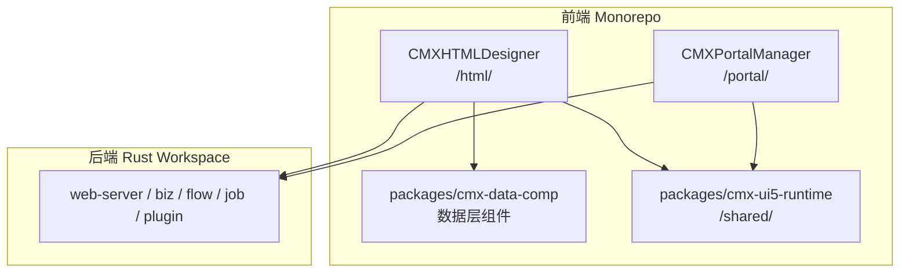
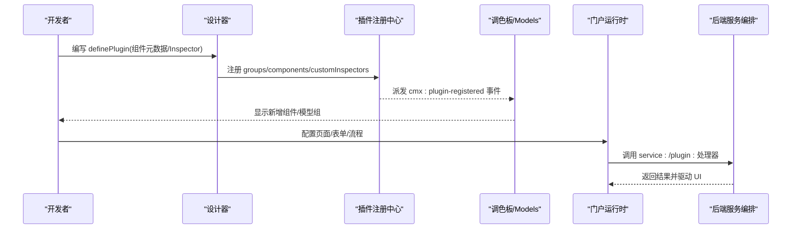
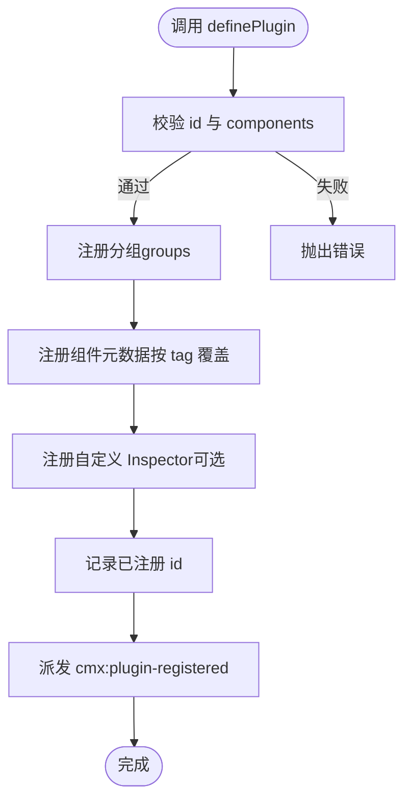
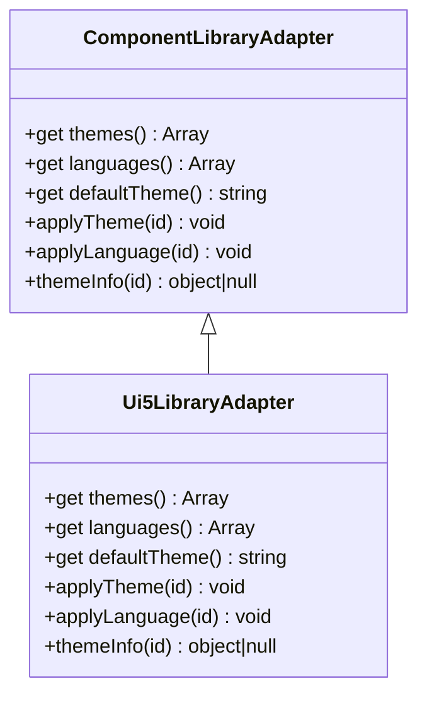
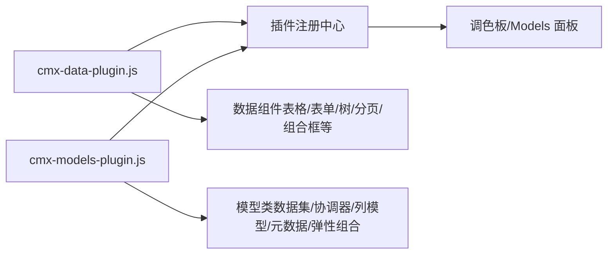
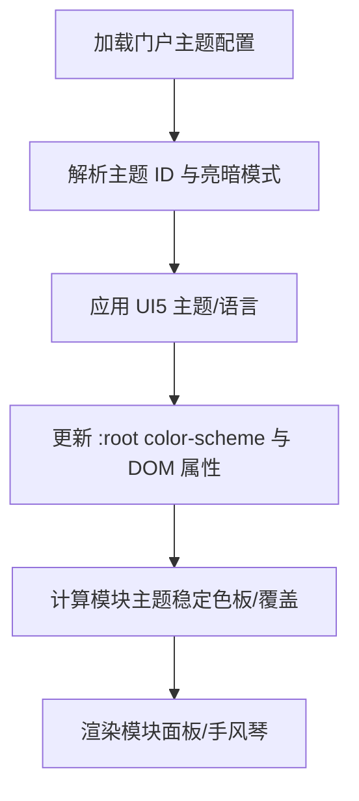
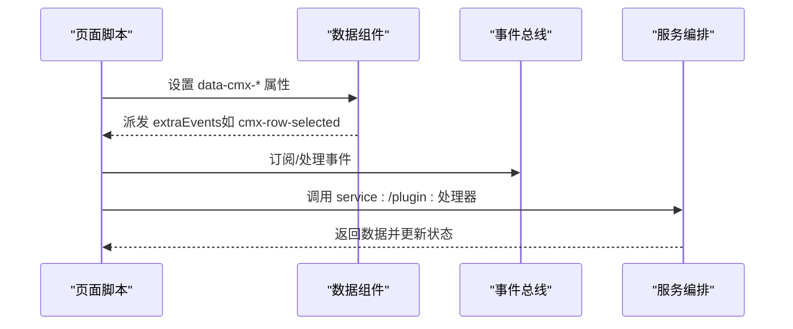
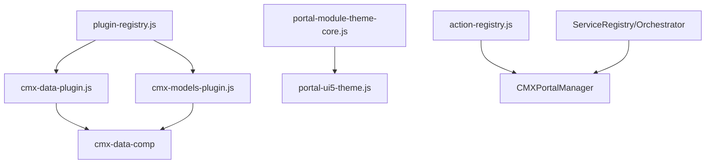

# 扩展开发

<cite>
**本文引用的文件**
- [README.md](file://README.md)
- [plugin-registry.js](file://CMXHTMLDesigner/src/lib/plugin-registry.js)
- [component-library-adapter.js](file://CMXHTMLDesigner/src/lib/component-library-adapter.js)
- [ui5-library-adapter.js](file://CMXHTMLDesigner/src/lib/ui5-library-adapter.js)
- [cmx-data-plugin.js](file://CMXHTMLDesigner/src/plugins/cmx-data-plugin.js)
- [cmx-models-plugin.js](file://CMXHTMLDesigner/src/plugins/cmx-models-plugin.js)
- [portal-module-theme-core.js](file://CMXPortalManager/src/lib/portal-module-theme-core.js)
- [portal-ui5-theme.js](file://CMXPortalManager/src/lib/portal-ui5-theme.js)
- [action-registry.js](file://CMXPortalManager/src/lib/action-registry.js)
- [vitest.config.js（设计器）](file://CMXHTMLDesigner/vitest.config.js)
- [vitest.config.ts（数据组件）](file://packages/cmx-data-comp/vitest.config.js)
- [业务单据数据装载与前端模型映射方案.md](file://docs/业务单据数据装载与前端模型映射方案.md)
</cite>

## 目录
1. [简介](#简介)
2. [项目结构](#项目结构)
3. [核心组件](#核心组件)
4. [架构总览](#架构总览)
5. [详细组件分析](#详细组件分析)
6. [依赖关系分析](#依赖关系分析)
7. [性能考虑](#性能考虑)
8. [故障排查指南](#故障排查指南)
9. [结论](#结论)
10. [附录](#附录)

## 简介
本指南面向希望在 CMX 企业门户平台进行二次开发的工程师，围绕“插件系统、扩展点机制、自定义组件/适配器/服务插件、主题定制、UI 扩展、业务流程定制、第三方系统集成、API 扩展、数据处理扩展、开发与测试、发布流程”等主题，提供从架构到落地的完整说明。内容基于仓库中前端 monorepo 的实际实现，聚焦于：
- 设计器侧的插件注册与扩展点（组件元数据、Inspector 面板、调色板分组）
- 运行时侧的主题与 UI 扩展（UI5 主题、模块主题、动作注册）
- 后端扩展点与服务编排（ServiceRegistry、WASM 插件调用）
- 测试与发布实践

## 项目结构
CMX 前端为 npm workspace monorepo，包含门户运行时、可视化设计器、数据层 Web Components 与共享 UI5 运行时。后端 Rust 工作区提供元数据驱动的存储与服务、流程引擎、异步任务中心与插件体系。

**图表来源**
- [README.md:45-55](file://README.md#L45-L55)

**章节来源**
- [README.md:1-73](file://README.md#L1-L73)

## 核心组件
- 插件注册中心：负责动态注册组件元数据、分组、自定义 Inspector，并在注册完成后派发事件以刷新设计器 UI。
- 组件库适配层：抽象 UI 组件库（如 SAP UI5）的主题与语言切换能力，便于替换或扩展。
- 内置插件：将数据组件与模型类暴露给设计器调色板与 Models 面板。
- 主题系统：门户与模块级主题解析、持久化与亮暗模式适配。
- 动作注册：在门户运行时统一注册可复用动作与上下文。

**章节来源**
- [plugin-registry.js:1-95](file://CMXHTMLDesigner/src/lib/plugin-registry.js#L1-L95)
- [component-library-adapter.js:1-39](file://CMXHTMLDesigner/src/lib/component-library-adapter.js#L1-L39)
- [ui5-library-adapter.js:1-40](file://CMXHTMLDesigner/src/lib/ui5-library-adapter.js#L1-L40)
- [cmx-data-plugin.js:1-747](file://CMXHTMLDesigner/src/plugins/cmx-data-plugin.js#L1-L747)
- [cmx-models-plugin.js:1-118](file://CMXHTMLDesigner/src/plugins/cmx-models-plugin.js#L1-L118)
- [portal-module-theme-core.js:1-113](file://CMXPortalManager/src/lib/portal-module-theme-core.js#L1-L113)
- [portal-ui5-theme.js:1-29](file://CMXPortalManager/src/lib/portal-ui5-theme.js#L1-L29)
- [action-registry.js:510-530](file://CMXPortalManager/src/lib/action-registry.js#L510-L530)

## 架构总览
CMX 的扩展体系分为三层：
- 设计器扩展层：通过 definePlugin 注册组件元数据与自定义 Inspector，扩展调色板与属性面板。
- 运行时扩展层：通过主题适配、动作注册、服务编排与 WASM 插件调用扩展业务行为。
- 后端扩展层：通过 ServiceRegistry 与 Orchestrator 将 service:/plugin:/formula:/builtin: 等处理器路由到具体执行器。

**图表来源**
- [plugin-registry.js:60-89](file://CMXHTMLDesigner/src/lib/plugin-registry.js#L60-L89)
- [业务单据数据装载与前端模型映射方案.md:1229-1237](file://docs/业务单据数据装载与前端模型映射方案.md#L1229-L1237)

## 详细组件分析

### 插件注册中心（definePlugin）
- 职责：校验插件对象、注册分组与组件元数据、注册自定义 Inspector、去重与 HMR 支持、派发注册完成事件。
- 关键约定：
  - 插件对象需包含 id 与 components；components 中的 tag 用于唯一标识组件。
  - customInspectors 允许为特定 tag 提供属性面板渲染函数，参数包含 node、meta、mount、pageData、onChange。
  - 注册成功后派发 window 事件 cmx:plugin-registered，供左侧面板监听并刷新。
- 复杂度：注册过程为 O(n)（n 为组件数量），重复注册按 tag 覆盖，避免冲突。

**图表来源**
- [plugin-registry.js:60-89](file://CMXHTMLDesigner/src/lib/plugin-registry.js#L60-L89)

**章节来源**
- [plugin-registry.js:1-95](file://CMXHTMLDesigner/src/lib/plugin-registry.js#L1-L95)

### 组件库适配层（ComponentLibraryAdapter）
- 职责：抽象 UI 组件库的主题与语言切换能力，屏蔽底层实现差异。
- 接口约定：themes、languages、defaultTheme、applyTheme、applyLanguage、themeInfo。
- 当前实现：Ui5LibraryAdapter 对接 cmx-ui5-runtime，提供主题列表、默认主题、应用主题与语言、查询主题信息。

**图表来源**
- [component-library-adapter.js:1-39](file://CMXHTMLDesigner/src/lib/component-library-adapter.js#L1-L39)
- [ui5-library-adapter.js:1-40](file://CMXHTMLDesigner/src/lib/ui5-library-adapter.js#L1-L40)

**章节来源**
- [component-library-adapter.js:1-39](file://CMXHTMLDesigner/src/lib/component-library-adapter.js#L1-L39)
- [ui5-library-adapter.js:1-40](file://CMXHTMLDesigner/src/lib/ui5-library-adapter.js#L1-L40)

### 内置插件：数据组件与模型
- 数据组件插件：将表格、表单、树视图、分页、组合框等组件注册到设计器调色板，声明 attrs、extraEvents、defaults、styleGroups，并提供复杂属性的自定义 Inspector。
- 模型插件：将数据集、主从协调器、列模型、字典/单据元数据、弹性组合等不可视模型类注册到 Models 面板，同时暴露全局引用以便脚本与调试控制台使用。

**图表来源**
- [cmx-data-plugin.js:1-747](file://CMXHTMLDesigner/src/plugins/cmx-data-plugin.js#L1-L747)
- [cmx-models-plugin.js:1-118](file://CMXHTMLDesigner/src/plugins/cmx-models-plugin.js#L1-L118)
- [plugin-registry.js:60-89](file://CMXHTMLDesigner/src/lib/plugin-registry.js#L60-L89)

**章节来源**
- [cmx-data-plugin.js:1-747](file://CMXHTMLDesigner/src/plugins/cmx-data-plugin.js#L1-L747)
- [cmx-models-plugin.js:1-113](file://CMXHTMLDesigner/src/plugins/cmx-models-plugin.js#L1-L113)

### 主题定制与 UI 扩展
- 门户主题：定义可用主题列表、默认主题、持久化键与亮暗判断逻辑，驱动 UI5 运行时切换主题与浏览器原生控件样式。
- 模块主题：基于稳定色板与哈希算法为不同模块生成一致的 accent 色，支持亮/暗两套配色，并可由外部 rawTheme 覆盖。
- UI 扩展：通过动作注册表（ActionRegistry）在宿主与工作区级注册动作，结合 workspaceContext 与额外辅助方法扩展交互。

**图表来源**
- [portal-ui5-theme.js:1-29](file://CMXPortalManager/src/lib/portal-ui5-theme.js#L1-L29)
- [portal-module-theme-core.js:1-113](file://CMXPortalManager/src/lib/portal-module-theme-core.js#L1-L113)

**章节来源**
- [portal-ui5-theme.js:1-29](file://CMXPortalManager/src/lib/portal-ui5-theme.js#L1-L29)
- [portal-module-theme-core.js:1-113](file://CMXPortalManager/src/lib/portal-module-theme-core.js#L1-L113)
- [action-registry.js:510-530](file://CMXPortalManager/src/lib/action-registry.js#L510-L530)

### 业务流程定制与事件处理
- 事件总线：设计器侧通过自定义事件（如 cmx:plugin-registered）解耦插件注册与 UI 刷新；组件层面通过 extraEvents 声明事件，便于页面脚本订阅。
- 服务编排：后端通过 ServiceRegistry 与 Orchestrator 将 service:/plugin:/formula:/builtin: 前缀路由到对应执行器，形成可扩展的业务钩子。
- 生命周期：插件注册阶段完成元数据注入；运行期通过 pageInterfaces/pageFns 读取 data-cmx-* 属性并调用组件 API；后端通过 handler 解析分发器触发插件或服务。

**图表来源**
- [cmx-data-plugin.js:50-747](file://CMXHTMLDesigner/src/plugins/cmx-data-plugin.js#L50-L747)
- [业务单据数据装载与前端模型映射方案.md:1229-1237](file://docs/业务单据数据装载与前端模型映射方案.md#L1229-L1237)

**章节来源**
- [cmx-data-plugin.js:50-747](file://CMXHTMLDesigner/src/plugins/cmx-data-plugin.js#L50-L747)
- [业务单据数据装载与前端模型映射方案.md:1229-1237](file://docs/业务单据数据装载与前端模型映射方案.md#L1229-L1237)

### 第三方系统集成、API 扩展与数据处理扩展
- 第三方集成：通过服务编排将外部服务封装为 service_key，前端通过统一入口调用；WASM 插件作为沙箱逻辑被调用。
- API 扩展：handler 解析分发器根据前缀路由到 service:/plugin:/formula:/builtin: 执行器，无需修改核心调用核。
- 数据处理扩展：利用 CmxDataSet、CmxMasterSlave、CmxColumnModel 等模型在页面层组装数据流；通过 createPageServiceDataSource 接入远端数据源。

**章节来源**
- [业务单据数据装载与前端模型映射方案.md:1229-1237](file://docs/业务单据数据装载与前端模型映射方案.md#L1229-L1237)
- [cmx-models-plugin.js:1-118](file://CMXHTMLDesigner/src/plugins/cmx-models-plugin.js#L1-L118)

### 开发示例与最佳实践
- 自定义组件插件：
  - 在 definePlugin 中声明 tag、group、attrs、extraEvents、defaults、styleGroups。
  - 如需复杂属性编辑，提供 customInspectors 渲染函数，使用 mount 节点挂载自定义面板，并通过 onChange 触发脏标记。
- 自定义模型插件：
  - 将不可视模型类注册到 Models 面板，modelOnly 设为 true，isVoid 设为 true。
  - 暴露全局引用以便脚本与调试控制台使用。
- 主题定制：
  - 通过 portal-ui5-theme 与 portal-module-theme-core 配置主题列表、默认主题与模块主题。
  - 使用 stableModuleTheme 与 resolveModuleTheme 生成一致且可覆盖的配色。
- 动作扩展：
  - 使用 createWorkspaceActionRegistry 或 createHostActionRegistry 注册动作，注入 workspaceCtx 与额外辅助方法。

**章节来源**
- [cmx-data-plugin.js:46-747](file://CMXHTMLDesigner/src/plugins/cmx-data-plugin.js#L46-L747)
- [cmx-models-plugin.js:39-118](file://CMXHTMLDesigner/src/plugins/cmx-models-plugin.js#L39-L118)
- [portal-ui5-theme.js:1-29](file://CMXPortalManager/src/lib/portal-ui5-theme.js#L1-L29)
- [portal-module-theme-core.js:1-113](file://CMXPortalManager/src/lib/portal-module-theme-core.js#L1-L113)
- [action-registry.js:510-530](file://CMXPortalManager/src/lib/action-registry.js#L510-L530)

## 依赖关系分析
- 设计器插件依赖：
  - plugin-registry 提供 definePlugin 与 getCustomInspector。
  - 数据组件插件依赖 cmx-data-comp 提供的组件与内置字段类型。
  - 模型插件依赖 cmx-data-comp 提供的模型类与初始化函数。
- 运行时主题依赖：
  - portal-ui5-theme 与 portal-module-theme-core 提供主题解析与持久化。
  - 动作注册依赖 ActionRegistry 与 workspaceContext。
- 后端扩展依赖：
  - ServiceRegistry 与 Orchestrator 提供服务编排与插件调用。

**图表来源**
- [plugin-registry.js:1-95](file://CMXHTMLDesigner/src/lib/plugin-registry.js#L1-L95)
- [cmx-data-plugin.js:1-747](file://CMXHTMLDesigner/src/plugins/cmx-data-plugin.js#L1-L747)
- [cmx-models-plugin.js:1-118](file://CMXHTMLDesigner/src/plugins/cmx-models-plugin.js#L1-L118)
- [portal-module-theme-core.js:1-113](file://CMXPortalManager/src/lib/portal-module-theme-core.js#L1-L113)
- [portal-ui5-theme.js:1-29](file://CMXPortalManager/src/lib/portal-ui5-theme.js#L1-L29)
- [action-registry.js:510-530](file://CMXPortalManager/src/lib/action-registry.js#L510-L530)

**章节来源**
- [plugin-registry.js:1-95](file://CMXHTMLDesigner/src/lib/plugin-registry.js#L1-L95)
- [cmx-data-plugin.js:1-747](file://CMXHTMLDesigner/src/plugins/cmx-data-plugin.js#L1-L747)
- [cmx-models-plugin.js:1-118](file://CMXHTMLDesigner/src/plugins/cmx-models-plugin.js#L1-L118)
- [portal-module-theme-core.js:1-113](file://CMXPortalManager/src/lib/portal-module-theme-core.js#L1-L113)
- [portal-ui5-theme.js:1-29](file://CMXPortalManager/src/lib/portal-ui5-theme.js#L1-L29)
- [action-registry.js:510-530](file://CMXPortalManager/src/lib/action-registry.js#L510-L530)

## 性能考虑
- 插件注册：按 tag 覆盖元数据，避免重复注册开销；HMR 场景下支持重新注册以提升开发体验。
- 主题切换：通过 UI5 运行时集中管理主题与语言，减少 DOM 操作次数；模块主题使用稳定色板与哈希算法，降低计算成本。
- 数据组件：虚拟滚动、懒加载与增量 changeset 提升大数据量下的渲染性能；分页与筛选减少首屏压力。
- 服务编排：通过 ServiceRegistry 缓存 service_key 与 plugin_id 映射，减少查找开销。

[本节为通用指导，不直接分析具体文件]

## 故障排查指南
- 插件未显示：
  - 检查 definePlugin 是否传入有效 id 与 components；确认 groups 与 tag 正确。
  - 监听 cmx:plugin-registered 事件，确认注册成功。
- 自定义 Inspector 不生效：
  - 确保 customInspectors 中 tag 与组件 tag 一致；mount 节点需清空后挂载自定义 DOM。
  - 调用 onChange 触发 dirty 标记，确保属性变更持久化。
- 主题切换无效：
  - 确认 portal-ui5-theme 中 themeId 与 PORTAL_THEMES 匹配；检查 applyTheme 是否正确调用。
  - 模块主题需通过 resolveModuleTheme 计算并覆盖 rawTheme。
- 动作未注册：
  - 使用 createWorkspaceActionRegistry 或 createHostActionRegistry 创建注册表；注入 workspaceCtx 与 helpers。

**章节来源**
- [plugin-registry.js:60-94](file://CMXHTMLDesigner/src/lib/plugin-registry.js#L60-L94)
- [ui5-library-adapter.js:25-39](file://CMXHTMLDesigner/src/lib/ui5-library-adapter.js#L25-L39)
- [portal-ui5-theme.js:1-29](file://CMXPortalManager/src/lib/portal-ui5-theme.js#L1-L29)
- [action-registry.js:510-530](file://CMXPortalManager/src/lib/action-registry.js#L510-L530)

## 结论
CMX 企业门户平台的扩展体系以“插件注册中心 + 组件库适配层 + 主题系统 + 服务编排”为核心，提供从设计器到运行时的完整扩展能力。通过 definePlugin 与 ServiceRegistry，开发者可以灵活扩展 UI、业务逻辑与数据处理流程；通过主题系统与动作注册，可实现品牌化与交互增强。结合 Vitest 测试框架与模块化构建，可保障扩展的稳定性和可维护性。

[本节为总结，不直接分析具体文件]

## 附录

### 测试方法与工具
- 设计器测试：使用 jsdom 环境运行单元测试，覆盖率统计与阈值配置。
- 数据组件测试：使用 node 环境运行纯逻辑测试，必要时在文件顶部指定 jsdom 环境。
- 推荐实践：为插件注册、主题解析、动作注册编写单测；对复杂组件属性面板编写集成测试。

**章节来源**
- [vitest.config.js（设计器）:1-14](file://CMXHTMLDesigner/vitest.config.js#L1-L14)
- [vitest.config.ts（数据组件）:1-16](file://packages/cmx-data-comp/vitest.config.js#L1-L16)

### 发布流程建议
- 构建：执行 npm run build 构建各子项目（portal/designer/shared）。
- 测试：执行 npm test 运行 vitest；lint 检查代码质量。
- 部署：前后端一键起、同源托管见后端 README；商业依赖需自备授权。

**章节来源**
- [README.md:28-43](file://README.md#L28-L43)
- [README.md:57-67](file://README.md#L57-L67)