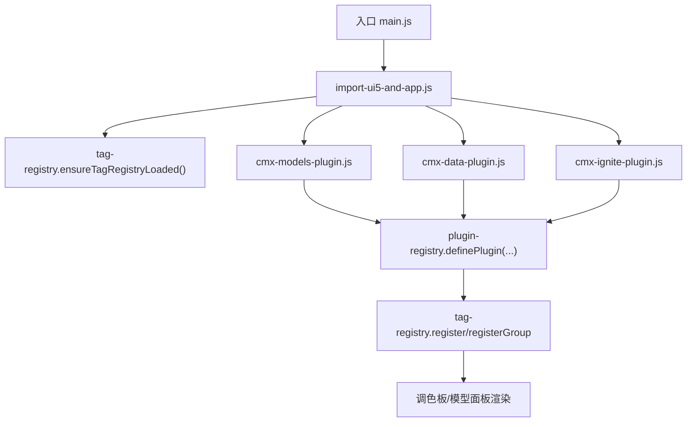
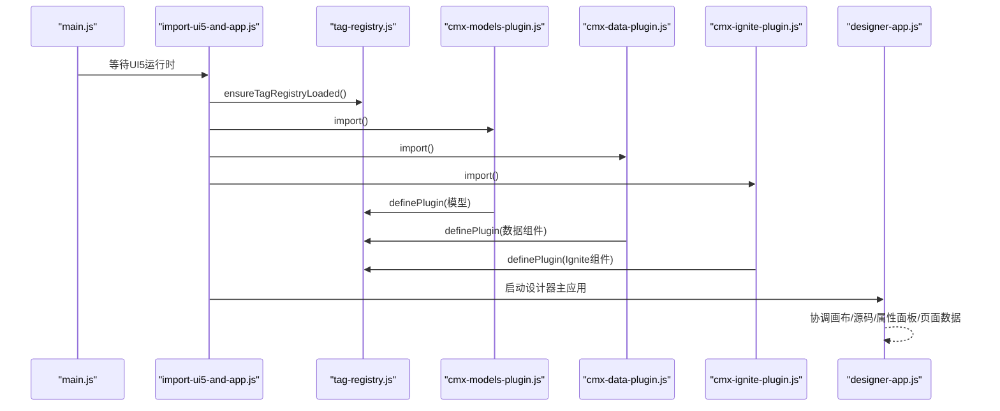
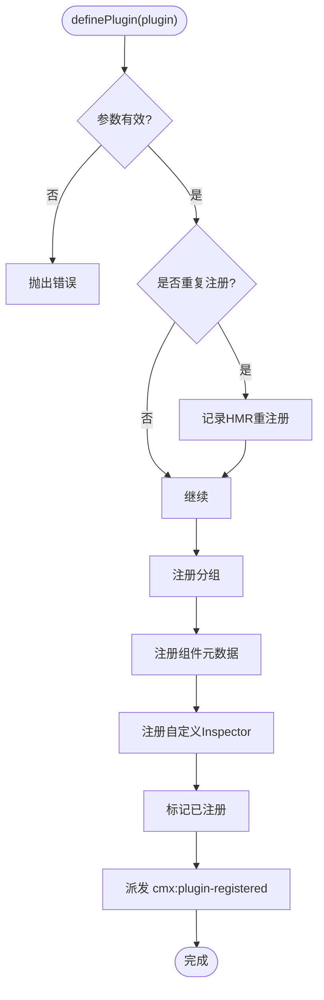
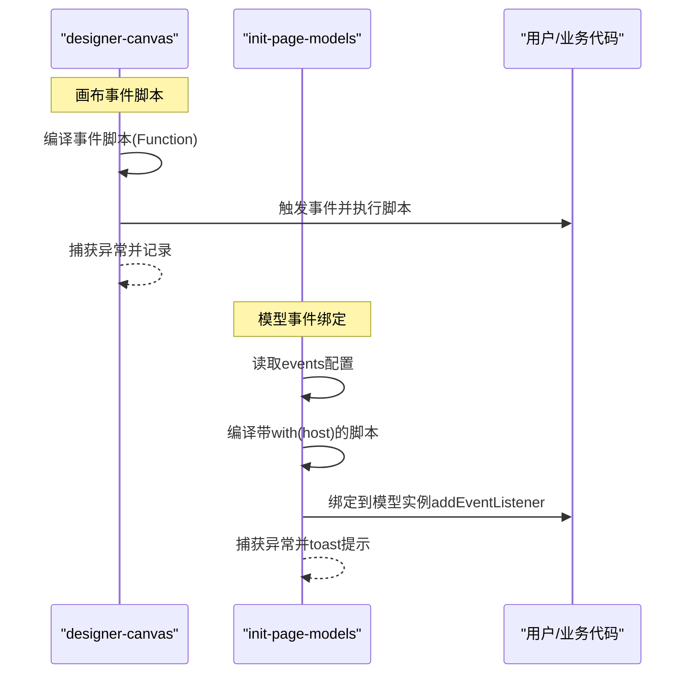
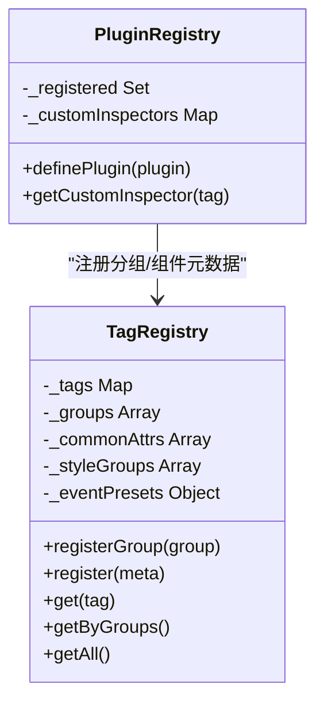
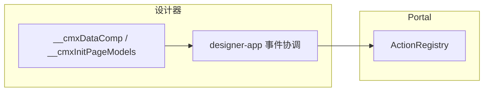
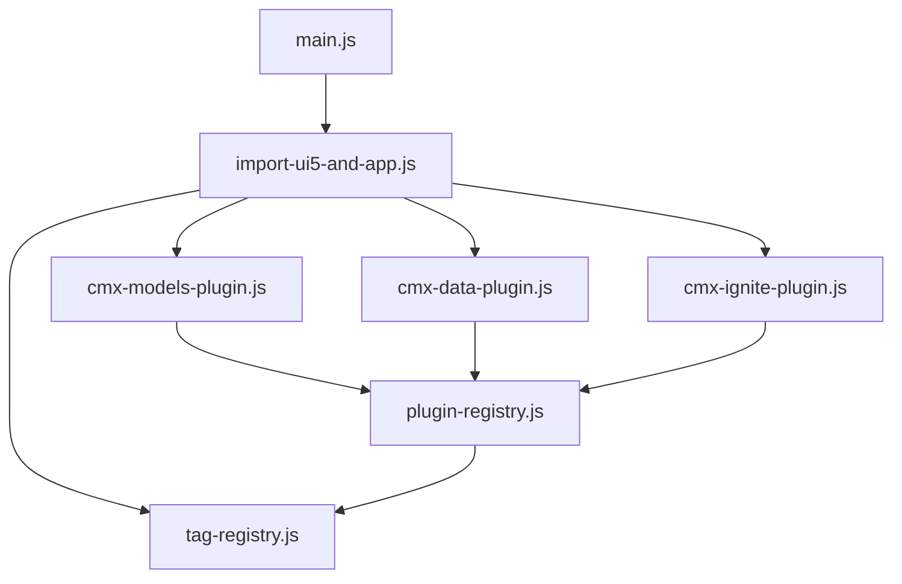

# 插件系统架构

<cite>
**本文引用的文件**
- [plugin-registry.js](file://CMXHTMLDesigner/src/lib/plugin-registry.js)
- [tag-registry.js](file://CMXHTMLDesigner/src/metadata/tag-registry.js)
- [cmx-data-plugin.js](file://CMXHTMLDesigner/src/plugins/cmx-data-plugin.js)
- [cmx-models-plugin.js](file://CMXHTMLDesigner/src/plugins/cmx-models-plugin.js)
- [cmx-ignite-plugin.js](file://CMXHTMLDesigner/src/plugins/cmx-ignite-plugin.js)
- [import-ui5-and-app.js](file://CMXHTMLDesigner/src/import-ui5-and-app.js)
- [main.js](file://CMXHTMLDesigner/src/main.js)
- [designer-app.js](file://CMXHTMLDesigner/src/components/designer-app.js)
- [designer-canvas.js](file://CMXHTMLDesigner/src/components/designer-canvas.js)
- [build-cmx-revo-grid-inspector.js](file://CMXHTMLDesigner/src/plugins/cmx-inspector/build-cmx-revo-grid-inspector.js)
- [init-page-models.js](file://packages/cmx-data-comp/src/lib/init-page-models.js)
- [action-registry.js](file://CMXPortalManager/src/lib/action-registry.js)
</cite>

## 目录
1. [简介](#简介)
2. [项目结构](#项目结构)
3. [核心组件](#核心组件)
4. [架构总览](#架构总览)
5. [详细组件分析](#详细组件分析)
6. [依赖关系分析](#依赖关系分析)
7. [性能考量](#性能考量)
8. [故障排查指南](#故障排查指南)
9. [结论](#结论)
10. [附录](#附录)

## 简介
本文件面向 CMX 企业门户平台的“插件系统”，聚焦设计器侧的插件注册机制、生命周期管理、事件处理与模块通信模式。文档基于仓库中实际代码，解释：
- 插件如何声明式地扩展调色板、模型面板与属性面板（Inspector）
- 插件元数据如何被统一注册表消费
- 运行时事件脚本如何编译执行与调试
- 模型层事件如何绑定与错误隔离
- 如何在 Portal 侧通过 ActionRegistry 实现跨模块的状态共享与联动

## 项目结构
CMX 设计器的插件体系围绕“插件注册中心 + 标签元数据注册表 + 具体插件”三层组织：
- 插件注册中心：提供 definePlugin/getCustomInspector，维护已注册插件集合与自定义 Inspector 映射
- 标签元数据注册表：集中管理组件分组、样式组、事件预设、默认初始化逻辑，并提供 ensureTagRegistryLoaded 异步加载
- 具体插件：按领域拆分（数据组件、模型类、Ignite 组件），每个插件调用 definePlugin 注入自身能力

图表来源
- [main.js:16-23](file://CMXHTMLDesigner/src/main.js#L16-L23)
- [import-ui5-and-app.js:4-11](file://CMXHTMLDesigner/src/import-ui5-and-app.js#L4-L11)
- [tag-registry.js:120-146](file://CMXHTMLDesigner/src/metadata/tag-registry.js#L120-L146)
- [plugin-registry.js:60-89](file://CMXHTMLDesigner/src/lib/plugin-registry.js#L60-L89)

章节来源
- [main.js:16-23](file://CMXHTMLDesigner/src/main.js#L16-L23)
- [import-ui5-and-app.js:4-11](file://CMXHTMLDesigner/src/import-ui5-and-app.js#L4-L11)
- [tag-registry.js:15-55](file://CMXHTMLDesigner/src/metadata/tag-registry.js#L15-L55)
- [plugin-registry.js:45-89](file://CMXHTMLDesigner/src/lib/plugin-registry.js#L45-L89)

## 核心组件
- 插件注册中心（plugin-registry.js）
  - definePlugin：校验参数、注册分组与组件元数据、注册自定义 Inspector、派发 cmx:plugin-registered 事件
  - getCustomInspector：供属性面板根据 tag 获取自定义渲染函数
- 标签元数据注册表（tag-registry.js）
  - registerGroup/register：合并公共属性、样式组、事件预设与默认初始化
  - ensureTagRegistryLoaded：从 dist/metadata 批量拉取并注册所有内置标签元数据
- 领域插件
  - cmx-data-plugin.js：注册数据网格、表单、树、分页、筛选等 UI 组件及 Inspector
  - cmx-models-plugin.js：注册不可视数据模型（DataSet/MasterSlave/ColumnModel/DCT/DOC/FlexibleCombination）
  - cmx-ignite-plugin.js：注册 Ignite/SpreedJS 相关组件

章节来源
- [plugin-registry.js:60-94](file://CMXHTMLDesigner/src/lib/plugin-registry.js#L60-L94)
- [tag-registry.js:24-55](file://CMXHTMLDesigner/src/metadata/tag-registry.js#L24-L55)
- [cmx-data-plugin.js:46-746](file://CMXHTMLDesigner/src/plugins/cmx-data-plugin.js#L46-L746)
- [cmx-models-plugin.js:39-117](file://CMXHTMLDesigner/src/plugins/cmx-models-plugin.js#L39-L117)
- [cmx-ignite-plugin.js:18-124](file://CMXHTMLDesigner/src/plugins/cmx-ignite-plugin.js#L18-L124)

## 架构总览
插件系统的启动顺序与职责边界如下：
- 应用启动后，先确保认证与 UI5 运行时就绪
- 加载标签元数据注册表（ensureTagRegistryLoaded）
- 依次加载各插件，插件内部调用 definePlugin 将自身能力注入注册表
- 设计器主应用 designer-app 协调画布、源码、属性面板、页面数据等子视图
- 画布在预览/运行阶段为事件脚本附加处理器，支持调试断点
- 模型层事件由 init-page-models 动态绑定到模型实例，具备错误隔离与提示

图表来源
- [main.js:16-23](file://CMXHTMLDesigner/src/main.js#L16-L23)
- [import-ui5-and-app.js:4-11](file://CMXHTMLDesigner/src/import-ui5-and-app.js#L4-L11)
- [tag-registry.js:120-146](file://CMXHTMLDesigner/src/metadata/tag-registry.js#L120-L146)
- [cmx-models-plugin.js:39-117](file://CMXHTMLDesigner/src/plugins/cmx-models-plugin.js#L39-L117)
- [cmx-data-plugin.js:46-746](file://CMXHTMLDesigner/src/plugins/cmx-data-plugin.js#L46-L746)
- [cmx-ignite-plugin.js:18-124](file://CMXHTMLDesigner/src/plugins/cmx-ignite-plugin.js#L18-L124)

## 详细组件分析

### 插件注册机制与生命周期
- 插件对象结构
  - id：必填唯一标识
  - groups：可选新增分组定义
  - components：必填组件元数据数组（tag/group/label/description/attrs/styleGroups/eventPreset/extraEvents/defaults 等）
  - customInspectors：可选，{[tag]: renderFn} 用于属性面板定制
- 注册流程
  - 去重保护：同一插件 id 重复注册会走 HMR 覆盖路径
  - 注册分组：registerGroup 对同 id 自动跳过
  - 注册组件：registry.register 按 tag 覆盖已有元数据
  - 注册 Inspector：customInspectors 以 tag 为键存储
  - 派发事件：window.dispatchEvent('cmx:plugin-registered')，供左侧面板刷新调色板
- 生命周期要点
  - 构建期：ensureTagRegistryLoaded 拉取并注册全部内置标签元数据
  - 插件期：各插件 import 时立即调用 definePlugin
  - 运行期：画布/模型事件在运行时动态绑定

图表来源
- [plugin-registry.js:60-89](file://CMXHTMLDesigner/src/lib/plugin-registry.js#L60-L89)
- [tag-registry.js:24-55](file://CMXHTMLDesigner/src/metadata/tag-registry.js#L24-L55)

章节来源
- [plugin-registry.js:60-94](file://CMXHTMLDesigner/src/lib/plugin-registry.js#L60-L94)
- [tag-registry.js:24-55](file://CMXHTMLDesigner/src/metadata/tag-registry.js#L24-L55)

### 事件处理系统与调试
- 画布事件脚本
  - 设计器在画布上为事件绑定 Function，支持 sourceURL 与调试断点
  - 编译失败或运行异常均捕获并输出错误信息
- 模型事件
  - 模型定义中的 events 字段会被解析为字符串脚本
  - 使用 with(host) 上下文执行，支持 debugger; 开关
  - 异常捕获并通过 toast 提示，避免中断其他监听器
- 调试工具
  - 设计器顶栏可切换调试模式，影响事件脚本编译行为
  - 控制台消息可镜像至属性面板日志区

图表来源
- [designer-canvas.js:919-949](file://CMXHTMLDesigner/src/components/designer-canvas.js#L919-L949)
- [init-page-models.js:677-705](file://packages/cmx-data-comp/src/lib/init-page-models.js#L677-L705)
- [designer-app.js:522-530](file://CMXHTMLDesigner/src/components/designer-app.js#L522-L530)

章节来源
- [designer-canvas.js:919-949](file://CMXHTMLDesigner/src/components/designer-canvas.js#L919-L949)
- [init-page-models.js:677-705](file://packages/cmx-data-comp/src/lib/init-page-models.js#L677-L705)
- [designer-app.js:522-530](file://CMXHTMLDesigner/src/components/designer-app.js#L522-L530)

### 插件接口规范与 Inspector 定制
- 组件元数据字段
  - tag/group/label/description/isVoid/canNest/attrs/styleGroups/eventPreset/extraEvents/defaults
- 自定义 Inspector
  - 通过 customInspectors 为特定 tag 提供渲染函数
  - 渲染函数接收 ctx = { node, meta, mount, pageData, onChange }
  - 示例：cmx-revo-grid 的 Inspector 提供 modelId/datasetId/masterSlaveId 选择与 JSON 编辑器
- 序列化与持久化
  - 组件配置通过 data-cmx-* 属性保存
  - attrs 列表同时作为序列化白名单，未声明的属性不会持久化

图表来源
- [plugin-registry.js:45-94](file://CMXHTMLDesigner/src/lib/plugin-registry.js#L45-L94)
- [tag-registry.js:15-79](file://CMXHTMLDesigner/src/metadata/tag-registry.js#L15-L79)
- [build-cmx-revo-grid-inspector.js:20-101](file://CMXHTMLDesigner/src/plugins/cmx-inspector/build-cmx-revo-grid-inspector.js#L20-L101)

章节来源
- [plugin-registry.js:45-94](file://CMXHTMLDesigner/src/lib/plugin-registry.js#L45-L94)
- [tag-registry.js:15-79](file://CMXHTMLDesigner/src/metadata/tag-registry.js#L15-L79)
- [build-cmx-revo-grid-inspector.js:20-101](file://CMXHTMLDesigner/src/plugins/cmx-inspector/build-cmx-revo-grid-inspector.js#L20-L101)

### 依赖注入与模块通信模式
- 设计器侧
  - 通过全局 __cmxDataComp / __cmxInitPageModels 暴露模型类与初始化函数，供调试控制台与运行时使用
  - 设计器主应用通过事件总线（CustomEvent）协调画布、源码、属性面板、页面数据等子视图
- Portal 侧
  - ActionRegistry 提供键空间隔离的状态容器，支持父子 Registry 级联、订阅失效与批量刷新
  - 适合跨模块共享上下文（如 workspace.context）与动作视图更新

图表来源
- [cmx-models-plugin.js:21-37](file://CMXHTMLDesigner/src/plugins/cmx-models-plugin.js#L21-L37)
- [designer-app.js:402-451](file://CMXHTMLDesigner/src/components/designer-app.js#L402-L451)
- [action-registry.js:112-283](file://CMXPortalManager/src/lib/action-registry.js#L112-L283)

章节来源
- [cmx-models-plugin.js:21-37](file://CMXHTMLDesigner/src/plugins/cmx-models-plugin.js#L21-L37)
- [designer-app.js:402-451](file://CMXHTMLDesigner/src/components/designer-app.js#L402-L451)
- [action-registry.js:112-283](file://CMXPortalManager/src/lib/action-registry.js#L112-L283)

### 插件开发框架与配置选项
- 最小插件模板
  - 引入 definePlugin
  - 声明 id、groups、components、customInspectors
  - 通过 attrs 声明可编辑属性，defaults 提供默认值
- 配置选项要点
  - styleGroups 控制可用样式组
  - eventPreset/extraEvents 控制事件集
  - isVoid/canNest 控制元素嵌套与自闭合
  - data-cmx-* 属性约定用于运行时读取配置
- 调试建议
  - 使用 design-mode 开关启用脚本 debugger
  - 利用 cmx:plugin-registered 事件观察插件加载状态

章节来源
- [cmx-data-plugin.js:46-746](file://CMXHTMLDesigner/src/plugins/cmx-data-plugin.js#L46-L746)
- [cmx-ignite-plugin.js:18-124](file://CMXHTMLDesigner/src/plugins/cmx-ignite-plugin.js#L18-L124)
- [designer-app.js:522-530](file://CMXHTMLDesigner/src/components/designer-app.js#L522-L530)

### 完整插件开发示例（方案说明）
- 数据插件（已有实现参考）
  - 数据网格、表单、树、分页、筛选等组件通过 cmx-data-plugin 注册
  - 属性面板通过 buildCmxRevoGridInspector 等定制
- UI 插件（已有实现参考）
  - Ignite/SpreedJS 组件通过 cmx-ignite-plugin 注册
- 业务逻辑插件（推荐模式）
  - 通过 cmx-models-plugin 风格注册不可视模型（例如业务规则引擎、报表模板引擎）
  - 在 models 面板暴露，供页面数据区引用
  - 结合 init-page-models 的事件绑定机制，实现业务事件驱动

章节来源
- [cmx-data-plugin.js:46-746](file://CMXHTMLDesigner/src/plugins/cmx-data-plugin.js#L46-L746)
- [cmx-ignite-plugin.js:18-124](file://CMXHTMLDesigner/src/plugins/cmx-ignite-plugin.js#L18-L124)
- [cmx-models-plugin.js:39-117](file://CMXHTMLDesigner/src/plugins/cmx-models-plugin.js#L39-L117)
- [init-page-models.js:677-705](file://packages/cmx-data-comp/src/lib/init-page-models.js#L677-L705)

### 打包、发布与版本管理（实践建议）
- 打包
  - 插件以独立模块形式存在，按需 import；确保 definePlugin 在模块顶层调用
  - 资源与元数据通过 tag-registry 的 dist/metadata 机制解耦
- 发布
  - 插件包应声明对外 API（definePlugin 入参契约）与依赖（cmx-data-comp、cmx-ui5-runtime）
  - 遵循 data-cmx-* 属性命名约定，保证运行时兼容
- 版本管理
  - 插件 id 作为唯一标识，重复注册支持 HMR 覆盖
  - 组件元数据按 tag 覆盖，便于迭代升级
  - 建议在插件内维护版本号并在 cmx:plugin-registered detail 中上报

章节来源
- [plugin-registry.js:60-89](file://CMXHTMLDesigner/src/lib/plugin-registry.js#L60-L89)
- [tag-registry.js:120-146](file://CMXHTMLDesigner/src/metadata/tag-registry.js#L120-L146)

## 依赖关系分析
- 入口依赖链
  - main.js → import-ui5-and-app.js → tag-registry.ensureTagRegistryLoaded()
  - import-ui5-and-app.js → 依次导入各插件 → 调用 definePlugin
- 插件间耦合
  - 插件之间无直接依赖，均通过注册表解耦
  - 运行时通过全局对象与事件总线进行弱耦合通信
- 外部依赖
  - cmx-data-comp：提供数据组件与模型类
  - cmx-ui5-runtime：提供 UI5 主题与语言切换

图表来源
- [main.js:16-23](file://CMXHTMLDesigner/src/main.js#L16-L23)
- [import-ui5-and-app.js:4-11](file://CMXHTMLDesigner/src/import-ui5-and-app.js#L4-L11)
- [plugin-registry.js:60-89](file://CMXHTMLDesigner/src/lib/plugin-registry.js#L60-L89)
- [tag-registry.js:120-146](file://CMXHTMLDesigner/src/metadata/tag-registry.js#L120-L146)

章节来源
- [main.js:16-23](file://CMXHTMLDesigner/src/main.js#L16-L23)
- [import-ui5-and-app.js:4-11](file://CMXHTMLDesigner/src/import-ui5-and-app.js#L4-L11)
- [plugin-registry.js:60-89](file://CMXHTMLDesigner/src/lib/plugin-registry.js#L60-L89)
- [tag-registry.js:120-146](file://CMXHTMLDesigner/src/metadata/tag-registry.js#L120-L146)

## 性能考量
- 元数据加载
  - ensureTagRegistryLoaded 使用 Promise.all 并行拉取 common-attrs、style-groups、event-presets、tag-index 与 tags/*，减少网络往返
- 插件注册
  - 重复注册走覆盖路径，避免重复计算；分组注册内部有 id 去重
- 画布刷新
  - designer-app 使用 requestAnimationFrame 合并多次变更，降低拖拽与连续编辑时的卡顿
- 事件脚本
  - 编译失败与运行异常均捕获，避免阻塞主线程；调试模式下插入 debugger; 提升定位效率

章节来源
- [tag-registry.js:120-146](file://CMXHTMLDesigner/src/metadata/tag-registry.js#L120-L146)
- [plugin-registry.js:60-89](file://CMXHTMLDesigner/src/lib/plugin-registry.js#L60-L89)
- [designer-app.js:604-618](file://CMXHTMLDesigner/src/components/designer-app.js#L604-L618)
- [designer-canvas.js:919-949](file://CMXHTMLDesigner/src/components/designer-canvas.js#L919-L949)

## 故障排查指南
- 插件未生效
  - 检查 definePlugin 是否被调用且参数合法（id、components）
  - 确认 ensureTagRegistryLoaded 已完成后再加载插件
- 属性面板不显示
  - 检查 customInspectors 是否正确映射到 tag
  - 确认 attrs 声明了需要持久化的属性
- 事件脚本报错
  - 查看浏览器控制台错误信息
  - 开启调试模式，使用 debugger; 定位问题
- 模型事件异常
  - 检查 events 配置是否为有效脚本
  - 关注 toast 提示与 console 错误

章节来源
- [plugin-registry.js:60-89](file://CMXHTMLDesigner/src/lib/plugin-registry.js#L60-L89)
- [designer-canvas.js:919-949](file://CMXHTMLDesigner/src/components/designer-canvas.js#L919-L949)
- [init-page-models.js:677-705](file://packages/cmx-data-comp/src/lib/init-page-models.js#L677-L705)

## 结论
CMX 设计器的插件系统以“注册表 + 插件”为核心，实现了：
- 声明式扩展调色板与模型面板
- 统一的元数据管理与默认初始化
- 灵活的事件脚本与调试能力
- 跨模块的状态共享与联动（Portal 侧 ActionRegistry）
该架构具备良好的可扩展性、可维护性与调试友好性，适合企业级门户的多领域插件生态。

## 附录
- 最佳实践
  - 插件保持单一职责，按领域拆分
  - 使用 data-cmx-* 属性约定，避免与运行时冲突
  - 在插件中暴露必要的调试钩子（如版本号、统计上报）
- 常见陷阱
  - 未在 ensureTagRegistryLoaded 完成后加载插件
  - 未声明 attrs 导致属性无法持久化
  - 事件脚本未做异常捕获导致页面崩溃