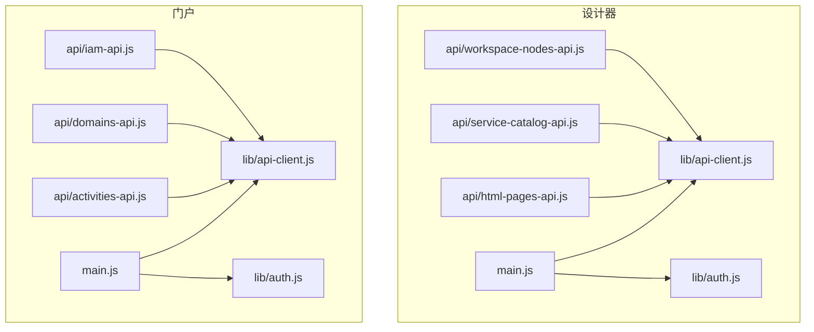
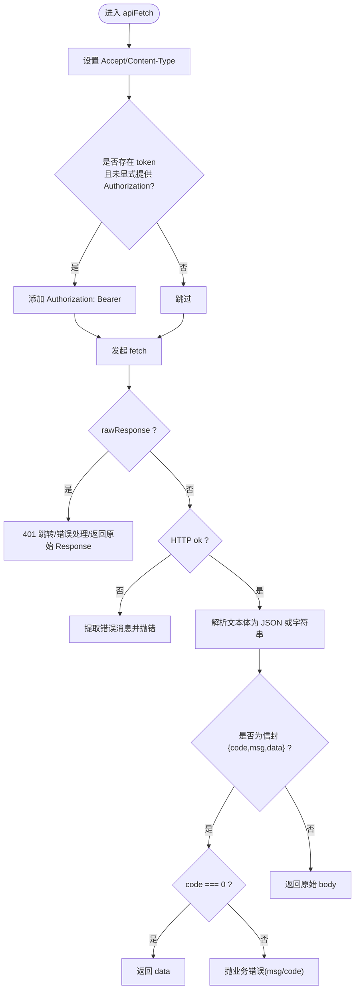
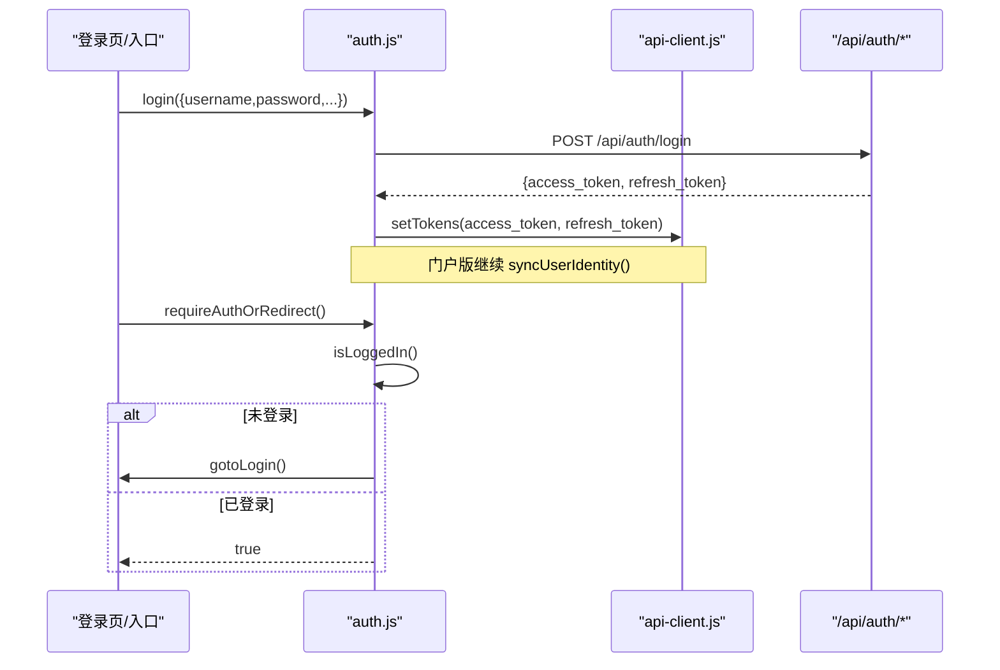
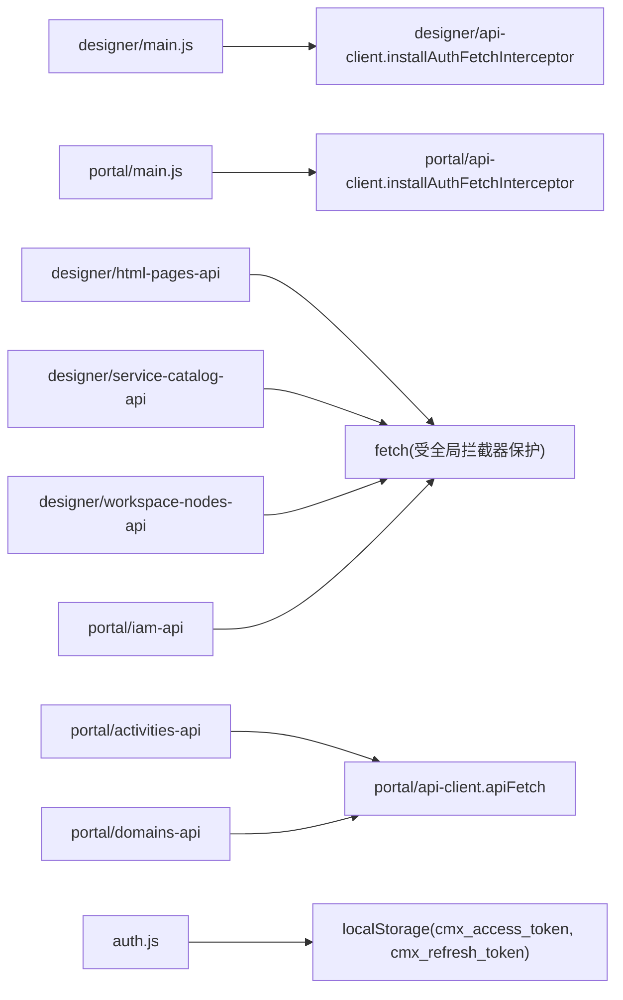

# API 客户端集成

<cite>
**本文引用的文件**
- [CMXHTMLDesigner/src/lib/api-client.js](file://CMXHTMLDesigner/src/lib/api-client.js)
- [CMXPortalManager/src/lib/api-client.js](file://CMXPortalManager/src/lib/api-client.js)
- [CMXHTMLDesigner/src/lib/auth.js](file://CMXHTMLDesigner/src/lib/auth.js)
- [CMXPortalManager/src/lib/auth.js](file://CMXPortalManager/src/lib/auth.js)
- [CMXHTMLDesigner/src/main.js](file://CMXHTMLDesigner/src/main.js)
- [CMXPortalManager/src/main.js](file://CMXPortalManager/src/main.js)
- [CMXHTMLDesigner/src/api/html-pages-api.js](file://CMXHTMLDesigner/src/api/html-pages-api.js)
- [CMXHTMLDesigner/src/api/service-catalog-api.js](file://CMXHTMLDesigner/src/api/service-catalog-api.js)
- [CMXHTMLDesigner/src/api/workspace-nodes-api.js](file://CMXHTMLDesigner/src/api/workspace-nodes-api.js)
- [CMXPortalManager/src/api/activities-api.js](file://CMXPortalManager/src/api/activities-api.js)
- [CMXPortalManager/src/api/domains-api.js](file://CMXPortalManager/src/api/domains-api.js)
- [CMXPortalManager/src/api/iam-api.js](file://CMXPortalManager/src/api/iam-api.js)
</cite>

## 目录
1. [简介](#简介)
2. [项目结构](#项目结构)
3. [核心组件](#核心组件)
4. [架构总览](#架构总览)
5. [详细组件分析](#详细组件分析)
6. [依赖关系分析](#依赖关系分析)
7. [性能与可靠性](#性能与可靠性)
8. [故障排查指南](#故障排查指南)
9. [结论](#结论)
10. [附录：扩展与示例](#附录：扩展与示例)

## 简介
本文件面向企业门户前端的 API 客户端集成，系统性说明统一的 HTTP 请求封装机制、认证令牌管理、响应信封处理、错误处理与跳转策略，以及如何扩展以支持新的接口类型。同时给出 GET/POST/PUT/DELETE 调用范式、文件上传/下载与流式数据传输的处理方式，并基于仓库中的实际实现提供可追溯的参考路径。

## 项目结构
本项目在两个前端应用中分别实现了统一的 API 客户端与认证流程：
- CMXHTMLDesigner（设计器）
- CMXPortalManager（门户管理器）

两者均通过 lib/api-client.js 提供统一封装，并通过 lib/auth.js 完成登录/登出/当前用户获取等认证能力；main.js 在应用启动时安装全局拦截器并执行登录门检查。业务 API 按领域拆分到 src/api/* 目录下，每个文件对应一组后端 REST 端点。



图表来源
- [CMXHTMLDesigner/src/main.js:11-14](file://CMXHTMLDesigner/src/main.js#L11-L14)
- [CMXPortalManager/src/main.js:16-20](file://CMXPortalManager/src/main.js#L16-L20)
- [CMXHTMLDesigner/src/lib/api-client.js:167-244](file://CMXHTMLDesigner/src/lib/api-client.js#L167-L244)
- [CMXPortalManager/src/lib/api-client.js:175-258](file://CMXPortalManager/src/lib/api-client.js#L175-L258)

章节来源
- [CMXHTMLDesigner/src/main.js:1-29](file://CMXHTMLDesigner/src/main.js#L1-L29)
- [CMXPortalManager/src/main.js:1-49](file://CMXPortalManager/src/main.js#L1-L49)

## 核心组件
- 统一 API 客户端（api-client.js）
  - 提供 apiFetch、apiGet、apiPost、apiDelete 等便捷方法
  - 自动注入 Authorization: Bearer token
  - 解析后端统一信封 { code, msg, data }，成功返回 data，失败抛错
  - 401 未授权时清除本地 token 并跳转登录页
  - 兼容老后端裸错误 { error }
  - 支持 rawResponse 模式用于二进制/下载场景
  - 提供 installAuthFetchInterceptor 全局拦截器，为所有 /api/* 请求自动加鉴权头、重写跨域基础地址、透明拆信封
- 认证助手（auth.js）
  - 登录/登出/获取当前用户/判断是否已登录
  - 将 access_token 与 refresh_token 持久化到 localStorage
  - 门户版登录后同步用户身份到 localStorage（cmx_user_id/cmx_username），供其他模块使用

章节来源
- [CMXHTMLDesigner/src/lib/api-client.js:1-158](file://CMXHTMLDesigner/src/lib/api-client.js#L1-L158)
- [CMXPortalManager/src/lib/api-client.js:1-166](file://CMXPortalManager/src/lib/api-client.js#L1-L166)
- [CMXHTMLDesigner/src/lib/auth.js:1-100](file://CMXHTMLDesigner/src/lib/auth.js#L1-L100)
- [CMXPortalManager/src/lib/auth.js:1-121](file://CMXPortalManager/src/lib/auth.js#L1-L121)

## 架构总览
下图展示了从页面发起请求到后端响应的完整链路，包括全局拦截器的鉴权注入、信封透明处理、以及 401 时的登录跳转。

```mermaid
sequenceDiagram
participant UI as "页面/组件"
participant Fetch as "window.fetch(全局拦截)"
participant Client as "apiFetch"
participant Auth as "auth.js"
participant Server as "后端 /api/*"
UI->>Client : 调用 apiGet/apiPost/...
Client->>Fetch : 发起请求(带 Accept/Content-Type)
Fetch->>Fetch : 注入 Authorization : Bearer <token>(非 auth 端点)
Fetch->>Server : 发送请求
Server-->>Fetch : 返回 Response(可能为 ApiResp 信封)
alt 响应为 JSON 且为业务信封
Fetch->>Fetch : 透明拆信封(code===0 返回 data; 否则构造错误响应)
else 非 JSON 或 auth 端点
Fetch-->>UI : 透传原始 Response
end
alt 401 未授权
Fetch->>Auth : clearTokens() + redirectToLogin()
Fetch-->>UI : 抛出错误或返回空数据
end
```

图表来源
- [CMXHTMLDesigner/src/lib/api-client.js:75-122](file://CMXHTMLDesigner/src/lib/api-client.js#L75-L122)
- [CMXHTMLDesigner/src/lib/api-client.js:167-244](file://CMXHTMLDesigner/src/lib/api-client.js#L167-L244)
- [CMXPortalManager/src/lib/api-client.js:83-130](file://CMXPortalManager/src/lib/api-client.js#L83-L130)
- [CMXPortalManager/src/lib/api-client.js:175-258](file://CMXPortalManager/src/lib/api-client.js#L175-L258)

## 详细组件分析

### 统一 API 客户端（api-client.js）
- 请求封装
  - 自动设置 Accept: application/json
  - 自动设置 Content-Type: application/json（当 body 存在且非 FormData）
  - 自动注入 Authorization: Bearer <token>（若未显式提供）
  - 支持 rawResponse 模式：直接返回原始 Response，便于下载/流式传输
- 响应处理
  - 读取文本体，尝试 JSON 解析
  - 识别后端统一信封 { code, msg, data }：code === 0 返回 data；否则抛错
  - 兼容老后端裸错误 { error }
  - 401 未授权：清除 token 并跳转登录页
- 全局拦截器（installAuthFetchInterceptor）
  - 仅对同源 /api/* 生效
  - 支持不同源部署：将相对 /api/* 重写为 VITE_API_BASE + 路径
  - 对非 JSON 响应（SSE/下载/二进制）原样透传
  - 对 JSON 响应透明拆信封，使 res.json() 直接拿到 data；业务错误映射为非 2xx 并保留 msg/code/data
- 便捷方法
  - apiGet、apiPost、apiDelete 封装常用 HTTP 方法



图表来源
- [CMXHTMLDesigner/src/lib/api-client.js:75-122](file://CMXHTMLDesigner/src/lib/api-client.js#L75-L122)
- [CMXPortalManager/src/lib/api-client.js:83-130](file://CMXPortalManager/src/lib/api-client.js#L83-L130)

章节来源
- [CMXHTMLDesigner/src/lib/api-client.js:1-245](file://CMXHTMLDesigner/src/lib/api-client.js#L1-L245)
- [CMXPortalManager/src/lib/api-client.js:1-259](file://CMXPortalManager/src/lib/api-client.js#L1-L259)

### 认证流程（auth.js）
- 登录
  - POST /api/auth/login，携带用户名、密码、设备信息
  - 成功后写入 access_token 与 refresh_token
  - 门户版额外同步用户身份到 localStorage（cmx_user_id/cmx_username）
- 登出
  - POST /api/auth/logout（携带当前 token）
  - 清理本地 token 及用户身份信息
- 当前用户
  - GET /api/auth/me，返回用户信息；401 时清空 token 并返回 null
- 登录门
  - requireAuthOrRedirect：未登录则跳转登录页并中止后续逻辑



图表来源
- [CMXHTMLDesigner/src/lib/auth.js:33-47](file://CMXHTMLDesigner/src/lib/auth.js#L33-L47)
- [CMXPortalManager/src/lib/auth.js:33-51](file://CMXPortalManager/src/lib/auth.js#L33-L51)
- [CMXPortalManager/src/lib/auth.js:57-64](file://CMXPortalManager/src/lib/auth.js#L57-L64)
- [CMXHTMLDesigner/src/lib/auth.js:64-77](file://CMXHTMLDesigner/src/lib/auth.js#L64-L77)
- [CMXPortalManager/src/lib/auth.js:85-98](file://CMXPortalManager/src/lib/auth.js#L85-L98)

章节来源
- [CMXHTMLDesigner/src/lib/auth.js:1-100](file://CMXHTMLDesigner/src/lib/auth.js#L1-L100)
- [CMXPortalManager/src/lib/auth.js:1-121](file://CMXPortalManager/src/lib/auth.js#L1-L121)

### 业务 API 示例
- HTML 页面管理（html-pages-api.js）
  - listHtmlPages：分页查询页面列表，支持 domain/app/module/keyword 过滤
  - getHtmlPage：根据 id 获取页面详情（含 html）
  - saveHtmlPage：保存或更新页面（upsert）
  - getHtmlPagesBatch：批量获取页面定义
- 服务目录（service-catalog-api.js）
  - listServices：列出服务目录条目，支持 DAM 过滤
  - getServiceById：获取单个服务定义
- 工作区节点（workspace-nodes-api.js）
  - listWorkspaceNodes/getWorkspaceNode/saveWorkspaceNode/deleteWorkspaceNode
- 活动清单（activities-api.js）
  - 使用 apiFetch 拉取活动文档并进行规范化与缓存
- 域清单（domains-api.js）
  - 使用 apiFetch 拉取域清单并缓存
- 权限列表（iam-api.js）
  - 拉取菜单类权限，并在客户端做大小写不敏感的软过滤

章节来源
- [CMXHTMLDesigner/src/api/html-pages-api.js:1-94](file://CMXHTMLDesigner/src/api/html-pages-api.js#L1-L94)
- [CMXHTMLDesigner/src/api/service-catalog-api.js:1-46](file://CMXHTMLDesigner/src/api/service-catalog-api.js#L1-L46)
- [CMXHTMLDesigner/src/api/workspace-nodes-api.js:1-69](file://CMXHTMLDesigner/src/api/workspace-nodes-api.js#L1-L69)
- [CMXPortalManager/src/api/activities-api.js:1-233](file://CMXPortalManager/src/api/activities-api.js#L1-L233)
- [CMXPortalManager/src/api/domains-api.js:1-67](file://CMXPortalManager/src/api/domains-api.js#L1-L67)
- [CMXPortalManager/src/api/iam-api.js:1-50](file://CMXPortalManager/src/api/iam-api.js#L1-L50)

## 依赖关系分析
- main.js 在应用启动时安装全局拦截器，确保所有后续 /api/* 请求具备鉴权与信封处理能力
- 各业务 API 模块要么直接使用 fetch（如 html-pages-api、service-catalog-api、workspace-nodes-api），要么通过 apiFetch（如 activities-api、domains-api）
- 认证模块依赖 api-client 的 token 存取与登录页路径常量
- 门户版在登录后主动同步用户身份信息，供其他模块消费



图表来源
- [CMXHTMLDesigner/src/main.js:11-14](file://CMXHTMLDesigner/src/main.js#L11-L14)
- [CMXPortalManager/src/main.js:16-20](file://CMXPortalManager/src/main.js#L16-L20)
- [CMXHTMLDesigner/src/api/html-pages-api.js:25-37](file://CMXHTMLDesigner/src/api/html-pages-api.js#L25-L37)
- [CMXHTMLDesigner/src/api/service-catalog-api.js:29-36](file://CMXHTMLDesigner/src/api/service-catalog-api.js#L29-L36)
- [CMXHTMLDesigner/src/api/workspace-nodes-api.js:19-23](file://CMXHTMLDesigner/src/api/workspace-nodes-api.js#L19-L23)
- [CMXPortalManager/src/api/activities-api.js:131-134](file://CMXPortalManager/src/api/activities-api.js#L131-L134)
- [CMXPortalManager/src/api/domains-api.js:48-52](file://CMXPortalManager/src/api/domains-api.js#L48-L52)
- [CMXPortalManager/src/api/iam-api.js:10-19](file://CMXPortalManager/src/api/iam-api.js#L10-L19)

章节来源
- [CMXHTMLDesigner/src/main.js:1-29](file://CMXHTMLDesigner/src/main.js#L1-L29)
- [CMXPortalManager/src/main.js:1-49](file://CMXPortalManager/src/main.js#L1-L49)

## 性能与可靠性
- 信封透明处理减少上层代码复杂度，避免重复解析逻辑
- 全局拦截器集中处理 401 与跨域重写，降低分散维护成本
- 活动与域清单采用内存缓存与并发去重，提升加载性能
- 建议
  - 对于大文件或流式数据，优先使用 rawResponse 模式，避免重复读取响应体
  - 对高频只读接口可考虑增加短期缓存（如按 URL 缓存）
  - 合理设置超时与重试策略（当前实现未内置重试，可在调用方按需封装）

[本节为通用指导，不直接分析具体文件]

## 故障排查指南
- 401 未授权
  - 现象：页面被强制跳转到登录页
  - 原因：token 过期或缺失；全局拦截器检测到 401 会清除 token 并跳转
  - 处理：确认登录流程是否正确写入 token；检查后端是否返回正确信封
  - 参考路径
    - [CMXHTMLDesigner/src/lib/api-client.js:95-100](file://CMXHTMLDesigner/src/lib/api-client.js#L95-L100)
    - [CMXPortalManager/src/lib/api-client.js:103-108](file://CMXPortalManager/src/lib/api-client.js#L103-L108)
    - [CMXHTMLDesigner/src/lib/api-client.js:212-215](file://CMXHTMLDesigner/src/lib/api-client.js#L212-L215)
    - [CMXPortalManager/src/lib/api-client.js:220-223](file://CMXPortalManager/src/lib/api-client.js#L220-L223)
- 业务错误未显示消息
  - 现象：错误提示笼统
  - 原因：后端未返回标准信封或字段名不一致
  - 处理：确保后端返回 { code, msg, data }；或在调用方捕获并展示 msg
  - 参考路径
    - [CMXHTMLDesigner/src/lib/api-client.js:109-117](file://CMXHTMLDesigner/src/lib/api-client.js#L109-L117)
    - [CMXPortalManager/src/lib/api-client.js:117-125](file://CMXPortalManager/src/lib/api-client.js#L117-L125)
- 下载/二进制响应异常
  - 现象：res.json() 报错或内容损坏
  - 原因：非 JSON 响应被错误解析
  - 处理：使用 rawResponse 模式或直接使用 fetch 并检查 content-type
  - 参考路径
    - [CMXHTMLDesigner/src/lib/api-client.js:89-93](file://CMXHTMLDesigner/src/lib/api-client.js#L89-L93)
    - [CMXPortalManager/src/lib/api-client.js:97-101](file://CMXPortalManager/src/lib/api-client.js#L97-L101)
    - [CMXPortalManager/src/lib/api-client.js:224-226](file://CMXPortalManager/src/lib/api-client.js#L224-L226)

章节来源
- [CMXHTMLDesigner/src/lib/api-client.js:89-122](file://CMXHTMLDesigner/src/lib/api-client.js#L89-L122)
- [CMXPortalManager/src/lib/api-client.js:97-130](file://CMXPortalManager/src/lib/api-client.js#L97-L130)
- [CMXPortalManager/src/lib/api-client.js:224-258](file://CMXPortalManager/src/lib/api-client.js#L224-L258)

## 结论
该项目的 API 客户端通过统一封装与全局拦截器，实现了鉴权注入、信封透明处理、401 统一跳转与跨域重写，显著降低了业务层的耦合与维护成本。认证流程清晰，支持多端设备标识与用户身份同步。业务 API 按领域拆分，既可直接使用 fetch（受全局拦截器保护），也可通过 apiFetch 获得更友好的解包体验。针对大文件与流式传输，提供了 rawResponse 模式。建议在需要时结合缓存与重试策略进一步提升性能与健壮性。

[本节为总结，不直接分析具体文件]

## 附录：扩展与示例

### 如何扩展 API 客户端以支持新接口类型
- 新增业务 API 模块
  - 新建 src/api/<feature>-api.js，定义 BASE 与函数
  - 如需信封解包与 401 处理，优先使用 apiFetch；否则直接使用 fetch（受全局拦截器保护）
  - 参考路径
    - [CMXPortalManager/src/api/activities-api.js:131-134](file://CMXPortalManager/src/api/activities-api.js#L131-L134)
    - [CMXHTMLDesigner/src/api/html-pages-api.js:25-37](file://CMXHTMLDesigner/src/api/html-pages-api.js#L25-L37)
- 配置跨域基础地址
  - 通过环境变量 VITE_API_BASE 设置后端域名，拦截器会自动重写 /api/* 请求
  - 参考路径
    - [CMXHTMLDesigner/src/lib/api-client.js:25-36](file://CMXHTMLDesigner/src/lib/api-client.js#L25-L36)
    - [CMXPortalManager/src/lib/api-client.js:25-36](file://CMXPortalManager/src/lib/api-client.js#L25-L36)
- 安装全局拦截器
  - 在应用入口 main.js 中调用 installAuthFetchInterceptor()
  - 参考路径
    - [CMXHTMLDesigner/src/main.js:11-14](file://CMXHTMLDesigner/src/main.js#L11-L14)
    - [CMXPortalManager/src/main.js:16-20](file://CMXPortalManager/src/main.js#L16-L20)

### 认证令牌管理与序列化
- 令牌存储
  - access_token 与 refresh_token 存储在 localStorage（键名固定）
  - 参考路径
    - [CMXHTMLDesigner/src/lib/api-client.js:38-57](file://CMXHTMLDesigner/src/lib/api-client.js#L38-L57)
    - [CMXPortalManager/src/lib/api-client.js:38-57](file://CMXPortalManager/src/lib/api-client.js#L38-L57)
- 登录/登出/当前用户
  - 登录成功后写入 token；登出时调用后端并使本地失效
  - 获取当前用户信息，401 时清空 token
  - 参考路径
    - [CMXHTMLDesigner/src/lib/auth.js:33-47](file://CMXHTMLDesigner/src/lib/auth.js#L33-L47)
    - [CMXPortalManager/src/lib/auth.js:33-51](file://CMXPortalManager/src/lib/auth.js#L33-L51)
    - [CMXHTMLDesigner/src/lib/auth.js:64-77](file://CMXHTMLDesigner/src/lib/auth.js#L64-L77)
    - [CMXPortalManager/src/lib/auth.js:85-98](file://CMXPortalManager/src/lib/auth.js#L85-L98)

### 请求签名与数据序列化
- 数据序列化
  - 默认使用 JSON 序列化（Content-Type: application/json），FormData 交由浏览器处理 boundary
  - 参考路径
    - [CMXHTMLDesigner/src/lib/api-client.js:79-83](file://CMXHTMLDesigner/src/lib/api-client.js#L79-L83)
    - [CMXPortalManager/src/lib/api-client.js:87-91](file://CMXPortalManager/src/lib/api-client.js#L87-L91)
- 请求签名
  - 当前实现未包含自定义签名逻辑；可通过在 headers 中注入签名头或在拦截器中扩展
  - 建议：在 installAuthFetchInterceptor 中根据 URL 或业务规则追加签名头

### GET/POST/PUT/DELETE 调用示例（路径引用）
- GET
  - 使用 apiGet 或 fetch('/api/...')
  - 参考路径
    - [CMXHTMLDesigner/src/lib/api-client.js:124-127](file://CMXHTMLDesigner/src/lib/api-client.js#L124-L127)
    - [CMXHTMLDesigner/src/api/html-pages-api.js:25-37](file://CMXHTMLDesigner/src/api/html-pages-api.js#L25-L37)
- POST
  - 使用 apiPost 或 fetch('/api/...', { method:'POST', body: JSON.stringify(...) })
  - 参考路径
    - [CMXHTMLDesigner/src/lib/api-client.js:129-132](file://CMXHTMLDesigner/src/lib/api-client.js#L129-L132)
    - [CMXHTMLDesigner/src/api/html-pages-api.js:60-77](file://CMXHTMLDesigner/src/api/html-pages-api.js#L60-L77)
    - [CMXPortalManager/src/api/iam-api.js:10-19](file://CMXPortalManager/src/api/iam-api.js#L10-L19)
- PUT
  - 使用 apiFetch(path, { method:'PUT', ... })
  - 参考路径
    - [CMXHTMLDesigner/src/lib/api-client.js:75-122](file://CMXHTMLDesigner/src/lib/api-client.js#L75-L122)
- DELETE
  - 使用 apiDelete 或 fetch('/api/...', { method:'DELETE' })
  - 参考路径
    - [CMXHTMLDesigner/src/lib/api-client.js:134-137](file://CMXHTMLDesigner/src/lib/api-client.js#L134-L137)
    - [CMXHTMLDesigner/src/api/workspace-nodes-api.js:61-67](file://CMXHTMLDesigner/src/api/workspace-nodes-api.js#L61-L67)

### 文件上传、下载与流式数据传输
- 上传（multipart/form-data）
  - 使用 FormData 作为 body，避免手动设置 Content-Type（浏览器自动带 boundary）
  - 参考路径
    - [CMXHTMLDesigner/src/lib/api-client.js:79-83](file://CMXHTMLDesigner/src/lib/api-client.js#L79-L83)
    - [CMXPortalManager/src/lib/api-client.js:87-91](file://CMXPortalManager/src/lib/api-client.js#L87-L91)
- 下载与二进制
  - 使用 rawResponse:true 获取原始 Response，再按 content-type 处理（Blob/Stream）
  - 参考路径
    - [CMXHTMLDesigner/src/lib/api-client.js:89-93](file://CMXHTMLDesigner/src/lib/api-client.js#L89-L93)
    - [CMXPortalManager/src/lib/api-client.js:97-101](file://CMXPortalManager/src/lib/api-client.js#L97-L101)
- 流式数据（SSE/长连接）
  - 非 JSON 响应会被拦截器原样透传，适合 SSE 或流式下载
  - 参考路径
    - [CMXPortalManager/src/lib/api-client.js:224-226](file://CMXPortalManager/src/lib/api-client.js#L224-L226)