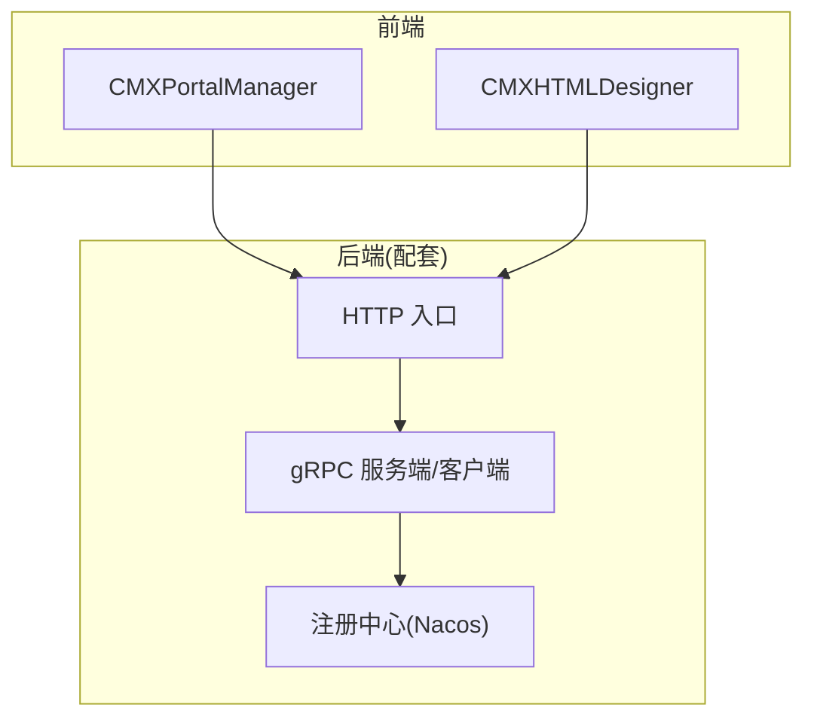
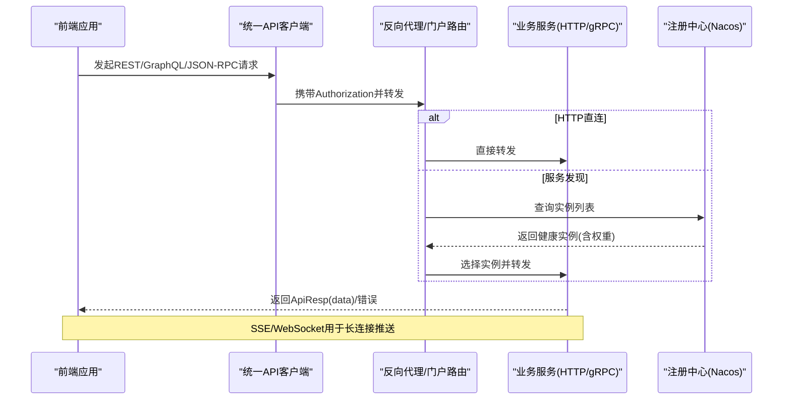
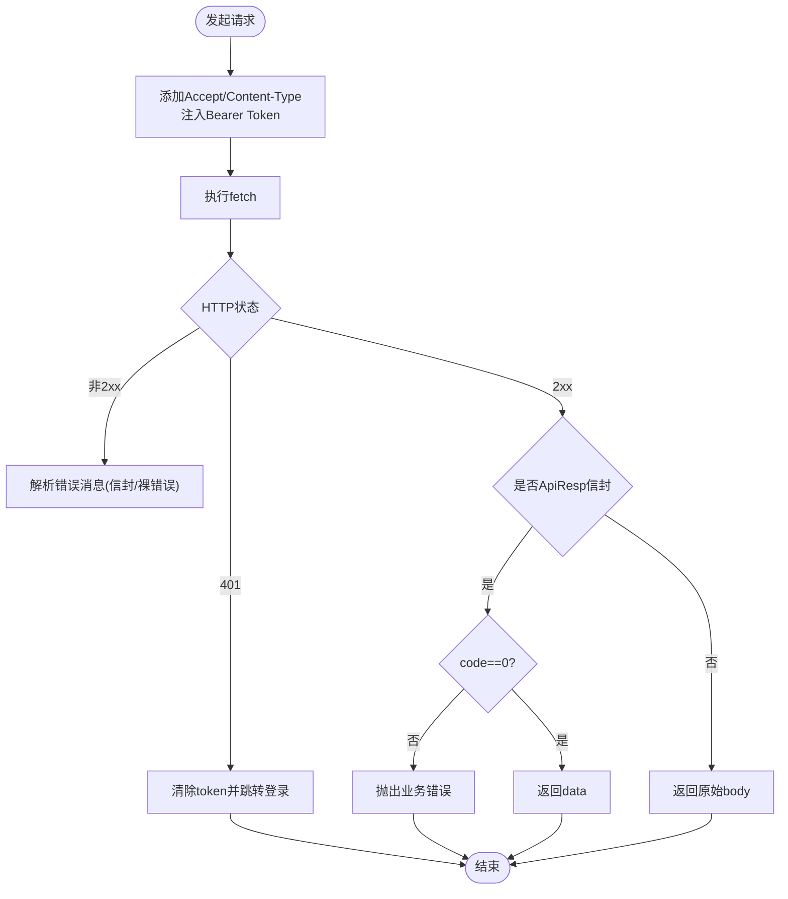
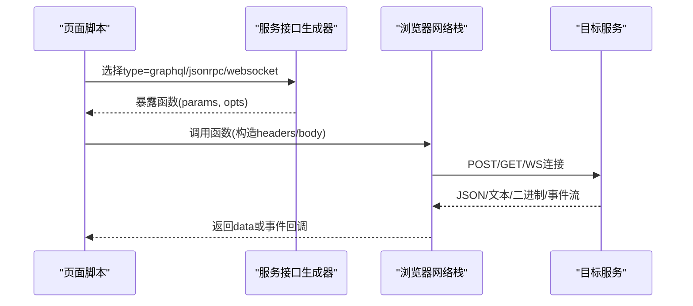
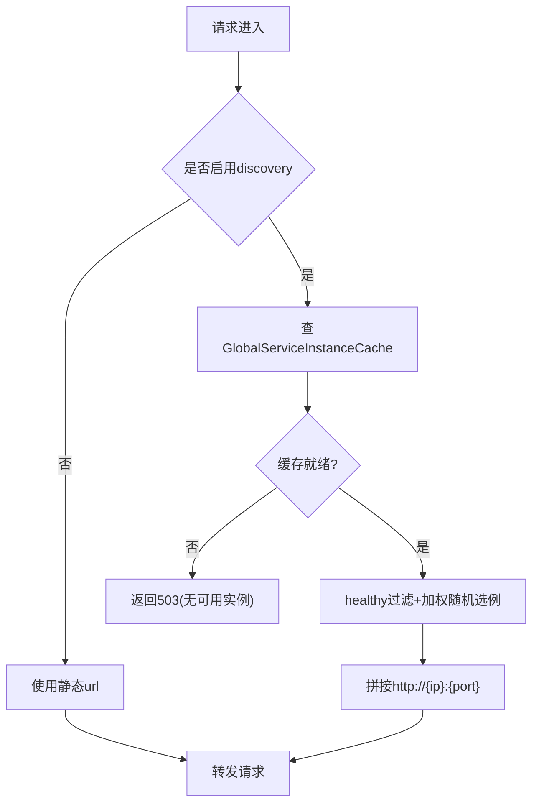
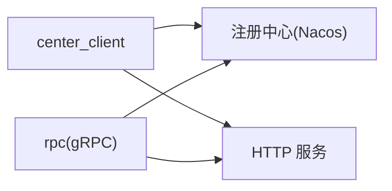
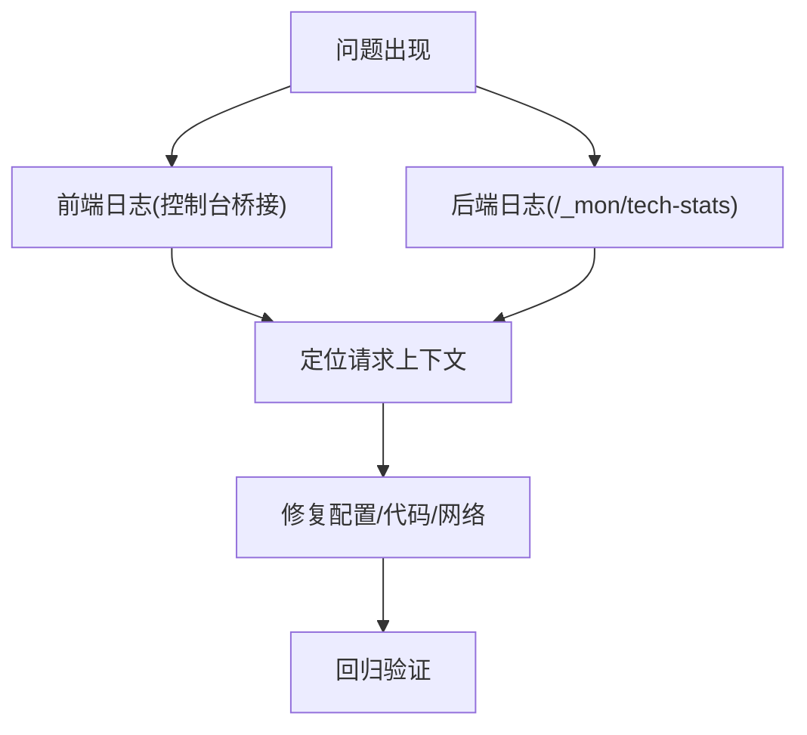

# 外部服务集成

<cite>
**本文引用的文件**
- [README.md](file://README.md)
- [api-client.js（门户）](file://CMXPortalManager/src/lib/api-client.js)
- [api-client.js（设计器）](file://CMXHTMLDesigner/src/lib/api-client.js)
- [page-data-panel-svc.js](file://CMXHTMLDesigner/src/components/designer-page-data/page-data-panel-svc.js)
- [ai-api.js](file://CMXPortalManager/src/ai-workbench/lib/ai-api.js)
- [sse-client.js](file://CMXPortalManager/src/ai-workbench/services/sse-client.js)
- [console-bridge.js](file://CMXPortalManager/src/lib/console-bridge.js)
- [cmx-console.js（设计器）](file://CMXHTMLDesigner/src/utils/cmx-console.js)
- [三类服务通信配置关系总结.md](file://documents/20260822_cmx-后端_三类服务通信配置关系总结.md)
- [服务定位map化与微服务接入Nacos方案.md](file://documents/20260822_cmx-center-client_服务定位map化与微服务接入Nacos方案.md)
- [per-key服务定位与传输混用方案.md](file://documents/20260822_cmx-center-client_per-key服务定位与传输混用方案.md)
- [流程引擎已知问题与技术债务.md](file://documents/技术债/20260817_流程引擎_已知问题与技术债务.md)
</cite>

## 目录
1. [简介](#简介)
2. [项目结构](#项目结构)
3. [核心组件](#核心组件)
4. [架构总览](#架构总览)
5. [详细组件分析](#详细组件分析)
6. [依赖分析](#依赖分析)
7. [性能考虑](#性能考虑)
8. [故障排查指南](#故障排查指南)
9. [结论](#结论)
10. [附录](#附录)

## 简介
本指南面向在微服务架构中集成外部服务的工程实践，覆盖服务发现、负载均衡、熔断降级、RESTful API、GraphQL、gRPC 调用方式，第三方 SDK 集成方法（支付网关、邮件服务、云存储、AI 服务），以及 ERP 对接、工作流引擎集成、BI 工具嵌入等典型场景。同时给出监控、日志追踪与故障排查的最佳实践。

本项目前端提供统一的 API 客户端与服务发现/反代能力；后端通过注册中心（Nacos）、配置中心与 gRPC/RPC 子系统实现服务间通信与治理。文档将结合仓库中的实际代码与方案文档，给出可落地的集成路径与注意事项。

## 项目结构
- 前端 monorepo：包含门户运行时（CMXPortalManager）、可视化设计器（CMXHTMLDesigner）、数据层 Web Components 与共享 UI5 运行时。
- 后端（配套 cmx-container）：提供元数据驱动的单据/字典/报表/流程存储与服务、异步任务中心、插件系统。
- 服务通信：支持静态 URL 直连、基于 Nacos 的服务发现与负载均衡，以及 gRPC 远程过程调用。
- 协议支持：REST（统一信封 ApiResp）、GraphQL、JSON-RPC、WebSocket/SSE。

**图示来源**
- [README.md:45-55](file://README.md#L45-L55)
- [三类服务通信配置关系总结.md:6-27](file://documents/20260822_cmx-后端_三类服务通信配置关系总结.md#L6-L27)

**章节来源**
- [README.md:8-18](file://README.md#L8-L18)
- [README.md:45-55](file://README.md#L45-L55)

## 核心组件
- 统一 API 客户端：自动注入 Bearer Token、解析统一信封、处理 401 跳转登录、兼容跨域重写。
- 服务发现与反代：基于 center_client 的 map 化配置，支持 http_url/http_discovery/grpc 三种模式，配合 Nacos 实例缓存做健康过滤与加权随机选例。
- gRPC 通信：[rpc] 子系统的进程级 gRPC 服务端与客户端设施，支持 warmup_services 预热。
- 多协议调用：REST、GraphQL、JSON-RPC、WebSocket/SSE 在前端均有现成实现或生成器。
- 可观测性：前端 console 桥接与拦截器，后端 /_mon 指标页与遥测挂载点。

**章节来源**
- [api-client.js（门户）:1-130](file://CMXPortalManager/src/lib/api-client.js#L1-L130)
- [api-client.js（设计器）:1-122](file://CMXHTMLDesigner/src/lib/api-client.js#L1-L122)
- [page-data-panel-svc.js:417-468](file://CMXHTMLDesigner/src/components/designer-page-data/page-data-panel-svc.js#L417-L468)
- [三类服务通信配置关系总结.md:29-73](file://documents/20260822_cmx-后端_三类服务通信配置关系总结.md#L29-L73)
- [服务定位map化与微服务接入Nacos方案.md:21-55](file://documents/20260822_cmx-center-client_服务定位map化与微服务接入Nacos方案.md#L21-L55)

## 架构总览
下图展示从前端到后端的请求链路，包括 REST/GraphQL/JSON-RPC 调用、SSE 事件流、以及后端侧的服务发现与 gRPC 通道。

**图示来源**
- [api-client.js（门户）:83-130](file://CMXPortalManager/src/lib/api-client.js#L83-L130)
- [page-data-panel-svc.js:417-468](file://CMXHTMLDesigner/src/components/designer-page-data/page-data-panel-svc.js#L417-L468)
- [sse-client.js:1-32](file://CMXPortalManager/src/ai-workbench/services/sse-client.js#L1-L32)
- [三类服务通信配置关系总结.md:64-73](file://documents/20260822_cmx-后端_三类服务通信配置关系总结.md#L64-L73)

## 详细组件分析

### 统一 API 客户端（REST 与认证）
- 职责：自动注入 Authorization、解析统一信封 {code,msg,data}、401 时清理 token 并跳转登录、兼容裸错误响应、支持 rawResponse 下载等二进制场景。
- 跨域：当设置 VITE_API_BASE 时，自动将相对 /api/* 重写为绝对地址，便于前后端分离部署。
- 全局拦截：installAuthFetchInterceptor 对同源 /api/* 请求统一加鉴权头与 401 处理，并对非 JSON 响应原样透传。

**图示来源**
- [api-client.js（门户）:83-130](file://CMXPortalManager/src/lib/api-client.js#L83-L130)
- [api-client.js（门户）:175-259](file://CMXPortalManager/src/lib/api-client.js#L175-L259)

**章节来源**
- [api-client.js（门户）:1-130](file://CMXPortalManager/src/lib/api-client.js#L1-L130)
- [api-client.js（门户）:175-259](file://CMXPortalManager/src/lib/api-client.js#L175-L259)
- [api-client.js（设计器）:1-122](file://CMXHTMLDesigner/src/lib/api-client.js#L1-L122)

### 多协议服务调用（REST、GraphQL、JSON-RPC、WebSocket/SSE）
- REST：通过统一客户端封装 GET/POST/DELETE，自动解包信封。
- GraphQL：设计器在服务编排中按配置生成 fetch 调用，支持 operationName 与 variables。
- JSON-RPC：按 method/params/id 构造 payload，错误分支处理 error.message。
- WebSocket/SSE：SSE 用于 AI 事件流（text_delta/reasoning/tool_call/json_chunk/ask_user/approval/result/error/done），WebSocket 用于实时双向通信。

**图示来源**
- [page-data-panel-svc.js:417-468](file://CMXHTMLDesigner/src/components/designer-page-data/page-data-panel-svc.js#L417-L468)
- [sse-client.js:1-32](file://CMXPortalManager/src/ai-workbench/services/sse-client.js#L1-L32)

**章节来源**
- [page-data-panel-svc.js:417-468](file://CMXHTMLDesigner/src/components/designer-page-data/page-data-panel-svc.js#L417-L468)
- [ai-api.js:1-63](file://CMXPortalManager/src/ai-workbench/lib/ai-api.js#L1-L63)
- [sse-client.js:1-32](file://CMXPortalManager/src/ai-workbench/services/sse-client.js#L1-L32)

### 服务发现、负载均衡与熔断降级
- 服务发现：center_client 支持 http_url（静态基址）与 http_discovery（Nacos 服务名）。Discovery 模式下使用全局实例缓存，healthy 过滤 + 按 Nacos weight 加权随机选例，优先使用 http_port 元数据。
- 负载均衡：每请求 resolve 实例，避免冷启动延迟；warm_proxy_upstreams 预热订阅，ServiceListSyncer 兜底。
- 熔断降级：当前未内置熔断/失败摘除，建议在网关或上游重试/超时控制层面补齐；若实例不可用，resolve 返回 None 时返回 503 明确语义。
- gRPC 通道：[rpc] 子系统提供进程级 gRPC 服务端与客户端，warmup_services 预热；transport="grpc" 必须配 discovery。

**图示来源**
- [服务定位map化与微服务接入Nacos方案.md:80-104](file://documents/20260822_cmx-center-client_服务定位map化与微服务接入Nacos方案.md#L80-L104)
- [三类服务通信配置关系总结.md:64-73](file://documents/20260822_cmx-后端_三类服务通信配置关系总结.md#L64-L73)

**章节来源**
- [服务定位map化与微服务接入Nacos方案.md:21-55](file://documents/20260822_cmx-center-client_服务定位map化与微服务接入Nacos方案.md#L21-L55)
- [服务定位map化与微服务接入Nacos方案.md:80-104](file://documents/20260822_cmx-center-client_服务定位map化与微服务接入Nacos方案.md#L80-L104)
- [三类服务通信配置关系总结.md:58-73](file://documents/20260822_cmx-后端_三类服务通信配置关系总结.md#L58-L73)

### 第三方 SDK 集成方法（支付网关、邮件服务、云存储、AI 服务）
- 通用原则：
  - 使用统一 API 客户端或全局 fetch 拦截器，确保鉴权与错误处理一致。
  - 敏感配置（密钥、端点）通过环境变量或配置中心管理，不在代码硬编码。
  - 对外部依赖增加超时、重试、熔断策略（网关或上层封装）。
- AI 服务示例：
  - REST 接口：会话创建、发送消息、中止、回答询问、审批决策。
  - SSE 事件流：接收 text_delta/reasoning/tool_call/json_chunk/ask_user/approval/result/error/done。
- 其他第三方（支付/邮件/云存储/AI）：
  - 建议封装独立 SDK 模块，统一错误码映射、重试退避、指标上报与审计日志。
  - 对于需要长连接的（如流式输出），采用 SSE/WebSocket 并处理断线重连。

**章节来源**
- [ai-api.js:1-63](file://CMXPortalManager/src/ai-workbench/lib/ai-api.js#L1-L63)
- [sse-client.js:1-32](file://CMXPortalManager/src/ai-workbench/services/sse-client.js#L1-L32)
- [api-client.js（门户）:83-130](file://CMXPortalManager/src/lib/api-client.js#L83-L130)

### 典型集成场景
- ERP 系统对接：
  - 通过 center_client 配置 url 或 discovery 指向 ERP 网关，REST 调用订单/库存/财务接口。
  - 使用统一信封解析与错误处理，必要时在网关层做协议转换与限流。
- 工作流引擎集成：
  - 通过流程定义与实例接口驱动审批流；可使用工具脚本生成 BPMN 并发布，冒烟验证。
  - 注意热装载与版本管理，发布后无需重启即可生效。
- BI 工具嵌入：
  - 通过 iframe 或 Web Components 嵌入 BI 页面，使用统一鉴权与单点登录。
  - 数据访问走平台 API，避免直连数据库。

**章节来源**
- [per-key服务定位与传输混用方案.md:15-30](file://documents/20260822_cmx-center-client_per-key服务定位与传输混用方案.md#L15-L30)
- [.agents/skills/cmx-flow-toolkit/scripts/create_flow_def.py:48-62](file://.agents/skills/cmx-flow-toolkit/scripts/create_flow_def.py#L48-L62)
- [.agents/skills/cmx-flow-toolkit/scripts/create_flow_def.py:374-406](file://.agents/skills/cmx-flow-toolkit/scripts/create_flow_def.py#L374-L406)

## 依赖分析
- 前端依赖：统一 API 客户端、服务接口生成器、SSE 客户端。
- 后端依赖：注册中心（Nacos）提供实例缓存与配置中心；[rpc] 提供 gRPC 通道；[center_client] 提供拨号规则与反代。
- 关键耦合点：
  - Discovery 与 gRPC 均强依赖注册中心基础设施。
  - 反代壳仅 HTTP 透明转发，transport 对反代键无效。
  - warmup 机制分别作用于 gRPC 与 HTTP 通道，互不干扰。

**图示来源**
- [三类服务通信配置关系总结.md:39-73](file://documents/20260822_cmx-后端_三类服务通信配置关系总结.md#L39-L73)

**章节来源**
- [三类服务通信配置关系总结.md:39-73](file://documents/20260822_cmx-后端_三类服务通信配置关系总结.md#L39-L73)

## 性能考虑
- 服务发现预热：warm_proxy_upstreams 与 warmup_services 消除首次调用冷启动延迟。
- 每请求实例解析：避免每次反序列化 toml，提升吞吐。
- 超时与重试：合理设置 timeout_ms 与 retry_count，避免雪崩。
- 带宽与流式：SSE/WebSocket 适合大结果集或长耗时任务，减少一次性响应体积。
- 指标采集：利用 /_mon 技术页与遥测挂载点，收集系统/DB池/请求域指标。

**章节来源**
- [服务定位map化与微服务接入Nacos方案.md:80-104](file://documents/20260822_cmx-center-client_服务定位map化与微服务接入Nacos方案.md#L80-L104)
- [三类服务通信配置关系总结.md:69-73](file://documents/20260822_cmx-后端_三类服务通信配置关系总结.md#L69-L73)
- [流程引擎已知问题与技术债务.md:272-279](file://documents/技术债/20260817_流程引擎_已知问题与技术债务.md#L272-L279)

## 故障排查指南
- 401 未授权：检查 token 是否存在且有效；确认拦截器已安装；核对 BASE_URL 与 LOGIN_PATH。
- 503 无可用实例：检查 Nacos 是否注册成功、服务名是否正确、端口是否对齐；查看 warmup 是否完成。
- 业务错误 code!=0：统一信封解析会抛出带 msg 的错误；在网关或上游记录请求上下文以便复现。
- 前端日志：使用 console 桥接捕获 log/warn/error 与 unhandledrejection，便于定位问题。
- 后端可观测性：/_mon 技术页与遥测挂载点；webhook 入队/投递失败有 warn 日志；需补充 Prometheus 指标与告警。

**图示来源**
- [console-bridge.js:85-168](file://CMXPortalManager/src/lib/console-bridge.js#L85-L168)
- [cmx-console.js（设计器）:33-83](file://CMXHTMLDesigner/src/utils/cmx-console.js#L33-L83)
- [流程引擎已知问题与技术债务.md:272-279](file://documents/技术债/20260817_流程引擎_已知问题与技术债务.md#L272-L279)

**章节来源**
- [console-bridge.js:85-168](file://CMXPortalManager/src/lib/console-bridge.js#L85-L168)
- [cmx-console.js（设计器）:33-83](file://CMXHTMLDesigner/src/utils/cmx-console.js#L33-L83)
- [流程引擎已知问题与技术债务.md:272-279](file://documents/技术债/20260817_流程引擎_已知问题与技术债务.md#L272-L279)

## 结论
本指南基于仓库中的前端统一 API 客户端、多协议调用能力与后端的注册中心/gRPC 子系统，提供了外部服务集成的完整路径：从服务发现与负载均衡，到 REST/GraphQL/gRPC 的调用方式，再到第三方 SDK 集成与典型场景落地。结合监控与日志追踪，可在生产环境获得稳定、可观测、可扩展的外部服务集成能力。后续建议补齐熔断与失败摘除、完善 Prometheus 指标与告警策略，进一步提升系统韧性。

## 附录
- 配置要点速查：
  - center_client.mode：http_url | http_discovery | grpc | local
  - center_client.urls/discovery.services：自由表，新增服务仅需一行配置
  - rpc.enabled/protocol：gRPC 通道开关与协议
  - SERVICE_REGISTRY_* / NACOS_*：注册中心与配置中心环境变量
- 最佳实践清单：
  - 所有外部调用统一经 API 客户端或全局拦截器
  - 敏感配置外置，禁止硬编码
  - 启用超时与重试，合理设置阈值
  - 使用 SSE/WebSocket 处理长耗时与流式输出
  - 开启 warmup 预热，降低首调延迟
  - 建立统一错误码与告警策略

**章节来源**
- [服务定位map化与微服务接入Nacos方案.md:21-55](file://documents/20260822_cmx-center-client_服务定位map化与微服务接入Nacos方案.md#L21-L55)
- [三类服务通信配置关系总结.md:75-90](file://documents/20260822_cmx-后端_三类服务通信配置关系总结.md#L75-L90)