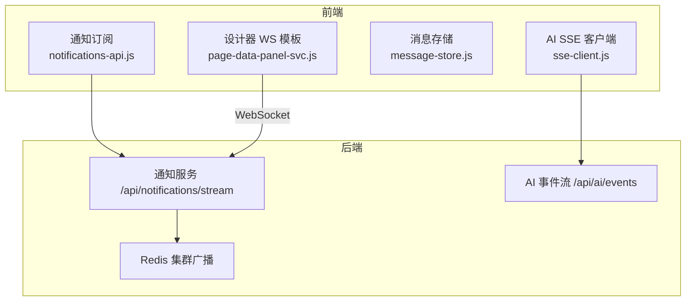
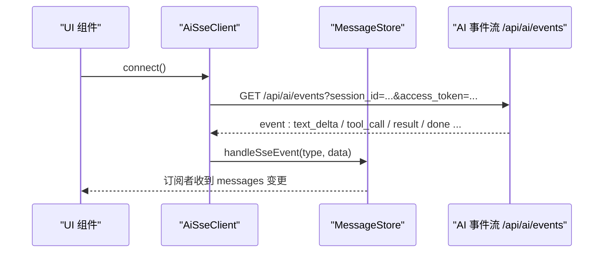
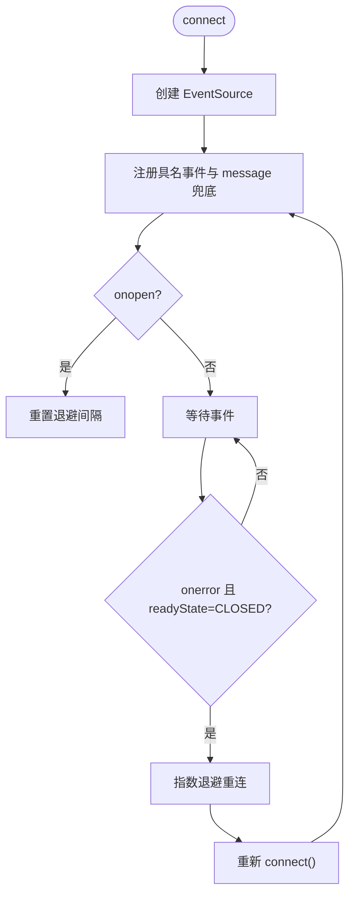
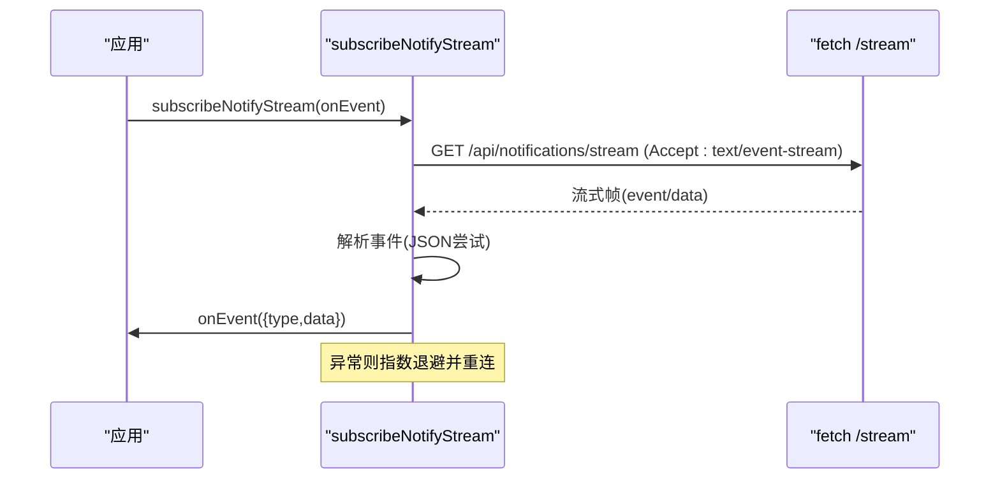
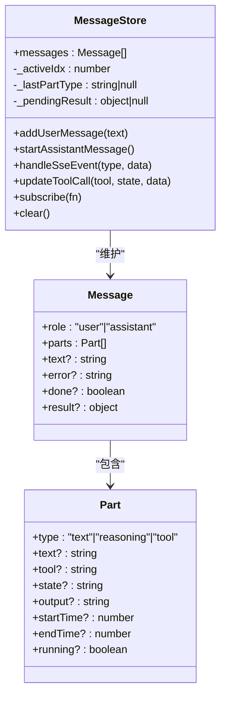
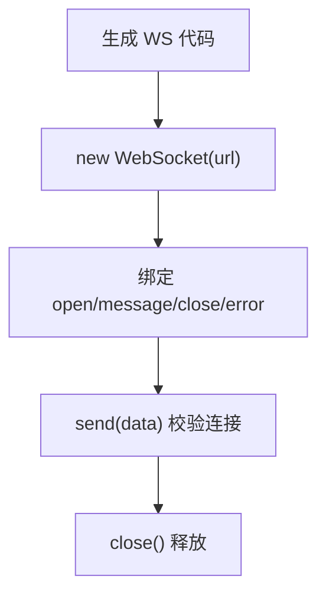
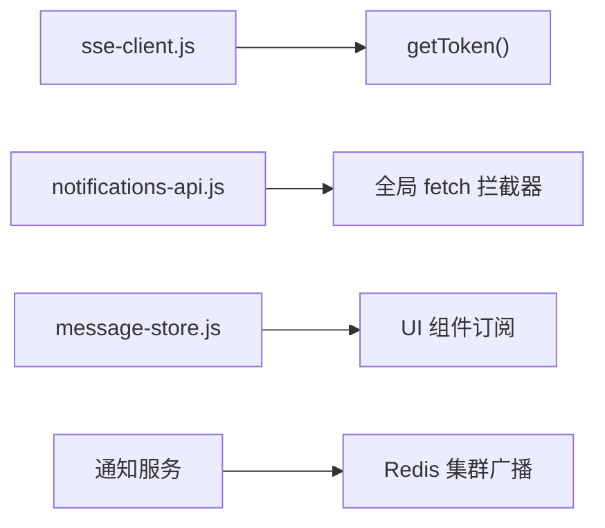

# 实时通信集成

<cite>
**本文引用的文件**
- [sse-client.js](file://CMXPortalManager/src/ai-workbench/services/sse-client.js)
- [notifications-api.js](file://CMXPortalManager/src/api/notifications-api.js)
- [message-store.js](file://CMXPortalManager/src/ai-workbench/services/message-store.js)
- [page-data-panel-svc.js](file://CMXHTMLDesigner/src/components/designer-page-data/page-data-panel-svc.js)
- [20260826_cmx-portal_通知中心数据库化与群发改造方案.md](file://documents/plans/20260826_cmx-portal_通知中心数据库化与群发改造方案.md)
</cite>

## 目录
1. [简介](#简介)
2. [项目结构](#项目结构)
3. [核心组件](#核心组件)
4. [架构总览](#架构总览)
5. [详细组件分析](#详细组件分析)
6. [依赖关系分析](#依赖关系分析)
7. [性能考虑](#性能考虑)
8. [故障排查指南](#故障排查指南)
9. [结论](#结论)
10. [附录](#附录)

## 简介
本文件面向企业门户中的“实时通信集成”，聚焦以下目标：
- WebSocket、Server-Sent Events（SSE）与长轮询的实现方案与选型建议
- 消息格式定义、事件订阅与广播机制
- 连接状态管理、断线重连与消息队列策略
- 实时通知、在线协作与即时消息的集成示例
- 性能优化技巧：连接池管理、消息压缩与批量处理

仓库中已实现的关键能力包括：
- AI 工作台的 SSE 客户端，支持具名事件与 message 通道兼容、指数退避重连、事件分发与通配监听
- 通知中心的 REST + SSE 订阅，使用 fetch 流式读取并解析 text/event-stream，具备自动重连与退避
- 消息存储层将 SSE 事件转换为可渲染的消息模型，支持增量累积、工具调用状态推进与完成收尾
- 设计器侧提供 WebSocket 代码生成模板，便于页面脚本快速接入 WebSocket

## 项目结构
与实时通信相关的核心位置：
- CMXPortalManager/src/ai-workbench/services/sse-client.js：AI 场景 SSE 客户端封装
- CMXPortalManager/src/api/notifications-api.js：通知中心 REST API 与 SSE 订阅
- CMXPortalManager/src/ai-workbench/services/message-store.js：SSE 事件到消息模型的转换与状态管理
- CMXHTMLDesigner/src/components/designer-page-data/page-data-panel-svc.js：设计器生成 WebSocket 调用代码片段
- documents/plans/...：后端通知中心与 Redis 集群广播方案文档

图表来源
- [sse-client.js:60-95](file://CMXPortalManager/src/ai-workbench/services/sse-client.js#L60-L95)
- [notifications-api.js:56-116](file://CMXPortalManager/src/api/notifications-api.js#L56-L116)
- [page-data-panel-svc.js:456-474](file://CMXHTMLDesigner/src/components/designer-page-data/page-data-panel-svc.js#L456-L474)

章节来源
- [sse-client.js:1-188](file://CMXPortalManager/src/ai-workbench/services/sse-client.js#L1-L188)
- [notifications-api.js:1-117](file://CMXPortalManager/src/api/notifications-api.js#L1-L117)
- [message-store.js:1-382](file://CMXPortalManager/src/ai-workbench/services/message-store.js#L1-L382)
- [page-data-panel-svc.js:456-474](file://CMXHTMLDesigner/src/components/designer-page-data/page-data-panel-svc.js#L456-L474)

## 核心组件
- AI SSE 客户端（AiSseClient）
  - 基于浏览器 EventSource，注册具名事件与 message 兜底通道
  - 指数退避重连，关闭时清理定时器与处理器
  - 事件分发支持精确类型与通配符“*”
- 通知订阅（subscribeNotifyStream）
  - 使用 fetch + ReadableStream 解析 text/event-stream
  - 自动重连，指数退避上限 15s，支持 AbortController 中断
  - 解析 event/data 行，尝试 JSON 反序列化后回调 onEvent
- 消息存储（MessageStore）
  - 将 SSE 事件转为消息模型（文本、推理、工具调用等 part）
  - 支持增量追加、工具状态推进、完成收尾与错误处理
  - 通过订阅者模式通知 UI 更新
- 设计器 WebSocket 模板
  - 为配置类型为 websocket 的服务生成 connect/send/close 函数体
  - 提供 open/message/close/error 事件绑定基础骨架

章节来源
- [sse-client.js:29-188](file://CMXPortalManager/src/ai-workbench/services/sse-client.js#L29-L188)
- [notifications-api.js:50-116](file://CMXPortalManager/src/api/notifications-api.js#L50-L116)
- [message-store.js:34-382](file://CMXPortalManager/src/ai-workbench/services/message-store.js#L34-L382)
- [page-data-panel-svc.js:456-474](file://CMXHTMLDesigner/src/components/designer-page-data/page-data-panel-svc.js#L456-L474)

## 架构总览
整体数据流：
- 通知中心：REST 查询/标记/发布 + SSE 推送；后端通过 Redis 集群广播跨实例转发
- AI 对话：前端通过 EventSource 或 fetch 流订阅 /api/ai/events，按事件类型分派到 MessageStore
- 设计器：按需生成 WebSocket 调用代码，便于页面脚本直接建立双向连接

图表来源
- [sse-client.js:60-95](file://CMXPortalManager/src/ai-workbench/services/sse-client.js#L60-L95)
- [message-store.js:221-260](file://CMXPortalManager/src/ai-workbench/services/message-store.js#L221-L260)

章节来源
- [sse-client.js:60-188](file://CMXPortalManager/src/ai-workbench/services/sse-client.js#L60-L188)
- [message-store.js:221-382](file://CMXPortalManager/src/ai-workbench/services/message-store.js#L221-L382)

## 详细组件分析

### 组件一：AI SSE 客户端（AiSseClient）
- 连接与认证
  - 使用 EventSource 连接 /api/ai/events，token 通过 query 传递（EventSource 不支持 Authorization 头）
  - 连接成功重置退避间隔
- 事件接收与分发
  - 为所有 AiEventType 注册具名事件监听
  - 同时监听 message 通道以兼容后端将事件类型放入 data 的实现
  - _dispatch 会尝试 JSON 解析，并将结果与原始字符串一并传给 handler
  - 支持通配符“*”用于全局日志/调试
- 重连策略
  - onerror 检测 CLOSED 状态，触发手动重连
  - 指数退避，最大间隔 15s，避免雪崩
- 资源释放
  - close 停止重连、关闭 EventSource、清空处理器

图表来源
- [sse-client.js:60-109](file://CMXPortalManager/src/ai-workbench/services/sse-client.js#L60-L109)

章节来源
- [sse-client.js:29-188](file://CMXPortalManager/src/ai-workbench/services/sse-client.js#L29-L188)

### 组件二：通知中心 SSE 订阅（subscribeNotifyStream）
- 流式读取
  - 使用 fetch 发起 GET /api/notifications/stream，Accept: text/event-stream
  - 通过 ReadableStream 逐块读取，TextDecoder 解码，按 \n\n 切分事件
  - 解析 event: 与 data: 行，尝试 JSON 解析后回调 onEvent({ type, data })
- 重连与中断
  - 每次循环新建 AbortController，异常时指数退避（上限 15s）
  - 返回 stop() 函数，内部设置 stopped 标志并 abort 当前请求
- 健壮性
  - 对非 JSON 数据保留原始字符串，避免崩溃
  - 捕获 onEvent 抛错，防止单点失败影响整条流

图表来源
- [notifications-api.js:56-116](file://CMXPortalManager/src/api/notifications-api.js#L56-L116)

章节来源
- [notifications-api.js:1-117](file://CMXPortalManager/src/api/notifications-api.js#L1-L117)

### 组件三：消息存储（MessageStore）
- 数据结构
  - Message：role、parts、text、error、done、result
  - Part：type(text/reasoning/tool)、text、tool、state、output、时间戳、running
- 增量累积
  - 同类型 part 合并追加文本；不同类型新建 part
  - 工具调用按 partId 精准匹配，无 partId 回退到同名未完成的 tool part
- 完成与错误
  - result/done 事件收尾，标记 running 部分完成
  - error 事件统一错误文案，区分用户中断与真实错误
- 订阅通知
  - 通过 listeners Set 通知 UI 刷新

图表来源
- [message-store.js:12-32](file://CMXPortalManager/src/ai-workbench/services/message-store.js#L12-L32)
- [message-store.js:34-382](file://CMXPortalManager/src/ai-workbench/services/message-store.js#L34-L382)

章节来源
- [message-store.js:1-382](file://CMXPortalManager/src/ai-workbench/services/message-store.js#L1-L382)

### 组件四：设计器 WebSocket 模板
- 生成 connect/send/close 函数体
  - 使用 new WebSocket(url)，绑定 open/message/close/error 事件
  - send 前检查 readyState，确保连接可用
- 适用场景
  - 页面脚本需要双向通信时，可直接复用生成的方法

图表来源
- [page-data-panel-svc.js:456-474](file://CMXHTMLDesigner/src/components/designer-page-data/page-data-panel-svc.js#L456-L474)

章节来源
- [page-data-panel-svc.js:456-474](file://CMXHTMLDesigner/src/components/designer-page-data/page-data-panel-svc.js#L456-L474)

## 依赖关系分析
- 前端依赖
  - sse-client.js 依赖 Portal 统一鉴权获取 token
  - notifications-api.js 依赖全局 fetch 拦截器注入鉴权头
  - message-store.js 被 AI 聊天组件消费，驱动 UI 响应式更新
- 后端依赖
  - 通知中心通过 Redis 集群广播跨实例转发事件，保证多节点一致性
  - SSE 流由后端按事件类型推送，前端仅负责解析与重连

图表来源
- [sse-client.js:26-27](file://CMXPortalManager/src/ai-workbench/services/sse-client.js#L26-L27)
- [notifications-api.js:1-7](file://CMXPortalManager/src/api/notifications-api.js#L1-L7)
- [20260826_cmx-portal_通知中心数据库化与群发改造方案.md:142-148](file://documents/plans/20260826_cmx-portal_通知中心数据库化与群发改造方案.md#L142-L148)

章节来源
- [sse-client.js:26-27](file://CMXPortalManager/src/ai-workbench/services/sse-client.js#L26-L27)
- [notifications-api.js:1-7](file://CMXPortalManager/src/api/notifications-api.js#L1-L7)
- [20260826_cmx-portal_通知中心数据库化与群发改造方案.md:142-148](file://documents/plans/20260826_cmx-portal_通知中心数据库化与群发改造方案.md#L142-L148)

## 性能考虑
- 连接与重连
  - 指数退避限制最大间隔，避免风暴式重连
  - 使用 AbortController 及时中断无效流，减少资源占用
- 消息处理
  - 增量追加与不可变更新，降低渲染开销
  - 工具调用按 partId 精准匹配，避免重复与覆盖
- 传输优化
  - 后端启用 HTTP 压缩（如 gzip/br），对列式 JSON 收益显著
  - 可选二进制编码（如 MessagePack）进一步减小体积
- 批量与聚合
  - 通知中心 fanout 事件在进程内 hub 控制发射量，避免过载
  - 前端可对高频事件做节流/批处理后再更新 UI

[本节为通用指导，不直接分析具体文件]

## 故障排查指南
- SSE 连接断开
  - 检查 onerror 是否进入 CLOSED 分支并触发重连
  - 确认后端 /api/ai/events 与 /api/notifications/stream 可达
- 事件丢失或乱序
  - 通知中心多节点投递有顺序保障（抢占守卫、组内串行、failed 退避阻塞后续）
  - 下游需按 eventId 去重，必要时用 version 条件 upsert
- 工具调用卡死
  - 检查 tool_call 帧是否为合法对象，避免代理截断导致解析失败
  - 关注 result/done 事件是否正确收尾 running 状态
- 内存泄漏
  - 确保 close() 清理定时器与 EventSource
  - 通知订阅返回的 stop() 需在组件卸载时调用

章节来源
- [sse-client.js:82-109](file://CMXPortalManager/src/ai-workbench/services/sse-client.js#L82-L109)
- [message-store.js:230-260](file://CMXPortalManager/src/ai-workbench/services/message-store.js#L230-L260)
- [20260826_cmx-portal_通知中心数据库化与群发改造方案.md:448-450](file://documents/plans/20260826_cmx-portal_通知中心数据库化与群发改造方案.md#L448-L450)

## 结论
本项目在前端实现了稳健的 SSE 与 WebSocket 集成：
- AI 场景采用 EventSource 与自定义解析，兼容多种后端事件格式，具备指数退避重连与事件分发能力
- 通知中心通过 fetch 流式读取 SSE，具备自动重连与优雅中断
- 消息存储层将流式事件转化为可渲染模型，支持增量更新与复杂状态机
- 设计器提供 WebSocket 模板，便于扩展双向通信场景
结合后端 Redis 集群广播与 HTTP 压缩等优化，可在高并发与多节点环境下保持低延迟与高吞吐。

[本节为总结，不直接分析具体文件]

## 附录

### 事件与消息格式约定
- AI 事件类型（示例）
  - text_delta、reasoning_delta、tool_call、json_chunk、ask_user、require_approval、result、error、done、context_request
- 通知事件
  - 通过 event: 指定类型，data: 承载载荷；前端解析后回调 onEvent({ type, data })

章节来源
- [sse-client.js:29-42](file://CMXPortalManager/src/ai-workbench/services/sse-client.js#L29-L42)
- [notifications-api.js:90-116](file://CMXPortalManager/src/api/notifications-api.js#L90-L116)

### 集成示例指引
- 实时通知
  - 使用 subscribeNotifyStream(onEvent) 订阅 /api/notifications/stream，根据 type 更新角标或列表
- 在线协作
  - 使用设计器生成的 WebSocket 模板建立双向连接，发送/接收协作指令
- 即时消息
  - 使用 AiSseClient 连接 /api/ai/events，将事件交由 MessageStore 累积并渲染

章节来源
- [notifications-api.js:56-116](file://CMXPortalManager/src/api/notifications-api.js#L56-L116)
- [page-data-panel-svc.js:456-474](file://CMXHTMLDesigner/src/components/designer-page-data/page-data-panel-svc.js#L456-L474)
- [sse-client.js:60-188](file://CMXPortalManager/src/ai-workbench/services/sse-client.js#L60-L188)
- [message-store.js:221-382](file://CMXPortalManager/src/ai-workbench/services/message-store.js#L221-L382)