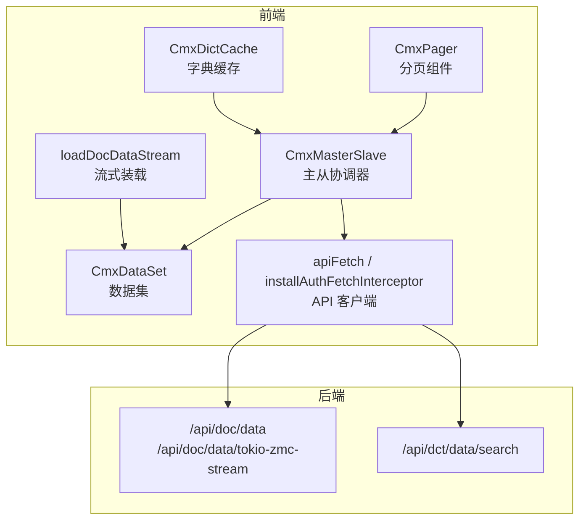
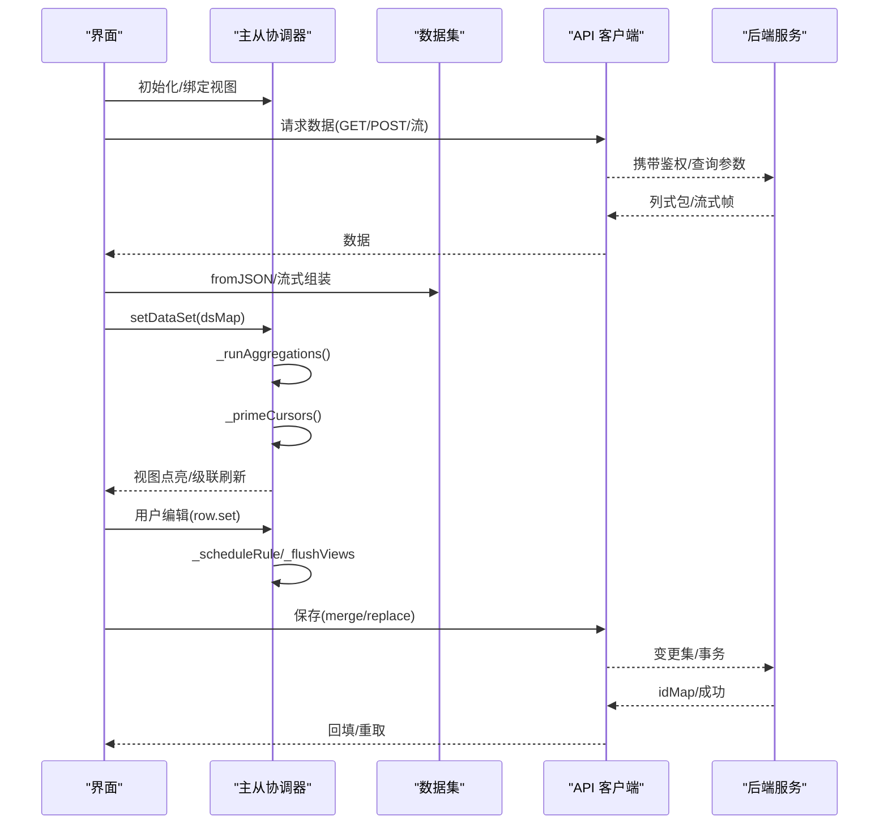
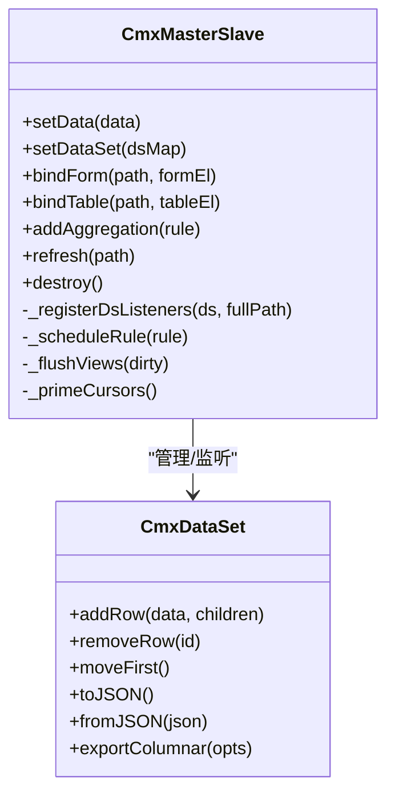
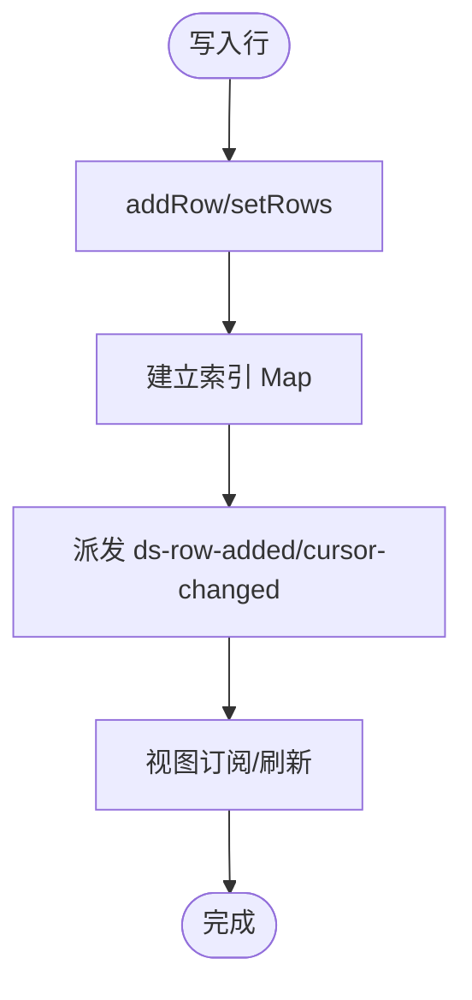
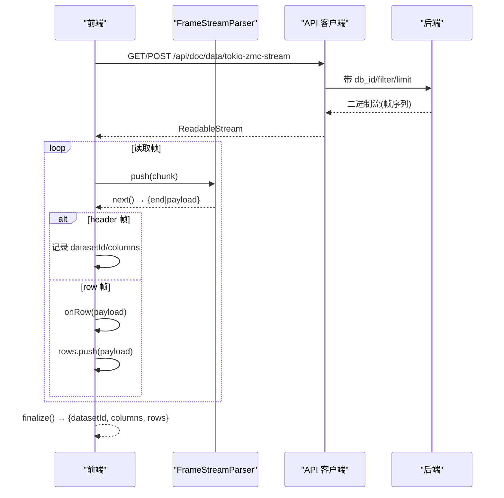
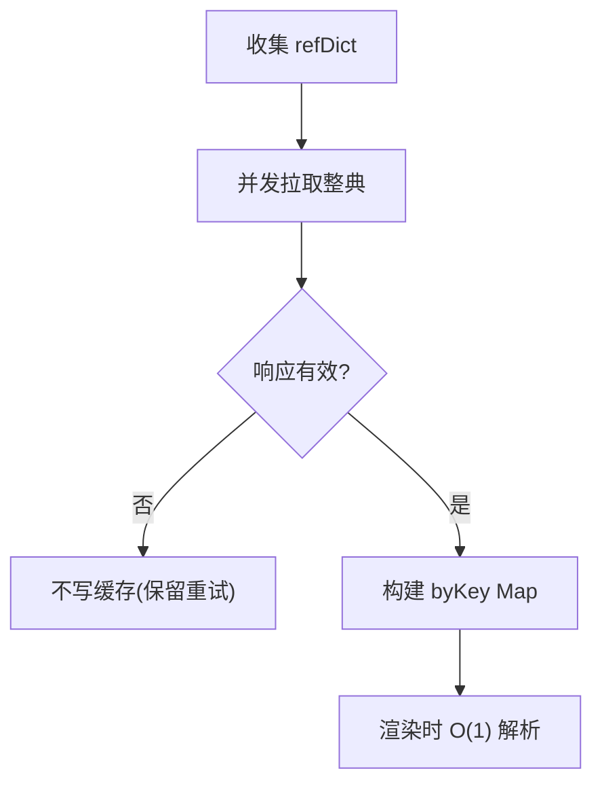
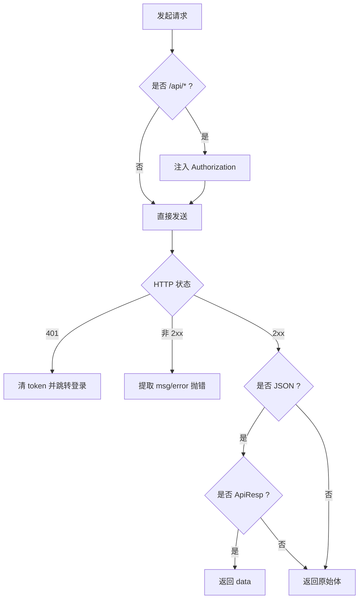
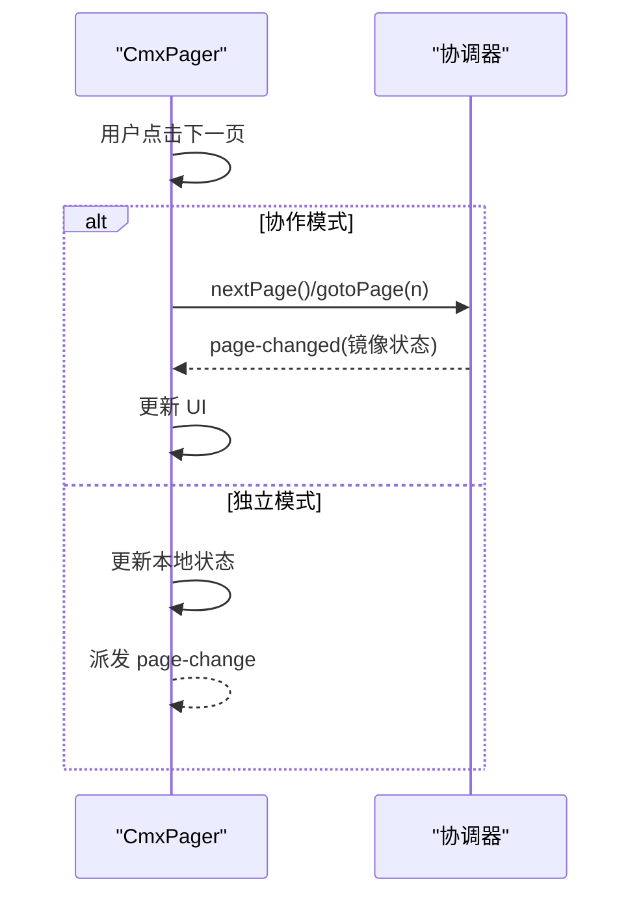
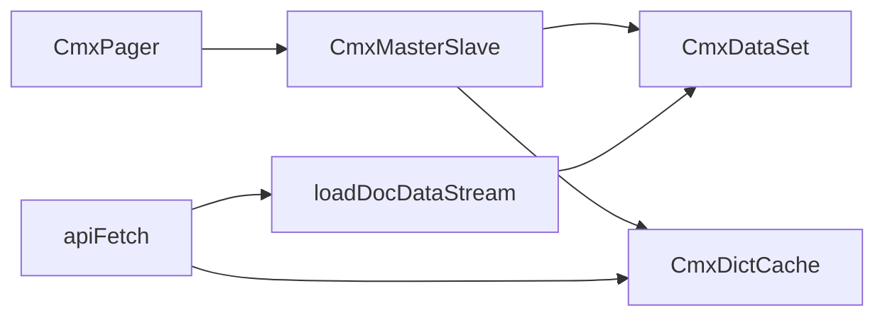

# 数据同步机制

<cite>
**本文引用的文件**
- [cmx-master-slave.js](file://packages/cmx-data-comp/src/lib/cmx-master-slave.js)
- [cmx-data-set.js](file://packages/cmx-data-comp/src/lib/cmx-data-set.js)
- [cmx-doc-stream.js](file://packages/cmx-data-comp/src/lib/cmx-doc-stream.js)
- [cmx-dict-cache.js](file://packages/cmx-data-comp/src/lib/cmx-dict-cache.js)
- [api-client.js](file://CMXPortalManager/src/lib/api-client.js)
- [cmx-pager.js](file://packages/cmx-data-comp/src/components/cmx-pager.js)
- [业务单据数据装载与前端模型映射方案.html](file://docs/业务单据数据装载与前端模型映射方案.html)
</cite>

## 目录
1. [简介](#简介)
2. [项目结构](#项目结构)
3. [核心组件](#核心组件)
4. [架构总览](#架构总览)
5. [详细组件分析](#详细组件分析)
6. [依赖关系分析](#依赖关系分析)
7. [性能考虑](#性能考虑)
8. [故障排查指南](#故障排查指南)
9. [结论](#结论)
10. [附录](#附录)

## 简介
本文件面向企业门户中的数据同步机制，围绕“本地缓存与远程数据的同步策略”展开，覆盖乐观更新、冲突解决、一致性保证；解释增量同步、全量同步与实时同步的实现方式；说明离线数据处理、数据版本控制与回滚机制的设计思路；提供主从数据同步、多端一致性与大数据分页加载等集成示例；并给出缓存策略、数据压缩与网络请求优化等性能建议。

## 项目结构
本项目在数据同步方面由以下关键模块协同工作：
- 主从协调器：负责多级主从数据树的管理、视图绑定、聚合计算与事件驱动的数据联动。
- 数据集：提供行级变更通知、游标管理、序列化/反序列化与零拷贝视图能力。
- 流式装载：基于长度分帧的二进制流解码，支持边收边解的增量消费。
- 字典缓存：整典缓存 id→name，渲染时 O(1) 解析显示字段。
- API 客户端：统一鉴权、信封解析、401 处理与跨域重写。
- 分页组件：独立模式与协作模式（对接协调器）的双模式分页。

**图表来源**
- [cmx-master-slave.js:1-120](file://packages/cmx-data-comp/src/lib/cmx-master-slave.js#L1-L120)
- [cmx-data-set.js:1-120](file://packages/cmx-data-comp/src/lib/cmx-data-set.js#L1-L120)
- [cmx-doc-stream.js:1-122](file://packages/cmx-data-comp/src/lib/cmx-doc-stream.js#L1-L122)
- [cmx-dict-cache.js:1-120](file://packages/cmx-data-comp/src/lib/cmx-dict-cache.js#L1-L120)
- [api-client.js:1-120](file://CMXPortalManager/src/lib/api-client.js#L1-L120)
- [cmx-pager.js:1-120](file://packages/cmx-data-comp/src/components/cmx-pager.js#L1-L120)

**章节来源**
- [cmx-master-slave.js:1-120](file://packages/cmx-data-comp/src/lib/cmx-master-slave.js#L1-L120)
- [cmx-data-set.js:1-120](file://packages/cmx-data-comp/src/lib/cmx-data-set.js#L1-L120)
- [cmx-doc-stream.js:1-122](file://packages/cmx-data-comp/src/lib/cmx-doc-stream.js#L1-L122)
- [cmx-dict-cache.js:1-120](file://packages/cmx-data-comp/src/lib/cmx-dict-cache.js#L1-L120)
- [api-client.js:1-120](file://CMXPortalManager/src/lib/api-client.js#L1-L120)
- [cmx-pager.js:1-120](file://packages/cmx-data-comp/src/components/cmx-pager.js#L1-L120)

## 核心组件
- CmxMasterSlave（主从协调器）
  - 职责：维护递归主从数据树、绑定表单/表格视图、按路径维护当前选中行、监听单元格/行变更并执行聚合规则、导出数据集与键值对。
  - 关键点：setData/setDataSet 后预热聚合、primeCursors 自动点亮子层视图、_scheduleRule/_flushViews 合并刷新。
- CmxDataSet（数据集）
  - 职责：行增删改、游标管理、row-changed/cursor-changed 事件冒泡、toJSON/fromJSON、exportColumnar/exportKeyValue、createView/fillView 零拷贝视图。
  - 关键点：索引 Map<String(id), row> 实现 O(1) 查找；fromJSON 批量快路径避免逐行事件开销。
- loadDocDataStream（流式装载）
  - 职责：拉取后端 tokio-zmc-stream 二进制流，按长度分帧解析 header/rows，支持 onRow 增量回调与进度回调。
  - 关键点：Accept octet-stream；有 query 走 POST body；FrameStreamParser 安全跨块边界。
- CmxDictCache（字典缓存）
  - 职责：收集 refDict 并发拉取整典条目，构建 key→entry 映射，渲染时 O(1) 解析 name/displayField。
  - 关键点：失败不写缓存以便重试；支持 invalidate 失效重拉。
- apiFetch / installAuthFetchInterceptor（API 客户端）
  - 职责：注入 Authorization、解析 ApiResp 信封、401 跳转登录、跨域重写 API_BASE、拦截非 JSON 响应透传。
- CmxPager（分页组件）
  - 职责：独立模式派发 page-change；协作模式转发到协调器并镜像状态；支持页大小切换与占位提示。

**章节来源**
- [cmx-master-slave.js:1-120](file://packages/cmx-data-comp/src/lib/cmx-master-slave.js#L1-L120)
- [cmx-data-set.js:1-120](file://packages/cmx-data-comp/src/lib/cmx-data-set.js#L1-L120)
- [cmx-doc-stream.js:1-122](file://packages/cmx-data-comp/src/lib/cmx-doc-stream.js#L1-L122)
- [cmx-dict-cache.js:1-120](file://packages/cmx-data-comp/src/lib/cmx-dict-cache.js#L1-L120)
- [api-client.js:1-120](file://CMXPortalManager/src/lib/api-client.js#L1-L120)
- [cmx-pager.js:1-120](file://packages/cmx-data-comp/src/components/cmx-pager.js#L1-L120)

## 架构总览
数据同步的整体流程包括：
- 数据获取：通过 API 客户端发起 GET/POST 或流式下载，使用列式编码与可选压缩减少传输体积。
- 数据装配：将后端返回的列式包转换为 CmxDataSet，并通过 setDataSet 交给主从协调器接管。
- 视图联动：协调器为每个数据集注册 row-changed/cursor-changed 监听，触发聚合与视图刷新。
- 编辑回写：前端收集变更集（ChangeSet），以 merge（增量优先）或 replace（先删后插）模式提交，服务端事务内落库并返回 idMap。
- 一致性保障：通过乐观锁（version 条件）、事务回滚、idMap 回填与按需重取确保前后端一致。

**图表来源**
- [cmx-master-slave.js:317-350](file://packages/cmx-data-comp/src/lib/cmx-master-slave.js#L317-L350)
- [cmx-data-set.js:307-410](file://packages/cmx-data-comp/src/lib/cmx-data-set.js#L307-L410)
- [cmx-doc-stream.js:30-87](file://packages/cmx-data-comp/src/lib/cmx-doc-stream.js#L30-L87)
- [api-client.js:83-130](file://CMXPortalManager/src/lib/api-client.js#L83-L130)
- [业务单据数据装载与前端模型映射方案.html:740-778](file://docs/业务单据数据装载与前端模型映射方案.html#L740-L778)

## 详细组件分析

### 主从协调器（CmxMasterSlave）
- 数据入口与装配
  - setData/setDataSet：标准化输入、递归注册子数据集监听、预热聚合、primeCursors 定位首行并级联点亮子层视图。
  - getDataSet/getRootDataSet：导出完整树或根数据集引用，便于复用。
- 视图绑定与联动
  - bindForm/bindTable：按 path 绑定视图，设置可编辑态，监听表格行增删事件。
  - _renderView/_setCurrent：根据当前选中行解析目标 ds，仅在 ds 引用变化时重新绑定，避免重复渲染。
- 聚合与刷新
  - addAggregation/_scheduleRule/_flushRules：按 from-path 快速命中规则，同步写值并在微任务中批刷受影响视图。
- 生命周期与内存管理
  - destroy：解绑 collector、DOM 事件、ds 监听，清理分页状态，防止 SPA 内存泄漏。

**图表来源**
- [cmx-master-slave.js:41-120](file://packages/cmx-data-comp/src/lib/cmx-master-slave.js#L41-L120)
- [cmx-master-slave.js:317-350](file://packages/cmx-data-comp/src/lib/cmx-master-slave.js#L317-L350)
- [cmx-master-slave.js:755-798](file://packages/cmx-data-comp/src/lib/cmx-master-slave.js#L755-L798)
- [cmx-data-set.js:37-120](file://packages/cmx-data-comp/src/lib/cmx-data-set.js#L37-L120)

**章节来源**
- [cmx-master-slave.js:125-177](file://packages/cmx-data-comp/src/lib/cmx-master-slave.js#L125-L177)
- [cmx-master-slave.js:317-350](file://packages/cmx-data-comp/src/lib/cmx-master-slave.js#L317-L350)
- [cmx-master-slave.js:755-798](file://packages/cmx-data-comp/src/lib/cmx-master-slave.js#L755-L798)

### 数据集（CmxDataSet）
- 行操作与事件
  - addRow/removeRow/removeRows：维护 rows 数组与 index Map，删除时调整游标并派发 cursor-changed。
  - _notifyChange：在 row.set 时派发 row-changed，供协调器捕获并执行 calcFormula/聚合。
- 游标与导航
  - moveTo/moveFirst/moveLast/moveNext/movePrev/moveToId：统一通过 _setCursor 派发 cursor-changed。
- 序列化与视图
  - toJSON/fromJSON：列式存储，childRows 递归挂载；fromJSON 批量快路径避免事件风暴。
  - exportColumnar/exportKeyValue：两种导出格式，便于后端/网格消费。
  - createView/fillView：零拷贝过滤视图，直接绑定 grid/table。

**图表来源**
- [cmx-data-set.js:82-108](file://packages/cmx-data-comp/src/lib/cmx-data-set.js#L82-L108)
- [cmx-data-set.js:110-148](file://packages/cmx-data-comp/src/lib/cmx-data-set.js#L110-L148)
- [cmx-data-set.js:165-193](file://packages/cmx-data-comp/src/lib/cmx-data-set.js#L165-L193)
- [cmx-data-set.js:307-410](file://packages/cmx-data-comp/src/lib/cmx-data-set.js#L307-L410)

**章节来源**
- [cmx-data-set.js:82-108](file://packages/cmx-data-comp/src/lib/cmx-data-set.js#L82-L108)
- [cmx-data-set.js:110-148](file://packages/cmx-data-comp/src/lib/cmx-data-set.js#L110-L148)
- [cmx-data-set.js:165-193](file://packages/cmx-data-comp/src/lib/cmx-data-set.js#L165-L193)
- [cmx-data-set.js:307-410](file://packages/cmx-data-comp/src/lib/cmx-data-set.js#L307-L410)

### 流式装载（loadDocDataStream）
- 协议与解析
  - 后端输出长度分帧二进制流：[u32 len][payload]，header 帧含 datasetId/columns，后续帧为行数组。
  - FrameStreamParser 安全跨块边界解析，遇到 len=0 终止。
- 增量消费
  - onRow 回调每行到达即触发，onProgress 每 500 行回调已收行数，适合大数据量场景。
- 请求构造
  - Accept: application/octet-stream；存在 query 时转为 POST body，否则走 GET 便捷路径。

**图表来源**
- [cmx-doc-stream.js:30-87](file://packages/cmx-data-comp/src/lib/cmx-doc-stream.js#L30-L87)
- [cmx-doc-stream.js:93-122](file://packages/cmx-data-comp/src/lib/cmx-doc-stream.js#L93-L122)

**章节来源**
- [cmx-doc-stream.js:30-87](file://packages/cmx-data-comp/src/lib/cmx-doc-stream.js#L30-L87)
- [cmx-doc-stream.js:93-122](file://packages/cmx-data-comp/src/lib/cmx-doc-stream.js#L93-L122)

### 字典缓存（CmxDictCache）
- 整典缓存
  - collectRefDicts 收集所有 refDict，loadDicts 并发拉取整典（pageSize 上限），构建 byKey Map。
  - resolve/resolveMany/entry 提供 O(1) 解析；invalidate/clear 支持失效与清空。
- 渲染集成
  - makeDictResolver 生成 display 函数，供网格/表单渲染 id→name。

**图表来源**
- [cmx-dict-cache.js:49-103](file://packages/cmx-data-comp/src/lib/cmx-dict-cache.js#L49-L103)
- [cmx-dict-cache.js:156-186](file://packages/cmx-data-comp/src/lib/cmx-dict-cache.js#L156-L186)

**章节来源**
- [cmx-dict-cache.js:49-103](file://packages/cmx-data-comp/src/lib/cmx-dict-cache.js#L49-L103)
- [cmx-dict-cache.js:156-186](file://packages/cmx-data-comp/src/lib/cmx-dict-cache.js#L156-L186)

### API 客户端（apiFetch / installAuthFetchInterceptor）
- 鉴权与信封
  - 自动注入 Authorization；解析 ApiResp 信封，code===0 返回 data，否则抛错。
  - 401 清除 token 并跳转登录页；兼容裸错误对象。
- 跨域与拦截
  - installAuthFetchInterceptor 全局拦截同源 /api/*，自动追加 token，401 处理；跨域时重写 API_BASE。
  - 非 JSON（SSE/下载/二进制）原样透传，避免误解析。

**图表来源**
- [api-client.js:83-130](file://CMXPortalManager/src/lib/api-client.js#L83-L130)
- [api-client.js:175-259](file://CMXPortalManager/src/lib/api-client.js#L175-L259)

**章节来源**
- [api-client.js:83-130](file://CMXPortalManager/src/lib/api-client.js#L83-L130)
- [api-client.js:175-259](file://CMXPortalManager/src/lib/api-client.js#L175-L259)

### 分页组件（CmxPager）
- 双模式
  - 独立模式：自管 page/pageSize/total，派发 page-change 事件，外部拉数据回填 total。
  - 协作模式：设置 master-slave-id + layer，操作转发到协调器，状态由 page-changed 反向同步。
- 交互与健壮性
  - 页大小下拉防抖；协调器未就绪显示占位；等待协调器轮询超时提示。

**图表来源**
- [cmx-pager.js:367-404](file://packages/cmx-data-comp/src/components/cmx-pager.js#L367-L404)
- [cmx-pager.js:441-487](file://packages/cmx-data-comp/src/components/cmx-pager.js#L441-L487)

**章节来源**
- [cmx-pager.js:367-404](file://packages/cmx-data-comp/src/components/cmx-pager.js#L367-L404)
- [cmx-pager.js:441-487](file://packages/cmx-data-comp/src/components/cmx-pager.js#L441-L487)

## 依赖关系分析
- 组件耦合
  - CmxMasterSlave 强依赖 CmxDataSet 的事件与序列化能力；通过 setDataSet 接管整棵树。
  - CmxPager 在协作模式下依赖协调器的分页 API（getPagingInfo/page-changed）。
  - loadDocDataStream 依赖 docCoordQuery 与 msgpack 解码，产出与 CmxDataSet.fromJSON 同构的列式包。
  - CmxDictCache 与 UI 渲染解耦，仅通过 resolve 提供显示值。
- 外部依赖
  - API 客户端统一鉴权与信封解析，屏蔽后端差异，降低调用方复杂度。
- 潜在循环
  - CmxDataSet 与视图类通过延迟注册避免循环依赖（registerDataSetViewClass）。

**图表来源**
- [cmx-master-slave.js:1-120](file://packages/cmx-data-comp/src/lib/cmx-master-slave.js#L1-L120)
- [cmx-data-set.js:29-35](file://packages/cmx-data-comp/src/lib/cmx-data-set.js#L29-L35)
- [cmx-doc-stream.js:15-17](file://packages/cmx-data-comp/src/lib/cmx-doc-stream.js#L15-L17)
- [cmx-dict-cache.js:156-186](file://packages/cmx-data-comp/src/lib/cmx-dict-cache.js#L156-L186)
- [api-client.js:83-130](file://CMXPortalManager/src/lib/api-client.js#L83-L130)

**章节来源**
- [cmx-master-slave.js:1-120](file://packages/cmx-data-comp/src/lib/cmx-master-slave.js#L1-L120)
- [cmx-data-set.js:29-35](file://packages/cmx-data-comp/src/lib/cmx-data-set.js#L29-L35)
- [cmx-doc-stream.js:15-17](file://packages/cmx-data-comp/src/lib/cmx-doc-stream.js#L15-L17)
- [cmx-dict-cache.js:156-186](file://packages/cmx-data-comp/src/lib/cmx-dict-cache.js#L156-L186)
- [api-client.js:83-130](file://CMXPortalManager/src/lib/api-client.js#L83-L130)

## 性能考虑
- 缓存策略
  - 字典整典缓存：一次性拉取并按 dictId 建 Map，渲染 O(1) 解析；支持失效与清空。
  - 数据集视图：createView/fillView 零拷贝，避免重复复制行数据。
  - Schema/定义缓存：后端 Arc<Schema> 缓存，减少重复解析。
- 数据压缩
  - 列式编码：后端 ColumnarCodec.encode 输出紧凑列式包，前端 fromJSON 高效还原。
  - 内容协商：Accept 指定 msgpack/gzip 等，减少带宽占用。
- 网络请求优化
  - 流式装载：tokio-zmc-stream 长度分帧，边收边解，onRow 增量消费，避免大响应阻塞。
  - 统一鉴权与信封解析：减少重复逻辑与错误分支。
- 渲染优化
  - 聚合结果批刷：_scheduleRule 将受影响视图标记为脏，微任务去重刷新。
  - primeCursors：装完数据后自动点亮子层，减少手动 moveFirst。

**章节来源**
- [cmx-dict-cache.js:49-103](file://packages/cmx-data-comp/src/lib/cmx-dict-cache.js#L49-L103)
- [cmx-data-set.js:225-251](file://packages/cmx-data-comp/src/lib/cmx-data-set.js#L225-L251)
- [业务单据数据装载与前端模型映射方案.html:525-544](file://docs/业务单据数据装载与前端模型映射方案.html#L525-L544)
- [cmx-doc-stream.js:30-87](file://packages/cmx-data-comp/src/lib/cmx-doc-stream.js#L30-L87)
- [cmx-master-slave.js:772-798](file://packages/cmx-data-comp/src/lib/cmx-master-slave.js#L772-L798)

## 故障排查指南
- 字典加载失败
  - 现象：列显示原始 id。
  - 原因：HTTP 非 2xx 或响应结构异常；为避免永久跳过，失败不写缓存。
  - 处理：检查接口返回、坐标 coord、重试策略；必要时 invalidate 该字典。
- 流式装载中断
  - 现象：数据不完整或报错。
  - 原因：浏览器不支持 ReadableStream 或被代理缓冲；帧解析不完整。
  - 处理：确认后端启用流式输出；检查代理配置；利用 onProgress 监控进度。
- 401 未授权
  - 现象：跳转登录页或抛出错误。
  - 原因：token 过期或缺失；跨域未正确重写。
  - 处理：确认 localStorage token；检查 API_BASE 与拦截器安装；auth 端点豁免。
- 视图未刷新
  - 现象：编辑后 UI 未更新。
  - 原因：未触发 row-changed 或未进入 _scheduleRule；视图未绑定。
  - 处理：确认 setDataSet 已调用；检查 from-path 聚合规则；查看 pendingViews 批刷。

**章节来源**
- [cmx-dict-cache.js:84-103](file://packages/cmx-data-comp/src/lib/cmx-dict-cache.js#L84-L103)
- [cmx-doc-stream.js:47-52](file://packages/cmx-data-comp/src/lib/cmx-doc-stream.js#L47-L52)
- [api-client.js:103-130](file://CMXPortalManager/src/lib/api-client.js#L103-L130)
- [cmx-master-slave.js:772-798](file://packages/cmx-data-comp/src/lib/cmx-master-slave.js#L772-L798)

## 结论
本方案通过主从协调器、数据集、流式装载、字典缓存与统一 API 客户端，构建了高内聚、低耦合的数据同步体系。其特点包括：
- 乐观更新与冲突解决：后端采用乐观锁与事务回滚，前端通过 ChangeSet 精确提交，失败时回滚并重试。
- 一致性保证：保存后按需重取或回填 idMap，确保前后端一致。
- 增量/全量/实时：流式装载实现增量消费；列式包支持全量装载；未来可扩展 SSE/WebSocket 实现实时同步。
- 离线与回滚：前端可暂存变更集，网络恢复后批量提交；服务端事务保证原子性。
- 性能优化：字典整典缓存、列式编码、内容协商、微任务批刷与零拷贝视图显著提升性能。

## 附录
- 典型集成示例
  - 主从数据同步：使用 setDataSet 将多级主从数据装入协调器，bindTable/bindForm 绑定视图，聚合规则自动计算派生字段。
  - 多端数据一致性：通过 ChangeSet 提交与 idMap 回填，结合乐观锁与事务回滚，确保多端并发安全。
  - 大数据分页加载：使用 cmx-pager 协作模式对接协调器分页 API，配合流式装载与列式包，提升加载体验。
- 参考实现路径
  - 主从协调器：[cmx-master-slave.js](file://packages/cmx-data-comp/src/lib/cmx-master-slave.js)
  - 数据集：[cmx-data-set.js](file://packages/cmx-data-comp/src/lib/cmx-data-set.js)
  - 流式装载：[cmx-doc-stream.js](file://packages/cmx-data-comp/src/lib/cmx-doc-stream.js)
  - 字典缓存：[cmx-dict-cache.js](file://packages/cmx-data-comp/src/lib/cmx-dict-cache.js)
  - API 客户端：[api-client.js](file://CMXPortalManager/src/lib/api-client.js)
  - 分页组件：[cmx-pager.js](file://packages/cmx-data-comp/src/components/cmx-pager.js)
  - 后端保存策略与回滚：[业务单据数据装载与前端模型映射方案.html](file://docs/业务单据数据装载与前端模型映射方案.html)