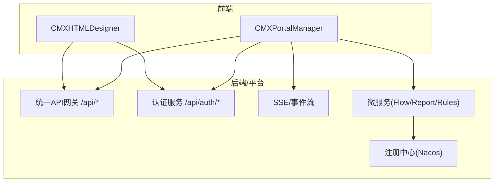
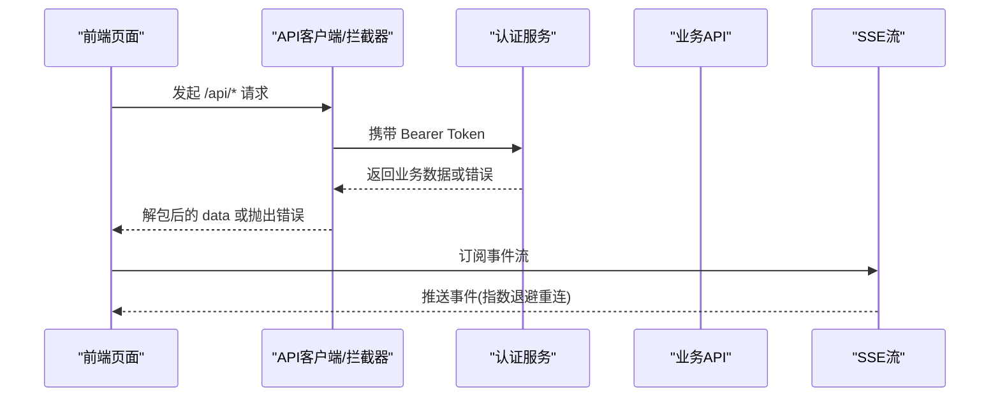
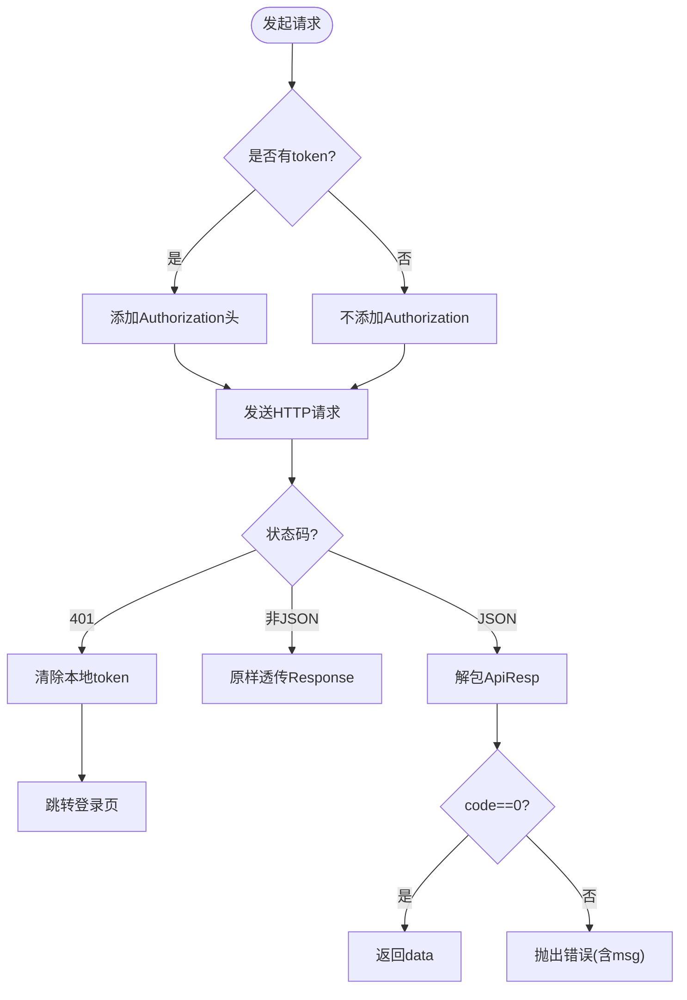
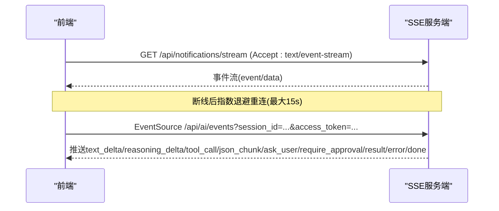
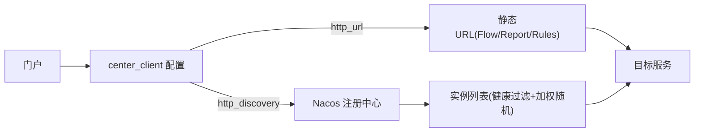
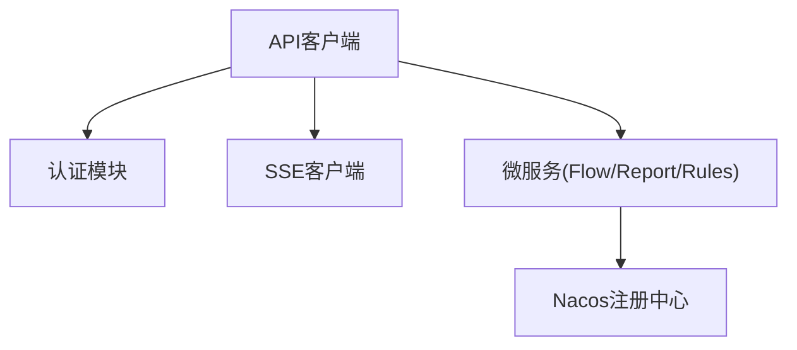

# 第三方系统集成

<cite>
**本文引用的文件**
- [CMXPortalManager/src/lib/api-client.js](file://CMXPortalManager/src/lib/api-client.js)
- [CMXPortalManager/src/lib/auth.js](file://CMXPortalManager/src/lib/auth.js)
- [CMXHTMLDesigner/src/lib/api-client.js](file://CMXHTMLDesigner/src/lib/api-client.js)
- [CMXHTMLDesigner/src/lib/auth.js](file://CMXHTMLDesigner/src/lib/auth.js)
- [CMXPortalManager/src/ai-workbench/services/sse-client.js](file://CMXPortalManager/src/ai-workbench/services/sse-client.js)
- [CMXPortalManager/src/api/notififications-api.js](file://CMXPortalManager/src/api/notififications-api.js)
- [documents/20260822_cmx-center-client_服务定位map化与微服务接入Nacos方案.md](file://documents/20260822_cmx-center-client_服务定位map化与微服务接入Nacos方案.md)
- [documents/20260822_cmx-后端_三类服务通信配置关系总结.md](file://documents/20260822_cmx-后端_三类服务通信配置关系总结.md)
- [documents/技术债/20260817_流程引擎_已知问题与技术债务.md](file://documents/技术债/20260817_流程引擎_已知问题与技术债务.md)
</cite>

## 目录
1. [简介](#简介)
2. [项目结构](#项目结构)
3. [核心组件](#核心组件)
4. [架构总览](#架构总览)
5. [详细组件分析](#详细组件分析)
6. [依赖关系分析](#依赖关系分析)
7. [性能考虑](#性能考虑)
8. [故障排查指南](#故障排查指南)
9. [结论](#结论)
10. [附录](#附录)

## 简介
本指南面向需要在企业门户中集成第三方系统的开发者，覆盖 API 客户端使用、认证机制、数据同步策略、外部服务/消息队列/文件存储集成、WebSocket/SSE 实时通信、OAuth 授权、微服务调用、常见集成场景（ERP、工作流、BI 嵌入）、错误处理与重试、以及性能优化策略。内容基于仓库内现有实现与设计方案进行提炼，确保可落地、可验证。

## 项目结构
本项目包含多个前端应用与文档：
- CMXPortalManager：门户主应用，提供统一 API 客户端、认证、通知 SSE、AI SSE 等能力。
- CMXHTMLDesigner：页面设计器，复用统一的 API 客户端与认证拦截器。
- documents：后端与平台级方案文档，涵盖微服务注册发现、服务间通信、事件分发等技术债与演进方案。

图表来源
- [CMXPortalManager/src/lib/api-client.js:1-259](file://CMXPortalManager/src/lib/api-client.js#L1-L259)
- [CMXHTMLDesigner/src/lib/api-client.js:1-245](file://CMXHTMLDesigner/src/lib/api-client.js#L1-L245)
- [CMXPortalManager/src/ai-workbench/services/sse-client.js:1-188](file://CMXPortalManager/src/ai-workbench/services/sse-client.js#L1-L188)
- [documents/20260822_cmx-center-client_服务定位map化与微服务接入Nacos方案.md:1-216](file://documents/20260822_cmx-center-client_服务定位map化与微服务接入Nacos方案.md#L1-L216)

章节来源
- [CMXPortalManager/src/lib/api-client.js:1-259](file://CMXPortalManager/src/lib/api-client.js#L1-L259)
- [CMXHTMLDesigner/src/lib/api-client.js:1-245](file://CMXHTMLDesigner/src/lib/api-client.js#L1-L245)

## 核心组件
- 统一 API 客户端：封装请求头注入、响应信封解包、401 跳转登录、跨域重写、全局 fetch 拦截器。
- 认证助手：登录/登出、当前用户获取、登录态检查、回跳登录。
- SSE/事件流：通知订阅、AI 事件流，具备指数退避重连与事件分发。
- 微服务与注册中心：通过 Nacos 进行服务发现与配置管理，支持静态 URL 与服务发现两种模式。

章节来源
- [CMXPortalManager/src/lib/api-client.js:1-259](file://CMXPortalManager/src/lib/api-client.js#L1-L259)
- [CMXPortalManager/src/lib/auth.js:1-121](file://CMXPortalManager/src/lib/auth.js#L1-L121)
- [CMXHTMLDesigner/src/lib/api-client.js:1-245](file://CMXHTMLDesigner/src/lib/api-client.js#L1-L245)
- [CMXHTMLDesigner/src/lib/auth.js:1-100](file://CMXHTMLDesigner/src/lib/auth.js#L1-L100)
- [CMXPortalManager/src/ai-workbench/services/sse-client.js:1-188](file://CMXPortalManager/src/ai-workbench/services/sse-client.js#L1-L188)
- [CMXPortalManager/src/api/notififications-api.js:1-117](file://CMXPortalManager/src/api/notififications-api.js#L1-L117)
- [documents/20260822_cmx-center-client_服务定位map化与微服务接入Nacos方案.md:1-216](file://documents/20260822_cmx-center-client_服务定位map化与微服务接入Nacos方案.md#L1-L216)

## 架构总览
系统采用“前端统一客户端 + 认证拦截 + SSE/REST + 微服务注册发现”的架构：
- 所有 /api/* 请求由全局拦截器自动注入 Authorization 并处理 401。
- 认证通过 /api/auth/* 完成，令牌持久化到 localStorage。
- 实时通信通过 SSE（EventSource 或 fetch 流）实现，具备断线重连与指数退避。
- 微服务通过 Nacos 注册发现，支持 http_url 与 http_discovery 两种模式。

图表来源
- [CMXPortalManager/src/lib/api-client.js:167-258](file://CMXPortalManager/src/lib/api-client.js#L167-L258)
- [CMXPortalManager/src/lib/auth.js:33-50](file://CMXPortalManager/src/lib/auth.js#L33-L50)
- [CMXPortalManager/src/ai-workbench/services/sse-client.js:63-95](file://CMXPortalManager/src/ai-workbench/services/sse-client.js#L63-L95)

## 详细组件分析

### API 客户端与认证
- 统一请求封装：自动设置 Accept/Content-Type，解析 ApiResp 信封 {code,msg,data}，成功返回 data，失败抛错。
- 全局拦截器：对同源 /api/* 注入 Authorization；401 时清除 token 并跳转登录页；非 JSON 透传；跨域时按 VITE_API_BASE 重写路径。
- 认证流程：登录调用 /api/auth/login，保存 access_token/refresh_token；登出调用 /api/auth/logout；获取当前用户 /api/auth/me。

图表来源
- [CMXPortalManager/src/lib/api-client.js:75-130](file://CMXPortalManager/src/lib/api-client.js#L75-L130)
- [CMXPortalManager/src/lib/api-client.js:167-258](file://CMXPortalManager/src/lib/api-client.js#L167-L258)
- [CMXPortalManager/src/lib/auth.js:33-50](file://CMXPortalManager/src/lib/auth.js#L33-L50)

章节来源
- [CMXPortalManager/src/lib/api-client.js:1-259](file://CMXPortalManager/src/lib/api-client.js#L1-L259)
- [CMXPortalManager/src/lib/auth.js:1-121](file://CMXPortalManager/src/lib/auth.js#L1-L121)
- [CMXHTMLDesigner/src/lib/api-client.js:1-245](file://CMXHTMLDesigner/src/lib/api-client.js#L1-L245)
- [CMXHTMLDesigner/src/lib/auth.js:1-100](file://CMXHTMLDesigner/src/lib/auth.js#L1-L100)

### 实时通信（SSE/WebSocket）
- 通知中心 SSE：通过 fetch + ReadableStream 订阅 /api/notifications/stream，解析 text/event-stream，支持指数退避重连。
- AI 事件流：使用 EventSource 连接 /api/ai/events?session_id=...&access_token=...，兼容 event 字段在 data 中的两种后端实现，提供 on/off/close 与通配符监听。

图表来源
- [CMXPortalManager/src/api/notififications-api.js:56-116](file://CMXPortalManager/src/api/notififications-api.js#L56-L116)
- [CMXPortalManager/src/ai-workbench/services/sse-client.js:44-95](file://CMXPortalManager/src/ai-workbench/services/sse-client.js#L44-L95)

章节来源
- [CMXPortalManager/src/api/notififications-api.js:1-117](file://CMXPortalManager/src/api/notififications-api.js#L1-L117)
- [CMXPortalManager/src/ai-workbench/services/sse-client.js:1-188](file://CMXPortalManager/src/ai-workbench/services/sse-client.js#L1-L188)

### 微服务集成与注册发现
- 服务模式：支持 http_url（静态基址）与 http_discovery（Nacos 服务名）两种模式，新增微服务仅需在 toml 增加键值。
- 注册中心：通过环境变量 SERVICE_REGISTRY_* / NACOS_* 控制注册与配置中心；三独立服务（Flow/Report/Rules）可接入 Nacos，create 阶段强依赖失败则中止启动。
- 反代与导入：门户通过 center_client 将请求转发至目标服务；导入器支持 HTTP/gRPC 传输。

图表来源
- [documents/20260822_cmx-center-client_服务定位map化与微服务接入Nacos方案.md:21-55](file://documents/20260822_cmx-center-client_服务定位map化与微服务接入Nacos方案.md#L21-L55)
- [documents/20260822_cmx-center-client_服务定位map化与微服务接入Nacos方案.md:106-123](file://documents/20260822_cmx-center-client_服务定位map化与微服务接入Nacos方案.md#L106-L123)
- [documents/20260822_cmx-后端_三类服务通信配置关系总结.md:1-91](file://documents/20260822_cmx-后端_三类服务通信配置关系总结.md#L1-L91)

章节来源
- [documents/20260822_cmx-center-client_服务定位map化与微服务接入Nacos方案.md:1-216](file://documents/20260822_cmx-center-client_服务定位map化与微服务接入Nacos方案.md#L1-L216)
- [documents/20260822_cmx-后端_三类服务通信配置关系总结.md:1-91](file://documents/20260822_cmx-后端_三类服务通信配置关系总结.md#L1-L91)

### OAuth 授权与令牌刷新
- 当前实现为 Bearer Token（JWT）方式，登录成功后写入 access_token/refresh_token。
- 建议扩展：在认证模块中增加 refresh 逻辑，当 access_token 过期时自动换取新令牌，并在后续请求中更新 Authorization 头。
- 安全建议：避免在 URL 中明文传递敏感参数；SSE 中通过 query 传递 access_token 需配合白名单与最小权限原则。

章节来源
- [CMXPortalManager/src/lib/auth.js:33-50](file://CMXPortalManager/src/lib/auth.js#L33-L50)
- [CMXPortalManager/src/ai-workbench/services/sse-client.js:4-6](file://CMXPortalManager/src/ai-workbench/services/sse-client.js#L4-L6)

### 数据同步策略
- 增量同步：利用 SSE 事件流实现近实时更新（如通知、AI 生成结果）。
- 批量拉取：REST API 分页查询，结合缓存减少重复请求。
- 幂等与去重：下游接收事件时使用 eventId/version 去重与版本条件 upsert，保证顺序一致性与幂等性。

章节来源
- [documents/20260820_cmx-mdm_分发订阅模块原理与接口详解.md:448-450](file://documents/20260820_cmx-mdm_分发订阅模块原理与接口详解.md#L448-L450)

### 常见集成场景示例
- ERP 系统对接：通过 REST API 拉取主数据与单据，使用统一客户端注入鉴权；对大对象下载使用 rawResponse 模式。
- 工作流引擎集成：通过 center_client 反向代理或 gRPC 调用 Flow 服务；事件回调需签名校验与订阅过滤。
- BI 工具嵌入：通过 iframe 或嵌入式 SDK 加载报表页面，使用单点登录（SSO）与 token 透传；报表导出走文件流。

[本节为概念性说明，不直接分析具体文件]

## 依赖关系分析
- 前端依赖：统一 API 客户端与认证模块被多处页面与组件引用；SSE 客户端依赖 getToken 获取令牌。
- 后端依赖：微服务通过 Nacos 注册发现；配置中心远程 toml 热更；gRPC 与 HTTP 并存，导入器与反代分别走不同通道。

图表来源
- [CMXPortalManager/src/lib/api-client.js:167-258](file://CMXPortalManager/src/lib/api-client.js#L167-L258)
- [CMXPortalManager/src/ai-workbench/services/sse-client.js:26-27](file://CMXPortalManager/src/ai-workbench/services/sse-client.js#L26-L27)
- [documents/20260822_cmx-center-client_服务定位map化与微服务接入Nacos方案.md:106-123](file://documents/20260822_cmx-center-client_服务定位map化与微服务接入Nacos方案.md#L106-L123)

章节来源
- [CMXPortalManager/src/lib/api-client.js:1-259](file://CMXPortalManager/src/lib/api-client.js#L1-L259)
- [CMXPortalManager/src/ai-workbench/services/sse-client.js:1-188](file://CMXPortalManager/src/ai-workbench/services/sse-client.js#L1-L188)
- [documents/20260822_cmx-center-client_服务定位map化与微服务接入Nacos方案.md:1-216](file://documents/20260822_cmx-center-client_服务定位map化与微服务接入Nacos方案.md#L1-L216)

## 性能考虑
- 请求合并与缓存：对热点数据使用内存缓存或浏览器缓存，减少重复请求。
- SSE 重连策略：指数退避上限 15s，避免风暴式重连。
- 微服务发现：预热服务实例缓存，消除首次调用冷启动延迟。
- 大文件下载：使用 rawResponse 模式，避免二次序列化开销。

[本节提供通用指导，不直接分析具体文件]

## 故障排查指南
- 401 未授权：检查 token 是否存在且有效；确认全局拦截器是否生效；查看是否误将 auth 端点当作普通 API。
- SSE 断连：检查网络与服务器状态；确认事件流是否正确解析；观察重连日志与退避间隔。
- 微服务不可达：确认 Nacos 实例健康状态；检查 center_client 配置 mode 与键值；查看启动日志中已挂反代目标清单。
- 事件丢失：确认下游是否做 eventId/version 去重；检查串行投递与死信重发场景。

章节来源
- [CMXPortalManager/src/lib/api-client.js:103-108](file://CMXPortalManager/src/lib/api-client.js#L103-L108)
- [CMXPortalManager/src/api/notififications-api.js:72-80](file://CMXPortalManager/src/api/notififications-api.js#L72-L80)
- [documents/技术债/20260817_流程引擎_已知问题与技术债务.md:58-80](file://documents/技术债/20260817_流程引擎_已知问题与技术债务.md#L58-L80)

## 结论
本指南基于仓库现有实现，提供了从 API 客户端、认证、实时通信到微服务集成的完整方案。通过统一客户端与拦截器简化了鉴权与错误处理；SSE 实现了稳定的实时推送；Nacos 注册发现支撑了灵活的微服务路由。建议在后续迭代中完善 OAuth 刷新机制、增强重试与熔断策略，并持续优化性能与可观测性。

[本节为总结性内容，不直接分析具体文件]

## 附录
- 环境配置：VITE_API_BASE、SERVICE_REGISTRY_*、NACOS_* 等变量用于前后端部署与微服务注册。
- 最佳实践：
  - 始终使用统一 API 客户端发起请求，避免绕过拦截器。
  - SSE 连接需做好资源释放与异常捕获。
  - 微服务配置变更应通过配置中心热更，避免重启。
  - 对第三方系统调用增加超时与重试，避免雪崩。

[本节为补充信息，不直接分析具体文件]