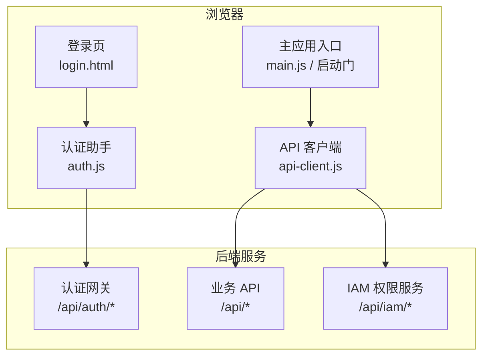
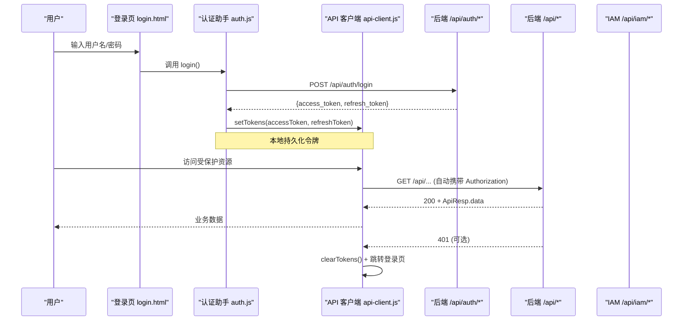
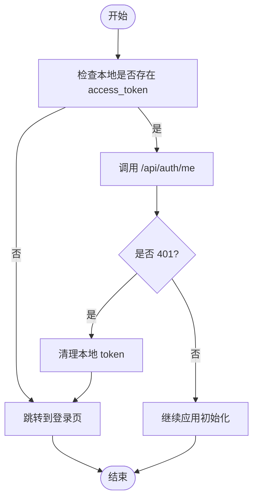
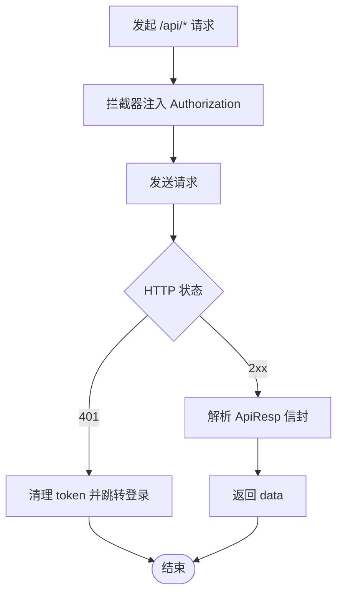
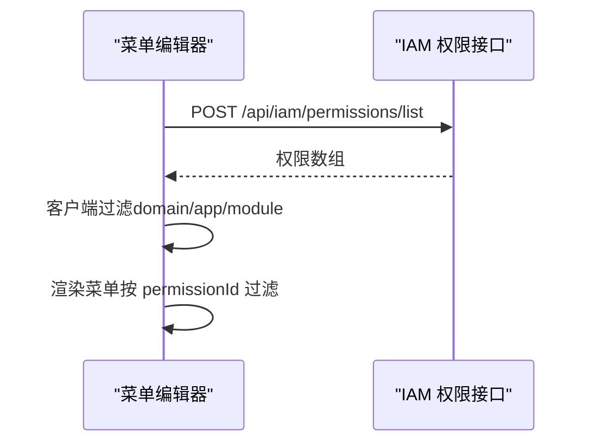
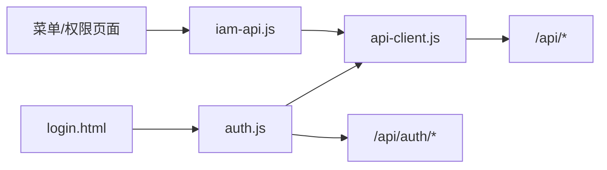

# 认证授权集成

<cite>
**本文引用的文件**
- [CMXHTMLDesigner/src/lib/auth.js](file://CMXHTMLDesigner/src/lib/auth.js)
- [CMXPortalManager/src/lib/auth.js](file://CMXPortalManager/src/lib/auth.js)
- [CMXHTMLDesigner/src/lib/api-client.js](file://CMXHTMLDesigner/src/lib/api-client.js)
- [CMXPortalManager/src/lib/api-client.js](file://CMXPortalManager/src/lib/api-client.js)
- [CMXPortalManager/src/api/iam-api.js](file://CMXPortalManager/src/api/iam-api.js)
- [CMXHTMLDesigner/login.html](file://CMXHTMLDesigner/login.html)
- [CMXPortalManager/login.html](file://CMXPortalManager/login.html)
</cite>

## 目录
1. [简介](#简介)
2. [项目结构](#项目结构)
3. [核心组件](#核心组件)
4. [架构总览](#架构总览)
5. [详细组件分析](#详细组件分析)
6. [依赖关系分析](#依赖关系分析)
7. [性能与安全考量](#性能与安全考量)
8. [故障排查指南](#故障排查指南)
9. [结论](#结论)
10. [附录](#附录)

## 简介
本指南面向企业门户与开发设计器的认证授权集成，聚焦以下目标：
- 说明基于 Bearer Token（JWT）的无状态鉴权流程、登录/登出与会话管理。
- 解释如何对接外部身份提供商（OAuth 2.0、OIDC、SAML、LDAP），并给出前后端协作要点。
- 说明用户权限验证、角色管理与访问控制列表（ACL）在前端的落地方式。
- 提供单点登录（SSO）与多租户认证的集成思路与注意事项。
- 总结安全最佳实践：令牌刷新、会话超时处理、跨域认证配置等。

## 项目结构
本项目包含两个前端应用：
- CMXHTMLDesigner：页面设计与调试工具，具备独立的登录页与认证模块。
- CMXPortalManager：企业门户主应用，具备统一的认证、权限与菜单能力。

两者共享相同的认证协议与后端接口约定：
- 统一通过 /api/auth/* 进行登录、登出、获取当前用户等操作。
- 统一通过全局拦截器为 /api/* 请求注入 Authorization: Bearer <token>，并在 401 时跳转登录页。
- 统一使用 ApiResp 信封 { code, msg, data } 作为响应规范。

图表来源
- [CMXHTMLDesigner/src/lib/auth.js:1-100](file://CMXHTMLDesigner/src/lib/auth.js#L1-L100)
- [CMXPortalManager/src/lib/auth.js:1-121](file://CMXPortalManager/src/lib/auth.js#L1-L121)
- [CMXHTMLDesigner/src/lib/api-client.js:1-245](file://CMXHTMLDesigner/src/lib/api-client.js#L1-L245)
- [CMXPortalManager/src/lib/api-client.js:22-77](file://CMXPortalManager/src/lib/api-client.js#L22-L77)
- [CMXPortalManager/src/api/iam-api.js:1-50](file://CMXPortalManager/src/api/iam-api.js#L1-L50)

章节来源
- [CMXHTMLDesigner/src/lib/auth.js:1-100](file://CMXHTMLDesigner/src/lib/auth.js#L1-L100)
- [CMXPortalManager/src/lib/auth.js:1-121](file://CMXPortalManager/src/lib/auth.js#L1-L121)
- [CMXHTMLDesigner/src/lib/api-client.js:1-245](file://CMXHTMLDesigner/src/lib/api-client.js#L1-L245)
- [CMXPortalManager/src/lib/api-client.js:22-77](file://CMXPortalManager/src/lib/api-client.js#L22-L77)
- [CMXPortalManager/src/api/iam-api.js:1-50](file://CMXPortalManager/src/api/iam-api.js#L1-L50)

## 核心组件
- 认证助手 auth.js
  - 负责调用 /api/auth/login、/api/auth/logout、/api/auth/me。
  - 登录后写入 access_token 与 refresh_token；登出时清理本地 token。
  - 提供 requireAuthOrRedirect 作为应用启动门，未登录则跳转登录页。
- 统一 API 客户端 api-client.js
  - 自动注入 Authorization: Bearer <token>。
  - 解析 ApiResp 信封，code===0 返回 data，否则抛错。
  - 401 时清除本地 token 并跳转登录页；支持跨域重写 API_BASE。
  - 提供 installAuthFetchInterceptor 全局拦截所有 /api/* 请求。
- IAM 权限接口 iam-api.js
  - 封装 /api/iam/permissions/list，用于拉取菜单类权限（功能码）。
  - 在客户端做大小写不敏感的软过滤，回退全量并标记 _unfiltered。

章节来源
- [CMXHTMLDesigner/src/lib/auth.js:1-100](file://CMXHTMLDesigner/src/lib/auth.js#L1-L100)
- [CMXPortalManager/src/lib/auth.js:1-121](file://CMXPortalManager/src/lib/auth.js#L1-L121)
- [CMXHTMLDesigner/src/lib/api-client.js:1-245](file://CMXHTMLDesigner/src/lib/api-client.js#L1-L245)
- [CMXPortalManager/src/lib/api-client.js:22-77](file://CMXPortalManager/src/lib/api-client.js#L22-L77)
- [CMXPortalManager/src/api/iam-api.js:1-50](file://CMXPortalManager/src/api/iam-api.js#L1-L50)

## 架构总览
下图展示从登录到访问受保护资源的完整链路，包括令牌注入、401 处理与权限数据加载。

图表来源
- [CMXHTMLDesigner/src/lib/auth.js:33-46](file://CMXHTMLDesigner/src/lib/auth.js#L33-L46)
- [CMXPortalManager/src/lib/auth.js:33-50](file://CMXPortalManager/src/lib/auth.js#L33-L50)
- [CMXHTMLDesigner/src/lib/api-client.js:75-122](file://CMXHTMLDesigner/src/lib/api-client.js#L75-L122)
- [CMXHTMLDesigner/src/lib/api-client.js:167-245](file://CMXHTMLDesigner/src/lib/api-client.js#L167-L245)

## 详细组件分析

### 登录与令牌生命周期
- 登录流程
  - 登录页提交表单，调用 auth.login，向 /api/auth/login 发送 username/password/device_type/device_id。
  - 成功后将 access_token 与 refresh_token 写入 localStorage。
  - PortalManager 在登录后还会同步 cmx_user_id/cmx_username，供待办中心等按人过滤的场景使用。
- 登出流程
  - 调用 /api/auth/logout 使服务端令牌失效，随后清理本地 token 与用户标识。
- 当前用户信息
  - 通过 /api/auth/me 获取当前用户详情；若 401 则清理本地态并返回 null。
- 启动门
  - requireAuthOrRedirect 在未登录时直接跳转登录页并中止后续启动。

图表来源
- [CMXHTMLDesigner/src/lib/auth.js:64-99](file://CMXHTMLDesigner/src/lib/auth.js#L64-L99)
- [CMXPortalManager/src/lib/auth.js:57-121](file://CMXPortalManager/src/lib/auth.js#L57-L121)

章节来源
- [CMXHTMLDesigner/src/lib/auth.js:33-99](file://CMXHTMLDesigner/src/lib/auth.js#L33-L99)
- [CMXPortalManager/src/lib/auth.js:33-121](file://CMXPortalManager/src/lib/auth.js#L33-L121)

### 全局请求拦截与跨域配置
- 自动鉴权注入
  - installAuthFetchInterceptor 对所有 /api/* 请求自动附加 Authorization: Bearer <token>。
  - 对 /api/auth/* 不做强制注入，避免登录/刷新循环。
- 401 统一处理
  - 非认证端点收到 401 时，清理本地 token 并跳转登录页。
- 跨域重写
  - 通过环境变量 VITE_API_BASE 将相对路径 /api/* 重写至后端域名，便于前后端不同源部署。
- ApiResp 信封透明处理
  - 成功时返回 data；业务错误映射为非 2xx 并保留错误消息，便于消费者读取。

图表来源
- [CMXHTMLDesigner/src/lib/api-client.js:167-245](file://CMXHTMLDesigner/src/lib/api-client.js#L167-L245)
- [CMXPortalManager/src/lib/api-client.js:22-77](file://CMXPortalManager/src/lib/api-client.js#L22-L77)

章节来源
- [CMXHTMLDesigner/src/lib/api-client.js:75-122](file://CMXHTMLDesigner/src/lib/api-client.js#L75-L122)
- [CMXHTMLDesigner/src/lib/api-client.js:167-245](file://CMXHTMLDesigner/src/lib/api-client.js#L167-L245)
- [CMXPortalManager/src/lib/api-client.js:22-77](file://CMXPortalManager/src/lib/api-client.js#L22-L77)

### 权限与访问控制（ACL）
- 权限数据获取
  - 通过 /api/iam/permissions/list 拉取菜单类权限（功能码），用于菜单管理或前端权限判断。
- 客户端过滤策略
  - 先拉全量，再在客户端做大小写不敏感过滤；若无匹配则回退全量并标记 _unfiltered，提示 UI。
- 菜单项权限控制
  - 菜单节点可绑定 permissionId，渲染时根据上下文中的权限集合决定是否显示。

图表来源
- [CMXPortalManager/src/api/iam-api.js:10-48](file://CMXPortalManager/src/api/iam-api.js#L10-L48)

章节来源
- [CMXPortalManager/src/api/iam-api.js:1-50](file://CMXPortalManager/src/api/iam-api.js#L1-L50)

### 单点登录（SSO）与外部身份提供商集成
- OAuth 2.0 / OIDC 集成要点
  - 前端通过 /api/auth/login 完成认证后，由后端签发 access_token/refresh_token。
  - 若需对接外部 IdP，可在后端实现授权码流或隐式流，并将结果转换为平台内部令牌。
  - 前端无需直接持有 IdP 的 state/nonce，仅关注平台令牌生命周期。
- SAML 集成要点
  - 通常由后端作为 SP 接收 SAML Response，校验签名后建立会话并签发平台令牌。
  - 前端通过 /api/auth/me 确认登录态，后续请求由拦截器自动携带令牌。
- LDAP 集成要点
  - 后端校验 LDAP 凭据后签发平台令牌；前端行为与本地账号一致。
- 跨域与 Cookie 注意
  - 若采用 Cookie Session 模式，需正确配置 SameSite、Secure、Domain、Path。
  - 本项目以 Bearer Token 为主，跨域通过 VITE_API_BASE 重写请求地址。

[本节为概念性指导，不直接分析具体代码文件]

### 多租户认证
- 前端层面
  - 当前实现以用户级令牌为主；多租户上下文通常由后端从 JWT claim 或请求头解析。
- 后端层面
  - 建议在令牌中携带 tenant_id，或在请求头传递 X-Tenant，以便后端路由到对应租户上下文。
- 注意事项
  - 避免在 URL 中暴露租户标识；优先使用请求头或令牌声明。
  - 确保权限数据（如菜单、功能码）按租户隔离。

[本节为概念性指导，不直接分析具体代码文件]

## 依赖关系分析
- 登录页 login.html 引入 src/login.js，调用 auth.login 完成认证。
- auth.js 依赖 api-client.js 的 setTokens/clearTokens/getToken/LOGIN_PATH。
- api-client.js 提供全局拦截器，影响所有 /api/* 请求。
- iam-api.js 依赖全局拦截器自动鉴权，简化权限数据获取。

图表来源
- [CMXHTMLDesigner/login.html:365-420](file://CMXHTMLDesigner/login.html#L365-L420)
- [CMXPortalManager/login.html:365-420](file://CMXPortalManager/login.html#L365-L420)
- [CMXHTMLDesigner/src/lib/auth.js:1-100](file://CMXHTMLDesigner/src/lib/auth.js#L1-L100)
- [CMXPortalManager/src/lib/auth.js:1-121](file://CMXPortalManager/src/lib/auth.js#L1-L121)
- [CMXHTMLDesigner/src/lib/api-client.js:1-245](file://CMXHTMLDesigner/src/lib/api-client.js#L1-L245)
- [CMXPortalManager/src/api/iam-api.js:1-50](file://CMXPortalManager/src/api/iam-api.js#L1-L50)

章节来源
- [CMXHTMLDesigner/login.html:365-420](file://CMXHTMLDesigner/login.html#L365-L420)
- [CMXPortalManager/login.html:365-420](file://CMXPortalManager/login.html#L365-L420)
- [CMXHTMLDesigner/src/lib/auth.js:1-100](file://CMXHTMLDesigner/src/lib/auth.js#L1-L100)
- [CMXPortalManager/src/lib/auth.js:1-121](file://CMXPortalManager/src/lib/auth.js#L1-L121)
- [CMXHTMLDesigner/src/lib/api-client.js:1-245](file://CMXHTMLDesigner/src/lib/api-client.js#L1-L245)
- [CMXPortalManager/src/api/iam-api.js:1-50](file://CMXPortalManager/src/api/iam-api.js#L1-L50)

## 性能与安全考量
- 性能
  - 全局拦截器仅在首次安装一次，避免重复开销。
  - 权限数据建议缓存并按需刷新，减少频繁拉取。
  - 跨域重写仅在构建期配置，运行时零额外成本。
- 安全
  - 令牌存储于 localStorage，注意 XSS 防护；避免将敏感信息写入 URL。
  - 401 统一处理，防止泄露业务细节；错误消息最小化。
  - 跨域场景启用 HTTPS，合理设置 CORS 白名单与凭证策略。
  - 令牌刷新策略：当 access_token 过期时，优先使用 refresh_token 刷新；失败则引导重新登录。
  - 会话超时：结合后端令牌有效期与前端空闲检测，主动清理本地态。

[本节为通用指导，不直接分析具体代码文件]

## 故障排查指南
- 无法登录或登录后立即跳回登录页
  - 检查 /api/auth/login 响应是否包含 access_token/refresh_token。
  - 确认 api-client 已安装全局拦截器且 LOGIN_PATH 正确。
  - 查看浏览器控制台是否有 401 或网络错误。
- 401 风暴或反复跳转
  - 检查是否在登录页仍触发 401 处理；确保 /api/auth/* 不被强制注入 token。
  - 避免在 redirect 参数中叠加编码，参考 api-client 的防回环逻辑。
- 权限列表为空
  - 确认 /api/iam/permissions/list 返回数据；检查 domain/app/module 过滤条件大小写。
  - 若客户端过滤结果为空，应回退全量并提示 _unfiltered。
- 跨域请求失败
  - 检查 VITE_API_BASE 是否正确指向后端域名。
  - 确认后端 CORS 允许前端 origin、方法与头部。

章节来源
- [CMXHTMLDesigner/src/lib/api-client.js:75-122](file://CMXHTMLDesigner/src/lib/api-client.js#L75-L122)
- [CMXHTMLDesigner/src/lib/api-client.js:167-245](file://CMXHTMLDesigner/src/lib/api-client.js#L167-L245)
- [CMXPortalManager/src/lib/api-client.js:22-77](file://CMXPortalManager/src/lib/api-client.js#L22-L77)
- [CMXPortalManager/src/api/iam-api.js:10-48](file://CMXPortalManager/src/api/iam-api.js#L10-L48)

## 结论
本项目采用基于 Bearer Token 的无状态鉴权方案，配合全局拦截器与统一信封响应，实现了简洁一致的认证与授权体验。通过 /api/auth/* 与 /api/iam/* 的清晰分工，前端可专注于用户体验与权限展示，后端负责身份核验与权限计算。对于外部 IdP、SSO 与多租户场景，建议在后端集中实现，前端保持最小改动。遵循令牌刷新、会话超时与跨域配置的最佳实践，可进一步提升安全性与稳定性。

## 附录
- 关键接口约定
  - 登录：POST /api/auth/login
  - 登出：POST /api/auth/logout
  - 当前用户：GET /api/auth/me
  - 权限列表：POST /api/iam/permissions/list
- 环境变量
  - VITE_API_BASE：后端 API 基础地址（跨域时使用）
  - BASE_URL：应用基础路径（影响登录页跳转）

[本节为补充信息，不直接分析具体代码文件]