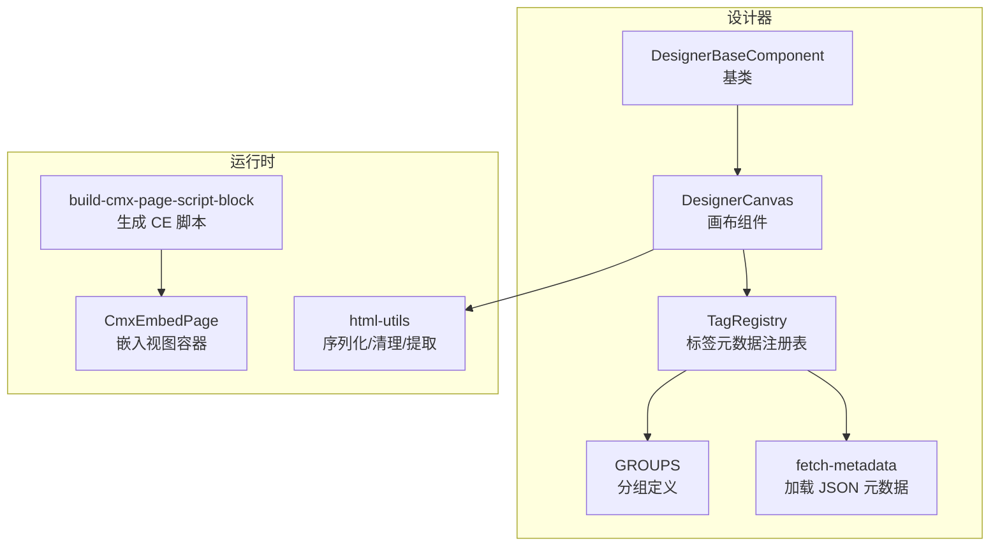
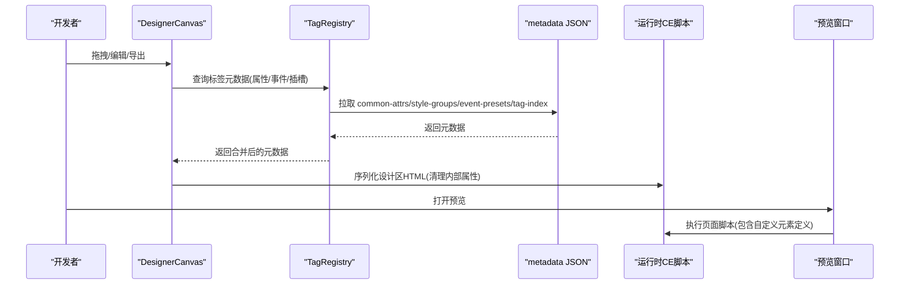
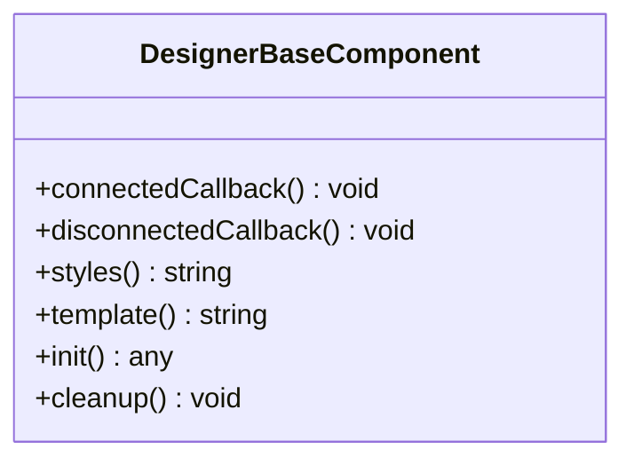
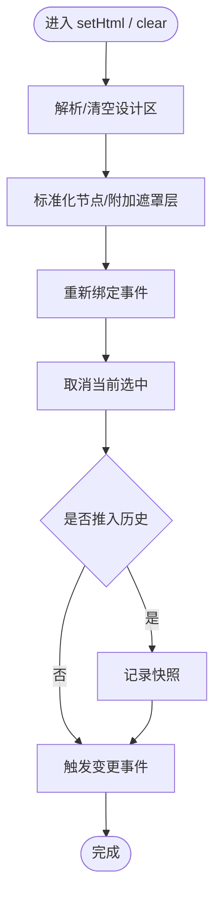
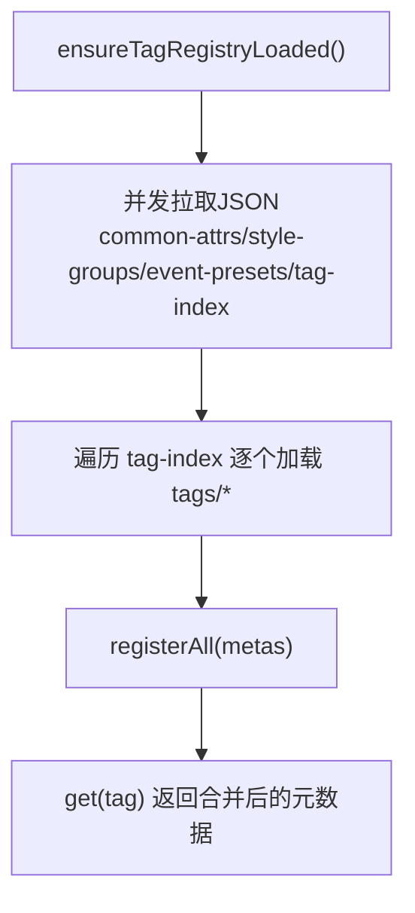
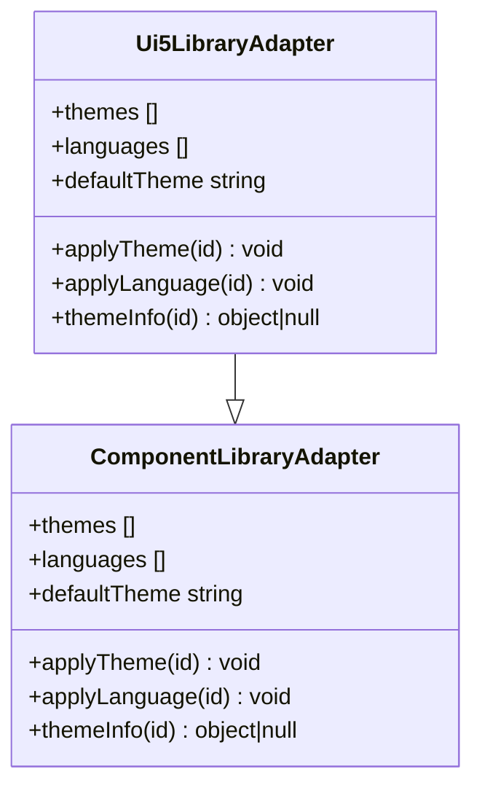
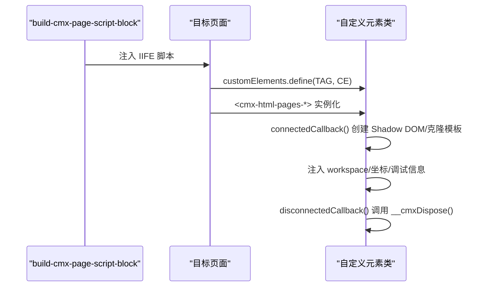
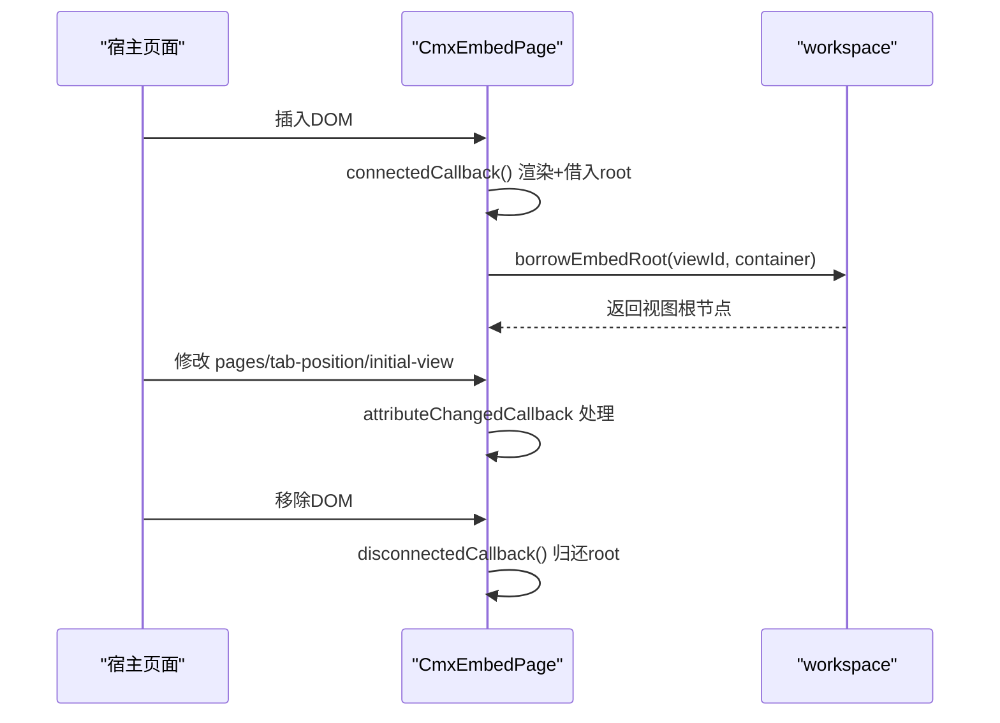
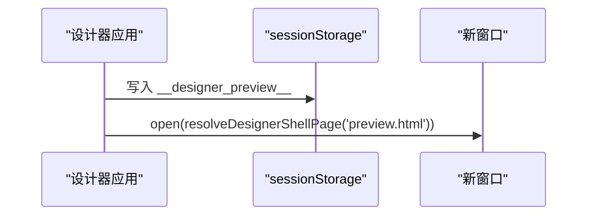
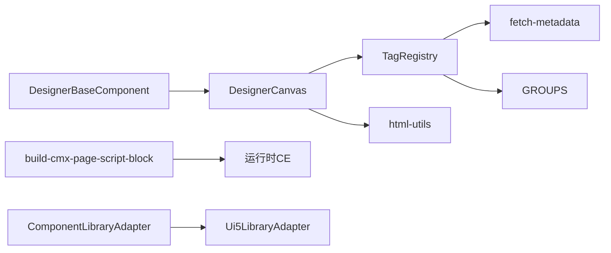

# Web Components 基础

<cite>
**本文引用的文件**
- [designer-base-component.js](file://CMXHTMLDesigner/src/components/designer-base-component.js)
- [tag-registry.js](file://CMXHTMLDesigner/src/metadata/tag-registry.js)
- [fetch-metadata.js](file://CMXHTMLDesigner/src/metadata/fetch-metadata.js)
- [groups.js](file://CMXHTMLDesigner/src/metadata/groups.js)
- [component-library-adapter.js](file://CMXHTMLDesigner/src/lib/component-library-adapter.js)
- [ui5-library-adapter.js](file://CMXHTMLDesigner/src/lib/ui5-library-adapter.js)
- [designer-canvas.js](file://CMXHTMLDesigner/src/components/designer-canvas.js)
- [html-utils.js](file://CMXHTMLDesigner/src/utils/html-utils.js)
- [build-cmx-page-script-block.js](file://CMXHTMLDesigner/src/utils/build-cmx-page-script-block.js)
- [designer-preview.js](file://CMXHTMLDesigner/src/components/designer-app/designer-preview.js)
- [designer-shell-url.js](file://CMXHTMLDesigner/src/utils/designer-shell-url.js)
- [a.json](file://CMXHTMLDesigner/src/metadata/tags/a.json)
- [cmx-embed-page.js](file://packages/cmx-data-comp/src/components/cmx-embed-page.js)
</cite>

## 目录
1. [简介](#简介)
2. [项目结构](#项目结构)
3. [核心组件](#核心组件)
4. [架构总览](#架构总览)
5. [详细组件分析](#详细组件分析)
6. [依赖关系分析](#依赖关系分析)
7. [性能考虑](#性能考虑)
8. [故障排查指南](#故障排查指南)
9. [结论](#结论)
10. [附录：从基础到复杂交互的示例路径](#附录从基础到复杂交互的示例路径)

## 简介
本文件系统性梳理 CMX 平台中 Web Components 标准的应用方式，覆盖自定义元素定义、生命周期管理、属性绑定与事件处理机制；说明组件注册流程、模板渲染与样式隔离；并阐述组件如何与元数据驱动集成，为设计器提供组件预览与属性面板支持。文档同时给出从基础组件到复杂交互组件的开发路径与参考实现位置。

## 项目结构
CMX 前端在“设计器”和“运行时”两个层面使用 Web Components：
- 设计器侧：通过基类封装 Shadow DOM、模板与生命周期，配合标签元数据注册表，支撑拖拽、画布编辑、属性过滤与导出。
- 运行时代码：通过脚本块动态生成自定义元素类，并在页面中以自定义标签形式挂载，实现模板克隆与生命周期钩子。

图表来源
- [designer-base-component.js:12-38](file://CMXHTMLDesigner/src/components/designer-base-component.js#L12-L38)
- [designer-canvas.js:50-176](file://CMXHTMLDesigner/src/components/designer-canvas.js#L50-L176)
- [tag-registry.js:15-149](file://CMXHTMLDesigner/src/metadata/tag-registry.js#L15-L149)
- [fetch-metadata.js:1-21](file://CMXHTMLDesigner/src/metadata/fetch-metadata.js#L1-L21)
- [groups.js:5-32](file://CMXHTMLDesigner/src/metadata/groups.js#L5-L32)
- [build-cmx-page-script-block.js:75-312](file://CMXHTMLDesigner/src/utils/build-cmx-page-script-block.js#L75-L312)
- [html-utils.js:58-121](file://CMXHTMLDesigner/src/utils/html-utils.js#L58-L121)
- [cmx-embed-page.js:160-217](file://packages/cmx-data-comp/src/components/cmx-embed-page.js#L160-L217)

章节来源
- [designer-base-component.js:12-38](file://CMXHTMLDesigner/src/components/designer-base-component.js#L12-L38)
- [designer-canvas.js:50-176](file://CMXHTMLDesigner/src/components/designer-canvas.js#L50-L176)
- [tag-registry.js:15-149](file://CMXHTMLDesigner/src/metadata/tag-registry.js#L15-L149)
- [fetch-metadata.js:1-21](file://CMXHTMLDesigner/src/metadata/fetch-metadata.js#L1-L21)
- [groups.js:5-32](file://CMXHTMLDesigner/src/metadata/groups.js#L5-L32)
- [build-cmx-page-script-block.js:75-312](file://CMXHTMLDesigner/src/utils/build-cmx-page-script-block.js#L75-L312)
- [html-utils.js:58-121](file://CMXHTMLDesigner/src/utils/html-utils.js#L58-L121)
- [cmx-embed-page.js:160-217](file://packages/cmx-data-comp/src/components/cmx-embed-page.js#L160-L217)

## 核心组件
- 设计器基类：统一 Shadow DOM 注入、模板渲染与生命周期（connectedCallback/disconnectedCallback），子类只需实现 styles/template/init/cleanup。
- 画布组件：承载设计区，负责节点选择、拖放、缩放、对齐、撤销重做、事件绑定与 HTML 序列化导出。
- 标签元数据注册表：集中管理标签分组、属性、样式组、事件预设与默认初始化逻辑，运行时按需拉取 JSON。
- 组件库适配层：抽象主题/语言切换能力，UI5 具体实现通过全局运行时 API 生效。
- 运行时脚本生成：将页面模板与坐标上下文打包成可执行的自定义元素脚本，在页面中动态 define 并使用。
- 嵌入视图容器：以 Web Components 形式借入 workspace 的视图 root，支持多视图 Tab 切换与占位提示。

章节来源
- [designer-base-component.js:12-38](file://CMXHTMLDesigner/src/components/designer-base-component.js#L12-L38)
- [designer-canvas.js:50-176](file://CMXHTMLDesigner/src/components/designer-canvas.js#L50-L176)
- [tag-registry.js:15-149](file://CMXHTMLDesigner/src/metadata/tag-registry.js#L15-L149)
- [component-library-adapter.js:17-39](file://CMXHTMLDesigner/src/lib/component-library-adapter.js#L17-L39)
- [ui5-library-adapter.js:25-39](file://CMXHTMLDesigner/src/lib/ui5-library-adapter.js#L25-L39)
- [build-cmx-page-script-block.js:75-312](file://CMXHTMLDesigner/src/utils/build-cmx-page-script-block.js#L75-L312)
- [cmx-embed-page.js:160-217](file://packages/cmx-data-comp/src/components/cmx-embed-page.js#L160-L217)

## 架构总览
下图展示“设计器 → 元数据 → 画布 → 运行时”的完整链路，以及预览窗口的打开流程。

图表来源
- [designer-canvas.js:110-176](file://CMXHTMLDesigner/src/components/designer-canvas.js#L110-L176)
- [tag-registry.js:120-149](file://CMXHTMLDesigner/src/metadata/tag-registry.js#L120-L149)
- [fetch-metadata.js:10-21](file://CMXHTMLDesigner/src/metadata/fetch-metadata.js#L10-L21)
- [html-utils.js:58-96](file://CMXHTMLDesigner/src/utils/html-utils.js#L58-L96)
- [designer-preview.js:14-26](file://CMXHTMLDesigner/src/components/designer-app/designer-preview.js#L14-L26)
- [build-cmx-page-script-block.js:75-312](file://CMXHTMLDesigner/src/utils/build-cmx-page-script-block.js#L75-L312)

## 详细组件分析

### 设计器基类 DesignerBaseComponent
- 职责：封装 Shadow DOM 创建、样式注入、模板渲染与生命周期钩子；保证 connectedCallback 幂等。
- 关键点：
  - 首次连接时 attachShadow 并注入 style + template。
  - init 支持异步，错误被捕获并输出日志。
  - disconnectedCallback 调用 cleanup 释放外部副作用。

图表来源
- [designer-base-component.js:12-38](file://CMXHTMLDesigner/src/components/designer-base-component.js#L12-L38)

章节来源
- [designer-base-component.js:12-38](file://CMXHTMLDesigner/src/components/designer-base-component.js#L12-L38)

### 画布组件 DesignerCanvas
- 职责：设计区交互（选择、拖放、缩放、对齐、网格）、撤销重做历史、事件绑定、HTML 序列化导出。
- 关键流程：
  - 初始化：构建工具栏、遮罩层、事件监听、属性过滤器（基于 TagRegistry）。
  - 拖放：dragover/drop 区分移动/复制，slot 区域高亮与归属判定。
  - 选择与覆盖层：根据选中元素计算 overlay 尺寸与手柄位置。
  - 导出：清理设计器内部属性，保留 data-bind-* 或 {{...}} 占位符用于运行时绑定。

图表来源
- [designer-canvas.js:206-227](file://CMXHTMLDesigner/src/components/designer-canvas.js#L206-L227)
- [designer-canvas.js:232-264](file://CMXHTMLDesigner/src/components/designer-canvas.js#L232-L264)
- [designer-canvas.js:531-608](file://CMXHTMLDesigner/src/components/designer-canvas.js#L531-L608)
- [html-utils.js:58-96](file://CMXHTMLDesigner/src/utils/html-utils.js#L58-L96)

章节来源
- [designer-canvas.js:50-176](file://CMXHTMLDesigner/src/components/designer-canvas.js#L50-L176)
- [designer-canvas.js:206-264](file://CMXHTMLDesigner/src/components/designer-canvas.js#L206-L264)
- [designer-canvas.js:531-608](file://CMXHTMLDesigner/src/components/designer-canvas.js#L531-L608)
- [html-utils.js:58-96](file://CMXHTMLDesigner/src/utils/html-utils.js#L58-L96)

### 标签元数据注册表 TagRegistry
- 职责：统一管理标签分组、属性、样式组、事件预设与默认初始化；支持插件扩展组；运行时拉取 JSON 并注册。
- 关键点：
  - ensureTagRegistryLoaded：并发拉取 common-attrs、style-groups、event-presets、tag-index，再批量注册各标签元数据。
  - get(tag)：若未显式注册，回退到通用默认行为（含默认文本/属性/事件）。
  - _defaultSetupFromMeta：为元素设置默认属性、文本、样式与兜底内容。
  - _eventsFromMeta/_stylesFromMeta：按预设与声明聚合可用事件与样式组。

图表来源
- [tag-registry.js:120-149](file://CMXHTMLDesigner/src/metadata/tag-registry.js#L120-L149)
- [tag-registry.js:43-109](file://CMXHTMLDesigner/src/metadata/tag-registry.js#L43-L109)
- [fetch-metadata.js:10-21](file://CMXHTMLDesigner/src/metadata/fetch-metadata.js#L10-L21)

章节来源
- [tag-registry.js:15-149](file://CMXHTMLDesigner/src/metadata/tag-registry.js#L15-L149)
- [fetch-metadata.js:1-21](file://CMXHTMLDesigner/src/metadata/fetch-metadata.js#L1-L21)
- [groups.js:5-32](file://CMXHTMLDesigner/src/metadata/groups.js#L5-L32)

### 组件库适配层 ComponentLibraryAdapter 与 UI5 实现
- 抽象接口：themes/languages/defaultTheme/applyTheme/applyLanguage/themeInfo。
- UI5 实现：暴露主题列表与语言列表，通过 cmx-ui5-runtime 的全局运行时 API 切换主题与语言。

图表来源
- [component-library-adapter.js:17-39](file://CMXHTMLDesigner/src/lib/component-library-adapter.js#L17-L39)
- [ui5-library-adapter.js:25-39](file://CMXHTMLDesigner/src/lib/ui5-library-adapter.js#L25-L39)

章节来源
- [component-library-adapter.js:17-39](file://CMXHTMLDesigner/src/lib/component-library-adapter.js#L17-L39)
- [ui5-library-adapter.js:25-39](file://CMXHTMLDesigner/src/lib/ui5-library-adapter.js#L25-L39)

### 运行时脚本生成与自定义元素定义
- build-cmx-page-script-block：将模板 ID、运行时类名、坐标上下文等编译为 IIFE 脚本，内联定义一个继承自 HTMLElement 的自定义元素类，并在 connectedCallback 中 attachShadow、克隆模板、注入坐标与 workspace 引用；在 disconnectedCallback 中调用 __cmxDispose 进行清理。
- 该脚本由设计器/运行时注入到页面，确保同一标签只 define 一次。

图表来源
- [build-cmx-page-script-block.js:75-312](file://CMXHTMLDesigner/src/utils/build-cmx-page-script-block.js#L75-L312)

章节来源
- [build-cmx-page-script-block.js:75-312](file://CMXHTMLDesigner/src/utils/build-cmx-page-script-block.js#L75-L312)

### 嵌入视图容器 CmxEmbedPage
- 职责：以 Web Components 形式借入 workspace.embed 区定义的 html_pages 视图，支持多视图 Tab 切换与缺失视图占位。
- 生命周期：
  - connectedCallback：渲染骨架并借入所有视图 root。
  - attributeChangedCallback：pages/tab-position 变化触发重建；initial-view 仅切换可见 slot。
  - disconnectedCallback：归还所有借出的 root，清理状态。

图表来源
- [cmx-embed-page.js:160-217](file://packages/cmx-data-comp/src/components/cmx-embed-page.js#L160-L217)

章节来源
- [cmx-embed-page.js:160-217](file://packages/cmx-data-comp/src/components/cmx-embed-page.js#L160-L217)

### 设计器预览与页面壳 URL
- 预览：将当前设计体与依赖打包为包裹 HTML，写入 sessionStorage，并在新窗口打开 preview.html。
- 壳 URL：根据当前应用 base 路径解析同级的 preview.html/debug.html 绝对地址。

图表来源
- [designer-preview.js:14-26](file://CMXHTMLDesigner/src/components/designer-app/designer-preview.js#L14-L26)
- [designer-shell-url.js:5-20](file://CMXHTMLDesigner/src/utils/designer-shell-url.js#L5-L20)

章节来源
- [designer-preview.js:14-26](file://CMXHTMLDesigner/src/components/designer-app/designer-preview.js#L14-L26)
- [designer-shell-url.js:5-20](file://CMXHTMLDesigner/src/utils/designer-shell-url.js#L5-L20)

## 依赖关系分析
- 设计器基类是所有设计器组件的父类，降低重复代码。
- 画布组件强依赖 TagRegistry 获取标签元数据（属性/事件/插槽/默认值）。
- TagRegistry 依赖 fetch-metadata 拉取 JSON，并内置 GROUPS 分组。
- 运行时脚本生成模块与 html-utils 协作，确保导出 HTML 干净且兼容运行时绑定。
- 组件库适配层解耦主题/语言切换，UI5 实现通过运行时 API 生效。

图表来源
- [designer-base-component.js:12-38](file://CMXHTMLDesigner/src/components/designer-base-component.js#L12-L38)
- [designer-canvas.js:50-176](file://CMXHTMLDesigner/src/components/designer-canvas.js#L50-L176)
- [tag-registry.js:15-149](file://CMXHTMLDesigner/src/metadata/tag-registry.js#L15-L149)
- [fetch-metadata.js:1-21](file://CMXHTMLDesigner/src/metadata/fetch-metadata.js#L1-L21)
- [groups.js:5-32](file://CMXHTMLDesigner/src/metadata/groups.js#L5-L32)
- [html-utils.js:58-96](file://CMXHTMLDesigner/src/utils/html-utils.js#L58-L96)
- [build-cmx-page-script-block.js:75-312](file://CMXHTMLDesigner/src/utils/build-cmx-page-script-block.js#L75-L312)
- [component-library-adapter.js:17-39](file://CMXHTMLDesigner/src/lib/component-library-adapter.js#L17-L39)
- [ui5-library-adapter.js:25-39](file://CMXHTMLDesigner/src/lib/ui5-library-adapter.js#L25-L39)

章节来源
- [designer-canvas.js:50-176](file://CMXHTMLDesigner/src/components/designer-canvas.js#L50-L176)
- [tag-registry.js:15-149](file://CMXHTMLDesigner/src/metadata/tag-registry.js#L15-L149)
- [html-utils.js:58-96](file://CMXHTMLDesigner/src/utils/html-utils.js#L58-L96)
- [build-cmx-page-script-block.js:75-312](file://CMXHTMLDesigner/src/utils/build-cmx-page-script-block.js#L75-L312)
- [component-library-adapter.js:17-39](file://CMXHTMLDesigner/src/lib/component-library-adapter.js#L17-L39)
- [ui5-library-adapter.js:25-39](file://CMXHTMLDesigner/src/lib/ui5-library-adapter.js#L25-L39)

## 性能考虑
- 元数据加载：TagRegistry 使用 Promise.all 并发拉取多个 JSON，减少网络往返。
- 拖放命中：使用 composedPath 快速定位目标，避免强制布局；dragover 经 requestAnimationFrame 节流，仅处理最后一帧。
- 选择更新：overlay 更新延迟一帧，避免频繁重排。
- 导出清理：仅对标记的设计节点清理内部属性，减少不必要的 DOM 操作。
- 运行时脚本：IIFE 闭包缓存模板引用，避免重复查询；disconnectedCallback 中调用业务清理函数，防止内存泄漏。

[本节为通用性能建议，不直接分析具体文件]

## 故障排查指南
- 元数据加载失败：当 metadata JSON 无法访问时会抛出错误，需确认已构建 HTML 设计器并正确部署 metadata 目录。
- 预览窗口被拦截：open 返回空时需提示用户允许弹出窗口。
- 属性过滤异常：导出时若出现多余属性，检查 TagRegistry 中对应标签的 attrs 定义是否正确。
- 运行时 CE 未定义：确认 build-cmx-page-script-block 生成的脚本已注入且未被重复 define。
- 视图未显示：检查 CmxEmbedPage 的 pages 属性与 workspace.embed 配置是否匹配。

章节来源
- [fetch-metadata.js:10-21](file://CMXHTMLDesigner/src/metadata/fetch-metadata.js#L10-L21)
- [designer-preview.js:14-26](file://CMXHTMLDesigner/src/components/designer-app/designer-preview.js#L14-L26)
- [tag-registry.js:43-109](file://CMXHTMLDesigner/src/metadata/tag-registry.js#L43-L109)
- [build-cmx-page-script-block.js:75-312](file://CMXHTMLDesigner/src/utils/build-cmx-page-script-block.js#L75-L312)
- [cmx-embed-page.js:160-217](file://packages/cmx-data-comp/src/components/cmx-embed-page.js#L160-L217)

## 结论
CMX 平台通过“基类 + 元数据驱动 + 运行时脚本生成”的方式，将 Web Components 标准与设计器工作流深度结合。设计器侧利用 TagRegistry 统一管理标签能力，画布组件提供丰富的交互与导出能力；运行时代码通过脚本块动态定义自定义元素，实现模板渲染与生命周期管理。组件库适配层进一步解耦主题与语言切换，使设计器与运行时保持一致体验。

## 附录：从基础到复杂交互的示例路径
- 基础自定义元素（基类）：[designer-base-component.js:12-38](file://CMXHTMLDesigner/src/components/designer-base-component.js#L12-L38)
- 标签元数据定义（以 a 为例）：[a.json:1-42](file://CMXHTMLDesigner/src/metadata/tags/a.json#L1-L42)
- 元数据注册与加载：[tag-registry.js:120-149](file://CMXHTMLDesigner/src/metadata/tag-registry.js#L120-L149)、[fetch-metadata.js:10-21](file://CMXHTMLDesigner/src/metadata/fetch-metadata.js#L10-L21)
- 画布交互与导出：[designer-canvas.js:206-264](file://CMXHTMLDesigner/src/components/designer-canvas.js#L206-L264)、[designer-canvas.js:531-608](file://CMXHTMLDesigner/src/components/designer-canvas.js#L531-L608)
- 运行时自定义元素生成：[build-cmx-page-script-block.js:75-312](file://CMXHTMLDesigner/src/utils/build-cmx-page-script-block.js#L75-L312)
- 嵌入视图容器（多视图/占位）：[cmx-embed-page.js:160-217](file://packages/cmx-data-comp/src/components/cmx-embed-page.js#L160-L217)
- 预览窗口打开与 URL 解析：[designer-preview.js:14-26](file://CMXHTMLDesigner/src/components/designer-app/designer-preview.js#L14-L26)、[designer-shell-url.js:5-20](file://CMXHTMLDesigner/src/utils/designer-shell-url.js#L5-L20)
- 主题/语言切换（UI5）：[ui5-library-adapter.js:25-39](file://CMXHTMLDesigner/src/lib/ui5-library-adapter.js#L25-L39)