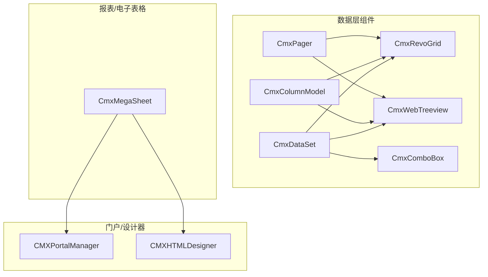
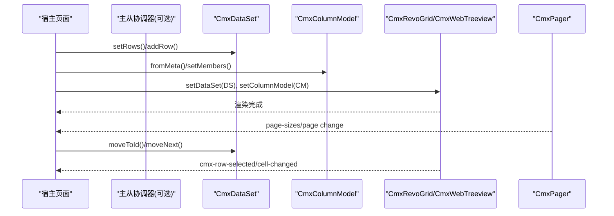
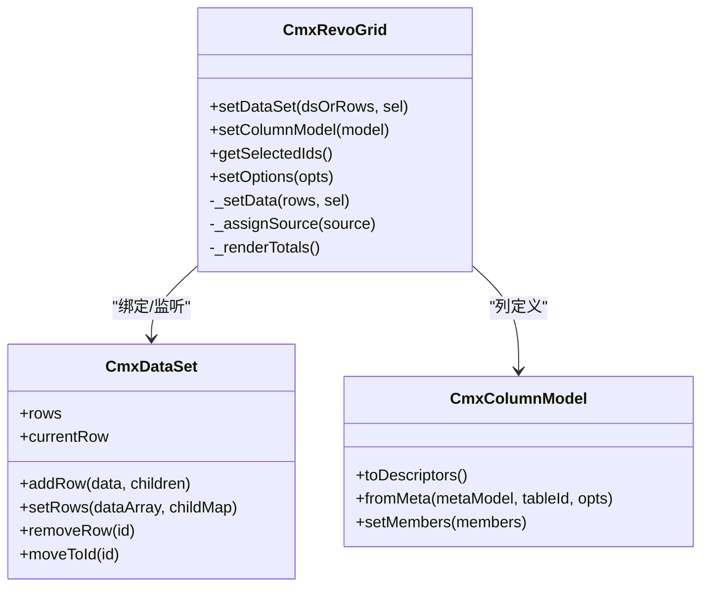
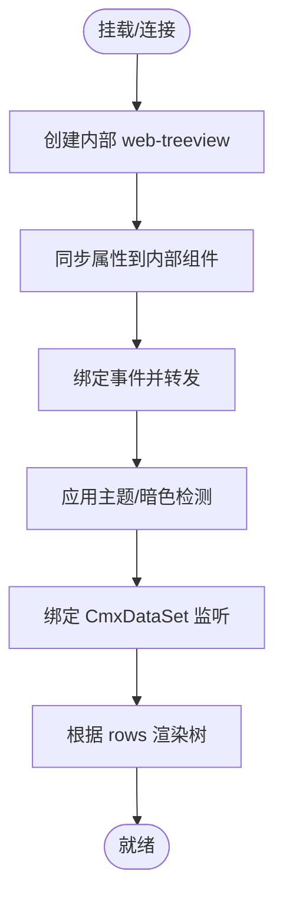
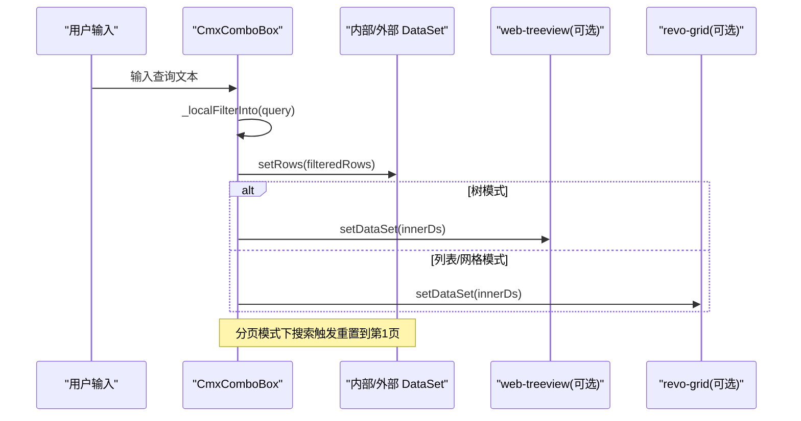
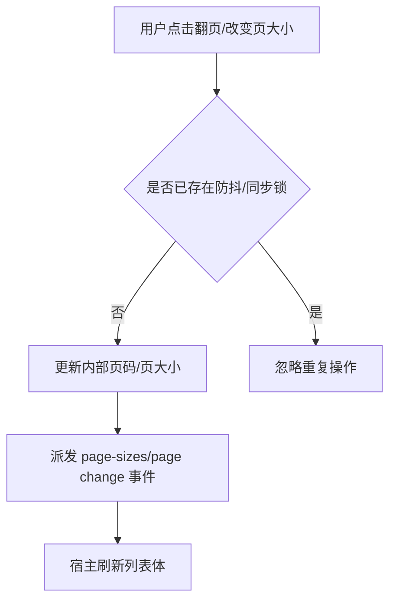
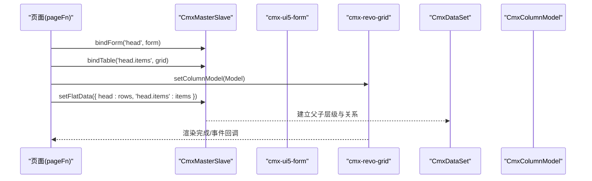
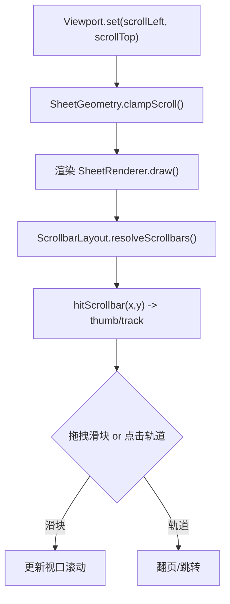
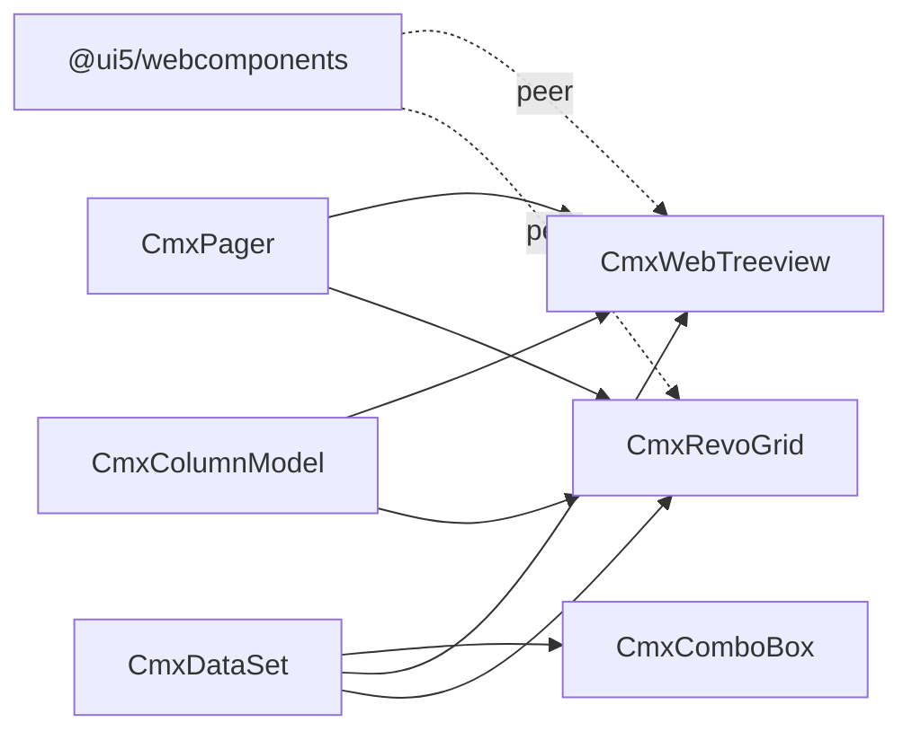

# 数据展示组件开发

<cite>
**本文引用的文件**
- [README.md](file://README.md)
- [cmx-data-comp/package.json](file://packages/cmx-data-comp/package.json)
- [cmx-data-set.js](file://packages/cmx-data-comp/src/lib/cmx-data-set.js)
- [cmx-column-model.js](file://packages/cmx-data-comp/src/lib/cmx-column-model.js)
- [cmx-revo-grid.js](file://packages/cmx-data-comp/src/components/cmx-revo-grid.js)
- [cmx-web-treeview.js](file://packages/cmx-data-comp/src/components/cmx-web-treeview.js)
- [cmx-combo-box.js](file://packages/cmx-data-comp/src/components/cmx-combo-box.js)
- [cmx-pager.js](file://packages/cmx-data-comp/src/components/cmx-pager.js)
- [model-dataset.md](file://.agents/skills/html-page-generator/references/model-dataset.md)
- [model-master-slave.md](file://.agents/skills/html-page-generator/references/model-master-slave.md)
- [skill-generate-master-slave-page.md](file://packages/cmx-data-comp/docs/skill-generate-master-slave-page.md)
- [portal-ui5-locale-data-whitelist.js](file://CMXPortalManager/src/lib/portal-ui5-locale-data-whitelist.js)
- [display-text.js](file://CMXPortalManager/src/lib/display-text.js)
- [cmx-field-meta.js](file://packages/cmx-data-comp/src/lib/cmx-field-meta.js)
- [PaneLayout.ts](file://cmx-mega-sheet/src/render/PaneLayout.ts)
- [SheetGeometry.ts](file://cmx-mega-sheet/src/render/SheetGeometry.ts)
- [cmx-megasheet.ts](file://cmx-mega-sheet/src/element/cmx-megasheet.ts)
- [demo_actions.js](file://cmx-mega-sheet/demo/demo_actions.js)
</cite>

## 目录
1. [简介](#简介)
2. [项目结构](#项目结构)
3. [核心组件](#核心组件)
4. [架构总览](#架构总览)
5. [详细组件分析](#详细组件分析)
6. [依赖关系分析](#依赖关系分析)
7. [性能与大数据处理](#性能与大数据处理)
8. [故障排查指南](#故障排查指南)
9. [结论](#结论)
10. [附录](#附录)

## 简介
本指南面向企业级应用中的数据展示组件开发，覆盖表格、列表、树形结构等常见形态。重点说明：
- 组件与数据集（DataSet）的绑定机制
- 分页、排序、筛选与搜索的实现方式
- 虚拟滚动、性能优化与大数据量处理最佳实践
- 导出、打印与国际化适配
- 复杂业务场景下的组件组合使用示例

本项目采用元数据驱动的前端体系，提供 Web Components 数据层组件、门户运行时与设计器，支持主从协调、列模型、数据集、视图过滤、事件联动等能力，便于在任意宿主中复用。

## 项目结构
- 前端 monorepo 包含门户运行时、可视化设计器、数据层 Web Components、共享 UI5 运行时等子项目
- 数据层组件集中在 packages/cmx-data-comp，提供 CmxDataSet、CmxColumnModel、CmxRevoGrid、CmxWebTreeview、CmxComboBox、CmxPager 等
- 报表与电子表格能力由 cmx-mega-sheet 提供，具备虚拟滚动、冻结行列、导出 HTML/PDF、打印等能力

图表来源
- [cmx-data-comp/package.json:14-73](file://packages/cmx-data-comp/package.json#L14-L73)
- [README.md:10-24](file://README.md#L10-L24)

章节来源
- [README.md:10-24](file://README.md#L10-L24)
- [cmx-data-comp/package.json:14-73](file://packages/cmx-data-comp/package.json#L14-L73)

## 核心组件
- CmxDataSet：多级数据集，维护行集合、索引、游标、变更事件；支持父子层级与视图过滤
- CmxColumnModel：纯元数据的列定义，输出通用描述符供适配器转换为具体网格列配置
- CmxRevoGrid：基于 RevoGrid 的表格封装，支持选择、编辑、合计、主题、虚拟滚动、拉伸布局
- CmxWebTreeview：树形视图封装，支持虚拟滚动、图标渲染、选中同步、主题适配
- CmxComboBox：下拉/列表/树模式，支持本地与远端搜索、分页、标题字段派生
- CmxPager：分页控件，支持页大小切换、首末页、紧凑模式
- CmxMegaSheet：电子表格引擎，具备冻结行列、尾带、视口计算、导出 PDF/HTML、打印

章节来源
- [cmx-data-set.js:1-23](file://packages/cmx-data-comp/src/lib/cmx-data-set.js#L1-L23)
- [cmx-column-model.js:1-14](file://packages/cmx-data-comp/src/lib/cmx-column-model.js#L1-L14)
- [cmx-revo-grid.js:1-44](file://packages/cmx-data-comp/src/components/cmx-revo-grid.js#L1-L44)
- [cmx-web-treeview.js:1-36](file://packages/cmx-data-comp/src/components/cmx-web-treeview.js#L1-L36)
- [cmx-combo-box.js:1282-1346](file://packages/cmx-data-comp/src/components/cmx-combo-box.js#L1282-L1346)
- [cmx-pager.js:264-327](file://packages/cmx-data-comp/src/components/cmx-pager.js#L264-L327)
- [cmx-megasheet.ts:602-647](file://cmx-mega-sheet/src/element/cmx-megasheet.ts#L602-L647)

## 架构总览
数据展示遵循“元数据 + 数据集 + 视图”的分层：
- 元数据层：CmxColumnModel 定义列结构与显示规则
- 数据层：CmxDataSet 管理行数据、层级关系、游标与事件
- 视图层：CmxRevoGrid / CmxWebTreeview / CmxComboBox 等通过 setDataSet/setColumnModel 绑定数据与列模型
- 辅助层：CmxPager 控制分页；CmxMegaSheet 提供高性能电子表格能力

图表来源
- [model-master-slave.md:180-225](file://.agents/skills/html-page-generator/references/model-master-slave.md#L180-L225)
- [cmx-revo-grid.js:731-793](file://packages/cmx-data-comp/src/components/cmx-revo-grid.js#L731-L793)
- [cmx-data-set.js:76-108](file://packages/cmx-data-comp/src/lib/cmx-data-set.js#L76-L108)

## 详细组件分析

### 表格组件（CmxRevoGrid）
- 绑定机制：通过 setDataSet 绑定 CmxDataSet 或数组；内部维护 _rows/_ds，监听 ds 游标变化以同步选中
- 列模型：通过 setColumnModel 绑定 CmxColumnModel，由适配器生成列定义
- 功能特性：单选/多选、合计行、序号列、主题、文本选择、单元格提示、虚拟滚动、拉伸布局
- 性能：默认开启虚拟滚动；数据切换后自动重算 stretch 避免横向溢出

图表来源
- [cmx-revo-grid.js:731-793](file://packages/cmx-data-comp/src/components/cmx-revo-grid.js#L731-L793)
- [cmx-data-set.js:76-108](file://packages/cmx-data-comp/src/lib/cmx-data-set.js#L76-L108)
- [cmx-column-model.js:74-158](file://packages/cmx-data-comp/src/lib/cmx-column-model.js#L74-L158)

章节来源
- [cmx-revo-grid.js:1-44](file://packages/cmx-data-comp/src/components/cmx-revo-grid.js#L1-L44)
- [cmx-revo-grid.js:731-793](file://packages/cmx-data-comp/src/components/cmx-revo-grid.js#L731-L793)

### 树形组件（CmxWebTreeview）
- 绑定机制：setDataSet 绑定 CmxDataSet，rows 变更时刷新树；setColumnModel 控制显示字段与图标字段
- 功能特性：虚拟滚动、节点点击/拖拽/选中事件转发、主题适配、路径/层级成员映射
- 性能：支持 virtual-scroll、initial-batch-size、max-batch-size、progressive-render 等参数

图表来源
- [cmx-web-treeview.js:124-200](file://packages/cmx-data-comp/src/components/cmx-web-treeview.js#L124-L200)

章节来源
- [cmx-web-treeview.js:1-36](file://packages/cmx-data-comp/src/components/cmx-web-treeview.js#L1-L36)
- [cmx-web-treeview.js:124-200](file://packages/cmx-data-comp/src/components/cmx-web-treeview.js#L124-L200)

### 下拉/列表/树（CmxComboBox）
- 模式：list/grid/tree 三种模式，统一通过内部 ds 管理数据
- 搜索：支持本地过滤与远端搜索（防抖），分页模式下重置到第 1 页
- 标题字段：list/tree 模式下预写入 cmxLabel 字段，保证树形展示正确

图表来源
- [cmx-combo-box.js:1282-1346](file://packages/cmx-data-comp/src/components/cmx-combo-box.js#L1282-L1346)

章节来源
- [cmx-combo-box.js:1282-1346](file://packages/cmx-data-comp/src/components/cmx-combo-box.js#L1282-L1346)

### 分页（CmxPager）
- 功能：首页/上一页/下一页/末页、页大小下拉、紧凑模式隐藏首末页按钮
- 集成：与表格/树配合，翻页时仅刷新列表体，避免整树重绘

图表来源
- [cmx-pager.js:264-327](file://packages/cmx-data-comp/src/components/cmx-pager.js#L264-L327)

章节来源
- [cmx-pager.js:264-327](file://packages/cmx-data-comp/src/components/cmx-pager.js#L264-L327)

### 主从协调与页面模型绑定
- 声明式绑定：通过 data-cmx-master-slave-id、data-cmx-dataset-id、data-cmx-kind、data-cmx-model-id 将表单/表格与主从协调器、数据集、列模型关联
- 命令式绑定：在 pageFn 中调用 bindForm/bindTable 进行动态绑定
- 初始化模板：提供主从页面的初始化函数模板，便于快速搭建

图表来源
- [model-master-slave.md:180-225](file://.agents/skills/html-page-generator/references/model-master-slave.md#L180-L225)
- [skill-generate-master-slave-page.md:132-204](file://packages/cmx-data-comp/docs/skill-generate-master-slave-page.md#L132-L204)

章节来源
- [model-dataset.md:175-229](file://.agents/skills/html-page-generator/references/model-dataset.md#L175-L229)
- [model-master-slave.md:180-225](file://.agents/skills/html-page-generator/references/model-master-slave.md#L180-L225)
- [skill-generate-master-slave-page.md:132-204](file://packages/cmx-data-comp/docs/skill-generate-master-slave-page.md#L132-L204)

### 电子表格（CmxMegaSheet）
- 虚拟滚动与视口：Viewport 负责缩放、滚动、可见范围计算；PaneLayout 处理冻结带/滚动带/尾带命中与可见区间
- 几何与滚动条：SheetGeometry 计算最大滚动位置、钳制滚动、命中滚动条区域
- 导出与打印：exportHtml/exportPdf 提供 HTML/PDF 导出；print 打开新窗口打印当前工作表；getPageCount 预览分页数

图表来源
- [cmx-megasheet.ts:602-647](file://cmx-mega-sheet/src/element/cmx-megasheet.ts#L602-L647)
- [PaneLayout.ts:137-191](file://cmx-mega-sheet/src/render/PaneLayout.ts#L137-L191)
- [SheetGeometry.ts:578-610](file://cmx-mega-sheet/src/render/SheetGeometry.ts#L578-L610)

章节来源
- [cmx-megasheet.ts:602-647](file://cmx-mega-sheet/src/element/cmx-megasheet.ts#L602-L647)
- [PaneLayout.ts:137-191](file://cmx-mega-sheet/src/render/PaneLayout.ts#L137-L191)
- [SheetGeometry.ts:578-610](file://cmx-mega-sheet/src/render/SheetGeometry.ts#L578-L610)

## 依赖关系分析
- 组件依赖：CmxRevoGrid/CmxWebTreeview/CmxComboBox 依赖 CmxDataSet 与 CmxColumnModel；CmxPager 作为独立分页控件
- 运行时依赖：UI5 WebComponents 为 peerDependencies；Ignite UI、RevoGrid、Tabulator 等为依赖库
- 国际化：UI5 locale 白名单限制加载语言，减少包体积；caption 解析按当前语言候选键匹配

图表来源
- [cmx-data-comp/package.json:75-92](file://packages/cmx-data-comp/package.json#L75-L92)
- [portal-ui5-locale-data-whitelist.js:1-30](file://CMXPortalManager/src/lib/portal-ui5-locale-data-whitelist.js#L1-L30)

章节来源
- [cmx-data-comp/package.json:75-92](file://packages/cmx-data-comp/package.json#L75-L92)
- [portal-ui5-locale-data-whitelist.js:1-30](file://CMXPortalManager/src/lib/portal-ui5-locale-data-whitelist.js#L1-L30)

## 性能与大数据处理
- 虚拟滚动：表格与树均启用虚拟滚动，减少 DOM 节点数量；电子表格通过 Viewport/PaneLayout 精确计算可见范围
- 冻结与尾带：冻结行列恒可见，滚动带与尾带互逆命中，避免越界与漏渲染
- 滚动钳制：SheetGeometry.clampScroll 防止内容变短或放大后滚过头露白
- 导出与打印：电子表格支持 exportHtml/exportPdf/print，适合大数据报表场景
- 分页与搜索：CmxPager 与 CmxComboBox 结合，分页模式下搜索重置到第 1 页，避免全量渲染

章节来源
- [cmx-revo-grid.js:71-155](file://packages/cmx-data-comp/src/components/cmx-revo-grid.js#L71-L155)
- [cmx-web-treeview.js:43-105](file://packages/cmx-data-comp/src/components/cmx-web-treeview.js#L43-L105)
- [PaneLayout.ts:137-191](file://cmx-mega-sheet/src/render/PaneLayout.ts#L137-L191)
- [SheetGeometry.ts:578-610](file://cmx-mega-sheet/src/render/SheetGeometry.ts#L578-L610)
- [cmx-megasheet.ts:1617-1647](file://cmx-mega-sheet/src/element/cmx-megasheet.ts#L1617-L1647)
- [cmx-combo-box.js:1332-1346](file://packages/cmx-data-comp/src/components/cmx-combo-box.js#L1332-L1346)

## 故障排查指南
- 数据集未生效：确认已通过 setDataSet 绑定 CmxDataSet，且列模型通过 setColumnModel 设置
- 主从绑定失败：检查 data-cmx-master-slave-id、data-cmx-dataset-id、data-cmx-kind、data-cmx-model-id 是否正确
- 分页不刷新：确保 CmxPager 的 page-sizes/page change 事件被宿主捕获并刷新列表体
- 搜索无效：确认本地过滤字段或远端搜索接口已配置，分页模式下注意重置到第 1 页
- 主题异常：树/表格需监听 cmx-portal-theme-change 重新应用主题；UI5 locale 白名单需包含目标语言
- 导出/打印为空：确保工作表已加载数据后再调用 exportHtml/exportPdf/print

章节来源
- [model-dataset.md:175-229](file://.agents/skills/html-page-generator/references/model-dataset.md#L175-L229)
- [model-master-slave.md:180-225](file://.agents/skills/html-page-generator/references/model-master-slave.md#L180-L225)
- [cmx-pager.js:264-327](file://packages/cmx-data-comp/src/components/cmx-pager.js#L264-L327)
- [cmx-combo-box.js:1282-1346](file://packages/cmx-data-comp/src/components/cmx-combo-box.js#L1282-L1346)
- [portal-ui5-locale-data-whitelist.js:1-30](file://CMXPortalManager/src/lib/portal-ui5-locale-data-whitelist.js#L1-L30)
- [cmx-megasheet.ts:1617-1647](file://cmx-mega-sheet/src/element/cmx-megasheet.ts#L1617-L1647)

## 结论
通过 CmxDataSet、CmxColumnModel 与多种视图组件的组合，可在企业应用中高效构建表格、列表、树形等数据展示界面。借助虚拟滚动、冻结行列、分页与搜索，可支撑大数据量场景；通过导出与打印能力满足报表需求；结合 UI5 国际化与主题系统，实现多语言与主题适配。主从协调器进一步简化了复杂业务的数据绑定与交互。

## 附录
- 常用 API 速查：
  - 数据集：addRow/setRows/removeRow/moveToId/currentRow
  - 列模型：fromMeta/setMembers/toDescriptors
  - 表格：setDataSet/setColumnModel/getSelectedIds/setOptions
  - 树：setDataSet/setColumnModel 及虚拟滚动参数
  - 分页：page-sizes/page change 事件
  - 电子表格：exportHtml/exportPdf/print/getPageCount

章节来源
- [cmx-data-set.js:76-108](file://packages/cmx-data-comp/src/lib/cmx-data-set.js#L76-L108)
- [cmx-column-model.js:74-158](file://packages/cmx-data-comp/src/lib/cmx-column-model.js#L74-L158)
- [cmx-revo-grid.js:731-793](file://packages/cmx-data-comp/src/components/cmx-revo-grid.js#L731-L793)
- [cmx-web-treeview.js:124-200](file://packages/cmx-data-comp/src/components/cmx-web-treeview.js#L124-L200)
- [cmx-pager.js:264-327](file://packages/cmx-data-comp/src/components/cmx-pager.js#L264-L327)
- [cmx-megasheet.ts:1617-1647](file://cmx-mega-sheet/src/element/cmx-megasheet.ts#L1617-L1647)