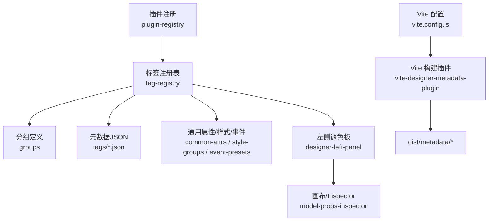
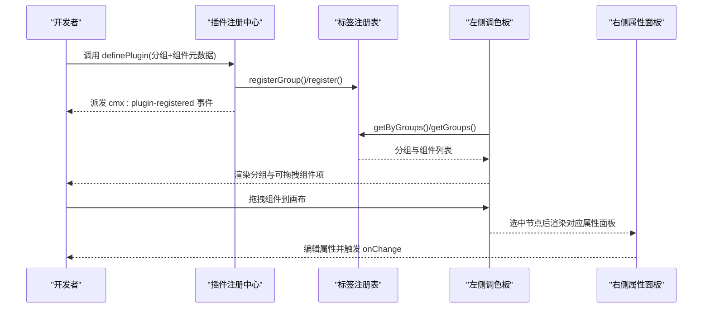
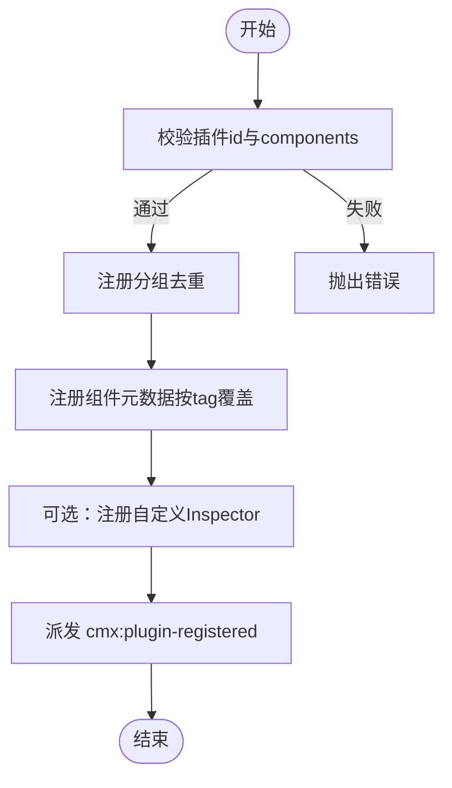
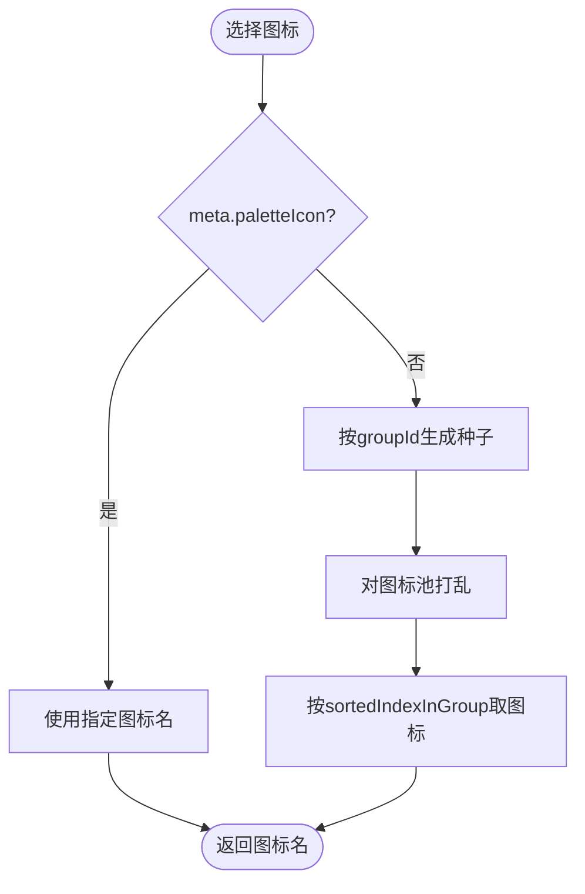
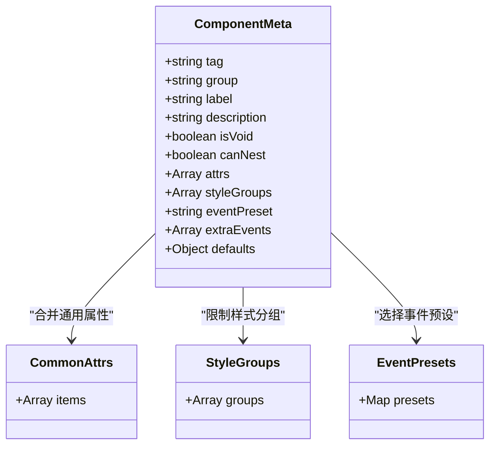
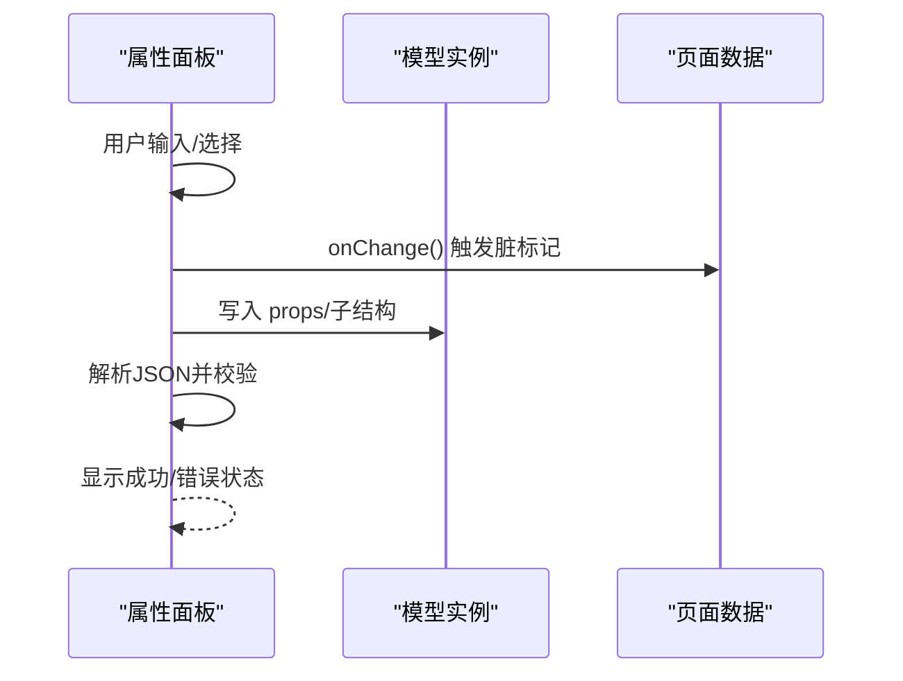
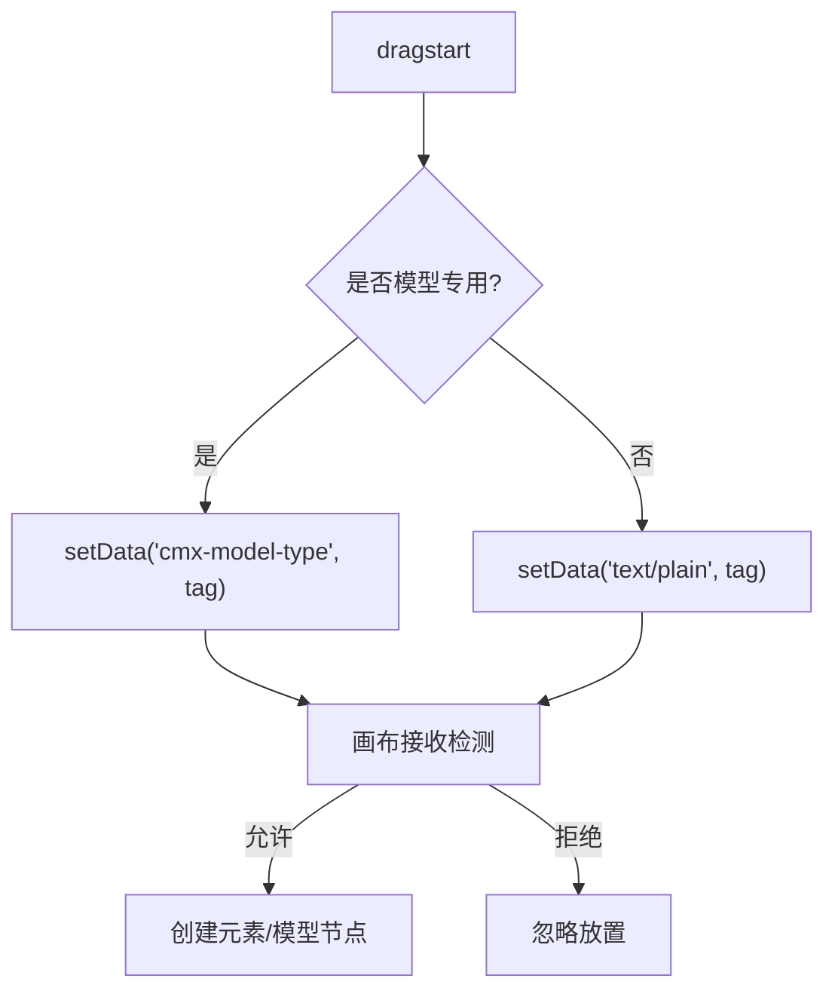
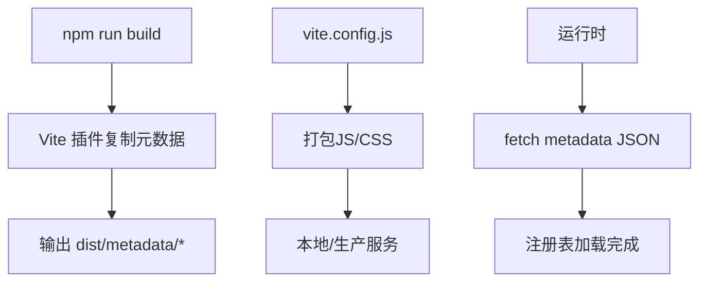
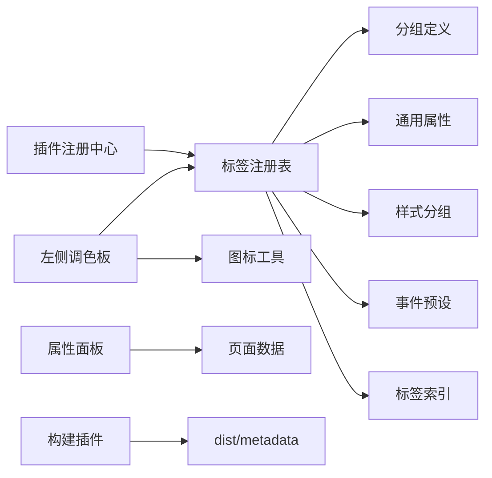

# 组件集成与配置

<cite>
**本文引用的文件**
- [CMXHTMLDesigner/src/lib/plugin-registry.js](file://CMXHTMLDesigner/src/lib/plugin-registry.js)
- [CMXHTMLDesigner/src/metadata/tag-registry.js](file://CMXHTMLDesigner/src/metadata/tag-registry.js)
- [CMXHTMLDesigner/src/metadata/groups.js](file://CMXHTMLDesigner/src/metadata/groups.js)
- [CMXHTMLDesigner/src/utils/palette-tag-icon.js](file://CMXHTMLDesigner/src/utils/palette-tag-icon.js)
- [CMXHTMLDesigner/src/utils/palette-icon-pool.js](file://CMXHTMLDesigner/src/utils/palette-icon-pool.js)
- [CMXHTMLDesigner/src/components/designer-left-panel.js](file://CMXHTMLDesigner/src/components/designer-left-panel.js)
- [CMXHTMLDesigner/src/components/designer-inspector/model-props-inspector.js](file://CMXHTMLDesigner/src/components/designer-inspector/model-props-inspector.js)
- [CMXHTMLDesigner/src/metadata/common-attrs.json](file://CMXHTMLDesigner/src/metadata/common-attrs.json)
- [CMXHTMLDesigner/src/metadata/style-groups.json](file://CMXHTMLDesigner/src/metadata/style-groups.json)
- [CMXHTMLDesigner/src/metadata/tags/button.json](file://CMXHTMLDesigner/src/metadata/tags/button.json)
- [CMXHTMLDesigner/vite-designer-metadata-plugin.js](file://CMXHTMLDesigner/vite-designer-metadata-plugin.js)
- [CMXHTMLDesigner/vite.config.js](file://CMXHTMLDesigner/vite.config.js)
- [CMXHTMLDesigner/package.json](file://CMXHTMLDesigner/package.json)
</cite>

## 目录
1. [简介](#简介)
2. [项目结构](#项目结构)
3. [核心组件](#核心组件)
4. [架构总览](#架构总览)
5. [详细组件分析](#详细组件分析)
6. [依赖关系分析](#依赖关系分析)
7. [性能考量](#性能考量)
8. [故障排查指南](#故障排查指南)
9. [结论](#结论)
10. [附录](#附录)

## 简介
本文件面向需要在设计器中集成自定义组件的开发者，系统性说明如何：
- 将自定义组件注册到设计器的“组件调色板”中
- 配置组件元数据（标签、分组、属性面板、事件预设、样式分组）
- 管理组件分组、图标与预览图生成策略
- 定义组件属性、默认值与验证规则
- 处理版本管理与向后兼容
- 完成组件包的构建与发布流程（含依赖管理与打包优化）

## 项目结构
设计器侧的组件系统由“元数据驱动 + 插件注册 + 运行时渲染”三部分构成：
- 元数据层：通过 JSON 描述组件标签、分组、属性、样式分组、事件预设等
- 注册层：提供插件 API 动态注册自定义组件与分组
- UI 层：左侧调色板展示分组与组件项；右侧 Inspector 编辑属性；拖拽至画布生成元素

图表来源
- [CMXHTMLDesigner/src/lib/plugin-registry.js:1-95](file://CMXHTMLDesigner/src/lib/plugin-registry.js#L1-L95)
- [CMXHTMLDesigner/src/metadata/tag-registry.js:1-149](file://CMXHTMLDesigner/src/metadata/tag-registry.js#L1-L149)
- [CMXHTMLDesigner/src/metadata/groups.js:1-32](file://CMXHTMLDesigner/src/metadata/groups.js#L1-L32)
- [CMXHTMLDesigner/src/components/designer-left-panel.js:1-326](file://CMXHTMLDesigner/src/components/designer-left-panel.js#L1-L326)
- [CMXHTMLDesigner/vite-designer-metadata-plugin.js:1-67](file://CMXHTMLDesigner/vite-designer-metadata-plugin.js#L1-L67)
- [CMXHTMLDesigner/vite.config.js:1-118](file://CMXHTMLDesigner/vite.config.js#L1-L118)

章节来源
- [CMXHTMLDesigner/src/lib/plugin-registry.js:1-95](file://CMXHTMLDesigner/src/lib/plugin-registry.js#L1-L95)
- [CMXHTMLDesigner/src/metadata/tag-registry.js:1-149](file://CMXHTMLDesigner/src/metadata/tag-registry.js#L1-L149)
- [CMXHTMLDesigner/src/components/designer-left-panel.js:1-326](file://CMXHTMLDesigner/src/components/designer-left-panel.js#L1-L326)
- [CMXHTMLDesigner/vite-designer-metadata-plugin.js:1-67](file://CMXHTMLDesigner/vite-designer-metadata-plugin.js#L1-L67)
- [CMXHTMLDesigner/vite.config.js:1-118](file://CMXHTMLDesigner/vite.config.js#L1-L118)

## 核心组件
- 插件注册中心：提供 definePlugin，支持新增分组、注册组件元数据、可选自定义 Inspector 渲染函数，并在注册完成后派发事件以刷新 UI。
- 标签注册表：集中维护所有标签元数据，负责合并通用属性、样式分组、事件预设，并提供按组查询、排序、懒加载能力。
- 左侧调色板：读取注册表渲染分组与组件项，支持搜索过滤、拖拽、模型专用标记、分组折叠展开。
- 右侧属性面板：针对模型类型（数据集、主从、列模型、弹性组合）提供可视化编辑与校验反馈。
- 构建期元数据处理：Vite 插件在构建时复制元数据 JSON 到 dist，开发时托管静态资源供运行时 fetch。

章节来源
- [CMXHTMLDesigner/src/lib/plugin-registry.js:1-95](file://CMXHTMLDesigner/src/lib/plugin-registry.js#L1-L95)
- [CMXHTMLDesigner/src/metadata/tag-registry.js:1-149](file://CMXHTMLDesigner/src/metadata/tag-registry.js#L1-L149)
- [CMXHTMLDesigner/src/components/designer-left-panel.js:1-326](file://CMXHTMLDesigner/src/components/designer-left-panel.js#L1-L326)
- [CMXHTMLDesigner/src/components/designer-inspector/model-props-inspector.js:1-712](file://CMXHTMLDesigner/src/components/designer-inspector/model-props-inspector.js#L1-L712)
- [CMXHTMLDesigner/vite-designer-metadata-plugin.js:1-67](file://CMXHTMLDesigner/vite-designer-metadata-plugin.js#L1-L67)

## 架构总览
下图展示了从插件注册到调色板渲染、再到属性编辑的完整链路。

图表来源
- [CMXHTMLDesigner/src/lib/plugin-registry.js:60-89](file://CMXHTMLDesigner/src/lib/plugin-registry.js#L60-L89)
- [CMXHTMLDesigner/src/metadata/tag-registry.js:24-79](file://CMXHTMLDesigner/src/metadata/tag-registry.js#L24-L79)
- [CMXHTMLDesigner/src/components/designer-left-panel.js:230-322](file://CMXHTMLDesigner/src/components/designer-left-panel.js#L230-L322)
- [CMXHTMLDesigner/src/components/designer-inspector/model-props-inspector.js:14-31](file://CMXHTMLDesigner/src/components/designer-inspector/model-props-inspector.js#L14-L31)

## 详细组件分析

### 插件注册与分组管理
- 插件对象包含 id、groups、components、customInspectors 等字段。
- 注册时会对重复注册进行保护，HMR 场景下支持覆盖更新。
- 分组支持 iconName、order、collapsed 等控制显示与排序。
- 注册完成后派发事件，左侧调色板监听并刷新。

图表来源
- [CMXHTMLDesigner/src/lib/plugin-registry.js:60-89](file://CMXHTMLDesigner/src/lib/plugin-registry.js#L60-L89)
- [CMXHTMLDesigner/src/metadata/tag-registry.js:24-41](file://CMXHTMLDesigner/src/metadata/tag-registry.js#L24-L41)

章节来源
- [CMXHTMLDesigner/src/lib/plugin-registry.js:1-95](file://CMXHTMLDesigner/src/lib/plugin-registry.js#L1-L95)
- [CMXHTMLDesigner/src/metadata/groups.js:1-32](file://CMXHTMLDesigner/src/metadata/groups.js#L1-L32)

### 调色板图标与预览图生成
- 每个组件项的图标优先使用 meta.paletteIcon；否则在同一分组内按标签名排序后的序号，从预置图标池中按种子打乱顺序分配，尽量不重复。
- 分组标题图标优先使用 groupName.iconName；若为 kebab-case 则视为 SAP 图标名；否则回退到普通字符。
- 预览图：当前实现未内置图片预览，可通过自定义 Inspector 或扩展左侧项模板增加缩略图展示。

图表来源
- [CMXHTMLDesigner/src/utils/palette-tag-icon.js:1-60](file://CMXHTMLDesigner/src/utils/palette-tag-icon.js#L1-L60)
- [CMXHTMLDesigner/src/utils/palette-icon-pool.js:1-6](file://CMXHTMLDesigner/src/utils/palette-icon-pool.js#L1-L6)
- [CMXHTMLDesigner/src/components/designer-left-panel.js:12-25](file://CMXHTMLDesigner/src/components/designer-left-panel.js#L12-L25)

章节来源
- [CMXHTMLDesigner/src/utils/palette-tag-icon.js:1-60](file://CMXHTMLDesigner/src/utils/palette-tag-icon.js#L1-L60)
- [CMXHTMLDesigner/src/utils/palette-icon-pool.js:1-6](file://CMXHTMLDesigner/src/utils/palette-icon-pool.js#L1-L6)
- [CMXHTMLDesigner/src/components/designer-left-panel.js:12-25](file://CMXHTMLDesigner/src/components/designer-left-panel.js#L12-L25)

### 组件元数据与属性面板
- 组件元数据字段包括 tag、group、label、description、isVoid、canNest、attrs、styleGroups、eventPreset、extraEvents、defaults 等。
- 通用属性（如 id、class、title、hidden、tabindex、lang）会合并到每个组件的属性列表中。
- 样式分组通过 style-groups.json 定义，组件可通过 styleGroups 白名单限制可用样式区段。
- 事件预设通过 event-presets.json 定义，组件可选择不同预设并追加额外事件。
- 默认值 defaults 支持 attributes、text/html、style 等初始化行为。

图表来源
- [CMXHTMLDesigner/src/metadata/tag-registry.js:43-109](file://CMXHTMLDesigner/src/metadata/tag-registry.js#L43-L109)
- [CMXHTMLDesigner/src/metadata/common-attrs.json:1-37](file://CMXHTMLDesigner/src/metadata/common-attrs.json#L1-L37)
- [CMXHTMLDesigner/src/metadata/style-groups.json:1-407](file://CMXHTMLDesigner/src/metadata/style-groups.json#L1-L407)
- [CMXHTMLDesigner/src/metadata/tags/button.json:1-39](file://CMXHTMLDesigner/src/metadata/tags/button.json#L1-L39)

章节来源
- [CMXHTMLDesigner/src/metadata/tag-registry.js:43-109](file://CMXHTMLDesigner/src/metadata/tag-registry.js#L43-L109)
- [CMXHTMLDesigner/src/metadata/common-attrs.json:1-37](file://CMXHTMLDesigner/src/metadata/common-attrs.json#L1-L37)
- [CMXHTMLDesigner/src/metadata/style-groups.json:1-407](file://CMXHTMLDesigner/src/metadata/style-groups.json#L1-L407)
- [CMXHTMLDesigner/src/metadata/tags/button.json:1-39](file://CMXHTMLDesigner/src/metadata/tags/button.json#L1-L39)

### 属性面板与验证规则
- 右侧属性面板根据模型类型（CmxDataSet、CmxMasterSlave、CmxColumnModel、FlexibleCombination）渲染专属编辑器。
- 对于复杂结构（如列模型、弹性组合），提供增删行、枚举值编辑、JSON 校验与即时错误提示。
- 验证规则示例：JSON 文本框解析失败时显示错误信息；必填字段为空时给出提示；数组路径写入需特殊处理。

图表来源
- [CMXHTMLDesigner/src/components/designer-inspector/model-props-inspector.js:14-31](file://CMXHTMLDesigner/src/components/designer-inspector/model-props-inspector.js#L14-L31)
- [CMXHTMLDesigner/src/components/designer-inspector/model-props-inspector.js:166-186](file://CMXHTMLDesigner/src/components/designer-inspector/model-props-inspector.js#L166-L186)
- [CMXHTMLDesigner/src/components/designer-inspector/model-props-inspector.js:402-423](file://CMXHTMLDesigner/src/components/designer-inspector/model-props-inspector.js#L402-L423)

章节来源
- [CMXHTMLDesigner/src/components/designer-inspector/model-props-inspector.js:1-712](file://CMXHTMLDesigner/src/components/designer-inspector/model-props-inspector.js#L1-L712)

### 拖拽与画布交互
- 左侧调色板支持两种拖拽模式：
  - 普通组件：携带 text/plain 数据，画布可接受并创建元素
  - 模型专用组件：仅携带 cmx-model-type，画布拒绝放置（用于模型节点）
- 分组支持折叠/展开，搜索框可按标签名与描述过滤。

图表来源
- [CMXHTMLDesigner/src/components/designer-left-panel.js:310-322](file://CMXHTMLDesigner/src/components/designer-left-panel.js#L310-L322)

章节来源
- [CMXHTMLDesigner/src/components/designer-left-panel.js:230-322](file://CMXHTMLDesigner/src/components/designer-left-panel.js#L230-L322)

### 版本管理与向后兼容
- 插件重注册：HMR 场景下支持重新注册同一 id 的插件，按 tag 覆盖元数据与自定义 Inspector，保证热更新生效。
- 元数据兼容：
  - 通用属性合并机制确保旧组件仍可使用公共属性
  - 样式分组与事件预设采用白名单与默认集合，避免缺失导致异常
  - 属性面板对历史数据结构进行归一化（如空对象补齐、旧字段清理）
- 建议：
  - 组件升级时保留旧字段映射，逐步废弃
  - 通过 defaults 提供新字段默认值，降低破坏性变更影响
  - 在属性面板中对关键字段做渐进式迁移与提示

章节来源
- [CMXHTMLDesigner/src/lib/plugin-registry.js:64-89](file://CMXHTMLDesigner/src/lib/plugin-registry.js#L64-L89)
- [CMXHTMLDesigner/src/metadata/tag-registry.js:43-109](file://CMXHTMLDesigner/src/metadata/tag-registry.js#L43-L109)
- [CMXHTMLDesigner/src/components/designer-inspector/model-props-inspector.js:222-290](file://CMXHTMLDesigner/src/components/designer-inspector/model-props-inspector.js#L222-L290)

### 构建与发布流程
- 元数据构建：
  - Vite 插件在 closeBundle 时将 src/metadata 下的 JSON 复制到 dist/metadata，并在开发服务器挂载 /metadata 静态路由
  - 运行时通过 ensureTagRegistryLoaded 异步拉取 common-attrs、style-groups、event-presets、tag-index 及 tags/*.json
- 依赖与打包优化：
  - package.json 声明 UI5 组件、CodeMirror、zod 等依赖
  - vite.config.js 中通过 dedupe 去重 UI5 包，optimizeDeps 排除大型库，减少预构建开销
  - 多入口构建（main、login、preview、debug），sourcemap 开启便于调试
- 环境变量：
  - 通过 loadEnv 支持 .env、.env.production 等多环境配置
  - CMX_APP_BASE 控制应用基础路径，后端代理统一转发 /api、/rpc 等接口

图表来源
- [CMXHTMLDesigner/vite-designer-metadata-plugin.js:43-67](file://CMXHTMLDesigner/vite-designer-metadata-plugin.js#L43-L67)
- [CMXHTMLDesigner/vite.config.js:26-118](file://CMXHTMLDesigner/vite.config.js#L26-L118)
- [CMXHTMLDesigner/package.json:1-39](file://CMXHTMLDesigner/package.json#L1-L39)
- [CMXHTMLDesigner/src/metadata/tag-registry.js:120-146](file://CMXHTMLDesigner/src/metadata/tag-registry.js#L120-L146)

章节来源
- [CMXHTMLDesigner/vite-designer-metadata-plugin.js:1-67](file://CMXHTMLDesigner/vite-designer-metadata-plugin.js#L1-L67)
- [CMXHTMLDesigner/vite.config.js:1-118](file://CMXHTMLDesigner/vite.config.js#L1-L118)
- [CMXHTMLDesigner/package.json:1-39](file://CMXHTMLDesigner/package.json#L1-L39)
- [CMXHTMLDesigner/src/metadata/tag-registry.js:120-146](file://CMXHTMLDesigner/src/metadata/tag-registry.js#L120-L146)

## 依赖关系分析
- 插件注册中心依赖标签注册表，注册分组与组件元数据
- 标签注册表依赖分组定义、通用属性、样式分组、事件预设与标签索引
- 左侧调色板依赖标签注册表获取分组与组件列表，并使用图标工具函数
- 属性面板依赖页面数据与模型类型，提供可视化编辑与校验
- 构建期插件依赖 Vite 生命周期钩子，负责元数据的复制与静态托管

图表来源
- [CMXHTMLDesigner/src/lib/plugin-registry.js:43-89](file://CMXHTMLDesigner/src/lib/plugin-registry.js#L43-L89)
- [CMXHTMLDesigner/src/metadata/tag-registry.js:15-79](file://CMXHTMLDesigner/src/metadata/tag-registry.js#L15-L79)
- [CMXHTMLDesigner/src/components/designer-left-panel.js:7-10](file://CMXHTMLDesigner/src/components/designer-left-panel.js#L7-L10)
- [CMXHTMLDesigner/src/components/designer-inspector/model-props-inspector.js:1-31](file://CMXHTMLDesigner/src/components/designer-inspector/model-props-inspector.js#L1-L31)
- [CMXHTMLDesigner/vite-designer-metadata-plugin.js:43-67](file://CMXHTMLDesigner/vite-designer-metadata-plugin.js#L43-L67)

章节来源
- [CMXHTMLDesigner/src/lib/plugin-registry.js:1-95](file://CMXHTMLDesigner/src/lib/plugin-registry.js#L1-L95)
- [CMXHTMLDesigner/src/metadata/tag-registry.js:1-149](file://CMXHTMLDesigner/src/metadata/tag-registry.js#L1-L149)
- [CMXHTMLDesigner/src/components/designer-left-panel.js:1-326](file://CMXHTMLDesigner/src/components/designer-left-panel.js#L1-L326)
- [CMXHTMLDesigner/src/components/designer-inspector/model-props-inspector.js:1-712](file://CMXHTMLDesigner/src/components/designer-inspector/model-props-inspector.js#L1-L712)
- [CMXHTMLDesigner/vite-designer-metadata-plugin.js:1-67](file://CMXHTMLDesigner/vite-designer-metadata-plugin.js#L1-L67)

## 性能考量
- 元数据懒加载：运行时按需 fetch 元数据，避免一次性注入大体积 JSON
- 图标池复用：通过哈希与种子打乱，减少重复图标分配成本
- 依赖去重：Vite 配置中对 UI5 相关包进行 dedupe，减少重复打包
- 预构建优化：将大型库加入 optimizeDeps.exclude，缩短 dev 启动时间
- 分组渲染优化：左侧调色板仅在插件注册事件触发时重渲染，避免频繁 DOM 操作

[本节为通用指导，无需特定文件引用]

## 故障排查指南
- 插件未生效：
  - 检查 definePlugin 是否传入有效 id 与 components
  - 确认 cmx:plugin-registered 事件是否被监听并触发刷新
- 组件未出现在调色板：
  - 确认 tag 唯一且未被覆盖
  - 检查 group 是否存在且 order 合理
  - 查看 ensureTagRegistryLoaded 是否已执行
- 属性面板报错：
  - 检查 JSON 文本框格式是否正确
  - 查看错误提示区域（如 model-prop-error）
  - 确认字段路径写入逻辑（特别是数组路径）
- 构建产物缺失：
  - 确认 vite-designer-metadata-plugin 已启用
  - 检查 dist/metadata 是否包含必要 JSON 文件

章节来源
- [CMXHTMLDesigner/src/lib/plugin-registry.js:60-89](file://CMXHTMLDesigner/src/lib/plugin-registry.js#L60-L89)
- [CMXHTMLDesigner/src/metadata/tag-registry.js:120-146](file://CMXHTMLDesigner/src/metadata/tag-registry.js#L120-L146)
- [CMXHTMLDesigner/src/components/designer-inspector/model-props-inspector.js:166-186](file://CMXHTMLDesigner/src/components/designer-inspector/model-props-inspector.js#L166-L186)
- [CMXHTMLDesigner/vite-designer-metadata-plugin.js:43-67](file://CMXHTMLDesigner/vite-designer-metadata-plugin.js#L43-L67)

## 结论
通过插件注册与元数据驱动的架构，设计器实现了高度可扩展的组件集成方案。开发者只需遵循统一的元数据规范与插件 API，即可快速将自定义组件接入调色板与属性面板，并通过构建插件与 Vite 配置完成开发与生产环境的无缝衔接。建议在迭代过程中重视向后兼容与验证反馈，以提升用户体验与维护效率。

[本节为总结性内容，无需特定文件引用]

## 附录
- 常用元数据字段参考：
  - tag：组件标签名
  - group：所属分组
  - label/description：显示名称与描述
  - isVoid/canNest：是否为空标签/是否可嵌套
  - attrs：属性定义（name、label、type、options）
  - styleGroups：允许的样式分组
  - eventPreset/extraEvents：事件预设与额外事件
  - defaults：默认值（attributes/text/html/style）
- 分组管理要点：
  - id 唯一，order 控制排序，collapsed 控制初始折叠
  - iconName 优先于 icon，支持 SAP 图标名
- 图标策略：
  - 优先 paletteIcon，否则按分组种子分配
- 构建命令：
  - npm run build：构建并生成 dist
  - npm run dev：开发模式
  - npm run preview：预览构建产物

[本节为补充说明，无需特定文件引用]