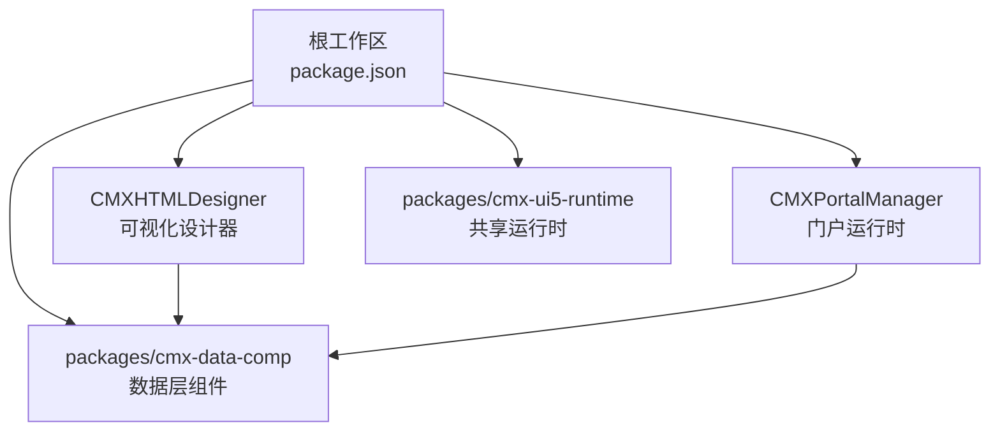
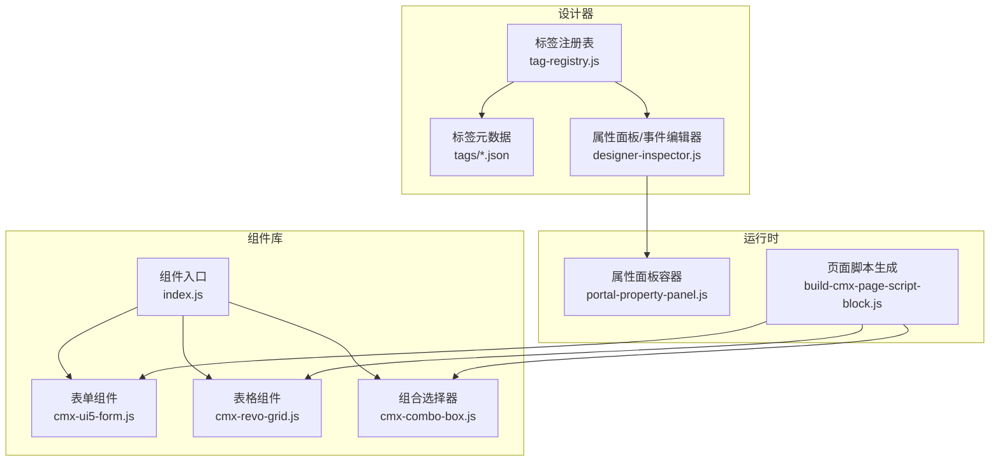
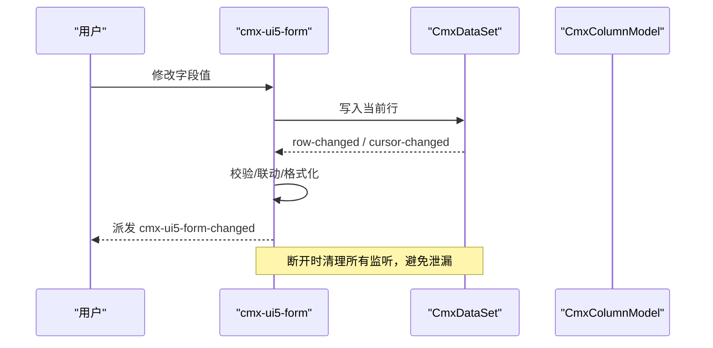
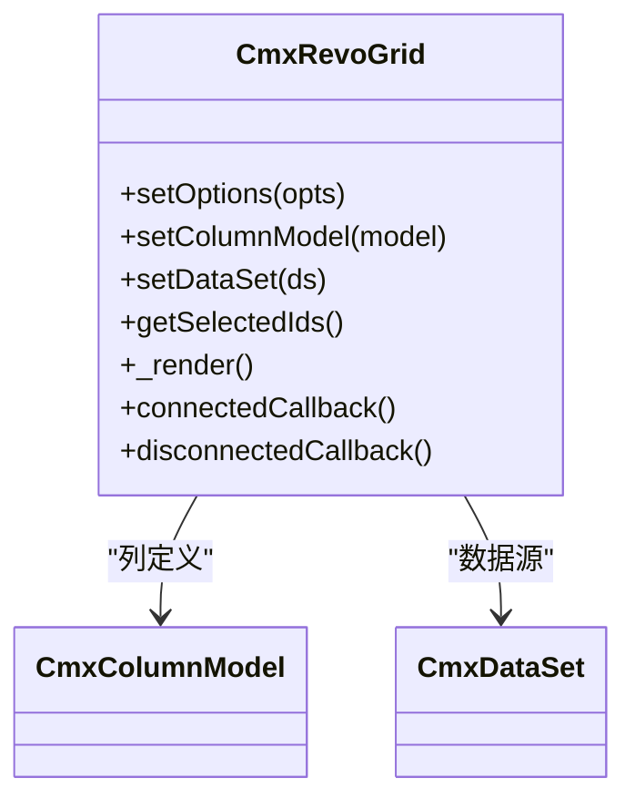
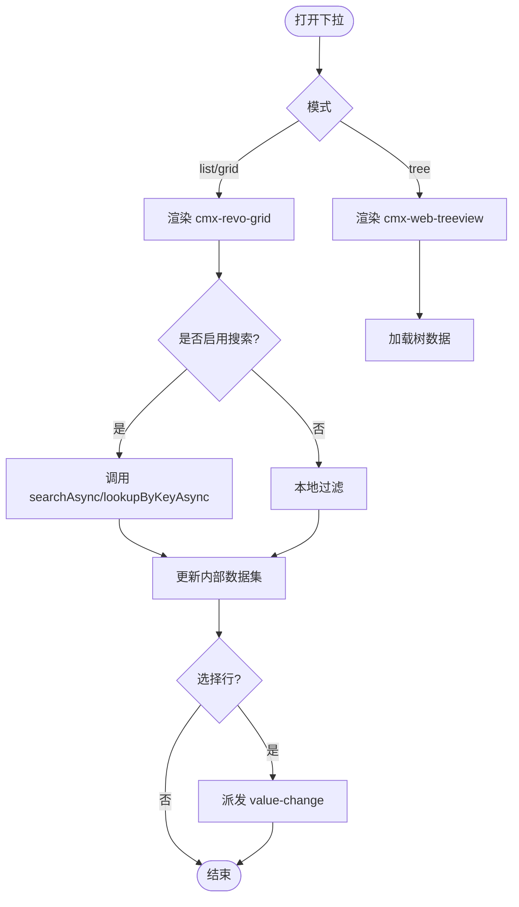
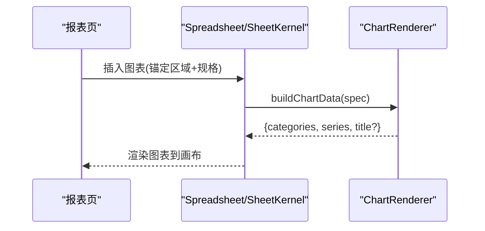
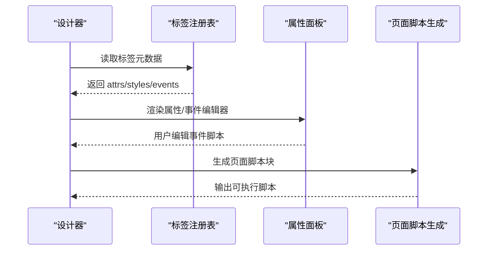
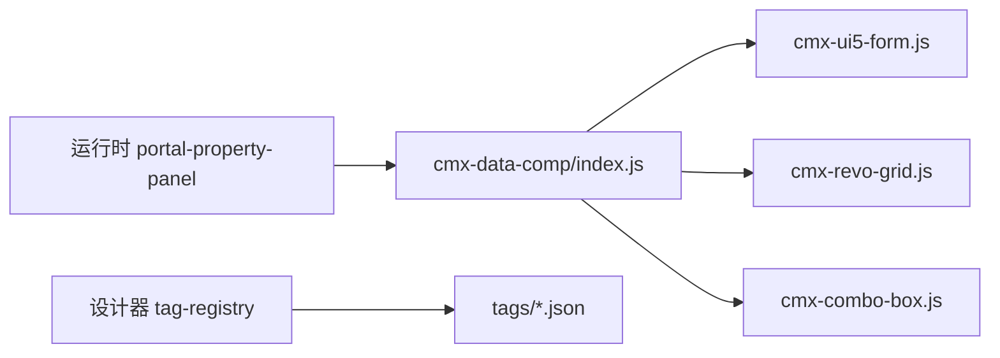

# 自定义组件开发

<cite>
**本文引用的文件**
- [README.md](file://README.md)
- [package.json](file://package.json)
- [packages/cmx-data-comp/src/index.js](file://packages/cmx-data-comp/src/index.js)
- [packages/cmx-data-comp/src/components/cmx-combo-box.js](file://packages/cmx-data-comp/src/components/cmx-combo-box.js)
- [packages/cmx-data-comp/src/components/cmx-revo-grid.js](file://packages/cmx-data-comp/src/components/cmx-revo-grid.js)
- [packages/cmx-data-comp/src/components/cmx-ui5-form.js](file://packages/cmx-data-comp/src/components/cmx-ui5-form.js)
- [CMXHTMLDesigner/src/metadata/tag-registry.js](file://CMXHTMLDesigner/src/metadata/tag-registry.js)
- [CMXHTMLDesigner/src/metadata/tags/a.json](file://CMXHTMLDesigner/src/metadata/tags/a.json)
- [CMXHTMLDesigner/src/utils/build-cmx-page-script-block.js](file://CMXHTMLDesigner/src/utils/build-cmx-page-script-block.js)
- [CMXHTMLDesigner/src/components/designer-inspector.js](file://CMXHTMLDesigner/src/components/designer-inspector.js)
- [CMXPortalManager/src/components/portal-property-panel.js](file://CMXPortalManager/src/components/portal-property-panel.js)
- [.agents/skills/cmx-components-guide/references/grid-components.md](file://.agents/skills/cmx-components-guide/references/grid-components.md)
- [.agents/skills/cmx-components-guide/references/frontend-conventions.md](file://.agents/skills/cmx-components-guide/references/frontend-conventions.md)
</cite>

## 目录
1. [简介](#简介)
2. [项目结构](#项目结构)
3. [核心组件](#核心组件)
4. [架构总览](#架构总览)
5. [详细组件分析](#详细组件分析)
6. [依赖分析](#依赖分析)
7. [性能考虑](#性能考虑)
8. [故障排查指南](#故障排查指南)
9. [结论](#结论)
10. [附录](#附录)

## 简介
本指南面向在 CMX 平台中基于 Web Components 标准开发自定义组件的工程师与设计师。内容覆盖：
- 组件定义、属性绑定、事件处理与样式定制
- 与元数据驱动的集成方式（标签元数据、设计器预览、属性面板）
- 常见组件类型示例：表单组件、表格组件、图表组件
- 测试方法、性能优化与兼容性处理
- 组件库构建与发布流程

CMX 前端采用无框架 Web Components，组件可嵌入任意宿主；通过元数据驱动页面与模型，实现“换一份定义即得一套界面”的能力。

**章节来源**
- [README.md:1-24](file://README.md#L1-L24)

## 项目结构
CMX 为 npm workspace monorepo，关键子工程与职责如下：
- CMXPortalManager：门户运行时，承载业务页面与属性面板等
- CMXHTMLDesigner：可视化设计器，提供画布、调色板、属性面板与脚本编辑
- packages/cmx-data-comp：数据层 Web Components（表格、表单、树、组合框、展示控件等）
- packages/cmx-ui5-runtime：共享 UI5/Tabler 运行时

根 package.json 定义了 workspaces、统一脚本与依赖版本覆盖，便于统一构建与测试。

**图示来源**
- [package.json:1-10](file://package.json#L1-L10)
- [README.md:10-17](file://README.md#L10-L17)

**章节来源**
- [package.json:1-39](file://package.json#L1-L39)
- [README.md:10-17](file://README.md#L10-L17)

## 核心组件
cmx-data-comp 是组件库的核心入口，负责：
- 批量注册常用 Web Components（表格、表单、树、组合框、分页、工具栏、状态标签、空状态、描述列表、筛选条、KPI 卡片等）
- 懒加载重型组件（如电子表格），避免首屏体积膨胀
- 导出公共 API（数据集、列模型、元数据、消息、Toast、公式计算等）

典型用法：
- 按需 import 子路径以触发副作用注册
- 使用 data-cmx-* 声明式属性进行配置
- 通过 setColumnModel/setDataSet 等 API 完成数据与列绑定

**章节来源**
- [packages/cmx-data-comp/src/index.js:1-100](file://packages/cmx-data-comp/src/index.js#L1-L100)

## 架构总览
下图展示了“设计器—组件库—运行时”的整体交互：
- 设计器通过标签元数据（tag registry + tags/*.json）识别并渲染组件
- 组件库提供 Web Components，支持属性绑定、事件派发与样式定制
- 运行时（门户/页面）消费组件，并通过模型/服务桥接数据

**图示来源**
- [CMXHTMLDesigner/src/metadata/tag-registry.js:29-72](file://CMXHTMLDesigner/src/metadata/tag-registry.js#L29-L72)
- [CMXHTMLDesigner/src/metadata/tags/a.json:1-42](file://CMXHTMLDesigner/src/metadata/tags/a.json#L1-L42)
- [packages/cmx-data-comp/src/index.js:1-100](file://packages/cmx-data-comp/src/index.js#L1-L100)
- [CMXHTMLDesigner/src/components/designer-inspector.js:600-768](file://CMXHTMLDesigner/src/components/designer-inspector.js#L600-L768)
- [CMXPortalManager/src/components/portal-property-panel.js:130-307](file://CMXPortalManager/src/components/portal-property-panel.js#L130-L307)
- [CMXHTMLDesigner/src/utils/build-cmx-page-script-block.js:304-312](file://CMXHTMLDesigner/src/utils/build-cmx-page-script-block.js#L304-L312)

## 详细组件分析

### 表单组件 cmx-ui5-form
- 能力要点
  - 字段定义唯一入口：CmxColumnModel（可通过 data-cmx-model-id 或 setColumnModel）
  - 响应式布局：data-cmx-layout（如 S1 M2 L3 XL3）
  - 多语言：监听共享运行时语言切换，就地更新 label 文本
  - 事件：值变更 cmx-ui5-form-changed；校验失败 cmx-ui5-form-invalid
- 生命周期与资源管理
  - connectedCallback 创建 Shadow DOM、应用皮肤、渲染字段、解析声明式属性
  - disconnectedCallback 解绑 DataSet/ColumnModel/语言切换监听，防止内存泄漏
- 样式定制
  - 支持 skin/skin-tone/style-id 等属性控制外观
  - 通过 applyNeoSkin/applyPageStyleId 注入页面级样式

**图示来源**
- [packages/cmx-data-comp/src/components/cmx-ui5-form.js:1-200](file://packages/cmx-data-comp/src/components/cmx-ui5-form.js#L1-L200)

**章节来源**
- [packages/cmx-data-comp/src/components/cmx-ui5-form.js:1-200](file://packages/cmx-data-comp/src/components/cmx-ui5-form.js#L1-L200)

### 表格组件 cmx-revo-grid
- 能力要点
  - 列定义仅通过 CmxColumnModel 注入（运行时 setColumnModel 或 data-cmx-model-id）
  - 丰富的默认选项：选择模式、虚拟滚动、合计行、序号列、主题、单元格提示、文本选择等
  - 皮肤与强调色：neo/plain/default/none，skin-tone 可选
- 扩展点
  - 通过 Mixin 体系（选择、多选头、同步、事件、Tooltip、文本选择、尺寸调整等）扩展行为
  - 与表单/组合框等组件协同，作为弹出层或主视图

**图示来源**
- [packages/cmx-data-comp/src/components/cmx-revo-grid.js:1-200](file://packages/cmx-data-comp/src/components/cmx-revo-grid.js#L1-L200)

**章节来源**
- [packages/cmx-data-comp/src/components/cmx-revo-grid.js:1-200](file://packages/cmx-data-comp/src/components/cmx-revo-grid.js#L1-L200)
- [.agents/skills/cmx-components-guide/references/grid-components.md:442-463](file://.agents/skills/cmx-components-guide/references/grid-components.md#L442-L463)

### 组合选择器 cmx-combo-box
- 能力要点
  - 三种弹出模式：list/tree/grid，复用表格或树组件
  - 数据绑定：CmxDataSet + CmxColumnModel；远端数据通过 DataSource（search/loadByKeys）
  - 公开 API：setDataSet/setColumnModel/setMode/setDataSource/setField/setValue/getValue/open/close/focus
  - 事件：cmx-combo-value-change、open、close、search、clear、ext-click 等
- 宿主服务发现
  - 向上查找宿主以获取 pageService 等服务，便于远程搜索与回写

**图示来源**
- [packages/cmx-data-comp/src/components/cmx-combo-box.js:1-200](file://packages/cmx-data-comp/src/components/cmx-combo-box.js#L1-L200)
- [packages/cmx-data-comp/src/components/cmx-combo-box.js:1669-1681](file://packages/cmx-data-comp/src/components/cmx-combo-box.js#L1669-L1681)

**章节来源**
- [packages/cmx-data-comp/src/components/cmx-combo-box.js:1-200](file://packages/cmx-data-comp/src/components/cmx-combo-box.js#L1-L200)
- [packages/cmx-data-comp/src/components/cmx-combo-box.js:1669-1681](file://packages/cmx-data-comp/src/components/cmx-combo-box.js#L1669-L1681)

### 图表组件（内置与集成）
- 内置能力
  - 电子表格内嵌图表：从指定区域取数，支持标题、图例、趋势线等
  - 图表数据构建：按首行/首列是否为表头解析类别与系列
- 集成方式
  - 通过 cmx-data-comp 的 spreadjs 相关组件懒加载，避免首屏体积
  - 在报表页确保使用前已注册对应组件

**图示来源**
- [packages/cmx-data-comp/src/index.js:28-57](file://packages/cmx-data-comp/src/index.js#L28-L57)
- [cmx-mega-sheet/src/render/SheetRenderer.ts:373-406](file://cmx-mega-sheet/src/render/SheetRenderer.ts#L373-L406)

**章节来源**
- [packages/cmx-data-comp/src/index.js:28-57](file://packages/cmx-data-comp/src/index.js#L28-L57)
- [cmx-mega-sheet/src/render/SheetRenderer.ts:373-406](file://cmx-mega-sheet/src/render/SheetRenderer.ts#L373-L406)

### 设计器与元数据驱动的集成
- 标签元数据
  - tag-registry 负责注册标签组与标签元信息（attrs/styles/events/defaultSetup）
  - tags/*.json 描述每个标签的属性、默认值、风格分组与事件预设
- 属性面板与事件编辑
  - 设计器属性面板根据 meta.events 渲染事件芯片，支持绑定/移除/自定义事件
  - 事件脚本通过 CodeMirror 编辑，支持调试断点插入
- 页面脚本生成
  - 构建期将模板与运行时类封装，按需 customElements.define，避免重复注册

**图示来源**
- [CMXHTMLDesigner/src/metadata/tag-registry.js:29-72](file://CMXHTMLDesigner/src/metadata/tag-registry.js#L29-L72)
- [CMXHTMLDesigner/src/metadata/tags/a.json:1-42](file://CMXHTMLDesigner/src/metadata/tags/a.json#L1-L42)
- [CMXHTMLDesigner/src/components/designer-inspector.js:600-768](file://CMXHTMLDesigner/src/components/designer-inspector.js#L600-L768)
- [CMXHTMLDesigner/src/utils/build-cmx-page-script-block.js:304-312](file://CMXHTMLDesigner/src/utils/build-cmx-page-script-block.js#L304-L312)

**章节来源**
- [CMXHTMLDesigner/src/metadata/tag-registry.js:29-72](file://CMXHTMLDesigner/src/metadata/tag-registry.js#L29-L72)
- [CMXHTMLDesigner/src/metadata/tags/a.json:1-42](file://CMXHTMLDesigner/src/metadata/tags/a.json#L1-L42)
- [CMXHTMLDesigner/src/components/designer-inspector.js:600-768](file://CMXHTMLDesigner/src/components/designer-inspector.js#L600-L768)
- [CMXHTMLDesigner/src/utils/build-cmx-page-script-block.js:304-312](file://CMXHTMLDesigner/src/utils/build-cmx-page-script-block.js#L304-L312)

### 运行时属性面板
- 属性面板容器负责渲染工作区属性视图，支持缓存挂载节点以避免重渲染风暴
- 通过 normalizeWorkspaceRegionViews 规范化视图规范，动态显示/隐藏面板

**章节来源**
- [CMXPortalManager/src/components/portal-property-panel.js:130-307](file://CMXPortalManager/src/components/portal-property-panel.js#L130-L307)

## 依赖分析
- 组件库入口集中注册与导出，便于按需引入与统一维护
- 设计器通过标签元数据与属性面板与组件解耦
- 运行时通过页面脚本生成机制，将组件与模板装配为可执行单元

**图示来源**
- [packages/cmx-data-comp/src/index.js:1-100](file://packages/cmx-data-comp/src/index.js#L1-L100)
- [CMXHTMLDesigner/src/metadata/tag-registry.js:29-72](file://CMXHTMLDesigner/src/metadata/tag-registry.js#L29-L72)
- [CMXPortalManager/src/components/portal-property-panel.js:130-307](file://CMXPortalManager/src/components/portal-property-panel.js#L130-L307)

**章节来源**
- [packages/cmx-data-comp/src/index.js:1-100](file://packages/cmx-data-comp/src/index.js#L1-L100)
- [CMXHTMLDesigner/src/metadata/tag-registry.js:29-72](file://CMXHTMLDesigner/src/metadata/tag-registry.js#L29-L72)
- [CMXPortalManager/src/components/portal-property-panel.js:130-307](file://CMXPortalManager/src/components/portal-property-panel.js#L130-L307)

## 性能考虑
- 虚拟滚动与大数据集
  - 表格组件默认开启虚拟滚动，适合大数据量场景
- 懒加载重型组件
  - 电子表格相关组件通过 MutationObserver 监听首次出现再动态 import，避免首屏体积过大
- 样式与主题
  - 通过皮肤与强调色减少重复样式，提升渲染一致性
- 事件与监听
  - 在 disconnectedCallback 中清理外部监听，避免内存泄漏
- 代码组织
  - 遵循前端约定，UI5 组件统一通过运行时注册，避免重复导入与启动

**章节来源**
- [packages/cmx-data-comp/src/components/cmx-revo-grid.js:1-200](file://packages/cmx-data-comp/src/components/cmx-revo-grid.js#L1-L200)
- [packages/cmx-data-comp/src/index.js:28-57](file://packages/cmx-data-comp/src/index.js#L28-L57)
- [.agents/skills/cmx-components-guide/references/frontend-conventions.md:57-163](file://.agents/skills/cmx-components-guide/references/frontend-conventions.md#L57-L163)

## 故障排查指南
- 事件未触发
  - 检查组件是否正确注册（customElements.get/define）
  - 确认事件名与 detail 结构是否符合文档
- 属性不生效
  - 检查 data-cmx-* 属性名称与类型（JSON 字符串需正确序列化）
  - 确认 setColumnModel/setDataSet 顺序与参数
- 内存泄漏
  - 确保在 disconnectedCallback 中移除所有外部监听
- 设计器属性面板异常
  - 核对标签元数据中的 attrs/styles/events 配置
  - 检查事件脚本语法与上下文变量

**章节来源**
- [packages/cmx-data-comp/src/components/cmx-combo-box.js:1-200](file://packages/cmx-data-comp/src/components/cmx-combo-box.js#L1-L200)
- [packages/cmx-data-comp/src/components/cmx-ui5-form.js:1-200](file://packages/cmx-data-comp/src/components/cmx-ui5-form.js#L1-L200)
- [CMXHTMLDesigner/src/metadata/tag-registry.js:29-72](file://CMXHTMLDesigner/src/metadata/tag-registry.js#L29-L72)

## 结论
CMX 平台的自定义组件开发围绕 Web Components 与元数据驱动展开：
- 组件通过统一的入口与 API 暴露能力，支持声明式配置与编程式控制
- 设计器通过标签元数据与属性面板提供可视化开发与事件绑定
- 运行时通过页面脚本生成与属性面板容器完成装配与交互
- 借助虚拟滚动、懒加载与严格的资源管理，保障性能与稳定性

## 附录
- 快速开始与构建
  - 安装依赖后执行根脚本构建各子项目
  - 使用统一测试脚本运行单元测试
- 贡献与安全
  - 遵循贡献指南与安全策略
  - 注意商业依赖的使用与授权

**章节来源**
- [README.md:26-43](file://README.md#L26-L43)
- [README.md:68-73](file://README.md#L68-L73)