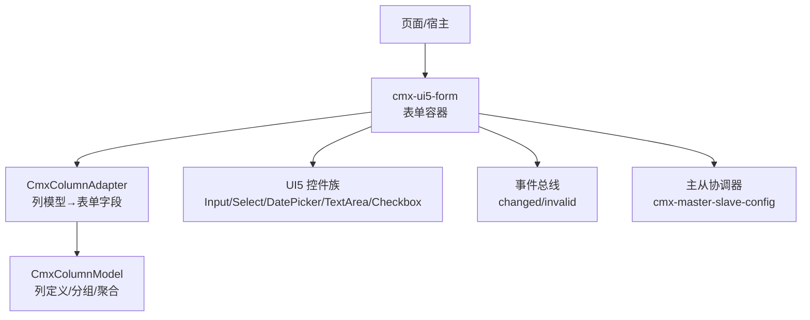
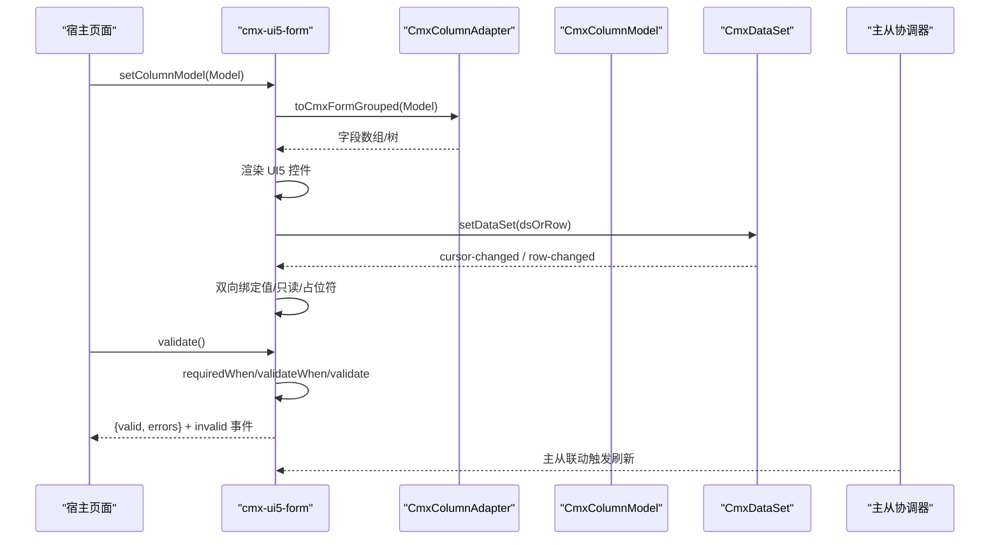
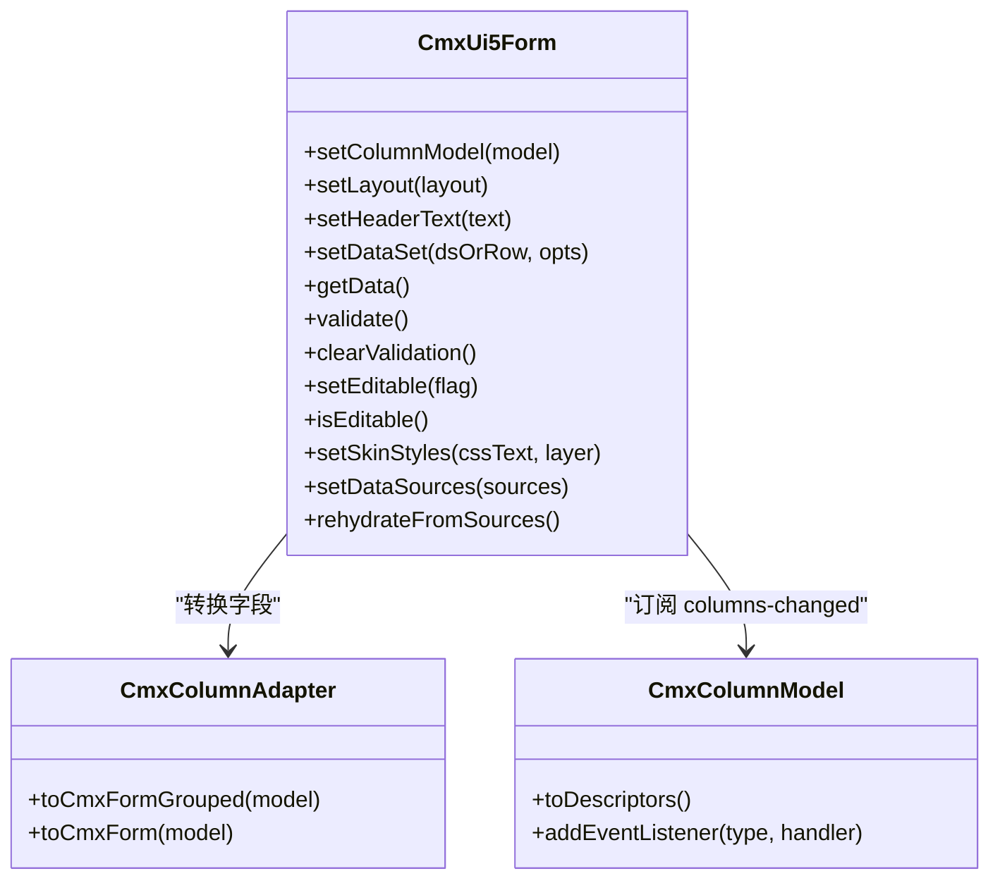
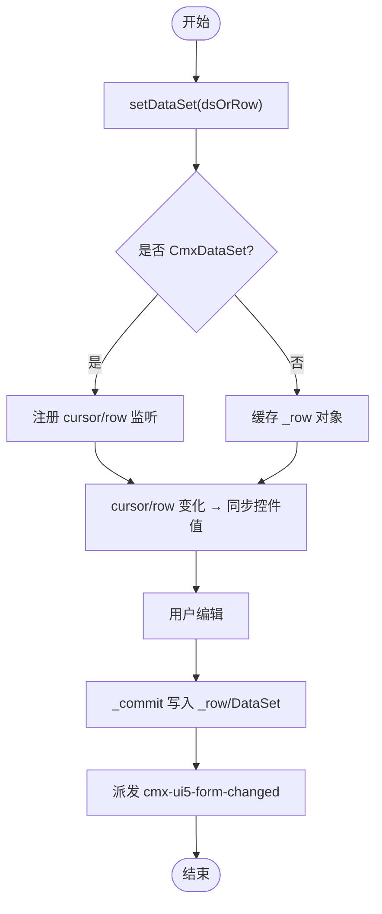
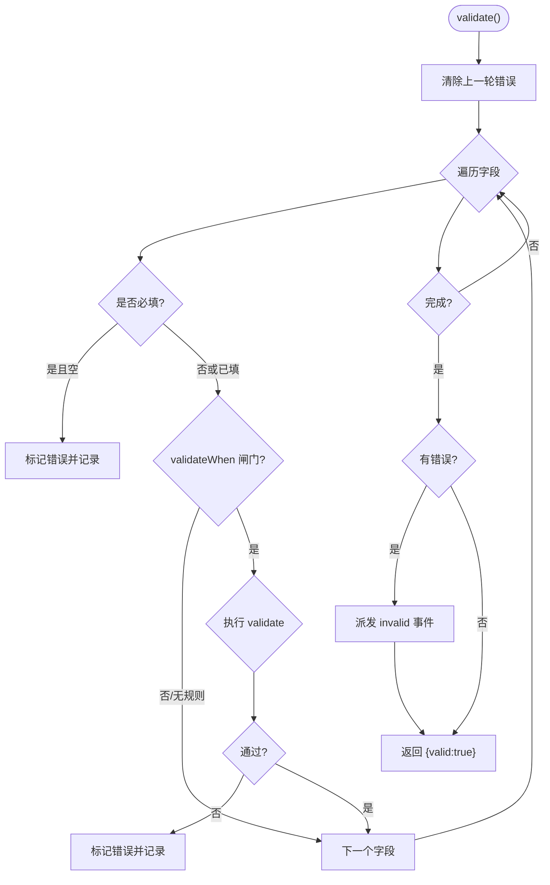
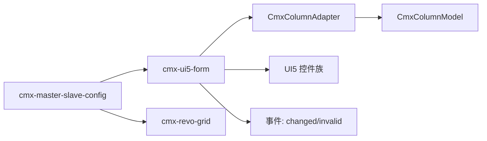

# 表单组件开发

<cite>
**本文引用的文件**
- [cmx-ui5-form.js](file://packages/cmx-data-comp/src/components/cmx-ui5-form.js)
- [form-components.md](file://.agents/skills/cmx-components-guide/references/form-components.md)
- [input-editors.md](file://.agents/skills/cmx-components-guide/references/input-editors.md)
- [model-column-model.md](file://.agents/skills/html-page-generator/references/model-column-model.md)
- [combo-box.md](file://.agents/skills/cmx-components-guide/references/combo-box.md)
- [dict-select.md](file://.agents/skills/cmx-components-guide/references/dict-select.md)
- [P8-组件列定义统一CmxColumnModel.md](file://docs/P8-组件列定义统一CmxColumnModel.md)
- [cmx-column-adapter.js](file://packages/cmx-data-comp/src/lib/cmx-column-adapter.js)
</cite>

## 目录
1. [简介](#简介)
2. [项目结构](#项目结构)
3. [核心组件](#核心组件)
4. [架构总览](#架构总览)
5. [详细组件分析](#详细组件分析)
6. [依赖关系分析](#依赖关系分析)
7. [性能考虑](#性能考虑)
8. [故障排查指南](#故障排查指南)
9. [结论](#结论)
10. [附录](#附录)

## 简介
本指南面向在 CMX 平台中开发可复用表单输入组件的工程师，聚焦以下目标：
- 基于 CmxColumnModel 的字段定义与双向数据绑定
- 实时验证、格式化显示与错误处理
- 与 cmx-ui5-form 及主从协调器的集成方式
- 常见控件（输入框、选择框、日期/时间选择器）的实现要点
- 无障碍访问支持与响应式布局适配

CMX 表单体系以 CmxColumnModel 为“列配方”，驱动表单与表格的统一渲染与编辑；cmx-ui5-form 是单行编辑表单的核心 Web Component，通过 setColumnModel 订阅 columns-changed 实现动态重渲染。

## 项目结构
- 表单核心组件：packages/cmx-data-comp/src/components/cmx-ui5-form.js
- 列模型与适配器：packages/cmx-data-comp/src/lib/cmx-column-adapter.js
- 文档参考：
  - .agents/skills/cmx-components-guide/references/form-components.md
  - .agents/skills/cmx-components-guide/references/input-editors.md
  - .agents/skills/cmx-components-guide/references/combo-box.md
  - .agents/skills/cmx-components-guide/references/dict-select.md
  - .agents/skills/html-page-generator/references/model-column-model.md
- 规范演进：docs/P8-组件列定义统一CmxColumnModel.md

图表来源
- [cmx-ui5-form.js:1-724](file://packages/cmx-data-comp/src/components/cmx-ui5-form.js#L1-L724)
- [cmx-column-adapter.js:511-579](file://packages/cmx-data-comp/src/lib/cmx-column-adapter.js#L511-L579)
- [form-components.md:13-90](file://.agents/skills/cmx-components-guide/references/form-components.md#L13-L90)

章节来源
- [cmx-ui5-form.js:1-200](file://packages/cmx-data-comp/src/components/cmx-ui5-form.js#L1-L200)
- [form-components.md:13-90](file://.agents/skills/cmx-components-guide/references/form-components.md#L13-L90)

## 核心组件
- cmx-ui5-form：基于 UI5 Form 的单行编辑表单，唯一字段定义入口为 setColumnModel(model)，支持响应式布局、分组、联动、校验、皮肤与多语言标签。
- CmxColumnModel/CmxColumn：统一的列/字段定义模型，包含 edit/display/validate/calcFormula 等配置，驱动 form/grid 渲染与交互。
- 输入编辑器：text/number/date/datetime 等封装 UI5 控件，提供统一 API 与事件，作为 form/grid 的字段编辑器。
- 选择器：cmx-combo-box（通用下拉/树/网格）与 cmx-dict-select（字典选择，含 MRU/help 弹层）。

章节来源
- [form-components.md:13-90](file://.agents/skills/cmx-components-guide/references/form-components.md#L13-L90)
- [input-editors.md:13-43](file://.agents/skills/cmx-components-guide/references/input-editors.md#L13-L43)
- [model-column-model.md:14-126](file://.agents/skills/html-page-generator/references/model-column-model.md#L14-L126)
- [combo-box.md:9-17](file://.agents/skills/cmx-components-guide/references/combo-box.md#L9-L17)
- [dict-select.md:9-26](file://.agents/skills/cmx-components-guide/references/dict-select.md#L9-L26)

## 架构总览
表单组件通过 CmxColumnModel 描述字段类型、编辑模式、显示格式与校验规则；cmx-ui5-form 将模型转换为 UI5 控件并建立与数据集的双向绑定；主从协调器负责主从数据联动与聚合。

图表来源
- [cmx-ui5-form.js:459-486](file://packages/cmx-data-comp/src/components/cmx-ui5-form.js#L459-L486)
- [cmx-column-adapter.js:531-579](file://packages/cmx-data-comp/src/lib/cmx-column-adapter.js#L531-L579)
- [form-components.md:218-294](file://.agents/skills/cmx-components-guide/references/form-components.md#L218-L294)

## 详细组件分析

### cmx-ui5-form 表单容器
- 字段定义：仅通过 setColumnModel(model) 注入，内部监听 columns-changed 自动重渲染。
- 数据绑定：setDataSet 支持 CmxDataSet（游标驱动）或单行对象；getData 返回当前行浅拷贝。
- 校验：validate() 逐字段校验 required/requiredWhen/validate/validateWhen，失败时设置 value-state=Negative 并派发 cmx-ui5-form-invalid。
- 事件：cmx-ui5-form-changed（值提交）、cmx-ui5-form-invalid（校验失败）。
- 响应式：setLayout('S1 M2 L3 XL3') 控制不同断点列数；flow 默认行优先布局。
- 皮肤与多语言：支持 neo/plain/default/none 皮肤与强调色；语言切换时就地更新 label 文本。

图表来源
- [cmx-ui5-form.js:459-486](file://packages/cmx-data-comp/src/components/cmx-ui5-form.js#L459-L486)
- [cmx-column-adapter.js:531-579](file://packages/cmx-data-comp/src/lib/cmx-column-adapter.js#L531-L579)

章节来源
- [cmx-ui5-form.js:1-200](file://packages/cmx-data-comp/src/components/cmx-ui5-form.js#L1-L200)
- [cmx-ui5-form.js:672-724](file://packages/cmx-data-comp/src/components/cmx-ui5-form.js#L672-L724)
- [form-components.md:20-70](file://.agents/skills/cmx-components-guide/references/form-components.md#L20-L70)

### 数据绑定与双向同步
- 绑定方式：setDataSet(dsOrRow) 支持 CmxDataSet 或普通对象；当使用 DataSet 时，监听 cursor-changed 与 row-changed 实现行切换与同行值回写。
- 值流向：用户输入 → 组件 _commit → 写入 _row/DataSet → 触发 changed 事件；外部修改 DataSet → 组件同步到控件。
- 只读与禁用：field.readonly/edit.mode 为 readonly/none 时控件只读；表单整体 setEditable(false) 覆盖所有字段可编辑性。

图表来源
- [cmx-ui5-form.js:124-193](file://packages/cmx-data-comp/src/components/cmx-ui5-form.js#L124-L193)
- [cmx-ui5-form.js:1371-1406](file://packages/cmx-data-comp/src/components/cmx-ui5-form.js#L1371-L1406)

章节来源
- [cmx-ui5-form.js:124-193](file://packages/cmx-data-comp/src/components/cmx-ui5-form.js#L124-L193)
- [cmx-ui5-form.js:1371-1406](file://packages/cmx-data-comp/src/components/cmx-ui5-form.js#L1371-L1406)

### 验证规则与错误处理
- 必填：required 或 requiredWhen（表达式求值），为空则标记错误。
- 条件校验：validateWhen 为真才执行 validate。
- 校验形式：函数、表达式、规则数组（按顺序匹配第一条失败消息）。
- 错误展示：value-state=Negative 并附带 message；同时派发 cmx-ui5-form-invalid。
- 清除错误：clearValidation() 清空所有字段错误态。

图表来源
- [cmx-ui5-form.js:672-724](file://packages/cmx-data-comp/src/components/cmx-ui5-form.js#L672-L724)
- [form-components.md:37-46](file://.agents/skills/cmx-components-guide/references/form-components.md#L37-L46)

章节来源
- [cmx-ui5-form.js:672-724](file://packages/cmx-data-comp/src/components/cmx-ui5-form.js#L672-L724)
- [form-components.md:37-46](file://.agents/skills/cmx-components-guide/references/form-components.md#L37-L46)

### 格式化显示与计算列
- 数值显示：display.mode='number' 或空时生效 decimalDigits/thousandSeparator/zeroAsBlank/negativeColor。
- 文本/日期显示：display.format 支持 date/datetime 预设格式。
- 计算列：edit.mode='readonly' 配合 calcFormula + dependsOn 自动重算。
- 适配器：CmxColumnAdapter.toCmxForm/toCmxFormGrouped 将列模型转为表单字段，保留 width/placeholder/options 等属性。

章节来源
- [model-column-model.md:101-144](file://.agents/skills/html-page-generator/references/model-column-model.md#L101-L144)
- [model-column-model.md:127-144](file://.agents/skills/html-page-generator/references/model-column-model.md#L127-L144)
- [cmx-column-adapter.js:531-579](file://packages/cmx-data-comp/src/lib/cmx-column-adapter.js#L531-L579)

### 与 CmxColumnModel 的集成
- 唯一入口：setColumnModel(model)，内部调用 CmxColumnAdapter.toCmxFormGrouped(model) 生成字段树/数组。
- 动态列：监听 model.columns-changed 自动重渲染。
- 元数据驱动：init-page-models 阶段将 DOC/DCT/FLC 元数据归一为 CmxColumn[] 并 setMembers，backfillColumnCoord 补全字典列坐标。

章节来源
- [cmx-ui5-form.js:459-486](file://packages/cmx-data-comp/src/components/cmx-ui5-form.js#L459-L486)
- [form-components.md:169-215](file://.agents/skills/cmx-components-guide/references/form-components.md#L169-L215)
- [model-column-model.md:312-333](file://.agents/skills/html-page-generator/references/model-column-model.md#L312-L333)

### 主从协调器集成
- 声明式：cmx-master-slave-config 通过 schema/aggregations/relations/dataSources/initialData 配置主从关系。
- 事件：cmx-ms-ready 后获取 ms 实例进行后续操作（如校验、导出）。
- 联动：表单/表格通过 data-cmx-master-slave-id 绑定，变更触发聚合与关联刷新。

章节来源
- [form-components.md:93-167](file://.agents/skills/cmx-components-guide/references/form-components.md#L93-L167)
- [form-components.md:218-294](file://.agents/skills/cmx-components-guide/references/form-components.md#L218-L294)

### 常见控件实现要点

#### 输入框（文本/电话/邮箱/身份证）
- 组件：cmx-text-input
- 特性：内置正则校验（phone/email/idcard），pattern 优先级高于 inputType；i18n 多语言值存储。
- 事件：cmx-value-change（含 valid）。

章节来源
- [input-editors.md:46-115](file://.agents/skills/cmx-components-guide/references/input-editors.md#L46-L115)

#### 数字输入（含表达式计算与微型计算器）
- 组件：cmx-number-input
- 特性：int/decimal 位数限制；失焦/回车对表达式求值；尾部计算器按钮。
- 事件：cmx-value-change。

章节来源
- [input-editors.md:118-192](file://.agents/skills/cmx-components-guide/references/input-editors.md#L118-L192)

#### 日期/日期时间选择器
- 组件：cmx-date-input / cmx-datetime-input
- 特性：formatPattern 默认 yyyy-MM-dd / yyyy-MM-dd HH:mm:ss；范围限制 min/max；自带 isValid 校验。
- 事件：cmx-value-change。

章节来源
- [input-editors.md:195-247](file://.agents/skills/cmx-components-guide/references/input-editors.md#L195-L247)
- [input-editors.md:250-300](file://.agents/skills/cmx-components-guide/references/input-editors.md#L250-L300)

#### 选择框（通用下拉/树/网格）
- 组件：cmx-combo-box
- 模式：list/tree/grid；支持远端搜索、分页、扩展按钮。
- 事件：cmx-combo-value-change/open/close/search/search-error/clear/ext-click。

章节来源
- [combo-box.md:9-17](file://.agents/skills/cmx-components-guide/references/combo-box.md#L9-L17)
- [combo-box.md:21-67](file://.agents/skills/cmx-components-guide/references/combo-box.md#L21-L67)
- [combo-box.md:99-133](file://.agents/skills/cmx-components-guide/references/combo-box.md#L99-L133)

#### 字典选择（MRU + help 弹层）
- 组件：cmx-dict-select
- 能力：MRU 最近选择、help 弹层 classify/group/grid 布局、dataSource 契约 search/loadByKeys。
- 事件：cmx-dict-change/open/help；plain 用于回写宿主各列。

章节来源
- [dict-select.md:9-26](file://.agents/skills/cmx-components-guide/references/dict-select.md#L9-L26)
- [dict-select.md:29-53](file://.agents/skills/cmx-components-guide/references/dict-select.md#L29-L53)
- [dict-select.md:94-147](file://.agents/skills/cmx-components-guide/references/dict-select.md#L94-L147)
- [dict-select.md:181-227](file://.agents/skills/cmx-components-guide/references/dict-select.md#L181-L227)

### 无障碍访问支持
- 设计器元数据中暴露 accessible-name/accessible-description 等属性，便于为 UI5 控件注入无障碍语义。
- 建议在自定义表单字段中为输入控件设置 accessible-name/accessibility-related 属性，确保屏幕阅读器可读。

章节来源
- [ui5-date-picker.json:65-107](file://CMXHTMLDesigner/src/metadata/tags/ui5/ui5-date-picker.json#L65-L107)
- [ui5-time-picker.json:62-116](file://CMXHTMLDesigner/src/metadata/tags/ui5/ui5-time-picker.json#L62-L116)
- [ui5-button.json:66-116](file://CMXHTMLDesigner/src/metadata/tags/ui5/ui5-button.json#L66-L116)
- [ui5-step-input.json:67-111](file://CMXHTMLDesigner/src/metadata/tags/ui5/ui5-step-input.json#L67-L111)
- [ui5-file-uploader.json:64-112](file://CMXHTMLDesigner/src/metadata/tags/ui5/ui5-file-uploader.json#L64-L112)

### 响应式设计适配
- 表单布局：setLayout('S1 M2 L3 XL3') 控制不同断点的列数；flow 默认行优先避免末位落单。
- 密度：data-cmx-density="compact" 收紧间距与固定 label 列宽。
- 跨列：field.colspan/columnSpan 让某字段跨多列。

章节来源
- [cmx-ui5-form.js:74-85](file://packages/cmx-data-comp/src/components/cmx-ui5-form.js#L74-L85)
- [cmx-ui5-form.js:1069-1087](file://packages/cmx-data-comp/src/components/cmx-ui5-form.js#L1069-L1087)
- [form-components.md:24-26](file://.agents/skills/cmx-components-guide/references/form-components.md#L24-L26)

## 依赖关系分析
- cmx-ui5-form 依赖 CmxColumnAdapter 将 CmxColumnModel 转换为表单字段；依赖 UI5 控件族渲染具体输入控件。
- 主从协调器通过 cmx-master-slave-config 声明式绑定 form/grid，管理 aggregations/relations。
- 列定义统一策略：通过 P8 规范收敛至 CmxColumnModel 单一入口，关闭自有列 API。

图表来源
- [cmx-ui5-form.js:459-486](file://packages/cmx-data-comp/src/components/cmx-ui5-form.js#L459-L486)
- [cmx-column-adapter.js:531-579](file://packages/cmx-data-comp/src/lib/cmx-column-adapter.js#L531-L579)
- [form-components.md:93-167](file://.agents/skills/cmx-components-guide/references/form-components.md#L93-L167)
- [P8-组件列定义统一CmxColumnModel.md:1-20](file://docs/P8-组件列定义统一CmxColumnModel.md#L1-L20)

章节来源
- [P8-组件列定义统一CmxColumnModel.md:1-20](file://docs/P8-组件列定义统一CmxColumnModel.md#L1-L20)
- [P8-组件列定义统一CmxColumnModel.md:51-62](file://docs/P8-组件列定义统一CmxColumnModel.md#L51-L62)

## 性能考虑
- 字段渲染缓存：_cells 缓存每个字段的 item/editor/label，避免重复查询与重建。
- 语言切换优化：仅更新 label 文本而不重建字段，减少开销。
- 脏检查：_lastRaw 缓存上次原始值，避免不必要的重置光标。
- 动态列：columns-changed 仅重渲染受影响字段。

章节来源
- [cmx-ui5-form.js:72-121](file://packages/cmx-data-comp/src/components/cmx-ui5-form.js#L72-L121)
- [cmx-ui5-form.js:145-167](file://packages/cmx-data-comp/src/components/cmx-ui5-form.js#L145-L167)

## 故障排查指南
- 校验不生效：确认 field.validateWhen 与 requiredWhen 表达式正确；scope 为当前整行。
- 错误未清除：调用 clearValidation() 或在重新绑定前清理状态。
- 主从联动异常：检查 cmx-master-slave-config 的 schema/relations/aggregations 配置是否正确。
- 字典选择 ID 随机：help grid 路径需在 setRows 前按 idCol 重塑 id，避免 addRow 生成随机占位。
- 列定义冲突：遵循 P8 规范，仅通过 CmxColumnModel 定义列，避免混用自有 API。

章节来源
- [cmx-ui5-form.js:672-724](file://packages/cmx-data-comp/src/components/cmx-ui5-form.js#L672-L724)
- [dict-select.md:231-249](file://.agents/skills/cmx-components-guide/references/dict-select.md#L231-L249)
- [P8-组件列定义统一CmxColumnModel.md:1-20](file://docs/P8-组件列定义统一CmxColumnModel.md#L1-L20)

## 结论
CMX 表单体系以 CmxColumnModel 为核心，结合 cmx-ui5-form 与主从协调器，实现了字段定义、数据绑定、实时验证、格式化显示与错误处理的完整闭环。通过统一的列模型与适配器，表单与表格共享同一套“列配方”，提升复用性与一致性。开发者应遵循 P8 规范，仅通过 CmxColumnModel 定义列，充分利用内置输入编辑器与选择器，并结合无障碍与响应式能力构建高质量表单体验。

## 附录
- 快速上手清单
  - 使用 setColumnModel(model) 绑定列模型
  - 使用 setDataSet(dsOrRow) 绑定数据源
  - 使用 validate() 进行提交前校验
  - 使用 cmx-master-slave-config 配置主从关系
  - 通过 display.format 与 editSettings 控制格式化与行为
  - 为输入控件设置 accessible-name 等无障碍属性

章节来源
- [form-components.md:218-294](file://.agents/skills/cmx-components-guide/references/form-components.md#L218-L294)
- [model-column-model.md:222-310](file://.agents/skills/html-page-generator/references/model-column-model.md#L222-L310)