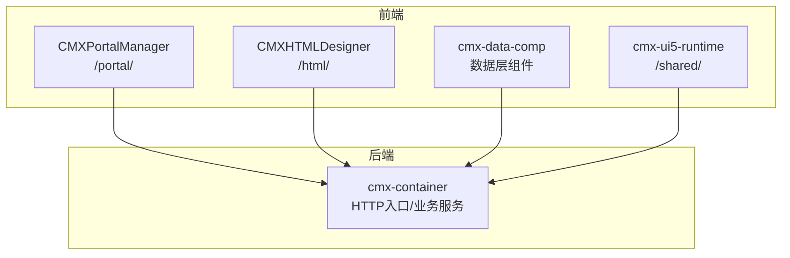
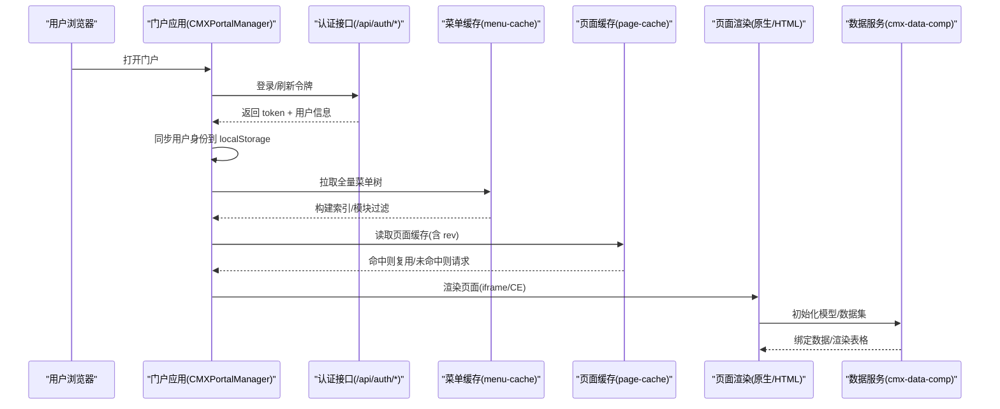
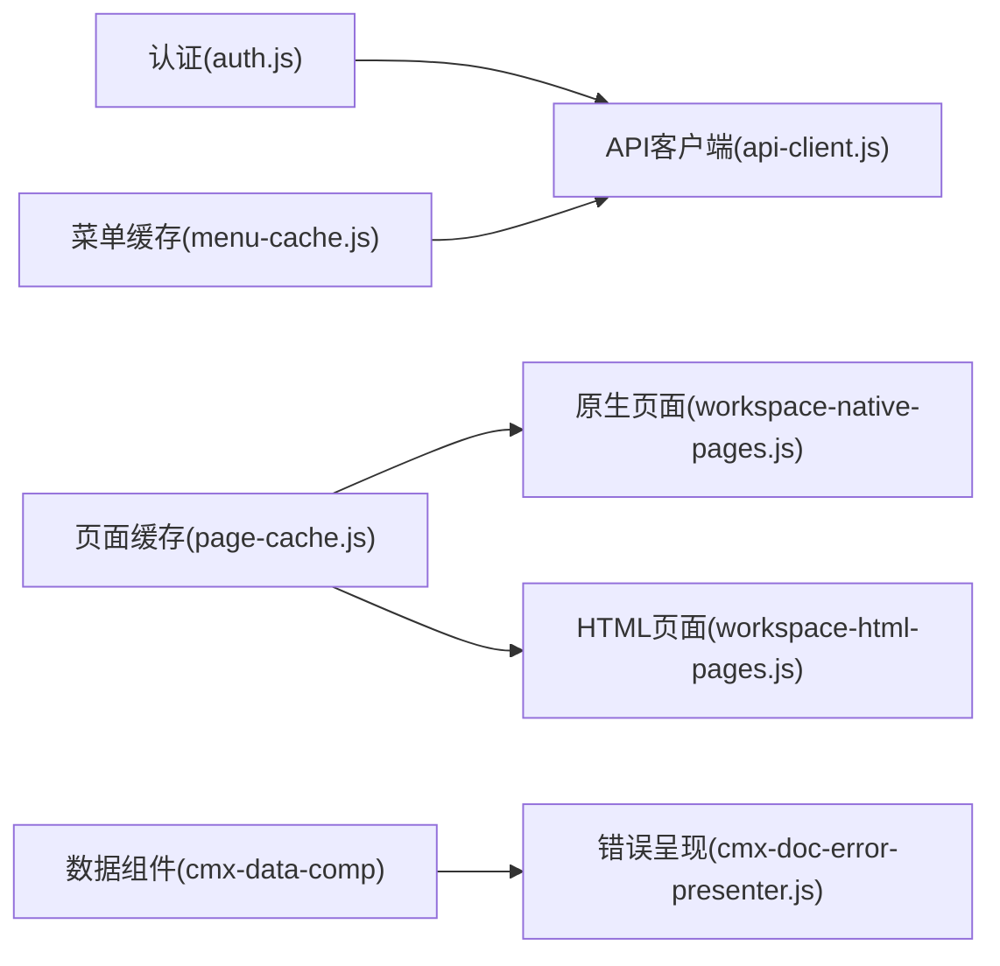

# 常见问题解答

<cite>
**本文引用的文件**
- [README.md](file://README.md)
- [CMXPortalManager/src/lib/auth.js](file://CMXPortalManager/src/lib/auth.js)
- [CMXHTMLDesigner/src/lib/auth.js](file://CMXHTMLDesigner/src/lib/auth.js)
- [CMXPortalManager/src/lib/api-client.js](file://CMXPortalManager/src/lib/api-client.js)
- [CMXHTMLDesigner/src/lib/api-client.js](file://CMXHTMLDesigner/src/lib/api-client.js)
- [CMXPortalManager/src/components/portal-side-nav-menu.js](file://CMXPortalManager/src/components/portal-side-nav-menu.js)
- [CMXPortalManager/src/lib/menu-cache.js](file://CMXPortalManager/src/lib/menu-cache.js)
- [CMXPortalManager/src/components/portal-menu-tree.js](file://CMXPortalManager/src/components/portal-menu-tree.js)
- [CMXPortalManager/src/lib/page-cache.js](file://CMXPortalManager/src/lib/page-cache.js)
- [CMXPortalManager/src/lib/workspace-native-pages.js](file://CMXPortalManager/src/lib/workspace-native-pages.js)
- [CMXPortalManager/src/lib/workspace-html-pages.js](file://CMXPortalManager/src/lib/workspace-html-pages.js)
- [packages/cmx-data-comp/src/lib/cmx-doc-error-presenter.js](file://packages/cmx-data-comp/src/lib/cmx-doc-error-presenter.js)
- [documents/复杂问题分析/20260724_cmx-dict-select字典引用列回显与选中失效根因分析.md](file://documents/复杂问题分析/20260724_cmx-dict-select字典引用列回显与选中失效根因分析.md)
- [documents/技术债/20260817_流程引擎_已知问题与技术债务.md](file://documents/技术债/20260817_流程引擎_已知问题与技术债务.md)
</cite>

## 目录
1. [简介](#简介)
2. [项目结构](#项目结构)
3. [核心组件](#核心组件)
4. [架构总览](#架构总览)
5. [详细组件分析](#详细组件分析)
6. [依赖关系分析](#依赖关系分析)
7. [性能注意事项](#性能注意事项)
8. [故障排查指南](#故障排查指南)
9. [结论](#结论)
10. [附录](#附录)

## 简介
本“常见问题解答”面向 CMX 企业门户平台的安装、配置与使用阶段，聚焦认证授权、菜单显示异常、页面加载失败、数据绑定错误等高频问题。文档基于仓库中的实现与复杂问题分析文档，提供根因分析与可操作的解决步骤，并给出预防建议与升级注意事项。同时汇总社区反馈的常见问题、已知缺陷的临时方案以及技术支持渠道。

## 项目结构
CMX Presentation 为 monorepo，包含：
- 门户运行时（CMXPortalManager）：路由 /portal/
- 可视化设计器（CMXHTMLDesigner）：路由 /html/
- 数据层 Web Components（packages/cmx-data-comp）
- 共享 UI5/Tabler 运行时（packages/cmx-ui5-runtime）

前后端通过 cmx-container 配套部署，构建产物由后端同源托管。

图表来源
- [README.md:45-55](file://README.md#L45-L55)

章节来源
- [README.md:1-73](file://README.md#L1-L73)

## 核心组件
- 认证授权：登录/登出/当前用户信息获取；token 存取与 401 处理；用户身份同步到本地存储以支撑待办中心按人过滤。
- 菜单系统：全量菜单树缓存、模块维度过滤、侧边导航渲染、右键编辑菜单节点。
- 页面加载与缓存：原生页面与 HTML 页面差异化加载；IndexedDB 持久化缓存；ETag/If-None-Match 命中复用；配额超限自动 LRU 淘汰。
- 数据绑定与表单：模型初始化、数据集与服务调用、字典引用列回显与选择事件派发。
- 错误呈现：DCT/DOC 存储服务错误结构化展示（冲突、校验失败、普通错误）。

章节来源
- [CMXPortalManager/src/lib/auth.js:1-66](file://CMXPortalManager/src/lib/auth.js#L1-L66)
- [CMXHTMLDesigner/src/lib/auth.js:1-78](file://CMXHTMLDesigner/src/lib/auth.js#L1-L78)
- [CMXPortalManager/src/lib/menu-cache.js:1-274](file://CMXPortalManager/src/lib/menu-cache.js#L1-L274)
- [CMXPortalManager/src/lib/page-cache.js:1-312](file://CMXPortalManager/src/lib/page-cache.js#L1-L312)
- [packages/cmx-data-comp/src/lib/cmx-doc-error-presenter.js:1-158](file://packages/cmx-data-comp/src/lib/cmx-doc-error-presenter.js#L1-L158)

## 架构总览
下图展示了从登录到菜单加载、页面渲染、数据绑定的关键路径，以及常见失败点与兜底策略。

图表来源
- [CMXPortalManager/src/lib/auth.js:33-66](file://CMXPortalManager/src/lib/auth.js#L33-L66)
- [CMXPortalManager/src/lib/menu-cache.js:170-205](file://CMXPortalManager/src/lib/menu-cache.js#L170-L205)
- [CMXPortalManager/src/lib/page-cache.js:391-415](file://CMXPortalManager/src/lib/page-cache.js#L391-L415)
- [CMXPortalManager/src/lib/workspace-native-pages.js:241-287](file://CMXPortalManager/src/lib/workspace-native-pages.js#L241-L287)

## 详细组件分析

### 认证与授权问题
典型现象
- 登录后仍提示未登录或跳转回登录页
- 待办中心按人筛选不生效
- 401 后无友好提示

根因与机制
- 登录成功后写入 access/refresh token，并异步同步 user_id/username 到 localStorage，供待办中心等按人过滤逻辑使用。
- 非 JSON 响应或 401 时，api-client 会清理 token 并跳转登录；认证端点自行处理信封。
- 登出会调用后端使令牌失效，并清理本地 token。

解决步骤
- 确认网络可达且 /api/auth/* 正常；检查浏览器是否拦截第三方 Cookie（同源场景一般不受影响）。
- 若待办中心按人筛选无效，确认已执行用户身份同步（登录成功后触发），必要时手动刷新页面。
- 遇到 401 时，检查是否被 api-client 清理了 token；如需保留会话，避免对认证端点之外的请求误判。

预防措施
- 保持后端鉴权服务稳定；在网关层统一处理 401 转发至登录页。
- 对敏感操作增加二次确认与重试提示。

章节来源
- [CMXPortalManager/src/lib/auth.js:33-66](file://CMXPortalManager/src/lib/auth.js#L33-L66)
- [CMXHTMLDesigner/src/lib/auth.js:33-78](file://CMXHTMLDesigner/src/lib/auth.js#L33-L78)
- [CMXPortalManager/src/lib/api-client.js:249-258](file://CMXPortalManager/src/lib/api-client.js#L249-L258)
- [CMXHTMLDesigner/src/lib/api-client.js:212-236](file://CMXHTMLDesigner/src/lib/api-client.js#L212-L236)

### 菜单显示异常
典型现象
- 侧边栏菜单为空或加载缓慢
- 某模块菜单不显示
- 右键编辑菜单节点无反应

根因与机制
- 全量菜单树通过 /api/menu/tree 一次性拉取，内存中构建索引并按域/应用/模块过滤；失败时不会标记“已加载”，下次会重试并 toast 提示。
- 可见性过滤：visible=0 的节点整枝剪除，不出现在侧边菜单与路由索引。
- 侧边导航支持右键上下文菜单编辑菜单节点，需正确冒泡事件到宿主对话框。

解决步骤
- 若菜单为空，检查 /api/menu/tree 是否返回 2xx；查看控制台是否有菜单加载失败的 toast。
- 确认菜单节点的 visible 字段与 domain/application/module 坐标是否正确。
- 右键编辑无响应时，检查是否在 ui5-side-navigation-item 上触发，并确保事件冒泡到 portal-app。

预防措施
- 将菜单维护纳入发布流程，确保 visible 与坐标一致。
- 对菜单树接口增加超时与重试策略，避免长时间阻塞。

章节来源
- [CMXPortalManager/src/lib/menu-cache.js:170-205](file://CMXPortalManager/src/lib/menu-cache.js#L170-L205)
- [CMXPortalManager/src/components/portal-side-nav-menu.js:518-630](file://CMXPortalManager/src/components/portal-side-nav-menu.js#L518-L630)
- [CMXPortalManager/src/components/portal-menu-tree.js:240-260](file://CMXPortalManager/src/components/portal-menu-tree.js#L240-L260)

### 页面加载失败
典型现象
- 原生页面打不开或白屏
- 页面加载慢、重复请求
- 能力中心不可达时提示不友好

根因与机制
- 原生页面优先读 IndexedDB 缓存，携带 If-None-Match 进行 304 命中；命中则复用 source，否则重新拉取并写回缓存。
- 页面缓存采用 LRU 上限与配额保护；配额超限时自动淘汰最旧条目并继续写入。
- 能力中心不可达时，渲染友好的空状态，区分“服务未就绪”与“页面打不开”。

解决步骤
- 若页面频繁重传，检查服务端是否返回正确的 ETag/rev；确认客户端是否携带 If-None-Match。
- 若出现配额不足导致缓存写入失败，等待自动 LRU 淘汰或清理浏览器存储后重试。
- 当提示“能力中心暂未就绪”，先启动对应微服务或修复反向代理后再重试。

预防措施
- 合理设置页面缓存大小与淘汰策略；监控 storage estimate。
- 对后端服务增加健康检查与降级文案，提升用户体验。

章节来源
- [CMXPortalManager/src/lib/page-cache.js:140-171](file://CMXPortalManager/src/lib/page-cache.js#L140-L171)
- [CMXPortalManager/src/lib/page-cache.js:214-243](file://CMXPortalManager/src/lib/page-cache.js#L214-L243)
- [CMXPortalManager/src/lib/workspace-native-pages.js:391-415](file://CMXPortalManager/src/lib/workspace-native-pages.js#L391-L415)
- [CMXPortalManager/src/lib/workspace-native-pages.js:241-287](file://CMXPortalManager/src/lib/workspace-native-pages.js#L241-L287)

### 数据绑定错误
典型现象
- 字典引用列首次加载只显示 code，不显示名称
- help 弹窗选择确定后单元格不更新
- 表单提交报 422/409，但前端提示不清晰

根因与机制
- 字典引用列回显存在两条路径：enableDictEcho 挂 display.resolve（只读 refDict 列）与 cellTemplate 从行展开字段读（dict-select 编辑列）。两者互补而非互斥。
- help 弹窗的行 id 必须与 idCol 对齐，否则 getSelectedIds 无法匹配原始行，导致事件不派发。
- DCT/DOC 存储服务错误被结构化：冲突（409）、校验失败（422 带 violations）、普通错误；presentDocError 统一弹出专业对话框。

解决步骤
- 若字典列首次加载仅显示 code，检查 enableDictEcho 是否对 dict-select 列生效，以及 display.resolve 是否存在。
- 若 help 弹窗选择后不更新，确认 _loadHelpGrid 已将行 id 映射到 idCol（如 code），保证选中 id 与行 id 一致。
- 遇到 422/409，根据 presentDocError 的描述对象级别与标题，定位具体列与行，修正数据或并发冲突。

预防措施
- 在元数据建模时确保 refDict/refField/displayField 与 editSettings 完整；避免 toDescriptor 丢失字段。
- 对批量装载引入 errors[] 模式，部分失败不影响整体加载。

章节来源
- [documents/复杂问题分析/20260724_cmx-dict-select字典引用列回显与选中失效根因分析.md:20-76](file://documents/复杂问题分析/20260724_cmx-dict-select字典引用列回显与选中失效根因分析.md#L20-L76)
- [packages/cmx-data-comp/src/lib/cmx-doc-error-presenter.js:1-158](file://packages/cmx-data-comp/src/lib/cmx-doc-error-presenter.js#L1-L158)
- [docs/业务单据数据装载与前端模型映射方案.md:1180-1183](file://docs/业务单据数据装载与前端模型映射方案.md#L1180-L1183)

### 流程引擎相关的高频问题
典型现象
- 多业务系统接入时 webhook 投递延迟或丢消息
- 实例并发修改导致状态错乱
- 死信/作业管理在前端不可见

根因与机制
- 出站 webhook 广播投递、串行消费、内存队列、无死信表；密钥全局唯一，无订阅过滤。
- 实例写路径无乐观锁，save_snapshot 全删重插，后写覆盖先写；边界定时器在多副本下重复触发。
- 死信/作业 REST 端点已补齐，但前端未接入，运维台仍单实例粒度。

解决步骤
- 对 webhook 接入方增加幂等与重试；短期可通过回调入口规则过滤与懒同步兜底。
- 避免同一实例并发 complete/claim；如需水平扩展，需补齐乐观锁与抢占机制。
- 使用后端提供的死信/作业端点进行人工重试与丢弃；后续在前端补面板。

预防措施
- 限制并发访问实例；对关键操作加分布式锁或排队。
- 将 webhook 配置改为多 target 独立密钥与订阅过滤；补齐死信表与前端管理。

章节来源
- [documents/技术债/20260817_流程引擎_已知问题与技术债务.md:39-92](file://documents/技术债/20260817_流程引擎_已知问题与技术债务.md#L39-L92)
- [documents/技术债/20260817_流程引擎_已知问题与技术债务.md:192-225](file://documents/技术债/20260817_流程引擎_已知问题与技术债务.md#L192-L225)
- [documents/技术债/20260817_流程引擎_已知问题与技术债务.md:255-270](file://documents/技术债/20260817_流程引擎_已知问题与技术债务.md#L255-L270)

## 依赖关系分析
- 认证模块依赖 api-client 的 token 存取与 401 处理；门户与设计器共用认证逻辑。
- 菜单缓存依赖后端 /api/menu/tree，并在内存中构建索引与模块过滤。
- 页面缓存依赖 IndexedDB，并与原生/HTML 页面加载逻辑协作，使用 rev 做 ETag。
- 数据绑定依赖 cmx-data-comp 的模型初始化与服务调用；错误呈现收敛到 cmx-doc-error-presenter。

图表来源
- [CMXPortalManager/src/lib/auth.js:1-66](file://CMXPortalManager/src/lib/auth.js#L1-L66)
- [CMXPortalManager/src/lib/menu-cache.js:1-274](file://CMXPortalManager/src/lib/menu-cache.js#L1-L274)
- [CMXPortalManager/src/lib/page-cache.js:1-312](file://CMXPortalManager/src/lib/page-cache.js#L1-L312)
- [packages/cmx-data-comp/src/lib/cmx-doc-error-presenter.js:1-158](file://packages/cmx-data-comp/src/lib/cmx-doc-error-presenter.js#L1-L158)

章节来源
- [CMXPortalManager/src/lib/auth.js:1-66](file://CMXPortalManager/src/lib/auth.js#L1-L66)
- [CMXPortalManager/src/lib/menu-cache.js:1-274](file://CMXPortalManager/src/lib/menu-cache.js#L1-L274)
- [CMXPortalManager/src/lib/page-cache.js:1-312](file://CMXPortalManager/src/lib/page-cache.js#L1-L312)
- [packages/cmx-data-comp/src/lib/cmx-doc-error-presenter.js:1-158](file://packages/cmx-data-comp/src/lib/cmx-doc-error-presenter.js#L1-L158)

## 性能注意事项
- 菜单树一次拉取、内存索引与模块过滤，减少重复请求；失败时自动重试并 toast。
- 页面缓存使用 IndexedDB 与 LRU 策略，避免 localStorage 容量瓶颈；配额超限时自动淘汰。
- 原生页面加载利用 If-None-Match/304 命中，降低带宽与首屏时间。
- 数据绑定在服务端返回 rows 后通过数据集增量变更驱动渲染，减少重绘。

[本节为通用性能指导，无需特定文件来源]

## 故障排查指南
- 认证失败
  - 检查 /api/auth/login 与 /api/auth/me 的网络状态与响应码；确认 token 已写入并可用。
  - 若 401，确认 api-client 是否清理了 token 并跳转登录。
  - 待办中心按人筛选无效时，确认用户身份已同步到 localStorage。

- 菜单为空或加载慢
  - 查看 /api/menu/tree 的 HTTP 状态与控制台日志；关注 menu-cache 的 toast。
  - 检查菜单节点 visible 与 domain/application/module 坐标。

- 页面打不开或服务未就绪
  - 检查能力中心是否启动、反向代理是否可达；观察 workspace-native-pages 的错误分类。
  - 若 304 命中但本地无缓存，触发无条件重取。

- 数据绑定错误
  - 字典引用列回显：确认 enableDictEcho 与 display.resolve；help 弹窗行 id 与 idCol 对齐。
  - 保存冲突或校验失败：依据 cmx-doc-error-presenter 的描述对象定位列与行，修正数据或并发冲突。

章节来源
- [CMXPortalManager/src/lib/auth.js:33-66](file://CMXPortalManager/src/lib/auth.js#L33-L66)
- [CMXPortalManager/src/lib/menu-cache.js:170-205](file://CMXPortalManager/src/lib/menu-cache.js#L170-L205)
- [CMXPortalManager/src/lib/workspace-native-pages.js:241-287](file://CMXPortalManager/src/lib/workspace-native-pages.js#L241-L287)
- [packages/cmx-data-comp/src/lib/cmx-doc-error-presenter.js:1-158](file://packages/cmx-data-comp/src/lib/cmx-doc-error-presenter.js#L1-L158)

## 结论
本 FAQ 围绕认证授权、菜单显示、页面加载与数据绑定四大类高频问题，结合仓库实现与复杂问题分析文档，提供了根因分析与可操作步骤。建议在部署与使用中重视菜单可见性与坐标、页面缓存与 ETag、数据绑定回显路径与错误结构化，以提升稳定性与用户体验。对于流程引擎的多业务系统接入与可靠性问题，建议按技术债清单逐步补齐权限、隔离与可观测性。

[本节为总结性内容，无需特定文件来源]

## 附录

### 版本升级注意事项
- 商业依赖：SpreadJS、Ignite UI 等增强组件需自备合法授权；未持有授权时相关功能不可用但不影响其余组件与后端。
- 前端双镜像：web/ 与 web/ui-native/ 存在手工维护的双镜像风险，建议统一构建产物或增加一致性校验。
- 流程引擎：注意多副本部署下的定时器抢占、定义热装载与 SSE 事件总线限制；主实例路径仍为单写者假设。

章节来源
- [README.md:57-67](file://README.md#L57-L67)
- [documents/技术债/20260817_流程引擎_已知问题与技术债务.md:299-307](file://documents/技术债/20260817_流程引擎_已知问题与技术债务.md#L299-L307)
- [documents/技术债/20260817_流程引擎_已知问题与技术债务.md:367-375](file://documents/技术债/20260817_流程引擎_已知问题与技术债务.md#L367-L375)

### 问题反馈渠道与支持
- 贡献与安全：参见 CONTRIBUTING.md 与 SECURITY.md；安全问题请勿开公开 Issue。
- 社区资源：仓库内 docs 与 documents 包含大量方案与评估报告，可作为参考与反馈素材。
- 技术支持：如遇生产问题，优先收集网络日志、控制台输出与错误描述，再联系平台运维或开发团队。

章节来源
- [README.md:68-73](file://README.md#L68-L73)