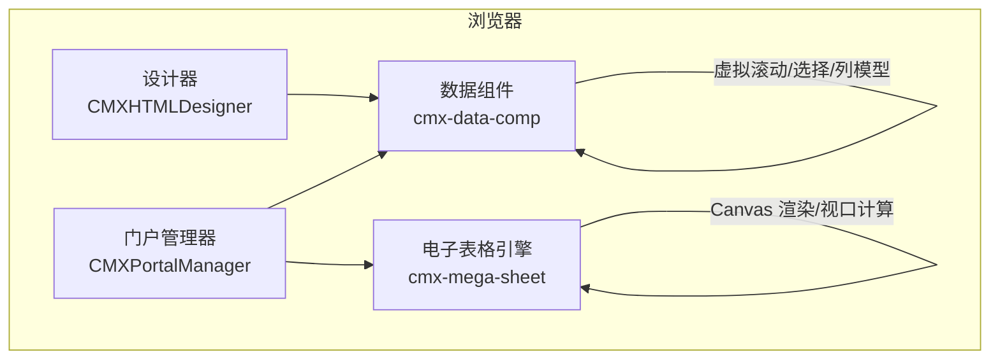
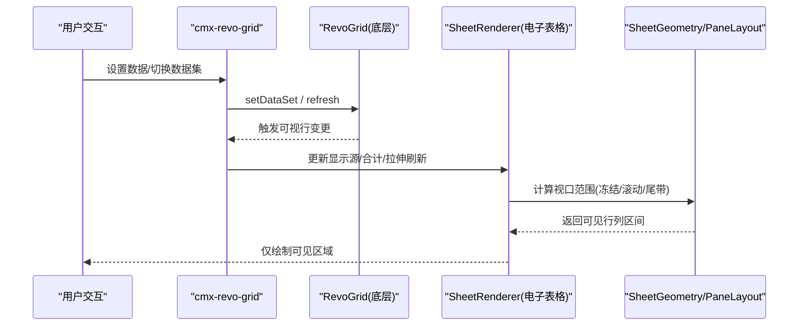
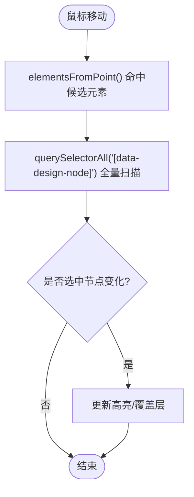
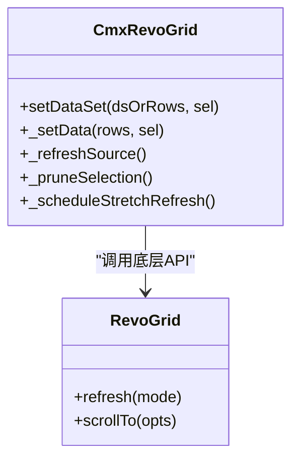
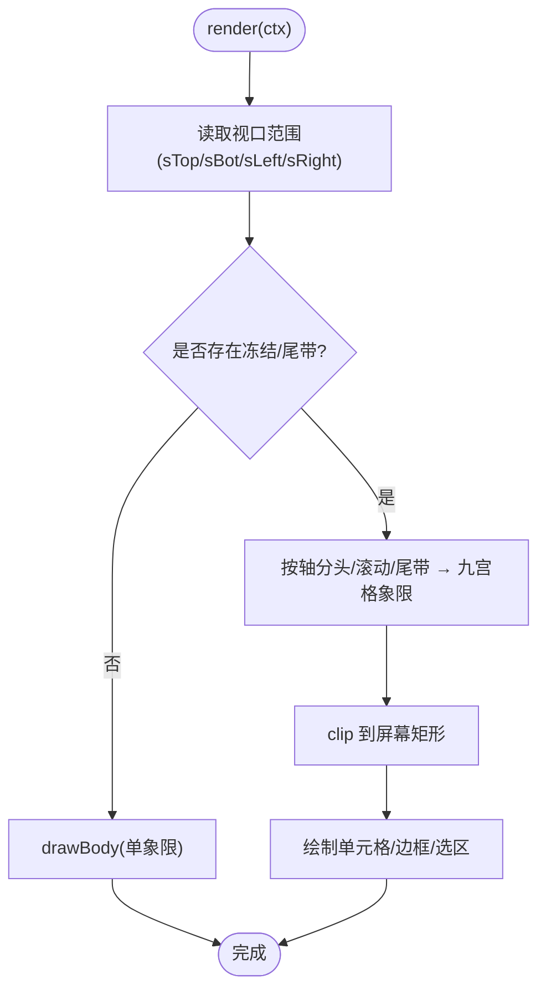
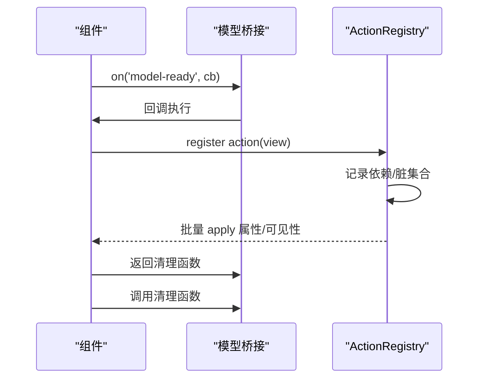
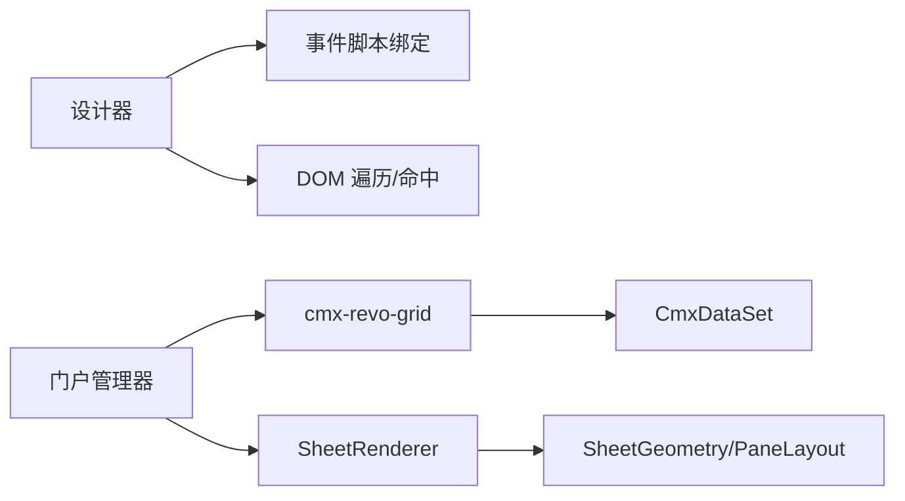

# 性能问题排查

<cite>
**本文引用的文件**
- [CMXHTMLDesigner/quality-assessment-report.md](file://CMXHTMLDesigner/quality-assessment-report.md)
- [CMXPortalManager/CMXPortalManager-评估报告.md](file://CMXPortalManager/CMXPortalManager-评估报告.md)
- [packages/cmx-data-comp/src/components/cmx-revo-grid.js](file://packages/cmx-data-comp/src/components/cmx-revo-grid.js)
- [cmx-mega-sheet/src/render/SheetRenderer.ts](file://cmx-mega-sheet/src/render/SheetRenderer.ts)
- [cmx-mega-sheet/src/render/PaneLayout.ts](file://cmx-mega-sheet/src/render/PaneLayout.ts)
- [cmx-mega-sheet/src/render/SheetGeometry.ts](file://cmx-mega-sheet/src/render/SheetGeometry.ts)
- [packages/cmx-data-comp/src/lib/cmx-page-model-bridge.js](file://packages/cmx-data-comp/src/lib/cmx-page-model-bridge.js)
- [CMXHTMLDesigner/src/utils/drag-resize.js](file://CMXHTMLDesigner/src/utils/drag-resize.js)
- [CMXPortalManager/src/lib/action-registry.js](file://CMXPortalManager/src/lib/action-registry.js)
- [CMXPortalManager/src/lib/workspace-html-page-preview.js](file://CMXPortalManager/src/lib/workspace-html-page-preview.js)
</cite>

## 目录
1. [引言](#引言)
2. [项目结构](#项目结构)
3. [核心组件](#核心组件)
4. [架构总览](#架构总览)
5. [详细组件分析](#详细组件分析)
6. [依赖关系分析](#依赖关系分析)
7. [性能考量与优化策略](#性能考量与优化策略)
8. [故障排查指南](#故障排查指南)
9. [结论](#结论)
10. [附录](#附录)

## 引言
本指南面向 CMX 企业门户平台（含设计器与门户管理器）的性能问题排查与优化，聚焦以下目标：
- 定位并修复 O(n²) 节点查找等算法瓶颈
- 识别内存泄漏风险点并提供清理方案
- 给出 CPU 使用率分析与渲染性能优化方法
- 针对大型页面、复杂表格、大量数据渲染场景提供可落地的优化策略
- 建立监控指标收集、基准测试与渐进式优化的工程化流程

## 项目结构
本项目由多个子系统组成，与性能密切相关的模块包括：
- 设计器（CMXHTMLDesigner）：可视化画布、事件绑定、DOM 操作密集
- 门户管理器（CMXPortalManager）：工作区、视图渲染、缓存与生命周期管理
- 数据组件（packages/cmx-data-comp）：表格组件封装、数据集联动、虚拟滚动配置
- 电子表格引擎（cmx-mega-sheet）：高性能 Canvas 渲染、视口虚拟化、冻结/尾带布局

图表来源
- [CMXHTMLDesigner/quality-assessment-report.md:11-24](file://CMXHTMLDesigner/quality-assessment-report.md#L11-L24)
- [CMXPortalManager/CMXPortalManager-评估报告.md:78-106](file://CMXPortalManager/CMXPortalManager-评估报告.md#L78-L106)
- [packages/cmx-data-comp/src/components/cmx-revo-grid.js:1-44](file://packages/cmx-data-comp/src/components/cmx-revo-grid.js#L1-L44)
- [cmx-mega-sheet/src/render/SheetRenderer.ts:1-21](file://cmx-mega-sheet/src/render/SheetRenderer.ts#L1-L21)

章节来源
- [CMXHTMLDesigner/quality-assessment-report.md:11-24](file://CMXHTMLDesigner/quality-assessment-report.md#L11-L24)
- [CMXPortalManager/CMXPortalManager-评估报告.md:78-106](file://CMXPortalManager/CMXPortalManager-评估报告.md#L78-L106)

## 核心组件
- 设计器画布：负责 DOM 选择、事件绑定、历史撤销重做、缩放与对齐。存在 O(n²) 节点查找与事件监听器泄漏风险。
- 表格组件 cmx-revo-grid：基于 RevoGrid 的封装，支持虚拟滚动、选择、列模型、皮肤与工具提示等。
- 电子表格 SheetRenderer：仅绘制可见区域，结合 SheetGeometry/PaneLayout 实现冻结/尾带/滚动带的高效布局与渲染。
- 模型桥接与动作注册：统一事件订阅/释放、Action 视图同步与断连清理，避免内存泄漏。

章节来源
- [CMXHTMLDesigner/quality-assessment-report.md:153-175](file://CMXHTMLDesigner/quality-assessment-report.md#L153-L175)
- [packages/cmx-data-comp/src/components/cmx-revo-grid.js:71-155](file://packages/cmx-data-comp/src/components/cmx-revo-grid.js#L71-L155)
- [cmx-mega-sheet/src/render/SheetRenderer.ts:165-200](file://cmx-mega-sheet/src/render/SheetRenderer.ts#L165-L200)
- [CMXPortalManager/src/lib/action-registry.js:89-129](file://CMXPortalManager/src/lib/action-registry.js#L89-L129)

## 架构总览
下图展示关键渲染路径与数据流，突出虚拟滚动与可见区域裁剪对性能的影响。

图表来源
- [packages/cmx-data-comp/src/components/cmx-revo-grid.js:734-792](file://packages/cmx-data-comp/src/components/cmx-revo-grid.js#L734-L792)
- [cmx-mega-sheet/src/render/SheetRenderer.ts:165-200](file://cmx-mega-sheet/src/render/SheetRenderer.ts#L165-L200)
- [cmx-mega-sheet/src/render/PaneLayout.ts:137-163](file://cmx-mega-sheet/src/render/PaneLayout.ts#L137-L163)

## 详细组件分析

### 设计器画布：O(n²) 节点查找与事件泄漏
- 问题定位
  - 鼠标移动时双重遍历 DOM，导致复杂页面卡顿。
  - window 级别事件监听未清理，组件重挂载累积，造成内存泄漏。
- 影响
  - 大型页面设计时明显卡顿；长时间运行后内存增长。
- 优化建议
  - 将节点查找改为索引映射或空间分割（如四叉树），降低每次命中复杂度。
  - 在 disconnectedCallback 中统一移除所有 window/document 级监听。
  - 对高频事件使用节流/防抖，减少重复计算。

图表来源
- [CMXHTMLDesigner/quality-assessment-report.md:153-166](file://CMXHTMLDesigner/quality-assessment-report.md#L153-L166)
- [CMXHTMLDesigner/quality-assessment-report.md:168-175](file://CMXHTMLDesigner/quality-assessment-report.md#L168-L175)

章节来源
- [CMXHTMLDesigner/quality-assessment-report.md:153-175](file://CMXHTMLDesigner/quality-assessment-report.md#L153-L175)

### 表格组件 cmx-revo-grid：大数据渲染与选择同步
- 关键点
  - 默认开启虚拟滚动，适合大数据量。
  - 通过 setDataSet 绑定 CmxDataSet，自动处理选择状态、滚动位置与合计行。
  - 数据切换后需重新计算 stretch，避免横向溢出。
- 优化建议
  - 合理设置 rowHeight、viewHeight、minRows，平衡每屏行数与滚动体验。
  - 批量更新数据时使用 DataSet API，避免频繁全量刷新。
  - 关闭不必要的功能（如 cellTooltip、alternateRowColor）以减轻渲染压力。

图表来源
- [packages/cmx-data-comp/src/components/cmx-revo-grid.js:734-792](file://packages/cmx-data-comp/src/components/cmx-revo-grid.js#L734-L792)
- [packages/cmx-data-comp/src/components/cmx-revo-grid.js:857-892](file://packages/cmx-data-comp/src/components/cmx-revo-grid.js#L857-L892)

章节来源
- [packages/cmx-data-comp/src/components/cmx-revo-grid.js:71-155](file://packages/cmx-data-comp/src/components/cmx-revo-grid.js#L71-L155)
- [packages/cmx-data-comp/src/components/cmx-revo-grid.js:734-792](file://packages/cmx-data-comp/src/components/cmx-revo-grid.js#L734-L792)
- [packages/cmx-data-comp/src/components/cmx-revo-grid.js:857-892](file://packages/cmx-data-comp/src/components/cmx-revo-grid.js#L857-L892)

### 电子表格 SheetRenderer：可见区域渲染与布局
- 关键点
  - 仅绘制可见区域，冻结/滚动/尾带三轴组合为九宫格象限，分别 clip 到屏幕矩形。
  - 通过 SheetGeometry/PaneLayout 计算视口行列范围，保证滚动与缩放正确性。
- 优化建议
  - 保持冻结行列数量最小化，减少象限划分开销。
  - 条件格式规则尽量精简，避免每帧重算。
  - 图片等资源加入缓存，减少重复绘制。

图表来源
- [cmx-mega-sheet/src/render/SheetRenderer.ts:165-200](file://cmx-mega-sheet/src/render/SheetRenderer.ts#L165-L200)
- [cmx-mega-sheet/src/render/PaneLayout.ts:137-163](file://cmx-mega-sheet/src/render/PaneLayout.ts#L137-L163)

章节来源
- [cmx-mega-sheet/src/render/SheetRenderer.ts:165-200](file://cmx-mega-sheet/src/render/SheetRenderer.ts#L165-L200)
- [cmx-mega-sheet/src/render/PaneLayout.ts:137-163](file://cmx-mega-sheet/src/render/PaneLayout.ts#L137-L163)

### 模型桥接与动作注册：事件与视图的生命周期管理
- 关键点
  - 统一 on/off 模式，返回清理函数，确保事件解绑。
  - ActionRegistry 维护依赖图与脏集合，批量 flush 更新，避免频繁 DOM 操作。
  - 使用 MutationObserver 检测节点断开，集中清理已断连元素的监听。
- 优化建议
  - 所有 window/document 事件必须返回清理函数并在组件卸载时调用。
  - 对高频变更使用合并更新（debounce/throttle）+ 批量应用。

图表来源
- [packages/cmx-data-comp/src/lib/cmx-page-model-bridge.js:31-69](file://packages/cmx-data-comp/src/lib/cmx-page-model-bridge.js#L31-L69)
- [CMXPortalManager/src/lib/action-registry.js:89-129](file://CMXPortalManager/src/lib/action-registry.js#L89-L129)

章节来源
- [packages/cmx-data-comp/src/lib/cmx-page-model-bridge.js:31-69](file://packages/cmx-data-comp/src/lib/cmx-page-model-bridge.js#L31-L69)
- [CMXPortalManager/src/lib/action-registry.js:89-129](file://CMXPortalManager/src/lib/action-registry.js#L89-L129)

## 依赖关系分析
- 设计器与数据组件耦合点：事件脚本编译与绑定、DOM 操作频率。
- 门户与表格组件：通过 CmxDataSet 驱动表格渲染，关注数据切换时的选择与滚动状态。
- 电子表格与布局：SheetRenderer 强依赖 SheetGeometry/PaneLayout 的视口计算结果，任何尺寸/缩放变化都会触发重绘。

图表来源
- [CMXHTMLDesigner/quality-assessment-report.md:153-175](file://CMXHTMLDesigner/quality-assessment-report.md#L153-L175)
- [packages/cmx-data-comp/src/components/cmx-revo-grid.js:734-792](file://packages/cmx-data-comp/src/components/cmx-revo-grid.js#L734-L792)
- [cmx-mega-sheet/src/render/SheetRenderer.ts:165-200](file://cmx-mega-sheet/src/render/SheetRenderer.ts#L165-L200)

章节来源
- [CMXHTMLDesigner/quality-assessment-report.md:153-175](file://CMXHTMLDesigner/quality-assessment-report.md#L153-L175)
- [packages/cmx-data-comp/src/components/cmx-revo-grid.js:734-792](file://packages/cmx-data-comp/src/components/cmx-revo-grid.js#L734-L792)
- [cmx-mega-sheet/src/render/SheetRenderer.ts:165-200](file://cmx-mega-sheet/src/render/SheetRenderer.ts#L165-L200)

## 性能考量与优化策略

### 内存泄漏检测与修复
- 常见泄漏点
  - 全局事件监听未在组件卸载时移除（设计器画布）。
  - 窗口级定时器/轮询未清理（模型桥接）。
  - 组件重挂载累积监听（动作注册中的断连观察）。
- 修复要点
  - 所有 addEventListener 必须配对 removeEventListener，或在 disconnectedCallback 中统一清理。
  - 使用返回清理函数的 on 模式，确保异步回调不再持有引用。
  - 对 MutationObserver 进行一次性初始化，并在合适时机 disconnect。

章节来源
- [CMXHTMLDesigner/quality-assessment-report.md:168-175](file://CMXHTMLDesigner/quality-assessment-report.md#L168-L175)
- [packages/cmx-data-comp/src/lib/cmx-page-model-bridge.js:31-69](file://packages/cmx-data-comp/src/lib/cmx-page-model-bridge.js#L31-L69)
- [CMXPortalManager/src/lib/action-registry.js:89-129](file://CMXPortalManager/src/lib/action-registry.js#L89-L129)

### CPU 使用率分析与热点定位
- 热点场景
  - 设计器画布 O(n²) 节点查找（鼠标移动/点击）。
  - 表格组件频繁刷新与选择同步。
  - 电子表格冻结/尾带布局计算与条件格式重算。
- 分析方法
  - 使用浏览器 Performance 面板录制交互过程，定位长任务与重复计算。
  - 使用 Memory 面板对比快照，检查闭包/监听器/大对象残留。
  - 对关键函数添加计时日志，比较优化前后耗时。

章节来源
- [CMXHTMLDesigner/quality-assessment-report.md:153-166](file://CMXHTMLDesigner/quality-assessment-report.md#L153-L166)
- [packages/cmx-data-comp/src/components/cmx-revo-grid.js:734-792](file://packages/cmx-data-comp/src/components/cmx-revo-grid.js#L734-L792)
- [cmx-mega-sheet/src/render/SheetRenderer.ts:165-200](file://cmx-mega-sheet/src/render/SheetRenderer.ts#L165-L200)

### 渲染性能优化
- 设计器
  - 将节点命中从 O(n²) 降为 O(log n) 或 O(1)，引入索引或空间分割。
  - 对高频事件节流/防抖，减少覆盖层重绘。
- 表格
  - 启用虚拟滚动，合理设置 rowHeight/viewHeight/minRows。
  - 减少 cellTooltip、alternateRowColor 等视觉增强项的开销。
- 电子表格
  - 控制冻结行列数量，减少象限划分。
  - 条件格式规则精简，避免每帧重算。
  - 图片等资源缓存复用。

章节来源
- [packages/cmx-data-comp/src/components/cmx-revo-grid.js:71-155](file://packages/cmx-data-comp/src/components/cmx-revo-grid.js#L71-L155)
- [cmx-mega-sheet/src/render/SheetRenderer.ts:165-200](file://cmx-mega-sheet/src/render/SheetRenderer.ts#L165-L200)
- [cmx-mega-sheet/src/render/PaneLayout.ts:137-163](file://cmx-mega-sheet/src/render/PaneLayout.ts#L137-L163)

### 大型页面、复杂表格、大量数据渲染策略
- 大型页面
  - 拆分模块与懒加载，避免首屏过大。
  - 使用 requestAnimationFrame 分批更新 UI。
- 复杂表格
  - 使用虚拟滚动与分页/游标加载。
  - 批量更新数据，避免逐行刷新。
- 大量数据
  - 后端分页/游标，前端增量渲染。
  - 条件格式与计算延迟到可见区域。

章节来源
- [CMXPortalManager/src/lib/workspace-html-page-preview.js:395-410](file://CMXPortalManager/src/lib/workspace-html-page-preview.js#L395-L410)
- [packages/cmx-data-comp/src/components/cmx-revo-grid.js:734-792](file://packages/cmx-data-comp/src/components/cmx-revo-grid.js#L734-L792)

### 监控指标收集与基准测试
- 指标建议
  - 首屏时间、交互响应时间、长任务占比、内存峰值、GC 次数。
  - 表格渲染帧率、滚动流畅度、条件格式计算耗时。
- 基准测试
  - 构建典型场景（1万行表格、复杂表单、嵌套主从）的基准用例。
  - 使用 Performance API 采集关键指标，纳入 CI 质量门控。

[本节为通用指导，不直接分析具体文件]

### 渐进式优化方法
- 先解决安全与稳定性（事件泄漏、动态代码执行风险）。
- 再优化算法复杂度（O(n²)→O(log n)/O(1)）。
- 最后提升用户体验（虚拟滚动、懒加载、缓存）。

[本节为通用指导，不直接分析具体文件]

## 故障排查指南
- 设计器卡顿
  - 检查鼠标移动/点击事件是否触发全量 DOM 扫描。
  - 确认事件监听是否在组件卸载时清理。
- 表格卡顿
  - 检查是否误用全量刷新而非 DataSet 增量更新。
  - 调整 rowHeight/viewHeight 与 minRows，平衡每屏行数。
- 电子表格掉帧
  - 检查冻结/尾带数量是否过多。
  - 条件格式规则是否过于复杂。
- 内存持续增长
  - 使用 Memory 面板对比快照，查找未释放的监听器/定时器/大对象。
  - 确保所有 on 返回的清理函数被调用。

章节来源
- [CMXHTMLDesigner/quality-assessment-report.md:153-175](file://CMXHTMLDesigner/quality-assessment-report.md#L153-L175)
- [packages/cmx-data-comp/src/components/cmx-revo-grid.js:734-792](file://packages/cmx-data-comp/src/components/cmx-revo-grid.js#L734-L792)
- [cmx-mega-sheet/src/render/SheetRenderer.ts:165-200](file://cmx-mega-sheet/src/render/SheetRenderer.ts#L165-L200)
- [packages/cmx-data-comp/src/lib/cmx-page-model-bridge.js:31-69](file://packages/cmx-data-comp/src/lib/cmx-page-model-bridge.js#L31-L69)

## 结论
- 设计器的 O(n²) 节点查找与事件泄漏是首要优化点，应优先重构命中算法与完善生命周期清理。
- 表格与电子表格已具备较好的虚拟滚动与可见区域渲染基础，可通过参数调优与规则精简进一步提升性能。
- 建议建立统一的监控与基准体系，持续跟踪性能回归，推动渐进式优化。

[本节为总结，不直接分析具体文件]

## 附录
- 拖拽分隔条工具函数已正确使用事件监听与清理，可作为其他高频交互的参考。
- 门户管理器中对多视图区域的过渡动画使用 requestAnimationFrame，避免阻塞主线程。

章节来源
- [CMXHTMLDesigner/src/utils/drag-resize.js:1-66](file://CMXHTMLDesigner/src/utils/drag-resize.js#L1-L66)
- [CMXPortalManager/src/lib/workspace-html-page-preview.js:395-410](file://CMXPortalManager/src/lib/workspace-html-page-preview.js#L395-L410)