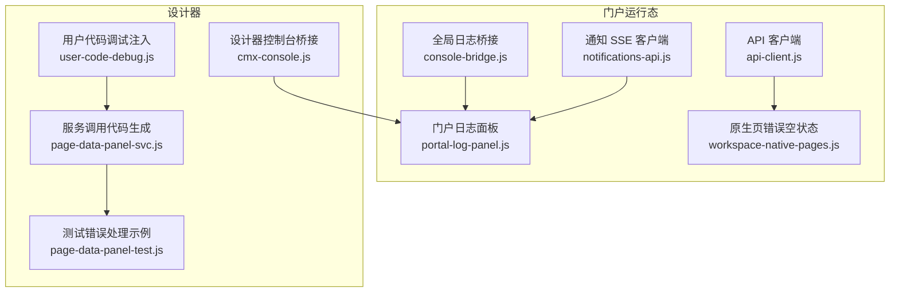
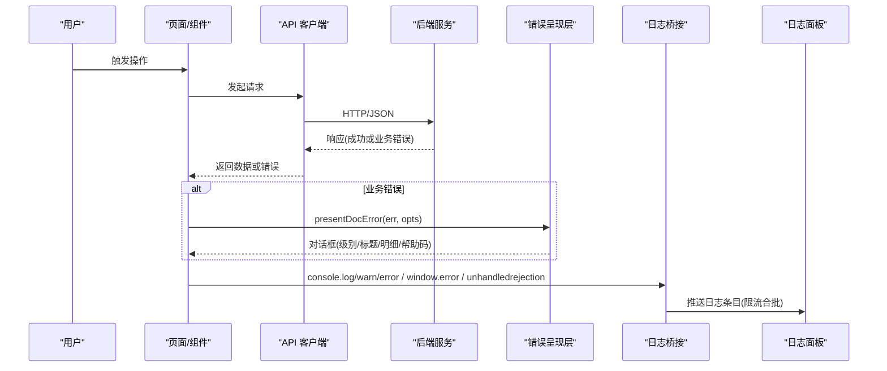
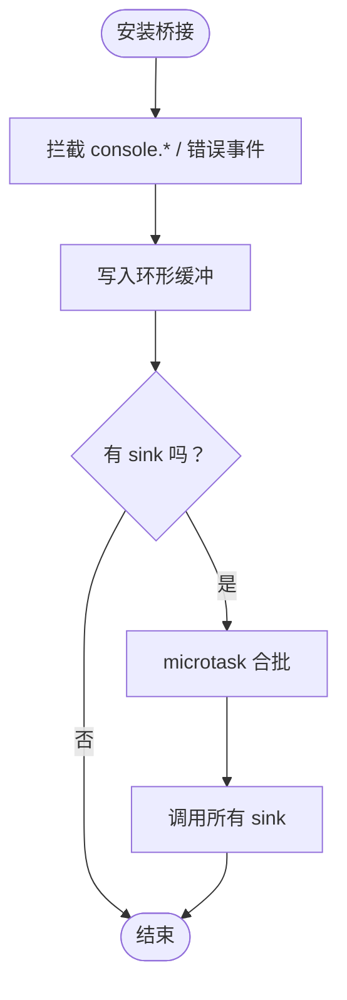
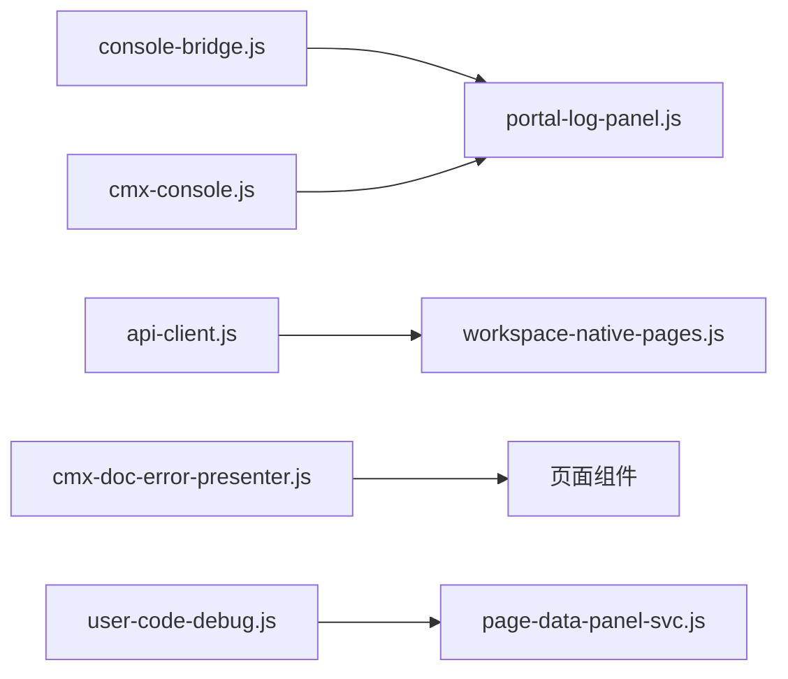
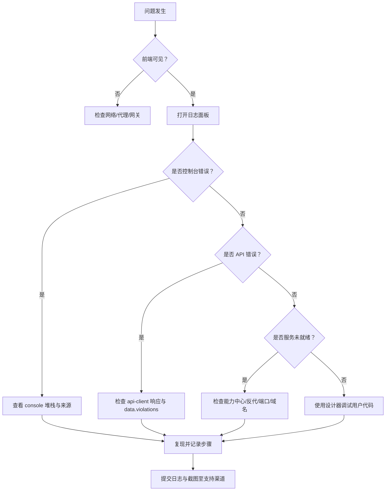
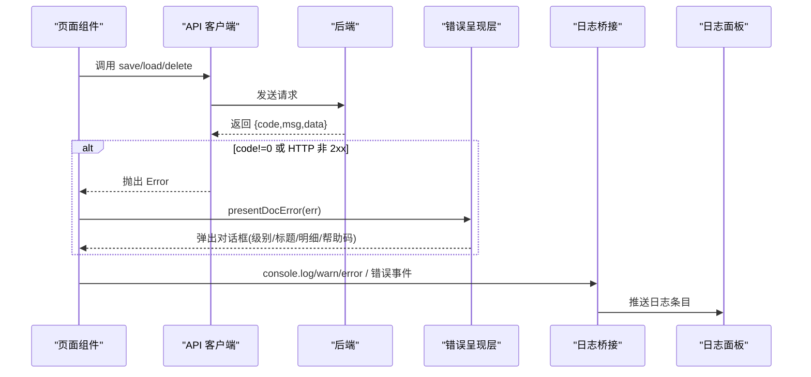

# 故障排除

<cite>
**本文引用的文件**
- [console-bridge.js](file://CMXPortalManager/src/lib/console-bridge.js)
- [portal-log-panel.js（门户）](file://CMXPortalManager/src/components/portal-log-panel.js)
- [cmx-console.js](file://CMXHTMLDesigner/src/utils/cmx-console.js)
- [user-code-debug.js](file://CMXHTMLDesigner/src/utils/user-code-debug.js)
- [workspace-native-pages.js](file://CMXPortalManager/src/lib/workspace-native-pages.js)
- [api-client.js](file://CMXPortalManager/src/lib/api-client.js)
- [cmx-doc-error-presenter.js](file://packages/cmx-data-comp/src/lib/cmx-doc-error-presenter.js)
- [cmx-doc-source.js](file://packages/cmx-data-comp/src/lib/cmx-doc-source.js)
- [page-cache.js](file://CMXPortalManager/src/lib/page-cache.js)
- [notifications-api.js](file://CMXPortalManager/src/api/notifications-api.js)
- [page-data-panel-svc.js](file://CMXHTMLDesigner/src/components/designer-page-data/page-data-panel-svc.js)
- [page-data-panel-test.js](file://CMXHTMLDesigner/src/components/designer-page-data/page-data-panel-test.js)
</cite>

## 目录
1. [简介](#简介)
2. [项目结构](#项目结构)
3. [核心组件](#核心组件)
4. [架构总览](#架构总览)
5. [详细组件分析](#详细组件分析)
6. [依赖关系分析](#依赖关系分析)
7. [性能注意事项](#性能注意事项)
8. [故障排除指南](#故障排除指南)
9. [结论](#结论)
10. [附录](#附录)

## 简介
本指南面向 CMX 企业门户平台的使用者与运维人员，聚焦“问题定位—根因分析—解决验证”的闭环。内容覆盖环境问题、配置问题、运行时错误与性能问题；提供基于内置调试工具、浏览器开发者工具与后端日志的实操方法；给出错误诊断流程图、问题分类与解决策略；并汇总社区支持与反馈渠道。

## 项目结构
CMX 门户前端由两大应用组成：
- 门户运行态（CMXPortalManager）：负责页面渲染、工作区、日志面板、API 客户端、错误呈现等。
- 设计器（CMXHTMLDesigner）：负责页面设计与调试，包含控制台桥接、用户代码断点注入、服务调用生成等。

图表来源
- [console-bridge.js:1-169](file://CMXPortalManager/src/lib/console-bridge.js#L1-L169)
- [portal-log-panel.js（门户）:1-635](file://CMXPortalManager/src/components/portal-log-panel.js#L1-L635)
- [cmx-console.js:1-83](file://CMXHTMLDesigner/src/utils/cmx-console.js#L1-L83)
- [user-code-debug.js:1-60](file://CMXHTMLDesigner/src/utils/user-code-debug.js#L1-L60)
- [workspace-native-pages.js:241-266](file://CMXPortalManager/src/lib/workspace-native-pages.js#L241-L266)
- [api-client.js:230-250](file://CMXPortalManager/src/lib/api-client.js#L230-L250)
- [notifications-api.js:69-116](file://CMXPortalManager/src/api/notifications-api.js#L69-L116)
- [page-data-panel-svc.js:519-549](file://CMXHTMLDesigner/src/components/designer-page-data/page-data-panel-svc.js#L519-L549)
- [page-data-panel-test.js:123-142](file://CMXHTMLDesigner/src/components/designer-page-data/page-data-panel-test.js#L123-L142)

章节来源
- [console-bridge.js:1-169](file://CMXPortalManager/src/lib/console-bridge.js#L1-L169)
- [portal-log-panel.js（门户）:1-635](file://CMXPortalManager/src/components/portal-log-panel.js#L1-L635)
- [cmx-console.js:1-83](file://CMXHTMLDesigner/src/utils/cmx-console.js#L1-L83)
- [user-code-debug.js:1-60](file://CMXHTMLDesigner/src/utils/user-code-debug.js#L1-L60)
- [workspace-native-pages.js:241-266](file://CMXPortalManager/src/lib/workspace-native-pages.js#L241-L266)
- [api-client.js:230-250](file://CMXPortalManager/src/lib/api-client.js#L230-L250)
- [notifications-api.js:69-116](file://CMXPortalManager/src/api/notifications-api.js#L69-L116)
- [page-data-panel-svc.js:519-549](file://CMXHTMLDesigner/src/components/designer-page-data/page-data-panel-svc.js#L519-L549)
- [page-data-panel-test.js:123-142](file://CMXHTMLDesigner/src/components/designer-page-data/page-data-panel-test.js#L123-L142)

## 核心组件
- 全局日志桥接：统一捕获 console.*、window.error、unhandledrejection，限流合并后投递到 sink（如日志面板）。
- 门户日志面板：可视化输出、问题列表、导出、自动滚动与溢出处理。
- 设计器控制台桥接：劫持 console，双写到 DevTools 与自定义 sink，支持卸载恢复。
- 用户代码调试：为 new Function 生成的用户代码注入稳定 sourceURL 与可选 debugger 断点。
- 错误呈现层：将 DCT/DOC 存储服务错误结构化（冲突、校验失败、普通失败），弹出专业对话框。
- API 客户端：信封解析、业务错误透传 data（如 violations），便于前端逐行高亮。
- 原生页错误空状态：识别“服务未就绪”类错误，展示友好提示与技术详情。
- 持久化缓存：请求持久化存储，避免浏览器淘汰导致缓存丢失。
- SSE 通知：指数退避重连，事件流解析与中断控制。

章节来源
- [console-bridge.js:1-169](file://CMXPortalManager/src/lib/console-bridge.js#L1-L169)
- [portal-log-panel.js（门户）:1-635](file://CMXPortalManager/src/components/portal-log-panel.js#L1-L635)
- [cmx-console.js:1-83](file://CMXHTMLDesigner/src/utils/cmx-console.js#L1-L83)
- [user-code-debug.js:1-60](file://CMXHTMLDesigner/src/utils/user-code-debug.js#L1-L60)
- [cmx-doc-error-presenter.js:1-159](file://packages/cmx-data-comp/src/lib/cmx-doc-error-presenter.js#L1-L159)
- [api-client.js:230-250](file://CMXPortalManager/src/lib/api-client.js#L230-L250)
- [workspace-native-pages.js:241-266](file://CMXPortalManager/src/lib/workspace-native-pages.js#L241-L266)
- [page-cache.js:254-293](file://CMXPortalManager/src/lib/page-cache.js#L254-L293)
- [notifications-api.js:69-116](file://CMXPortalManager/src/api/notifications-api.js#L69-L116)

## 架构总览
下图展示了从用户操作到错误呈现与日志记录的完整链路，包括网络请求、错误结构化、UI 呈现与日志汇聚。

图表来源
- [api-client.js:230-250](file://CMXPortalManager/src/lib/api-client.js#L230-L250)
- [cmx-doc-error-presenter.js:1-159](file://packages/cmx-data-comp/src/lib/cmx-doc-error-presenter.js#L1-L159)
- [console-bridge.js:1-169](file://CMXPortalManager/src/lib/console-bridge.js#L1-L169)
- [portal-log-panel.js（门户）:1-635](file://CMXPortalManager/src/components/portal-log-panel.js#L1-L635)

## 详细组件分析

### 全局日志桥接与日志面板
- 功能要点
  - 单例安装，保留原始 console 引用，支持卸载还原。
  - 捕获 window.error 与 unhandledrejection，统一格式化为日志条目。
  - 环形缓冲（默认 500 条），sink 注册时 flush。
  - microtask 限流合批，避免高频日志阻塞渲染。
  - 门户日志面板订阅 sink，渲染输出与问题列表，支持导出。
- 使用建议
  - 在应用启动时安装桥接，确保早期错误不丢失。
  - 通过日志面板过滤级别、查看来源、导出日志用于问题上报。

图表来源
- [console-bridge.js:1-169](file://CMXPortalManager/src/lib/console-bridge.js#L1-L169)
- [portal-log-panel.js（门户）:1-635](file://CMXPortalManager/src/components/portal-log-panel.js#L1-L635)

章节来源
- [console-bridge.js:1-169](file://CMXPortalManager/src/lib/console-bridge.js#L1-L169)
- [portal-log-panel.js（门户）:1-635](file://CMXPortalManager/src/components/portal-log-panel.js#L1-L635)

### 设计器控制台桥接与用户代码调试
- 功能要点
  - 劫持 console.log/warn/error，双写到 DevTools 与自定义 sink，支持卸载恢复。
  - 为用户代码注入稳定 sourceURL，使 DevTools Sources 可持久化断点。
  - 调试模式开启时在首行注入 debugger，进入即暂停。
- 使用建议
  - 在设计器中开启调试模式，定位用户脚本执行路径。
  - 结合 DevTools 断点与日志面板，快速复现与验证修复。

章节来源
- [cmx-console.js:1-83](file://CMXHTMLDesigner/src/utils/cmx-console.js#L1-L83)
- [user-code-debug.js:1-60](file://CMXHTMLDesigner/src/utils/user-code-debug.js#L1-L60)

### 错误呈现层（DCT/DOC 存储服务）
- 功能要点
  - 将后端错误结构化：乐观锁冲突（warning）、列级校验失败（error，含 violations）、普通失败（error）。
  - 剥离技术前缀，生成用户友好的标题与消息，附带 helpCode 以便帮助中心接管。
  - 已呈现的错误打标记，避免全局 unhandledrejection 重复弹窗。
- 使用建议
  - 在保存/装载/删除等关键路径统一调用 presentDocError。
  - 根据返回 kind 分支处理（如 conflict 刷新页面）。

章节来源
- [cmx-doc-error-presenter.js:1-159](file://packages/cmx-data-comp/src/lib/cmx-doc-error-presenter.js#L1-L159)
- [cmx-doc-source.js:100-125](file://packages/cmx-data-comp/src/lib/cmx-doc-source.js#L100-L125)

### API 客户端与原生页错误空状态
- 功能要点
  - API 客户端解析信封，业务错误保留 msg/code/data，便于前端逐行高亮与展开。
  - 原生页加载失败时识别“服务未就绪”类错误，展示友好文案与技术详情。
- 使用建议
  - 对 5xx/不可达/超时等错误优先检查网关与反代配置。
  - 利用 data.violations 进行字段级错误定位。

章节来源
- [api-client.js:230-250](file://CMXPortalManager/src/lib/api-client.js#L230-L250)
- [workspace-native-pages.js:241-266](file://CMXPortalManager/src/lib/workspace-native-pages.js#L241-L266)

### 持久化缓存与 SSE 通知
- 功能要点
  - 请求浏览器持久化存储，避免低压淘汰导致缓存丢失。
  - SSE 通知采用指数退避重连，解析事件流，支持中断。
- 使用建议
  - 若字典/菜单加载不稳定，检查是否请求持久化存储成功。
  - SSE 断开时关注重连次数与间隔，排查服务端事件源与代理超时。

章节来源
- [page-cache.js:254-293](file://CMXPortalManager/src/lib/page-cache.js#L254-L293)
- [notifications-api.js:69-116](file://CMXPortalManager/src/api/notifications-api.js#L69-L116)

### 设计器服务调用生成与测试
- 功能要点
  - 自动生成 fetch 调用代码，包含 headers、signal、错误判断。
  - 测试用例演示如何抛出与服务端一致的错误信息，便于联调。
- 使用建议
  - 在服务定义中正确设置 method/url/headers，减少手写错误。
  - 使用测试用例作为模板，构造最小复现场景。

章节来源
- [page-data-panel-svc.js:519-549](file://CMXHTMLDesigner/src/components/designer-page-data/page-data-panel-svc.js#L519-L549)
- [page-data-panel-test.js:123-142](file://CMXHTMLDesigner/src/components/designer-page-data/page-data-panel-test.js#L123-L142)

## 依赖关系分析
- 松耦合设计
  - 日志桥接与日志面板通过 sink 解耦，新增消费方无需改动桥接。
  - 错误呈现层与 UI 解耦，describeDocError 纯函数可单测。
- 外部依赖
  - 浏览器 API：console、window.error、unhandledrejection、navigator.storage.persist。
  - 网络：fetch、EventSource/SSE 读取。
- 潜在风险
  - 高频日志可能阻塞渲染，需依赖 microtask 合批与缓冲限制。
  - SSE 长连接受代理/网关超时影响，需合理配置超时与重试。

图表来源
- [console-bridge.js:1-169](file://CMXPortalManager/src/lib/console-bridge.js#L1-L169)
- [portal-log-panel.js（门户）:1-635](file://CMXPortalManager/src/components/portal-log-panel.js#L1-L635)
- [api-client.js:230-250](file://CMXPortalManager/src/lib/api-client.js#L230-L250)
- [workspace-native-pages.js:241-266](file://CMXPortalManager/src/lib/workspace-native-pages.js#L241-L266)
- [cmx-doc-error-presenter.js:1-159](file://packages/cmx-data-comp/src/lib/cmx-doc-error-presenter.js#L1-L159)
- [cmx-console.js:1-83](file://CMXHTMLDesigner/src/utils/cmx-console.js#L1-L83)
- [user-code-debug.js:1-60](file://CMXHTMLDesigner/src/utils/user-code-debug.js#L1-L60)
- [page-data-panel-svc.js:519-549](file://CMXHTMLDesigner/src/components/designer-page-data/page-data-panel-svc.js#L519-L549)

## 性能注意事项
- 日志频率控制
  - 使用 microtask 合批与环形缓冲，避免高频日志影响主线程。
  - 在生产环境降低 debug 级别，仅保留 warn/error。
- 网络与代理
  - SSE/长耗时请求注意网关/反代超时配置，避免被提前切断。
  - 对慢接口考虑分页/懒加载/缓存策略。
- 存储与缓存
  - 请求持久化存储，防止浏览器淘汰导致字典/菜单丢失。
  - 对频繁访问的数据建立本地缓存，减少重复请求。

[本节为通用指导，不直接分析具体文件]

## 故障排除指南

### 问题分类与定位流程

[该图为概念性流程，不绑定具体源码]

### 常见问题与解决方案

- 环境问题
  - 症状：页面空白或显示“服务未就绪”。
  - 排查：检查能力中心是否启动、反代是否可达、域名/端口是否正确、网关是否返回 5xx。
  - 依据：原生页错误空状态识别“不可达/未配置/超时/5xx”等关键词，展示友好提示与技术详情。
  - 参考
    - [workspace-native-pages.js:241-266](file://CMXPortalManager/src/lib/workspace-native-pages.js#L241-L266)

- 配置问题
  - 症状：字典/菜单加载失败或缓存失效。
  - 排查：确认请求持久化存储是否成功；检查环境变量与服务发现配置；核对代理路由。
  - 依据：page-cache 请求持久化存储；通知 SSE 指数退避重连。
  - 参考
    - [page-cache.js:254-293](file://CMXPortalManager/src/lib/page-cache.js#L254-L293)
    - [notifications-api.js:69-116](file://CMXPortalManager/src/api/notifications-api.js#L69-L116)

- 运行时错误
  - 症状：保存/装载/删除失败，或出现校验错误。
  - 排查：使用错误呈现层获取结构化错误（冲突/校验/普通失败）；查看 data.violations 定位字段；检查 API 客户端是否透传 data。
  - 依据：presentDocError 将错误结构化并弹出对话框；api-client 保留 msg/code/data。
  - 参考
    - [cmx-doc-error-presenter.js:1-159](file://packages/cmx-data-comp/src/lib/cmx-doc-error-presenter.js#L1-L159)
    - [api-client.js:230-250](file://CMXPortalManager/src/lib/api-client.js#L230-L250)

- 性能问题
  - 症状：页面卡顿、日志刷屏、SSE 频繁断开。
  - 排查：降低日志级别；检查微任务合批是否生效；评估代理超时与 SSE 重连策略；优化数据加载与缓存。
  - 依据：console-bridge 限流合批；notifications-api 指数退避重连。
  - 参考
    - [console-bridge.js:1-169](file://CMXPortalManager/src/lib/console-bridge.js#L1-L169)
    - [notifications-api.js:69-116](file://CMXPortalManager/src/api/notifications-api.js#L69-L116)

### 调试技巧与日志分析方法
- 使用内置调试工具
  - 设计器控制台桥接：劫持 console，双写到 DevTools 与自定义 sink，支持卸载恢复。
  - 用户代码调试：为 new Function 生成的用户代码注入稳定 sourceURL 与可选 debugger。
  - 参考
    - [cmx-console.js:1-83](file://CMXHTMLDesigner/src/utils/cmx-console.js#L1-L83)
    - [user-code-debug.js:1-60](file://CMXHTMLDesigner/src/utils/user-code-debug.js#L1-L60)

- 使用浏览器开发者工具
  - Network：检查请求/响应、状态码、Headers、Payload。
  - Console：查看 console 输出与堆栈，过滤 warn/error。
  - Sources：利用 sourceURL 定位用户代码，设置断点。
  - Performance：录制性能快照，定位卡顿与内存泄漏。

- 使用后端日志
  - 结合门户日志面板导出的日志，定位时间线与错误上下文。
  - 对 API 错误，关注 code/msg/data，尤其是 violations 明细。
  - 参考
    - [portal-log-panel.js（门户）:1-635](file://CMXPortalManager/src/components/portal-log-panel.js#L1-L635)
    - [api-client.js:230-250](file://CMXPortalManager/src/lib/api-client.js#L230-L250)

### 错误诊断流程图（代码级）

图表来源
- [api-client.js:230-250](file://CMXPortalManager/src/lib/api-client.js#L230-L250)
- [cmx-doc-error-presenter.js:1-159](file://packages/cmx-data-comp/src/lib/cmx-doc-error-presenter.js#L1-L159)
- [console-bridge.js:1-169](file://CMXPortalManager/src/lib/console-bridge.js#L1-L169)
- [portal-log-panel.js（门户）:1-635](file://CMXPortalManager/src/components/portal-log-panel.js#L1-L635)

### 解决策略与最佳实践
- 统一错误处理
  - 在关键路径统一调用 presentDocError，避免重复逻辑与遗漏。
  - 根据 kind 分支处理（如 conflict 刷新页面）。
- 日志治理
  - 生产环境关闭 debug 级别；定期导出日志归档。
  - 使用日志面板过滤与搜索，快速定位问题。
- 网络与代理
  - 对 SSE/长耗时请求调整代理超时；实现指数退避重连。
  - 对 5xx/不可达错误优先检查网关与反代。
- 缓存与存储
  - 请求持久化存储，避免浏览器淘汰。
  - 对频繁数据建立本地缓存，减少重复请求。

[本节为通用指导，不直接分析具体文件]

### 社区支持与问题反馈机制
- 收集信息
  - 使用日志面板导出日志文件。
  - 截图浏览器开发者工具的 Network/Console/Sources。
  - 记录操作步骤、预期结果与实际结果。
- 提交渠道
  - 通过内部工单系统或团队沟通渠道提交问题。
  - 附上日志与截图，标注模块与环境信息。
- 跟进与验证
  - 配合研发复现问题，验证修复效果。
  - 更新知识库与故障排除文档。

[本节为通用指导，不直接分析具体文件]

## 结论
CMX 企业门户平台提供了完善的日志与错误处理能力：全局日志桥接、设计器控制台桥接、错误呈现层、API 客户端信封解析、原生页友好错误空状态、持久化缓存与 SSE 重连。通过系统化排查与工具链组合，可高效定位环境问题、配置问题、运行时错误与性能问题。建议在日常工作中遵循统一错误处理与日志治理规范，持续积累与沉淀故障排除经验。

[本节为总结性内容，不直接分析具体文件]

## 附录
- 常用命令与位置
  - 打开门户日志面板：在门户底部区域找到“输出/问题/终端/调试控制台”标签。
  - 导出日志：点击日志面板“导出日志”按钮。
  - 设计器调试：启用调试模式，为生成代码注入 sourceURL 与 debugger。
- 参考文件路径
  - 门户日志面板：[portal-log-panel.js（门户）:1-635](file://CMXPortalManager/src/components/portal-log-panel.js#L1-L635)
  - 全局日志桥接：[console-bridge.js:1-169](file://CMXPortalManager/src/lib/console-bridge.js#L1-L169)
  - 设计器控制台桥接：[cmx-console.js:1-83](file://CMXHTMLDesigner/src/utils/cmx-console.js#L1-L83)
  - 用户代码调试：[user-code-debug.js:1-60](file://CMXHTMLDesigner/src/utils/user-code-debug.js#L1-L60)
  - 错误呈现层：[cmx-doc-error-presenter.js:1-159](file://packages/cmx-data-comp/src/lib/cmx-doc-error-presenter.js#L1-L159)
  - API 客户端：[api-client.js:230-250](file://CMXPortalManager/src/lib/api-client.js#L230-L250)
  - 原生页错误空状态：[workspace-native-pages.js:241-266](file://CMXPortalManager/src/lib/workspace-native-pages.js#L241-L266)
  - 持久化缓存：[page-cache.js:254-293](file://CMXPortalManager/src/lib/page-cache.js#L254-L293)
  - SSE 通知：[notifications-api.js:69-116](file://CMXPortalManager/src/api/notifications-api.js#L69-L116)
  - 服务调用生成：[page-data-panel-svc.js:519-549](file://CMXHTMLDesigner/src/components/designer-page-data/page-data-panel-svc.js#L519-L549)
  - 测试示例：[page-data-panel-test.js:123-142](file://CMXHTMLDesigner/src/components/designer-page-data/page-data-panel-test.js#L123-L142)

[本节为附录信息，不直接分析具体文件]