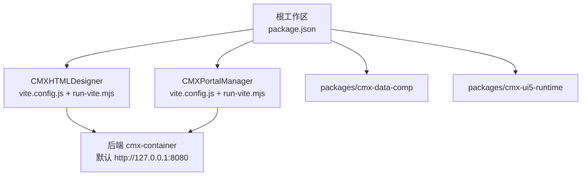
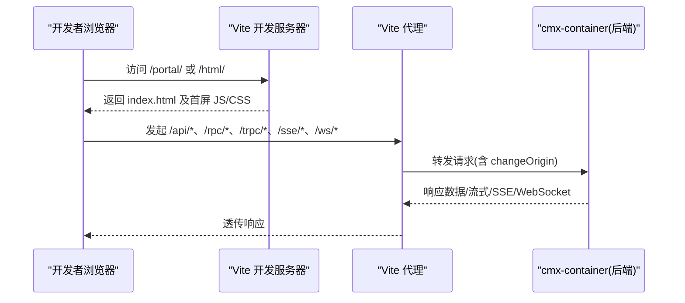
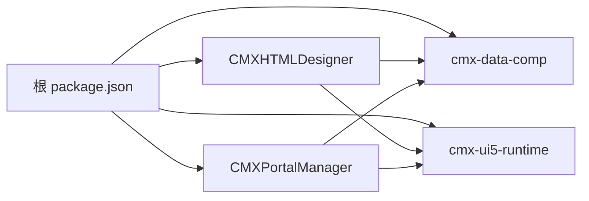

# 环境问题排查

<cite>
**本文引用的文件**
- [package.json](file://package.json)
- [.npmrc](file://.npmrc)
- [CMXHTMLDesigner/package.json](file://CMXHTMLDesigner/package.json)
- [CMXPortalManager/package.json](file://CMXPortalManager/package.json)
- [CMXHTMLDesigner/vite.config.js](file://CMXHTMLDesigner/vite.config.js)
- [CMXPortalManager/vite.config.js](file://CMXPortalManager/vite.config.js)
- [CMXHTMLDesigner/scripts/run-vite.mjs](file://CMXHTMLDesigner/scripts/run-vite.mjs)
- [CMXPortalManager/scripts/run-vite.mjs](file://CMXPortalManager/scripts/run-vite.mjs)
- [docker命令.txt](file://docker命令.txt)
- [README.md](file://README.md)
</cite>

## 目录
1. [简介](#简介)
2. [项目结构](#项目结构)
3. [核心组件](#核心组件)
4. [架构总览](#架构总览)
5. [详细组件分析](#详细组件分析)
6. [依赖关系分析](#依赖关系分析)
7. [性能考量](#性能考量)
8. [故障排除指南](#故障排除指南)
9. [结论](#结论)
10. [附录](#附录)

## 简介
本指南面向 CMX 企业门户平台（CMXHTMLDesigner、CMXPortalManager）在开发环境搭建与联调过程中可能遇到的环境问题，聚焦 Node.js 版本兼容性、npm/yarn 包管理器配置、Vite 构建工具配置、端口冲突、依赖安装失败、模块解析错误、环境变量与代理/跨域问题，以及 Docker 容器化部署中的常见问题。内容基于仓库内实际配置文件与脚本进行说明，并提供可操作的诊断与修复步骤。

## 项目结构
本项目为 npm workspaces monorepo，包含：
- CMXHTMLDesigner：可视化设计器前端，使用 Vite 构建，路由 /html/
- CMXPortalManager：门户运行时前端，使用 Vite 构建，路由 /portal/
- packages/cmx-data-comp：数据层 Web Components 库
- packages/cmx-ui5-runtime：共享 UI5/Tabler 运行时，路由 /shared/

根 package.json 定义了 workspaces、统一脚本与 overrides；两个子应用通过 scripts/run-vite.mjs 启动本地 Vite 服务，并通过 vite.config.js 配置代理、base、别名与分包策略。

图示来源
- [package.json:1-39](file://package.json#L1-L39)
- [CMXHTMLDesigner/vite.config.js:1-118](file://CMXHTMLDesigner/vite.config.js#L1-L118)
- [CMXPortalManager/vite.config.js:1-184](file://CMXPortalManager/vite.config.js#L1-L184)

章节来源
- [README.md:8-17](file://README.md#L8-L17)
- [package.json:1-39](file://package.json#L1-L39)

## 核心组件
- 工作区与脚本：根 package.json 提供 dev/build/test/lint 等统一入口，并声明 workspaces。
- 包管理与私有源：.npmrc 启用 bin-links=true 并配置 @infragistics 私有源。
- 子应用运行：CMXHTMLDesigner 与 CMXPortalManager 通过 scripts/run-vite.mjs 调用 Vite CLI，避免 .bin 符号链接导致的相对路径解析失败。
- 构建与代理：vite.config.js 中定义 base、server.proxy、resolve.alias/dedupe、optimizeDeps.exclude、build.target 与 chunk 拆分策略。

章节来源
- [package.json:1-39](file://package.json#L1-L39)
- [.npmrc:1-4](file://.npmrc#L1-L4)
- [CMXHTMLDesigner/scripts/run-vite.mjs:1-31](file://CMXHTMLDesigner/scripts/run-vite.mjs#L1-L31)
- [CMXPortalManager/scripts/run-vite.mjs:1-31](file://CMXPortalManager/scripts/run-vite.mjs#L1-L31)
- [CMXHTMLDesigner/vite.config.js:1-118](file://CMXHTMLDesigner/vite.config.js#L1-L118)
- [CMXPortalManager/vite.config.js:1-184](file://CMXPortalManager/vite.config.js#L1-L184)

## 架构总览
前端通过 Vite 启动开发服务器，按路径前缀将 /api、/rpc、/trpc、/sse、/ws、/shared 等请求代理到后端 cmx-container（默认 127.0.0.1:8080）。生产构建时，base 由环境变量控制，确保静态资源与页面路径正确。

图示来源
- [CMXHTMLDesigner/vite.config.js:72-84](file://CMXHTMLDesigner/vite.config.js#L72-L84)
- [CMXPortalManager/vite.config.js:84-96](file://CMXPortalManager/vite.config.js#L84-L96)

## 详细组件分析

### Node.js 版本与引擎约束
- CMXPortalManager 的 engines 字段限定 Node 版本范围，确保 Vite 与生态兼容。
- 若本地 Node 版本不在允许范围内，可能导致 Vite 启动失败或插件不兼容。

建议
- 使用 nvm 切换至受支持的 Node 版本区间。
- 在 CI 中增加 engines 校验步骤。

章节来源
- [CMXPortalManager/package.json:5-7](file://CMXPortalManager/package.json#L5-L7)

### npm/yarn 与私有源配置
- 根 .npmrc 设置 bin-links=true，避免 npm 复制脚本到 .bin 导致相对路径解析失败（run-vite.mjs 依赖 node_modules 下的真实路径）。
- 配置 @infragistics 私有源以获取商业组件依赖。

常见问题
- 安装时报鉴权错误或无法拉取 @infragistics/* 包：检查 .npmrc 是否生效、网络可达性与凭据。
- 安装后执行 dev 报“未找到 vite”：确认已在根目录执行过 npm install，且 node_modules 存在。

章节来源
- [.npmrc:1-4](file://.npmrc#L1-L4)
- [CMXHTMLDesigner/scripts/run-vite.mjs:10-22](file://CMXHTMLDesigner/scripts/run-vite.mjs#L10-L22)
- [CMXPortalManager/scripts/run-vite.mjs:10-22](file://CMXPortalManager/scripts/run-vite.mjs#L10-L22)

### Vite 基础路径与环境变量
- 两个应用的 vite.config.js 均通过 loadEnv(mode, __dirname, '') 加载所有前缀的环境变量，并使用 CMX_APP_BASE 作为 base。
- 默认值在开发模式为 ./，生产模式通常覆盖为绝对路径（如 /html/ 或 /portal/），以避免相对路径解析异常。

建议
- 在 .env.production 或 shell 环境变量中设置 CMX_APP_BASE，确保构建产物与部署路径一致。
- 若部署在非根路径，务必保证 base 以斜杠结尾，避免资源路径拼接错误。

章节来源
- [CMXHTMLDesigner/vite.config.js:15-35](file://CMXHTMLDesigner/vite.config.js#L15-L35)
- [CMXPortalManager/vite.config.js:15-40](file://CMXPortalManager/vite.config.js#L15-L40)

### 代理与跨域问题
- 开发模式下，/api、/rpc、/trpc、/sse、/ws、/shared 等路径被代理到 CMX_VITE_BACKEND（默认 http://127.0.0.1:8080）。
- 若后端地址变更或容器化部署，需调整 CMX_VITE_BACKEND。
- WebSocket 与 SSE 已开启 ws:true，用于实时通信。

常见症状与修复
- 登录或数据接口 404/502：检查后端是否启动、端口是否正确、代理目标是否可达。
- 跨域报错：确保代理 target 与后端 CORS 配置一致；必要时在代理层开启 changeOrigin。
- WebSocket 连接失败：确认 /ws 代理开启且后端支持 WS。

章节来源
- [CMXHTMLDesigner/vite.config.js:26-32](file://CMXHTMLDesigner/vite.config.js#L26-L32)
- [CMXHTMLDesigner/vite.config.js:72-84](file://CMXHTMLDesigner/vite.config.js#L72-L84)
- [CMXPortalManager/vite.config.js:27-33](file://CMXPortalManager/vite.config.js#L27-L33)
- [CMXPortalManager/vite.config.js:84-96](file://CMXPortalManager/vite.config.js#L84-L96)

### 模块解析与重复依赖
- resolve.alias 将 cmx-data-comp 与 cmx-ui5-runtime 指向源码，便于调试与顶层 await 支持。
- dedupe 列表强制去重 UI5 相关包与 lit 系列，避免多实例导致的运行时行为异常。
- optimizeDeps.exclude 排除 UI5 组件，避免预构建优化带来的兼容性问题。

常见问题
- 模块找不到或解析到多个版本：检查 alias 与 dedupe 配置，确保只有一份 UI5/lit 实例。
- 构建时报 exports 子路径解析失败：不要仅 alias 包根目录，应保留子路径映射。

章节来源
- [CMXHTMLDesigner/vite.config.js:37-71](file://CMXHTMLDesigner/vite.config.js#L37-L71)
- [CMXPortalManager/vite.config.js:42-83](file://CMXPortalManager/vite.config.js#L42-L83)
- [CMXHTMLDesigner/vite.config.js:104-115](file://CMXHTMLDesigner/vite.config.js#L104-L115)
- [CMXPortalManager/vite.config.js:170-181](file://CMXPortalManager/vite.config.js#L170-L181)

### 构建产物与分包策略
- build.target 设置为 es2022，sourcemap 开启，chunkSizeWarningLimit 限制单块大小。
- 多入口：index.html、login.html（部分还有 preview/debug），确保各页面独立产出。
- manualChunks/codeSplitting 将重型第三方库拆分为独立 chunk，提升缓存命中与并行解析效率。
- modulePreload 过滤掉仅在动态导入中使用的重型 vendor chunk，减少首屏负担。

建议
- 新增大型依赖时，评估是否需要加入 manualChunks/codeSplitting groups。
- 监控 chunk 体积与加载时间，避免首屏过大。

章节来源
- [CMXHTMLDesigner/vite.config.js:90-103](file://CMXHTMLDesigner/vite.config.js#L90-L103)
- [CMXPortalManager/vite.config.js:97-169](file://CMXPortalManager/vite.config.js#L97-L169)

### 启动脚本与 Vite 定位
- scripts/run-vite.mjs 会优先查找当前包的 node_modules 中的 vite，其次回退到 monorepo 根 node_modules。
- 若未找到 vite，会提示在仓库根目录执行 npm install。

章节来源
- [CMXHTMLDesigner/scripts/run-vite.mjs:10-22](file://CMXHTMLDesigner/scripts/run-vite.mjs#L10-L22)
- [CMXPortalManager/scripts/run-vite.mjs:10-22](file://CMXPortalManager/scripts/run-vite.mjs#L10-L22)

## 依赖关系分析
- 根 workspaces 聚合子项目，统一脚本通过 -w 指定工作区执行。
- 子项目依赖 cmx-data-comp 与 cmx-ui5-runtime，通过 alias 指向源码以便开发调试。
- 商业依赖 @infragistics/* 通过私有源获取，需在 .npmrc 中配置。

图示来源
- [package.json:1-39](file://package.json#L1-L39)
- [CMXHTMLDesigner/vite.config.js:37-71](file://CMXHTMLDesigner/vite.config.js#L37-L71)
- [CMXPortalManager/vite.config.js:42-83](file://CMXPortalManager/vite.config.js#L42-L83)

章节来源
- [package.json:1-39](file://package.json#L1-L39)

## 性能考量
- 首屏优化：通过 modulePreload 过滤重型 vendor chunk，避免不必要的预加载。
- 分包策略：将 Ignite UI、Lit、Markdown、Shiki 等重型依赖拆分为独立 chunk，提高缓存命中率与并行解析能力。
- 依赖去重：dedupe 列表确保 UI5 与 Lit 仅一份实例，避免内存与运行时开销。
- 构建目标：es2022 兼顾现代浏览器与打包性能。

章节来源
- [CMXPortalManager/vite.config.js:101-169](file://CMXPortalManager/vite.config.js#L101-L169)
- [CMXHTMLDesigner/vite.config.js:90-115](file://CMXHTMLDesigner/vite.config.js#L90-L115)

## 故障排除指南

### Node.js 版本不兼容
现象
- Vite 启动报错、插件不兼容或构建失败。

处理
- 检查 CMXPortalManager 的 engines 限制，切换到受支持的 Node 版本。
- 在 CI 中增加版本校验。

章节来源
- [CMXPortalManager/package.json:5-7](file://CMXPortalManager/package.json#L5-L7)

### 依赖安装失败（私有源）
现象
- 安装 @infragistics/* 失败或鉴权错误。

处理
- 确认 .npmrc 生效且网络可达。
- 检查私有源凭据与权限。
- 清理缓存后重试安装。

章节来源
- [.npmrc:1-4](file://.npmrc#L1-L4)

### 未找到 Vite
现象
- 运行 dev 时报“未找到 vite”。

处理
- 在仓库根目录执行 npm install。
- 确认 node_modules 中存在 vite 二进制。

章节来源
- [CMXHTMLDesigner/scripts/run-vite.mjs:16-22](file://CMXHTMLDesigner/scripts/run-vite.mjs#L16-L22)
- [CMXPortalManager/scripts/run-vite.mjs:16-22](file://CMXPortalManager/scripts/run-vite.mjs#L16-L22)

### 端口冲突
现象
- Vite 启动失败或端口占用。

处理
- 修改 Vite 端口（通过命令行参数或环境变量）。
- 释放占用端口或更换端口。

章节来源
- [CMXHTMLDesigner/vite.config.js:72-84](file://CMXHTMLDesigner/vite.config.js#L72-L84)
- [CMXPortalManager/vite.config.js:84-96](file://CMXPortalManager/vite.config.js#L84-L96)

### 代理/跨域问题
现象
- 接口 404/502、CORS 错误、WebSocket 连接失败。

处理
- 检查 CMX_VITE_BACKEND 指向的后端地址与端口。
- 确认代理路径匹配（/api、/rpc、/trpc、/sse、/ws、/shared）。
- 如需跨域，确保后端 CORS 与代理 changeOrigin 配置一致。

章节来源
- [CMXHTMLDesigner/vite.config.js:26-32](file://CMXHTMLDesigner/vite.config.js#L26-L32)
- [CMXHTMLDesigner/vite.config.js:72-84](file://CMXHTMLDesigner/vite.config.js#L72-L84)
- [CMXPortalManager/vite.config.js:27-33](file://CMXPortalManager/vite.config.js#L27-L33)
- [CMXPortalManager/vite.config.js:84-96](file://CMXPortalManager/vite.config.js#L84-L96)

### 模块解析错误
现象
- 模块找不到、解析到多个版本、exports 子路径解析失败。

处理
- 检查 resolve.alias 与 dedupe 配置，确保 UI5 与 Lit 仅一份实例。
- 不要仅 alias 包根目录，保留子路径映射。
- 清理 node_modules 与缓存后重装。

章节来源
- [CMXHTMLDesigner/vite.config.js:37-71](file://CMXHTMLDesigner/vite.config.js#L37-L71)
- [CMXPortalManager/vite.config.js:42-83](file://CMXPortalManager/vite.config.js#L42-L83)

### 环境变量与 base 路径错误
现象
- 构建后页面 404、资源路径错误。

处理
- 设置 CMX_APP_BASE 为部署路径（如 /html/ 或 /portal/），并确保以斜杠结尾。
- 在生产环境通过 .env.production 或 shell 环境变量覆盖。

章节来源
- [CMXHTMLDesigner/vite.config.js:15-35](file://CMXHTMLDesigner/vite.config.js#L15-L35)
- [CMXPortalManager/vite.config.js:15-40](file://CMXPortalManager/vite.config.js#L15-L40)

### Docker 容器化部署问题
现象
- 数据库/缓存服务无法连接、端口冲突、数据卷挂载失败。

处理
- 使用 docker 命令启动 PostgreSQL 与 Redis，注意端口映射与数据卷挂载。
- 确保容器间网络互通或服务暴露端口正确。
- 检查环境变量与后端代理目标是否与容器网络一致。

章节来源
- [docker命令.txt:1-22](file://docker命令.txt#L1-L22)

## 结论
通过合理配置 Node.js 版本、npm 私有源、Vite 代理与 base、模块解析与分包策略，并结合 Docker 容器化部署的最佳实践，可以有效规避 CMX 企业门户平台在开发与构建过程中的常见环境问题。建议在团队内统一环境与脚本，并在 CI 中加入版本与依赖校验，以提升稳定性与可维护性。

## 附录

### 快速排障清单
- 确认 Node 版本符合 engines 要求。
- 在根目录执行 npm install，确保 vite 可用。
- 检查 .npmrc 与私有源配置。
- 设置正确的 CMX_APP_BASE 与 CMX_VITE_BACKEND。
- 验证代理路径与后端服务状态。
- 检查端口占用与容器网络。

章节来源
- [CMXPortalManager/package.json:5-7](file://CMXPortalManager/package.json#L5-L7)
- [CMXHTMLDesigner/scripts/run-vite.mjs:16-22](file://CMXHTMLDesigner/scripts/run-vite.mjs#L16-L22)
- [CMXPortalManager/scripts/run-vite.mjs:16-22](file://CMXPortalManager/scripts/run-vite.mjs#L16-L22)
- [.npmrc:1-4](file://.npmrc#L1-L4)
- [CMXHTMLDesigner/vite.config.js:15-35](file://CMXHTMLDesigner/vite.config.js#L15-L35)
- [CMXPortalManager/vite.config.js:15-40](file://CMXPortalManager/vite.config.js#L15-L40)
- [CMXHTMLDesigner/vite.config.js:72-84](file://CMXHTMLDesigner/vite.config.js#L72-L84)
- [CMXPortalManager/vite.config.js:84-96](file://CMXPortalManager/vite.config.js#L84-L96)
- [docker命令.txt:1-22](file://docker命令.txt#L1-L22)