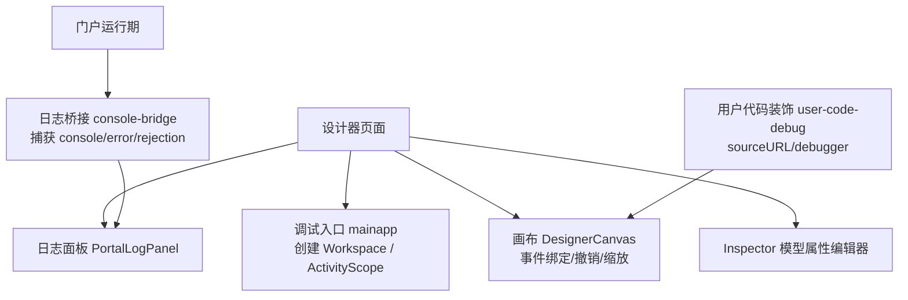
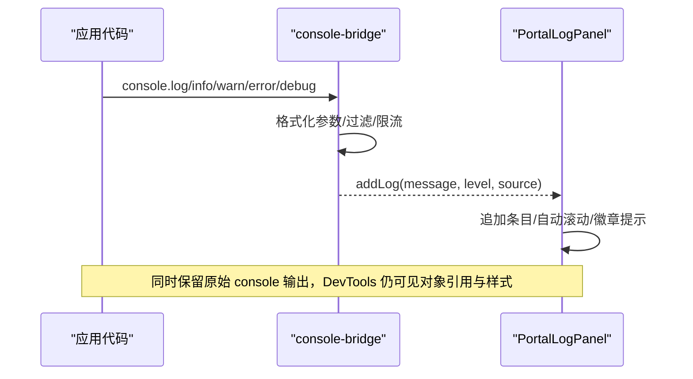
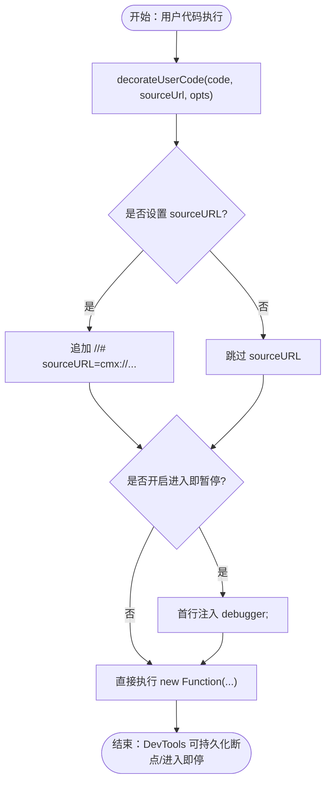
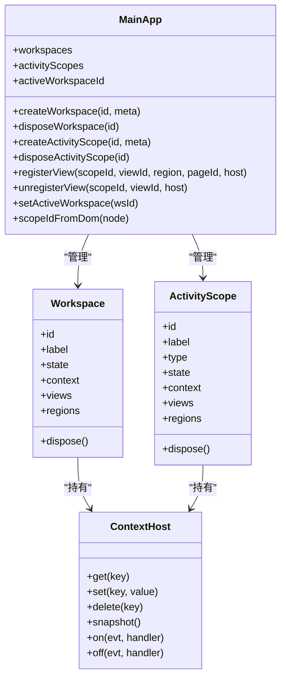
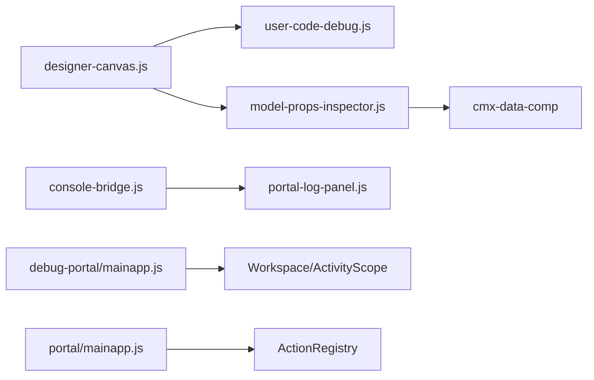

# 调试工具使用

<cite>
**本文引用的文件**
- [cmx-console.js](file://CMXHTMLDesigner/src/utils/cmx-console.js)
- [mainapp.js（调试入口）](file://CMXHTMLDesigner/src/debug-portal/mainapp.js)
- [user-code-debug.js](file://CMXHTMLDesigner/src/utils/user-code-debug.js)
- [model-props-inspector.js](file://CMXHTMLDesigner/src/components/designer-inspector/model-props-inspector.js)
- [console-bridge.js](file://CMXPortalManager/src/lib/console-bridge.js)
- [portal-log-panel.js（设计器日志面板）](file://CMXHTMLDesigner/src/debug-portal/portal-log-panel.js)
- [portal-log-panel.js（门户日志面板）](file://CMXPortalManager/src/components/portal-log-panel.js)
- [designer-canvas.js](file://CMXHTMLDesigner/src/components/designer-canvas.js)
- [event-script-hints.js](file://CMXHTMLDesigner/src/components/designer-inspector/event-script-hints.js)
- [mainapp.js（门户主应用）](file://CMXPortalManager/src/lib/mainapp.js)
</cite>

## 目录
1. [简介](#简介)
2. [项目结构与调试入口](#项目结构与调试入口)
3. [核心调试能力总览](#核心调试能力总览)
4. [架构与数据流](#架构与数据流)
5. [详细组件与功能说明](#详细组件与功能说明)
6. [依赖关系分析](#依赖关系分析)
7. [性能与稳定性特性](#性能与稳定性特性)
8. [浏览器开发者工具使用指南](#浏览器开发者工具使用指南)
9. [设计器专属调试技巧](#设计器专属调试技巧)
10. [常见问题与排错](#常见问题与排错)
11. [结论与最佳实践](#结论与最佳实践)

## 简介
本指南面向 CMX 企业门户平台的开发与运维人员，系统性说明内置调试工具的使用方法、配置方式以及基于实际代码实现的调试技巧。内容覆盖：
- cmx-console 控制台桥接
- 调试门户与日志面板
- 用户代码断点调试
- 画布调试、组件属性检查、事件监听调试
- 日志级别、输出格式、远程调试思路
- 结合浏览器开发者工具的断点、网络、DOM 等实战方法

## 项目结构与调试入口
CMX 前端包含两个主要前端工程：
- 设计器工程（CMXHTMLDesigner）：提供页面设计、画布、模型属性编辑、调试入口与日志面板。
- 门户管理工程（CMXPortalManager）：提供运行时工作区、全局 mainapp、日志桥接与日志面板。

调试相关的关键入口与模块：
- 调试主页与工作区作用域：调试入口的精简版 mainapp，暴露 globalThis.mainapp，用于模拟门户上下文。
- 日志桥接：统一捕获 console、window.error、unhandledrejection，并推送到日志面板。
- 用户代码调试：为 new Function 生成的用户脚本注入稳定 sourceURL，支持在 DevTools 中持久化断点；可选在首行注入 debugger 进入即停。
- 设计器画布：负责事件绑定、撤销重做、缩放对齐、slot 拖放等，并在调试模式下重新绑定事件以启用断点。
- 模型属性检查器：右侧 Inspector 提供 CmxDataSet、CmxMasterSlave、CmxColumnModel、弹性组合等模型的可视化属性编辑。

**图表来源**
- [mainapp.js（调试入口）:1-332](file://CMXHTMLDesigner/src/debug-portal/mainapp.js#L1-L332)
- [designer-canvas.js:1-800](file://CMXHTMLDesigner/src/components/designer-canvas.js#L1-L800)
- [model-props-inspector.js:1-712](file://CMXHTMLDesigner/src/components/designer-inspector/model-props-inspector.js#L1-L712)
- [console-bridge.js:1-169](file://CMXPortalManager/src/lib/console-bridge.js#L1-L169)
- [portal-log-panel.js（设计器日志面板）:1-520](file://CMXHTMLDesigner/src/debug-portal/portal-log-panel.js#L1-L520)
- [portal-log-panel.js（门户日志面板）:1-635](file://CMXPortalManager/src/components/portal-log-panel.js#L1-L635)
- [user-code-debug.js:1-60](file://CMXHTMLDesigner/src/utils/user-code-debug.js#L1-L60)

**章节来源**
- [mainapp.js（调试入口）:1-332](file://CMXHTMLDesigner/src/debug-portal/mainapp.js#L1-L332)
- [console-bridge.js:1-169](file://CMXPortalManager/src/lib/console-bridge.js#L1-L169)

## 核心调试能力总览
- 控制台桥接与日志面板
  - 设计器侧通过 cmx-console 劫持 console.log/warn/error，双写到 DevTools 与自定义 sink（如 inspector 调试区）。
  - 门户侧通过 console-bridge 安装全局桥接，将 console.*、window.error、unhandledrejection 统一转发到注册的 sink，并由 portal-log-panel 渲染展示。
- 用户代码断点调试
  - 通过 user-code-debug 为每条用户代码生成稳定的 cmx://... sourceURL，使 DevTools Sources 面板按 URL 持久化断点。
  - 可开启“进入即暂停”模式，在首行注入 debugger;，状态保存在 sessionStorage，并导出为 __cmxDebug 供运行期读取。
- 画布调试与事件调试
  - 画布在调试模式切换后可重新绑定事件，确保新注入的 debugger 生效。
  - 事件脚本提示面板提供各事件对象常用成员说明，辅助编写和调试事件处理逻辑。
- 模型属性检查与编辑
  - 右侧 Inspector 提供多种模型类型的可视化属性编辑，包括数据集、主从协调、列模型、弹性组合等。
  - 支持字段级校验、枚举值编辑、元数据绑定、服务函数选择等。

**章节来源**
- [cmx-console.js:1-84](file://CMXHTMLDesigner/src/utils/cmx-console.js#L1-L84)
- [console-bridge.js:1-169](file://CMXPortalManager/src/lib/console-bridge.js#L1-L169)
- [user-code-debug.js:1-60](file://CMXHTMLDesigner/src/utils/user-code-debug.js#L1-L60)
- [designer-canvas.js:1-800](file://CMXHTMLDesigner/src/components/designer-canvas.js#L1-L800)
- [event-script-hints.js:1-101](file://CMXHTMLDesigner/src/components/designer-inspector/event-script-hints.js#L1-L101)
- [model-props-inspector.js:1-712](file://CMXHTMLDesigner/src/components/designer-inspector/model-props-inspector.js#L1-L712)

## 架构与数据流
### 日志桥接与日志面板数据流

**图表来源**
- [console-bridge.js:1-169](file://CMXPortalManager/src/lib/console-bridge.js#L1-L169)
- [portal-log-panel.js（门户日志面板）:1-635](file://CMXPortalManager/src/components/portal-log-panel.js#L1-L635)

### 用户代码断点调试流程

**图表来源**
- [user-code-debug.js:1-60](file://CMXHTMLDesigner/src/utils/user-code-debug.js#L1-L60)

### 工作区与作用域（调试入口）

**图表来源**
- [mainapp.js（调试入口）:1-332](file://CMXHTMLDesigner/src/debug-portal/mainapp.js#L1-L332)
- [mainapp.js（门户主应用）:1-556](file://CMXPortalManager/src/lib/mainapp.js#L1-L556)

## 详细组件与功能说明

### 控制台桥接与日志面板
- 设计器控制台桥接（cmx-console）
  - 劫持 window.console 的 log/warn/error，先调用原生输出，再调用 sink（如 inspector 调试区），避免业务受影响。
  - 提供安装/卸载接口，便于在测试或 HMR 场景恢复原始行为。
- 门户控制台桥接（console-bridge）
  - 单例安装，重复调用安全；保留原 console 引用，sink 内部递归保护。
  - 环形缓冲默认 500 条，注册 sink 时 flush；microtask 合批 flush，避免高频日志阻塞渲染线程。
  - 捕获 window.error 与 unhandledrejection，统一输出错误信息。
- 日志面板（PortalLogPanel）
  - 提供输出、问题、终端、调试控制台多个标签页。
  - 支持清空日志、导出日志、底部工作区视图挂载、溢出标签栏布局自适应。
  - 设计器与门户均实现类似面板，后者额外集成 workspace 区域视图与主题样式。

**章节来源**
- [cmx-console.js:1-84](file://CMXHTMLDesigner/src/utils/cmx-console.js#L1-L84)
- [console-bridge.js:1-169](file://CMXPortalManager/src/lib/console-bridge.js#L1-L169)
- [portal-log-panel.js（设计器日志面板）:1-520](file://CMXHTMLDesigner/src/debug-portal/portal-log-panel.js#L1-L520)
- [portal-log-panel.js（门户日志面板）:1-635](file://CMXPortalManager/src/components/portal-log-panel.js#L1-L635)

### 用户代码调试器
- 稳定 sourceURL
  - 为每条用户代码生成 cmx://... 形式的 sourceURL，使 DevTools Sources 面板按 URL 持久化断点。
- 进入即暂停
  - 可在首行注入 debugger;，状态保存在 sessionStorage，并导出为 __cmxDebug 供运行期读取。
- 与画布联动
  - 画布在调试模式切换后重新绑定事件，确保新注入的 debugger 生效。

**章节来源**
- [user-code-debug.js:1-60](file://CMXHTMLDesigner/src/utils/user-code-debug.js#L1-L60)
- [designer-canvas.js:1-800](file://CMXHTMLDesigner/src/components/designer-canvas.js#L1-L800)

### 画布调试与事件监听调试
- 画布功能
  - 支持撤销/重做、缩放、对齐、网格显示、节点拖拽、slot 指示条、选择框移动等。
  - 提供 setMutationLocked、setPageIdProvider、rehydrateEvents 等公开方法，便于调试与外部控制。
- 事件脚本提示
  - 针对常见事件（click、keydown、input、change 等）提供 event 对象常用成员说明。
  - 对 UI5 组件事件（如 cmx-row-selected、cmx-ui5-form-changed 等）提供 detail 结构说明。
  - 明确事件回调形参固定为 event，上下文变量 this/$data 及可直接调用的页面函数/服务名。

**章节来源**
- [designer-canvas.js:1-800](file://CMXHTMLDesigner/src/components/designer-canvas.js#L1-L800)
- [event-script-hints.js:1-101](file://CMXHTMLDesigner/src/components/designer-inspector/event-script-hints.js#L1-L101)

### 模型属性检查器
- 支持的模型类型
  - CmxDataSet：实例名、数据来源、调用时机、初始行数据、子数据集。
  - CmxMasterSlave：自动加载、加载形态、数据源、分页/限制/深度、详情过滤。
  - CmxColumnModel：实例名、datasetId、toTitleCols、iconCol、元数据模型绑定。
  - FlexibleCombination：业务场景、目标列模型绑定、取数来源、内联规则。
- 交互能力
  - 字段级校验添加/删除、枚举值增删、JSON 输入实时解析与错误提示。
  - 服务函数列表、列模型列表、元数据模型列表作为 datalist 候选。

**章节来源**
- [model-props-inspector.js:1-712](file://CMXHTMLDesigner/src/components/designer-inspector/model-props-inspector.js#L1-L712)

## 依赖关系分析
- 设计器侧
  - designer-canvas 依赖 user-code-debug 进行用户代码装饰与调试模式控制。
  - model-props-inspector 依赖 cmx-data-comp 提供的字段面板与适配器。
  - 调试入口 mainapp 提供工作区与作用域，供页面脚本访问 workspace 上下文。
- 门户侧
  - console-bridge 为全局单例，被 portal-log-panel 订阅，形成日志收集与展示闭环。
  - 门户 mainapp 提供更丰富的工作区能力（inner/embed 区域、pageview 代理、actions 注册表等）。

**图表来源**
- [designer-canvas.js:1-800](file://CMXHTMLDesigner/src/components/designer-canvas.js#L1-L800)
- [user-code-debug.js:1-60](file://CMXHTMLDesigner/src/utils/user-code-debug.js#L1-L60)
- [model-props-inspector.js:1-712](file://CMXHTMLDesigner/src/components/designer-inspector/model-props-inspector.js#L1-L712)
- [console-bridge.js:1-169](file://CMXPortalManager/src/lib/console-bridge.js#L1-L169)
- [portal-log-panel.js（门户日志面板）:1-635](file://CMXPortalManager/src/components/portal-log-panel.js#L1-L635)
- [mainapp.js（调试入口）:1-332](file://CMXHTMLDesigner/src/debug-portal/mainapp.js#L1-L332)
- [mainapp.js（门户主应用）:1-556](file://CMXPortalManager/src/lib/mainapp.js#L1-L556)

**章节来源**
- [designer-canvas.js:1-800](file://CMXHTMLDesigner/src/components/designer-canvas.js#L1-L800)
- [console-bridge.js:1-169](file://CMXPortalManager/src/lib/console-bridge.js#L1-L169)
- [mainapp.js（调试入口）:1-332](file://CMXHTMLDesigner/src/debug-portal/mainapp.js#L1-L332)
- [mainapp.js（门户主应用）:1-556](file://CMXPortalManager/src/lib/mainapp.js#L1-L556)

## 性能与稳定性特性
- 日志桥接限流与缓冲
  - 使用 microtask 批量 flush，避免高频日志阻塞渲染线程。
  - 环形缓冲限制最大条目数，防止内存无限增长。
- 递归保护
  - sink 内部再次触发 console.* 不会形成栈溢出，通过哨兵 _inSink 控制。
- 过滤与降级
  - 对特定 i18n 缺失警告进行过滤，减少噪音。
  - sink 失败不影响其他 sink，保证健壮性。

**章节来源**
- [console-bridge.js:1-169](file://CMXPortalManager/src/lib/console-bridge.js#L1-L169)

## 浏览器开发者工具使用指南
- 断点调试
  - 在 Sources 面板中，用户代码会以 cmx://... 形式呈现，可按 URL 持久化断点。
  - 若开启“进入即暂停”，首次执行用户代码时会停在 debugger; 处，便于逐步排查。
- 网络请求监控
  - 使用 Network 面板查看页面与服务端交互，结合日志面板中的错误信息定位问题。
  - 对于异步请求失败，关注 unhandledrejection 日志，快速定位 Promise 拒绝原因。
- DOM 检查
  - 使用 Elements 面板检查画布节点、slot 区域、选中元素与 overlay 位置。
  - 通过 Inspector 模型属性编辑器调整模型配置，观察画布与运行时变化。
- 控制台输出
  - 使用 Console 面板查看原生输出；同时可在日志面板中查看统一格式化的日志条目。
  - 利用日志面板的导出功能保存日志，便于问题复现与分享。

[本节为通用调试指导，不直接分析具体文件]

## 设计器专属调试技巧
- 画布调试
  - 使用 rehydrateEvents 在调试模式切换后重新绑定事件，确保新注入的 debugger 生效。
  - 通过 setPageIdProvider 为事件代码的 sourceURL 带上稳定 pageId，便于按页面维度管理断点。
  - 使用 setMutationLocked 阻止外部脚本改写设计区，保障调试过程不被干扰。
- 组件属性检查
  - 在右侧 Inspector 中选择不同模型类型，查看并编辑属性；JSON 输入会实时解析并显示错误提示。
  - 对列模型与弹性组合，可通过 datalist 选择已声明的实例，减少拼写错误。
- 事件监听调试
  - 参考事件脚本提示，了解 event 对象的常用成员与 UI5 CustomEvent 的 detail 结构。
  - 在事件处理函数中插入 debugger; 或使用“进入即暂停”，逐步检查 event、this、$data 的值。
- 日志与问题定位
  - 在日志面板中查看输出与问题标签，结合时间戳与来源快速定位。
  - 对于频繁日志，利用桥接的限流与缓冲机制，避免影响页面性能。

**章节来源**
- [designer-canvas.js:1-800](file://CMXHTMLDesigner/src/components/designer-canvas.js#L1-L800)
- [model-props-inspector.js:1-712](file://CMXHTMLDesigner/src/components/designer-inspector/model-props-inspector.js#L1-L712)
- [event-script-hints.js:1-101](file://CMXHTMLDesigner/src/components/designer-inspector/event-script-hints.js#L1-L101)
- [portal-log-panel.js（设计器日志面板）:1-520](file://CMXHTMLDesigner/src/debug-portal/portal-log-panel.js#L1-L520)

## 常见问题与排错
- 日志未显示在日志面板
  - 确认已安装 console-bridge 并注册了 sink；检查日志面板是否处于活跃标签页。
  - 若 sink 抛出异常，不会影响其他 sink；查看是否有其他 sink 成功接收日志。
- 用户代码断点无效
  - 确认已启用调试模式并正确生成 sourceURL；检查 DevTools Sources 面板是否显示 cmx://... 文件。
  - 若事件未触发，检查画布是否正确绑定事件；必要时调用 rehydrateEvents 重新绑定。
- 模型属性编辑无响应
  - 检查 JSON 输入是否合法；查看错误提示并修正格式。
  - 确认所选实例存在且类型匹配；使用 datalist 选择已声明的实例。
- 画布操作异常
  - 检查是否设置了 setMutationLocked；锁定状态下禁止写入设计区。
  - 使用 selectNodeById 或点击选择节点，确保选中元素有效后再进行操作。

**章节来源**
- [console-bridge.js:1-169](file://CMXPortalManager/src/lib/console-bridge.js#L1-L169)
- [user-code-debug.js:1-60](file://CMXHTMLDesigner/src/utils/user-code-debug.js#L1-L60)
- [designer-canvas.js:1-800](file://CMXHTMLDesigner/src/components/designer-canvas.js#L1-L800)
- [model-props-inspector.js:1-712](file://CMXHTMLDesigner/src/components/designer-inspector/model-props-inspector.js#L1-L712)

## 结论与最佳实践
- 使用日志桥接统一收集日志，结合日志面板进行问题定位与导出。
- 为用户代码生成稳定 sourceURL，便于在 DevTools 中持久化断点；按需开启“进入即暂停”。
- 在设计器中使用 Inspector 进行模型属性编辑，借助事件脚本提示编写可靠的事件处理逻辑。
- 结合浏览器开发者工具进行断点、网络、DOM 等多维度调试，提升问题排查效率。
- 注意日志限流与缓冲，避免高频日志影响页面性能；合理使用过滤与降级策略。

[本节为总结性内容，不直接分析具体文件]