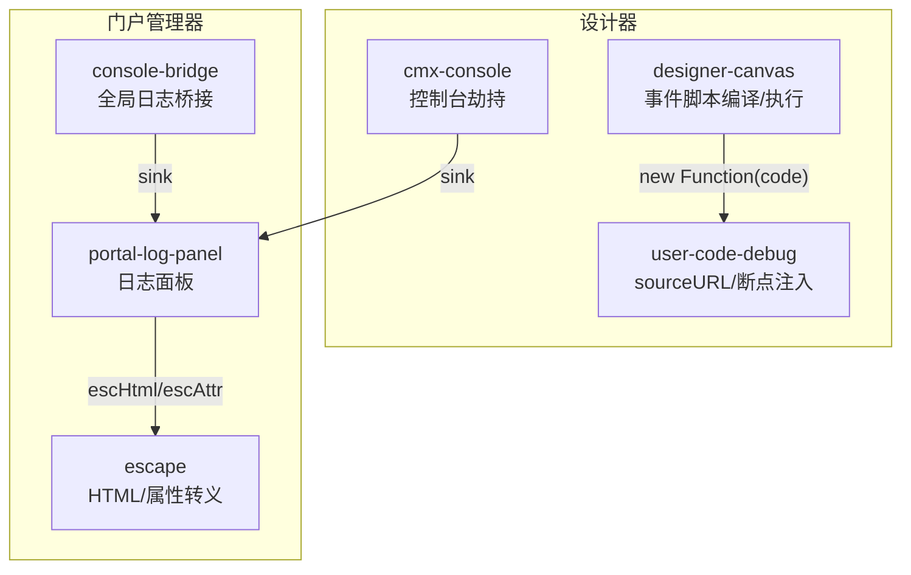
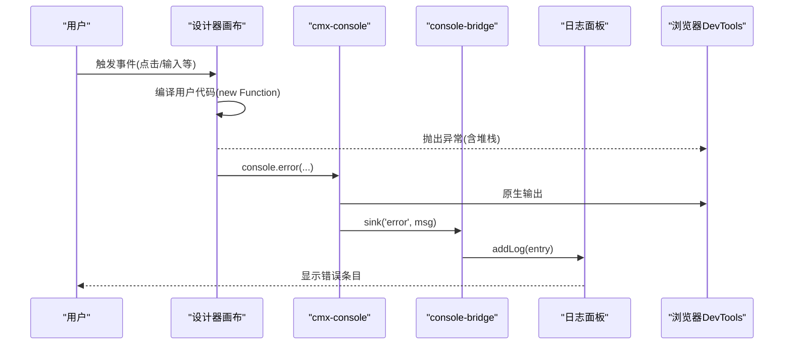
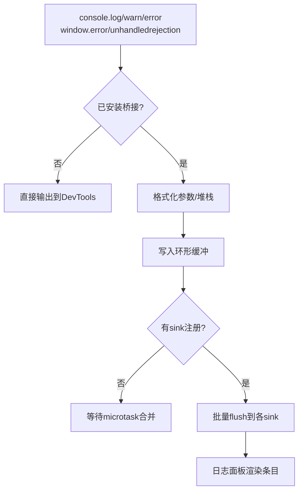
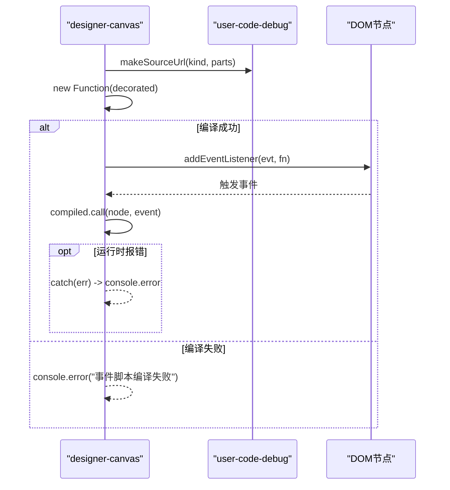
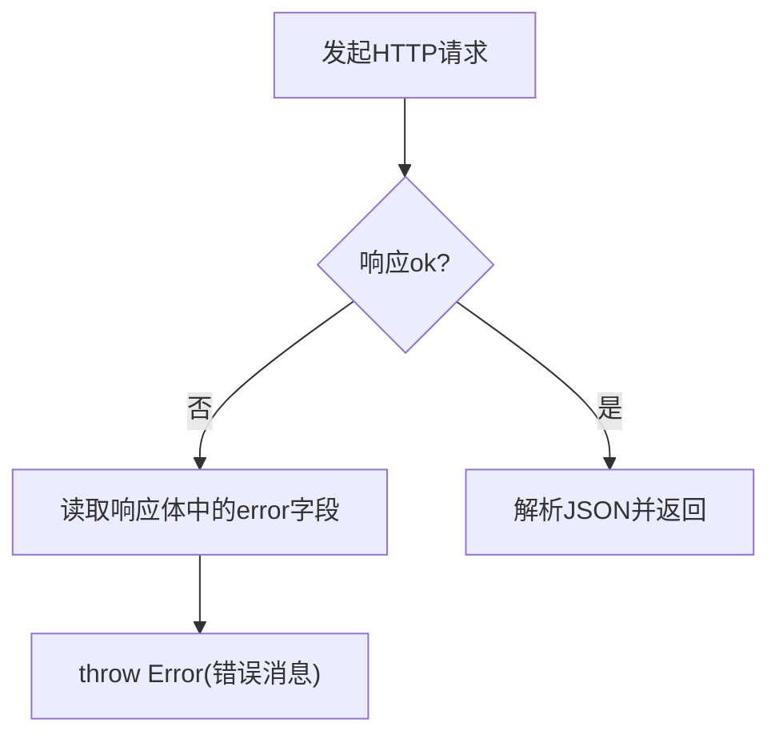
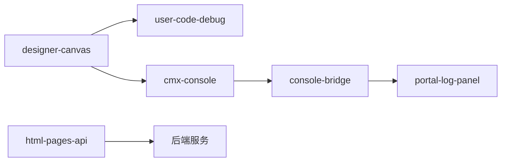

# 运行时错误排查

<cite>
**本文引用的文件**
- [CMXHTMLDesigner/src/utils/cmx-console.js](file://CMXHTMLDesigner/src/utils/cmx-console.js)
- [CMXPortalManager/src/lib/console-bridge.js](file://CMXPortalManager/src/lib/console-bridge.js)
- [CMXPortalManager/src/components/portal-log-panel.js](file://CMXPortalManager/src/components/portal-log-panel.js)
- [CMXHTMLDesigner/src/utils/user-code-debug.js](file://CMXHTMLDesigner/src/utils/user-code-debug.js)
- [CMXHTMLDesigner/src/components/designer-canvas.js](file://CMXHTMLDesigner/src/components/designer-canvas.js)
- [CMXPortalManager/src/lib/escape.js](file://CMXPortalManager/src/lib/escape.js)
- [CMXHTMLDesigner/src/api/html-pages-api.js](file://CMXHTMLDesigner/src/api/html-pages-api.js)
- [CMXHTMLDesigner/quality-assessment-report.md](file://CMXHTMLDesigner/quality-assessment-report.md)
- [CMXPortalManager/CMXPortalManager-评估报告.md](file://CMXPortalManager/CMXPortalManager-评估报告.md)
</cite>

## 目录
1. [简介](#简介)
2. [项目结构](#项目结构)
3. [核心组件](#核心组件)
4. [架构总览](#架构总览)
5. [详细组件分析](#详细组件分析)
6. [依赖关系分析](#依赖关系分析)
7. [性能与稳定性考量](#性能与稳定性考量)
8. [故障排查指南](#故障排查指南)
9. [结论](#结论)
10. [附录：安全加固建议](#附录：安全加固建议)

## 简介
本指南面向 CMX 企业门户平台（设计器与门户管理器）的运行时问题定位与排障，覆盖应用启动、页面加载、组件渲染阶段的常见错误类型与解决策略，包括 JavaScript 运行时异常、API 调用失败、数据绑定错误、事件处理异常等。文档同时说明如何使用内置的 cmx-console 调试工具与浏览器开发者工具进行错误定位，提供日志分析方法、堆栈跟踪解读技巧，并针对设计器与门户管理器的特定场景给出排错方案。最后基于质量评估报告中的安全问题（如 XSS、动态脚本执行风险）给出防护建议。

## 项目结构
- 设计器（CMXHTMLDesigner）：负责可视化编辑 HTML 页面、事件脚本编译与运行、画布交互等。
- 门户管理器（CMXPortalManager）：负责门户 Shell、工作区与标签页、日志面板、页面预览与沙箱执行等。
- 公共能力：控制台桥接、转义工具、用户代码调试辅助等。

图表来源
- [CMXHTMLDesigner/src/utils/cmx-console.js:1-84](file://CMXHTMLDesigner/src/utils/cmx-console.js#L1-L84)
- [CMXPortalManager/src/lib/console-bridge.js:1-169](file://CMXPortalManager/src/lib/console-bridge.js#L1-L169)
- [CMXPortalManager/src/components/portal-log-panel.js:1-635](file://CMXPortalManager/src/components/portal-log-panel.js#L1-L635)
- [CMXHTMLDesigner/src/utils/user-code-debug.js:1-60](file://CMXHTMLDesigner/src/utils/user-code-debug.js#L1-L60)
- [CMXHTMLDesigner/src/components/designer-canvas.js:920-950](file://CMXHTMLDesigner/src/components/designer-canvas.js#L920-L950)
- [CMXPortalManager/src/lib/escape.js:1-35](file://CMXPortalManager/src/lib/escape.js#L1-L35)

章节来源
- [CMXHTMLDesigner/src/utils/cmx-console.js:1-84](file://CMXHTMLDesigner/src/utils/cmx-console.js#L1-L84)
- [CMXPortalManager/src/lib/console-bridge.js:1-169](file://CMXPortalManager/src/lib/console-bridge.js#L1-L169)
- [CMXPortalManager/src/components/portal-log-panel.js:1-635](file://CMXPortalManager/src/components/portal-log-panel.js#L1-L635)
- [CMXHTMLDesigner/src/utils/user-code-debug.js:1-60](file://CMXHTMLDesigner/src/utils/user-code-debug.js#L1-L60)
- [CMXHTMLDesigner/src/components/designer-canvas.js:920-950](file://CMXHTMLDesigner/src/components/designer-canvas.js#L920-L950)
- [CMXPortalManager/src/lib/escape.js:1-35](file://CMXPortalManager/src/lib/escape.js#L1-L35)

## 核心组件
- 控制台桥接与日志面板
  - 设计器侧通过安装 console 劫持，将 log/warn/error 双写到 DevTools 与自定义 sink。
  - 门户管理器侧统一捕获 console.*、window.error、unhandledrejection，限流合并后推送到注册的 sink（日志面板）。
  - 日志面板提供输出、问题、终端、调试控制台多标签视图，支持导出与自动滚动。
- 用户代码调试
  - 为 new Function 生成的用户代码注入稳定 sourceURL，便于在 Sources 面板持久化断点；可开启进入即暂停模式。
- 事件脚本编译与执行
  - 设计器画布将用户编写的事件处理器代码编译为函数并挂载到节点事件上，包含编译期与运行期错误捕获。
- 安全转义
  - 统一的 HTML/属性转义工具，避免内联模板拼接导致的 XSS。

章节来源
- [CMXHTMLDesigner/src/utils/cmx-console.js:1-84](file://CMXHTMLDesigner/src/utils/cmx-console.js#L1-L84)
- [CMXPortalManager/src/lib/console-bridge.js:1-169](file://CMXPortalManager/src/lib/console-bridge.js#L1-L169)
- [CMXPortalManager/src/components/portal-log-panel.js:1-635](file://CMXPortalManager/src/components/portal-log-panel.js#L1-L635)
- [CMXHTMLDesigner/src/utils/user-code-debug.js:1-60](file://CMXHTMLDesigner/src/utils/user-code-debug.js#L1-L60)
- [CMXHTMLDesigner/src/components/designer-canvas.js:920-950](file://CMXHTMLDesigner/src/components/designer-canvas.js#L920-L950)
- [CMXPortalManager/src/lib/escape.js:1-35](file://CMXPortalManager/src/lib/escape.js#L1-L35)

## 架构总览
下图展示了从“用户操作”到“日志落盘”的关键路径，以及错误如何被捕获并呈现给开发者。

图表来源
- [CMXHTMLDesigner/src/components/designer-canvas.js:920-950](file://CMXHTMLDesigner/src/components/designer-canvas.js#L920-L950)
- [CMXHTMLDesigner/src/utils/cmx-console.js:33-79](file://CMXHTMLDesigner/src/utils/cmx-console.js#L33-L79)
- [CMXPortalManager/src/lib/console-bridge.js:88-135](file://CMXPortalManager/src/lib/console-bridge.js#L88-L135)
- [CMXPortalManager/src/components/portal-log-panel.js:68-70](file://CMXPortalManager/src/components/portal-log-panel.js#L68-L70)

## 详细组件分析

### 控制台桥接与日志面板
- 设计器控制台桥接
  - 劫持 console.log/warn/error，保留原生引用，避免递归；将格式化后的消息投递到 sink。
  - 适合在设计器内部将日志转发到 inspector 或自定义区域。
- 门户管理器控制台桥接
  - 单例安装，拦截 console.*、window.error、unhandledrejection，统一格式化为 entry 并写入环形缓冲。
  - 使用 microtask 批量 flush，避免高频日志阻塞渲染线程；注册 sink 时回放历史日志。
- 日志面板
  - 订阅 sink，按级别渲染输出与问题列表；限制最大条目数，支持清空与导出。
  - 所有动态内容均经过 escHtml/escAttr 转义，避免 XSS。

图表来源
- [CMXPortalManager/src/lib/console-bridge.js:17-83](file://CMXPortalManager/src/lib/console-bridge.js#L17-L83)
- [CMXPortalManager/src/lib/console-bridge.js:88-135](file://CMXPortalManager/src/lib/console-bridge.js#L88-L135)
- [CMXPortalManager/src/components/portal-log-panel.js:68-70](file://CMXPortalManager/src/components/portal-log-panel.js#L68-L70)

章节来源
- [CMXHTMLDesigner/src/utils/cmx-console.js:1-84](file://CMXHTMLDesigner/src/utils/cmx-console.js#L1-L84)
- [CMXPortalManager/src/lib/console-bridge.js:1-169](file://CMXPortalManager/src/lib/console-bridge.js#L1-L169)
- [CMXPortalManager/src/components/portal-log-panel.js:1-635](file://CMXPortalManager/src/components/portal-log-panel.js#L1-L635)

### 事件脚本编译与执行（设计器）
- 流程要点
  - 将用户编写的代码包装为 Function，附加稳定的 sourceURL，便于断点持久化。
  - 编译期错误（语法错误）与运行期错误（逻辑异常）分别捕获并记录。
  - 事件监听器以闭包形式挂载到节点，并在卸载时移除，避免内存泄漏。
- 常见问题
  - 语法错误：检查事件脚本是否合法 JS。
  - 运行时异常：查看日志面板的错误条目与堆栈信息。
  - 断点调试：开启设计器调试模式，进入用户代码即暂停。

图表来源
- [CMXHTMLDesigner/src/components/designer-canvas.js:920-950](file://CMXHTMLDesigner/src/components/designer-canvas.js#L920-L950)
- [CMXHTMLDesigner/src/utils/user-code-debug.js:18-37](file://CMXHTMLDesigner/src/utils/user-code-debug.js#L18-L37)

章节来源
- [CMXHTMLDesigner/src/components/designer-canvas.js:920-950](file://CMXHTMLDesigner/src/components/designer-canvas.js#L920-L950)
- [CMXHTMLDesigner/src/utils/user-code-debug.js:1-60](file://CMXHTMLDesigner/src/utils/user-code-debug.js#L1-L60)

### API 调用失败（设计器）
- 行为特征
  - 对后端 REST 接口返回非 2xx 状态码时抛出错误，错误消息优先解析响应体中的 error 字段。
  - 请求参数会进行 URL 编码，避免特殊字符导致的路径问题。
- 常见问题
  - 网络不可用或服务端 5xx：查看日志面板中由桥接捕获的 unhandledrejection 或 console.error。
  - 权限不足或资源不存在：根据错误消息定位具体资源 ID。
  - 批量获取部分失败：关注 errors 字段中的 id 与 error 明细。

图表来源
- [CMXHTMLDesigner/src/api/html-pages-api.js:7-14](file://CMXHTMLDesigner/src/api/html-pages-api.js#L7-L14)
- [CMXHTMLDesigner/src/api/html-pages-api.js:25-94](file://CMXHTMLDesigner/src/api/html-pages-api.js#L25-L94)

章节来源
- [CMXHTMLDesigner/src/api/html-pages-api.js:1-94](file://CMXHTMLDesigner/src/api/html-pages-api.js#L1-L94)

### 数据绑定与渲染错误（门户管理器）
- 日志面板渲染
  - 所有动态文本与属性值均通过 escHtml/escAttr 转义，避免 XSS。
  - 当日志条目过多时，仅保留最近 N 条，避免 DOM 膨胀。
- 常见问题
  - 渲染空白：确认日志面板是否正确订阅了 console-bridge 的 sink。
  - 样式异常：检查主题变量与 CSS 类名是否被正确注入。
  - 导出失败：Blob 创建或下载被浏览器拦截时，检查弹窗策略。

章节来源
- [CMXPortalManager/src/components/portal-log-panel.js:1-635](file://CMXPortalManager/src/components/portal-log-panel.js#L1-L635)
- [CMXPortalManager/src/lib/escape.js:1-35](file://CMXPortalManager/src/lib/escape.js#L1-L35)

## 依赖关系分析
- 松耦合点
  - 日志面板通过 addConsoleSink 订阅日志，不关心上游来源（console、window.error、unhandledrejection）。
  - 设计器控制台桥接与门户管理器控制台桥接职责分离，前者用于设计器内部 sink 转发，后者用于全局统一收集。
- 关键依赖链
  - designer-canvas → user-code-debug → new Function（存在安全风险，见附录）
  - console-bridge → portal-log-panel（日志展示）
  - html-pages-api → 后端 /api/html-pages（REST）

图表来源
- [CMXHTMLDesigner/src/components/designer-canvas.js:920-950](file://CMXHTMLDesigner/src/components/designer-canvas.js#L920-L950)
- [CMXHTMLDesigner/src/utils/user-code-debug.js:18-37](file://CMXHTMLDesigner/src/utils/user-code-debug.js#L18-L37)
- [CMXHTMLDesigner/src/utils/cmx-console.js:33-79](file://CMXHTMLDesigner/src/utils/cmx-console.js#L33-L79)
- [CMXPortalManager/src/lib/console-bridge.js:88-135](file://CMXPortalManager/src/lib/console-bridge.js#L88-L135)
- [CMXPortalManager/src/components/portal-log-panel.js:68-70](file://CMXPortalManager/src/components/portal-log-panel.js#L68-L70)
- [CMXHTMLDesigner/src/api/html-pages-api.js:25-94](file://CMXHTMLDesigner/src/api/html-pages-api.js#L25-L94)

章节来源
- [CMXHTMLDesigner/src/components/designer-canvas.js:920-950](file://CMXHTMLDesigner/src/components/designer-canvas.js#L920-L950)
- [CMXHTMLDesigner/src/utils/user-code-debug.js:1-60](file://CMXHTMLDesigner/src/utils/user-code-debug.js#L1-L60)
- [CMXHTMLDesigner/src/utils/cmx-console.js:1-84](file://CMXHTMLDesigner/src/utils/cmx-console.js#L1-L84)
- [CMXPortalManager/src/lib/console-bridge.js:1-169](file://CMXPortalManager/src/lib/console-bridge.js#L1-L169)
- [CMXPortalManager/src/components/portal-log-panel.js:1-635](file://CMXPortalManager/src/components/portal-log-panel.js#L1-L635)
- [CMXHTMLDesigner/src/api/html-pages-api.js:1-94](file://CMXHTMLDesigner/src/api/html-pages-api.js#L1-L94)

## 性能与稳定性考量
- 日志批处理
  - 使用 queueMicrotask 合并多条日志，减少 UI 更新频率，避免频繁重排。
- 缓冲区限制
  - 环形缓冲限制最大条目数，防止内存增长；日志面板也限制最大条目数。
- 事件监听清理
  - 设计器画布在卸载时移除事件监听器，避免内存泄漏。
- 首屏与体积
  - 门户管理器采用 Vite 手动分块策略，UI5 相关库单独打包，降低主包体积。

章节来源
- [CMXPortalManager/src/lib/console-bridge.js:59-83](file://CMXPortalManager/src/lib/console-bridge.js#L59-L83)
- [CMXPortalManager/src/components/portal-log-panel.js:127-157](file://CMXPortalManager/src/components/portal-log-panel.js#L127-L157)
- [CMXHTMLDesigner/src/components/designer-canvas.js:939-943](file://CMXHTMLDesigner/src/components/designer-canvas.js#L939-L943)

## 故障排查指南

### 应用启动阶段
- 现象
  - 页面白屏、控制台无日志、日志面板无输出。
- 可能原因
  - 控制台桥接未安装或已被卸载；日志面板未订阅 sink。
  - 第三方脚本阻止了 console 方法或 window.onerror。
- 排查步骤
  - 确认 installConsoleBridge 已调用且未被重复卸载。
  - 打开浏览器控制台，观察是否有 unhandledrejection 或 window.error 事件。
  - 在日志面板中查看“问题”标签，过滤错误级别。
  - 若使用设计器，确认 installCmxConsoleTap 已安装并将 sink 指向日志面板。

章节来源
- [CMXPortalManager/src/lib/console-bridge.js:88-135](file://CMXPortalManager/src/lib/console-bridge.js#L88-L135)
- [CMXPortalManager/src/components/portal-log-panel.js:68-70](file://CMXPortalManager/src/components/portal-log-panel.js#L68-L70)
- [CMXHTMLDesigner/src/utils/cmx-console.js:33-79](file://CMXHTMLDesigner/src/utils/cmx-console.js#L33-L79)

### 页面加载阶段
- 现象
  - 页面资源加载失败、API 报错、页面内容不完整。
- 可能原因
  - 后端接口返回非 2xx；网络异常；跨域限制。
  - 页面元数据缺失或格式不正确。
- 排查步骤
  - 查看 Network 面板，确认请求状态码与响应体。
  - 在日志面板中搜索 HTTP 错误相关的 console.error 或 unhandledrejection。
  - 对于批量获取，检查 errors 字段中的具体 id 与错误信息。
  - 校验请求参数是否被正确编码。

章节来源
- [CMXHTMLDesigner/src/api/html-pages-api.js:7-14](file://CMXHTMLDesigner/src/api/html-pages-api.js#L7-L14)
- [CMXHTMLDesigner/src/api/html-pages-api.js:25-94](file://CMXHTMLDesigner/src/api/html-pages-api.js#L25-L94)

### 组件渲染阶段
- 现象
  - 组件不显示、样式错乱、动态内容未渲染。
- 可能原因
  - 数据绑定失败；模板拼接未转义；Shadow DOM 隔离导致选择器失效。
- 排查步骤
  - 检查日志面板中的警告与错误条目。
  - 确认所有动态内容通过 escHtml/escAttr 转义。
  - 使用 Elements 面板检查 Shadow DOM 结构与类名。
  - 若涉及 UI5 组件，确认组件库已正确加载与主题配置。

章节来源
- [CMXPortalManager/src/lib/escape.js:1-35](file://CMXPortalManager/src/lib/escape.js#L1-L35)
- [CMXPortalManager/src/components/portal-log-panel.js:587-603](file://CMXPortalManager/src/components/portal-log-panel.js#L587-L603)

### 事件处理异常（设计器）
- 现象
  - 用户事件无响应、控制台出现“事件脚本编译失败”或“事件脚本错误”。
- 可能原因
  - 事件脚本语法错误；运行时抛异常；事件监听器未正确挂载或卸载。
- 排查步骤
  - 打开设计器调试模式，进入用户代码即暂停，逐步定位问题。
  - 查看日志面板的错误条目与堆栈信息。
  - 确认事件监听器在组件卸载时被移除，避免内存泄漏。

章节来源
- [CMXHTMLDesigner/src/components/designer-canvas.js:920-950](file://CMXHTMLDesigner/src/components/designer-canvas.js#L920-L950)
- [CMXHTMLDesigner/src/utils/user-code-debug.js:18-37](file://CMXHTMLDesigner/src/utils/user-code-debug.js#L18-L37)

### 数据绑定错误
- 现象
  - 表单字段未回显、表格列数据为空、下拉选项缺失。
- 可能原因
  - 模型数据结构不匹配；字段键不一致；异步数据未正确更新视图。
- 排查步骤
  - 在日志面板中查找与数据绑定相关的 warn/error。
  - 使用浏览器控制台打印模型对象，确认结构与预期一致。
  - 检查 API 返回的数据是否与前端期望的字段名一致。

[本节为通用指导，不直接分析具体文件]

### 使用内置调试工具
- 设计器 cmx-console
  - 用途：将 console.* 输出双写到 DevTools 与自定义 sink。
  - 使用：确保 installCmxConsoleTap 已安装，并传入 sink 函数。
- 门户管理器 console-bridge
  - 用途：统一捕获 console.*、window.error、unhandledrejection，限流合并后推送至 sink。
  - 使用：确保 addConsoleSink 已注册，日志面板会消费日志。
- 浏览器开发者工具
  - Console：查看原始输出与堆栈。
  - Sources：设置断点，查看调用栈与变量。
  - Network：检查请求与响应。
  - Performance：分析卡顿与长任务。

章节来源
- [CMXHTMLDesigner/src/utils/cmx-console.js:33-79](file://CMXHTMLDesigner/src/utils/cmx-console.js#L33-L79)
- [CMXPortalManager/src/lib/console-bridge.js:88-135](file://CMXPortalManager/src/lib/console-bridge.js#L88-L135)
- [CMXPortalManager/src/components/portal-log-panel.js:68-70](file://CMXPortalManager/src/components/portal-log-panel.js#L68-L70)

### 错误日志分析方法
- 优先级
  - 先定位 unhandledrejection 与 window.error，再查看 console.error。
- 关键字
  - “事件脚本编译失败”“事件脚本错误”“HTTP”“fetch”“Error”。
- 堆栈解读
  - 关注文件名、行号、调用栈顺序；结合 SourceMap 定位源码位置。
- 复现与隔离
  - 最小化复现场景；禁用第三方扩展；切换主题/语言验证兼容性。

章节来源
- [CMXPortalManager/src/lib/console-bridge.js:116-135](file://CMXPortalManager/src/lib/console-bridge.js#L116-L135)
- [CMXHTMLDesigner/src/components/designer-canvas.js:920-950](file://CMXHTMLDesigner/src/components/designer-canvas.js#L920-L950)

### 设计器特定错误场景
- 动态执行用户代码的风险
  - 使用 new Function 执行用户脚本，存在 XSS/任意代码执行风险。
  - 缓解：使用 Web Worker 沙箱或 CSP 限制；服务端对脚本做安全扫描。
- 性能问题
  - O(n²) 节点查找可能导致卡顿；复杂 DOM 下优化查找算法或使用缓存。
- 事件监听器泄漏
  - 确保在 disconnectedCallback 中清理 window 级别的事件监听。

章节来源
- [CMXHTMLDesigner/quality-assessment-report.md:140-190](file://CMXHTMLDesigner/quality-assessment-report.md#L140-L190)

### 门户管理器特定错误场景
- 动态脚本执行
  - 从服务器加载 HTML 页面后执行其中的 script，存在注入风险。
  - 缓解：使用 iframe sandbox 隔离；服务端内容安全扫描；CSP 限制。
- 认证/授权缺失
  - 后端 API 无鉴权中间件，任何人可读写数据。
  - 缓解：添加认证与授权中间件；限制访问源。
- 路径遍历
  - 使用传入参数构建文件路径，需验证结果路径是否在预期目录内。

章节来源
- [CMXPortalManager/CMXPortalManager-评估报告.md:440-530](file://CMXPortalManager/CMXPortalManager-评估报告.md#L440-L530)

## 结论
- 日志体系完善：设计器与门户管理器均提供了控制台桥接与日志面板，便于快速定位问题。
- 事件脚本调试友好：通过 sourceURL 与调试模式，可在 DevTools 中精准断点。
- 安全风险需重视：动态脚本执行与 XSS 风险需要严格防护，建议在沙箱与 CSP 层面加固。
- 性能与稳定性：日志批处理与缓冲区限制有效降低了开销；需注意事件监听器清理与算法复杂度。

[本节为总结性内容，不直接分析具体文件]

## 附录：安全加固建议
- 消除动态代码执行风险
  - 避免在生产环境直接使用 new Function 执行用户代码；改用受限的执行环境（Web Worker、沙箱）。
- 强化 XSS 防护
  - 所有动态内容必须通过 escHtml/escAttr 转义；禁止 innerHTML 直接拼接用户输入。
- 引入内容安全策略（CSP）
  - 限制脚本来源与执行上下文；对 iframe 启用 sandbox。
- 加强认证与授权
  - 后端 API 增加鉴权中间件；前端校验会话与权限。
- 输入校验与路径安全
  - 对用户输入进行白名单校验；文件路径使用前缀校验与 resolve 验证。
- 依赖与漏洞管理
  - 定期执行 npm audit；升级已知漏洞依赖。

章节来源
- [CMXHTMLDesigner/quality-assessment-report.md:140-190](file://CMXHTMLDesigner/quality-assessment-report.md#L140-L190)
- [CMXPortalManager/CMXPortalManager-评估报告.md:440-530](file://CMXPortalManager/CMXPortalManager-评估报告.md#L440-L530)
- [CMXPortalManager/src/lib/escape.js:1-35](file://CMXPortalManager/src/lib/escape.js#L1-L35)